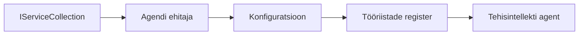

# 🎨 Agendi disainimustrid Azure OpenAI-ga (Responses API) (.NET)

## 📋 Õpieesmärgid

See näide demonstreerib ettevõtte tasemel disainimustreid intelligentsete agentide ehitamiseks Microsoft Agent Frameworki abil .NET-is koos Azure OpenAI (Responses API) integratsiooniga. Õpid professionaalseid mustreid ja arhitektuurilisi lähenemisi, mis teevad agentidest tootmisvalmis, hõlpsasti hooldatavad ja skaleeritavad.

### Ettevõtte disainimustrid

- 🏭 **Tööstusmuster (Factory Pattern)**: Standardiseeritud agentide loomine sõltuvussüsti abil
- 🔧 **Builder-muster**: Sujuv agendi konfiguratsioon ja seadistamine
- 🧵 **Lõime-turvalised mustrid**: Korraga toimuv vestluse haldamine
- 📋 **Kataloogimuster (Repository Pattern)**: Korraldatud tööriistade ja võimekuste haldamine

## 🎯 .NET-spetsiifilised arhitektuuri eelised

### Ettevõtte funktsioonid

- **Tugev tüpiseerimine**: Kompileerimisaja valideerimine ja IntelliSense tugi
- **Sõltuvussüsti (Dependency Injection)**: Sisseehitatud DI konteineri integratsioon
- **Konfiguratsiooni haldus**: IConfiguration ja Options kontseptsioonid
- **Async/Await**: Esmaklassiline asünkroonse programmeerimise tugi

### Tootmisvalmis mustrid

- **Logimise integratsioon**: ILogger ja struktureeritud logimise tugi
- **Tervisekontrollid**: Sisseehitatud jälgimine ja diagnostika
- **Konfiguratsiooni valideerimine**: Tugev tüpiseerimine koos andmesiltidega
- **Vigade käsitlemine**: Struktureeritud erandite haldus

## 🔧 Tehniline arhitektuur

### Põhilised .NET komponendid

- **Microsoft.Extensions.AI**: Ühtsed tehisintellekti teenuste abstraktsioonid
- **Microsoft.Agents.AI**: Ettevõtte tasemel agentide orkestreerimise raamistik
- **Azure OpenAI (Responses API)**: Kõrge jõudlusega API kliendi mustrid
- **Konfiguratsioonisüsteem**: appsettings.json ja keskkonna integratsioon

### Disainimustri teostus



## 🏗️ Näidatud ettevõtte mustrid

### 1. **Loomemustrid (Creational Patterns)**

- **Agendi tehas (Agent Factory)**: Keskne agentide loomine järjepideva konfiguratsiooniga
- **Builder-muster**: Sujuv API keerukate agentide seadistamiseks
- **Singleton-muster**: Jagatud ressursid ja konfiguratsiooni haldus
- **Sõltuvussüsti**: Lahtine haakumine ja testitavus

### 2. **Käitumuslikud mustrid (Behavioral Patterns)**

- **Strateegiamuster**: Vahetatavad tööriista täitmiskomplektid
- **Käskude muster (Command Pattern)**: Kapseldatud agendi toimingud koos tagasivõtu/taastamisega
- **Vaatajamuster (Observer Pattern)**: Sündmuspõhine agendi elutsükli haldus
- **Mallimeetod (Template Method)**: Standardiseeritud agendi töövoogude juhised

### 3. **Struktuurilised mustrid (Structural Patterns)**

- **Adapterimuster**: Azure OpenAI (Responses API) integratsioonikiht
- **Dekoraatormuster**: Agendi võimekuse täiustamine
- **Fassaadimuster**: Lihtsustatud agendi suhtlusliidesed
- **Proxymuster**: Laisk laadimine ja vahemällu salvestamine parema jõudluse jaoks

## 📚 .NET disainipõhimõtted

### SOLID põhimõtted

- **Ühe vastutuse põhimõte**: Iga komponentil on üks selge eesmärk
- **Avatud/suletud põhimõte**: Laiendatav ilma modifikatsioonideta
- **Liskovi asenduspõhimõte**: Liidestel põhinevad tööriistade teostused
- **Liideste segregatsiooni põhimõte**: Keskendunud, kokkuhoidlikud liidesed
- **Sõltuvuste inversioonipõhimõte**: Sõltu abstraktsioonidest, mitte konkreetsetest teostustest

### Puhas arhitektuur

- **Domeenikiht**: Põhilised agendi ja tööriistade abstraktsioonid
- **Rakenduskiht**: Agendi orkestreerimine ja töövood
- **Tugikiht**: Azure OpenAI (Responses API) integratsioon ja välisteenused
- **Esitluskiht**: Kasutaja suhtlus ja vastuste vormindamine

## 🔒 Ettevõtte kaalutlused

### Turvalisus

- **Mandaatide haldus**: Turvaline API võtmepõhine käsitlemine IConfiguration abil
- **Sisendi valideerimine**: Tugev tüpiseerimine ja andmesiltide valideerimine
- **Väljundi puhastamine**: Turvaline vastuste töötlemine ja filtreerimine
- **Auditilogimine**: Kõikehõlmav toimingute jälgimine

### Jõudlus

- **Asünkroonsete mustrite kasutamine**: Mitteblokeerivad I/O operatsioonid
- **Ühenduste pookimine**: Tõhus HTTP kliendi haldus
- **Vahemällu salvestamine**: Vastuste vahemällu talletamine parema jõudluse jaoks
- **Resursside haldus**: Õige puhastuse ja vabanemise mustrid

### Skaleeritavus

- **Lõimeturvalisus**: Korraga toimuvate agentide täitmise tugi
- **Ressursside pookimine**: Tõhus ressursikasutus
- **Koormuse haldus**: Kiirusepiirang ja tagasi-surve juhtimine
- **Jälgimine**: Jõudlusmõõdikud ja tervisekontrollid

## 🚀 Tootmisse viimine

- **Konfiguratsiooni haldus**: Keskkonnapõhised sätted
- **Logimise strateegia**: Struktureeritud logimine seose ID-dega
- **Vigade käsitlemine**: Ülemaailmne erandite haldus koos nõuetekohase taastumisega
- **Jälgimine**: Rakenduse ülevaated ja jõudlusloendurid
- **Testimine**: Ühiktestid, integratsioonitestid ja koormustestimise mustrid

Valmis ehitama ettevõtte tasemel intelligentseid agente .NET-iga? Kujundame midagi vastupidavat! 🏢✨

## 🚀 Alustamine

### Eeltingimused

- [.NET 10 SDK](https://dotnet.microsoft.com/download/dotnet/10.0) või uuem
- [Azure tellimus](https://azure.microsoft.com/free/) koos Azure OpenAI ressursi ja mudeli juurutusega
- [Azure CLI](https://learn.microsoft.com/cli/azure/install-azure-cli) — sisselogimine `az login` abil

### Nõutavad keskkonnamuutujad

```bash
# zsh/bash
export AZURE_OPENAI_ENDPOINT=https://<your-resource>.openai.azure.com
export AZURE_OPENAI_DEPLOYMENT=gpt-4o-mini
# Seejärel logi sisse, et AzureCliCredential saaks tokeni saada
az login
```

```powershell
# PowerShell
$env:AZURE_OPENAI_ENDPOINT = "https://<your-resource>.openai.azure.com"
$env:AZURE_OPENAI_DEPLOYMENT = "gpt-4o-mini"
# Seejärel logige sisse, et AzureCliCredential saaks tokeni hankida
az login
```

### Näidiscode

Koodi näite käivitamiseks,

```bash
# zsh/bash
chmod +x ./03-dotnet-agent-framework.cs
./03-dotnet-agent-framework.cs
```

Või kasutades dotnet CLI-d:

```bash
dotnet run ./03-dotnet-agent-framework.cs
```

Vaata täielikku koodi failist [`03-dotnet-agent-framework.cs`](../../../../03-agentic-design-patterns/code_samples/03-dotnet-agent-framework.cs).

```csharp
#!/usr/bin/dotnet run

#:package Microsoft.Extensions.AI@10.*
#:package Microsoft.Agents.AI.OpenAI@1.*-*
#:package Azure.AI.OpenAI@2.1.0
#:package Azure.Identity@1.13.1

using System.ComponentModel;

using Microsoft.Agents.AI;
using Microsoft.Extensions.AI;

using Azure.AI.OpenAI;
using Azure.Identity;

// Tool Function: Random Destination Generator
// This static method will be available to the agent as a callable tool
// The [Description] attribute helps the AI understand when to use this function
// This demonstrates how to create custom tools for AI agents
[Description("Provides a random vacation destination.")]
static string GetRandomDestination()
{
    // List of popular vacation destinations around the world
    // The agent will randomly select from these options
    var destinations = new List<string>
    {
        "Paris, France",
        "Tokyo, Japan",
        "New York City, USA",
        "Sydney, Australia",
        "Rome, Italy",
        "Barcelona, Spain",
        "Cape Town, South Africa",
        "Rio de Janeiro, Brazil",
        "Bangkok, Thailand",
        "Vancouver, Canada"
    };

    // Generate random index and return selected destination
    // Uses System.Random for simple random selection
    var random = new Random();
    int index = random.Next(destinations.Count);
    return destinations[index];
}

// Azure OpenAI with the Responses API (stable v1 endpoint). Sign in with `az login`.
var azureEndpoint = Environment.GetEnvironmentVariable("AZURE_OPENAI_ENDPOINT")
    ?? throw new InvalidOperationException("AZURE_OPENAI_ENDPOINT is not set.");
var deployment = Environment.GetEnvironmentVariable("AZURE_OPENAI_DEPLOYMENT") ?? "gpt-4o-mini";

var azureClient = new AzureOpenAIClient(new Uri(azureEndpoint), new AzureCliCredential());

// Define Agent Identity and Comprehensive Instructions
// Agent name for identification and logging purposes
var AGENT_NAME = "TravelAgent";

// Detailed instructions that define the agent's personality, capabilities, and behavior
// This system prompt shapes how the agent responds and interacts with users
var AGENT_INSTRUCTIONS = """
You are a helpful AI Agent that can help plan vacations for customers.

Important: When users specify a destination, always plan for that location. Only suggest random destinations when the user hasn't specified a preference.

When the conversation begins, introduce yourself with this message:
"Hello! I'm your TravelAgent assistant. I can help plan vacations and suggest interesting destinations for you. Here are some things you can ask me:
1. Plan a day trip to a specific location
2. Suggest a random vacation destination
3. Find destinations with specific features (beaches, mountains, historical sites, etc.)
4. Plan an alternative trip if you don't like my first suggestion

What kind of trip would you like me to help you plan today?"

Always prioritize user preferences. If they mention a specific destination like "Bali" or "Paris," focus your planning on that location rather than suggesting alternatives.
""";

// Create AI Agent with Advanced Travel Planning Capabilities
// Get the Responses client for the deployment and create the AI agent
// Configure agent with name, detailed instructions, and available tools
// This demonstrates the .NET agent creation pattern with full configuration
AIAgent agent = azureClient
    .GetOpenAIResponseClient(deployment)
    .CreateAIAgent(
        name: AGENT_NAME,
        instructions: AGENT_INSTRUCTIONS,
        tools: [AIFunctionFactory.Create(GetRandomDestination)]
    );

// Create New Conversation Thread for Context Management
// Initialize a new conversation thread to maintain context across multiple interactions
// Threads enable the agent to remember previous exchanges and maintain conversational state
// This is essential for multi-turn conversations and contextual understanding
AgentThread thread = agent.GetNewThread();

// Execute Agent: First Travel Planning Request
// Run the agent with an initial request that will likely trigger the random destination tool
// The agent will analyze the request, use the GetRandomDestination tool, and create an itinerary
// Using the thread parameter maintains conversation context for subsequent interactions
await foreach (var update in agent.RunStreamingAsync("Plan me a day trip", thread))
{
    await Task.Delay(10);
    Console.Write(update);
}

Console.WriteLine();

// Execute Agent: Follow-up Request with Context Awareness
// Demonstrate contextual conversation by referencing the previous response
// The agent remembers the previous destination suggestion and will provide an alternative
// This showcases the power of conversation threads and contextual understanding in .NET agents
await foreach (var update in agent.RunStreamingAsync("I don't like that destination. Plan me another vacation.", thread))
{
    await Task.Delay(10);
    Console.Write(update);
}
```

---

<!-- CO-OP TRANSLATOR DISCLAIMER START -->
**Lahtiütlus**:
See dokument on tõlgitud kasutades AI tõlketeenust [Co-op Translator](https://github.com/Azure/co-op-translator). Kuigi me püüdleme täpsuse poole, palun pange tähele, et automatiseeritud tõlgetes võib esineda vigu või ebatäpsusi. Originaaldokument selle emakeeles tuleks pidada autoriteetseks allikaks. Olulise teabe puhul soovitatakse kasutada professionaalset inimtõlget. Me ei vastuta selle tõlkega seotud eksimustest või valesti mõistmistest.
<!-- CO-OP TRANSLATOR DISCLAIMER END -->