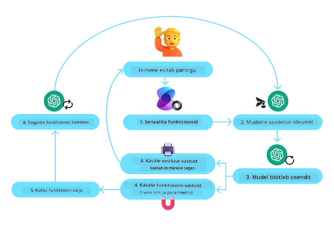
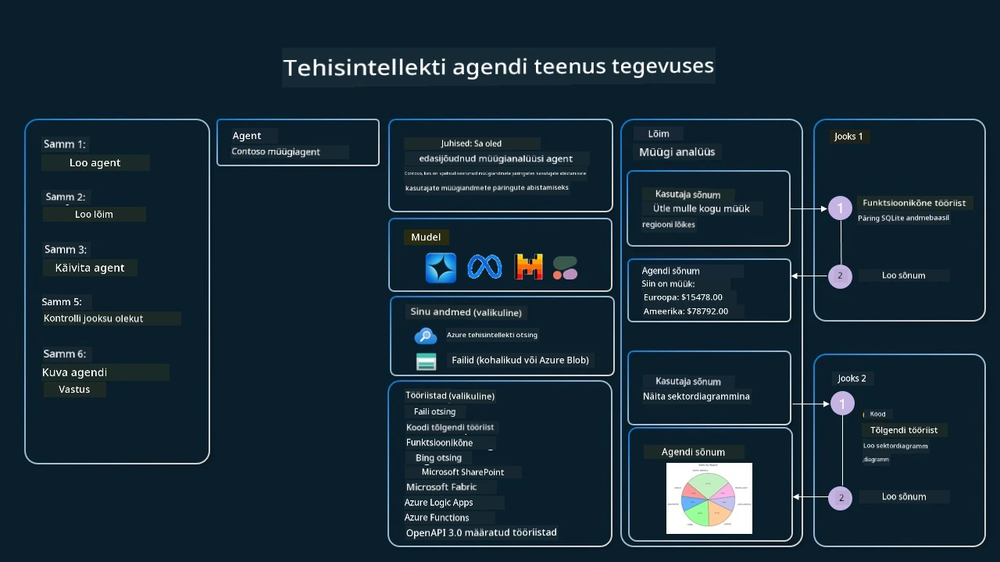

[](https://youtu.be/vieRiPRx-gI?si=cEZ8ApnT6Sus9rhn)

> _(Klõpsa ülaloleval pildil, et vaadata selle õppetunni videot)_

# Tööriistade kasutamise disainimuster

Tööriistad on huvitavad, sest need võimaldavad AI-agentidel omada laiemat võimekust. Selle asemel, et agentil oleks piiratud hulk toiminguid, mida ta saab teha, võimaldab tööriista lisamine agendil nüüd sooritada palju erinevaid toiminguid. Selles peatükis vaatleme Tööriistade kasutamise disainimustrit, mis kirjeldab, kuidas AI-agentid saavad kasutada konkreetseid tööriistu oma eesmärkide saavutamiseks.

## Sissejuhatus

Selles õppetunnis püüame vastata järgmistele küsimustele:

- Mis on tööriistade kasutamise disainimuster?
- Millistel juhtudel seda saab rakendada?
- Millised on elemendid/ehitusplokid, mis on vajalikud disainimustri rakendamiseks?
- Millised on erikohad tööriistade kasutamise disainimustri kasutamisel usaldusväärsete AI-agentide loomiseks?

## Õpieesmärgid

Pärast selle õppetunni läbimist saad:

- Määratleda tööriistade kasutamise disainimustri ja selle eesmärgi.
- Tuvastada kasutusjuhtumeid, kus tööriistade kasutamise disainimuster on kohaldatav.
- Mõista peamisi elemente, mis on vajalikud disainimustri rakendamiseks.
- Tuvastada kaalutlusi usaldusväärsuse tagamiseks AI-agentide puhul, kes kasutavad seda disainimustrit.

## Mis on tööriistade kasutamise disainimuster?

Tööriistade kasutamise disainimuster keskendub suurkeelemudelite (LLM-ide) võimele suhelda välistööriistadega konkreetsete eesmärkide saavutamiseks. Tööriistad on kood, mida agent saab käivitada toimingute sooritamiseks. Tööriist võib olla lihtne funktsioon, nagu kalkulaator, või API-kõne kolmanda osapoole teenusele, näiteks aktsiahindade otsimiseks või ilmaprognoosi saamiseks. AI-agentite kontekstis on tööriistad mõeldud olema agentide poolt täidetavad vastusena mudeli genereeritud funktsioonikõnedele.

## Millistel juhtudel seda saab rakendada?

AI-agentid saavad tööriistu kasutada keerukate ülesannete täitmiseks, teabe hankimiseks või otsuste tegemiseks. Tööriistade kasutamise disainimustrit kasutatakse sageli olukordades, mis nõuavad dünaamilist suhtlust väliste süsteemidega, nagu andmebaasid, veebiteenused või koodi tõlgendajad. See võime on kasulik mitmes erinevas kasutusjuhus, sealhulgas:

- **Dünaamiline info hankimine:** Agendid saavad pärida väliseid API-sid või andmebaase, et hankida ajakohast andmestikku (nt SQLite andmebaasi pärimine andmeanalüüsi jaoks, aktsiahindade või ilmainfo toomine).
- **Koodi käivitamine ja tõlgendamine:** Agendid saavad käivitada koodi või skripte, et lahendada matemaatilisi probleeme, genereerida aruandeid või teha simulatsioone.
- **Töövoo automatiseerimine:** Korduvate või mitmeastmeliste töövoogude automatiseerimine, integreerides tööriistu nagu ülesannete ajastajad, e-posti teenused või andmepipelines.
- **Klienditugi:** Agendid saavad suhelda CRM-süsteemide, piletisüsteemide või teadmistebaasidega, et lahendada kasutajate päringuid.
- **Sisu genereerimine ja redigeerimine:** Agendid saavad kasutada tööriistu nagu grammatikakontrollijad, teksti kokkuvõtjad või sisu turvalisuse hindajad, et abistada sisuloomet.

## Millised on elemendid/ehitusplokid, mis on vajalikud tööriistade kasutamise disainimustri rakendamiseks?

Need ehitusplokid võimaldavad AI-agendil täita laia valikut ülesandeid. Vaatleme peamisi elemente, mis on vajalikud Tööriistade kasutamise disainimustri rakendamiseks:

- **Funktsiooni/tööriista skeemid**: Üksikasjalikud definitsioonid saadaolevatest tööriistadest, sealhulgas funktsiooni nimi, eesmärk, nõutavad parameetrid ja oodatavad väljundid. Need skeemid võimaldavad LLM-il mõista, millised tööriistad on saadaval ja kuidas konstrukteerida kehtivaid päringuid.

- **Funktsiooni täitmise loogika**: Reguleerib, kuidas ja millal tööriistu kutsutakse vastavalt kasutaja kavatsusele ja vestluse kontekstile. See võib sisaldada planeerija mooduleid, suunamismehhanisme või tingimuslikke vooge, mis määravad tööriistade kasutuse dünaamiliselt.

- **Sõnumite käsitlemise süsteem**: Komponendid, mis haldavad vestluse voogu kasutaja sisendite, LLM vastuste, tööriistakõnede ja tööriista väljundite vahel.

- **Tööriistade integreerimise raamistik**: Taristu, mis ühendab agendi erinevate tööriistadega, olgu need siis lihtsad funktsioonid või keerukad välisteenused.

- **Veakäsitlemine ja valideerimine**: Mehhanismid tööriistatäitete ebaõnnestumiste käsitlemiseks, parameetrite valideerimiseks ja ootamatute vastuste haldamiseks.

- **Oleku haldus**: Jälgib vestluse konteksti, varasemaid tööriista interaktsioone ja püsivaid andmeid, et tagada järjepidevus mitmekäigulistes interaktsioonides.

Järgmisena vaatleme funktsioonide/tööriistade kutsumist üksikasjalikumalt.
 
### Funktsioonide/tööriistade kutsumine

Funktsioonikutsumine on peamine viis, kuidas võimaldame suurkeelemudelitel (LLM-idel) tööriistadega suhelda. Sageli näed, et 'Function' ja 'Tool' kasutatakse vaheldumisi, sest 'funktsioonid' (taaskasutatava koodi plokid) on need 'tööriistad', mida agendid kasutavad ülesannete täitmiseks. Selleks, et funktsiooni kood saaks käivituda, peab LLM võrdlema kasutaja päringut funktsiooni kirjeldusega. Selleks saadetakse LLM-ile skeem, mis sisaldab kõigi saadaolevate funktsioonide kirjeldusi. LLM valib seejärel ülesande jaoks kõige sobivama funktsiooni ja tagastab selle nime ja argumendid. Valitud funktsioon kutsutakse esile, selle vastus saadetakse tagasi LLM-ile, mis kasutab informatsiooni kasutaja päringule vastamiseks.

Arendajatel, kes rakendavad funktsioonikutsumist agentide jaoks, on vaja:

1. LLM mudelit, mis toetab funktsioonikutsumist
2. Skeemi, mis sisaldab funktsioonide kirjeldusi
3. Koodi iga kirjeldatud funktsiooni jaoks

Vaatleme illustratiivseks näiteks praeguse aja saamist linnas:

1. **Algatage LLM, mis toetab funktsioonikutsumist:**

    Kõik mudelid ei toeta funktsioonikutsumist, seega on oluline kontrollida, kas kasutatav LLM seda toetab.     <a href="https://learn.microsoft.com/azure/ai-services/openai/how-to/function-calling" target="_blank">Azure OpenAI</a> toetab funktsioonikutsumist. Saame alustada Azure OpenAI kliendi initsialiseerimisest. 

    ```python
    # Initsialiseeri Azure OpenAI klient
    client = AzureOpenAI(
        azure_endpoint = os.getenv("AZURE_AI_PROJECT_ENDPOINT"), 
        api_key=os.getenv("AZURE_OPENAI_API_KEY"),  
        api_version="2024-05-01-preview"
    )
    ```

1. **Loo funktsiooni skeem**:

    Järgmise sammuna määratleme JSON-skeemi, mis sisaldab funktsiooni nime, kirjelduse, mida funktsioon teeb, ning funktsiooni parameetrite nimesid ja kirjeldusi.
    Seejärel võtame selle skeemi ja edastame selle eelnevalt loodud kliendile koos kasutaja päringuga, mis on suunatud kellaaja leidmisele San Franciscos. Oluline on märkida, et tagastatakse **tööriistakutse**, **mitte** lõplik vastus küsimusele. Nagu varem mainitud, tagastab LLM valitud funktsiooni nime ja argumendid, mis talle edastatakse.

    ```python
    # Funktsiooni kirjeldus mudeli lugemiseks
    tools = [
        {
            "type": "function",
            "function": {
                "name": "get_current_time",
                "description": "Get the current time in a given location",
                "parameters": {
                    "type": "object",
                    "properties": {
                        "location": {
                            "type": "string",
                            "description": "The city name, e.g. San Francisco",
                        },
                    },
                    "required": ["location"],
                },
            }
        }
    ]
    ```
   
    ```python
  
    # Algne kasutaja sõnum
    messages = [{"role": "user", "content": "What's the current time in San Francisco"}] 
  
    # Esimene API-kõne: Palu mudelil funktsiooni kasutada
      response = client.chat.completions.create(
          model=deployment_name,
          messages=messages,
          tools=tools,
          tool_choice="auto",
      )
  
      # Töötle mudeli vastust
      response_message = response.choices[0].message
      messages.append(response_message)
  
      print("Model's response:")  

      print(response_message)
  
    ```

    ```bash
    Model's response:
    ChatCompletionMessage(content=None, role='assistant', function_call=None, tool_calls=[ChatCompletionMessageToolCall(id='call_pOsKdUlqvdyttYB67MOj434b', function=Function(arguments='{"location":"San Francisco"}', name='get_current_time'), type='function')])
    ```
  
1. **Funktsiooni kood ülesande täitmiseks:**

    Nüüd, kui LLM on valinud, millist funktsiooni tuleb käivitada, tuleb rakendada ja täita kood, mis ülesande teostab.
    Saame Pythonis implementeerida koodi, mis hangib praeguse aja. Samuti peame kirjutama koodi, mis ekstraktib response_message'ist nime ja argumendid, et saada lõplik tulemus.

    ```python
      def get_current_time(location):
        """Get the current time for a given location"""
        print(f"get_current_time called with location: {location}")  
        location_lower = location.lower()
        
        for key, timezone in TIMEZONE_DATA.items():
            if key in location_lower:
                print(f"Timezone found for {key}")  
                current_time = datetime.now(ZoneInfo(timezone)).strftime("%I:%M %p")
                return json.dumps({
                    "location": location,
                    "current_time": current_time
                })
      
        print(f"No timezone data found for {location_lower}")  
        return json.dumps({"location": location, "current_time": "unknown"})
    ```

     ```python
     # Käsitle funktsioonikõnesid
      if response_message.tool_calls:
          for tool_call in response_message.tool_calls:
              if tool_call.function.name == "get_current_time":
     
                  function_args = json.loads(tool_call.function.arguments)
     
                  time_response = get_current_time(
                      location=function_args.get("location")
                  )
     
                  messages.append({
                      "tool_call_id": tool_call.id,
                      "role": "tool",
                      "name": "get_current_time",
                      "content": time_response,
                  })
      else:
          print("No tool calls were made by the model.")  
  
      # Teine API-kõne: hankida mudeli lõplik vastus
      final_response = client.chat.completions.create(
          model=deployment_name,
          messages=messages,
      )
  
      return final_response.choices[0].message.content
     ```

     ```bash
      get_current_time called with location: San Francisco
      Timezone found for san francisco
      The current time in San Francisco is 09:24 AM.
     ```

Funktsioonikutsumine on enamikus, kui mitte kõigis, agentide tööriistakasutuse disainides keskne, kuid selle nullist rakendamine võib mõnikord olla keeruline.
Nagu õppisime [Õppetund 2](../../../02-explore-agentic-frameworks), pakuvad agentipõhised raamistikud meile eelnevalt ehitatud ehitusplokke tööriistakasutuse realiseerimiseks.
 
## Tööriistade kasutamise näited agentipõhistes raamistikutes

Siin on mõned näited, kuidas saab tööriistade kasutamise disainimustrit rakendada erinevate agentipõhiste raamistikute abil:

### Microsoft Agent Framework

<a href="https://learn.microsoft.com/azure/ai-services/agents/overview" target="_blank">Microsoft Agent Framework</a> on avatud lähtekoodiga AI-raamistik AI-agentide ehitamiseks. See lihtsustab funktsioonikutsumise protsessi, võimaldades määratleda tööriistad Python-funktsioonidena `@tool` dekoratsiooni abil. Raamistik haldab mudeli ja sinu koodi vahelist edasitagasi suhtlust. See pakub ka juurdepääsu eelnevalt ehitatud tööriistadele nagu File Search ja Code Interpreter läbi `AzureAIProjectAgentProvider`.

Järgmine diagramm illustreerib funktsioonikutsumise protsessi Microsoft Agent Frameworkiga:



Microsoft Agent Frameworkis määratletakse tööriistad dekoratiivsete funktsioonidena. Saame teisendada eelnevalt nähtud `get_current_time` funktsiooni tööriistaks, kasutades `@tool` dekoratsiooni. Raamistik serialiseerib automaatselt funktsiooni ja selle parameetrid, luues LLM-ile saadetava skeemi.

```python
from agent_framework import tool
from agent_framework.azure import AzureAIProjectAgentProvider
from azure.identity import AzureCliCredential

@tool
def get_current_time(location: str) -> str:
    """Get the current time for a given location"""
    ...

# Loo klient
provider = AzureAIProjectAgentProvider(credential=AzureCliCredential())

# Loo agent ja käivita see tööriistaga
agent = await provider.create_agent(name="TimeAgent", instructions="Use available tools to answer questions.", tools=get_current_time)
response = await agent.run("What time is it?")
```
  
### Azure AI Agent Service

<a href="https://learn.microsoft.com/azure/ai-services/agents/overview" target="_blank">Azure AI Agent Service</a> on uuem agentipõhine raamistik, mis on loodud selleks, et võimaldada arendajatel turvaliselt ehitada, juurutada ja skaleerida kvaliteetseid ning laiendatavaid AI-agente ilma aluseks oleva arvutus- ja salvestusressursside haldamiseta. See on eriti kasulik ettevõtetele, kuna tegemist on täielikult hallatud teenusega ettevõttetaseme turvameetmetega.

Võrreldes arendamisega LLM API-ga otse, pakub Azure AI Agent Service mõningaid eeliseid, sh:

- Automaatne tööriistakutsumine – pole vaja tööriistakõnet parsimiseks, tööriista kutsumiseks ja vastuse töötlemiseks; kõik see toimub nüüd serveripoolselt
- Andmete turvaline haldus – selle asemel, et hallata oma vestluse olekut, võid tugineda thread'idele, mis salvestavad kogu vajaliku info
- Väljakast tööriistad – tööriistad, mida võid kasutada oma andmeallikatega suhtlemiseks, nagu Bing, Azure AI Search ja Azure Functions.

Azure AI Agent Service'is saadaval olevad tööriistad jagunevad kaheks kategooriaks:

1. Teadmiste tööriistad:
    - <a href="https://learn.microsoft.com/azure/ai-services/agents/how-to/tools/bing-grounding?tabs=python&pivots=overview" target="_blank">Grounding with Bing Search</a>
    - <a href="https://learn.microsoft.com/azure/ai-services/agents/how-to/tools/file-search?tabs=python&pivots=overview" target="_blank">File Search</a>
    - <a href="https://learn.microsoft.com/azure/ai-services/agents/how-to/tools/azure-ai-search?tabs=azurecli%2Cpython&pivots=overview-azure-ai-search" target="_blank">Azure AI Search</a>

2. Tegevustööriistad:
    - <a href="https://learn.microsoft.com/azure/ai-services/agents/how-to/tools/function-calling?tabs=python&pivots=overview" target="_blank">Function Calling</a>
    - <a href="https://learn.microsoft.com/azure/ai-services/agents/how-to/tools/code-interpreter?tabs=python&pivots=overview" target="_blank">Code Interpreter</a>
    - <a href="https://learn.microsoft.com/azure/ai-services/agents/how-to/tools/openapi-spec?tabs=python&pivots=overview" target="_blank">OpenAPI defined tools</a>
    - <a href="https://learn.microsoft.com/azure/ai-services/agents/how-to/tools/azure-functions?pivots=overview" target="_blank">Azure Functions</a>

Agent Service võimaldab meil kasutada neid tööriistu koos kui `toolset`i. See kasutab ka `threads`, mis hoiavad silma peal konkreetse vestluse sõnumite ajaloos.

Kujuta ette, et oled müügiesindaja ettevõttes nimega Contoso. Soovid arendada vestlusagenti, kes suudab vastata küsimustele sinu müügiandmete kohta.

Järgmine pilt illustreerib, kuidas saaksid Azure AI Agent Service'i kasutada oma müügiandmete analüüsimiseks:



Ükskõik millise nende tööriistade kasutamiseks teenusega saame luua kliendi ja määratleda tööriista või tööriistakomplekti. Praktilise rakenduse jaoks võime kasutada järgmist Python-koodi. LLM suudab vaadata toolset'i ja otsustada, kas kasutada kasutaja loodud funktsiooni `fetch_sales_data_using_sqlite_query` või eelnevalt ehitatud Code Interpreterit, sõltuvalt kasutaja päringust.

```python 
import os
from azure.ai.projects import AIProjectClient
from azure.identity import DefaultAzureCredential
from fetch_sales_data_functions import fetch_sales_data_using_sqlite_query # fetch_sales_data_using_sqlite_query funktsioon, mis asub failis fetch_sales_data_functions.py.
from azure.ai.projects.models import ToolSet, FunctionTool, CodeInterpreterTool

project_client = AIProjectClient.from_connection_string(
    credential=DefaultAzureCredential(),
    conn_str=os.environ["PROJECT_CONNECTION_STRING"],
)

# Initsialiseeri tööriistakomplekt
toolset = ToolSet()

# Initsialiseeri funktsiooni kutsev agent, kasutades fetch_sales_data_using_sqlite_query funktsiooni, ja lisa see tööriistakomplekti
fetch_data_function = FunctionTool(fetch_sales_data_using_sqlite_query)
toolset.add(fetch_data_function)

# Initsialiseeri Code Interpreter tööriist ja lisa see tööriistakomplekti
code_interpreter = code_interpreter = CodeInterpreterTool()
toolset.add(code_interpreter)

agent = project_client.agents.create_agent(
    model="gpt-4o-mini", name="my-agent", instructions="You are helpful agent", 
    toolset=toolset
)
```

## Millised on erikohad tööriistade kasutamise disainimustri kasutamisel usaldusväärsete AI-agentide loomiseks?

Tavaline mure LLM-ide dünaamiliselt genereeritud SQL-i puhul on turvalisus, eriti SQL-injektsiooni või pahatahtlike toimingute, nagu andmebaasi kustutamine või rikkumine, oht. Kuigi need mured on põhjendatud, saab neid tõhusalt leevendada andmebaasi juurdepääsuõiguste nõuetekohase konfigureerimisega. Enamikus andmebaasides tähendab see andmebaasi konfigureerimist ainult-lugemisrežiimis. Andmebaasiteenuste nagu PostgreSQL või Azure SQL puhul tuleks rakendusele määrata ainult-lugemisõigustega (SELECT) roll.

Rakenduse jooksutamine turvalises keskkonnas suurendab täiendavat kaitset. Ettevõtte stsenaariumites ekstraheeritakse ja muudetakse andmed tavaliselt operatsioonisüsteemidest eraldatud ainult-lugemisandmebaasi või andmelao jaoks kasutajasõbraliku skeemiga. See lähenemine tagab, et andmed on turvalised, optimeeritud jõudluse ja ligipääsetavuse jaoks ning et rakendusel on piiratud ainult-lugemise juurdepääs.

## Näidiskoodid

- Python: [Agent Framework](./code_samples/04-python-agent-framework.ipynb)
- .NET: [Agent Framework](./code_samples/04-dotnet-agent-framework.md)

## Kas sul on rohkem küsimusi tööriistade kasutamise disainimustrite kohta?

Liitu [Microsoft Foundry Discord](https://aka.ms/ai-agents/discord), et kohtuda teiste õppijatega, osaleda office hour'itel ja saada vastused oma AI-agentide küsimustele.

## Lisamaterjalid

- <a href="https://microsoft.github.io/build-your-first-agent-with-azure-ai-agent-service-workshop/" target="_blank">Azure AI Agents Service Workshop</a>
- <a href="https://github.com/Azure-Samples/contoso-creative-writer/tree/main/docs/workshop" target="_blank">Contoso Creative Writer Multi-Agent Workshop</a>
- <a href="https://learn.microsoft.com/azure/ai-services/agents/overview" target="_blank">Microsoft Agent Framework Overview</a>

## Eelmine õppetund

[Agentikaalsete disainimustrite mõistmine](../03-agentic-design-patterns/README.md)

## Järgmine õppetund
[Agentlik RAG](../05-agentic-rag/README.md)

---

<!-- CO-OP TRANSLATOR DISCLAIMER START -->
Vastutusest loobumine:
See dokument on tõlgitud tehisintellekti tõlketeenuse Co‑op Translator (https://github.com/Azure/co-op-translator) abil. Kuigi püüame tagada tõlke täpsust, pidage palun meeles, et automaatsetel tõlgetel võib esineda vigu või ebatäpsusi. Originaaldokumenti selle emakeeles tuleks pidada autoriteetseks allikaks. Kriitilise teabe puhul soovitatakse professionaalset inimtõlget. Me ei vastuta selle tõlke kasutamisest tulenevate arusaamatuste ega valesti tõlgenduste eest.
<!-- CO-OP TRANSLATOR DISCLAIMER END -->