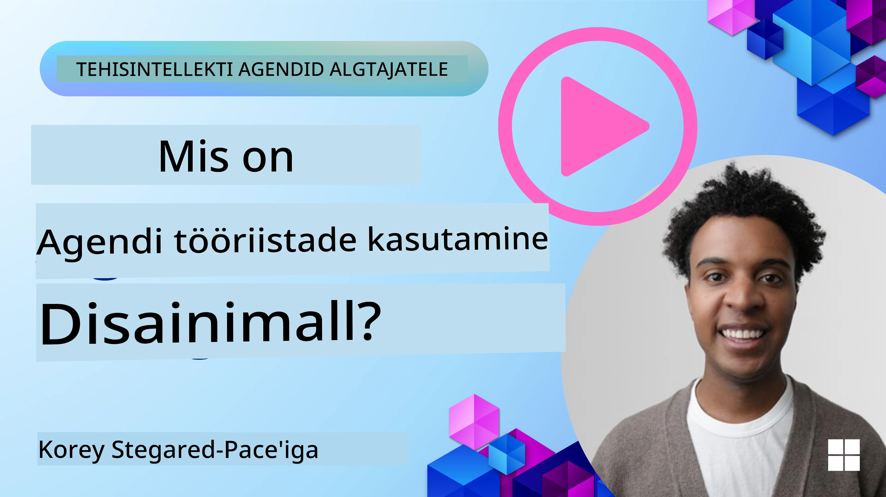
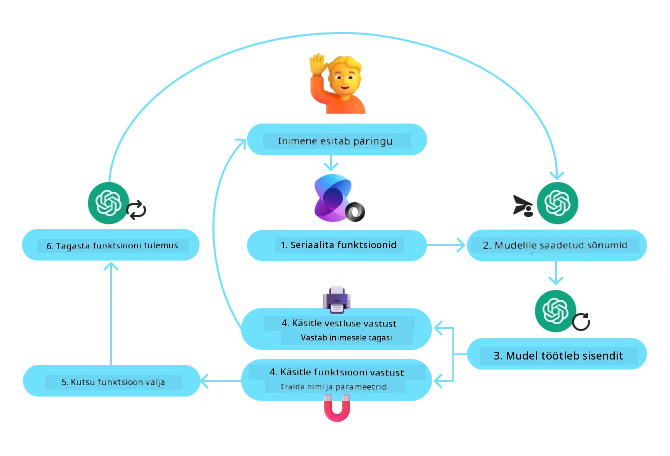
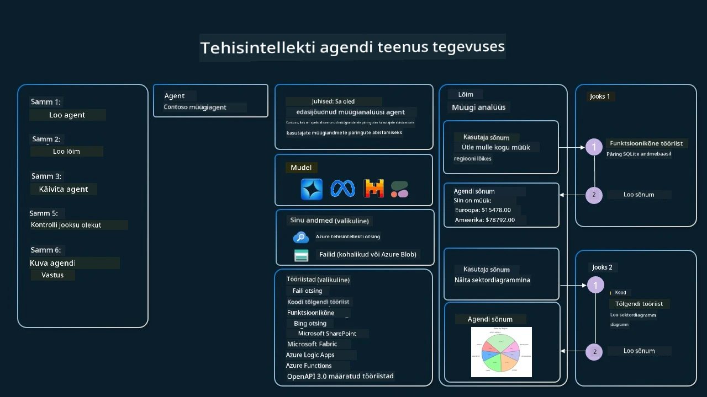

[](https://youtu.be/vieRiPRx-gI?si=cEZ8ApnT6Sus9rhn)

> _(Klõpsake ülaloleval pildil, et vaadata selle tunni videot)_

# Tööriistade kasutamise disainimuster

Tööriistad on huvitavad, sest need võimaldavad tehisintellekti agentidel omada laiemat võimekust. Selle asemel, et agendil oleks piiratud tegevuste komplekt, mida ta saab teha, võimaldab tööriista lisamine agendil nüüd teha väga erinevaid tegevusi. Selles peatükis vaatleme tööriistade kasutamise disainimustrit, mis kirjeldab, kuidas tehisintellekti agendid saavad kasutada konkreetseid tööriistu oma eesmärkide saavutamiseks.

## Sissejuhatus

Selles tunnis püüame vastata järgmistele küsimustele:

- Mis on tööriistade kasutamise disainimuster?
- Millistes kasutusjuhtumites seda saab rakendada?
- Millised elemendid/ehitusplokid on disainimustri rakendamiseks vajalikud?
- Millised on erilised kaalutlused tööriistade kasutamise disainimustri rakendamisel usaldusväärsete tehisintellekti agentide loomiseks?

## Õpieesmärgid

Pärast selle tunni läbimist suudate:

- Defineerida tööriistade kasutamise disainimustri ja selle eesmärgi.
- Tuvastada kasutusjuhtumid, kus tööriistade kasutamise disainimuster on rakendatav.
- Mõista põhielemente, mis on vajaliku disainimustri rakendamiseks.
- Tunnustada kaalutlusi, mis tagavad selle disainimustri kasutavate tehisintellekti agentide usaldusväärsuse.

## Mis on tööriistade kasutamise disainimuster?

**Tööriistade kasutamise disainimuster** keskendub LLMide võimele suhelda väliste tööriistadega, et saavutada spetsiifilisi eesmärke. Tööriistad on kood, mida agent saab käivitada tegevuste sooritamiseks. Tööriist võib olla lihtne funktsioon nagu kalkulaator või kolmanda osapoole teenuse API-kõne, näiteks aktsiahindade päring või ilmaprognoos. Tehisintellekti agentide kontekstis on tööriistad kujundatud nii, et agendid saavad neid täita **mudeli genereeritud funktsioonikõnede** kaudu.

## Millistes kasutusjuhtumites seda saab rakendada?

Tehisintellekti agendid saavad kasutada tööriistu keeruliste ülesannete täitmiseks, teabe hankimiseks või otsuste tegemiseks. Tööriistade kasutamise disainimustrit kasutatakse sageli olukordades, mis nõuavad dünaamilist suhtlust väliste süsteemidega, nagu andmebaasid, veebiteenused või koodi tõlgendajad. See võimekus on kasulik mitmetes erinevates kasutusjuhtumites, sealhulgas:

- **Dünaamiline info hankimine:** Agendid saavad pärida väliseid APIsid või andmebaase, et saada ajakohast andmestikku (nt SQLite andmebaasi päring andmeanalüüsiks, aktsiahindade või ilmateabe pärimine).
- **Koodi täitmine ja tõlgendamine:** Agendid saavad täita koodi või skripte, et lahendada matemaatilisi probleeme, koostada aruandeid või teha simulatsioone.
- **Töövoo automatiseerimine:** Korduvate või mitmeastmeliste töövoogude automatiseerimine, integreerides tööriistu nagu ülesannete ajakava, e-posti teenused või andmepipelining.
- **Klienditugi:** Agendid saavad suhelda CRM-süsteemide, piletiplatvormide või teadmistebaasidega kasutajapäringute lahendamiseks.
- **Sisu loomine ja redigeerimine:** Agendid saavad kasutada tööriistu, nagu grammatika kontrollijad, tekstikokkuvõtjad või sisu turvalisuse hindajad, et toetada sisuloome ülesandeid.

## Millised elemendid/ehitusplokid on tööriistade kasutamise disainimustri rakendamiseks vajalikud?

Need ehitusplokid võimaldavad AI agendil täita laias valikus ülesandeid. Vaatame tööriistade kasutamise disainimustri rakendamiseks vajalikke põhielemente:

- **Funktsiooni/tööriista skeemid**: Üksikasjalikud määratlused saadaolevate tööriistade kohta, sh funktsiooni nimi, eesmärk, vajalikud parameetrid ja ootuspärased väljundid. Need skeemid võimaldavad LLMil mõista, millised tööriistad on olemas ja kuidas koostada kehtivaid päringuid.

- **Funktsiooni täitmise loogika**: Määrab, kuidas ja millal tööriistu kutsutakse, lähtudes kasutaja kavatsusest ja vestluse kontekstist. See võib hõlmata planeerimismooduleid, marsruutimise mehhanisme või tingimuslikke vooge, mis dünaamiliselt määravad tööriista kasutamise.

- **Sõnumite haldussüsteem**: Komponendid, mis haldavad vestluse kulgu kasutaja sisendite, LLMi vastuste, tööriistakõnede ja tööriistade väljundite vahel.

- **Tööriistade integratsiooniraamistik**: Infrastruktuur, mis ühendab agendi erinevate tööriistadega, olgu need lihtsad funktsioonid või keerukad välised teenused.

- **Vea käsitlemine ja valideerimine**: Mehhanismid tööriistade täitmise ebaõnnestumiste käsitlemiseks, parameetrite valideerimiseks ja ootamatute vastuste haldamiseks.

- **Oleku haldamine**: Jälgib vestluse konteksti, varasemaid tööriistakõnesid ja püsivaid andmeid, et tagada järjepidevus mitme pöörde pikkuses suhtluses.

Järgmisena vaatleme lähemalt funktsioonide/tööriistade kutsumist.
 
### Funktsioonide/tööriistade kutsumine

Funktsioonide kutsumine on peamine viis, kuidas võimaldame suurel keelemudelil (LLM) suhelda tööriistadega. Tihti kasutatakse termineid 'funktsioon' ja 'tööriist' vaheldumisi, sest 'funktsioonid' (taaskasutatavad koodiblokid) on need 'tööriistad', mida agendid kasutavad ülesannete täitmiseks. Selleks, et funktsiooni koodi kutsuda, peab LLM võrdlema kasutaja päringut funktsiooni kirjeldusega. Selleks saadetakse LLMile skeem, mis sisaldab kõigi saadaolevate funktsioonide kirjeldusi. LLM valib seejärel ülesande jaoks kõige sobivama funktsiooni ning tagastab selle nime ja argumendid. Valitud funktsioon kutsutakse välja, selle vastus saadetakse tagasi LLMile, mis kasutab infot kasutaja päringule vastamiseks.

Arendajatel, kes soovivad agentide funktsioonide kutsumist rakendada, on vaja:

1. LLM mudelit, mis toetab funktsioonide kutsumist
2. Skeemi, mis sisaldab funktsioonide kirjeldusi
3. Koodi iga kirjeldatud funktsiooni jaoks

Kasutame illustreerimiseks näidet, kuidas saada linnas kehtiv kellaaeg:

1. **Algatage funktsioonide kutsumist toetav LLM:**

    Kõik mudelid ei toeta funktsioonide kutsumist, seega on oluline kontrollida, et teie kasutatav LLM seda teeb.     <a href="https://learn.microsoft.com/azure/ai-services/openai/how-to/function-calling" target="_blank">Azure OpenAI</a> toetab funktsioonide kutsumist. Saame alustada OpenAI kliendi käivitamisest Azure OpenAI **Vastuste API** vastu (stabiilne `/openai/v1/` lõpp-punkt — ei ole vaja `api_version`-i). 

    ```python
    # Algatage OpenAI klient Azure OpenAI jaoks (Responses API, v1 lõpp-punkt)
    client = OpenAI(
        base_url=f"{os.environ['AZURE_OPENAI_ENDPOINT'].rstrip('/')}/openai/v1/",
        api_key=os.environ["AZURE_OPENAI_API_KEY"],
    )
    deployment_name = os.environ["AZURE_OPENAI_DEPLOYMENT"]
    ```

1. **Loo funktsiooni skeem**:

    Järgmisena määratleme JSON skeemi, mis sisaldab funktsiooni nime, funktsiooni toimingu kirjelduse ja funktsiooni parameetrite nimed ning kirjeldused.
    Selle skeemi annab seejärel varem loodud kliendile koos kasutaja päringuga, mis küsib San Francisco kellaaja leidmist. Oluline on märkida, et tagastatakse **tööriistakõne**, **mitte** küsimuse lõplik vastus. Nagu mainitud, tagastab LLM ülesande jaoks valitud funktsiooni nime ja argumendid.

    ```python
    # Funktsiooni kirjeldus mudeli lugemiseks (Responses API lame tööriista formaat)
    tools = [
        {
            "type": "function",
            "name": "get_current_time",
            "description": "Get the current time in a given location",
            "parameters": {
                "type": "object",
                "properties": {
                    "location": {
                        "type": "string",
                        "description": "The city name, e.g. San Francisco",
                    },
                },
                "required": ["location"],
            },
        }
    ]
    ```
   
    ```python
  
    # Esialgne kasutaja sõnum
    messages = [{"role": "user", "content": "What's the current time in San Francisco"}]

    # Esimene API kõne: Kutsu mudelit funktsiooni kasutama
    response = client.responses.create(
        model=deployment_name,
        input=messages,
        tools=tools,
        tool_choice="auto",
        store=False,
    )

    # Vastuste API tagastab tööriista kutsed kui function_call üksused response.output väljale.
    # Lisa need vestlusse, et mudelil oleks järgmises pöördes täielik kontekst.
    messages += response.output

    print("Model's response:")
    print(response.output)
  
    ```

    ```bash
    Model's response:
    [ResponseFunctionToolCall(arguments='{"location":"San Francisco"}', call_id='call_pOsKdUlqvdyttYB67MOj434b', name='get_current_time', type='function_call')]
    ```
  
1. **Funktsiooni kood ülesande täitmiseks:**

    Pärast seda, kui LLM on valinud, millist funktsiooni tuleks käivitada, tuleb see kood rakendada ja täita.
    Koodi, mis tagab praeguse kellaaja saamise Pythonis, saab rakendada. Samuti tuleb kirjutada kood, mis väljavõtab `response_message`-ist nime ja argumendid, et saada lõplik tulemus.

    ```python
      def get_current_time(location):
        """Get the current time for a given location"""
        print(f"get_current_time called with location: {location}")  
        location_lower = location.lower()
        
        for key, timezone in TIMEZONE_DATA.items():
            if key in location_lower:
                print(f"Timezone found for {key}")  
                current_time = datetime.now(ZoneInfo(timezone)).strftime("%I:%M %p")
                return json.dumps({
                    "location": location,
                    "current_time": current_time
                })
      
        print(f"No timezone data found for {location_lower}")  
        return json.dumps({"location": location, "current_time": "unknown"})
    ```

     ```python
    # Töötle funktsioonikõnesid
    tool_calls = [item for item in response.output if item.type == "function_call"]
    if tool_calls:
        for tool_call in tool_calls:
            if tool_call.name == "get_current_time":

                function_args = json.loads(tool_call.arguments)

                time_response = get_current_time(
                    location=function_args.get("location")
                )

                # Tagasta tööriista tulemus kui function_call_output element
                messages.append({
                    "type": "function_call_output",
                    "call_id": tool_call.call_id,
                    "output": time_response,
                })
    else:
        print("No tool calls were made by the model.")

    # Teine API kõne: Saa mudelilt lõplik vastus
    final_response = client.responses.create(
        model=deployment_name,
        input=messages,
        tools=tools,
        store=False,
    )

    return final_response.output_text
     ```

     ```bash
      get_current_time called with location: San Francisco
      Timezone found for san francisco
      The current time in San Francisco is 09:24 AM.
     ```

Funktsioonide kutsumine on enamiku, kui mitte kõigi agentide tööriistade kasutamise disainimustrite keskmes, kuid selle nullist rakendamine võib mõnikord olla keeruline.
Nagu õppisime [Tunnis 2](../../../02-explore-agentic-frameworks) pakuvad agentur Raamistikud meile eelvalmis ehitusplokke tööriistade kasutamise rakendamiseks.
 
## Tööriistade kasutamise näited Agentic Frameworkidega

Siin on mõned näited, kuidas tööriistade kasutamise disainimustrit rakendada erinevate agentur raamistikute abil:

### Microsoft Agent Framework

<a href="https://learn.microsoft.com/azure/ai-services/agents/overview" target="_blank">Microsoft Agent Framework</a> on avatud lähtekoodiga tehisintellekti raamistik agentide loomiseks. See lihtsustab funktsioonide kutsumise protsessi, võimaldades määratleda tööriistad Python’i funktsioonidena, kasutades `@tool` dekoratsiooni. Raamistik haldab mudeli ja teie koodi vahelist suhtlust. Samuti pakub pääsu eelvalmistatud tööriistadele, nagu Faili Otsing ja Koodi Tõlgendaja, läbi `FoundryChatClient`.

Järgmine diagramm illustreerib funktsioonide kutsumise protsessi Microsoft Agent Frameworkiga:



Microsoft Agent Frameworkis määratletakse tööriistad dekoreeritud funktsioonidena. Saame `get_current_time` funktsiooni, mida nägime varem, konverteerida tööriistaks, kasutades `@tool` dekoratsiooni. Raamistik serialiseerib automaatselt funktsiooni ja selle parameetrid, luues skeemi LLMile saatmiseks.

```python
import os
from agent_framework import tool
from agent_framework.foundry import FoundryChatClient
from azure.identity import AzureCliCredential

@tool(approval_mode="never_require")
def get_current_time(location: str) -> str:
    """Get the current time for a given location"""
    ...

# Loo klient
provider = FoundryChatClient(
    project_endpoint=os.environ["AZURE_AI_PROJECT_ENDPOINT"],
    model=os.environ["AZURE_AI_MODEL_DEPLOYMENT_NAME"],
    credential=AzureCliCredential(),
)

# Loo agent ja tööta tööriistaga
agent = provider.as_agent(name="TimeAgent", instructions="Use available tools to answer questions.", tools=get_current_time)
response = await agent.run("What time is it?")
```
  
### Microsoft Foundry Agent Service

<a href="https://learn.microsoft.com/azure/ai-services/agents/overview" target="_blank">Microsoft Foundry Agent Service</a> on uuem agentúra raamistik, mis on mõeldud arendajatele võimaldamaks turvaliselt luua, juurutada ja skaleerida kõrgekvaliteedilisi ning laiendatavaid tehisintellekti agente ilma, et peaks hallama aluseks olevaid arvutus- ja salvestusressursse. See on eriti kasulik ettevõtete rakendustes, kuna on täielikult hallatav teenus ettevõtte astme turvalisusega.

Võrreldes otsese arendusega LLM API abil, pakub Microsoft Foundry Agent Service mõningaid eeliseid, sealhulgas:

- Automaatne tööriistakutsumine – ei ole vaja tööriistakõnet eraldi parsida, tööriista kutsuda ja vastuseid hallata; kõik toimub nüüd serveripoolselt
- Turvaliselt hallatud andmed – asemel, et hallata enda vestluse olekut, saab tugineda 'threads'-idele, mis salvestavad kogu vajaliku info
- Valmis tööriistad – tööriistad, mida saate kasutada oma andmeallikatega suhtlemiseks, nagu Bing, Azure AI Search ja Azure Functions.

Microsoft Foundry Agent Service’s saadaolevad tööriistad jagunevad kaheks kategooriaks:

1. Teadmiste tööriistad:
    - <a href="https://learn.microsoft.com/azure/ai-services/agents/how-to/tools/bing-grounding?tabs=python&pivots=overview" target="_blank">Bing otsingu kasutamine taustainfoks</a>
    - <a href="https://learn.microsoft.com/azure/ai-services/agents/how-to/tools/file-search?tabs=python&pivots=overview" target="_blank">Failide otsing</a>
    - <a href="https://learn.microsoft.com/azure/ai-services/agents/how-to/tools/azure-ai-search?tabs=azurecli%2Cpython&pivots=overview-azure-ai-search" target="_blank">Azure AI otsing</a>

2. Tegevustööriistad:
    - <a href="https://learn.microsoft.com/azure/ai-services/agents/how-to/tools/function-calling?tabs=python&pivots=overview" target="_blank">Funktsioonide kutsumine</a>
    - <a href="https://learn.microsoft.com/azure/ai-services/agents/how-to/tools/code-interpreter?tabs=python&pivots=overview" target="_blank">Koodi tõlgendaja</a>
    - <a href="https://learn.microsoft.com/azure/ai-services/agents/how-to/tools/openapi-spec?tabs=python&pivots=overview" target="_blank">OpenAPI määratletud tööriistad</a>
    - <a href="https://learn.microsoft.com/azure/ai-services/agents/how-to/tools/azure-functions?pivots=overview" target="_blank">Azure Functions</a>

Agent Service võimaldab meil neid tööriistu kasutada koos kui `toolset`-ina. Samuti kasutab see `threads`-e, mis hoiavad konkreetse vestluse sõnumite ajaloo.

Kujutage ette, et olete müügiesindaja ettevõttes nimega Contoso. Soovite arendada vestlusagenti, kes suudab vastata küsimustele teie müügiandmete kohta.

Järgmine pilt illustreerib, kuidas võiksite Microsoft Foundry Agent Service’it kasutada oma müügiandmete analüüsimiseks:



Nende tööriistade kasutamiseks teenusega saame luua kliendi ja määratleda tööriista või tööriistakomplekti. Praktilise rakendamisena võime kasutada järgmist Python koodi. LLM suudab tööriistakogust vaadata ning otsustada, kas kasutada kasutaja loodud funktsiooni `fetch_sales_data_using_sqlite_query` või eelvalmistatud Koodi Tõlgendajat sõltuvalt kasutaja päringust.

```python 
import os
from azure.ai.projects import AIProjectClient
from azure.identity import DefaultAzureCredential
from fetch_sales_data_functions import fetch_sales_data_using_sqlite_query # fetch_sales_data_using_sqlite_query funktsioon, mida saab leida failist fetch_sales_data_functions.py.
from azure.ai.projects.models import ToolSet, FunctionTool, CodeInterpreterTool

project_client = AIProjectClient.from_connection_string(
    credential=DefaultAzureCredential(),
    conn_str=os.environ["PROJECT_CONNECTION_STRING"],
)

# Tööriistakomplekti initsialiseerimine
toolset = ToolSet()

# Funktsioonikõne agendi initsialiseerimine kasutades fetch_sales_data_using_sqlite_query funktsiooni ja selle lisamine tööriistakomplekti
fetch_data_function = FunctionTool(fetch_sales_data_using_sqlite_query)
toolset.add(fetch_data_function)

# Koodi interpreter tööriista initsialiseerimine ja selle lisamine tööriistakomplekti.
code_interpreter = CodeInterpreterTool()toolset.add(code_interpreter)

agent = project_client.agents.create_agent(
    model="gpt-4o-mini", name="my-agent", instructions="You are helpful agent", 
    toolset=toolset
)
```

## Millised on erilised kaalutlused tööriistade kasutamise disainimustri rakendamisel usaldusväärsete tehisintellekti agentide loomiseks?

Tavaline mure LLMide dünaamiliselt genereeritud SQL-i puhul on turvalisus, eriti oht SQL süstimise või pahatahtlike tegude, nagu andmebaasi kustutamise või manipuleerimise suhtes. Kuigi need mured on põhjendatud, saab neid tõhusalt leevendada, konfigureerides andmebaasi juurdepääsuõigused korrektselt. Enamiku andmebaaside puhul tähendab see andmebaasi seadistamist ainult lugemiseks. Andmebaasiteenuste nagu PostgreSQL või Azure SQL puhul peaks rakendusele määrama vaid lugemisõigusega (SELECT) rolli.

Rakenduse käitamine turvalises keskkonnas suurendab täiendavalt kaitset. Ettevõtete olukordades ekstraktitakse ja muudetakse andmeid tavaliselt operatsioonisüsteemidest lugemiseks mõeldud andmebaasiks või andmelaoks kasutajasõbraliku skeemiga. See tagab, et andmed on turvalised, optimeeritud jõudluse ja ligipääsetavuse osas ning et rakendusel on piiratud, vaid lugemisõigus.

## Näidiskoodid

- Python: [Agent Framework](./code_samples/04-python-agent-framework.ipynb)
- .NET: [Agent Framework](./code_samples/04-dotnet-agent-framework.md)

## Kas teil on rohkem küsimusi tööriistade kasutamise disainimustri kohta?

Liituge [Microsoft Foundry Discord](https://discord.com/invite/ATgtXmAS5D) kanaliga, et kohtuda teiste õppijatega, osaleda kontorite tundides ja saada vastuseid oma tehisintellekti agentide küsimustele.

## Täiendavad ressursid

- <a href="https://microsoft.github.io/build-your-first-agent-with-azure-ai-agent-service-workshop/" target="_blank">Azure AI Agent Service töötuba</a>
- <a href="https://github.com/Azure-Samples/contoso-creative-writer/tree/main/docs/workshop" target="_blank">Contoso Creative Writer mitme agendi töötuba</a>
- <a href="https://learn.microsoft.com/azure/ai-services/agents/overview" target="_blank">Microsoft Agent Framework ülevaade</a>


## Eelmine õppetund

[Agentsete disainimustrite mõistmine](../03-agentic-design-patterns/README.md)

## Järgmine õppetund

[Agentne RAG](../05-agentic-rag/README.md)

---

<!-- CO-OP TRANSLATOR DISCLAIMER START -->
**Lahtiütlus**:
See dokument on tõlgitud kasutades AI tõlketeenust [Co-op Translator](https://github.com/Azure/co-op-translator). Kuigi me püüdleme täpsuse poole, palun pange tähele, et automatiseeritud tõlgetes võib esineda vigu või ebatäpsusi. Originaaldokument selle emakeeles tuleks pidada autoriteetseks allikaks. Olulise teabe puhul soovitatakse kasutada professionaalset inimtõlget. Me ei vastuta selle tõlkega seotud eksimustest või valesti mõistmistest.
<!-- CO-OP TRANSLATOR DISCLAIMER END -->