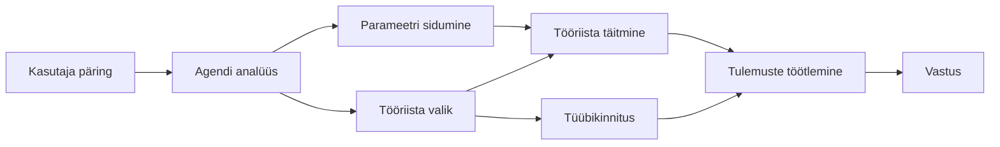

# 🛠️ Täiustatud tööriistade kasutamine Azure OpenAI (Responses API) abil (.NET)

## 📋 Õpieesmärgid

See märkmik demonstreerib ettevõtte tasemel tööriistade integreerimise mustreid, kasutades Microsoft Agent Framework'i .NET-i keskkonnas koos Azure OpenAI-ga (Responses API). Õpid looma keerukaid agente mitme spetsialiseeritud tööriistaga, kasutades C# tugevat tüübistamist ja .NET-i ettevõtte funktsioone.

### Täiustatud tööriistade võimalused, mida sa valdama õpid

- 🔧 **Mitme tööriista arhitektuur**: Agendite loomine mitme spetsialiseeritud võimekusega
- 🎯 **Tüübikindel tööriista täitmine**: C# kompileerimisaja valideerimise kasutamine
- 📊 **Ettevõtte tööriistade mustrid**: Tootmiseks valmis tööriistade disain ja veahaldus
- 🔗 **Tööriistade kombineerimine**: Tööriistade ühendamine keeruliste ärivoolude jaoks

## 🎯 .NET tööriistade arhitektuuri eelised

### Ettevõtte tasemel tööriistade funktsioonid

- **Kompileerimisaja valideerimine**: Tugev tüübistamine tagab tööriista parameetrite õigsuse
- **Sõltuvuse süstimine**: IoC konteineri integreerimine tööriistade haldamiseks
- **Async/Await mustrid**: Mitteseisvad tööriista täitmised õige ressursside haldusega
- **Struktureeritud logimine**: Sisseehitatud logimise integreerimine tööriista täitmise jälgimiseks

### Tootmiseks valmis mustrid

- **Erandihaldus**: Kõikehõlmav veahaldus tüübistatud eranditega
- **Ressursside haldamine**: Õiged utiliseerimismustrid ja mälu haldamine
- **Tulemuste jälgimine**: Sisseehitatud meetrid ja jõudlusmõõdikud
- **Konfiguratsiooni haldamine**: Tüübikindel konfiguratsioon valideerimisega

## 🔧 Tehniline arhitektuur

### Põhikomponendid .NET tööriistadest

- **Microsoft.Extensions.AI**: Ühtne tööriistade abstraktsioonikiht
- **Microsoft.Agents.AI**: Ettevõtte tasemel tööriistade orkestreerimine
- **Azure OpenAI (Responses API)**: Kõrge jõudlusega API klient ühenduse haldusega

### Tööriista täitmispipeline



## 🛠️ Tööriistakategooriad ja mustrid

### 1. **Andmetöötluse tööriistad**

- **Sisendi valideerimine**: Tugev tüübistamine andmetega seotud annotatsioonidega
- **Transformeerimisoperatsioonid**: Tüübikindel andmete teisendamine ja vormindamine
- **Ärilogika**: Domeenipõhised arvutus- ja analüüsitööriistad
- **Väljundi vormindamine**: Struktureeritud vastuste genereerimine

### 2. **Integreerimistööriistad** 

- **API-liidesed**: REST-teenuste integratsioon HttpClientiga
- **Andmebaasitööriistad**: Entity Frameworki integratsioon andmebaasi ligipääsuks
- **Failioperatsioonid**: Turvalised failisüsteemi toimingud valideerimisega
- **Välised teenused**: Kolmanda osapoole teenuste integratsioonimustrid

### 3. **Abitööriistad**

- **Tekstitöötlus**: Stringi manipuleerimise ja vormindamise utiliidid
- **Kuupäeva/kellaaja operatsioonid**: Kultuuritundlikud kuupäeva/kellaaja arvutused
- **Matemaatilised tööriistad**: Täpsed arvutused ja statistilised operatsioonid
- **Valideerimistööriistad**: Ärieeskirjade kontroll ja andmete kinnitamine

Valmis ehitama ettevõtte tasemel agente võimsate, tüübikindlate tööriistade võimalustega .NET-is? Vaatame, kuidas arhitektuureerime professionaalsed lahendused! 🏢⚡

## 🚀 Alustamine

### Eeltingimused

- [.NET 10 SDK](https://dotnet.microsoft.com/download/dotnet/10.0) või uuem
- [Azure tellimus](https://azure.microsoft.com/free/) koos Azure OpenAI ressursi ja mudeli juurutusega
- [Azure CLI](https://learn.microsoft.com/cli/azure/install-azure-cli) — sisselogimine `az login` käsuga

### Vajalikud keskkonnamuutujad

```bash
# zsh/bash
export AZURE_OPENAI_ENDPOINT=https://<your-resource>.openai.azure.com
export AZURE_OPENAI_DEPLOYMENT=gpt-4o-mini
# Seejärel logi sisse, et AzureCliCredential saaks hankida tokeni
az login
```

```powershell
# PowerShell
$env:AZURE_OPENAI_ENDPOINT = "https://<your-resource>.openai.azure.com"
$env:AZURE_OPENAI_DEPLOYMENT = "gpt-4o-mini"
# Seejärel logi sisse, et AzureCliCredential saaks saada tokeni
az login
```

### Näidiskood

Koodi näite käivitamiseks,

```bash
# zsh/bash
chmod +x ./04-dotnet-agent-framework.cs
./04-dotnet-agent-framework.cs
```

Või kasutades dotnet CLI-t:

```bash
dotnet run ./04-dotnet-agent-framework.cs
```

Vaata täielikku koodi failist [`04-dotnet-agent-framework.cs`](../../../../04-tool-use/code_samples/04-dotnet-agent-framework.cs).

```csharp
#!/usr/bin/dotnet run

#:package Microsoft.Extensions.AI@10.*
#:package Microsoft.Agents.AI.OpenAI@1.*-*
#:package Azure.AI.OpenAI@2.1.0
#:package Azure.Identity@1.13.1

using System.ComponentModel;

using Microsoft.Agents.AI;
using Microsoft.Extensions.AI;

using Azure.AI.OpenAI;
using Azure.Identity;

// Tool Function: Random Destination Generator
// This static method will be available to the agent as a callable tool
// The [Description] attribute helps the AI understand when to use this function
// This demonstrates how to create custom tools for AI agents
[Description("Provides a random vacation destination.")]
static string GetRandomDestination()
{
    // List of popular vacation destinations around the world
    // The agent will randomly select from these options
    var destinations = new List<string>
    {
        "Paris, France",
        "Tokyo, Japan",
        "New York City, USA",
        "Sydney, Australia",
        "Rome, Italy",
        "Barcelona, Spain",
        "Cape Town, South Africa",
        "Rio de Janeiro, Brazil",
        "Bangkok, Thailand",
        "Vancouver, Canada"
    };

    // Generate random index and return selected destination
    // Uses System.Random for simple random selection
    var random = new Random();
    int index = random.Next(destinations.Count);
    return destinations[index];
}

// Azure OpenAI with the Responses API (stable v1 endpoint). Sign in with `az login`.
var azureEndpoint = Environment.GetEnvironmentVariable("AZURE_OPENAI_ENDPOINT")
    ?? throw new InvalidOperationException("AZURE_OPENAI_ENDPOINT is not set.");
var deployment = Environment.GetEnvironmentVariable("AZURE_OPENAI_DEPLOYMENT") ?? "gpt-4o-mini";

var azureClient = new AzureOpenAIClient(new Uri(azureEndpoint), new AzureCliCredential());

// Define Agent Identity and Comprehensive Instructions
// Agent name for identification and logging purposes
var AGENT_NAME = "TravelAgent";

// Detailed instructions that define the agent's personality, capabilities, and behavior
// This system prompt shapes how the agent responds and interacts with users
var AGENT_INSTRUCTIONS = """
You are a helpful AI Agent that can help plan vacations for customers.

Important: When users specify a destination, always plan for that location. Only suggest random destinations when the user hasn't specified a preference.

When the conversation begins, introduce yourself with this message:
"Hello! I'm your TravelAgent assistant. I can help plan vacations and suggest interesting destinations for you. Here are some things you can ask me:
1. Plan a day trip to a specific location
2. Suggest a random vacation destination
3. Find destinations with specific features (beaches, mountains, historical sites, etc.)
4. Plan an alternative trip if you don't like my first suggestion

What kind of trip would you like me to help you plan today?"

Always prioritize user preferences. If they mention a specific destination like "Bali" or "Paris," focus your planning on that location rather than suggesting alternatives.
""";

// Create AI Agent with Advanced Travel Planning Capabilities
// Get the Responses client for the deployment and create the AI agent
// Configure agent with name, detailed instructions, and available tools
// This demonstrates the .NET agent creation pattern with full configuration
AIAgent agent = azureClient
    .GetOpenAIResponseClient(deployment)
    .CreateAIAgent(
        name: AGENT_NAME,
        instructions: AGENT_INSTRUCTIONS,
        tools: [AIFunctionFactory.Create(GetRandomDestination)]
    );

// Create New Conversation Thread for Context Management
// Initialize a new conversation thread to maintain context across multiple interactions
// Threads enable the agent to remember previous exchanges and maintain conversational state
// This is essential for multi-turn conversations and contextual understanding
AgentThread thread = agent.GetNewThread();

// Execute Agent: First Travel Planning Request
// Run the agent with an initial request that will likely trigger the random destination tool
// The agent will analyze the request, use the GetRandomDestination tool, and create an itinerary
// Using the thread parameter maintains conversation context for subsequent interactions
await foreach (var update in agent.RunStreamingAsync("Plan me a day trip", thread))
{
    await Task.Delay(10);
    Console.Write(update);
}

Console.WriteLine();

// Execute Agent: Follow-up Request with Context Awareness
// Demonstrate contextual conversation by referencing the previous response
// The agent remembers the previous destination suggestion and will provide an alternative
// This showcases the power of conversation threads and contextual understanding in .NET agents
await foreach (var update in agent.RunStreamingAsync("I don't like that destination. Plan me another vacation.", thread))
{
    await Task.Delay(10);
    Console.Write(update);
}
```

---

<!-- CO-OP TRANSLATOR DISCLAIMER START -->
**Lahtiütlus**:
See dokument on tõlgitud kasutades AI tõlketeenust [Co-op Translator](https://github.com/Azure/co-op-translator). Kuigi me püüdleme täpsuse poole, palun pange tähele, et automatiseeritud tõlgetes võib esineda vigu või ebatäpsusi. Originaaldokument selle emakeeles tuleks pidada autoriteetseks allikaks. Olulise teabe puhul soovitatakse kasutada professionaalset inimtõlget. Me ei vastuta selle tõlkega seotud eksimustest või valesti mõistmistest.
<!-- CO-OP TRANSLATOR DISCLAIMER END -->