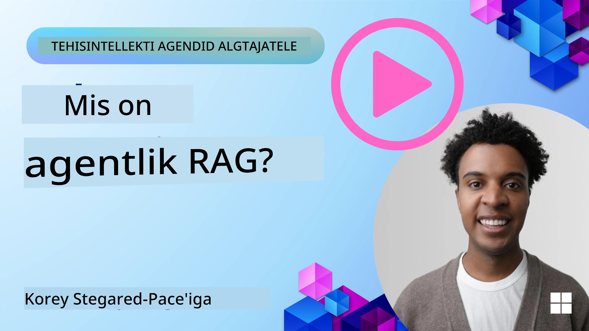
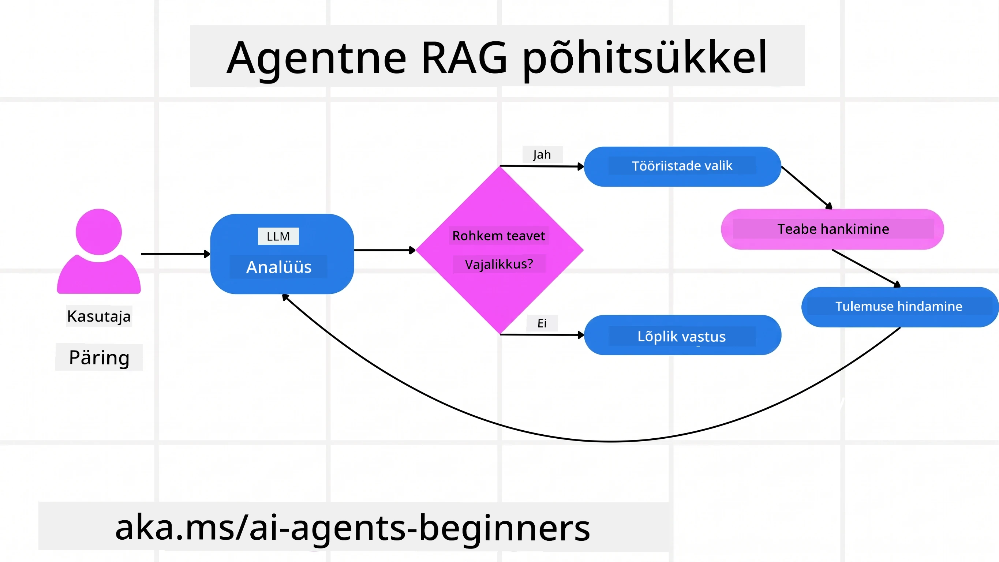
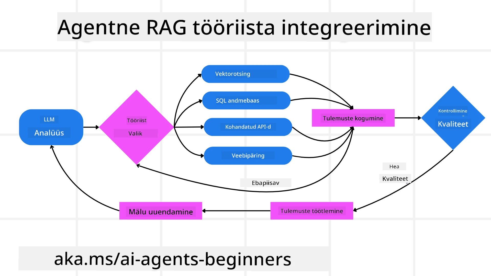
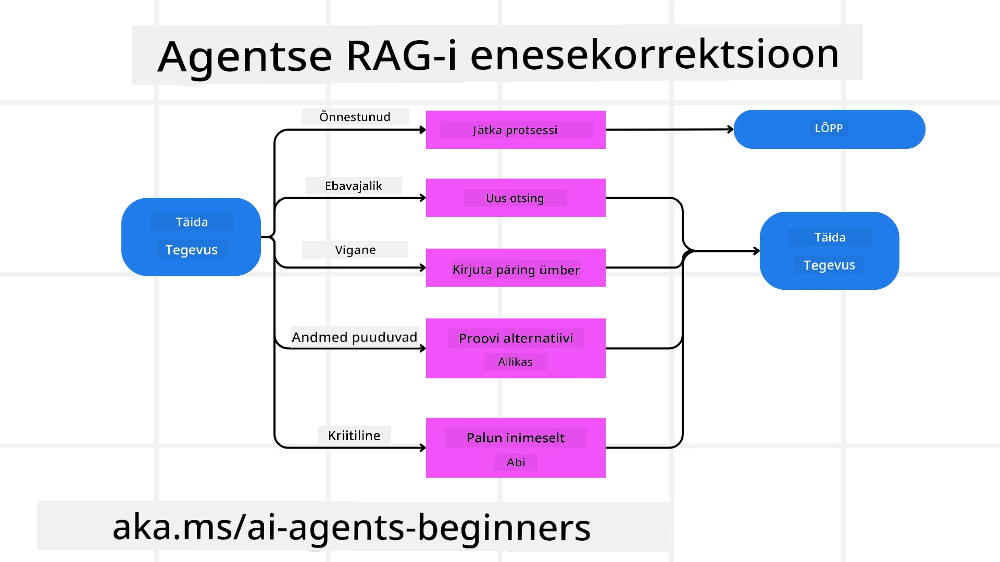
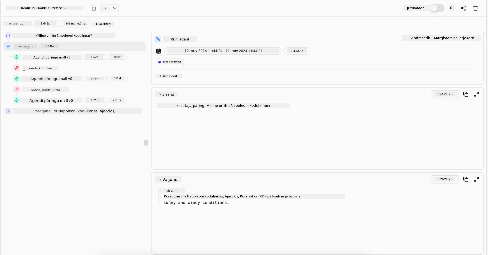

> _(Klõpsake ülaloleval pildil, et vaadata selle tunni videot)_

# Agentic RAG

See tund annab põhjaliku ülevaate Agentic Retrieval-Augmented Generation’ist (Agentic RAG), tekkivast AI paradigmast, kus suured keelemudelid (LLM-id) plaanivad iseseisvalt oma järgmisi samme, tõmmates teavet välisallikatest. Erinevalt staatilistest päringutest ja lugemisprotsessidest hõlmab Agentic RAG iteratiivseid LLM-i kõnesid, mille vahele on lülitatud tööriistade või funktsioonide kutsed ning struktureeritud väljundid. Süsteem hindab tulemusi, täiustab päringuid, kasutab vajadusel täiendavaid tööriistu ja jätkab tsüklit kuni rahuldava lahenduseni.

## Sissejuhatus

See tund hõlmab

- **Agentic RAG-i mõistmine:** Õpi tundma AI tekkivat paradigmat, kus suured keelemudelid iseseisvalt plaanivad oma järgmised sammud, kasutades väliseid andmeallikaid.
- **Iteratiivne Maker-Checker stiil:** Mõista LLM-i iteratiivsete kõnede silmust, mille vahel kasutatakse tööriistu või funktsioone ja struktureeritud väljundeid, et parandada täpsust ja käsitleda vigaseid päringuid.
- **Praktiliste rakenduste uurimine:** Tuvasta olukorrad, kus Agentic RAG paistab silma, nagu täpsus-eesmärkidel põhinevad keskkonnad, keerulised andmebaasioperatsioonid ja pikemad töövood.

## Õpieesmärgid

Pärast selle tunni läbimist oskad või mõistad:

- **Agentic RAG-i mõistmine:** Õpi tundma AI tekkivat paradigmat, kus suured keelemudelid iseseisvalt plaanivad oma järgmisi samme, kasutades väliseid andmeallikaid.
- **Iteratiivne Maker-Checker stiil:** Mõista LLM-i iteratiivsete kõnede silmust, mille vahel kasutatakse tööriistu või funktsioone ja struktureeritud väljundeid, et parandada täpsust ja käsitleda vigaseid päringuid.
- **Põhjendusprotsessi valdamine:** Mõista süsteemi suutlikkust oma põhjendusprotsessi hallata, otsustades ise, kuidas probleeme lahendada, ilma eelmääratletud marsruutidele toetumata.
- **Töövoog:** Mõista, kuidas agentse mudeli iseseisvalt otsustab hankida turutrendide raporteid, tuvastada konkurentide andmeid, korreleerida sisemisi müügimõõdikuid, sünteesida tulemusi ja hinnata strateegiat.
- **Iteratiivsed tsüklid, tööriistade integreerimine ja mälu:** Õpi tunnetama süsteemi sõltuvust silmuseks kujunenud interaktsioonimustrist, hoides olekut ja mälu sammude vahel, et vältida korduvaid tsükleid ja teha teadlikke otsuseid.
- **Ebaõnnestumiste käsitlemine ja enesekorrektsioon:** Uuri süsteemi tugevaid enesekorrektsiooni mehhanisme, sealhulgas iteratsiooni ja uuri päringut, diagnostic tööriistade kasutamist ning vajadusel inimjärelevalvele toetumist.
- **Agentuuri piirid:** Mõista Agentic RAG piire, keskendudes domeenipõhisele autonoomsusele, infrastruktuurisõltuvusele ja turvameetmete austamisele.
- **Praktilised kasutusjuhud ja väärtus:** Tuvasta olukorrad, kus Agentic RAG paistab silma, nagu täpsus-eesmärkidel põhinevad keskkonnad, keerulised andmebaasioperatsioonid ja pikemad töövood.
- **Juhtimine, läbipaistvus ja usaldus:** Õpi juhtimise ja läbipaistvuse olulisusest, sealhulgas seletava põhjenduse, kallutuste kontrolli ja inimjärelevalve rollist.

## Mis on Agentic RAG?

Agentic Retrieval-Augmented Generation (Agentic RAG) on tekkiv AI paradigma, kus suured keelemudelid (LLM) plaanivad iseseisvalt oma järgmisi samme, tõmmates teavet välisallikatest. Erinevalt staatilistest päringutest ja lugemisprotsessidest hõlmab Agentic RAG iteratiivseid LLM-i kõnesid, mille vahel on tööriistade või funktsioonide kutsed ja struktureeritud väljundid. Süsteem hindab tulemusi, täiustab päringuid, kasutab vajadusel täiendavaid tööriistu ja jätkab tsüklit kuni rahuldava lahenduseni. See iteratiivne “maker-checker” stiil parandab täpsust, käsitleb vigaseid päringuid ja tagab kvaliteetsed tulemused.

Süsteem haldab aktiivselt oma põhjendusprotsessi, kirjutades ebaõnnestunud päringud ümber, valides erinevaid otsingumeetodeid ja integreerides mitmeid tööriistu — näiteks vektoriotsing Azure AI Search’is, SQL-andmebaasid või kohandatud API-d — enne vastuse kindlaksmääramist. Agentse süsteemi eripära on selle suutlikkus hallata oma põhjendusprotsessi. Traditsioonilised RAG rakendused tuginevad eelmääratletud marsruutidele, kuid agentse süsteemi puhul otsustab mudel autonoomselt sammude järjekorra teabe kvaliteedi põhjal.

## Agentic Retrieval-Augmented Generation (Agentic RAG) määratlus

Agentic Retrieval-Augmented Generation (Agentic RAG) on tekkiv AI arenduse paradigma, kus LLM-id mitte ainult ei tõmba teavet välisandmeallikatest, vaid plaanivad ka oma järgmised sammud iseseisvalt. Erinevalt staatilistest päringutest ja lugemisprotsessidest või hoolikalt koostatud promptijadadest hõlmab Agentic RAG iteratiivset LLM-i kõnede tsüklit, mille vahel on tööriistade või funktsioonide kutsed ja struktureeritud väljundid. Igas etapis hindab süsteem saadud tulemusi, otsustab, kas päringuid tuleb täiustada, kasutab vajadusel täiendavaid tööriistu ja jätkab tsüklit kuni lahenduse saavutamiseni.

See iteratiivne “maker-checker” tööstiil on mõeldud parandama täpsust, käsitlema vigaseid päringuid struktureeritud andmebaasidele (nt NL2SQL) ja tagama tasakaalustatud, kvaliteetsed tulemused. Selle asemel, et tugineda ainult hoolikalt kavandatud promptiahelatele, haldab süsteem aktiivselt oma põhjendusprotsessi. Ta saab ümber kirjutada ebaõnnestunud päringud, valida erinevaid otsingumeetodeid ning integreerida mitmeid tööriistu — nagu Azure AI Search'i vektoriotsing, SQL andmebaasid või kohandatud API-d — enne lõpliku vastuse väljastamist. See eemaldab vajaduse ülearuselt keeruliste orkestrimisraamistike järele. Selle asemel võib suhteliselt lihtne tsükkel “LLM-i kõne → tööriista kasutus → LLM-i kõne → …” anda keerukaid ja hästi põhjendatud väljundeid.

## Põhjendusprotsessi valdamine

Erinevust loov omadus, mis teeb süsteemi “agentseks”, on selle võime hallata oma põhjendusprotsessi. Traditsioonilised RAG rakendused sõltuvad sageli inimestest, kes eeldefineerivad mudelile tee — mõtlemisahel, mis seletab, mida ja millal otsida.
Kuid kui süsteem on tõeliselt agentne, otsustab ta sisemiselt, kuidas probleemi lahendada. Ta ei käivita vaid skripti, vaid määrab autonoomselt sammude järjekorra leidetud teabe kvaliteedi põhjal.
Näiteks kui taile palutakse luua toote turuletoomise strateegia, ei toetu ta ainult promptile, mis kirjeldab kogu uurimis- ja otsustamisprotsessi. Selle asemel otsustab agentne mudel iseseisvalt:

1. Hangi jooksvaid turutrendide raporteid, kasutades Bing Web Groundingut
2. Tuvasta asjakohased konkurentieelsed andmed, kasutades Azure AI Search’i.
3. Korreleerib ajaloolisi sisemisi müügimõõdikuid Azure SQL andmebaasi abil.
4. Sünteesi leiud sidusa strateegiana, mida juhib Azure OpenAI teenus.
5. Hinnake strateegiat puudujääkide või vastuolude suhtes, vajadusel kallutades veel ühe päringuvooru teha.
Kõiki neid samme — päringute täiustamine, allikate valimine, iteratsioon kuni vastus rahuldab — otsustab mudel, mitte inimene ei ole need eelnevalt skriptitud.

## Iteratiivsed silmused, tööriistade integreerimine ja mälu

Agentse süsteemi aluseks on tsükliline interaktsioonimuster:

- **Esialgne kõne:** Kasutaja eesmärk (tuntud ka kui kasutajaprompt) antakse LLM-ile.
- **Tööriista kasutusele võtmine:** Kui mudel tuvastab puudulikku informatsiooni või ebamäärased juhised, valib ta tööriista või otsingumeetodi — näiteks vektoriandmebaasi päringu (nt Azure AI Search’i hübriidotsing privaatandmete üle) või struktureeritud SQL-päringu — vajadusel konteksti saamiseks.
- **Hindamine ja täiustamine:** Pärast tagastatud andmete ülevaatamist otsustab mudel, kas info on piisav. Kui ei, parandab ta päringut, proovib teist tööriista või kohandab lähenemist.
- **Korda kuni rahuloluni:** See tsükkel jätkub, kuni mudel leiab, et tal on piisavalt selgust ja tõendeid lõpliku ja hästi põhjendatud vastuse andmiseks.
- **Mälu ja olek:** Kuna süsteem hoiab olekut ja mälu sammude vahel, suudab ta meenutada varasemaid katseid ja nende tulemusi, vältides korduvaid tsükleid ja tehes mõistlikumaid otsuseid edasiliikumisel.

Aja jooksul loob see tunnetuse arenevast arusaamisest, võimaldades mudelil navigeerida keerulistes, mitmeastmelistes ülesannetes ilma vajaduseta, et inimene pidevalt sekkuks või prompti ümber kujundaks.

## Ebaõnnestumiste käsitlemine ja enesekorrektsioon

Agentic RAG autonoomia hõlmab ka tugevad enesekorrektsiooni mehhanismid. Kui süsteem satub ummikusse — näiteks leiab sobimatuid dokumente või kohtub vigaste päringutega — siis ta võib:

- **Iteratsioon ja uuesti pärimine:** Mudel ei tagasta madala väärtusega vastuseid, vaid proovib uusi otsingustrateegiaid, kirjutab andmebaasipäringuid ümber või vaatab alternatiivseid andmekogumeid.
- **Kasuta diagnostikatööriistu:** Süsteem võib kutsuda täiendavaid funktsioone, mis aitavad tal põhjendusastmeid siluda või kinnitada tagastatud andmete õigsust. Tööriistad nagu Azure AI Tracing on olulised tugeva jälgitavuse ja monitooringu võimaldamiseks.
- **Inimjärelevalve toele tugineda:** Kõrge riskiga või pidevalt ebaõnnestuvate stsenaariumide puhul võib mudel märkida ebakindlust ja paluda inimjuhendamist. Kui inimene annab parandava tagasiside, saab mudel seda edaspidi rakendada.

See iteratiivne ja dünaamiline lähenemine võimaldab mudelil pidevalt paraneda, tagades, et tegemist ei ole ühekorra süsteemiga, vaid ühega, mis õpib oma eksimustest sessiooni jooksul.

## Agentuuri piirid

Vaatamata ülesande sisesesse autonoomiasse ei ole Agentic RAG samaväärne tehisüldintellektiga. Selle “agenssed” võimed on piiratud tööriistade, andmeallikate ja poliitikatega, mida pakuvad inimarendajad. Ta ei saa leiutada omatööriistu ega liikuda määratud domeenipiiridest väljapoole. Selle asemel on ta hea olemasolevate ressursside dünaamilisel kasutamisel.
Põhilised erinevused arenenumatest tehisintellekti vormidest on:

1. **Domeenipõhine autonoomia:** Agentic RAG süsteemid keskenduvad kasutaja määratletud eesmärkide saavutamisele teadaolevas domeenis, kasutades strateegiaid nagu päringute ümberkirjutamine või tööriista valik tulemuste parandamiseks.
2. **Infrastruktuurisõltuvus:** Süsteemi võimed sõltuvad arendajate integreeritud tööriistadest ja andmetest. Ta ei saa neid piire ilma inimsekkumiseta ületada.
3. **Turvameetmete austamine:** Eetilised juhised, vastavusreeglid ja äripoliitikad on väga olulised. Agendi vabadus on alati piiratud turvameetmete ja järelevalvemehhanismidega (loodetavasti).

## Praktilised kasutusjuhud ja väärtus

Agentic RAG paistab silma olukordades, mis vajavad iteratiivset täiustamist ja täpsust:

1. **Täpsust esmatähtsaks seavad keskkonnad:** Vastavuskontrollide, regulatiivse analüüsi või juriidilise uurimistöö puhul saab agentne mudel korduvalt kontrollida fakte, konsulteerida mitme allikaga ja ümber kirjutada päringud, kuni ta toodab põhjalikult kontrollitud vastuse.
2. **Keerulised andmebaasiinteraktsioonid:** Struktureeritud andmetega töötades, kus päringud sageli ebaõnnestuvad või vajavad kohandamist, suudab süsteem iseseisvalt parandada päringuid Azure SQL või Microsoft Fabric OneLake abil, tagades lõpliku otsingu vastavuse kasutaja kavatsusele.
3. **Pikemad töövood:** Pikemate sessioonide järel tekib juurde uut teavet. Agentic RAG suudab pidevalt integreerida uusi andmeid, muutes strateegiaid vastavalt õppimisele probleemiruumi kohta.

## Juhtimine, läbipaistvus ja usaldus

Kui need süsteemid muutuvad oma põhjendustes autonoomsemaks, on juhtimine ja läbipaistvus kriitilise tähtsusega:

- **Selgitav põhjendus:** Mudel võib anda auditeeritava jälje tehtud päringutest, konsulteeritud allikatest ja põhjendusastmetest, mis viisid lõpukokkuvõtteni. Tööriistad nagu Azure AI Content Safety ja Azure AI Tracing / GenAIOps aitavad säilitada läbipaistvust ja vähendada riske.
- **Kallutuse kontroll ja tasakaalustatud otsing:** Arendajad saavad häälestada otsingustrateegiaid, et tagada tasakaalustatud ja esinduslike andmeallikate kaasamine ning regulaarselt auditeerida väljundeid, et tuvastada kallutusi või moonutatud mustreid, kasutades kohandatud mudeleid mõõdukate andmeteadusorganisatsioonide jaoks Azure Machine Learningus.
- **Inimjärelevalve ja nõuetele vastavus:** Tundlike ülesannete puhul on inimkontroll jätkuvalt oluline. Agentic RAG ei asenda kõrgetasemelist inimotsust, vaid täiendab seda läbi põhjalikult kontrollitud valikute pakkumise.

Tööriistad, mis annavad selge tegevuste kirje, on hädavajalikud. Ilma nendeta võib mitmeastmelise protsessi silumine olla väga keeruline. Järgnev näide pärineb Literal AI-st (Chainlit’i tagaolev ettevõte) agendi töövõtu kohta:

## Kokkuvõte

Agentic RAG tähistab loomulikku arengut selles, kuidas AI-süsteemid käsitlevad keerukaid andmerohkeid ülesandeid. Adopteerides tsüklilist interaktsioonimustrit, valides autonoomselt tööriistu ja täiustades päringuid kuni kõrgekvaliteedilise tulemuse saavutamiseni liigub süsteem staatiliselt prompti järgimiselt paindlikuma ja kontekstiteadlikuma otsustajani. Kuigi see jääb inimmääratletud infrastruktuuride ja eetiliste juhiste piiridesse, võimaldavad need agentse võimed rikamaid, dünaamilisemaid ja lõppkokkuvõttes kasulikumaid AI-interaktsioone nii ettevõtetele kui kasutajatele.

### Kas sul on Agentic RAG kohta veel küsimusi?

Liitu [Microsoft Foundry Discordiga](https://discord.com/invite/ATgtXmAS5D), et kohtuda teiste õppuritega, osaleda avatud tundides ja saada vastuseid oma AI agentide küsimustele.

## Täiendavad ressursid

- <a href="https://learn.microsoft.com/training/modules/use-own-data-azure-openai" target="_blank">Rakenda Retrieval Augmented Generation (RAG) Azure OpenAI teenusega: Õpi, kuidas kasutada oma andmeid Azure OpenAI teenusega. See Microsoft Learn moodul pakub põhjalikku juhendit RAG rakendamiseks</a>
- <a href="https://learn.microsoft.com/azure/ai-studio/concepts/evaluation-approach-gen-ai" target="_blank">Generatiivse tehisintellekti rakenduste hindamine Microsoft Foundryga: Artikkel käsitleb mudelite hindamist ja võrdlust avalikult kättesaadavate andmekogumite põhjal, sealhulgas agentse AI rakendusi ja RAG arhitektuure</a>
- <a href="https://weaviate.io/blog/what-is-agentic-rag" target="_blank">Mis on Agentic RAG | Weaviate</a>
- <a href="https://ragaboutit.com/agentic-rag-a-complete-guide-to-agent-based-retrieval-augmented-generation/" target="_blank">Agentic RAG: täielik juhend agendipõhise Retrieval Augmented Generation kohta – Generation RAG uudised</a>

- <a href="https://huggingface.co/learn/cookbook/agent_rag" target="_blank">Agentic RAG: kiirenda oma RAGi päringute ümbervormistamise ja enese-päringu abil! Hugging Face Avatud Allika AI Kokaraamat</a>
- <a href="https://youtu.be/aQ4yQXeB1Ss?si=2HUqBzHoeB5tR04U" target="_blank">Agentsete kihte lisamine RAGile</a>
- <a href="https://www.youtube.com/watch?v=zeAyuLc_f3Q&t=244s" target="_blank">Teadmiste assistentide tulevik: Jerry Liu</a>
- <a href="https://www.youtube.com/watch?v=AOSjiXP1jmQ" target="_blank">Kuidas ehitada agentseid RAG süsteeme</a>
- <a href="https://ignite.microsoft.com/sessions/BRK102?source=sessions" target="_blank">Microsoft Foundry Agent Service'i kasutamine oma AI agentide skaleerimiseks</a>

### Akadeemilised artiklid

- <a href="https://arxiv.org/abs/2303.17651" target="_blank">2303.17651 Self-Refine: Iteratiivne täiendamine enesetagasisidega</a>
- <a href="https://arxiv.org/abs/2303.11366" target="_blank">2303.11366 Reflexion: Keeleagendid verbaalse tugevdusõppega</a>
- <a href="https://arxiv.org/abs/2305.11738" target="_blank">2305.11738 CRITIC: Suured keelemudelid saavad end ise tööriistadega interaktiivsete kriitikate abil parandada</a>
- <a href="https://arxiv.org/abs/2501.09136" target="_blank">2501.09136 Agentne tuginformatsioonil põhinev genereerimine: Ülevaade agentsetest RAGidest</a>

## Eelmine õppetund

[Tööriista kasutamise disainimuster](../04-tool-use/README.md)

## Järgmine õppetund

[Usaldusväärsete AI agentide loomine](../06-building-trustworthy-agents/README.md)

---

<!-- CO-OP TRANSLATOR DISCLAIMER START -->
**Lahtiütlus**:
See dokument on tõlgitud kasutades AI tõlketeenust [Co-op Translator](https://github.com/Azure/co-op-translator). Kuigi me püüdleme täpsuse poole, palun pange tähele, et automatiseeritud tõlgetes võib esineda vigu või ebatäpsusi. Originaaldokument selle emakeeles tuleks pidada autoriteetseks allikaks. Olulise teabe puhul soovitatakse kasutada professionaalset inimtõlget. Me ei vastuta selle tõlkega seotud eksimustest või valesti mõistmistest.
<!-- CO-OP TRANSLATOR DISCLAIMER END -->