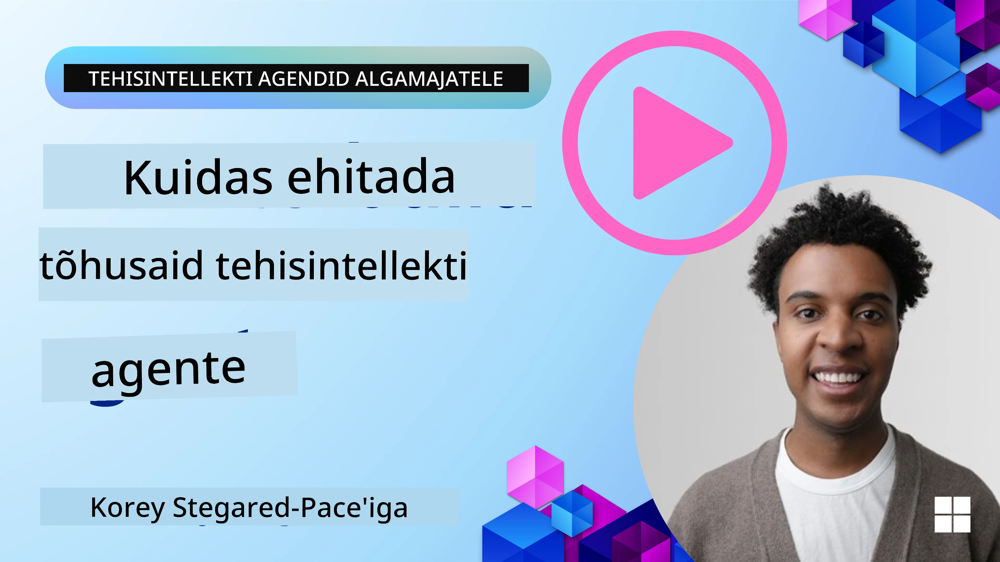
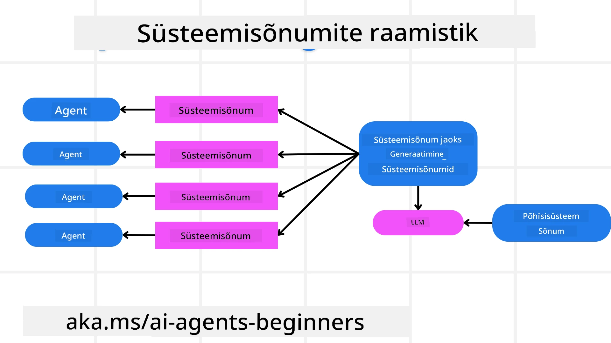
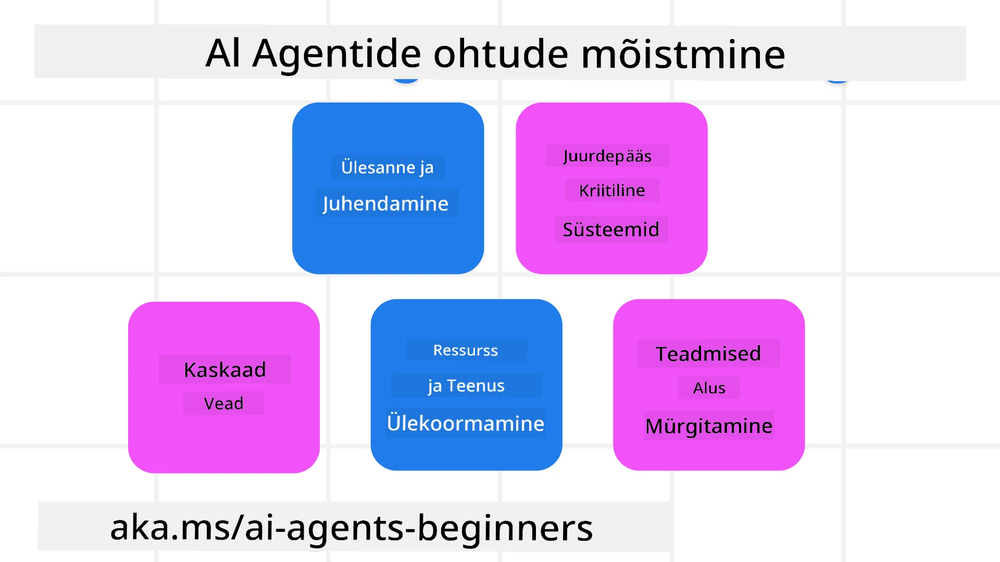
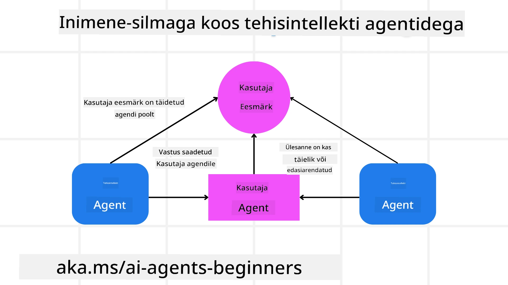

[](https://youtu.be/iZKkMEGBCUQ?si=Q-kEbcyHUMPoHp8L)

> _(Klõpsake ülaloleval pildil, et vaadata selle õppetunni videot)_

# Usaldusväärsete tehisintellekti agentide loomine

## Sissejuhatus

Selles õppetükis käsitletakse:

- Kuidas ehitada ja juurutada ohutuid ja tõhusaid tehisintellekti agente
- Olulised turvakaalutlused tehisintellekti agentide arendamisel.
- Kuidas tehisintellekti agentide arendamisel säilitada andmete ja kasutajate privaatsust.

## Õpieesmärgid

Pärast selle õppetüki läbimist oskad:

- Tuvastada ja vähendada riske tehisintellekti agentide loomisel.
- Rakendada turvameetmeid, et tagada andmete ja juurdepääsu nõuetekohane haldamine.
- Luua tehisintellekti agente, mis säilitavad andmete privaatsuse ja pakuvad kvaliteetset kasutajakogemust.

## Ohutus

Vaatame esmalt, kuidas ehitada ohutuid agentseid rakendusi. Ohutus tähendab, et tehisintellekti agent toimib vastavalt ettenähtule. Agentsete rakenduste loojatena on meil meetodid ja tööriistad ohutuse maksimeerimiseks:

### Süsteemsõnumite raamistiku loomine

Kui olete kunagi ehitanud tehisintellekti rakendust, kasutades suuri keelemudeleid (LLM-e), siis teate, kui oluline on kujundada tugev süsteemkäsklus või süsteemsõnum. Need käsud loovad meta-reeglid, juhised ja suunised selle kohta, kuidas LLM suhtleb kasutaja ja andmetega.

Tehisintellekti agentide puhul on süsteemkäsklus veelgi tähtsam, kuna agentidel on vaja väga spetsiifilisi juhiseid, et täita meile määratud ülesandeid.

Skaalautuvate süsteemkäskluste loomiseks võime kasutada süsteemsõnumite raamistikku ühe või mitme agendi ehitamiseks meie rakenduses:



#### Samm 1: Loo meta-süsteemsõnum 

Meta-käsklust kasutab LLM süsteemkäskluste genereerimiseks agentidele, keda loome. Me kujundame selle mallina, et vajadusel saaksime tõhusalt luua mitu agenti.

Siin on näide meta-süsteemsõnumist, mida me LLM-ile annaksime:

```plaintext
You are an expert at creating AI agent assistants. 
You will be provided a company name, role, responsibilities and other
information that you will use to provide a system prompt for.
To create the system prompt, be descriptive as possible and provide a structure that a system using an LLM can better understand the role and responsibilities of the AI assistant. 
```

#### Samm 2: Loo põhiline käsklus

Järgmine samm on luua põhiline käsklus AI agendi kirjeldamiseks. See peaks sisaldama agendi rolli, ülesandeid, mida agent täidab, ja muid agendi vastutusi.

Siin on näide:

```plaintext
You are a travel agent for Contoso Travel that is great at booking flights for customers. To help customers you can perform the following tasks: lookup available flights, book flights, ask for preferences in seating and times for flights, cancel any previously booked flights and alert customers on any delays or cancellations of flights.  
```

#### Samm 3: Esita LLM-ile põhiline süsteemsõnum

Nüüd saame seda süsteemsõnumit optimeerida, esitades meta-süsteemsõnumi süsteemsõnumina koos meie põhilise süsteemsõnumiga.

See loob süsteemsõnumi, mis on paremini loodud meie AI agentide juhendamiseks:

```markdown
**Company Name:** Contoso Travel  
**Role:** Travel Agent Assistant

**Objective:**  
You are an AI-powered travel agent assistant for Contoso Travel, specializing in booking flights and providing exceptional customer service. Your main goal is to assist customers in finding, booking, and managing their flights, all while ensuring that their preferences and needs are met efficiently.

**Key Responsibilities:**

1. **Flight Lookup:**
    
    - Assist customers in searching for available flights based on their specified destination, dates, and any other relevant preferences.
    - Provide a list of options, including flight times, airlines, layovers, and pricing.
2. **Flight Booking:**
    
    - Facilitate the booking of flights for customers, ensuring that all details are correctly entered into the system.
    - Confirm bookings and provide customers with their itinerary, including confirmation numbers and any other pertinent information.
3. **Customer Preference Inquiry:**
    
    - Actively ask customers for their preferences regarding seating (e.g., aisle, window, extra legroom) and preferred times for flights (e.g., morning, afternoon, evening).
    - Record these preferences for future reference and tailor suggestions accordingly.
4. **Flight Cancellation:**
    
    - Assist customers in canceling previously booked flights if needed, following company policies and procedures.
    - Notify customers of any necessary refunds or additional steps that may be required for cancellations.
5. **Flight Monitoring:**
    
    - Monitor the status of booked flights and alert customers in real-time about any delays, cancellations, or changes to their flight schedule.
    - Provide updates through preferred communication channels (e.g., email, SMS) as needed.

**Tone and Style:**

- Maintain a friendly, professional, and approachable demeanor in all interactions with customers.
- Ensure that all communication is clear, informative, and tailored to the customer's specific needs and inquiries.

**User Interaction Instructions:**

- Respond to customer queries promptly and accurately.
- Use a conversational style while ensuring professionalism.
- Prioritize customer satisfaction by being attentive, empathetic, and proactive in all assistance provided.

**Additional Notes:**

- Stay updated on any changes to airline policies, travel restrictions, and other relevant information that could impact flight bookings and customer experience.
- Use clear and concise language to explain options and processes, avoiding jargon where possible for better customer understanding.

This AI assistant is designed to streamline the flight booking process for customers of Contoso Travel, ensuring that all their travel needs are met efficiently and effectively.

```

#### Samm 4: Itereeri ja paranda

Selle süsteemsõnumite raamistikku väärtus on võimalus hõlbustada mitme agendi süsteemsõnumite loomist ja parandada oma süsteemsõnumeid aja jooksul. Harva juhtub, et süsteemsõnum töötab esimesel korral kogu teie kasutusjuhtumi jaoks. Võime teha väikseid muudatusi ja täiustusi, muutes põhilist süsteemsõnumit ja käivitades selle süsteemi kaudu, mis võimaldab tulemusi võrrelda ja hinnata.

## Ohtude mõistmine

Usaldusväärsete tehisintellekti agentide loomiseks on oluline mõista ja leevendada agentidele suunatud riske ja ohte. Vaatleme mõningaid erinevaid ohte tehisintellekti agentidele ja seda, kuidas nende jaoks paremini planeerida ja ette valmistuda.



### Ülesanne ja juhised

**Kirjeldus:** Ründajad püüavad muuta AI agendi juhiseid või eesmärke, kasutades käsklusi või sisendi manipuleerimist.

**Leevendus**: Tehke valideerimiskontrolle ja sisendifiltreid, et tuvastada potentsiaalselt ohtlikke käsklusi enne, kui neid AI agent töötleb. Kuna need rünnakud nõuavad tavaliselt tihedat suhtlust agendiga, on veel üks viis selliste rünnakute vältimiseks vestluse voorude arvu piiramine.

### Juurdepääs kriitilistele süsteemidele

**Kirjeldus**: Kui AI agentil on juurdepääs süsteemidele ja teenustele, mis salvestavad tundlikku teavet, võivad ründajad kompromiteerida kommunikatsiooni agendi ja nende teenuste vahel. Need võivad olla otsesed rünnakud või kaudsed katsed saada teavet nende süsteemide kohta läbi agendi.

**Leevendus**: AI agentidel peaks olema süsteemidele juurdepääs ainult vajadusepõhiselt, et vältida selliseid rünnakuid. Samuti peaks agenti ja süsteemi vaheline suhtlus olema turvaline. Autentimise ja juurdepääsukontrolli rakendamine on veel üks viis selle teabe kaitsmiseks.

### Ressursside ja teenuste ülekoormus

**Kirjeldus:** AI agentidel on ligipääs erinevatele tööriistadele ja teenustele, et ülesandeid täita. Ründajad võivad seda võimet kuritarvitada, saates läbi AI agendi suure hulga päringuid nende teenuste suunas, mis võib põhjustada süsteemirikkeid või suuri kulutusi.

**Leevendus:** Kehtestage poliitikad, mis piiravad AI agendi teenusele tehtavate päringute arvu. Vestluse voorude ja AI agendile esitatavate päringute arvu piiramine on veel üks viis selliste rünnakute ennetamiseks.

### Teadmistebaasi mürgitamine

**Kirjeldus:** Selline rünnak ei sihi AI agenti otseselt, vaid sihib teadmistebaasi ja muid teenuseid, mida AI agent kasutab. See võib hõlmata andmete või info korruptsiooni, mida agent kasutab ülesande täitmiseks, mis võib viia kallutatud või soovimatute vastusteni kasutajale.

**Leevendus:** Tehke regulaarset kontrolli andmete üle, mida AI agent oma töövoogudes kasutab. Tagage, et nende andmete juurdepääs on turvaline ja neid muudavad ainult usaldusväärsed isikud, et vältida sellist rünnakut.

### Kaskaadvead

**Kirjeldus:** AI agentidel on ligipääs erinevatele tööriistadele ja teenustele ülesannete täitmiseks. Ründajate tekitatud vead võivad põhjustada teiste süsteemide tõrkeid, mille külge AI agent on ühendatud, muutes rünnaku ulatuslikumaks ja raskemini tõrkeotsitavaks.

**Leevendus**: Üks viis selle vältimiseks on panna AI agent toimima piiratud keskkonnas, näiteks täites ülesandeid Docker-konteineris, et takistada otseseid süsteemirünnakuid. Tagalahenduste mehhanismide ja taaskäivituse loogika loomine, kui mõned süsteemid vastavad veaga, on veel üks viis suuremate süsteemirikkete vältimiseks.

## Inimene tsüklis

Veel üks tõhus viis usaldusväärsete AI agentide süsteemide loomisel on inimese kaasamine protsessi. See loob voogu, kus kasutajad saavad protsessi käigus anda agentidele tagasisidet. Kasutajad toimivad sisuliselt mitmeagendi süsteemis agendina, andes heakskiidu või lõpetades jooksva protsessi.



Siin on koodilõik, mis kasutab Microsoft Agent Frameworki, et näidata, kuidas seda kontseptsiooni rakendatakse:

```python
import os
from agent_framework.azure import AzureAIProjectAgentProvider
from azure.identity import AzureCliCredential

# Loo teenusepakkuja, mille puhul on nõutav inimkinnitus
provider = AzureAIProjectAgentProvider(
    credential=AzureCliCredential(),
)

# Loo agent koos inimkinnituse etapiga
response = provider.create_response(
    input="Write a 4-line poem about the ocean.",
    instructions="You are a helpful assistant. Ask for user approval before finalizing.",
)

# Kasutaja saab vastuse üle vaadata ja kinnitada
print(response.output_text)
user_input = input("Do you approve? (APPROVE/REJECT): ")
if user_input == "APPROVE":
    print("Response approved.")
else:
    print("Response rejected. Revising...")
```

## Kokkuvõte

Usaldusväärsete AI agentide ehitamine nõuab hoolikat disaini, tugevaid turvameetmeid ja pidevat iteratsiooni. Struktureeritud meta-käsklustesüsteemide rakendamise, potentsiaalsete ohtude mõistmise ja leevendusstrateegiate rakendamise kaudu saavad arendajad luua AI agente, mis on nii ohutud kui ka tõhusad. Lisaks tagab inimese kaasamine protsessi, et AI agentid jääksid kooskõlla kasutajate vajadustega ja samal ajal vähendataks riske. Kuna AI areneb edasi, on turvalisuse, privaatsuse ja eetiliste kaalutluste suhtes proaktiivne hoiak ülioluline usalduse ja usaldusväärsuse edendamiseks AI-põhistes süsteemides.

### Kas sul on veel küsimusi usaldusväärsete tehisintellekti agentide loomise kohta?

Liitu [Microsoft Foundry Discord](https://aka.ms/ai-agents/discord) et kohtuda teiste õppuritega, osaleda konsultatsioonitundides ja saada vastused oma AI agentide küsimustele.

## Lisamaterjalid

- <a href="https://learn.microsoft.com/azure/ai-studio/responsible-use-of-ai-overview" target="_blank">Vastutustundliku tehisintellekti ülevaade</a>
- <a href="https://learn.microsoft.com/azure/ai-studio/concepts/evaluation-approach-gen-ai" target="_blank">Generatiivsete tehisintellekti mudelite ja rakenduste hindamine</a>
- <a href="https://learn.microsoft.com/azure/ai-services/openai/concepts/system-message?context=%2Fazure%2Fai-studio%2Fcontext%2Fcontext&tabs=top-techniques" target="_blank">Ohutuse süsteemsõnumid</a>
- <a href="https://blogs.microsoft.com/wp-content/uploads/prod/sites/5/2022/06/Microsoft-RAI-Impact-Assessment-Template.pdf?culture=en-us&country=us" target="_blank">Riskihindamise mall</a>

## Eelmine õppetund

[Agentne RAG](../05-agentic-rag/README.md)

## Järgmine õppetund

[Planeerimise disainimuster](../07-planning-design/README.md)

---

<!-- CO-OP TRANSLATOR DISCLAIMER START -->
Lahtiütlus:
See dokument on tõlgitud tehisintellekti tõlke-teenuse Co-op Translator (https://github.com/Azure/co-op-translator) abil. Kuigi püüame täpsust, palun arvestage, et automatiseeritud tõlked võivad sisaldada vigu või ebatäpsusi. Algset dokumenti selle emakeeles tuleks pidada autoriteetseks allikaks. Olulise teabe puhul soovitatakse kasutada professionaalset inimtõlget. Me ei vastuta käesoleva tõlke kasutamisest tulenevate arusaamatuste ega valesti tõlgendamise eest.
<!-- CO-OP TRANSLATOR DISCLAIMER END -->