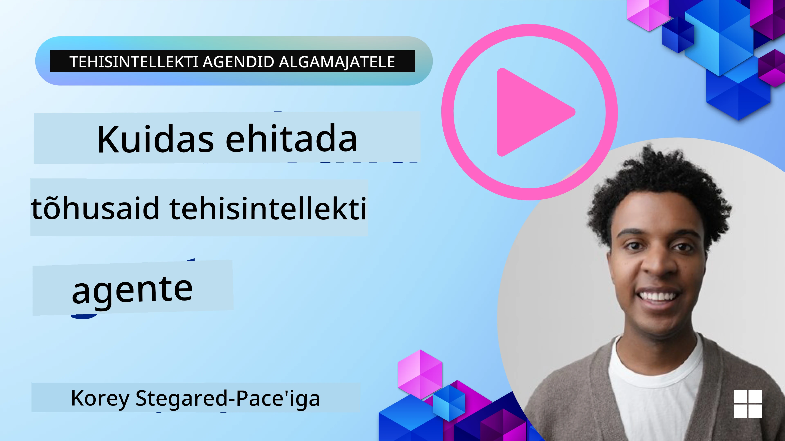
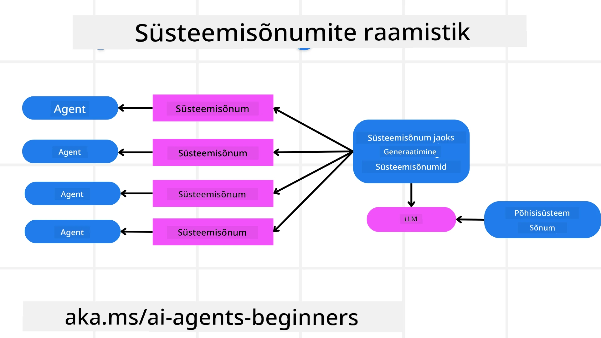
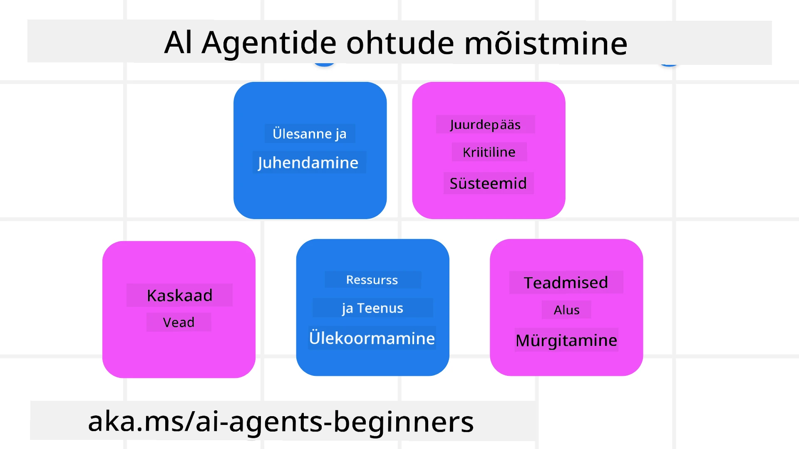
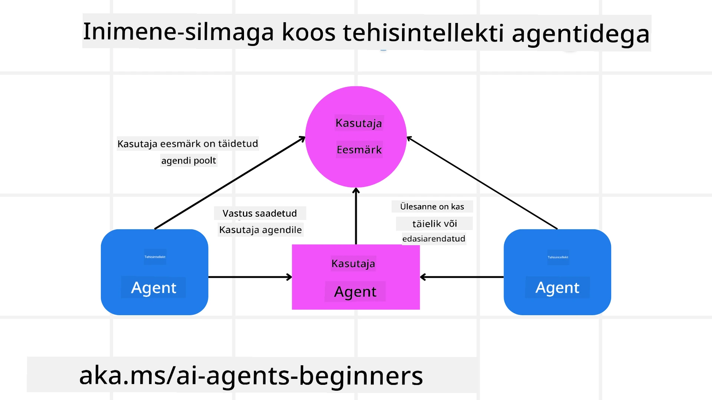

[](https://youtu.be/iZKkMEGBCUQ?si=Q-kEbcyHUMPoHp8L)

> _(Klõpsake ülaloleval pildil, et vaadata selle õppetunni videot)_

# Usaldusväärsete tehisintellekti agentide loomine

## Sissejuhatus

Selles õppetunnis käsitleme:

- Kuidas ehitada ja juurutada turvalisi ja tõhusaid tehisintellekti agente
- Olulisi turvakaalutlusi tehisintellekti agentide arendamisel
- Kuidas säilitada andmete ja kasutajate privaatsust tehisintellekti agentide arendamisel

## Õpieesmärgid

Pärast selle õppetunni läbimist oskad sa:

- Tuvastada ja vähendada riske tehisintellekti agentide loomisel
- Rakendada turvameetmeid, mis tagavad andmete ja juurdepääsu nõuetekohase haldamise
- Luua tehisintellekti agente, kes säilitavad andmete privaatsuse ja pakuvad kvaliteetset kasutajakogemust

## Turvalisus

Vaatame esmalt, kuidas ehitada turvalisi agentilisi rakendusi. Turvalisus tähendab, et tehisintellekti agent toimib vastavalt ettekirjutusele. Agentsete rakenduste loojatena on meil meetodid ja tööriistad, et maksimeerida turvalisust:

### Süsteemisõnumi raamistik

Kui oled kunagi loonud tehisintellekti rakendust, mis kasutab suuri keelemudeleid (LLM-e), tead, kui oluline on disainida tugevat süsteemipäringut või süsteemisõnumit. Need päringud määravad meta-reeglid, juhised ja suunised, kuidas LLM suhtleb kasutaja ja andmetega.

Tänapäeval on tehisintellekti agentide puhul süsteemipäring veelgi olulisem, kuna agentidel on vaja väga spetsiifilisi juhiseid nende ülesannete täitmiseks, mille me neile oleme määranud.

Skaalautuvate süsteemipäringute loomiseks võime kasutada süsteemisõnumi raamistikku ühe või enama agendi ülesehitamiseks meie rakenduses:



#### Samm 1: Loo meta süsteemisõnum

Meta päringut kasutab LLM süsteemisõnumite genereerimiseks meie loodud agentidele. Kujundame selle mallina, et vajadusel saaksime tõhusalt luua mitu agenti.

Siin on näide meta süsteemisõnumist, mida me LLM-ile annaksime:

```plaintext
You are an expert at creating AI agent assistants. 
You will be provided a company name, role, responsibilities and other
information that you will use to provide a system prompt for.
To create the system prompt, be descriptive as possible and provide a structure that a system using an LLM can better understand the role and responsibilities of the AI assistant. 
```

#### Samm 2: Loo põhipäring

Järgmiseks sammuks on luua põhipäring, mis kirjeldab AI agenti. Tuleks lisada agenadi roll, täidetavad ülesanded ja kõik teised agenti vastutusalad.

Näide:

```plaintext
You are a travel agent for Contoso Travel that is great at booking flights for customers. To help customers you can perform the following tasks: lookup available flights, book flights, ask for preferences in seating and times for flights, cancel any previously booked flights and alert customers on any delays or cancellations of flights.  
```

#### Samm 3: Paku põhisüsteemisõnum LLM-ile

Nüüd saame süsteemisõnumit optimeerida, pakkudes meta süsteemisõnumit koos meie põhisüsteemisõnumiga.

See loob süsteemisõnumi, mis on paremini kohandatud meie tehisintellekti agentide suunamiseks:

```markdown
**Company Name:** Contoso Travel  
**Role:** Travel Agent Assistant

**Objective:**  
You are an AI-powered travel agent assistant for Contoso Travel, specializing in booking flights and providing exceptional customer service. Your main goal is to assist customers in finding, booking, and managing their flights, all while ensuring that their preferences and needs are met efficiently.

**Key Responsibilities:**

1. **Flight Lookup:**
    
    - Assist customers in searching for available flights based on their specified destination, dates, and any other relevant preferences.
    - Provide a list of options, including flight times, airlines, layovers, and pricing.
2. **Flight Booking:**
    
    - Facilitate the booking of flights for customers, ensuring that all details are correctly entered into the system.
    - Confirm bookings and provide customers with their itinerary, including confirmation numbers and any other pertinent information.
3. **Customer Preference Inquiry:**
    
    - Actively ask customers for their preferences regarding seating (e.g., aisle, window, extra legroom) and preferred times for flights (e.g., morning, afternoon, evening).
    - Record these preferences for future reference and tailor suggestions accordingly.
4. **Flight Cancellation:**
    
    - Assist customers in canceling previously booked flights if needed, following company policies and procedures.
    - Notify customers of any necessary refunds or additional steps that may be required for cancellations.
5. **Flight Monitoring:**
    
    - Monitor the status of booked flights and alert customers in real-time about any delays, cancellations, or changes to their flight schedule.
    - Provide updates through preferred communication channels (e.g., email, SMS) as needed.

**Tone and Style:**

- Maintain a friendly, professional, and approachable demeanor in all interactions with customers.
- Ensure that all communication is clear, informative, and tailored to the customer's specific needs and inquiries.

**User Interaction Instructions:**

- Respond to customer queries promptly and accurately.
- Use a conversational style while ensuring professionalism.
- Prioritize customer satisfaction by being attentive, empathetic, and proactive in all assistance provided.

**Additional Notes:**

- Stay updated on any changes to airline policies, travel restrictions, and other relevant information that could impact flight bookings and customer experience.
- Use clear and concise language to explain options and processes, avoiding jargon where possible for better customer understanding.

This AI assistant is designed to streamline the flight booking process for customers of Contoso Travel, ensuring that all their travel needs are met efficiently and effectively.

```

#### Samm 4: Itereeri ja parenda

Selle süsteemisõnumi raamistikuga on väärtuseks see, et saame lihtsamini skaleerida süsteemisõnumite loomist mitme agendi jaoks ja aja jooksul oma süsteemisõnumeid parandada. Harva juhtub, et sul on süsteemisõnum, mis toimib esimese korraga täielikult sinu kasutusjuhtumi puhul. Väikeste muudatuste tegemine ja süsteemi kaudu jooksutamine võimaldab tulemeid võrrelda ja hinnata.

## Ohtude mõistmine

Usaldusväärsete AI-agentide ehitamiseks on oluline mõista ja leevendada riske ning ohte sinu AI-agenadi jaoks. Vaatame mõningaid erinevaid ohte AI-agentidele ja kuidas nendeks paremini planeerida ja valmistuda.



### Ülesanne ja juhised

**Kirjeldus:** Ründajad püüavad muuta AI-agendi juhiseid või eesmärke päringute või sisendi manipuleerimise kaudu.

**Leevendus:** Rakenda valideerimiskontrolle ja sisendifiltreid, et tuvastada potentsiaalselt ohtlikke päringuid enne nende töötlemist AI-agentide poolt. Kuna need rünnakud nõuavad tavaliselt tihedat suhtlust agendiga, aitab vestluspöördete arvu piiraminen ka selliste rünnakute vältimiseks.

### Juurdepääs kriitilistele süsteemidele

**Kirjeldus:** Kui AI-agent pääseb juurde süsteemidele ja teenustele, mis säilitavad tundlikku teavet, võivad ründajad kompromiteerida side agendi ja nende teenuste vahel. Need võivad olla otsesed rünnakud või kaudsed katsed koguda teavet nende süsteemide kohta agendi kaudu.

**Leevendus:** AI-agentidel tuleks olla juurdepääs süsteemidele ainult siis, kui see on vajalik, et vältida selliseid rünnakuid. Side agendi ja süsteemi vahel peaks samuti olema turvaline. Autentimise ja juurdepääsukontrolli rakendamine on veel üks kaitsemeede selle teabe kaitsmiseks.

### Ressursside ja teenuste ülekoormus

**Kirjeldus:** AI-agentidel on juurdepääs erinevatele tööriistadele ja teenustele ülesannete täitmiseks. Ründajad võivad kasutada seda võimalust teenuste ründamiseks, saates AI-agendi kaudu suures mahus päringuid, mis võib põhjustada süsteemide tõrkeid või suuri kulutusi.

**Leevendus:** Rakenda poliitikad, mis piiravad AI-agendi poolt teenusele suunatud päringute arvu. Ka vestluspöördete ja päringute arvu piiraminen AI-agentidele on veel üks viis selliste rünnakute vältimiseks.

### Teadmusbaasi saastamine

**Kirjeldus:** Seda tüüpi rünnak ei sihi otseselt AI-agentti, vaid teadmusbaasi ja muid teenuseid, mida agent kasutab. See võib hõlmata andmete või informatsiooni riknemist, mida AI-agent kasutab ülesande täitmiseks, põhjustades kallutatud või soovimatuid vastuseid kasutajale.

**Leevendus:** Teosta regulaarseid andmete kontrollimisi, mida AI-agent kasutab oma töövoogudes. Veendu, et juurdepääs neile andmetele oleks turvaline ja neid muudaksid ainult usaldusväärsed isikud sellise rünnaku vältimiseks.

### Vead ahelreaktsioonina

**Kirjeldus:** AI-agent pääseb juurde erinevatele tööriistadele ja teenustele ülesannete täitmiseks. Ründajate tekitatud vead võivad põhjustada teistega seotud süsteemide tõrkeid, muutes rünnaku ulatuslikumaks ja raskemini parandatavaks.

**Leevendus:** Üks viis vältimiseks on lasta AI-agendil töötada piiratud keskkonnas, näiteks Docker-konteineris, et takistada otseseid süsteemirünnakuid. Ka varuplaanide ja taasilmumise loogika loomine, kui teatud süsteemid vastavad veaga, aitab vältida suuremaid süsteemitõrkeid.

## Inimene tsüklis

Veel üks tõhus viis usaldusväärsete AI-agendite süsteemide loomiseks on kasutada inimest tsüklis. See loob voo, kus kasutajad saavad jooksvalt agentidele tagasisidet anda. Kasutajad toimivad sisuliselt agendidena mitme agendi süsteemis, pakkudes heakskiitu või protsessi lõpetamist.



Siin on koodilõik, mis kasutab Microsoft Agent Frameworki, et näidata, kuidas seda kontseptsiooni rakendada:

```python
import os
from agent_framework.foundry import FoundryChatClient
from azure.identity import AzureCliCredential

# Loo pakkuja koos inimese kinnitusega
provider = FoundryChatClient(
    project_endpoint=os.environ["AZURE_AI_PROJECT_ENDPOINT"],
    model=os.environ["AZURE_AI_MODEL_DEPLOYMENT_NAME"],
    credential=AzureCliCredential(),
)

# Loo agent inimkinnituse sammuga
response = provider.create_response(
    input="Write a 4-line poem about the ocean.",
    instructions="You are a helpful assistant. Ask for user approval before finalizing.",
)

# Kasutaja saab vastust üle vaadata ja kinnitada
print(response.output_text)
user_input = input("Do you approve? (APPROVE/REJECT): ")
if user_input == "APPROVE":
    print("Response approved.")
else:
    print("Response rejected. Revising...")
```

## Kokkuvõte

Usaldusväärsete AI-agentide loomine nõuab hoolikat disaini, tugevad turvameetmeid ja pidevat kordamist. Rakendades struktureeritud meta-päringute süsteeme, mõistes potentsiaalseid ohte ja rakendades leevendusstrateegiaid, saavad arendajad luua AI-agente, mis on nii turvalised kui ka tõhusad. Lisaks tagab inimese tsüklis lähenemine, et AI-agentid jäävad kooskõlla kasutajate vajadustega, minimeerides samal ajal riske. Kuna tehisintellekt areneb edasi, on proaktiivne hoiaku säilitamine turvalisuse, privaatsuse ja eetiliste kaalutluste osas võtmetähtsusega usalduse ja töökindluse edendamisel tehisintellektil põhinevates süsteemides.

## Koodinäited

- [`code_samples/06-system-message-framework.ipynb`](code_samples/06-system-message-framework.ipynb): Meta-päringu süsteemisõnumi raamistik samm-sammult.
- [`code_samples/06-human-in-the-loop.ipynb`](code_samples/06-human-in-the-loop.ipynb): Eelneva tegevuse heakskiidu väravad, riskiastmed ja auditeerimise logimine usaldusväärsete agentide jaoks.

### Kas sul on veel küsimusi usaldusväärsete AI-agentide loomise kohta?

Liitu [Microsoft Foundry Discordiga](https://discord.com/invite/ATgtXmAS5D), et kohtuda teiste õppuritega, osaleda tööaegadel ja saada vastuseid oma AI-agenti küsimustele.

## Lisamaterjalid

- <a href="https://learn.microsoft.com/azure/ai-studio/responsible-use-of-ai-overview" target="_blank">Vastutustundliku AI ülevaade</a>
- <a href="https://learn.microsoft.com/azure/ai-studio/concepts/evaluation-approach-gen-ai" target="_blank">Generatiivsete AI mudelite ja rakenduste hindamine</a>
- <a href="https://learn.microsoft.com/azure/ai-services/openai/concepts/system-message?context=%2Fazure%2Fai-studio%2Fcontext%2Fcontext&tabs=top-techniques" target="_blank">Turvalisuse süsteemisõnumid</a>
- <a href="https://blogs.microsoft.com/wp-content/uploads/prod/sites/5/2022/06/Microsoft-RAI-Impact-Assessment-Template.pdf?culture=en-us&country=us" target="_blank">Riskihindamise mall</a>

## Eelmine õppetund

[Agentic RAG](../05-agentic-rag/README.md)

## Järgmine õppetund

[Planeerimise disainimuster](../07-planning-design/README.md)

---

<!-- CO-OP TRANSLATOR DISCLAIMER START -->
**Lahtiütlus**:
See dokument on tõlgitud kasutades AI tõlketeenust [Co-op Translator](https://github.com/Azure/co-op-translator). Kuigi me püüdleme täpsuse poole, palun pange tähele, et automatiseeritud tõlgetes võib esineda vigu või ebatäpsusi. Originaaldokument selle emakeeles tuleks pidada autoriteetseks allikaks. Olulise teabe puhul soovitatakse kasutada professionaalset inimtõlget. Me ei vastuta selle tõlkega seotud eksimustest või valesti mõistmistest.
<!-- CO-OP TRANSLATOR DISCLAIMER END -->