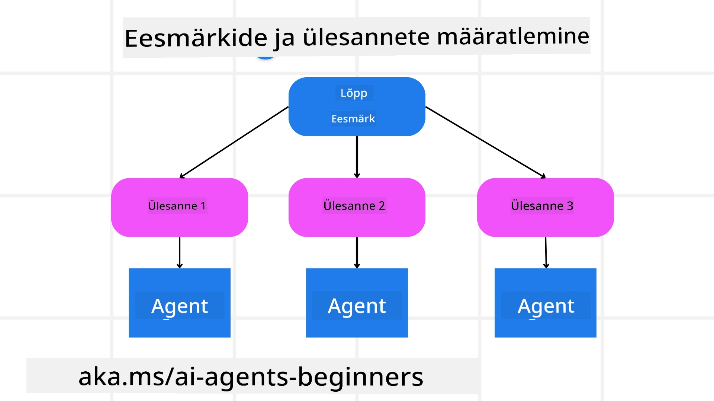

[](https://youtu.be/kPfJ2BrBCMY?si=9pYpPXp0sSbK91Dr)

> _(Klõpsake ülalolevale pildile, et vaadata selle õppetunni videot)_

# Planeerimise disain

## Sissejuhatus

Selles õppetunnis käsitletakse

* Selge üldeesmärgi defineerimine ning keeruka ülesande jagamine hallatavaks osadeks.
* Struktureeritud väljundi kasutamine usaldusväärsemate ja masinloetavate vastuste jaoks.
* Sündmustepõhise lähenemise rakendamine dünaamiliste ülesannete ja ootamatute sisendite käsitlemiseks.

## Õpieesmärgid

Pärast selle õppetunni läbimist on teil arusaam järgmistest:

* Määratlege ja seadke AI-agendi üldeesmärk, tagades, et see teab selgelt, mida tuleb saavutada.
* Lõhustage keerukas ülesanne hallatavateks alamülesanneteks ja korraldage need loogilisse järjekorda.
* Varustage agenti õige tööriistakomplektiga (nt otsingutööriistad või andmeanalüüsi tööriistad), otsustage, millal ning kuidas neid kasutatakse, ja käsitlege tekkivaid ootamatuid olukordi.
* Hinnake alamülesannete tulemusi, mõõtke sooritust ja iteratiivselt parendage tegevusi lõpliku väljundi parandamiseks.

## Üldeesmärgi määratlemine ja ülesande jaotamine



Enamik reaalse maailma ülesandeid on liiga keerulised, et neid saaks lahendada ühe sammuga. AI-agent vajab oma planeerimise ja tegevuste juhendamiseks lühikest eesmärki. Näiteks vaadake eesmärki:

    "Koosta 3-päevane reisiplaan."

Kuigi selle väljendamine on lihtne, vajab see siiski täpsustamist. Mida selgem eesmärk on, seda paremini saab agent (ja kõik inimkaaslased) keskenduda õige tulemuse saavutamisele, näiteks koostada põhjalik reisiplaan, mis sisaldab lennuvalikuid, hotelli soovitusi ja tegevuste ettepanekuid.

### Ülesande lõhustamine

Suured või keerukad ülesanded muutuvad hallatavamaks, kui need jagada väiksemateks, eesmärgipärasteks alamülesanneteks.
Reisiplaani näite puhul võiksite eesmärgi jagada järgmistesse alamülesannetesse:

* Lennupiletite broneerimine
* Hotelli broneerimine
* Autorent
* Isikupärastamine

Iga alamülesanne saab seejärel olla eraldiseisva agendi või protsessi ülesanne. Üks agent võib spetsialiseeruda parimate lennupakkumiste otsimisele, teine keskendub hotellibroneeringutele jne. Koordineeriv ehk "allvoogu" agent saab seejärel need tulemused kokku panna üheks sidusaks reisiplaaniks lõppkasutajale.

See modulaarne lähenemine võimaldab ka järkjärgulisi täiustusi. Näiteks võiksite lisada spetsialiseeritud agente toidusoovituste või kohalike tegevuste soovituste jaoks ning aja jooksul reisiplaani täpsustada.

### Struktureeritud väljund

Suured keelemudelid (LLM-id) võivad genereerida struktureeritud väljundit (nt JSON), mida on allvoogu minevate agentide või teenuste jaoks lihtsam parsida ja töödelda. See on eriti kasulik mitmeagendilises kontekstis, kus saab planeerimise väljundi kättesaamisel järgnevaid toiminguid teostada.

Järgmine Pythoni lõik demonstreerib lihtsat planeerimisagenti, mis lõhustab eesmärgi alamülesanneteks ja genereerib struktureeritud plaani:

```python
from pydantic import BaseModel
from enum import Enum
from typing import List, Optional, Union
import json
import os
from typing import Optional
from pprint import pprint
from agent_framework.azure import AzureAIProjectAgentProvider
from azure.identity import AzureCliCredential

class AgentEnum(str, Enum):
    FlightBooking = "flight_booking"
    HotelBooking = "hotel_booking"
    CarRental = "car_rental"
    ActivitiesBooking = "activities_booking"
    DestinationInfo = "destination_info"
    DefaultAgent = "default_agent"
    GroupChatManager = "group_chat_manager"

# Reisi alamülesande mudel
class TravelSubTask(BaseModel):
    task_details: str
    assigned_agent: AgentEnum  # soovime määrata ülesande agendile

class TravelPlan(BaseModel):
    main_task: str
    subtasks: List[TravelSubTask]
    is_greeting: bool

provider = AzureAIProjectAgentProvider(credential=AzureCliCredential())

# Määratle kasutaja sõnum
system_prompt = """You are a planner agent.
    Your job is to decide which agents to run based on the user's request.
    Provide your response in JSON format with the following structure:
{'main_task': 'Plan a family trip from Singapore to Melbourne.',
 'subtasks': [{'assigned_agent': 'flight_booking',
               'task_details': 'Book round-trip flights from Singapore to '
                               'Melbourne.'}
    Below are the available agents specialised in different tasks:
    - FlightBooking: For booking flights and providing flight information
    - HotelBooking: For booking hotels and providing hotel information
    - CarRental: For booking cars and providing car rental information
    - ActivitiesBooking: For booking activities and providing activity information
    - DestinationInfo: For providing information about destinations
    - DefaultAgent: For handling general requests"""

user_message = "Create a travel plan for a family of 2 kids from Singapore to Melbourne"

response = client.create_response(input=user_message, instructions=system_prompt)

response_content = response.output_text
pprint(json.loads(response_content))
```

### Planeerimisagent mitmeagendi orkestreerimisega

Selles näites saab semantiline marsruutijaagent kasutaja päringu (nt "Mul on vaja hotellikava oma reisiks.").

Planeerija seejärel:

* Vastuvõtab hotelli plaani: Planeerija võtab kasutaja sõnumi ja, tuginedes süsteemi lähtetekstile (sh saadavalolevate agentide andmed), genereerib struktureeritud reisiplaani.
* Loetleb agentid ja nende tööriistad: Agentide register sisaldab agentide nimekirja (nt lennud, hotellid, autorent ja tegevused) koos nende pakutavate funktsioonide või tööriistadega.
* Suunab plaani vastavatele agentidele: Sõltuvalt alamülesannete arvust saadab planeerija sõnumi kas otse pühendatud agendile (ühe-ülesande olukordades) või koordineerib mitmeagendilist koostööd grupivestluse halduri kaudu.
* Kokkuvõtte tulemuse: Lõpuks võtab planeerija genereeritud plaani kokku selguse huvides.
Järgmine Pythoni koodinäide illustreerib neid samme:

```python

from pydantic import BaseModel

from enum import Enum
from typing import List, Optional, Union

class AgentEnum(str, Enum):
    FlightBooking = "flight_booking"
    HotelBooking = "hotel_booking"
    CarRental = "car_rental"
    ActivitiesBooking = "activities_booking"
    DestinationInfo = "destination_info"
    DefaultAgent = "default_agent"
    GroupChatManager = "group_chat_manager"

# Reisi alamtöö mudel

class TravelSubTask(BaseModel):
    task_details: str
    assigned_agent: AgentEnum # soovime ülesande agendile määrata

class TravelPlan(BaseModel):
    main_task: str
    subtasks: List[TravelSubTask]
    is_greeting: bool
import json
import os
from typing import Optional

from agent_framework.azure import AzureAIProjectAgentProvider
from azure.identity import AzureCliCredential

# Loo klient

provider = AzureAIProjectAgentProvider(credential=AzureCliCredential())

from pprint import pprint

# Määratle kasutaja sõnum

system_prompt = """You are a planner agent.
    Your job is to decide which agents to run based on the user's request.
    Below are the available agents specialized in different tasks:
    - FlightBooking: For booking flights and providing flight information
    - HotelBooking: For booking hotels and providing hotel information
    - CarRental: For booking cars and providing car rental information
    - ActivitiesBooking: For booking activities and providing activity information
    - DestinationInfo: For providing information about destinations
    - DefaultAgent: For handling general requests"""

user_message = "Create a travel plan for a family of 2 kids from Singapore to Melbourne"

response = client.create_response(input=user_message, instructions=system_prompt)

response_content = response.output_text

# Prindi vastuse sisu pärast selle JSON-ina laadimist

pprint(json.loads(response_content))
```

Järgnevalt on eelmise koodi väljund ning seda struktureeritud väljundit saate seejärel suunata `assigned_agent`-ile ja kokku võtta reisiplaani lõppkasutajale.

```json
{
    "is_greeting": "False",
    "main_task": "Plan a family trip from Singapore to Melbourne.",
    "subtasks": [
        {
            "assigned_agent": "flight_booking",
            "task_details": "Book round-trip flights from Singapore to Melbourne."
        },
        {
            "assigned_agent": "hotel_booking",
            "task_details": "Find family-friendly hotels in Melbourne."
        },
        {
            "assigned_agent": "car_rental",
            "task_details": "Arrange a car rental suitable for a family of four in Melbourne."
        },
        {
            "assigned_agent": "activities_booking",
            "task_details": "List family-friendly activities in Melbourne."
        },
        {
            "assigned_agent": "destination_info",
            "task_details": "Provide information about Melbourne as a travel destination."
        }
    ]
}
```

Näidis-märkmik eelneva koodinäitega on saadaval [siin](07-python-agent-framework.ipynb).

### Iteratiivne planeerimine

Mõned ülesanded nõuavad vastastikust suhtlust või ümberplaneerimist, kus ühe alamülesande tulemus mõjutab järgmist. Näiteks kui agent avastab lennubroneeringute tegemisel ootamatu andmeformaadi, võib ta enne hotellibroneeringutele liikumist oma strateegiat kohandada.

Lisaks võib kasutajalt saadud tagasiside (nt inimene otsustab, et eelistab varasemat lendu) käivitada osalise ümberplaneerimise. See dünaamiline, iteratiivne lähenemine tagab, et lõplik lahendus vastab reaalse maailma piirangutele ja muutuvatele kasutaja eelistustele.

nt näidiskood

```python
from agent_framework.azure import AzureAIProjectAgentProvider
from azure.identity import AzureCliCredential
#.. sama mis eelmises koodis ja edasta kasutaja ajalugu ning praegune plaan

system_prompt = """You are a planner agent to optimize the
    Your job is to decide which agents to run based on the user's request.
    Below are the available agents specialized in different tasks:
    - FlightBooking: For booking flights and providing flight information
    - HotelBooking: For booking hotels and providing hotel information
    - CarRental: For booking cars and providing car rental information
    - ActivitiesBooking: For booking activities and providing activity information
    - DestinationInfo: For providing information about destinations
    - DefaultAgent: For handling general requests"""

user_message = "Create a travel plan for a family of 2 kids from Singapore to Melbourne"

response = client.create_response(
    input=user_message,
    instructions=system_prompt,
    context=f"Previous travel plan - {TravelPlan}",
)
# .. planeeri uuesti ja saada ülesanded vastavatele agentidele
```

Põhjalikuma planeerimise jaoks vaadake Magnetic One <a href="https://www.microsoft.com/research/articles/magentic-one-a-generalist-multi-agent-system-for-solving-complex-tasks" target="_blank">blogipostitust</a> keerukate ülesannete lahendamiseks.

## Kokkuvõte

Selles artiklis vaatasime näidet, kuidas luua planeerija, mis suudab dünaamiliselt valida määratletud saadaolevaid agente. Planeerija väljund lõhustab ülesanded ja määrab agendid, et need saaksid täidetud. Eeldatakse, et agentidel on juurdepääs ülesande täitmiseks vajalikele funktsioonidele/tööriistadele. Lisaks agentidele võite lisada ka muid mustreid, nagu reflektsioon, kokkuvõtte koostaja ja ringipõhine vestlus, et veelgi kohandada.

## Täiendavad ressursid

Magentic One - üldine mitmeagendiline süsteem keerukate ülesannete lahendamiseks, mis on saavutanud muljetavaldavaid tulemusi mitmetel keerulistel agentide benchmarkidel. Viide: <a href="https://www.microsoft.com/research/articles/magentic-one-a-generalist-multi-agent-system-for-solving-complex-tasks" target="_blank">Magentic One</a>. Selles implementeerimises loob orkestreerija ülesandespetsiifilised plaanid ja delegeerib need olemasolevatele agentidele. Lisaks planeerimisele kasutab orkestreerija ka jälgimismehhanismi, et jälgida ülesande edenemist ja vajadusel ümber planeerida.

### Kas teil on rohkem küsimusi planeerimise disainimustri kohta?

Liituge [Microsoft Foundry Discord](https://aka.ms/ai-agents/discord), et kohtuda teiste õppijatega, osaleda konsultatsioonides ja saada vastused oma AI-agentidega seotud küsimustele.

## Eelmine õppetund

[Usaldusväärsete AI-agentide loomine](../06-building-trustworthy-agents/README.md)

## Järgmine õppetund

[Mitmeagendi disainimuster](../08-multi-agent/README.md)

---

<!-- CO-OP TRANSLATOR DISCLAIMER START -->
**Lahtiütlus**:
See dokument on tõlgitud tehisintellekti tõlkevahendi [Co-op Translator](https://github.com/Azure/co-op-translator) abil. Kuigi püüame täpsust, arvestage, et automaatsed tõlked võivad sisaldada vigu või ebatäpsusi. Originaaldokument selle algkeeles tuleks pidada autoriteetseks allikaks. Olulise teabe puhul soovitatakse kasutada professionaalset inimtõlget. Me ei vastuta selle tõlke kasutamisest tekkida võivate arusaamatuste ega valede tõlgenduste eest.
<!-- CO-OP TRANSLATOR DISCLAIMER END -->