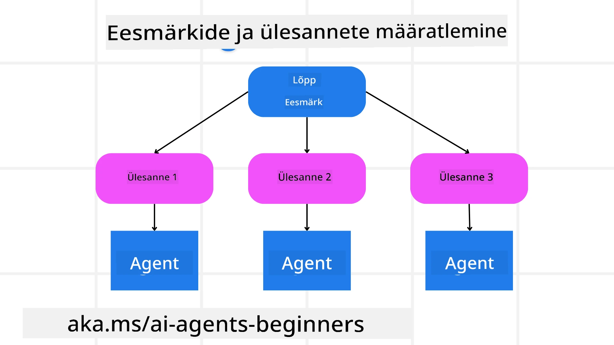

[](https://youtu.be/kPfJ2BrBCMY?si=9pYpPXp0sSbK91Dr)

> _(Klõpsake ülaloleval pildil, et vaadata selle õppetunni videot)_

# Planeerimise disain

## Sissejuhatus

See õppetund käsitleb

* Selge üldeesmärgi määratlemist ja keeruka ülesande jagamist hallatavateks osadeks.
* Struktureeritud väljundi kasutamist usaldusväärsemate ja masinloetavamate vastuste saamiseks.
* Sündmustepõhise lähenemise rakendamist dünaamiliste ülesannete ja ootamatute sisendite käsitlemiseks.

## Õpieesmärgid

Pärast selle õppetunni läbimist on teil arusaam sellest, kuidas:

* Tuvastada ja seadistada AI agendi üldeesmärk, tagades, et ta teab selgelt, mida saavutada.
* Jagada keerukas ülesandes hallatavad alamosad ning korraldada need loogiliseks järjestuseks.
* Varustada agendid õigete tööriistadega (nt otsingutööriistad või andmeanalüüsi tööriistad), otsustada, millal ja kuidas neid kasutada, ning hallata ootamatuid olukordi.
* Hinnata alamülesannete tulemusi, mõõta jõudlust ja iteratiivselt parandada tegevusi lõpliku väljundi parandamiseks.

## Üldeesmärgi määratlemine ja ülesande jagamine



Enamik reaalseid ülesandeid on liiga keerulised, et neid ühes etapis lahendada. AI agendil peab olema konkreetne eesmärk, mis juhib tema planeerimist ja tegevusi. Näiteks kaaluge järgmist eesmärki:

    "Koosta 3-päevane reisiplaan."

Kuigi see on lihtsasti sõnastatav, vajab see siiski täpsustamist. Mida selgem on eesmärk, seda paremini saab agent (ja kõik kaasatud inimesed) keskenduda õige tulemuse saavutamisele, näiteks luua põhjalik reisiplaan lennuvõimaluste, hotellisoovituste ja tegevuse ideedega.

### Ülesande lagundamine

Suured või keerulised ülesanded muutuvad hallatavaks, kui need jagada väiksemateks, eesmärgipõhisteks ülesanneteks.
Reisiplaani näite puhul võiksite eesmärgi lagundada järgmiselt:

* Lennupileti broneerimine
* Hotelli broneerimine
* Autorendi korraldamine
* Isikupärastamine

Iga alamosa saab siis lahendada pühendatud agendid või protsessid. Üks agent võib spetsialiseeruda parimate lennupakkumiste otsimisele, teine keskenduda hotellibroneeringutele jne. Koordineeriv või „järgmistes etappides“ tegutsev agent saab lõpuks kõik selle ühtseks ajakavaks kokku panna kasutajale.

See modulaarne lähenemine võimaldab ka järkjärgulisi täiustusi. Näiteks võite lisada spetsialiseerunud agente toidusoovituste või kohalikeks tegevusteks ning täiustada reisiplaani aja jooksul.

### Struktureeritud väljund

Suured keelemudelid (LLM-id) saavad genereerida struktureeritud väljundit (nt JSON), mida on lihtsam järgnevalt agentide või teenuste poolt töödelda. See on eriti kasulik mitme agendi kontekstis, kus saab ülesandeid tegutseda pärast planeerimise väljundi saamist.

Järgmine Pythoni näide demonstreerib lihtsat planeerimise agenti, kes lagundab eesmärgi alamülesanneteks ja genereerib struktureeritud plaani:

```python
from pydantic import BaseModel
from enum import Enum
from typing import List, Optional, Union
import json
import os
from typing import Optional
from pprint import pprint
from agent_framework.foundry import FoundryChatClient
from azure.identity import AzureCliCredential

class AgentEnum(str, Enum):
    FlightBooking = "flight_booking"
    HotelBooking = "hotel_booking"
    CarRental = "car_rental"
    ActivitiesBooking = "activities_booking"
    DestinationInfo = "destination_info"
    DefaultAgent = "default_agent"
    GroupChatManager = "group_chat_manager"

# Reisi Alamülesande Mudel
class TravelSubTask(BaseModel):
    task_details: str
    assigned_agent: AgentEnum  # me tahame ülesande agendile määrata

class TravelPlan(BaseModel):
    main_task: str
    subtasks: List[TravelSubTask]
    is_greeting: bool

provider = FoundryChatClient(
    project_endpoint=os.environ["AZURE_AI_PROJECT_ENDPOINT"],
    model=os.environ["AZURE_AI_MODEL_DEPLOYMENT_NAME"],
    credential=AzureCliCredential(),
)

# Määratle kasutaja sõnum
system_prompt = """You are a planner agent.
    Your job is to decide which agents to run based on the user's request.
    Provide your response in JSON format with the following structure:
{'main_task': 'Plan a family trip from Singapore to Melbourne.',
 'subtasks': [{'assigned_agent': 'flight_booking',
               'task_details': 'Book round-trip flights from Singapore to '
                               'Melbourne.'}
    Below are the available agents specialised in different tasks:
    - FlightBooking: For booking flights and providing flight information
    - HotelBooking: For booking hotels and providing hotel information
    - CarRental: For booking cars and providing car rental information
    - ActivitiesBooking: For booking activities and providing activity information
    - DestinationInfo: For providing information about destinations
    - DefaultAgent: For handling general requests"""

user_message = "Create a travel plan for a family of 2 kids from Singapore to Melbourne"

response = client.create_response(input=user_message, instructions=system_prompt)

response_content = response.output_text
pprint(json.loads(response_content))
```

### Planeerimise agent mitme agendi orkestreerimisega

Selles näites saab Semantiline Sõlmega Agent kasutajapäringu (nt „Vajan oma reisile hotelliplaani.“).

Seejärel:

* Saab hotellikava: planeerija võtme kasutaja sõnumi ja põhinedes süsteemi juhise (sh saadaval agentide detailid), genereerib struktureeritud reisiplaani.
* Loetleb agendid ja nende tööriistad: agentide registris on loetelu agentidest (nt lendude, hotellide, autorendi ja tegevuste jaoks) koos nende pakutavate funktsioonide või tööriistadega.
* Suunab plaani vastavatele agentidele: sõltuvalt ülesannete arvust saadab planeerija sõnumi kas otse määratud agendile (üksiku ülesande puhul) või koordineerib grupivestluse halduri kaudu mitme agendi koostöö korral.
* Võtab tulemuse kokku: lõpuks teeb planeerija genereeritud plaani selgitamiseks kokkuvõtte.
Järgmine Pythoni koodinäide illustreerib neid samme:

```python

from pydantic import BaseModel

from enum import Enum
from typing import List, Optional, Union

class AgentEnum(str, Enum):
    FlightBooking = "flight_booking"
    HotelBooking = "hotel_booking"
    CarRental = "car_rental"
    ActivitiesBooking = "activities_booking"
    DestinationInfo = "destination_info"
    DefaultAgent = "default_agent"
    GroupChatManager = "group_chat_manager"

# Reisi alamtöö mudel

class TravelSubTask(BaseModel):
    task_details: str
    assigned_agent: AgentEnum # me tahame ülesande agendile määrata

class TravelPlan(BaseModel):
    main_task: str
    subtasks: List[TravelSubTask]
    is_greeting: bool
import json
import os
from typing import Optional

from agent_framework.foundry import FoundryChatClient
from azure.identity import AzureCliCredential

# Loo klient

provider = FoundryChatClient(
    project_endpoint=os.environ["AZURE_AI_PROJECT_ENDPOINT"],
    model=os.environ["AZURE_AI_MODEL_DEPLOYMENT_NAME"],
    credential=AzureCliCredential(),
)

from pprint import pprint

# Määra kasutaja sõnum

system_prompt = """You are a planner agent.
    Your job is to decide which agents to run based on the user's request.
    Below are the available agents specialized in different tasks:
    - FlightBooking: For booking flights and providing flight information
    - HotelBooking: For booking hotels and providing hotel information
    - CarRental: For booking cars and providing car rental information
    - ActivitiesBooking: For booking activities and providing activity information
    - DestinationInfo: For providing information about destinations
    - DefaultAgent: For handling general requests"""

user_message = "Create a travel plan for a family of 2 kids from Singapore to Melbourne"

response = client.create_response(input=user_message, instructions=system_prompt)

response_content = response.output_text

# Trüki vastuse sisu pärast selle laadimist JSON-ina

pprint(json.loads(response_content))
```

Järgmine on eelmise koodi väljund ja saate seda struktureeritud väljundit kasutada `assigned_agent`-ile suunamiseks ja reisiplaani kasutajale kokkusummamiseks.

```json
{
    "is_greeting": "False",
    "main_task": "Plan a family trip from Singapore to Melbourne.",
    "subtasks": [
        {
            "assigned_agent": "flight_booking",
            "task_details": "Book round-trip flights from Singapore to Melbourne."
        },
        {
            "assigned_agent": "hotel_booking",
            "task_details": "Find family-friendly hotels in Melbourne."
        },
        {
            "assigned_agent": "car_rental",
            "task_details": "Arrange a car rental suitable for a family of four in Melbourne."
        },
        {
            "assigned_agent": "activities_booking",
            "task_details": "List family-friendly activities in Melbourne."
        },
        {
            "assigned_agent": "destination_info",
            "task_details": "Provide information about Melbourne as a travel destination."
        }
    ]
}
```

Näide selle eelneva koodinäitega märkmikust on saadaval [siin](./code_samples/07-python-agent-framework.ipynb).

### Iteratiivne planeerimine

Mõned ülesanded nõuavad edasitagasi käimist või planeerimise ümbertegemist, kus ühe alamosa tulemus mõjutab järgmist. Näiteks, kui agent avastab lennupileti broneerimisel ootamatu andmeformaadi, võib ta enne hotellibroneeringute juurde minekut oma strateegiat kohandada.

Lisaks võib kasutajapoolne tagasiside (nt inimene otsustab, et eelistab varasemat lendu) käivitada osalise ümberplaneerimise. See dünaamiline, iteratiivne lähenemine tagab, et lõplik lahendus vastab reaalse maailma piirangutele ja muutuvatele kasutuseelistustele.

nt näidiskood

```python
import os
from agent_framework.foundry import FoundryChatClient
from azure.identity import AzureCliCredential
#.. sama mis eelnevas koodis ja edasta kasutaja ajalugu, praegune plaan

system_prompt = """You are a planner agent to optimize the
    Your job is to decide which agents to run based on the user's request.
    Below are the available agents specialized in different tasks:
    - FlightBooking: For booking flights and providing flight information
    - HotelBooking: For booking hotels and providing hotel information
    - CarRental: For booking cars and providing car rental information
    - ActivitiesBooking: For booking activities and providing activity information
    - DestinationInfo: For providing information about destinations
    - DefaultAgent: For handling general requests"""

user_message = "Create a travel plan for a family of 2 kids from Singapore to Melbourne"

response = client.create_response(
    input=user_message,
    instructions=system_prompt,
    context=f"Previous travel plan - {TravelPlan}",
)
# .. tee uus plaan ja saada ülesanded vastavatele esindajatele
```

Üldisema planeerimise jaoks vaadake Magnetic One <a href="https://www.microsoft.com/research/articles/magentic-one-a-generalist-multi-agent-system-for-solving-complex-tasks" target="_blank">Blogipostitus</a> keerukate ülesannete lahendamiseks.

## Kokkuvõte

Selles artiklis vaatasime näidet, kuidas luua planeerija, mis suudab dünaamiliselt valida määratletud saadaval olevad agendid. Planeerija väljund lagundab ülesanded ja määrab agendid nende täitmiseks. Eeldatakse, et agentidel on juurdepääs funktsioonidele/tööriistadele, mis on ülesande täitmiseks vajalikud. Lisaks agentidele saate lisada ka muid mustreid nagu refleksioon, kokkuvõtja ja ringvestlus veelgi kohandamiseks.

## Täiendavad ressursid

Magnetic One – Üldine mitme agendi süsteem keerukate ülesannete lahendamiseks, mis on saavutanud muljetavaldavaid tulemusi mitmete keeruliste agentide testide raames. Viide: <a href="https://www.microsoft.com/research/articles/magentic-one-a-generalist-multi-agent-system-for-solving-complex-tasks" target="_blank">Magnetic One</a>. Selles rakenduses loob orkestreerija ülesandepõhised plaanid ja delegeerib need saadaval olevatele agentidele. Planeerimise kõrval kasutab orkestreerija ka jälgimismehhanismi, et kontrollida ülesande edenemist ja vajadusel ümber planeerida.

### Kas teil on planeerimise disainimustri kohta veel küsimusi?

Liituge [Microsoft Foundry Discordiga](https://discord.com/invite/ATgtXmAS5D), et kohtuda teiste õppijatega, osaleda vastuvõtu tundides ja saada vastuseid oma AI agentide küsimustele.

## Eelmine õppetund

[Usaldusväärsete AI agentide loomine](../06-building-trustworthy-agents/README.md)

## Järgmine õppetund

[Mitme agendi disainimuster](../08-multi-agent/README.md)

---

<!-- CO-OP TRANSLATOR DISCLAIMER START -->
**Lahtiütlus**:
See dokument on tõlgitud kasutades AI tõlketeenust [Co-op Translator](https://github.com/Azure/co-op-translator). Kuigi me püüdleme täpsuse poole, palun pange tähele, et automatiseeritud tõlgetes võib esineda vigu või ebatäpsusi. Originaaldokument selle emakeeles tuleks pidada autoriteetseks allikaks. Olulise teabe puhul soovitatakse kasutada professionaalset inimtõlget. Me ei vastuta selle tõlkega seotud eksimustest või valesti mõistmistest.
<!-- CO-OP TRANSLATOR DISCLAIMER END -->