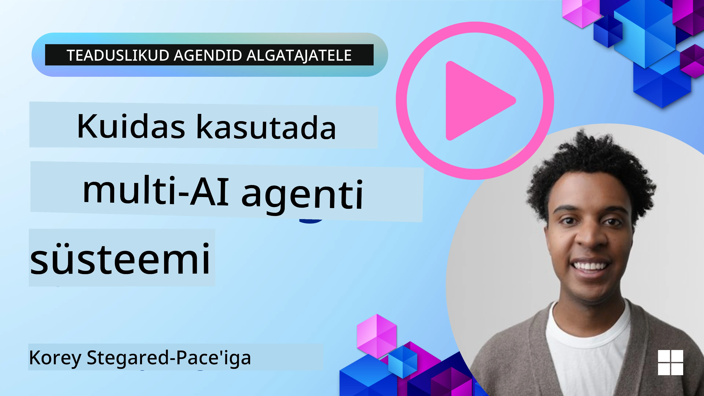
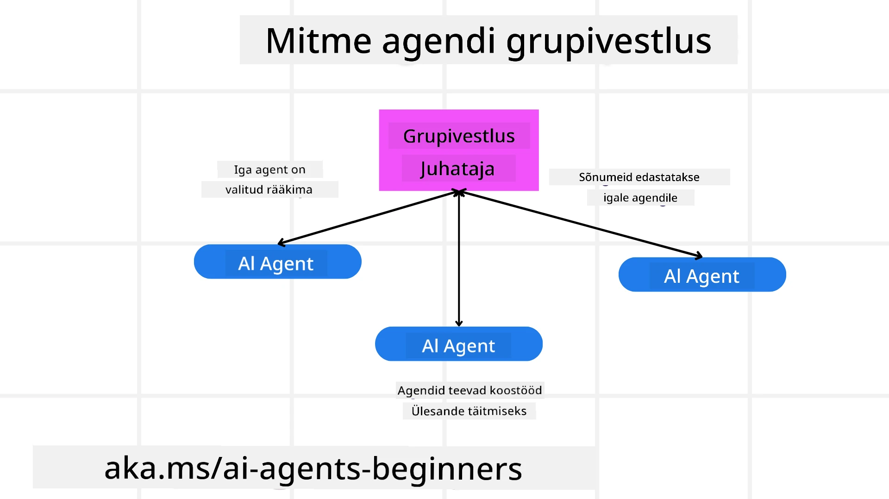
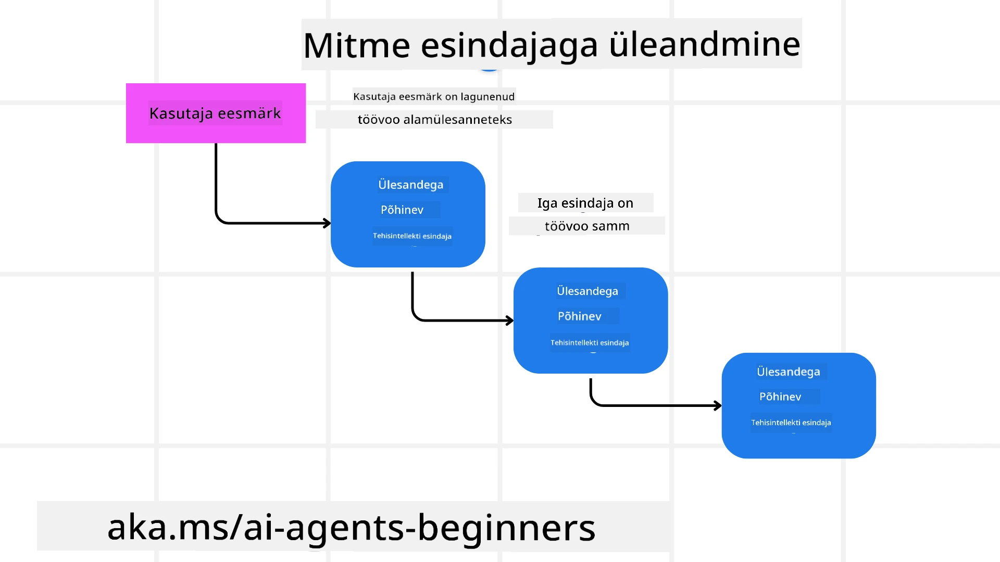
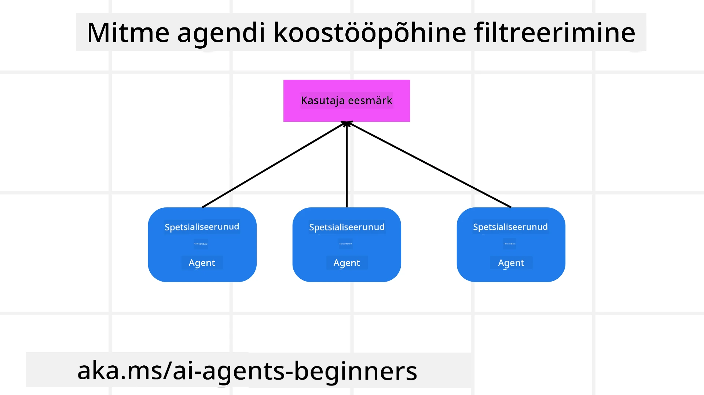

> _(Klõpsa ülaloleval pildil, et vaadata selle õppetunni videot)_

# Mitmeagendi disainimustrid

Niipea, kui hakkate töötama projektiga, mis hõlmab mitut agendi, peate kaaluma mitmeagendi disainimustrit. Siiski ei pruugi kohe olla selge, millal üle minna mitmele agendile ja millised on selle eelised.

## Sissejuhatus

Selles õppetükis püüame vastata järgmistele küsimustele:

- Millistes olukordades on mitmeagendid rakendatavad?
- Millised on mitmeagendi kasutamise eelised võrreldes üheainsa agendiga, kes täidab mitut ülesannet?
- Millised on mitmeagendi disainimustri rakendamise põhikomponendid?
- Kuidas saada ülevaadet sellest, kuidas mitmed agendid omavahel suhtlevad?

## Õpieesmärgid

Pärast seda õppetundi peaksid suutma:

- Tuvastada olukordi, kus mitmeagendi lahendused on sobivad
- Tunda ära mitmeagendi kasutamise eelised võrreldes ühe agendiga
- Mõista mitmeagendi disainimustri rakendamise põhikomponente

Mis on laiem pilt?

*Mitmeagendid on disainimuster, mis võimaldab mitmel agendil koos töötada ühise eesmärgi nimel*.

Seda mustrit kasutatakse laialdaselt erinevates valdkondades, sealhulgas robootikas, autonoomsetes süsteemides ja hajutatud arvutuses.

## Juhtumid, kus mitmeagendid sobivad

Millised olukorrad on head mitmeagendi kasutamiseks? Vastus on, et on palju olukordi, kus mitmeagendi kasutamine on kasulik, eriti järgmistes juhtudel:

- **Suur töömaht**: Suur töö jagatakse väiksemateks ülesanneteks ja määratakse erinevatele agentidele, võimaldades paralleelset töötlemist ja kiiremat lõpetamist. Näiteks suurandmete töötlemise ülesanne.
- **Kompleksed ülesanded**: Nagu suurte tööde puhul, saab keerulised ülesanded jagada väiksemateks alaufункtsioonideks ning määrata erinevatele agentidele, kus igaüks spetsialiseerub konkreetsele aspektile. Näiteks isesõitvate sõidukite puhul võivad erinevad agendid hallata navigeerimist, takistuste tuvastamist ja suhtlust teiste sõidukitega.
- **Mitmekesine ekspertteadmiste baas**: Erinevatel agentidel võib olla erinev ekspertteadmiste ala, mis võimaldab neil käsitleda ülesande erinevaid aspekte tõhusamalt kui ühe agendi puhul. Hea näide on tervishoid, kus agendid võivad tegeleda diagnostika, raviplaanide ja patsiendijälgimisega.

## Eelised mitmeagendi kasutamisel ühe agendi ees

Ühe agendi süsteem võib toimida hästi lihtsate ülesannete puhul, kuid keerukamate ülesannete korral võib mitmeagendi kasutamine pakkuda mitmeid eeliseid:

- **Spetsialiseerumine**: Iga agent võib spetsialiseeruda konkreetsele ülesandele. Spetsialiseerumise puudumine ühe agendi puhul tähendab, et teil on agent, kes suudab teha kõike, kuid võib keerulise ülesande ees segadusse sattuda ja lõpuks teha ülesande, milleks ta ei ole parim.
- **Skaleeritavus**: Süsteemi on lihtsam skaleerida, lisades rohkem agente, kui koormata ühte agenti üle.
- **Rikke taluvus**: Kui üks agent ebaõnnestub, saavad teised jätkata, tagades süsteemi töökindluse.

Võtame näite: broneerime kasutaja jaoks reisi. Ühe agendi süsteem peaks haldama kõiki reisi broneerimise aspekte alates lendudest kuni hotellide ja autorendini. Selle saavutamiseks ühe agendi abil peaks agentil olema tööriistad kõigi nende ülesannete täitmiseks. See võib viia keeruka ja monoliitse süsteemi tekkeni, mida on raske hooldada ja skaleerida. Mitmeagendi süsteem seevastu võiks omada erinevaid agente, kes spetsialiseeruvad lendude otsimisele, hotellide broneerimisele ja autorentidele. See muudaks süsteemi modulaarsemaks, lihtsamini hooldatavaks ja skaleeritavaks.

Võrrelge seda emapoe-reisibürooga võrreldes frantsiisiga. Emapoel oleks üks agent, kes haldab kõiki reisi broneerimise aspekte, samal ajal kui frantsiisil oleks erinevaid agente, kes tegelevad eri aspektidega.

## Mitmeagendi disainimustri rakendamise põhikomponendid

Enne kui saate mitmeagendi disainimustri rakendada, peate mõistma mustri põhikomponente.

Teeme selle konkreetsemaks, vaadates uuesti näidet kasutaja reisi broneerimisest. Selles näites hõlmavad põhikomponendid järgmist:

- **Agentide suhtlus**: Lendude otsimise, hotellide broneerimise ja autorendifirmade agentidel peab olema omavaheline suhtlus ja teabe jagamine kasutaja eelistuste ja piirangute kohta. Peate otsustama selle suhtluse protokollide ja meetodite üle. Konkreetselt tähendab see, et lendude otsimise agent peab suhtlema hotellide broneerimise agentiga, et tagada hotelli broneerimine samadel kuupäevadel kui lend. See tähendab, et agentidel tuleb jagada teavet kasutaja reisikuupäevade kohta, mis tähendab, et peate otsustama *millised agendid infot jagavad ja kuidas nad infot jagavad*.
- **Koordineerimismehhanismid**: Agendid peavad koordineerima oma tegevusi, et tagada kasutaja eelistuste ja piirangute täitmine. Kasutaja eelistus võib olla näiteks soov hotellist, mis asub lähedal lennujaamale, samas kui piirang võib olla see, et autorendid on saadaval ainult lennujaamas. See tähendab, et hotellide broneerimise agent peab koordineerima autorendifirma agendiga, et tagada kasutaja eelistuste ja piirangute täitmine. See tähendab, et peate otsustama *kuidas agendid oma tegevusi koordineerivad*.
- **Agendi arhitektuur**: Agentidel peab olema sisemine struktuur otsuste tegemiseks ja õppimiseks kasutajaga suhtlemisest. See tähendab, et lendude otsimise agent peab omama sisemist struktuuri otsustamaks, milliseid lende kasutajale soovitada. See tähendab, et peate otsustama *kuidas agendid otsuseid teevad ja õpivad kasutajaga suhtlemisest*. Näiteks võib lendude otsimise agent kasutada masinõppemudelit, et soovitada lende kasutaja varasemate eelistuste põhjal.
- **Ülevaade mitmeagendi interaktsioonidest**: Te vajate nähtavust selle kohta, kuidas mitmed agendid üksteisega suhtlevad. See tähendab, et teil peavad olema tööriistad ja tehnikad agentide tegevuste ja interaktsioonide jälgimiseks. See võib avalduda logimise ja monitooringu tööriistadena, visualiseerimistööriistadena ja jõudlusmõõdikutena.
- **Mitmeagendi mustrid**: Mitmeagendi süsteemide rakendamiseks on erinevaid mustreid, nagu tsentraliseeritud, detsentraliseeritud ja hübriidse arhitektuuriga lahendused. Peate valima mustri, mis sobib teie kasutusjuhtumiga kõige paremini.
- **Inimene tsüklis**: Enamikel juhtudel on süsteemis inimene tsüklis ja peate juhistama agente, millal küsida inimsekkumist. See võib avalduda kasutaja soovis konkreetse hotelli või lennu järele, mida agendid ei ole soovitanud, või soovis saada kinnitust enne lennu või hotelli broneerimist.

## Ülevaade mitmeagendi interaktsioonidest

Oluline on omada ülevaadet sellest, kuidas mitmed agendid omavahel suhtlevad. See nähtavus on hädavajalik silumise, optimeerimise ja kogu süsteemi efektiivsuse tagamiseks. Selle saavutamiseks peate omama tööriistu ja tehnikaid agentide tegevuste ja interaktsioonide jälgimiseks. See võib väljenduda logimise ja monitooringu tööriistadena, visualiseerimistööriistadena ja jõudlusmõõdikutena.

Näiteks reisi broneerimise puhul võiksite omada juhtpaneeli, mis kuvab iga agendi oleku, kasutaja eelistused ja piirangud ning agentide vahelised interaktsioonid. See juhtpaneel võiks kuvada kasutaja reisikuupäevad, lendude soovitused lendude agendilt, hotellide soovitused hotelli agendilt ja autorendifirma soovitused autorendi agendilt. See annaks selge ülevaate, kuidas agendid omavahel suhtlevad ja kas kasutaja eelistusi ning piiranguid järgitakse.

Vaatame iga aspekti lähemalt.

- **Logimine ja monitooringutööriistad**: Soovite logida iga agendi poolt tehtud tegevusi. Logi kirje võiks salvestada teavet agendi kohta, kes tegevuse tegi, tehtud tegevuse, tegevuse aja ja tegevuse tulemuse. Seda teavet saab seejärel kasutada silumiseks, optimeerimiseks ja muuks.
- **Visualiseerimistööriistad**: Visualiseerimistööriistad aitavad näha agentide vahelisi interaktsioone intuitiivsemal viisil. Näiteks võite omada graafikut, mis näitab teabe voogu agentide vahel. See võib aidata tuvastada kitsaskohti, ebatõhususi ja muid süsteemi probleeme.
- **Jõudlusmõõdikud**: Jõudlusmõõdikud aitavad jälgida mitmeagendi süsteemi tõhusust. Näiteks võite mõõta ülesande täitmiseks kuluvat aega, täidetud ülesannete arvu ajaühiku kohta ja agentide poolt tehtud soovituste täpsust. See teave aitab tuvastada parendamist vajavaid alasid ja optimeerida süsteemi.

## Mitmeagendi mustrid

Sukeldume mõnda konkreetsesse mustrisse, mida saab kasutada mitmeagendi rakenduste loomiseks. Siin on mõned huvitavad mustrid, mida tasub kaaluda:

### Rühma vestlus

See muster on kasulik, kui soovite luua rühma vestluse rakenduse, kus mitu agendi saavad omavahel suhelda. Selle mustri tüüpilised kasutusjuhtumid hõlmavad meeskonnatööd, kliendituge ja sotsiaalvõrgustikke.

Selles mustris esindab iga agent kasutajat rühma vestluses ning sõnumeid vahetatakse agentide vahel sõnumiprotokolli abil. Agendid saavad saata sõnumeid rühma vestlusesse, saada sõnumeid rühma vestlusest ja vastata teiste agentide sõnumitele.

Seda mustrit saab rakendada kas tsentraliseeritud arhitektuuri abil, kus kõik sõnumid marsruutivad keskserveri kaudu, või detsentraliseeritud arhitektuuri abil, kus sõnumeid vahetatakse otse.

### Ülesande üleandmine

See muster on kasulik, kui soovite luua rakenduse, kus mitu agenti saavad üksteisele ülesandeid üle anda.

Tüüpilised kasutusjuhtumid hõlmavad kliendituge, ülesannete haldamist ja töövoo automatiseerimist.

Selles mustris esindab iga agent ülesannet või sammu töövoos ning agentide vahel saab ülesandeid üle anda eeldefineeritud reeglite alusel.

### Koostööpõhine filtreerimine

See muster on kasulik, kui soovite luua rakenduse, kus mitu agendi saavad koostöös kasutajatele soovitusi teha.

Miks soovite, et mitu agendi teeksid koostööd, on see, et iga agent võib omada erinevat ekspertiisi ja anda soovitusprotsessi panuse erineval viisil.

Vaatame näidet, kus kasutaja soovib soovitust parima aktsia ostmiseks börsil.

- **Tööstuse ekspert**:. Üks agent võiks olla konkreetse tööstusharu ekspert.
- **Tehniline analüüs**: Teine agent võiks olla tehnilise analüüsi ekspert.
- **Fundamentaalne analüüs**: Ja kolmas agent võiks olla fundamentaalse analüüsi ekspert. Koostöös suudavad need agendid pakkuda kasutajale põhjalikumat soovitust.

## Stsenaarium: Tagasimakse protsess

Mõelge stsenaariumile, kus klient üritab saada tootele tagasimakset — selles protsessis võib osaleda üsna palju agente, kuid jagame need protsessile spetsiifilisteks agentideks ja üldisteks agentideks, mida saab kasutada muudes protsessides.

**Tagasimakse protsessile spetsiifilised agendid**:

Järgmistest agentidest võiks tagasimakse protsessis osa olla:

- **Kliendiagent**: See agent esindab klienti ja vastutab tagasimakse protsessi algatamise eest.
- **Müüjaagent**: See agent esindab müüjat ja vastutab tagasimakse töötlemise eest.
- **Makseagent**: See agent esindab makseprotsessi ja vastutab kliendi makse tagasimaksmise eest.
- **Lahendusagent**: See agent esindab lahendamise protsessi ja vastutab kõigi tagasimakse protsessi käigus tekkivate probleemide lahendamise eest.
- **Vastavusagent**: See agent esindab vastavuse protsessi ja vastutab selle eest, et tagasimakse protsess vastaks regulatsioonidele ja poliitikatele.

**Üldised agendid**:

Neid agente saab kasutada ka teie ettevõtte teistes osades.

- **Tarneagent**: See agent esindab tarneprotsessi ja vastutab toote tagastamise müüjale saatmise eest. Seda agenti saab kasutada nii tagasimakse protsessis kui ka üldise toote tarnimise puhul näiteks ostu korral.
- **Tagasisideagent**: See agent esindab tagasiside kogumise protsessi ja vastutab kliendilt tagasiside kogumise eest. Tagasisidet võidakse küsida igal ajal, mitte ainult tagasimakse protsessi jooksul.
- **Eskalatsiooniagent**: See agent esindab eskalatsiooni protsessi ja vastutab probleemide tõstmise eest kõrgemale tugitasemele. Seda tüüpi agenti saate kasutada igas protsessis, kus on vaja probleemi eskaleerida.
- **Teavitamisagent**: See agent esindab teavituse protsessi ja vastutab teavituste saatmise eest kliendile erinevates tagasimakse protsessi etappides.
- **Analüüsiagent**: See agent esindab analüüsi protsessi ja vastutab tagasimakse protsessiga seotud andmete analüüsimise eest.
- **Auditagent**: See agent esindab auditi protsessi ja vastutab tagasimakse protsessi auditeerimise eest, et tagada protsessi nõuetekohane läbiviimine.
- **Aruandlusagent**: See agent esindab aruandlusprotsessi ja vastutab tagasimakse protsessi aruannete genereerimise eest.
- **Teadmisteagent**: See agent esindab teadmiste haldamise protsessi ja vastutab tagasimakse protsessiga seotud teadmistebaasi haldamise eest. See agent võib olla teadlik nii tagasimaksetest kui ka muudest teie äri osadest.
- **Turvaagent**: See agent esindab turbeprotsessi ja vastutab tagasimakse protsessi turvalisuse tagamise eest.
- **Kvaliteediagent**: See agent esindab kvaliteedi protsessi ja vastutab tagasimakse protsessi kvaliteedi tagamise eest.

Eelnevalt loetleti üsna palju agente nii konkreetse tagasimakse protsessi jaoks kui ka üldisi agente, mida saab kasutada teie ettevõtte muudes osades. Loodetavasti annab see teile ettekujutuse, kuidas otsustada, milliseid agente kasutada oma mitmeagendi süsteemis.

## Ülesanne

Kujunda mitmeagendi süsteem klienditoe protsessi jaoks. Tuvasta protsessis osalevad agendid, nende rollid ja vastutusvaldkonnad ning kuidas nad omavahel suhtlevad. Kaalu nii klienditoele spetsiifilisi agente kui ka üldisi agente, mida saab kasutada teie ettevõtte muudes osades.
> Mõtle enne järgmise lahenduse lugemist, sul võib vaja minna rohkem agente, kui arvad.
>
> Vihje: Mõtle klienditoe protsessi erinevatele etappidele ja ka agentidele, keda võib iga süsteemi jaoks vaja minna.

## Solution

[Lahendus](./solution/solution.md)

## Knowledge checks

Question: When should you consider using multi-agents?

- [ ] A1: Kui sul on väike töömaht ja lihtne ülesanne.
- [ ] A2: Kui sul on suur töömaht
- [ ] A3: Kui sul on lihtne ülesanne.

[Solution quiz](./solution/solution-quiz.md)

## Summary

Selles õppetükis vaatasime lähemalt mitmeagendi disainimustrit, kaasa arvatud olukorrad, kus mitmeagendid on sobivad, mitmeagentide kasutamise eelised võrreldes ühe agenti kasutamisega, mitmeagendi disainimustri rakendamise ehitusplokid ning kuidas saada ülevaadet, kuidas mitmed agendid omavahel suhtlevad.

### Got More Questions about the Multi-Agent Design Pattern?

Liitu the [Microsoft Foundry Discord](https://aka.ms/ai-agents/discord), et kohtuda teiste õppijatega, osaleda konsultatsioonitundidel ja saada vastused oma AI agentide küsimustele.

## Additional resources

- <a href="https://learn.microsoft.com/azure/ai-services/agents/overview" target="_blank">Microsoft Agent Frameworki dokumentatsioon</a>
- <a href="https://www.analyticsvidhya.com/blog/2024/10/agentic-design-patterns/" target="_blank">Agentlikud disainimustrid</a>

## Previous Lesson

[Disaini planeerimine](../07-planning-design/README.md)

## Next Lesson

[Metakognitsioon AI agentides](../09-metacognition/README.md)

---

<!-- CO-OP TRANSLATOR DISCLAIMER START -->
Lahtiütlus:
See dokument on tõlgitud tehisintellekti tõlketeenuse Co-op Translator (https://github.com/Azure/co-op-translator) abil. Kuigi püüame tagada täpsust, palun pidage meeles, et automaatsed tõlked võivad sisaldada vigu või ebatäpsusi. Originaaldokument selle algses keeles tuleks pidada autoriteetseks allikaks. Olulise teabe puhul soovitatakse kasutada professionaalset inimtõlget. Me ei vastuta selle tõlke kasutamisest tulenevate arusaamatuste või valesti tõlgendamise eest.
<!-- CO-OP TRANSLATOR DISCLAIMER END -->