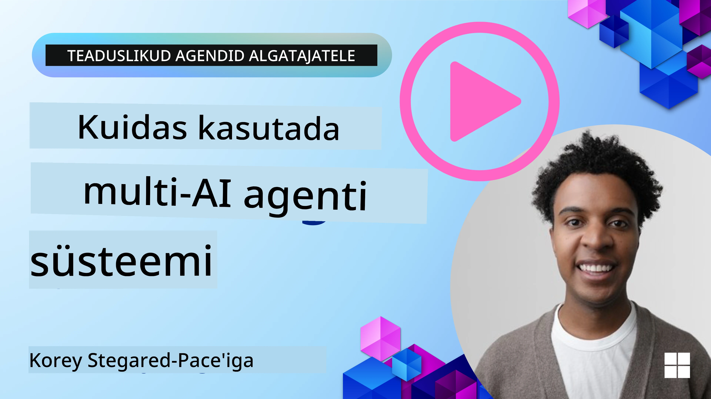
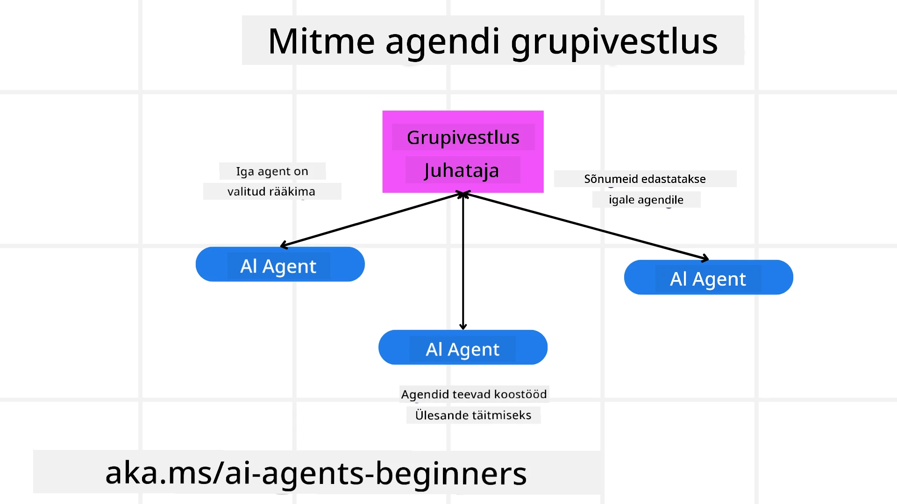
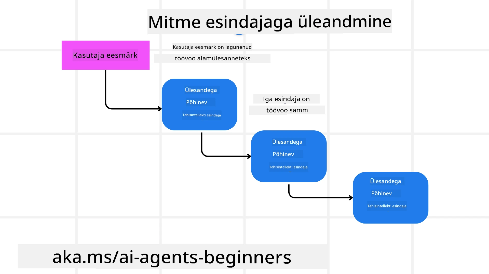
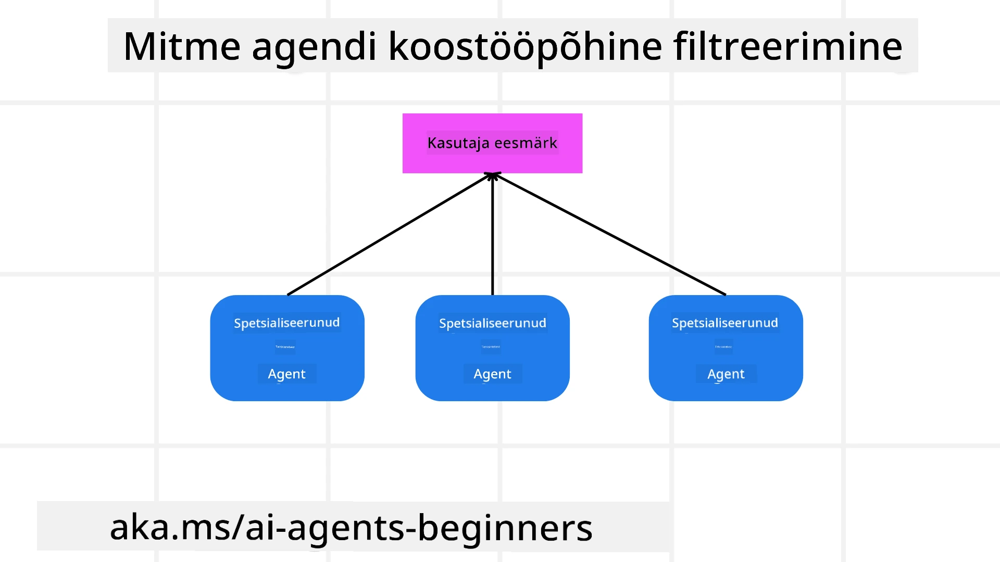

> _(Vajuta ülalolevale pildile, et vaadata selle tunni videot)_

# Mitme agendi disainimustrid

Niipea kui hakkad töötama projektiga, mis hõlmab mitut agenti, pead arvestama mitme agendi disainimustriga. Kuid ei pruugi kohe olla selge, millal tuleks üle minna mitme agendi kasutamisele ja millised on selle eelised.

## Sissejuhatus

Selles tunnis püüdleme järgmiste küsimuste vastuste leidmise poole:

- Millistes olukordades on mitme agendi kasutamine sobilik?
- Millised on mitme agendi kasutamise eelised võrreldes üheainsa mitme ülesandega agendiga?
- Millised on mitme agendi disainimustri rakendamise põhikomponendid?
- Kuidas saame näha, kuidas mitmed agendid omavahel suhtlevad?

## Õpieesmärgid

Selle tunni lõpuks peaksid suutma:

- Tuvastada olukorrad, kus sobib mitme agendi kasutamine
- Mõista mitme agendi kasutamise eeliseid võrreldes üheainsa agendiga
- Mõista mitme agendi disainimustri rakendamise põhikomponente

Mis on suurem pilt?

*Mitme agendi muster võimaldab mitmel agendil koostööd teha ühise eesmärgi saavutamiseks.*

Seda mustrit kasutatakse laialdaselt erinevates valdkondades, sealhulgas robootikas, autonoomsetes süsteemides ja hajutatud arvutustes.

## Olukorrad, kus mitme agendi kasutamine on sobilik

Millised olukorrad sobivad hästi mitme agendi kasutamiseks? Vastus on, et on palju olukordi, kus mitme agendi kasutamine on kasulik, eriti järgmistes juhtudel:

- **Suured töökoormused**: Suured töökoormused saab jagada väiksemateks ülesanneteks ja määrata erinevatele agentidele, võimaldades paralleelset töötlemist ja kiiremat lõpetamist. Näiteks suur andmetöötluse ülesanne.
- **Keerukad ülesanded**: Keerukaid ülesandeid, nagu suured töökoormused, saab jagada väiksemateks alamosadeks ja määrata erinevatele agentidele, kes spetsialiseeruvad ülesande teatud aspektidele. Näiteks autonoomsed sõidukid, kus erinevad agendid haldavad navigeerimist, takistuste tuvastamist ja sidepidamist teiste sõidukitega.
- **Mitmekesine ekspertteadmiste pagas**: Erinevatel agentidel võib olla mitmekesine ekspertteadmiste baas, mis võimaldab neil ülesande erinevaid aspekte paremini hallata kui üks agent. Näiteks tervishoius, kus agendid haldavad diagnostikat, raviplaane ja patsientide jälgimist.

## Mitme agendi kasutamise eelised võrreldes üheainsa agendiga

Üksikagentne süsteem võib hästi toimida lihtsate ülesannete puhul, kuid keerukamate ülesannete korral võib mitme agendi kasutamine pakkuda mitmeid eeliseid:

- **Spetsialiseerumine**: Iga agent võib olla spetsialiseerunud konkreetsele ülesandele. Ühe agendi spetsialiseerumise puudumine tähendab, et agent võib teha kõike, kuid võib keeruka ülesande puhul segadusse sattuda või teha ülesande, milleks ta ei ole kõige paremini sobiv.
- **Skaalautuvus**: Süsteemi on lihtsam laiendada, lisades rohkem agente, kui koormata üht agenti üle.
- **Tõrketaluvus**: Kui üks agent läheb rivist välja, võivad teised jätkata tööd, tagades süsteemi usaldusväärsuse.

Võtame näiteks kasutaja reisi broneerimise. Üksikagentne süsteem peaks haldama kõiki reisi broneerimise aspekte, lennupiletite leidmisest hotellide ja autorendifirmade broneerimiseni. Selle saavutamiseks peaks agendil olema tööriistad kõigi nende ülesannete täitmiseks, mis võib viia keeruka ja monoliitse süsteemini, mida on raske hooldada ja laiendada. Mitme agendi süsteem võib seevastu kasutada eraldi agente lennupiletite leidmiseks, hotellide ja autorendifirma broneerimiseks. See muudaks süsteemi modulaarsemaks, hõlpsamini hooldatavaks ja skaleeritavaks.

Võrdle seda reisibürooga, mis töötab väikekaupluse mudelis võrreldes frantsiisiga. Väikekauplus kasutaks üht agenti kõigi reisi broneerimise aspektide haldamiseks, samas kui frantsiis kasutaks erinevaid agente erinevate ülesannete täitmiseks.

## Mitme agendi disainimustri rakendamise komponendid

Enne kui saad mitme agendi disainimustrit rakendada, pead mõistma mustri põhilisi komponente.

Teeme selle konkreetsemaks, vaadates taas kasutaja reisi broneerimise näidet. Antud juhul hõlmavad komponendid järgmist:

- **Agenditevaheline suhtlus**: Lennupiletite leidmise, hotellide ja autorendifirma broneerimise agendid peavad suhtlema ja jagama infot kasutaja eelistuste ja piirangute kohta. Pead otsustama protokollid ja meetodid selle suhtluse jaoks. Näiteks peab lennupiletite agent suhtlema hotellibroneeringu agendiga, et tagada hotelli broneerimine samade kuupäevadeks kui lend. See tähendab, et agendid peavad jagama infot kasutaja reisi kuupäevade kohta ja sa pead otsustama *millised agendid infot jagavad ja kuidas nad infot jagavad*.
- **Koordineerimismehhanismid**: Agendid peavad koordineerima oma tegevusi, et tagada kasutaja eelistuste ja piirangute täitmine. Näiteks kasutaja soovib hotelli lennujaama lähedal, kuid autorendid on võimalikud ainult lennujaamas. Hotellide broneerimise agent peab kooskõlastama end autorendifirma agendiga, et tagada kasutaja nõuete täitmine. Pead otsustama *kuidas agendid oma tegevusi koordineerivad*.
- **Agendi arhitektuur**: Agentidel peab olema sisemine struktuur otsuste tegemiseks ja kasutajaga suhtlemisest õppimiseks. Näiteks lennupiletite leidmise agent peab otsustama, milliseid lende kasutajale soovitada, õppides tema eelistustest. Pead otsustama *kuidas agendid otsuseid langetavad ja kasutajaga suhtlemisest õpivad*. Näiteks võib lennuagent kasutada masinõppemudelit, et soovitada lende vastavalt kasutaja varasematele eelistustele.
- **Mitme agendi suhtluse jälgimine**: Pead nägema, kuidas erinevad agendid omavahel suhtlevad. Selleks on vaja tööriistu ja tehnikaid agentide tegevuste ja suhtluse jälgimiseks, näiteks logimistööriistad, visualiseerimisvahendid ja sooritusnäitajad.
- **Mitme agendi mustrid**: On erinevaid mustreid mitme agendi süsteemide loomiseks, nagu tsentraliseeritud, detsentraliseeritud ja hübriidarhitektuurid. Pead valima mustri, mis sobib sinu kasutusjuhtumile kõige paremini.
- **Inimene ahelas**: Enamasti on inimesel süsteemis roll ja pead käsitlema, millal agentid peaksid küsima inimsekkumist. Näiteks kasutaja võib küsida konkreetset hotelli või lendu, mida agentid pole soovitanud või ta võib küsida kinnitust enne lennu või hotelli broneerimist.

## Mitme agendi suhtluse jälgimine

On oluline jälgida, kuidas mitmed agendid omavahel suhtlevad. See on hädavajalik silumisel, optimeerimisel ja süsteemi tõhususe tagamisel. Selle saavutamiseks on vaja tööriistu ja tehnikaid agentide tegevuste ja suhtluse jälgimiseks, näiteks logimine, monitorimine, visualiseerimine ja sooritusmõõdikud.

Näiteks kasutaja reisi broneerimise puhul võiks olla armatuurlaud, mis näitab iga agendi staatust, kasutaja eelistusi ja piiranguid, ning agentide omavahelist suhtlust. See armatuurlaud võib kuvada kasutaja reisi kuupäevi, lennupiletite agenti soovitusi, hotelliagentide soovitusi ja autorendifirma agentide soovitusi, andes selge ülevaate agentide omavahelisest koostööst ja sellest, kas kasutaja soovid on täidetud.

Vaatame neid aspekte üksikasjalikumalt.

- **Logimise ja jälgimise tööriistad**: Iga agenti tegevuse jaoks tehakse logi, mis salvestab infot tegevust sooritanud agendi, tegevuse, tegevuse aja ja tulemuse kohta. Seda saab kasutada silumiseks, optimeerimiseks jms.

- **Visualiseerimisvahendid**: Need aitavad kuvada agentide vahelist suhtlust intuitiivsemalt, näiteks graafik, mis näitab info liikumist agentide vahel. See võib aidata märgata kitsaskohti, ebatõhususi ja muid probleeme.

- **Sooritusmõõdikud**: Need aitavad jälgida, kui hästi mitme agendi süsteem töötab. Näiteks ülesande täitmise aeg, ülesannete arv ühikus ajas ja agentide soovituste täpsus. Neist andmetest on abi parandusvõimaluste leidmisel ja süsteemi optimeerimisel.

## Mitme agendi mustrid

Vaatame mõningaid konkreetseid mustreid mitme agendi rakenduste loomiseks. Siin on mõned huvitavad mustrid, mida kaaluda:

### Gruppivestlus

See muster sobib grupivestluse rakenduseks, kus mitu agenti saavad omavahel suhelda. Tavapärased kasutusjuhtumid hõlmavad meeskonnatööd, kliendituge ja sotsiaalvõrgustikke.

Selles mustris esindab iga agent grupivestluse kasutajat ja sõnumeid vahetatakse agentide vahel sõnumiprotokolli kaudu. Agendid saavad saata sõnumeid grupivestlusesse, vastu võtta sõnumeid ja vastata teiste agentide sõnumitele.

Muster võib põhineda tsentraliseeritud arhitektuuril, kus kõik sõnumid juhitakse läbi keskserveri, või detsentraliseeritud arhitektuuril, kus sõnumeid vahetatakse otse.

### Ülekandmine

See muster sobib rakenduseks, kus mitu agenti saavad ülesandeid üksteisele üle anda.

Tavapärased kasutusjuhtumid hõlmavad kliendituge, ülesannete haldamist ja töövoo automatiseerimist.

Selles mustris esindab iga agent ülesannet või sammu töövoos ning agendid võivad ülesandeid anda teistele agentidele eeldefineeritud reeglite alusel.

### Koostööl põhinev filtreerimine

See muster sobib rakenduseks, kus mitu agenti teevad koostööd soovituste tegemiseks kasutajatele.

Mitme agendi koostöö on kasulik, kuna iga agent võib olla eri valdkonna ekspert ja panustada soovitusprotsessi erinevalt.

Näide: kasutaja soovib soovitust parima aktsia ostmiseks aktsiaturul.

- **Tööstusharu ekspert**: Üks agent võib olla konkreetse tööstusharu ekspert.
- **Tehniline analüüs**: Teine agent võib olla tehnilise analüüsi ekspert.
- **Põhianalüüs**: Kolmas agent võib olla põhianalüüsi ekspert. Koostöös suudavad need agendid anda kasutajale põhjalikuma soovituse.

## Juhtum: Tagasimakse protsess

Kujutame ette olukorda, kus klient üritab saada toodete eest tagasimakset. Sellesse protsessi võib olla kaasatud päris palju agente, kuid jagame need konkreetseteks selle protsessi agentideks ja üldisteks agentideks, mida saab kasutada ka muudes protsessides.

**Tagasimakse protsessi spetsiifilised agendid**:

Siin on mõned agentid, kes võivad tagasimakse protsessis osaleda:

- **Kliendiagent**: See agent esindab klienti ja vastutab tagasimakse protsessi algatamise eest.
- **Müüjaagent**: See agent esindab müüjat ja vastutab tagasimakse töötlemise eest.
- **Makseteenuse agent**: See agent esindab makseteenust ja vastutab kliendi makse tagastamise eest.
- **Lahenduse agent**: See agent tegeleb protsessis tekkivate probleemide lahendamisega.
- **Vastavuse agent**: See agent tagab, et tagasimakse protsess vastab õiguslikele ja poliitilistele nõuetele.

**Üldised agendid**:

Neid agente saab kasutada ka sinu ettevõtte teiste osade poolt.

- **Saateagent**: See agent tegeleb toote tagasisaatmisega müüjale. Seda agenti saab kasutada nii tagasimakse protsessis kui ka toote üldises saatmises näiteks ostu korral.
- **Tagasiside agent**: See agent kogub kliendi tagasisidet. Tagasisidet võib koguda igal ajal, mitte ainult tagasimakse protsessi jooksul.
- **Tõusustamise agent**: See agent tõstab probleemid kõrgemale tugitasandile. Seda tüüpi agenti saab kasutada igas protsessis, kus on vaja eskaleerida probleeme.
- **Teavituse agent**: See agent saadab kliendile teavitusi tagasimakse protsessi erinevatel etappidel.
- **Analüüsi agent**: See agent analüüsib tagasimakse protsessiga seotud andmeid.
- **Auditagent**: See agent auditeerib tagasimakse protsessi, et tagada selle korrektsus.
- **Aruandlusagent**: See agent genereerib aruandeid tagasimakse protsessi kohta.
- **Teadmisteagent**: See agent haldab teadmusbaasi, mis puudutab tagasimakse protsessi. Võib olla teadlik nii tagasimaksetest kui ka teistest ärivaldkondadest.
- **Turbeagent**: See agent vastutab tagasimakse protsessi turvalisuse eest.
- **Kvaliteediagent**: See agent tagab tagasimakse protsessi kvaliteedi.

Eelnevate agentide nimekiri on päris pikk nii spetsiifiliste tagasimakse agentide kui ka üldiste agentide puhul, mida saab kasutada ka ettevõtte teistes valdkondades. Loodetavasti annab see ülevaate, kuidas otsustada, milliseid agente oma mitme agendi süsteemis kasutada.

## Kodutöö

Kujunda mitme agendi süsteem klienditoe protsessi jaoks. Tuvasta protsessis osalevad agendid, nende rollid ja vastutus ning kuidas nad omavahel suhtlevad. Arvesta nii klienditoe spetsiifiliste agentide kui ka üldiste agentidega, keda saab kasutada ettevõtte teistes valdkondades.

> Mõtle enne järgmise lahenduse lugemist järele, sul võib vaja minna rohkem agente, kui arvad.

> NIPP: Mõtle klienditoe protsessi erinevatele etappidele ning ka süsteemist sõltuvatele agentidele.

## Lahendus

[Lahendus](./solution/solution.md)

## Teadmiste kontroll

### Küsimus 1

Milline stsenaarium sobib kõige paremini mitme agendiga süsteemile?

- [ ] A1: Tugitööriist vastab korduvatele küsimustele, kasutades üht teadmistebaasi ja väikest tööriistakomplekti.
- [ ] A2: Tagasimakse töövoog nõuab eraldi pettusevastast, maksete ja vastavuskontrolli rolli, igaühel oma tööriistad, mille tulemusi tuleb koordineerida.
- [ ] A3: Sama lihtne klassifikatsioonipäring saabub tuhandeid kordi tunnis.

### Küsimus 2

Millal on parem valida ühe agendi kasutamine?

- [ ] A1: Ülesande saab lahendada ühe juhiste ja tööriistade komplektiga, ilma spetsialistide vahe edastamiseta.
- [ ] A2: Agenil on juurdepääs rohkem kui ühele tööriistale.
- [ ] A3: Töövoog nõuab erinevate õigustega eraldi rolle ja sõltumatuid auditeid.

[Lahenduse viktoriin](./solution/solution-quiz.md)

## Kokkuvõte

Selles õppetükis vaatasime mitme agendi disainimustrit, sealhulgas olukordi, kus mitme agenti kasutamine on sobiv, mitme agendi eeliseid võrreldes ühe agendiga, mitme agendi disainimustri põhikomponente ja kuidas jälgida, kuidas erinevad agendid omavahel suhtlevad.

### Kas sul on veel küsimusi mitme agendi disainimustri kohta?

Liitu [Microsoft Foundry Discordiga](https://discord.com/invite/ATgtXmAS5D), et kohtuda teiste õppijatega, osaleda kontorite tundides ja saada vastused oma tehisintellekti agentide küsimustele.

## Lisamaterjalid

- <a href="https://learn.microsoft.com/azure/ai-services/agents/overview" target="_blank">Microsofti agendi raamistiku dokumentatsioon</a>
- <a href="https://www.analyticsvidhya.com/blog/2024/10/agentic-design-patterns/" target="_blank">Agentiliste disainimustrite ülevaade</a>

## Eelmine õppetund

[Planeerimise disain](../07-planning-design/README.md)

## Järgmine õppetund

[Metakognitsioon tehisintellekti agentides](../09-metacognition/README.md)

---

<!-- CO-OP TRANSLATOR DISCLAIMER START -->
**Lahtiütlus**:
See dokument on tõlgitud kasutades AI tõlketeenust [Co-op Translator](https://github.com/Azure/co-op-translator). Kuigi me püüdleme täpsuse poole, palun pange tähele, et automatiseeritud tõlgetes võib esineda vigu või ebatäpsusi. Originaaldokument selle emakeeles tuleks pidada autoriteetseks allikaks. Olulise teabe puhul soovitatakse kasutada professionaalset inimtõlget. Me ei vastuta selle tõlkega seotud eksimustest või valesti mõistmistest.
<!-- CO-OP TRANSLATOR DISCLAIMER END -->