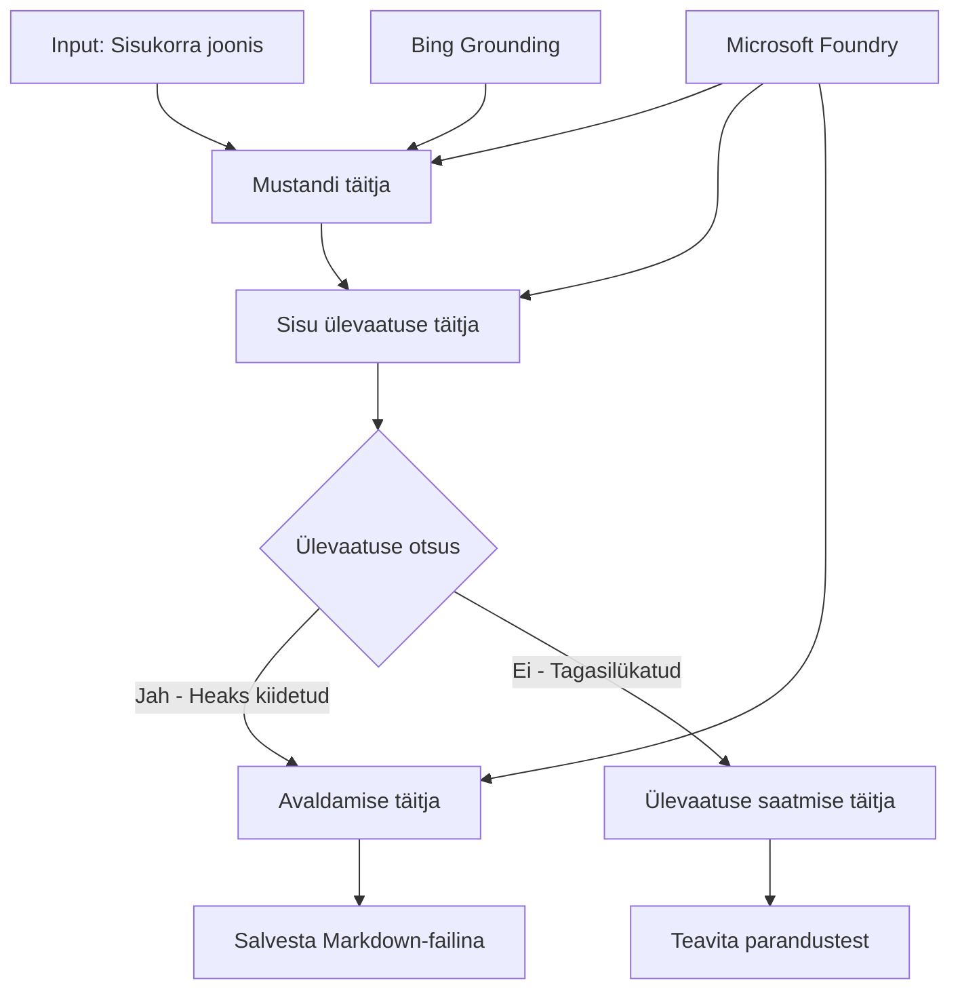

# 🔀 Tingimuslikud agendi töövood Microsoft Foundry-ga (.NET)

## 📋 Nutika otsustuslähtelise töövoo juhend

See märkmik demonstreerib **tingimuslikke töövoo mustreid** Microsoft Foundry ja Microsoft Agent Frameworki .NET jaoks abil. Õpid, kuidas luua keerukaid, otsustel põhinevaid töövooge, mis suunavad töötlemist nutikalt AI analüüsi, ärireeglite ja dünaamiliste tingimuste alusel ettevõttekvaliteediga automatiseerimise jaoks.

## 🎯 Õpieesmärgid

### 🧠 **Nutikas otsustusarhitektuur**
- **Tingimusloogika rakendamine**: Ehita keerukaid otsustuspuud mitme hargnemispunktiga
- **AI-põhine suunamine**: Kasuta Microsoft Foundry mudeleid intelligentseks suunamisotsusteks
- **Dünaamiline töövoo kohandamine**: Muuda töövoo käitumist jooksuaegsete analüüside ja tingimuste alusel
- **Ettevõtte ärireeglite integreerimine**: Lisa äriloogika ja vastavuse nõuded töövoogudesse

### 🔀 **Täiendavad tingimuslikud mustrid**
- **Mitmekriteeriumiline otsustamine**: Hinda mitut tegurit suunamisotsuste tegemiseks
- **Kontekstitundlik töötlemine**: Tee otsuseid kogunenud töövoo konteksti ja ajaloo põhjal
- **Kohanduv töövoo muutmine**: Muuda töötlemisradasid dünaamiliselt reaalajas tingimuste põhjal
- **Reeglimootori integreerimine**: Rakenda keerukaid ärireeglimootoreid töövoogudes

### 🏢 **Ettevõtte tingimuslikud rakendused**
- **Dokumentide klassifitseerimine ja suunamine**: Automaatne dokumentide klassifikatsioon ja sobivasse töövoogu suunamine
- **Klienditeeninduse triage**: Intelligentsed kliendipäringute suunamised spetsialiseerunud meeskondadele
- **Vastavus ja riskitöötlus**: Rakenda erinevaid valideerimis- ja ülevaatusprotsesse riskihinnangu alusel
- **Kvaliteedikindlustuse töövood**: Suuna sisu sobivate ülevaatusprotsesside kaudu kvaliteedimõõdikute põhjal

## ⚙️ Eeltingimused ja seadistamine

### 📦 **Nõutavad NuGet paketid**

Täiustatud paketid tingimusliku töövoo töötlemiseks:

```xml
<!-- Core AI Framework -->
<PackageReference Include="Microsoft.Extensions.AI" Version="9.9.0" />

<!-- Azure AI Agents with Persistent State -->
<PackageReference Include="Azure.AI.Agents.Persistent" Version="1.2.0-beta.5" />

<!-- Azure Identity and Utilities -->
<PackageReference Include="Azure.Identity" Version="1.15.0" />
<PackageReference Include="System.Linq.Async" Version="6.0.3" />
<PackageReference Include="DotNetEnv" Version="3.1.1" />

<!-- Local Workflow Framework References -->
<!-- Microsoft.Agents.Workflows.dll - Advanced workflow orchestration -->
<!-- Microsoft.Agents.AI.AzureAI.dll - Microsoft Foundry integration -->
<!-- Microsoft.Agents.AI.dll - Core agent abstractions -->
```

### 🔑 **Microsoft Foundry konfiguratsioon**

**Nõutavad Azure ressursid:**
- Microsoft Foundry tööruum tingimusliku töötlemise mudelitega
- Azure tellimus sobivate arvutuslimiitide ja õigustega
- Paigaldatud AI mudelid otsustamiseks ja sisu analüüsiks
- (Valikuline) Bing Search API ühendus tugevdusvõimaluste jaoks

**Keskkonna seadistus (.env fail):**
```env
# Microsoft Foundry Configuration
AZURE_AI_PROJECT_ENDPOINT=https://your-project.cognitiveservices.azure.com/
BING_CONNECTION_ID=your-bing-connection-id
```

**Autentimise seadistamine:**
```csharp
// Azure CLI or Managed Identity authentication
using Azure.Identity;
var credential = new AzureCliCredential();

// Load environment configuration
DotNetEnv.Env.Load("../../../.env");
```

### 🏗️ **Tingimusliku töövoo arhitektuur**



**Põhikomponendid:**
- **Draft Executor**: AI agent, kes loob sisuarenduse mustandid ülevaadetest
- **Sisu ülevaataja executori agent**: Hindab mustandi kvaliteeti ja vastavust
- **Tingimuslik suunamine**: Otsustusloogika, mis suunab vastavalt ülevaate tulemustele
- **Avaldamise/ülevaatuse teed**: Eraldi töötlemisteed kinnitatud ja tagasilükatud sisu jaoks
- **Seisundi haldus**: Säilitab sisu ja ülevaatuse konteksti terve töövoo vältel

## 🎨 **Tingimusliku töövoo disainimustrid**

### 📋 **Sisu tootmine kvaliteedikaitsetega**
```
Outline → Draft Creation → Quality Review → {Approve: Publish | Reject: Revise}
```

### 🎯 **Riskipõhine dokumentide töötlemine**
```
Document → Risk Assessment → {Low: Standard | High: Enhanced Review}
```

### 🔍 **Nutikas klienditeeninduse suunamine**
```
Customer Query → Analysis → {Simple: FAQ Bot | Complex: Human Agent}
```

### 💼 **Vastavuspõhised töövood**
```
Content → Compliance Check → {Pass: Publish | Fail: Legal Review}
```

## 🏢 **Ettevõtte tingimuslikud eelised**

### 🎯 **Nutikas automatiseerimine**
- **Tark otsustamine**: AI-põhised suunamisotsused sisu analüüsi ja konteksti alusel
- **Kohanduv töötlemine**: Töövood, mis kohanduvad automaatselt muutuva tingimustega
- **Ärireeglite täitmine**: Keeruka äriloogika ja poliitikate automaatne rakendamine
- **Kontekstitundlik suunamine**: Otsused kogu töövoo ajaloo ja kogutud konteksti põhjal

### 📈 **Tööoperatiivne tipptase**
- **Optimeeritud ressursside jaotus**: Suuna töö sobivatele spetsialistidele ja protsessidele
- **Vähem manuaalset sekkumist**: Automatiseeritud otsustamine vähendab vajadust inimeste suunamise järele
- **Kiirem lahendusaeg**: Otsene suunamine sobivale ekspertiisile ja töötlemisvõimele
- **Järjepidev rakendamine**: Ühtlane ärireeglite ja otsustamiskriteeriumite rakendamine

### 🛡️ **Riski juhtimine ja vastavus**
- **Automatiseeritud riskihindamine**: AI-põhine sisu ja situatsiooni riskitaseme hindamine
- **Vastavuse rakendamine**: Automaatsed marsruudid vajalike regulatiivsete protsesside kaudu
- **Turvaprotokollide rakendamine**: Paranenud turvameetmed riskihinnangu alusel
- **Auditirada**: Täielik dokumentatsioon suunamisotsustest ja põhjendustest

### 📊 **Analüütika ja pidev täiustamine**
- **Otsuste analüütika**: Jälgi suunamisotsuste tõhusust ja täpsust
- **Mustri tuvastus**: Tuvasta trende ja mustreid suunamisotsustes aja jooksul
- **Tõhususe optimeerimine**: Pidev otsustamiskriteeriumite ja suunamise efektiivsuse parandamine
- **Ärianalüütika**: Sisu omaduste ja töötlemisnõuete ülevaated

### 🔧 **Tehniline tipptase**
- **Püsiva seisundi haldus**: Säilita keeruline seisund kogu töövoo täitmise vältel
- **Skaalautuv arhitektuur**: Töötle suuri tingimuslikke töötlemisvajadusi
- **Integreerimisvõimalused**: Sujuv integreerimine olemasolevate ärisüsteemide ja protsessidega
- **Monitooring ja jälgitavus**: Põhjalik jälgimine töövoo jõudluse ja otsuste üle

Loome .NET abil nutikaid, otsustuslähtelisi ettevõtte töövooge! 🚀

## 💻 Koodi käivitamine

Täielik rakendus on saadaval failis `04.dotnet-agent-framework-workflow-aifoundry-condition.cs`. See demonstreerib **sisu tootmise töövoogu kvaliteedikaitsetega**:

### 🏗️ **Töövoo arhitektuur**

```
Content Outline → Draft Creation → Quality Review → Conditional Routing:
                                                      ├─ Approved (>200 words) → Publish
                                                      └─ Rejected (<200 words) → Review Notification
```

**Agendid töövoos:**
1. **Evangelist Agent**: Loob juhendidest õppekäikudeks mustandeid Bing tugevdusvõimega
2. **Sisu ülevaataja Agent**: Hinnake mustandi kvaliteeti (sõnade arv, terviklikkus)
3. **Avaldaja Agent**: Salvestab kinnitatud sisu ajatemplitud Markdown-failidena

**Kohandatud täitjad:**
1. **DraftExecutor**: Koordineerib mustandi loomist
2. **ContentReviewExecutor**: Teostab kvaliteedi hindamise
3. **PublishExecutor**: Halda kinnitatud sisu avaldamist
4. **SendReviewExecutor**: Halda tagasilükatud sisu teatise saatmist

### 🚀 Näite käivitamine

**Eeltingimused:**
- Microsoft Foundry tööruumi seadistamine
- Azure CLI autentimine (`az login`)
- (Valikuline) Bing Search ühendus tugevdusfunktsioonide jaoks

```bash
# Tee skript käivitatavaks (Unix/Linux/macOS)
chmod +x 04.dotnet-agent-framework-workflow-aifoundry-condition.cs

# Käivita tingimuslik töövoog
./04.dotnet-agent-framework-workflow-aifoundry-condition.cs
```

Või Windowsil:
```powershell
dotnet run 04.dotnet-agent-framework-workflow-aifoundry-condition.cs
```

### 📝 Oodatav väljund

Töövoog teeb järgmist:
1. **Loo Agendid**: Algatab kolm spetsialiseerunud Microsoft Foundry agenti
2. **Genereeri mustand**: Evangelist agent loob juhendi põhjal mustandi
3. **Ülevaata sisu**: Sisu ülevaataja hindab mustandi kvaliteeti
4. **Tingimuslik suunamine**:
   - **Kinnitatud (>200 sõna)**: Avaldamise täitja salvestab Markdown faili
   - **Tagasilükatud (<200 sõna)**: Saada ülevaatusest teavitus
5. **Näita tulemusi**: Kuvab töövoo lõpptulemuse

### 🔧 Kohandamisvõimalused

**Muuda ülevaatuskriteeriume:**
```csharp
const string ContentReviewerInstructions = @"
You are a content reviewer...
1. Check if content is more than 500 words (instead of 200)
2. Verify technical accuracy
3. Ensure proper formatting
...";
```

**Lisa rohkem tingimuslikke radu:**
```csharp
var workflow = new WorkflowBuilder(draftExecutor)
    .AddEdge(draftExecutor, contentReviewerExecutor)
    .AddEdge(contentReviewerExecutor, publishExecutor, condition: GetCondition("Excellent"))
    .AddEdge(contentReviewerExecutor, editExecutor, condition: GetCondition("Good"))
    .AddEdge(contentReviewerExecutor, sendReviewerExecutor, condition: GetCondition("Poor"))
    .Build();
```

**Muuda sisu nõudeid:**
```csharp
string OUTLINE_Content = @"
# Your Custom Topic
## Section 1
https://your-reference-url
## Section 2
...
";
```

### 🎯 Reaalsed rakendused

See tingimuslik töövoo muster sobib ideaalselt:
- **Sisuhaldussüsteemid**: Automatiseeritud toimetustöövood kvaliteedikaitsetega
- **Dokumenditöötlus**: Suuna dokumendid klassifikatsiooni ja vastavuse alusel
- **Klienditoe**: Intelligentsed piletite suunamised keerukuse ja kiireloomulisuse järgi
- **Õiguslik ülevaatus**: Suunamine lepingutele riskihinnangu ja väärtuse põhjal
- **HR protsessid**: Suuna avaldused vastavatesse kontrollitöövoogudesse

### 🔍 Tingimusloogika mõistmine

**Tingimusfunktsioon:**
```csharp
public Func<object?, bool> GetCondition(string expectedResult) =>
    reviewResult => reviewResult is ReviewResult review && review.Result == expectedResult;
```

See funktsioon loob tingimuse, mis:
1. Kontrollib, kas tulemus on tüüpi `ReviewResult`
2. Võrdleb `Result` omadust oodatud väärtusega
3. Tagastab tõene/väär, et määrata suunamist

**Töövoo servad tingimustega:**
```csharp
.AddEdge(contentReviewerExecutor, publishExecutor, condition: GetCondition("Yes"))
.AddEdge(contentReviewerExecutor, sendReviewerExecutor, condition: GetCondition("No"))
```

### 📊 Täiustatud funktsioonid

**JSON skeemi valideerimine:**
Töövoog kasutab JSON skeeme tagamaks struktureeritud vastuseid:

```csharp
// Define response structure
public class ReviewResult
{
    [JsonPropertyName("review_result")]
    public string Result { get; set; } = string.Empty;
    
    [JsonPropertyName("reason")]
    public string Reason { get; set; } = string.Empty;
    
    [JsonPropertyName("draft_content")]
    public string DraftContent { get; set; } = string.Empty;
}

// Apply to agent
ResponseFormat = ChatResponseFormat.ForJsonSchema(
    AIJsonUtilities.CreateJsonSchema(typeof(ReviewResult)), 
    "ReviewResult", 
    "Review Result From DraftContent"
)
```

**Bing tugevdus integratsioon:**
Evangelist agent kasutab Bing tugevdust reaalajas info saamiseks:

```csharp
var bingGroundingConfig = new BingGroundingSearchConfiguration(bing_conn_id);
BingGroundingToolDefinition bingGroundingTool = new(
    new BingGroundingSearchToolParameters([bingGroundingConfig])
);
```

See võimaldab agendil järgida juhendis URL-e ja väljavõtta ajakohast infot.

### 🛡️ Veahaldus

Töövoog sisaldab tugevat veahaldust tagasilükatud sisu puhul:
- Ülevaatuse ebaõnnestumised käivitavad alternatiivse tee
- Teavitused annavad selged tagasilükkamise põhjused
- Sisu säilitatakse redigeerimiseks

### 🔄 Töövoo laiendamine

**Lisa redigeerimise tsükkel:**
Loo tagasisideahel, mis automaatselt redigeerib sisu:

```csharp
.AddEdge(contentReviewerExecutor, publishExecutor, condition: GetCondition("Yes"))
.AddEdge(contentReviewerExecutor, draftExecutor, condition: GetCondition("No")) // Loop back
```

**Rakenda mitmetasandiline ülevaatus:**
Lisa mitu ülevaatustaset erinevate kriteeriumitega:

```csharp
.AddEdge(draftExecutor, technicalReviewer)
.AddEdge(technicalReviewer, editorialReviewer, condition: GetCondition("TechPass"))
.AddEdge(editorialReviewer, publishExecutor, condition: GetCondition("EditPass"))
```

See tingimuslik töövoo muster loob aluse keerukate, nutikate ettevõtte automatiseerimissüsteemide loomiseks! 🚀

---

<!-- CO-OP TRANSLATOR DISCLAIMER START -->
**Lahtiütlus**:
See dokument on tõlgitud kasutades AI tõlketeenust [Co-op Translator](https://github.com/Azure/co-op-translator). Kuigi me püüdleme täpsuse poole, palun pange tähele, et automatiseeritud tõlgetes võib esineda vigu või ebatäpsusi. Originaaldokument selle emakeeles tuleks pidada autoriteetseks allikaks. Olulise teabe puhul soovitatakse kasutada professionaalset inimtõlget. Me ei vastuta selle tõlkega seotud eksimustest või valesti mõistmistest.
<!-- CO-OP TRANSLATOR DISCLAIMER END -->