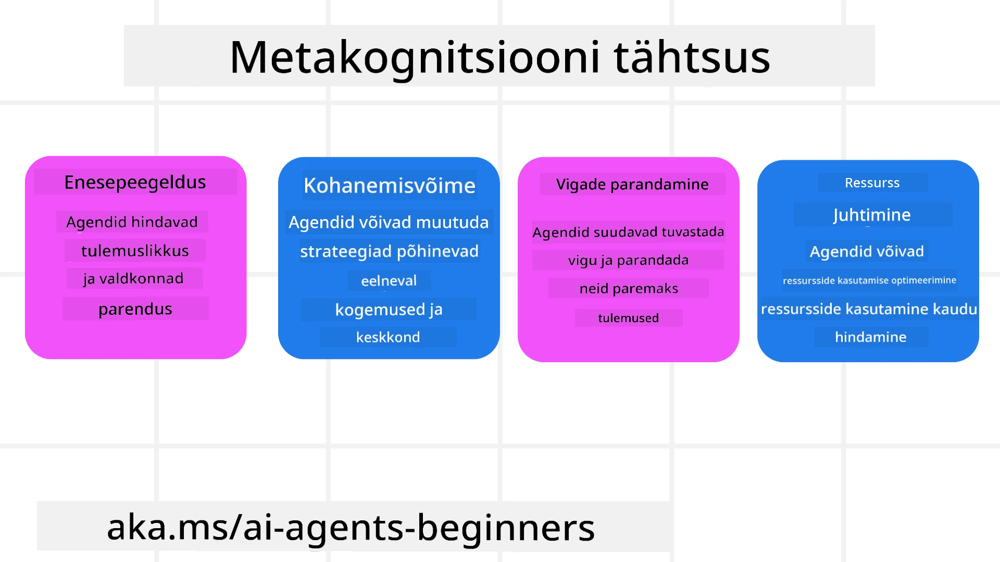
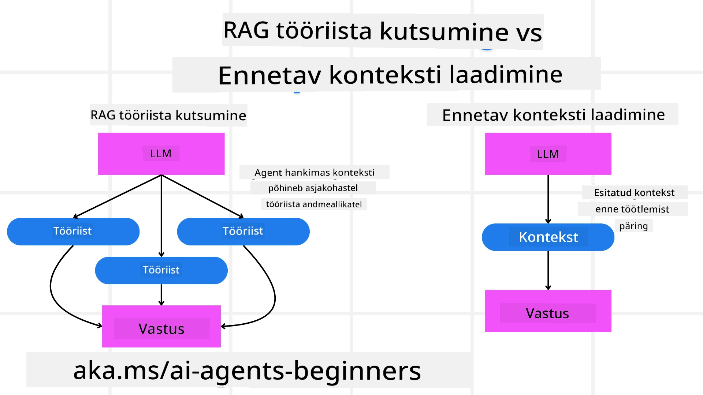

[](https://youtu.be/His9R6gw6Ec?si=3_RMb8VprNvdLRhX)

> _(Klõpsake ülaloleval pildil, et vaadata selle õppetunni videot)_
# Metakognitsioon tehisintellektagentides

## Sissejuhatus

Tere tulemast õppetundi metakognitsioonist tehisintellektagentides! See peatükk on mõeldud algajatele, kes on uudishimulikud, kuidas AI agentid saavad mõelda omaenda mõtlemisprotsesside üle. Selle õppetunni lõpuks mõistate põhikontseptsioone ja saate praktilisi näiteid, kuidas metakognitsiooni AI agentide disainis rakendada.

## Õpieesmärgid

Pärast selle õppetunni läbimist oskate:

1. Mõista järelduslike tsüklite mõju agentide definitsioonides.
2. Kasutada planeerimis- ja hindamistehnikaid enesekorrektsiooni võimaldavate agentide abistamiseks.
3. Luua omaenda agente, kes suudavad ülesannete täitmiseks koodi manipuleerida.

## Sissejuhatus metakognitsiooni

Metakognitsioon viitab kõrgema astme kognitiivsetele protsessidele, mis hõlmavad mõtlemist omaenda mõtlemise kohta. AI agentide puhul tähendab see võimet hinnata ja kohandada oma tegevusi eneseteadlikkuse ja varasemate kogemuste põhjal. Metakognitsioon ehk „mõtlemine mõtlemisest“ on oluline mõiste agentsete AI süsteemide arengus. See hõlmab AI süsteemide teadlikkust oma sisemistest protsessidest ning võimet oma käitumist vastavalt jälgida, reguleerida ja kohandada. Nii nagu meie loeme ruumi või vaatame probleemile. See eneseteadlikkus aitab AI süsteemidel teha paremaid otsuseid, tuvastada vigu ja aja jooksul oma tulemuslikkust parandada — mis seob mind veel kord Turingi testiga ning aruteluga, kas AI võtab võimu üle.

Agentsete AI süsteemide kontekstis aitab metakognitsioon lahendada mitmeid väljakutseid, näiteks:
- Läbipaistvust: tagada, et AI süsteemid suudavad oma järeldusi ja otsuseid selgitada.
- Järeldamist: parandada AI süsteemide võimet sünteesida teavet ja teha häid otsuseid.
- Kohandumist: lubada AI süsteemidel kohaneda uute keskkondade ja muutuvate tingimustega.
- Taju: parandada AI süsteemide täpsust keskkonnast pärineva andmete äratundmisel ja interpreteerimisel.

### Mis on metakognitsioon?

Metakognitsioon ehk „mõtlemine mõtlemise üle“ on kõrgema astme kognitiivne protsess, mis hõlmab eneseteadlikkust ja enda kognitiivsete protsesside reguleerimist. Tehisintellekti valdkonnas võimaldab metakognitsioon agentidel hinnata ja kohandada oma strateegiaid ja tegevusi, mis parandab probleemide lahendamise ja otsustamise võimeid. Metakognitsiooni mõistmine võimaldab teil disainida AI agente, kes on mitte ainult targemad, vaid ka kohanemisvõimelisemad ja tõhusamad. Tõelises metakognitsioonis näeksite AI-d selgesõnaliselt omaenda mõtlemise üle arutlemas.

Näide: „Ma seisin odavamad lennupiletid esikohale, sest... Võibolla jään ilma otselendudest, seega las ma kontrollin uuesti.“
Jälgides, kuidas või miks valiti teatud marsruut.
- Märgates, et tehti vigu, sest ta liialdas kasutaja eelistustega eelmisest korrast, mistõttu muudetakse mitte ainult lõpp-soovitust, vaid ka otsustamise strateegiat.
- Diagnostiseerides mustreid nagu: „Iga kord, kui ma näen, et kasutaja mainib ‘liiga rahvarohket,’ ei tohiks ma mitte ainult teatud vaatamisväärsusi eemaldada, vaid ka mõelda, et minu ‘parimate vaatamisväärsuste’ valimise meetod on vigane, kui ma järjestan alati populaarsuse järgi.“

### Metakognitsiooni tähtsus AI agentides

Metakognitsioonil on AI agentide disainis mitu olulist rolli:



- Enesepeegelduse: agentidel on võimalik hinnata oma sooritust ja tuvastada arenguvõimalusi.
- Kohanduvuse: agentidel on võimalik muuta oma strateegiaid varasemate kogemuste ja muutuva keskkonna põhjal.
- Vigade parandamise: agentidel on võimalik iseseisvalt vigu tuvastada ja parandada, saavutades täpsemaid tulemusi.
- Ressursside haldamise: agentidel on võimalik optimeerida ressursside kasutamist, nagu aeg ja arvutusvõimsus, planeerides ja hinnates oma tegevusi.

## AI agendi komponendid

Enne metakognitiivsete protsesside juurde sukeldumist on oluline mõista AI agendi põhikomponeente. AI agent koosneb tavaliselt järgmistest osadest:

- Persona: agendi isiksus ja omadused, mis määravad, kuidas see kasutajatega suhtleb.
- Vahendid: võimed ja funktsioonid, mida agent suudab täita.
- Oskused: teadmised ja kompetentsid, mis agendil on.

Need komponendid töötavad koos, luues "ekspertiisiühiku," mis suudab täita konkreetseid ülesandeid.

**Näide**:
Kujutage ette reisibürood, agenditeenust, mis mitte ainult ei planeeri teie puhkust, vaid kohandab oma teekonda reaalajas andmete ja varasemate kliendikogemuste põhjal.

### Näide: metakognitsioon reisibüroos

Kujutage ette, et disainite AI-põhist reisibürooteenust. See agent, "Reisibüroo," aitab kasutajatel oma puhkust planeerida. Metakognitsiooni kaasamiseks peab Reisibüroo hindama ja kohandama oma tegevusi eneseteadlikkuse ja varasemate kogemuste baasil. Siin on, kuidas metakognitsioon võiks mängida rolli:

#### Praegune ülesanne

Praegune ülesanne on aidata kasutajal planeerida reis Pariisi.

#### Ülesande täitmise sammud

1. **Koguda kasutaja eelistused**: küsida kasutajalt reisi kuupäevad, eelarve, huvid (nt muuseumid, köök, ostlemine) ja muud erisoovid.
2. **Teabe hankimine**: otsida lennuvalikuid, majutust, vaatamisväärsusi ja restorane, mis vastavad kasutaja eelistustele.
3. **Soovituste koostamine**: pakkuda isikupärastatud marsruuti koos lennuandmete, hotelli broneeringute ja soovitatud tegevustega.
4. **Tagasiside põhjal kohandamine**: küsida kasutajalt soovituste kohta tagasisidet ja teha vajalikud muudatused.

#### Vajalikud ressursid

- Ligipääs lennu- ja hotelli broneerimiste andmebaasidele.
- Info Pariisi vaatamisväärsuste ja restoranide kohta.
- Kasutajate varasemate vastuste andmed.

#### Kogemus ja enesepeegeldus

Reisibüroo kasutab metakognitsiooni, et hinnata oma tulemuslikkust ja õppida varasematest kogemustest. Näiteks:

1. **Kasutajate tagasiside analüüs**: Reisibüroo vaatab üle kasutajate arvamused, et tuvastada, millised soovitused olid hästi vastuvõetud ja millised mitte. See kohandab oma tulevasi soovitusi vastavalt.
2. **Kohanemisvõime**: Kui kasutaja on varem maininud, et talle ei meeldi rahvarohked kohad, väldib Reisibüroo tulevikus populaarsete turismiatraktsioonide soovitamist tipptundidel.
3. **Vigade parandamine**: Kui Reisibüroo on teinud vigu varasemates broneeringutes, näiteks soovitanud täisbroneeritud hotelli, õpib see broneeringute saadavust rangemalt kontrollima enne soovituste tegemist.

#### Praktiline arendaja näide

Siin on lihtsustatud näide sellest, kuidas Reisibüroo kood võiks metakognitsiooni kaasates välja näha:

```python
class Travel_Agent:
    def __init__(self):
        self.user_preferences = {}
        self.experience_data = []

    def gather_preferences(self, preferences):
        self.user_preferences = preferences

    def retrieve_information(self):
        # Otsi lende, hotelle ja vaatamisväärsusi vastavalt eelistustele
        flights = search_flights(self.user_preferences)
        hotels = search_hotels(self.user_preferences)
        attractions = search_attractions(self.user_preferences)
        return flights, hotels, attractions

    def generate_recommendations(self):
        flights, hotels, attractions = self.retrieve_information()
        itinerary = create_itinerary(flights, hotels, attractions)
        return itinerary

    def adjust_based_on_feedback(self, feedback):
        self.experience_data.append(feedback)
        # Analüüsi tagasisidet ja kohanda tulevasi soovitusi
        self.user_preferences = adjust_preferences(self.user_preferences, feedback)

# Näidiskasutus
travel_agent = Travel_Agent()
preferences = {
    "destination": "Paris",
    "dates": "2025-04-01 to 2025-04-10",
    "budget": "moderate",
    "interests": ["museums", "cuisine"]
}
travel_agent.gather_preferences(preferences)
itinerary = travel_agent.generate_recommendations()
print("Suggested Itinerary:", itinerary)
feedback = {"liked": ["Louvre Museum"], "disliked": ["Eiffel Tower (too crowded)"]}
travel_agent.adjust_based_on_feedback(feedback)
```

#### Miks metakognitsioon on oluline

- **Enesepeegeldus**: agentidel on võimalik analüüsida oma sooritust ja määrata arendusvaldkondi.
- **Kohanemisvõime**: agentidel on võimalik muuta strateegiaid vastavalt tagasisidele ja muutuvale olukorrale.
- **Vigade parandamine**: agentidel on võimalik iseseisvalt vigasid tuvastada ja parandada.
- **Ressursside haldamine**: agentidel on võimalik optimeerida ressursside kasutamist, nt aega ja arvutusvõimsust.

Metakognitsiooni kaasates saab Reisibüroo pakkuda kasutajale personaalsemaid ja täpsemaid reisisoovitusi, parandades seeläbi üldist kasutajakogemust.

---

## 2. Planeerimine agentides

Planeerimine on AI agendi käitumise kriitiline komponent. See hõlmab eesmärgi saavutamiseks vajalike sammude kavandamist, võttes arvesse praegust olukorda, ressursse ja võimalikke takistusi.

### Planeerimise elemendid

- **Praegune ülesanne**: määratlege ülesanne selgelt.
- **Ülesande täitmise sammud**: jagage ülesanne hallatavateks sammudeks.
- **Vajalikud ressursid**: määrake vajalikud ressursid.
- **Kogemus**: kasutage varasemaid kogemusi planeerimiseks.

**Näide**:
Siin on sammud, mida Reisibüroo peab kasutaja abistamiseks tõhusa reisi planeerimisel tegema:

### Reisibüroo sammud

1. **Koguda kasutaja eelistused**
   - Küsi kasutajalt üksikasju reisi kuupäevade, eelarve, huvide ja erisoovide kohta.
   - Näited: „Millal te plaanite reisida?“ „Mis on teie eelarvepiir?“ „Milliseid tegevusi te eelistate puhkusel?“

2. **Teabe hankimine**
   - Otsi kasutaja eelistustele vastavaid reisivõimalusi.
   - **Lennud**: otsi saadaval olevaid lende kasutaja eelarve ja soovitud reisi kuupäevade sees.
   - **Majutus**: leia hotellid või rendikohad, mis sobivad kasutaja eelistustele asukoha, hinna ja mugavuste poolest.
   - **Vaatamisväärsused ja restoranid**: tuvastage populaarsed atraktsioonid, tegevused ja söögikohad, mis vastavad kasutaja huvidele.

3. **Soovituste koostamine**
   - Koosta kogutud teabe põhjal isikupärastatud marsruut.
   - Esita detailid nagu lennuvõimalused, hotellibroneeringud ja soovitatud tegevused, kohandades soovitusi kasutaja eelistustele.

4. **Marsruudi esitamine kasutajale**
   - Jaga kasutajaga ettepanek marsruudi kohta ülevaatamiseks.
   - Näide: „Siin on teie Pariisi reisi soovituslik marsruut. See sisaldab lennuandmeid, hotelli broneeringuid ja nimekirja soovitatud tegevustest ning restoranidest. Anna teada, mida arvad!“

5. **Tagasiside kogumine**
   - Palu kasutajal esitatud marsruudi kohta tagasisidet.
   - Näited: „Kas teile meeldivad lennuvalikud?“ „Kas hotell vastab teie vajadustele?“ „Kas soovite lisada või eemaldada mõnda tegevust?“

6. **Tagasiside põhjal kohandamine**
   - Muutke marsruuti vastavalt kasutaja tagasisidele.
   - Tehke vajalikud muudatused lennu-, majutuse ja tegevuste soovitustes, et paremini vastata kasutaja eelistustele.

7. **Lõplik kinnitamine**
   - Esitage kasutajale uuendatud marsruut lõplikuks kinnitamiseks.
   - Näide: „Olen teinud muudatused teie tagasiside põhjal. Siin on uuendatud marsruut. Kas kõik tundub hea?“

8. **Broneeringute tegemine ja kinnitamine**
   - Kui kasutaja marsruudi kinnitab, jätka lendude, majutuse ja eelplaneeritud tegevuste broneerimisega.
   - Saada kasutajale kinnitusteave.

9. **Järelteeninduse pakkumine**
   - Ole kasutajale kättesaadav kõikide muudatuste või täiendavate taotluste korral enne ja reisi ajal.
   - Näide: „Kui teil on reisi jooksul lisatuge vaja, võtke minuga igal ajal ühendust!“

### Näidisinteraktsioon

```python
class Travel_Agent:
    def __init__(self):
        self.user_preferences = {}
        self.experience_data = []

    def gather_preferences(self, preferences):
        self.user_preferences = preferences

    def retrieve_information(self):
        flights = search_flights(self.user_preferences)
        hotels = search_hotels(self.user_preferences)
        attractions = search_attractions(self.user_preferences)
        return flights, hotels, attractions

    def generate_recommendations(self):
        flights, hotels, attractions = self.retrieve_information()
        itinerary = create_itinerary(flights, hotels, attractions)
        return itinerary

    def adjust_based_on_feedback(self, feedback):
        self.experience_data.append(feedback)
        self.user_preferences = adjust_preferences(self.user_preferences, feedback)

# Näidis kasutus katkise taotluse korral
travel_agent = Travel_Agent()
preferences = {
    "destination": "Paris",
    "dates": "2025-04-01 to 2025-04-10",
    "budget": "moderate",
    "interests": ["museums", "cuisine"]
}
travel_agent.gather_preferences(preferences)
itinerary = travel_agent.generate_recommendations()
print("Suggested Itinerary:", itinerary)
feedback = {"liked": ["Louvre Museum"], "disliked": ["Eiffel Tower (too crowded)"]}
travel_agent.adjust_based_on_feedback(feedback)
```

## 3. Korrektsiooniline RAG süsteem

Alustame mõistmisest, mis vahe on RAG tööriistal ja ennetaval konteksti laadimisel.



### Retrieval-Augmented Generation (RAG)

RAG ühendab tagasitoomisüsteemi generatiivse mudeliga. Kui esitatakse päring, otsib tagasitoomisüsteem asjakohaseid dokumente või andmeid välisest allikast ning see tagastatud teave rikastab generatiivse mudeli sisendit. See aitab mudelil genereerida täpsemaid ja kontekstuaalselt asjakohasemaid vastuseid.

RAG süsteemis hangib agent asjakohast teavet teadmistebaasist ja kasutab seda sobivate vastuste või tegevuste loomiseks.

### Korrektsiooniline RAG lähenemine

Korrektsiooniline RAG keskendub RAG tehnikate kasutamisele vigade parandamiseks ja AI agentide täpsuse parandamiseks. See hõlmab:

1. **Pärimistehnika**: kasutada spetsiifilisi päringuid, et suunata agent asjakohase teabe otsingul.
2. **Tööriist**: rakendada algoritme ja mehhanisme, mis võimaldavad agendil hinnata tagastatud teabe asjakohasust ja genereerida täpseid vastuseid.
3. **Hindamine**: pidevalt hinnata agentide sooritust ning teha parandusi täpsuse ja tõhususe tõstmiseks.

#### Näide: korrektsiooniline RAG otsinguagendis

Mõelge otsinguagendile, kes hangib teavet veebist kasutajate päringute vastamiseks. Korrektsiooniline RAG meetod võib hõlmata:

1. **Pärimistehnika**: koostada otsingupäringud kasutaja sisendi põhjal.
2. **Tööriist**: kasutada loomuliku keele töötlemise ja masinõppe algoritme otsingutulemuste järjestamiseks ja filtreerimiseks.
3. **Hindamine**: analüüsida kasutajate tagasisidet, et tuvastada ja parandada tagastatud teabe ebatäpsusi.

### Korrektsiooniline RAG reisibüroos

Korrektsiooniline RAG (Retrieval-Augmented Generation) parandab AI võimet teavet hankida ja genereerida, samal ajal vigasid korrigeerides. Vaatame, kuidas Reisibüroo saab Korrektsioonilist RAG-lähenemist kasutada täpsemate ja asjakohasemate reisisoovituste pakkumiseks.

See hõlmab:

- **Pärimistehnika:** kasutada spetsiifilisi päringuid, et suunata agent asjakohase teabe otsingul.
- **Tööriist:** rakendada algoritme ja mehhanisme, mis võimaldavad agendil hinnata tagastatud teabe asjakohasust ja genereerida täpseid vastuseid.
- **Hindamine:** pidevalt hinnata agentide sooritust ning teha parandusi täpsuse ja tõhususe kõrgetasemelisse tõstmiseks.

#### Korrektsioonilise RAG rakendamise sammud Reisibüroos

1. **Esialgne kasutajasuhtlus**
   - Reisibüroo kogub kasutajalt esialgsed eelistused nagu sihtkoht, reisi kuupäevad, eelarve ja huvid.
   - Näide:

     ```python
     preferences = {
         "destination": "Paris",
         "dates": "2025-04-01 to 2025-04-10",
         "budget": "moderate",
         "interests": ["museums", "cuisine"]
     }
     ```

2. **Teabe tagasitoomine**
   - Reisibüroo hangib andmeid lendude, majutuse, vaatamisväärsuste ja restoranide kohta, tuginedes kasutaja eelistustele.
   - Näide:

     ```python
     flights = search_flights(preferences)
     hotels = search_hotels(preferences)
     attractions = search_attractions(preferences)
     ```

3. **Esialgsete soovituste koostamine**
   - Reisibüroo kasutab kogutud teavet isikupärase marsruudi koostamiseks.
   - Näide:

     ```python
     itinerary = create_itinerary(flights, hotels, attractions)
     print("Suggested Itinerary:", itinerary)
     ```

4. **Kasutajate tagasiside kogumine**
   - Reisibüroo küsib kasutajalt tagasisidet esialgsete soovituste kohta.
   - Näide:

     ```python
     feedback = {
         "liked": ["Louvre Museum"],
         "disliked": ["Eiffel Tower (too crowded)"]
     }
     ```

5. **Korrektsiooniline RAG protsess**
   - **Pärimistehnika**: Reisibüroo koostab uusi otsingupäringuid kasutaja tagasiside põhjal.
     - Näide:

       ```python
       if "disliked" in feedback:
           preferences["avoid"] = feedback["disliked"]
       ```

   - **Tööriist**: Reisibüroo kasutab algoritme uute otsingutulemuste järjestamiseks ja filtreerimiseks, rõhutades relevantsust tagasiside põhjal.
     - Näide:

       ```python
       new_attractions = search_attractions(preferences)
       new_itinerary = create_itinerary(flights, hotels, new_attractions)
       print("Updated Itinerary:", new_itinerary)
       ```

   - **Hindamine**: Reisibüroo hindab pidevalt oma soovituste relevantsust ja täpsust, analüüsides kasutajate tagasisidet ning tehes vajalikud parandused.
     - Näide:

       ```python
       def adjust_preferences(preferences, feedback):
           if "liked" in feedback:
               preferences["favorites"] = feedback["liked"]
           if "disliked" in feedback:
               preferences["avoid"] = feedback["disliked"]
           return preferences

       preferences = adjust_preferences(preferences, feedback)
       ```

#### Praktiline näide

Siin on lihtsustatud Python koodi näide, mis sisaldab Korrektsioonilist RAG lähenemist Reisibüroos:

```python
class Travel_Agent:
    def __init__(self):
        self.user_preferences = {}
        self.experience_data = []

    def gather_preferences(self, preferences):
        self.user_preferences = preferences

    def retrieve_information(self):
        flights = search_flights(self.user_preferences)
        hotels = search_hotels(self.user_preferences)
        attractions = search_attractions(self.user_preferences)
        return flights, hotels, attractions

    def generate_recommendations(self):
        flights, hotels, attractions = self.retrieve_information()
        itinerary = create_itinerary(flights, hotels, attractions)
        return itinerary

    def adjust_based_on_feedback(self, feedback):
        self.experience_data.append(feedback)
        self.user_preferences = adjust_preferences(self.user_preferences, feedback)
        new_itinerary = self.generate_recommendations()
        return new_itinerary

# Näidiskasutus
travel_agent = Travel_Agent()
preferences = {
    "destination": "Paris",
    "dates": "2025-04-01 to 2025-04-10",
    "budget": "moderate",
    "interests": ["museums", "cuisine"]
}
travel_agent.gather_preferences(preferences)
itinerary = travel_agent.generate_recommendations()
print("Suggested Itinerary:", itinerary)
feedback = {"liked": ["Louvre Museum"], "disliked": ["Eiffel Tower (too crowded)"]}
new_itinerary = travel_agent.adjust_based_on_feedback(feedback)
print("Updated Itinerary:", new_itinerary)
```

### Ennetav konteksti laadimine


Ennetav konteksti laadimine hõlmab asjakohase konteksti või taustteabe laadimist mudelisse enne päringu töötlemist. See tähendab, et mudelil on sellest infost algusest peale juurdepääs, mis aitab tal genereerida teadlikumaid vastuseid ilma, et peaks protsessi käigus täiendavat andmeid tooma.

Siin on lihtsustatud näide sellest, kuidas võiks ennetav konteksti laadimine välja näha reisiagentuuri rakenduses Pythoni keeles:

```python
class TravelAgent:
    def __init__(self):
        # Eellaadige populaarsed sihtkohad ja nende teave
        self.context = {
            "Paris": {"country": "France", "currency": "Euro", "language": "French", "attractions": ["Eiffel Tower", "Louvre Museum"]},
            "Tokyo": {"country": "Japan", "currency": "Yen", "language": "Japanese", "attractions": ["Tokyo Tower", "Shibuya Crossing"]},
            "New York": {"country": "USA", "currency": "Dollar", "language": "English", "attractions": ["Statue of Liberty", "Times Square"]},
            "Sydney": {"country": "Australia", "currency": "Dollar", "language": "English", "attractions": ["Sydney Opera House", "Bondi Beach"]}
        }

    def get_destination_info(self, destination):
        # Hangi sihtkoha teave eellaaditud kontekstist
        info = self.context.get(destination)
        if info:
            return f"{destination}:\nCountry: {info['country']}\nCurrency: {info['currency']}\nLanguage: {info['language']}\nAttractions: {', '.join(info['attractions'])}"
        else:
            return f"Sorry, we don't have information on {destination}."

# Näidiskasutus
travel_agent = TravelAgent()
print(travel_agent.get_destination_info("Paris"))
print(travel_agent.get_destination_info("Tokyo"))
```

#### Selgitus

1. **Initsialiseerimine (`__init__` meetod)**: `TravelAgent` klass laeb ette sõnastiku, mis sisaldab teavet populaarsete sihtkohtade, näiteks Pariisi, Tokyo, New Yorgi ja Sydney kohta. See sõnastik sisaldab selliseid üksikasju nagu riik, valuuta, keel ja peamised vaatamisväärsused iga sihtkoha kohta.

2. **Info toomine (`get_destination_info` meetod)**: Kui kasutaja pärib konkreetse sihtkoha kohta, toob meetod `get_destination_info` asjakohase teabe eelnevalt laetud konteksti sõnastikust.

Konteksti ennetava laadimise abil saab reisiagentuuri rakendus kiiresti kasutajapäringutele vastata, ilma et peaks reaalajas välisest allikast infot tooma. See muudab rakenduse efektiivsemaks ja reageerimisvõimelisemaks.

### Plaani käivitamine eesmärgiga enne iteratsiooni

Plaani käivitamine eesmärgiga tähendab, et alustatakse selge eesmärgi või sihtmärgiga. Selle eesmärgi eelmääratlemine võimaldab mudelil kasutada seda juhisena kogu iteratiivse protsessi vältel. See aitab tagada, et iga iteratsioon viib lähemale soovitud tulemuse saavutamisele, muutes protsessi tõhusamaks ja fokusseeritumaks.

Siin on näide sellest, kuidas käivitada reisi plaan eesmärgiga enne iteratsiooni reisiagentuuri jaoks Pythonis:

### Stsenaarium

Reisiagent soovib planeerida kohandatud puhkuse kliendile. Eesmärk on luua reisikava, mis maksimeerib kliendi rahulolu nende eelistuste ja eelarve põhjal.

### Sammud

1. Määratleda kliendi eelistused ja eelarve.
2. Käivitada algne plaan nende eelistuste põhjal.
3. Itereerida plaani, et seda täiustada, optimeerides kliendi rahulolu.

#### Python-kood

```python
class TravelAgent:
    def __init__(self, destinations):
        self.destinations = destinations

    def bootstrap_plan(self, preferences, budget):
        plan = []
        total_cost = 0

        for destination in self.destinations:
            if total_cost + destination['cost'] <= budget and self.match_preferences(destination, preferences):
                plan.append(destination)
                total_cost += destination['cost']

        return plan

    def match_preferences(self, destination, preferences):
        for key, value in preferences.items():
            if destination.get(key) != value:
                return False
        return True

    def iterate_plan(self, plan, preferences, budget):
        for i in range(len(plan)):
            for destination in self.destinations:
                if destination not in plan and self.match_preferences(destination, preferences) and self.calculate_cost(plan, destination) <= budget:
                    plan[i] = destination
                    break
        return plan

    def calculate_cost(self, plan, new_destination):
        return sum(destination['cost'] for destination in plan) + new_destination['cost']

# Näidis kasutus
destinations = [
    {"name": "Paris", "cost": 1000, "activity": "sightseeing"},
    {"name": "Tokyo", "cost": 1200, "activity": "shopping"},
    {"name": "New York", "cost": 900, "activity": "sightseeing"},
    {"name": "Sydney", "cost": 1100, "activity": "beach"},
]

preferences = {"activity": "sightseeing"}
budget = 2000

travel_agent = TravelAgent(destinations)
initial_plan = travel_agent.bootstrap_plan(preferences, budget)
print("Initial Plan:", initial_plan)

refined_plan = travel_agent.iterate_plan(initial_plan, preferences, budget)
print("Refined Plan:", refined_plan)
```

#### Koodi selgitus

1. **Initsialiseerimine (`__init__` meetod)**: `TravelAgent` klass initsialiseeritakse potentsiaalsete sihtkohtade nimekirjaga, millest igaühel on omadused nagu nimi, hind ja tegevusetüüp.

2. **Plaani käivitamine (`bootstrap_plan` meetod)**: See meetod loob algse reisiplaani kliendi eelistuste ja eelarve põhjal. See käib läbi sihtkohtade nimekirja ja lisab need plaani, kui need vastavad kliendi eelistustele ja mahuvad eelarvesse.

3. **Eelistuste sobitamine (`match_preferences` meetod)**: See meetod kontrollib, kas sihtkoht sobib kliendi eelistustega.

4. **Plaani iteratsioon (`iterate_plan` meetod)**: See meetod täiustab algset plaani, püüdes iga sihtkoha plaanis asendada paremini sobiva vastu, võttes arvesse kliendi eelistusi ja eelarvepiiranguid.

5. **Kulu arvutamine (`calculate_cost` meetod)**: See meetod arvutab praeguse plaani kogukulu, kaasa arvatud potentsiaalne uus sihtkoht.

#### Näide kasutusest

- **Algne plaan**: reisiagent koostab algplaani, võttes arvesse kliendi eelistusi vaatamisväärsuste jaoks ja eelarvet 2000 dollarit.
- **Täiendatud plaan**: reisiagent itererib plaani, optimeerides vastavalt kliendi eelistustele ja eelarvele.

Käivitades plaani selge eesmärgiga (näiteks maksimeerida kliendirahulolu) ning itereerides selle täiendamiseks, saab reisiagent luua kliendile kohandatud ja optimeeritud reisikava. See lähenemine tagab, et reisiplaan on algusest peale kooskõlas kliendi eelistuste ja eelarvega ning paraneb iga iteratsiooniga.

### LLM-i kasutamine ümberjärjestamiseks ja hindamiseks

Suured keelemudelid (LLMid) võivad olla kasutatavad ümberjärjestamise ja hindamise jaoks, hinnates pärinud dokumentide või genereeritud vastuste relevantsust ja kvaliteeti. Nii see toimib:

**Otsing:** Algne otsing toob välja komplekti kandidaatdokumente või vastuseid päringu põhjal.

**Ümberjärjestamine:** LLM hindab neid kandidaate ja järjestab need ümber vastavalt nende relevantsusele ja kvaliteedile. See samm tagab, et kõige sobivam ja kvaliteetsem info esitatakse esimesena.

**Hindamine:** LLM annab igale kandidaadile skoori, mis peegeldab selle relevantsust ja kvaliteeti. See aitab valida parima vastuse või dokumendi kasutajale.

LLM-ide kasutamine ümberjärjestamisel ja hindamisel võimaldab süsteemil pakkuda täpsemat ja kontekstuaalselt asjakohasemat teavet, parandades kasutajakogemust.

Siin on näide, kuidas reisiagent võiks kasutada suurt keelemudelit (LLM) reisi sihtkohtade ümberjärjestamiseks ja hindamiseks kasutaja eelistuste põhjal Pythonis:

#### Stsenaarium - Eelistuste põhine reis

Reisiagent soovib soovitada kliendile parimaid reisisihtkohti vastavalt tema eelistustele. LLM aitab sihtkohad ümberjärjestada ja hinnata, tagades kõige asjakohasemate valikute esitamise.

#### Sammud:

1. Koguda kasutaja eelistused.
2. Otsida potentsiaalsete reisisihtkohtade nimekiri.
3. Kasutada LLM-i sihtkohtade ümberjärjestamiseks ja hindamiseks kasutaja eelistuste alusel.

Siin on, kuidas saate olemasolevat näidet Azure OpenAI teenuste kasutamiseks uuendada:

#### Nõuded

1. Teil peab olema Azure konto.
2. Looge Azure OpenAI ressurss ja hankige oma API võti.

#### Näidiskood Pythonis

```python
import requests
import json

class TravelAgent:
    def __init__(self, destinations):
        self.destinations = destinations

    def get_recommendations(self, preferences, api_key, endpoint):
        # Genereeri prompt Azure OpenAI jaoks
        prompt = self.generate_prompt(preferences)
        
        # Määra päised ja päringu sisu
        headers = {
            'Content-Type': 'application/json',
            'Authorization': f'Bearer {api_key}'
        }
        payload = {
            "prompt": prompt,
            "max_tokens": 150,
            "temperature": 0.7
        }
        
        # Kutsu Azure OpenAI API-d, et saada ümberjärjestatud ja hinnatud sihtkohad
        response = requests.post(endpoint, headers=headers, json=payload)
        response_data = response.json()
        
        # Eemalda ja tagasta soovitused
        recommendations = response_data['choices'][0]['text'].strip().split('\n')
        return recommendations

    def generate_prompt(self, preferences):
        prompt = "Here are the travel destinations ranked and scored based on the following user preferences:\n"
        for key, value in preferences.items():
            prompt += f"{key}: {value}\n"
        prompt += "\nDestinations:\n"
        for destination in self.destinations:
            prompt += f"- {destination['name']}: {destination['description']}\n"
        return prompt

# Näide kasutamisest
destinations = [
    {"name": "Paris", "description": "City of lights, known for its art, fashion, and culture."},
    {"name": "Tokyo", "description": "Vibrant city, famous for its modernity and traditional temples."},
    {"name": "New York", "description": "The city that never sleeps, with iconic landmarks and diverse culture."},
    {"name": "Sydney", "description": "Beautiful harbour city, known for its opera house and stunning beaches."},
]

preferences = {"activity": "sightseeing", "culture": "diverse"}
api_key = 'your_azure_openai_api_key'
endpoint = 'https://your-endpoint.com/openai/deployments/your-deployment-name/completions?api-version=2022-12-01'

travel_agent = TravelAgent(destinations)
recommendations = travel_agent.get_recommendations(preferences, api_key, endpoint)
print("Recommended Destinations:")
for rec in recommendations:
    print(rec)
```

#### Koodi selgitus - eelistuste broneerija

1. **Initsialiseerimine**: `TravelAgent` klass initsialiseeritakse potentsiaalsete reisisihtkohtade nimekirjaga, millest igaühel on omadused nagu nimi ja kirjeldus.

2. **Soovituste saamine (`get_recommendations` meetod)**: See meetod genereerib Azure OpenAI teenusele prompti kasutaja eelistustest ja teeb Azure OpenAI API-le HTTP POST päringu, et saada ümberjärjestatud ja hinnatud sihtkohad.

3. **Prompti genereerimine (`generate_prompt` meetod)**: See meetod koostab Azure OpenAI jaoks prompti, mis sisaldab kasutaja eelistusi ja sihtkohtade nimekirja. Prompt juhib mudelit sihtkohtade ümberjärjestamiseks ja hindamiseks vastavalt esitatud eelistustele.

4. **API kõne**: `requests` raamatukogu kasutatakse HTTP POST päringuks Azure OpenAI API lõpp-punkti. Vastus sisaldab ümberjärjestatud ja hinnatud sihtkohti.

5. **Kasutamise näide**: reisiagent kogub kasutaja eelistused (nt huvi vaatamisväärsuste ja mitmekesise kultuuri vastu) ja kasutab Azure OpenAI teenust, et saada ümberjärjestatud ja hinnatud soovitusi reisisihtkohtade jaoks.

Veenduge, et asendate `your_azure_openai_api_key` oma tegeliku Azure OpenAI API võtmega ja `https://your-endpoint.com/...` tegeliku lõpp-punkti URL-iga Azure OpenAI juurutamisel.

LLM-i kasutamine ümberjärjestamisel ja hindamisel võimaldab reisiagentuuril pakkuda klientidele isikupärastatud ja asjakohasemaid reisisoovitusi, parandades nende üldist kogemust.

### RAG: pärimumpõhine generatsioon kui tehnika vs tööriist

Retrieval-Augmented Generation (RAG) võib olla nii pärimumpõhine genereerimistehnika kui ka tööriist tehisintellekti agentide arendamisel. Mõistmine, mis vahe neil on, aitab teil RAG-i oma projektides efektiivsemalt rakendada.

#### RAG kui tehnika

**Mis see on?**

- Teknikuressursina seisneb RAG spetsiifiliste päringute või promptide koostamises, mille abil juhitakse sobiva teabe otsimist suurest andmebaasist või korpuses. See info kasutatakse seejärel vastuste või toimingute genereerimiseks.

**Kuidas see toimib:**

1. **Promptide sõnastamine**: Valmistada hästi vormistatud promptid või päringud vastavalt ülesandele või kasutaja sisendile.
2. **Teabe toomine**: Kasutada promptide abil olemasolevast teadmistebaasist või andmekogust asjakohaseid andmeid otsimiseks.
3. **Vastuse genereerimine**: Kombineerida leitud info generatiivse AI mudeliga, et toota terviklik ja sidus vastus.

**Näide reisiagentuuri puhul**:

- Kasutaja sisend: "Ma tahan külastada muuseume Pariisis."
- Prompt: "Leia Pariisi tippmuuseumid."
- Toodud teave: andmed Louvre'i muuseumi, Musée d'Orsay jt kohta.
- Genereeritud vastus: "Siin on mõned Pariisi tippmuuseumid: Louvre'i muuseum, Musée d'Orsay ja Centre Pompidou."

#### RAG kui tööriist

**Mis see on?**

- Tööriistana on RAG integreeritud süsteem, mis automatiseerib päringu ja genereerimise protsessi, võimaldades arendajatel keerukaid AI funktsionaalsusi rakendada ilma iga päringu jaoks eraldi promptide koostamiseta.

**Kuidas see toimib:**

1. **Integreerimine**: Sisestada RAG AI agendi arhitektuuri, võimaldades tal automaatselt hallata päringu ja genereerimise ülesandeid.
2. **Automatiseerimine**: Tööriist juhib kogu protsessi alates kasutaja sisendi vastuvõtmisest kuni lõpliku vastuse genereerimiseni ilma, et oleks vaja igal sammul selgeid prompti.
3. **Tõhusus**: Parandab agendi jõudlust, lihtsustades päringu ja genereerimise protsessi, võimaldades kiiremaid ja täpsemaid vastuseid.

**Näide reisiagentuuri puhul**:

- Kasutaja sisend: "Ma tahan külastada muuseume Pariisis."
- RAG tööriist: tulemusena toob automaatselt muuseumiteavet ja genereerib vastuse.
- Genereeritud vastus: "Siin on mõned Pariisi tippmuuseumid: Louvre'i muuseum, Musée d'Orsay ja Centre Pompidou."

### Võrdlus

| Aspekt                | Promptide koostamise tehnika                              | Tööriist                                              |
|-----------------------|-----------------------------------------------------------|-------------------------------------------------------|
| **Käsitsi vs automaatne**| Käsitsi vormistatud promptid iga päringu kohta.          | Automaatne päringu ja genereerimise protsess.         |
| **Juhtimine**          | Pakub paremat kontrolli päringu protsessi üle.             | Kiirendab ja automatiseerib päringu ja genereerimise protsessi. |
| **Paindlikkus**        | Võimaldab kohandatud promptid vastavalt vajadusele.        | Tõhusam suuremahuliste rakenduste puhul.              |
| **Keerukus**           | Vajab promptide koostamist ja häälestamist.                | Lihtsam integreerida AI agendi arhitektuuri.           |

### Praktilised näited

**Promptide koostamise tehnika näide:**

```python
def search_museums_in_paris():
    prompt = "Find top museums in Paris"
    search_results = search_web(prompt)
    return search_results

museums = search_museums_in_paris()
print("Top Museums in Paris:", museums)
```

**Tööriista näide:**

```python
class Travel_Agent:
    def __init__(self):
        self.rag_tool = RAGTool()

    def get_museums_in_paris(self):
        user_input = "I want to visit museums in Paris."
        response = self.rag_tool.retrieve_and_generate(user_input)
        return response

travel_agent = Travel_Agent()
museums = travel_agent.get_museums_in_paris()
print("Top Museums in Paris:", museums)
```

### Relevantsuse hindamine

Relevantsuse hindamine on AI agendi jõudluse jaoks oluline aspekt. See tagab, et agent toob ja genereerib kasutajale asjakohast, täpset ja kasulikku teavet. Vaatleme, kuidas relevantsust hinnata AI agentides, sealhulgas praktilisi näiteid ja meetodeid.

#### Olulised mõisted relevantsuse hindamisel

1. **Konteksti teadlikkus**:
   - Agent peab mõistma kasutaja päringu konteksti, et tuua ja genereerida asjakohast infot.
   - Näide: Kui kasutaja küsib „parimad restoranid Pariisis“, peab agent arvestama kasutaja eelistusi, näiteks köögi tüüpi ja eelarvet.

2. **Täpsus**:
   - Agent poolt antav teave peab olema faktuaalselt õige ja ajakohane.
   - Näide: Soovitatakse hetkel avatud ja hea tagasisidega restorane, mitte aegunud või suletud kohti.

3. **Kasutaja kavatsus**:
   - Agent peaks tuvastama kasutaja kavatsuse päringu taga, et pakkuda kõige asjakohasemat infot.
   - Näide: Kui kasutaja otsib „eelarvesõbralikke hotelle“, peab agent prioritiseerima taskukohaseid variante.

4. **Tagasisideahel**:
   - Kasutaja tagasiside pidev kogumine ja analüüsimine aitab agendil relevantsuse hindamist täiustada.
   - Näide: Eelnevate soovituste kasutajate hinnangute ja tagasiside kaasamine tulevaste vastuste parandamiseks.

#### Praktilised tehnika relevantsuse hindamiseks

1. **Relevantsuse skoorimine**:
   - Määrata igale päringule vastanud üksusele relevantsuse skoor, hinnates, kui hästi see vastab kasutaja päringule ja eelistustele.
   - Näide:

     ```python
     def relevance_score(item, query):
         score = 0
         if item['category'] in query['interests']:
             score += 1
         if item['price'] <= query['budget']:
             score += 1
         if item['location'] == query['destination']:
             score += 1
         return score
     ```

2. **Filtreerimine ja järjestamine**:
   - Eemaldada ebaasjakohased üksused ja järjestada ülejäänud relevantsuse skooride põhjal.
   - Näide:

     ```python
     def filter_and_rank(items, query):
         ranked_items = sorted(items, key=lambda item: relevance_score(item, query), reverse=True)
         return ranked_items[:10]  # Tagasta 10 kõige asjakohasemat eset
     ```

3. **Loodusliku keele töötlus (NLP)**:
   - Kasutada NLP-tehnikat kasutaja päringu mõistmiseks ja asjakohase info toomiseks.
   - Näide:

     ```python
     def process_query(query):
         # Kasutage NLP-d, et ekstraheerida kasutaja päringust võtmetähtsusega teavet
         processed_query = nlp(query)
         return processed_query
     ```

4. **Kasutaja tagasiside integreerimine**:
   - Koguda kasutaja tagasisidet pakutud soovituste kohta ja kasutada seda tulevaste relevantsuse hindamiste kohandamiseks.
   - Näide:

     ```python
     def adjust_based_on_feedback(feedback, items):
         for item in items:
             if item['name'] in feedback['liked']:
                 item['relevance'] += 1
             if item['name'] in feedback['disliked']:
                 item['relevance'] -= 1
         return items
     ```

#### Näide: relevantsuse hindamine reisiagentuuri puhul

Siin on praktiline näide, kuidas reisiagent saab hinnata reisisoovituste relevantsust:

```python
class Travel_Agent:
    def __init__(self):
        self.user_preferences = {}
        self.experience_data = []

    def gather_preferences(self, preferences):
        self.user_preferences = preferences

    def retrieve_information(self):
        flights = search_flights(self.user_preferences)
        hotels = search_hotels(self.user_preferences)
        attractions = search_attractions(self.user_preferences)
        return flights, hotels, attractions

    def generate_recommendations(self):
        flights, hotels, attractions = self.retrieve_information()
        ranked_hotels = self.filter_and_rank(hotels, self.user_preferences)
        itinerary = create_itinerary(flights, ranked_hotels, attractions)
        return itinerary

    def filter_and_rank(self, items, query):
        ranked_items = sorted(items, key=lambda item: self.relevance_score(item, query), reverse=True)
        return ranked_items[:10]  # Tagasta 10 kõige asjakohasemat eset

    def relevance_score(self, item, query):
        score = 0
        if item['category'] in query['interests']:
            score += 1
        if item['price'] <= query['budget']:
            score += 1
        if item['location'] == query['destination']:
            score += 1
        return score

    def adjust_based_on_feedback(self, feedback, items):
        for item in items:
            if item['name'] in feedback['liked']:
                item['relevance'] += 1
            if item['name'] in feedback['disliked']:
                item['relevance'] -= 1
        return items

# Näidise kasutamine
travel_agent = Travel_Agent()
preferences = {
    "destination": "Paris",
    "dates": "2025-04-01 to 2025-04-10",
    "budget": "moderate",
    "interests": ["museums", "cuisine"]
}
travel_agent.gather_preferences(preferences)
itinerary = travel_agent.generate_recommendations()
print("Suggested Itinerary:", itinerary)
feedback = {"liked": ["Louvre Museum"], "disliked": ["Eiffel Tower (too crowded)"]}
updated_items = travel_agent.adjust_based_on_feedback(feedback, itinerary['hotels'])
print("Updated Itinerary with Feedback:", updated_items)
```

### Otsing kavatsusega

Otsing kavatsusega tähendab kasutaja päringu taga oleva eesmärgi või sihtmärgi mõistmist ja tõlgendamist, et tuua ja genereerida kõige asjakohasem ja kasulikum info. See lähenemine läheb kaugemale lihtsalt märksõnade sobitamisest ja keskendub kasutaja tegelike vajaduste ja konteksti haaramisele.

#### Olulised mõisted otsimisel kavatsusega

1. **Kasutaja kavatsuse mõistmine**:
   - Kasutaja kavatsust võib jagada kolmeks peamiseks tüübiks: informatiivne, navigeerimis- ja tehinguline.
     - **Informatiivne kavatsus**: kasutaja otsib infot teemal (nt „Millised on Pariisi parimad muuseumid?“).
     - **Navigeeriv kavatsus**: kasutaja tahab jõuda konkreetsele veebisaidile või lehele (nt „Louvre’i muuseumi ametlik koduleht“).
     - **Tehinguline kavatsus**: kasutaja soovib teostada tehingut, nt lennu broneerimine või ost sooritamine (nt „Broneeri lend Pariisi“).

2. **Konteksti teadlikkus**:
   - Kasutaja päringu konteksti analüüs aitab täpselt tuvastada kasutaja kavatsuse. See hõlmab varasemate interaktsioonide, eelistuste ja konkreetse päringu üksikasjade arvestamist.

3. **Loodusliku keele töötlus (NLP)**:
   - NLP-tehnikaid kasutatakse kasutaja loomuliku keele päringute mõistmiseks ja tõlgendamiseks. See hõlmab selliseid ülesandeid nagu üksuste tuvastamine, sentimentide analüüs ja päringu parsimine.

4. **Personaliseerimine**:
   - Otsingutulemuste isikupärastamine kasutaja ajaloo, eelistuste ja tagasiside põhjal parandab leitava info relevantsust.

#### Praktiline näide: otsing kavatsusega reisiagentuuri puhul

Vaatame reisiagentuuri näitel, kuidas otsing kavatsusega võiks toimida.

1. **Kasutaja eelistuste kogumine**

   ```python
   class Travel_Agent:
       def __init__(self):
           self.user_preferences = {}

       def gather_preferences(self, preferences):
           self.user_preferences = preferences
   ```

2. **Kasutaja kavatsuse mõistmine**

   ```python
   def identify_intent(query):
       if "book" in query or "purchase" in query:
           return "transactional"
       elif "website" in query or "official" in query:
           return "navigational"
       else:
           return "informational"
   ```

3. **Konteksti teadlikkus**


   ```python
   def analyze_context(query, user_history):
       # Ühenda praegune päring kasutaja ajaloo andmetega, et mõista konteksti
       context = {
           "current_query": query,
           "user_history": user_history
       }
       return context
   ```

4. **Otsi ja personaalselt kohanda tulemusi**

   ```python
   def search_with_intent(query, preferences, user_history):
       intent = identify_intent(query)
       context = analyze_context(query, user_history)
       if intent == "informational":
           search_results = search_information(query, preferences)
       elif intent == "navigational":
           search_results = search_navigation(query)
       elif intent == "transactional":
           search_results = search_transaction(query, preferences)
       personalized_results = personalize_results(search_results, user_history)
       return personalized_results

   def search_information(query, preferences):
       # Näidiskuulutuse loogika informatiivse kavatsuse jaoks
       results = search_web(f"best {preferences['interests']} in {preferences['destination']}")
       return results

   def search_navigation(query):
       # Näidiskuulutuse loogika navigatsioonikavatsuse jaoks
       results = search_web(query)
       return results

   def search_transaction(query, preferences):
       # Näidiskuulutuse loogika tehingukavatsuse jaoks
       results = search_web(f"book {query} to {preferences['destination']}")
       return results

   def personalize_results(results, user_history):
       # Näidis isikupärastamise loogika
       personalized = [result for result in results if result not in user_history]
       return personalized[:10]  # Tagasta top 10 isikupärastatud tulemust
   ```

5. **Näidiskasutus**

   ```python
   travel_agent = Travel_Agent()
   preferences = {
       "destination": "Paris",
       "interests": ["museums", "cuisine"]
   }
   travel_agent.gather_preferences(preferences)
   user_history = ["Louvre Museum website", "Book flight to Paris"]
   query = "best museums in Paris"
   results = search_with_intent(query, preferences, user_history)
   print("Search Results:", results)
   ```

---

## 4. Koodi genereerimine tööriistana

Koodi genereerivad agendid kasutavad tehisintellekti mudeleid koodi kirjutamiseks ja täitmiseks, lahendades keerukaid probleeme ning automatiseerides ülesandeid.

### Koodi genereerivad agendid

Koodi genereerivad agendid kasutavad generaatiivseid tehisintellekti mudeleid koodi kirjutamiseks ja täitmiseks. Need agendid suudavad lahendada keerukaid probleeme, automatiseerida ülesandeid ja pakkuda väärtuslikke teadmisi, genereerides ja käivitades koodi erinevates programmeerimiskeeltes.

#### Praktilised rakendused

1. **Automatiseeritud koodi genereerimine**: Genereeri koodilõigud spetsiifiliste ülesannete jaoks, nagu andmeanalüüs, veebikraapimine või masinõpe.
2. **SQL kui RAG**: Kasuta SQL-päringuid andmete hankimiseks ja manipuleerimiseks andmebaasidest.
3. **Probleemide lahendamine**: Loo ja käivita koodi spetsiifiliste probleemide lahendamiseks, näiteks algoritmide optimeerimiseks või andmete analüüsimiseks.

#### Näide: koodi genereeriv agent andmeanalüüsiks

Kujuta ette, et disainid koodi genereerivat agenti. Nii see võiks toimida:

1. **Ülesanne**: Analüüsida andmestikku trendide ja mustrite tuvastamiseks.
2. **Sammud**:
   - Laadi andmestik andmeanalüüsi tööriista.
   - Genereeri SQL-päringud andmete filtreerimiseks ja agregatsiooniks.
   - Täida päringud ja saada tulemused.
   - Kasuta tulemusi visualiseeringute ja teadmiseks.
3. **Vajalikud ressursid**: Juurdepääs andmestikule, andmeanalüüsi tööriistad ja SQL-võimalused.
4. **Kogemus**: Kasuta varasemaid analüüsi tulemusi täpsuse ja relevantsuse parandamiseks tulevikus.

### Näide: koodi genereeriv agent reisibüroole

Selles näites loome koodi genereeriva agendi Travel Agent, mis abistab kasutajaid reisi planeerimisel, genereerides ja täites koodi. See agent saab käsitleda ülesandeid nagu reisi võimaluste hankimine, tulemuste filtreerimine ja reisi kavandamine generaatiivse tehisintellekti abil.

#### Koodi genereeriva agendi ülevaade

1. **Kasutaja eelistuste kogumine**: Kogub kasutaja sisendi näiteks sihtkoha, reisi kuupäevade, eelarve ja huvide kohta.
2. **Koodi genereerimine andmete hankimiseks**: Genereerib koodilõike lendude, hotellide ja atraktsioonide andmete hankimiseks.
3. **Genereeritud koodi täitmine**: Käivitab genereeritud koodi, et hankida reaalajas info.
4. **Reisi kava koostamine**: Koondab saadud andmed isikupäraseks reisiplaaniks.
5. **Tagasiside põhine kohandamine**: Võtab vastu kasutaja tagasisidet ja vajadusel genereerib koodi uuesti, et tulemusi täpsustada.

#### Samm-sammuline rakendamine

1. **Kasutaja eelistuste kogumine**

   ```python
   class Travel_Agent:
       def __init__(self):
           self.user_preferences = {}

       def gather_preferences(self, preferences):
           self.user_preferences = preferences
   ```

2. **Koodi genereerimine andmete hankimiseks**

   ```python
   def generate_code_to_fetch_data(preferences):
       # Näide: Genereeri kood lennupiletite otsimiseks kasutaja eelistuste põhjal
       code = f"""
       def search_flights():
           import requests
           response = requests.get('https://api.example.com/flights', params={preferences})
           return response.json()
       """
       return code

   def generate_code_to_fetch_hotels(preferences):
       # Näide: Genereeri kood hotellide otsimiseks
       code = f"""
       def search_hotels():
           import requests
           response = requests.get('https://api.example.com/hotels', params={preferences})
           return response.json()
       """
       return code
   ```

3. **Genereeritud koodi täitmine**

   ```python
   def execute_code(code):
       # Käivitage genereeritud kood, kasutades exec
       exec(code)
       result = locals()
       return result

   travel_agent = Travel_Agent()
   preferences = {
       "destination": "Paris",
       "dates": "2025-04-01 to 2025-04-10",
       "budget": "moderate",
       "interests": ["museums", "cuisine"]
   }
   travel_agent.gather_preferences(preferences)
   
   flight_code = generate_code_to_fetch_data(preferences)
   hotel_code = generate_code_to_fetch_hotels(preferences)
   
   flights = execute_code(flight_code)
   hotels = execute_code(hotel_code)

   print("Flight Options:", flights)
   print("Hotel Options:", hotels)
   ```

4. **Reisi kava koostamine**

   ```python
   def generate_itinerary(flights, hotels, attractions):
       itinerary = {
           "flights": flights,
           "hotels": hotels,
           "attractions": attractions
       }
       return itinerary

   attractions = search_attractions(preferences)
   itinerary = generate_itinerary(flights, hotels, attractions)
   print("Suggested Itinerary:", itinerary)
   ```

5. **Tagasiside põhine kohandamine**

   ```python
   def adjust_based_on_feedback(feedback, preferences):
       # Kohanda eelistusi kasutaja tagasiside põhjal
       if "liked" in feedback:
           preferences["favorites"] = feedback["liked"]
       if "disliked" in feedback:
           preferences["avoid"] = feedback["disliked"]
       return preferences

   feedback = {"liked": ["Louvre Museum"], "disliked": ["Eiffel Tower (too crowded)"]}
   updated_preferences = adjust_based_on_feedback(feedback, preferences)
   
   # Genereeri uuesti ja täida kood uuendatud eelistustega
   updated_flight_code = generate_code_to_fetch_data(updated_preferences)
   updated_hotel_code = generate_code_to_fetch_hotels(updated_preferences)
   
   updated_flights = execute_code(updated_flight_code)
   updated_hotels = execute_code(updated_hotel_code)
   
   updated_itinerary = generate_itinerary(updated_flights, updated_hotels, attractions)
   print("Updated Itinerary:", updated_itinerary)
   ```

### Keskkonnateadlikkuse ja mõtlemise rakendamine

Tabeli skeemi tundmine võib tõepoolest täiustada päringute genereerimise protsessi, kasutades keskkonnateadlikkust ja loogikat.

Siin on näide, kuidas seda teha:

1. **Skeemi mõistmine**: Süsteem mõistab tabeli skeemi ja kasutab seda infot päringute genereerimise aluseks.
2. **Tagasiside põhine kohandamine**: Süsteem kohandab kasutaja eelistusi tagasiside alusel ning kaalub, milliseid välju skeemis tuleb värskendada.
3. **Päringute genereerimine ja täitmine**: Süsteem genereerib ja täidab päringud, et hankida muudetud lendude ja hotellide andmed vastavalt uutele eelistustele.

Siin on uuendatud Python koodi näide, mis hõlmab neid kontseptsioone:

```python
def adjust_based_on_feedback(feedback, preferences, schema):
    # Kohanda eelistusi kasutajate tagasiside põhjal
    if "liked" in feedback:
        preferences["favorites"] = feedback["liked"]
    if "disliked" in feedback:
        preferences["avoid"] = feedback["disliked"]
    # Skeemi põhine järeldamine teiste seotud eelistuste kohandamiseks
    for field in schema:
        if field in preferences:
            preferences[field] = adjust_based_on_environment(feedback, field, schema)
    return preferences

def adjust_based_on_environment(feedback, field, schema):
    # Kohandatud loogika eelistuste muutmiseks skeemi ja tagasiside põhjal
    if field in feedback["liked"]:
        return schema[field]["positive_adjustment"]
    elif field in feedback["disliked"]:
        return schema[field]["negative_adjustment"]
    return schema[field]["default"]

def generate_code_to_fetch_data(preferences):
    # Genereeri kood lennuandmete toomiseks vastavalt uuendatud eelistustele
    return f"fetch_flights(preferences={preferences})"

def generate_code_to_fetch_hotels(preferences):
    # Genereeri kood hotelliandmete toomiseks vastavalt uuendatud eelistustele
    return f"fetch_hotels(preferences={preferences})"

def execute_code(code):
    # Simuleeri koodi täitmist ja tagasta võltsandmed
    return {"data": f"Executed: {code}"}

def generate_itinerary(flights, hotels, attractions):
    # Koosta reisiplaan lendude, hotellide ja vaatamisväärsuste põhjal
    return {"flights": flights, "hotels": hotels, "attractions": attractions}

# Näidisskeem
schema = {
    "favorites": {"positive_adjustment": "increase", "negative_adjustment": "decrease", "default": "neutral"},
    "avoid": {"positive_adjustment": "decrease", "negative_adjustment": "increase", "default": "neutral"}
}

# Näide kasutamisest
preferences = {"favorites": "sightseeing", "avoid": "crowded places"}
feedback = {"liked": ["Louvre Museum"], "disliked": ["Eiffel Tower (too crowded)"]}
updated_preferences = adjust_based_on_feedback(feedback, preferences, schema)

# Genereeri uuesti ja täida kood uuendatud eelistustega
updated_flight_code = generate_code_to_fetch_data(updated_preferences)
updated_hotel_code = generate_code_to_fetch_hotels(updated_preferences)

updated_flights = execute_code(updated_flight_code)
updated_hotels = execute_code(updated_hotel_code)

updated_itinerary = generate_itinerary(updated_flights, updated_hotels, feedback["liked"])
print("Updated Itinerary:", updated_itinerary)
```

#### Selgitus – broneerimine tagasiside alusel

1. **Skeemi teadlikkus**: `schema` sõnastik määrab, kuidas tagasiside alusel eelistusi kohandada. Sisse kuuluvad näiteks väljad `favorites` ja `avoid` koos vastavate kohandustega.
2. **Eelistuste kohandamine (`adjust_based_on_feedback` meetod)**: See meetod kohandab eelistusi kasutaja tagasiside ja skeemi põhjal.
3. **Keskkonna-põhised kohandused (`adjust_based_on_environment` meetod)**: See meetod kohandab muudatusi vastavalt skeemile ja tagasisidele.
4. **Päringute genereerimine ja täitmine**: Süsteem genereerib koodi lennu ja hotelli andmete värskendamiseks vastavalt kohandatud eelistustele ning simuleerib nende päringute täitmist.
5. **Reisi kava genereerimine**: Süsteem loob uuendatud reisi kavandi uute lennu-, hotelli- ja atraktsioonide andmete põhjal.

Muutes süsteemi keskkonnateadlikuks ja mõtestades skeemi põhjal, saab ta genereerida täpsemaid ja asjakohasemaid päringuid, mis viib paremate reisisoovitusteni ja isikupärasema kasutajakogemuseni.

### SQL kasutamine retrieval-augmented generation (RAG) tehnoloogiana

SQL (Structured Query Language) on võimas vahend andmebaasidega suhtlemiseks. Kui kasutada seda retrieval-augmented generation (RAG) lähenemisviisis, saab SQL päringute abil hankida asjakohast infot andmebaasidest, misjärel saab AI agendid vastuseid või tegevusi genereerida. Uurime, kuidas SQL saab RAG tehnikana töötada Travel Agent kontekstis.

#### Põhimõisted

1. **Andmebaasi suhtlus**:
   - SQL kasutatakse andmebaaside pärimiseks, asjakohase info saamiseks ja andmete manipuleerimiseks.
   - Näide: lendude, hotellide ja atraktsioonide info pärimine reiside andmebaasist.

2. **RAG integratsioon**:
   - SQL päringud genereeritakse kasutaja sisendi ja eelistuste põhjal.
   - Saadud andmeid kasutatakse personaliseeritud soovituste või tegevuste genereerimiseks.

3. **Dünaamiline päringute genereerimine**:
   - AI agent genereerib dünaamilisi SQL päringuid olenevalt kontekstist ja kasutaja vajadustest.
   - Näide: SQL päringute kohandamine tulemuste filtreerimiseks eelarve, kuupäevade ja huvide järgi.

#### Rakendused

- **Automatiseeritud koodi genereerimine**: Genereeri koodilõigud spetsiifiliste ülesannete jaoks.
- **SQL kui RAG**: Kasuta SQL päringuid andmete manipuleerimiseks.
- **Probleemilahendus**: Loo ja täida koodi probleemide lahendamiseks.

**Näide**:
Andmeanalüüsi agent:

1. **Ülesanne**: Analüüsida andmestikku trende leidmaks.
2. **Sammud**:
   - Laadi andmestik.
   - Genereeri SQL päringud andmete filtreerimiseks.
   - Täida päringud ja saada tulemused.
   - Genereeri visualiseeringuid ja teadmisi.
3. **Ressursid**: juurdepääs andmestikule, SQL võimekus.
4. **Kogemus**: Kasuta eelnevaid tulemusi tulevaste analüüside parandamiseks.

#### Praktiline näide: SQL kasutamine Travel Agentis

1. **Kasutaja eelistuste kogumine**

   ```python
   class Travel_Agent:
       def __init__(self):
           self.user_preferences = {}

       def gather_preferences(self, preferences):
           self.user_preferences = preferences
   ```

2. **SQL päringute genereerimine**

   ```python
   def generate_sql_query(table, preferences):
       query = f"SELECT * FROM {table} WHERE "
       conditions = []
       for key, value in preferences.items():
           conditions.append(f"{key}='{value}'")
       query += " AND ".join(conditions)
       return query
   ```

3. **SQL päringute täitmine**

   ```python
   import sqlite3

   def execute_sql_query(query, database="travel.db"):
       connection = sqlite3.connect(database)
       cursor = connection.cursor()
       cursor.execute(query)
       results = cursor.fetchall()
       connection.close()
       return results
   ```

4. **Soovituste genereerimine**

   ```python
   def generate_recommendations(preferences):
       flight_query = generate_sql_query("flights", preferences)
       hotel_query = generate_sql_query("hotels", preferences)
       attraction_query = generate_sql_query("attractions", preferences)
       
       flights = execute_sql_query(flight_query)
       hotels = execute_sql_query(hotel_query)
       attractions = execute_sql_query(attraction_query)
       
       itinerary = {
           "flights": flights,
           "hotels": hotels,
           "attractions": attractions
       }
       return itinerary

   travel_agent = Travel_Agent()
   preferences = {
       "destination": "Paris",
       "dates": "2025-04-01 to 2025-04-10",
       "budget": "moderate",
       "interests": ["museums", "cuisine"]
   }
   travel_agent.gather_preferences(preferences)
   itinerary = generate_recommendations(preferences)
   print("Suggested Itinerary:", itinerary)
   ```

#### Näidis SQL päringud

1. **Lennu päring**

   ```sql
   SELECT * FROM flights WHERE destination='Paris' AND dates='2025-04-01 to 2025-04-10' AND budget='moderate';
   ```

2. **Hotelli päring**

   ```sql
   SELECT * FROM hotels WHERE destination='Paris' AND budget='moderate';
   ```

3. **Atraktsiooni päring**

   ```sql
   SELECT * FROM attractions WHERE destination='Paris' AND interests='museums, cuisine';
   ```

SQL kasutamine retrieval-augmented generation (RAG) tehnikana võimaldab AI agentidel nagu Travel Agent dünaamiliselt hankida ja kasutada asjakohast teavet, pakkudes täpseid ja personaalseid soovitusi.

### Näide metakognitsioonist

Metakognitsiooni rakendamise demonstreerimiseks loome lihtsa agendi, mis *peegeldab oma otsustusprotsessi* probleemi lahendades. Selles näites ehitame süsteemi, kus agent püüab optimeerida hotelli valikut, kuid seejärel hindab oma mõtlemist ja kohandab strateegiat, kui teeb vigu või alaoptimaalseid valikuid.

Simuleerime seda lihtsustatud näitega, kus agent valib hotelle hinna ja kvaliteedi kombinatsiooni alusel, kuid "peegeldab" oma otsuseid ja kohandab neid vastavalt.

#### Kuidas see illustreerib metakognitsiooni:

1. **Esialgne otsus**: Agent valib odavaima hotelli, teadmata kvaliteedi mõju.
2. **Peegeldus ja hindamine**: Pärast esialgset valikut kontrollib agent kasutaja tagasiside põhjal, kas hotell oli "halb" valik. Kui kvaliteet oli liiga madal, peegeldab ta oma põhjendust.
3. **Strateegia kohandamine**: Agent kohandab strateegiat, pisipöördega odavaimast "kõrgeima kvaliteedi" peale, parandades otsustusprotsessi tulevastel kordadel.

Siin on näide:

```python
class HotelRecommendationAgent:
    def __init__(self):
        self.previous_choices = []  # Salvestab eelnevalt valitud hotellid
        self.corrected_choices = []  # Salvestab parandatud valikud
        self.recommendation_strategies = ['cheapest', 'highest_quality']  # Saadaval strateegiad

    def recommend_hotel(self, hotels, strategy):
        """
        Recommend a hotel based on the chosen strategy.
        The strategy can either be 'cheapest' or 'highest_quality'.
        """
        if strategy == 'cheapest':
            recommended = min(hotels, key=lambda x: x['price'])
        elif strategy == 'highest_quality':
            recommended = max(hotels, key=lambda x: x['quality'])
        else:
            recommended = None
        self.previous_choices.append((strategy, recommended))
        return recommended

    def reflect_on_choice(self):
        """
        Reflect on the last choice made and decide if the agent should adjust its strategy.
        The agent considers if the previous choice led to a poor outcome.
        """
        if not self.previous_choices:
            return "No choices made yet."

        last_choice_strategy, last_choice = self.previous_choices[-1]
        # Oletame, et meil on kasutajate tagasiside, mis ütleb, kas viimane valik oli hea või mitte
        user_feedback = self.get_user_feedback(last_choice)

        if user_feedback == "bad":
            # Kohanda strateegiat, kui eelmine valik oli rahuldav
            new_strategy = 'highest_quality' if last_choice_strategy == 'cheapest' else 'cheapest'
            self.corrected_choices.append((new_strategy, last_choice))
            return f"Reflecting on choice. Adjusting strategy to {new_strategy}."
        else:
            return "The choice was good. No need to adjust."

    def get_user_feedback(self, hotel):
        """
        Simulate user feedback based on hotel attributes.
        For simplicity, assume if the hotel is too cheap, the feedback is "bad".
        If the hotel has quality less than 7, feedback is "bad".
        """
        if hotel['price'] < 100 or hotel['quality'] < 7:
            return "bad"
        return "good"

# Simuleeri hotellide nimekiri (hind ja kvaliteet)
hotels = [
    {'name': 'Budget Inn', 'price': 80, 'quality': 6},
    {'name': 'Comfort Suites', 'price': 120, 'quality': 8},
    {'name': 'Luxury Stay', 'price': 200, 'quality': 9}
]

# Loo agent
agent = HotelRecommendationAgent()

# Samm 1: Agent soovitab hotelli, kasutades "kõige odavamat" strateegiat
recommended_hotel = agent.recommend_hotel(hotels, 'cheapest')
print(f"Recommended hotel (cheapest): {recommended_hotel['name']}")

# Samm 2: Agent mõtiskleb valiku üle ja vajadusel kohandab strateegiat
reflection_result = agent.reflect_on_choice()
print(reflection_result)

# Samm 3: Agent soovitab uuesti, seekord kohandatud strateegiat kasutades
adjusted_recommendation = agent.recommend_hotel(hotels, 'highest_quality')
print(f"Adjusted hotel recommendation (highest_quality): {adjusted_recommendation['name']}")
```

#### Agendi metakognitsiooni võimed

Oluline on agendi võime:
- Hinnata oma varasemaid valikuid ja otsustusprotsessi.
- Kohandada strateegiat selle refleksiooni põhjal ehk metakognitsiooni toimimine.

See on lihtne metakognitsiooni vorm, kus süsteem suudab kohandada oma mõtlemisprotsessi sisemise tagasiside põhjal.

### Kokkuvõte

Metakognitsioon on võimas tööriist, mis suudab oluliselt parandada AI agentide võimeid. Metakognitiivsete protsesside kaasamisel saab disainida agente, kes on targemad, kohanemisvõimelisemad ja tõhusamad. Kasuta täiendavaid ressursse, et põhjalikumalt uurida metakognitsiooni põnevat maailma AI agentides.

### Kas on veel küsimusi metakognitsiooni disainimustri kohta?

Liitu [Microsoft Foundry Discordiga](https://discord.com/invite/ATgtXmAS5D), et kohtuda teiste õppuritega, osaleda konsultatsioonitundides ja saada vastused oma AI agentide küsimustele.

## Eelmine peatükk

[Mitme agendi disainimuster](../08-multi-agent/README.md)

## Järgmine peatükk

[AI agendid tootmises](../10-ai-agents-production/README.md)

---

<!-- CO-OP TRANSLATOR DISCLAIMER START -->
**Lahtiütlus**:
See dokument on tõlgitud kasutades AI tõlketeenust [Co-op Translator](https://github.com/Azure/co-op-translator). Kuigi me püüdleme täpsuse poole, palun pange tähele, et automatiseeritud tõlgetes võib esineda vigu või ebatäpsusi. Originaaldokument selle emakeeles tuleks pidada autoriteetseks allikaks. Olulise teabe puhul soovitatakse kasutada professionaalset inimtõlget. Me ei vastuta selle tõlkega seotud eksimustest või valesti mõistmistest.
<!-- CO-OP TRANSLATOR DISCLAIMER END -->