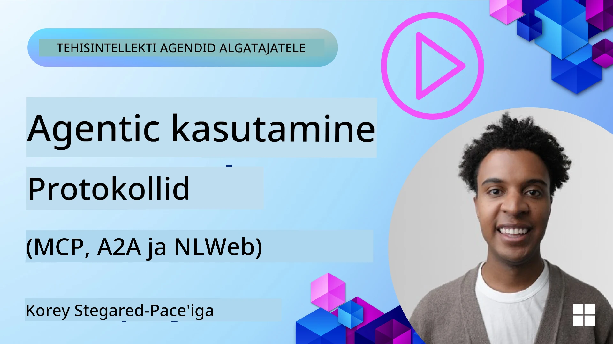
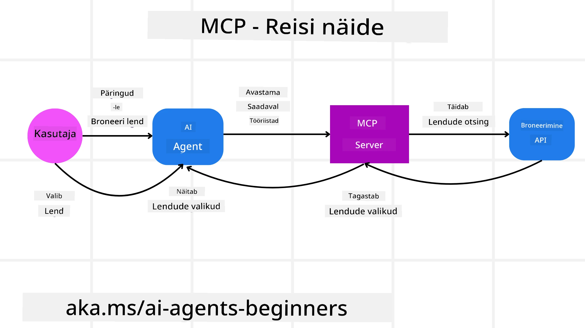
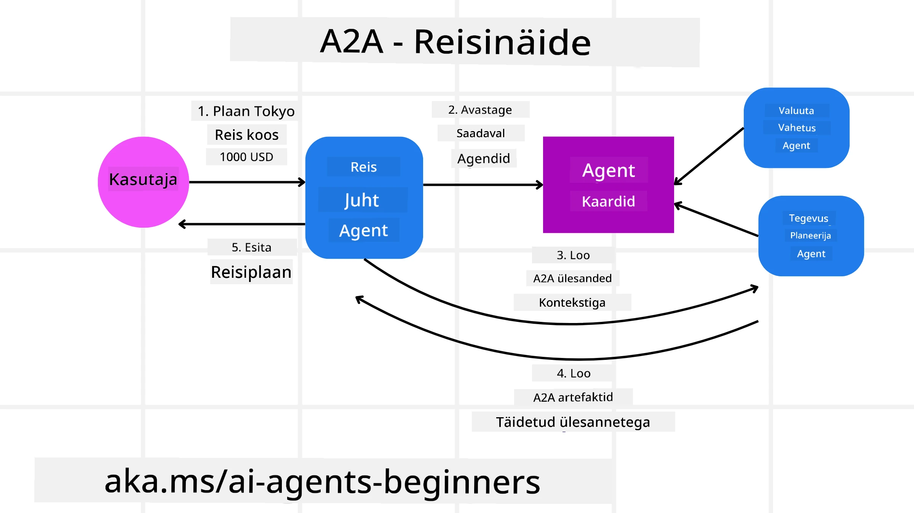
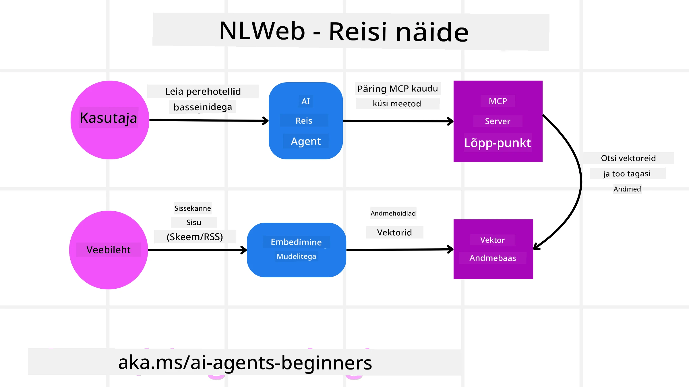

# Agentsete protokollide kasutamine (MCP, A2A ja NLWeb)

> _(Klõpsa ülaloleval pildil, et vaadata selle tunni videot)_

AI agentide kasutamise kasvades suureneb ka vajadus protokollide järele, mis tagavad standardiseerimise, turvalisuse ja toetavad avatud innovatsiooni. Selles tunnis käsitleme kolme protokolli, mis püüavad sellele vajadusele vastata – Model Context Protocol (MCP), Agent to Agent (A2A) ja Natural Language Web (NLWeb).

## Sissejuhatus

Selles tunnis käsitleme:

• Kuidas **MCP** võimaldab AI agentidel pääseda ligi välistele tööriistadele ja andmetele kasutaja ülesannete täitmiseks.

• Kuidas **A2A** võimaldab erinevate AI agentide vahelist suhtlust ja koostööd.

• Kuidas **NLWeb** toob loomuliku keele liidesed igale veebisaidile, võimaldades AI agentidel avastada ja suhelda saidi sisuga.

## Õpieesmärgid

• **Tuvastada** MCP, A2A ja NLWeb põhiline eesmärk ja eelised AI agentide kontekstis.

• **Selgitada** kuidas iga protokoll võimaldab side- ja suhtlusviise LLM-ide, tööriistade ja teiste agentide vahel.

• **Tunda ära** iga protokolli eraldiseisvad rollid keerukate agentsete süsteemide ehitamisel.

## Model Context Protocol

**Model Context Protocol (MCP)** on avatud standard, mis pakub standardiseeritud viisi rakendustele konteksti ja tööriistade pakkumiseks LLM-idele. See võimaldab AI agentidel ühenduda erinevate andmeallikate ja tööriistadega ühtsel viisil nagu "universaalne adapter".

Vaatame MCP komponente, eeliseid võrreldes otsese API kasutamisega ning näidet, kuidas AI agentidel võiks olla MCP serverit kasutada.

### MCP põhilised komponendid

MCP töötab **klient-server arhitektuuril** ja põhilised komponendid on:

• **Hostid** on LLM-rakendused (näiteks koodiredaktor nagu VSCode), mis alustavad ühendusi MCP serveriga.

• **Kliendid** on komponendid hostrakenduses, mis hoitavad ühe ühe ühendust serveriga.

• **Serverid** on kergekaalulised programmid, mis pakuvad kindlaid võimekusi.

Protokoll sisaldab kolme põhiprimitivi, mis on MCP serveri võimed:

• **Tööriistad**: Need on diskreetsed tegevused või funktsioonid, mida AI agent saab kutsuda mingi toimingu tegemiseks. Näiteks võib ilmateenistus pakkuda "saada ilm" tööriista või e-kaubanduse server "osta toode" tööriista. MCP serverid reklaamivad iga tööriista nime, kirjelduse ja sisendi/väljundi skeemi oma võimekirjas.

• **Ressursid**: Need on ainult lugemiseks mõeldud andmeobjektid või dokumendid, mida MCP server saab pakkuda ja mida kliendid saavad vajadusel pärida. Näidetena failisisud, andmebaasi kirjed või logifailid. Ressursid võivad olla tekstilised (näiteks kood või JSON) või binaarsed (näiteks pildid või PDF-id).

• **Päringumallid**: Need on ennaldefineeritud mallid, mis pakuvad soovitatud päringuid keerukamate töövoogude võimaldamiseks.

### MCP eelised

MCP pakub AI agentidele märkimisväärseid eeliseid:

• **Dünaamiline tööriistade avastamine**: Agendid saavad dünaamiliselt serverist tööriistade nimekirja koos nende tegevuse kirjeldustega. See erineb traditsioonilistest API-dest, mis sageli nõuavad staatilist kodeerimist integratsioonide jaoks, mis tähendab, et iga API muudatus nõuab koodi uuendamist. MCP pakub "integreeri üks kord" lähenemist, mis muudab süsteemi paindlikumaks.

• **Ühilduvus eri LLM-idega**: MCP toimib eri LLM-idega, pakkudes võimalust vahetada põhimalle parema jõudluse hindamiseks.

• **Standardiseeritud turvalisus**: MCP sisaldab standardset autentimismeetodit, mis lihtsustab skaleerimist MCP serverite ligipääsu lisamisel. See on lihtsam kui erinevate võtmete ja autentimismeetodite haldamine traditsiooniliste API-de puhul.

### MCP näide

Kujutame ette, et kasutaja soovib lennupiletit broneerida AI assistendi abil, mis on MCP-ga võimendatud.

1. **Ühendus**: AI assistent (MCP klient) ühendub lennufirma MCP serveriga.

2. **Tööriistade avastamine**: Klient küsib lennufirma MCP serverilt: "Millised tööriistad teil olemas on?" Server vastab tööriistadega nagu "lennupiletite otsimine" ja "lennupiletite broneerimine".

3. **Tööriista kutsumine**: Kasutaja palub AI assistendil "Palun otsi lendu Portlandist Honolulu-sse." AI assistent, kasutades oma LLM-i, tuvastab, et tuleb kutsuda "lennupiletite otsimise" tööriist ja edastab vastavad parameetrid (lähtekoht, sihtkoht) MCP serverile.

4. **Teostus ja vastus**: MCP server toimib paketina, teeb tegeliku päringu lennufirma sise broneerimis API-le. Seejärel saab lennuinfo (näiteks JSON-andmed) ja saadab selle AI assistendile tagasi.

5. **Edasine suhtlus**: AI assistent kuvab lennuvõimalused. Kui kasutaja valib lennu, võib assistent kutsuda samas MCP serveris "lennu broneerimise" tööriista, viimaks broneeringu tehtuks.

## Agentidevaheline protokoll (A2A)

Kui MCP keskendub LLM-ide ühendamisele tööriistadega, siis **Agent-to-Agent (A2A) protokoll** viib selle sammu edasi, võimaldades suhtlust ja koostööd erinevate AI agentide vahel. A2A ühendab AI agendid erinevatest organisatsioonidest, keskkondadest ja tehnoloogiatest, et täita ühiseid ülesandeid.

Vaatleme A2A komponente ja eeliseid ning näidet, kuidas seda saab kasutada meie reisirakenduses.

### A2A põhilised komponendid

A2A keskendub agentide omavahelisele suhtlusele ja koostööle kasutaja osülesande täitmisel. Protokolli iga komponent panustab sellesse:

#### Agentide kaart

Sarnaselt MCP serveri tööriistade nimekirjale sisaldab Agentide kaart:
- Agendi nimi.
- Üldiste täidetavate ülesannete kirjeldus.
- Konkreetsete oskuste nimekiri koos kirjeldusega, mis aitab teistel agentidel (või isegi inimestel) mõista, millal ja miks agenti kutsuda.
- Agendi praegune lõpp-punkti URL.
- Agendi versioon ja võimekus, näiteks voogedastuse vastused ja push-teavitused.

#### Agendi käivitaja

Agendi käivitaja vastutab **kasutaja vestluse konteksti edastamise eest kaugemale agendile**, kes vajab seda, et mõista täidetavat ülesannet. A2A serveris kasutab agent oma suurt keelemudelit (LLM) sissetulevate päringute tõlgendamiseks ja ülesannete täitmiseks oma sisemiste tööriistade abil.

#### Artefakt

Kui kaugagent on päringu täitnud, luuakse ta tehtud tööst artefakt. Artefakt **sisaldab agendi töö tulemust**, **kirjeldust sellest, mis valmis tehti** ja **teksti konteksti**, mis saadetakse läbi protokolli. Pärast artefakti saatmist suletakse ühendus kaugagentiga kuni järgmise vajaduseni.

#### Sündmuste järjekord

See komponent haldab **värskendusi ja sõnumite edastamist**. See on tootmiskeskkonnas agentsete süsteemide jaoks väga oluline, et takistada ühenduse sulgumist agendide vahel enne, kui ülesanne on lõpetatud, eriti kui ülesande täitmine võib võtta aega.

### A2A eelised

• **Täiustatud koostöö**: Võimaldab agentidel erinevatelt müüjatelt ja platvormidelt omavahel suhelda, konteksti jagada ja koostööd teha, võimaldades sujuvat automatiseerimist traditsiooniliselt eraldiseisvate süsteemide vahel.

• **Mudeli valiku paindlikkus**: Iga A2A agent saab otsustada, millist LLM-i kasutada oma päringute teenindamiseks, võimaldades optimeeritud või peenhäälestatud mudeleid iga agendi jaoks, erinevalt MCP mõningatest ühe LLM ühenduse stsenaariumitest.

• **Sisseehitatud autentimine**: Autentimine on otse A2A protokolli integreeritud, pakkudes tugeva turvakihi agentide omavaheliseks suhtlemiseks.

### A2A näide

Vaatame reisibroneerimise stsenaariumi ja kasutame seekord A2A.

1. **Kasutaja päring multi-agendile**: Kasutaja suhtleb "Reisiagendi" A2A kliendi/agendiga, näiteks ütleb: "Broneeri palun kogu reis Honolulu-sse järgmiseks nädalaks, lent, hotell ja rendiauto."

2. **Reisiagendi korraldus**: Reisiagent saab selle keeruka päringu. Kasutades oma LLM-i otsustab ta, et peab suhtlema teiste spetsialiseerunud agentidega.

3. **Agentidevaheline suhtlus**: Reisiagent kasutab A2A protokolli, et ühenduda allpool asuvate agentidega nagu "Lennufirma agent", "Hotelli agent" ja "Rendiauto agent", kes on erinevate firmade poolt loodud.

4. **Delegeeritud ülesannete täitmine**: Reisiagent saadab need spetsiifilised ülesanded spetsialiseerunud agentidele (nt "Leia lennud Honolulu-sse", "Broneeri hotell", "Rendi auto"). Iga neist agentidest kasutab oma LLM-i ja omab tööriistu (mis võivad olla MCP serverid), mis täidavad oma osa broneeringust.

5. **Konsolideeritud vastus**: Kui kõik allagendid on oma tööd lõpetanud, koondab Reisiagent tulemused (lennuandmed, hotelli kinnitused, rendibroneeringu) ja saadab kasutajale kokkuvõtliku vestlusstiilis vastuse.

## Loomuliku keele veeb (NLWeb)

Veebisaidid on ammu olnud peamiseks kasutajate teabe ja andmete ligipääsu kohaks internetis.

Vaatame NLWeb erinevaid komponente, selle eeliseid ja näidet, kuidas meie NLWeb töötab reisirakenduse kontekstis.

### NLWeb komponendid

- **NLWeb rakendus (tuumik teenuse kood)**: Süsteem, mis töötleb loomulikus keeles esitatud küsimusi. See ühendab platvormi erinevad osad vastuste loomiseks. Seda võib mõelda kui **mootorit, mis juhib veebilehe loomuliku keele funktsioone**.

- **NLWeb protokoll**: See on **lihtne komplekt reegleid loomuliku keelena suhtlemiseks veebisaidiga**. See saadab vastused tagasi JSON formaadis (tihti kasutades Schema.org). Selle eesmärk on luua lihtne alus "AI veebiks", sarnaselt kuidas HTML võimaldas jagada dokumente veebis.

- **MCP server (Model Context Protocol lõpp-punkt)**: Iga NLWeb seadistus töötab ka **MCP serverina**. See tähendab, et ta saab **jagada tööriistu (näiteks „ask“ meetod) ja andmeid** teiste AI süsteemidega. Praktikas teeb see veebisaidi sisu ja funktsioonid kasutatavaks AI agentidele, muutes saidi osa laiemast "agendite ökosüsteemist".

- **Embeddi mudelid**: Need mudelid teisendavad veebisaidi sisu numbrilisteks esituskujunditeks ehk vektoriteks (embedding). Need vektorid haaravad tähendust, mida arvutid saavad võrrelda ja otsida. Need salvestatakse spetsiaalsesse andmebaasi ja kasutajad saavad valida, millist embeddi mudelit soovivad kasutada.

- **Vektorandmebaas (otsingumootor)**: See andmebaas **salvestab veebisisu embeddi vektorid**. Kui keegi esitab küsimuse, kontrollib NLWeb kiiresti vektorandmebaasis, millised andmed on kõige asjakohasemad, pakkudes kiiresti järjestatud vastuste nimekirja. NLWeb töötab koos erinevate vektorandmebaasidega nagu Qdrant, Snowflake, Milvus, Azure AI Search ja Elasticsearch.

### NLWeb näide

Võtame meie reisibroneerimise veebisaidi uuesti, aga seekord NLWeb moel.

1. **Andmete toomine**: Reisisaiti toodavad olemasolevad tootekataloogid (nt lendude nimekirjad, hotellide kirjeldused, ekskursioonipaketid) vormindatakse kasutades Schema.org või tuuakse sisse RSS-voogude kaudu. NLWeb tööriistad loevad seda struktureeritud andmestikku, loovad embeddi vektorid ja salvestavad need kohalikku või kaugesse vektorandmebaasi.

2. **Loomuliku keele päring (inimene)**: Kasutaja tuleb saidile ja selle asemel, et menüüsid sirvida, sisestab vestlusliidesesse: "Leia mulle pere­sõbralik hotell Honolulu-s, kus oleks bassein järgmiseks nädalaks."

3. **NLWeb töötlemine**: NLWeb rakendus võtab päringu vastu, saadab selle mõistmiseks LLM-ile ning samal ajal otsib oma vektorandmebaasist sobivaid hotelli pakkumisi.

4. **Täpsed tulemused**: LLM aitab tõlgendada andmebaasi otsingutulemusi, tuvastab parimad vasteid, võttes arvesse "pere­sõbralik", "bassein" ja "Honolulu" kriteeriume ning vormistab loomulikus keeles vastuse. Oluline on, et vastus viitab reaalsetele hotellidele saidi kataloogist, vältides väljamõeldud infot.

5. **AI agendi suhtlus**: Kuna NLWeb töötab MCP serverina, võib välise AI reisiasistent ka ühenduda NLWeb instantsiga. AI agent saab siis kasutada `ask` MCP meetodit külaskäigu pärimiseks otse saidilt: `ask("Kas on hotelli lähedal soovitatavaid vegan-sõbralikke restorane Honolulu piirkonnas?")`. NLWeb töötleb seda päringut, kasutades oma restoraniandmete andmebaasi (kui see on laaditud) ja tagastab struktureeritud JSON vastuse.

### Kas sul on rohkem küsimusi MCP/A2A/NLWeb kohta?

Liitu [Microsoft Foundry Discordiga](https://aka.ms/ai-agents/discord), et kohtuda teiste õppijatega, osaleda avatud uste tundides ja saada vastuseid AI agentide teemal.

## Ressursid

- [MCP algajatele](https://aka.ms/mcp-for-beginners)  
- [MCP dokumentatsioon](https://learn.microsoft.com/python/api/overview/azure/ai-projects-readme)
- [NLWeb hoidla](https://github.com/nlweb-ai/NLWeb)
- [Microsoft Agent Framework](https://aka.ms/ai-agents-beginners/agent-framewrok)

---

<!-- CO-OP TRANSLATOR DISCLAIMER START -->
**Vastutusest loobumine**:  
See dokument on tõlgitud kasutades AI tõlke teenust [Co-op Translator](https://github.com/Azure/co-op-translator). Kuigi püüame täpsust tagada, palun arvestage, et automaatsed tõlked võivad sisaldada vigu või ebatäpsusi. Algne dokument selle emakeeles tuleks pidada autoriteetseks allikaks. Olulise teabe puhul soovitatakse kasutada professionaalset inimtõlget. Me ei vastuta ühegi arusaamatuse või valesti mõistmise eest, mis võivad tuleneda selle tõlke kasutamisest.
<!-- CO-OP TRANSLATOR DISCLAIMER END -->