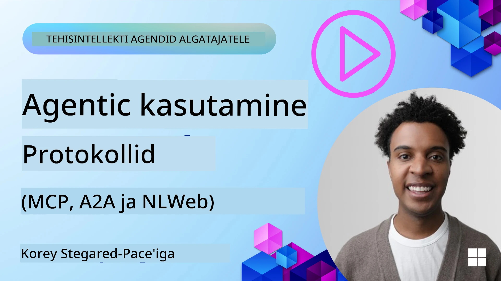
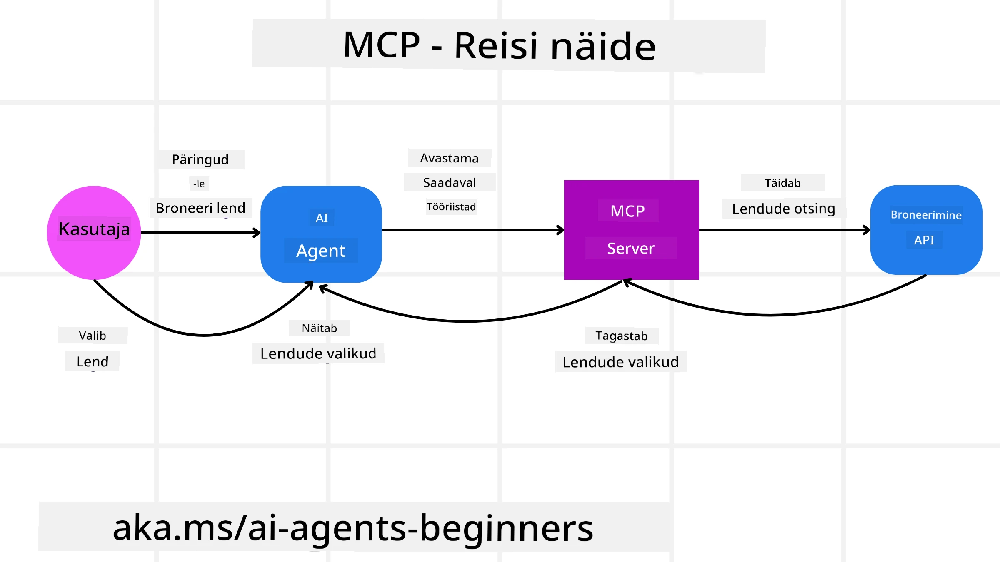
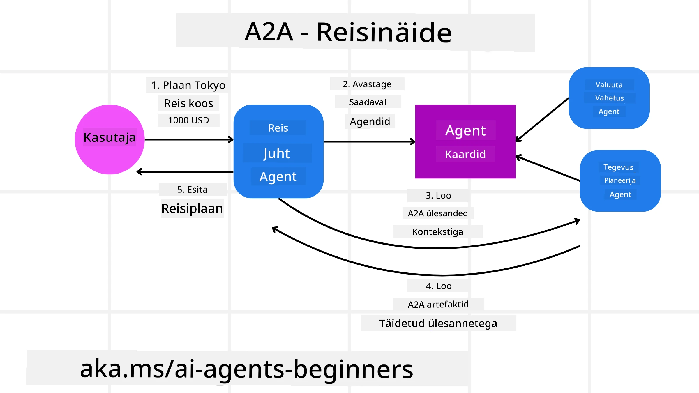
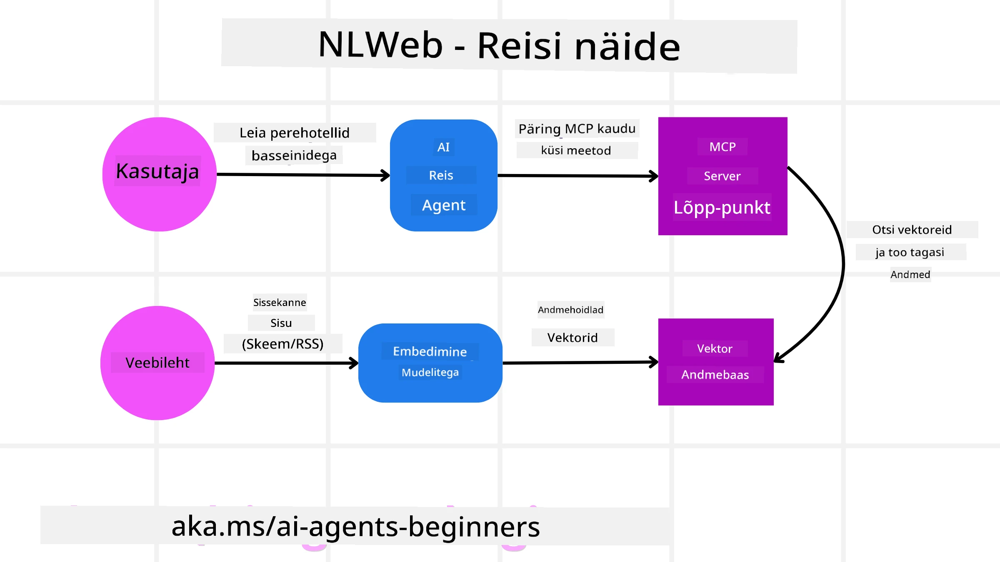

# Agentsete protokollide kasutamine (MCP, A2A ja NLWeb)

> _(Klõpsa ülaloleval pildil, et vaadata selle tunni videot)_

Kuna tehisintellekti agentide kasutamine kasvab, suureneb vajadus protokollide järele, mis tagavad standardimise, turvalisuse ja toetavad avatud innovatsiooni. Selles õppetükis käsitleme kolme protokolli, mis püüavad seda vajadust täita – Model Context Protocol (MCP), Agent to Agent (A2A) ja Natural Language Web (NLWeb).

## Sissejuhatus

Selles õppetükis käsitleme:

• Kuidas **MCP** võimaldab tehisintellekti agentidel pääseda ligi välistele tööriistadele ja andmetele kasutajate ülesannete täitmiseks.

• Kuidas **A2A** võimaldab erinevate tehisintellekti agentide vahel suhtlust ja koostööd.

• Kuidas **NLWeb** toob loomuliku keele liidesed igale veebisaidile, võimaldades tehisintellekti agentidel avastada ja suhelda sisuga.

## Õpieesmärgid

• **Tuvastada** MCP, A2A ja NLWeb põhieesmärgid ja eelised tehisintellekti agentide kontekstis.

• **Selgitada**, kuidas iga protokoll hõlbustab suhtlust ja взаимодействие LLM-ide, tööriistade ja teiste agentide vahel.

• **Tuvustada** iga protokolli eristatavad rollid keerukate agentsete süsteemide loomisel.

## Model Context Protocol

**Model Context Protocol (MCP)** on avatud standard, mis pakub standardiseeritud viisi rakendustele LLM-idele konteksti ja tööriistu pakkuda. See võimaldab "universaalset adapterit" erinevate andmeallikate ja tööriistade jaoks, millega tehisintellekti agentidel on võimalik järjekindlalt ühendada.

Vaatame MCP komponente, eeliseid võrreldes otsese API kasutamisega ja näidet, kuidas tehisintellekti agendid võiksid MCP serverit kasutada.

### MCP põhikomponendid

MCP töötab **kliendi-serveri arhitektuuri** põhimõttel ja põhikomponendid on:

• **Hostid** on LLM rakendused (näiteks koodiredaktor nagu VSCode), mis alustavad ühendusi MCP serveriga.

• **Kliendid** on hostrakenduse komponendid, mis hoiavad ühe-ühele ühendusi serveritega.

• **Serverid** on kerged programmid, mis avaldavad kindlaid funktsionaalsusi.

Protokoll sisaldab kolme põhilist primitiivi, mis on MCP serveri võimed:

• **Tööriistad**: Need on diskreetsed toimingud või funktsioonid, mida tehisintellekti agent saab kutsuda toimingu sooritamiseks. Näiteks võib ilmateenus avaldada "ilma päringu" tööriista või e-kaubanduse server "toote ostmise" tööriista. MCP serverid teavitavad iga tööriista nime, kirjeldust ja sisend-/väljundiskeemi oma võimete nimekirjas.

• **Võimalused**: Need on ainult lugemiseks mõeldud andmeobjektid või dokumendid, mida MCP server saab pakkuda ning mida kliendid saavad vajadusel pärida. Näiteks failisisu, andmebaasi kirjed või logifailid. Võimalused võivad olla tekstipõhised (näiteks kood või JSON) või binaarsed (nagu pildid või PDF-id).

• **Sihid (Prompts)**: Need on eelmääratletud mallid, mis pakuvad soovitatud sihid, võimaldades keerukamaid töövooge.

### MCP eelised

MCP pakub tehisintellekti agentidele olulisi eeliseid:

• **Dünaamiline tööriistade avastamine**: Agentidel on võimalik serverilt dünaamiliselt saada nimekiri saadaval tööriistadest koos kirjeldustega nende funktsioonide kohta. See erineb traditsioonilistest API-dest, mis tihti nõuavad staatilist koodi integreerimisel ning iga API muutus nõuab koodi uuendamist. MCP pakub "ühenda üks kord" lähenemist, mis suurendab kohanemisvõimet.

• **Ühilduvus erinevate LLM-idega**: MCP toimib erinevate LLM-idega, pakkudes paindlikkust põhimudelite vahetamiseks parema jõudluse saavutamiseks.

• **Standardiseeritud turvalisus**: MCP sisaldab standardset autentimismeetodit, mis parandab skaleeritavust lisamispunktide lisamisel. See on lihtsam kui hallata erinevaid võtmeid ja autentimisviise traditsiooniliste API-de puhul.

### MCP näide

Kujutame ette, et kasutaja soovib MCP-l põhineva AI assistendi abil lennupileti broneerida.

1. **Ühendus**: AI assistent (MCP klient) ühendub lennufirma MCP serveriga.

2. **Tööriistade avastamine**: Klient küsib lennufirma MCP serverilt: "Millised tööriistad teil saadaval on?" Server vastab tööriistadega nagu "lennuotsing" ja "lennupileti broneerimine".

3. **Tööriista kutsumine**: Sa palud AI assistendil: "Palun otsi lendu Portlandist Honolulu suunas." AI assistent, kasutades oma LLM-i, tuvastab, et ta peab kutsuma "lennuotsing" tööriista ning edastab asjakohased parameetrid (lähtekoht, sihtkoht) MCP serverile.

4. **Täideviimine ja vastus**: MCP server, toimides mähisena, teeb tegeliku kõne lennufirma sisemise broneerimis-API-le. Seejärel saab lennuandmed (nt JSON-formaadis) ja saadab need tagasi AI assistendile.

5. **Edasine suhtlus**: AI assistent kuvab lennuvalikud. Kui sa valid lennu, võib assistent kutsuda samal MCP serveril "lennupileti broneerimise" tööriista, lõpetades broneeringu.

## Agentidevaheline protokoll (A2A)

Kui MCP keskendub LLM-ide ühendamisele tööriistadega, siis **Agent-to-Agent (A2A) protokoll** teeb sammu edasi, võimaldades erinevate tehisintellekti agentide vahel suhtlust ja koostööd. A2A ühendab tehisintellekti agente erinevatest organisatsioonidest, keskkondadest ja tehnoloogiatest ühise ülesande täitmiseks.

Uurime A2A komponente ja eeliseid ning näidet, kuidas seda reisirakenduses rakendada.

### A2A põhikomponendid

A2A keskendub agentidevahelise suhtluse võimaldamisele ja nende koostööle kasutaja alamosa täitmisel. Iga protokolli komponent panustab sellesse:

#### Agendi kaart

Nagu MCP server jagab tööriistade nimekirja, sisaldab Agendi kaart:
- Agendi nime.
- **kirjeldust üldiste ülesannete** kohta, mida ta täidab.
- **konkreetsete oskuste nimekirja** koos kirjeldustega, et aidata teistel agentidel (või isegi inimestel) mõista, millal ja miks seda agenti kutsuda.
- Agendi **praeguse lõpp-punkti URL-i**.
- Agendi **versiooni** ja **võimeid**, nagu voogedastus vastused ja push-teavitused.

#### Agendi täideviija

Agendi täideviija on vastutav **kasutaja vestluse konteksti edastamise eest kaugagentile**, kaugagent vajab seda ülesande mõistmiseks. A2A serveris kasutab agent oma Large Language Model-i (LLM) saabuvate päringute tõlgendamiseks ja ülesannete täitmiseks oma sisemisi tööriistu.

#### Artefakt

Kui kaugagent on soovitud ülesande täitnud, luuakse tema töö tulemusena artefakt. Artefakt **sisaldab agendi töö tulemust**, **täidetud ülesande kirjelduse** ja protokolli kaudu saadetud **teksti konteksti**. Artefakti saatmise järel suletakse kaugagendiga ühendus, kuni seda taas vajatakse.

#### Sündmuste järjekord

Seda komponenti kasutatakse **uuenduste haldamiseks ja sõnumite edastamiseks**. See on tootmiskeskkonnas eriti oluline, et tagada ühenduse agentide vahel hoidmine avatuna, kuni ülesanne on lõpule viidud, eriti kui ülesande täitmine võtab kaua aega.

### A2A eelised

• **Paranenud koostöö**: Võimaldab erinevate müüjate ja platvormide agentidel suhelda, jagada konteksti ja töötada koos, hõlbustades sujuvat automatiseerimist traditsiooniliselt lahusolnud süsteemide vahel.

• **Mudeli valiku paindlikkus**: Iga A2A agent saab otsustada, millist LLM-i ta kasutab päringute teenindamiseks, võimaldades iga agenti jaoks optimeeritud või peenhäälestatud mudeleid, erinevalt ühe LLM ühenduse kasutamisest mõne MCP stsenaariumi puhul.

• **Sisseehitatud autentimine**: Autentimine on integreeritud otse A2A protokolli, pakkudes tugevat turvalisuskäsitlust agentidevahelistes suhtlustes.

### A2A näide

Laiendame oma reisibroneerimise stsenaariumi, seekord A2A abil.

1. **Kasutajapäring mitme agendi poole**: Kasutaja suhtleb "Reisindaja" A2A kliendi/agendiga, öeldes näiteks: "Palun broneeri terve reis Honolulu järgmiseks nädalaks, kuhu kuuluvad lend, hotell ja rendiauto".

2. **Reisindaja orkestreerimine**: Reisindaja saab selle keeruka päringu. Ta kasutab oma LLM-i, et ülesannet analüüsida ja otsustamis, et peab suhtlema teiste spetsialiseerunud agentidega.

3. **Agentidevaheline suhtlus**: Seejärel kasutab Reisindaja A2A protokolli, et ühenduda alluvate agentidega, nagu "Lennufirma agent", "Hotelli agent" ja "Rendiauto agent", kes on loodud erinevate ettevõtete poolt.

4. **Ülesannete delegaatimine**: Reisindaja saadab neile spetsialiseerunud agentidele kindlad ülesanded (näiteks "Leia lennud Honolulu", "Broneeri hotell", "Rendi auto"). Iga spetsialiseerunud agent kasutab oma LLM-i ja tööriistu (mis võivad olla ka MCP serverid), et oma osa broneeringust täita.

5. **Kokkuvõetud vastus**: Kui kõik alluvagentide ülesanded on täidetud, koondab Reisindaja tulemused (lennuandmed, hotelli kinnitus, rendiauto broneering) ja saadab kasutajale põhjaliku vestluslaadse vastuse.

## Loomuliku keele veeb (NLWeb)

Veebisaidid on pikka aega olnud peamine viis, kuidas kasutajad pääsevad ligi teabele ja andmetele internetis.

Vaatame NLWeb erinevaid komponente, NLWeb eeliseid ning näidet, kuidas meie NLWeb töötab, vaadates oma reisirakendust.

### NLWeb komponendid

- **NLWeb rakendus (tuumikuteenuse kood)**: Süsteem, mis töötleb loomuliku keele küsimusi. See ühendab platvormi erinevad osad vastuste loomise jaoks. Võid mõelda sellele kui **mootorile, mis tagab loomuliku keele funktsioonid veebisaidil**.

- **NLWeb protokoll**: See on **põhikomplekt reegleid loomuliku keelega suhtlemiseks** veebisaidiga. See saadab vastused tagasi JSON vormingus (tihti Schema.org abil). Selle eesmärk on luua lihtne alus „tehisintellekti veebile“, sama moodi, nagu HTML võimaldas dokumentide jagamist veebis.

- **MCP server (Model Context Protocol lõpp-punkt)**: Iga NLWeb seadistus toimib ka **MCP serverina**. See tähendab, et see võib **jagada tööriistu (nt „küsi“ meetod) ja andmeid** teiste AI süsteemidega. Praktiliselt teeb see veebisaidi sisu ja võimekuse AI agentide kasutamiseks, muutes saidi laiemale „agentide ökosüsteemile“ osaks.

- **Manustamismudelid**: Neid mudeleid kasutatakse **veebisaidi sisu teisendamiseks numbrilisteks esitluseks nimega vektorid (manused)**. Need vektorid kajastavad tähendust viisil, mida arvutid saavad võrrelda ja otsida. Neid hoiustatakse spetsiaalses andmebaasis ning kasutajad saavad valida oma soovitud manustamismudeli.

- **Vektoriandmebaas (otsimismehhanism)**: See andmebaas **hoiab veebisaidi sisu manuseid**. Kui keegi esitab küsimuse, kontrollib NLWeb vektoriandmebaasi, et kiiresti leida kõige asjakohasem teave. See annab kiire nimekirja võimalikest vastustest, järjestatult sarnasuse järgi. NLWeb töötab koos erinevate vektorihoidlate süsteemidega nagu Qdrant, Snowflake, Milvus, Azure AI Search ja Elasticsearch.

### NLWeb näide

Vaadake uuesti meie reisibroneerimise veebisaiti, mis on seekord NLWebiga varustatud.

1. **Andmete sissetoomine**: Reisi veebisaidi olemasolevad tootekataloogid (nt lendude nimekirjad, hotellikirjeldused, ekskursioonipakid) vormindatakse Schema.org abil või laaditakse sisse RSS voogudega. NLWeb tööriistad võtavad selle struktureeritud andme, loovad manused ja salvestavad need kohalikusse või kaugvektori andmebaasi.

2. **Loomuliku keele päring (inimene)**: Kasutaja külastab veebisaiti ja tüübib menüüde sirvimise asemel vestlusliidesesse: "Leidke mulle perekonnasõbralik hotell Honolulus, kus on basseini järgmise nädala jaoks."

3. **NLWeb töötlemine**: NLWeb rakendus saab selle päringu. See saadab päringu LLM-ile mõistmiseks ja samaaegselt otsib oma vektoriandmebaasist vastavaid hotellikataloogi postitusi.

4. **Täpsed tulemused**: LLM aitab tõlgendada andmebaasi otsingutulemusi, tuvastab parimad vasted kriteeriumidel "perekonnasõbralik", "bassein" ja "Honolulu" ning vormistab loomulikus keeles vastuse. Väga tähtis on, et vastus viitab reaalsetele hotellidele veebisaidi kataloogist, vältides väljamõeldud infot.

5. **Tehisintellekti agendi suhtlus**: Kuna NLWeb toimib MCP serverina, võib ka välise tehisintellekti reisindaja agent ühenduda selle veebisaidi NLWeb instantsiga. Tehisintellekti agent võib kasutada `ask` MCP meetodit, et otse veebisaidilt pärida: `ask("Kas hotell soovitab Honolulus vegan-sõbralikke restorane?")`. NLWeb töötleb selle päringu, kasutades restoranide infot sisaldavat andmebaasi (kui see on laaditud) ja tagastab struktureeritud JSON vastuse.

### Kas soovid rohkem teada MCP/A2A/NLWeb kohta?

Liitu [Microsoft Foundry Discordiga](https://discord.com/invite/ATgtXmAS5D), et kohtuda teiste õppijatega, osaleda lahtistes tundides ja saada vastuseid oma AI agentide küsimustele.

## Ressursid

- [MCP algajatele](https://aka.ms/mcp-for-beginners)  
- [MCP dokumentatsioon](https://learn.microsoft.com/python/api/overview/azure/ai-projects-readme)
- [NLWeb repos](https://github.com/nlweb-ai/NLWeb)
- [Microsoft Agent Framework](https://aka.ms/ai-agents-beginners/agent-framework)

---

<!-- CO-OP TRANSLATOR DISCLAIMER START -->
**Lahtiütlus**:
See dokument on tõlgitud kasutades AI tõlketeenust [Co-op Translator](https://github.com/Azure/co-op-translator). Kuigi me püüdleme täpsuse poole, palun pange tähele, et automatiseeritud tõlgetes võib esineda vigu või ebatäpsusi. Originaaldokument selle emakeeles tuleks pidada autoriteetseks allikaks. Olulise teabe puhul soovitatakse kasutada professionaalset inimtõlget. Me ei vastuta selle tõlkega seotud eksimustest või valesti mõistmistest.
<!-- CO-OP TRANSLATOR DISCLAIMER END -->