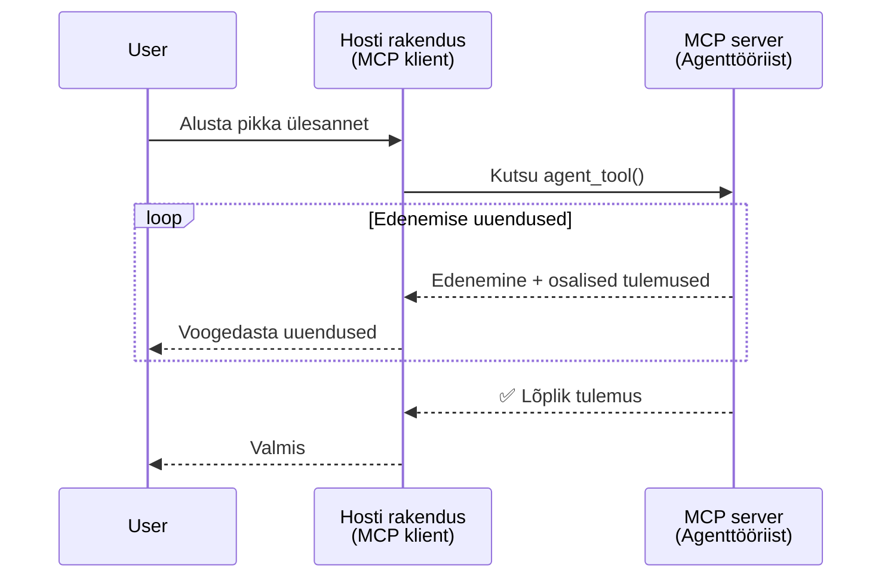
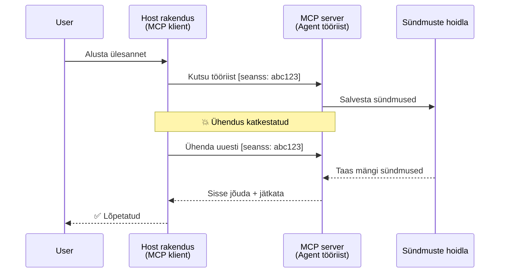
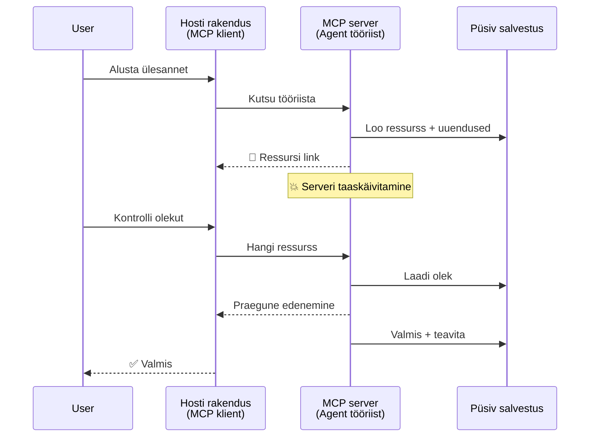
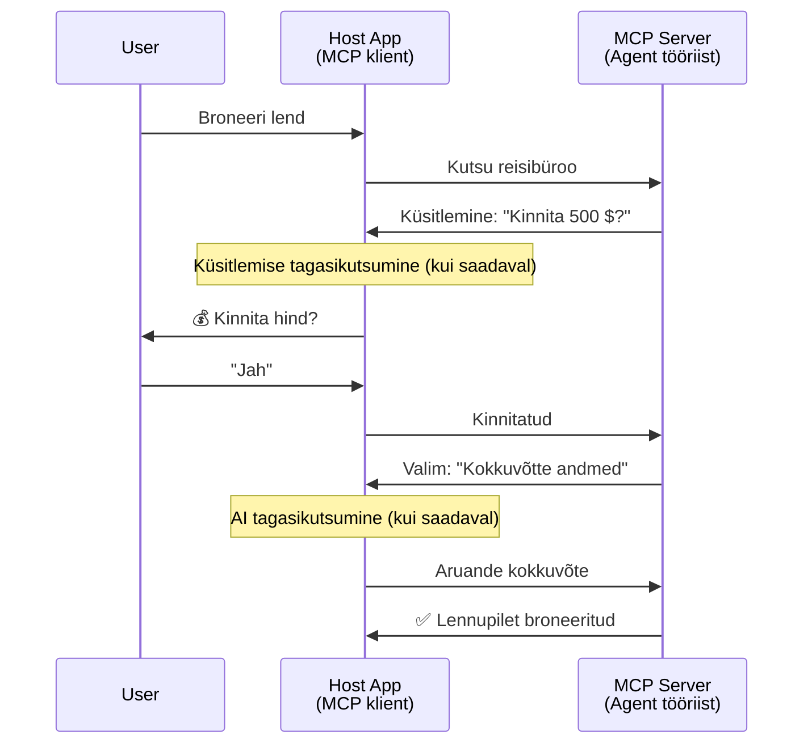
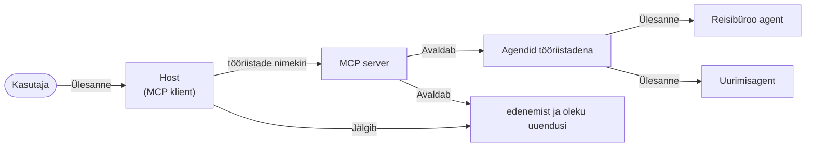

# Agendi-agendi suhtlussüsteemide loomine MCP abil

> Kokkuvõte - Kas saate luua Agent2Agent suhtluse MCP-l? Jah!

MCP on oluliselt arenenud võrreldes selle algse eesmärgiga „pakkuda konteksti LLM-idele“. Hiljutiste täiustuste hulka kuuluvad [jätkusuutlikud vood](https://modelcontextprotocol.io/docs/concepts/transports#resumability-and-redelivery), [väljakutsumine](https://modelcontextprotocol.io/specification/2025-06-18/client/elicitation), [valim](https://modelcontextprotocol.io/specification/2025-06-18/client/sampling) ja teavitused ([edusammud](https://modelcontextprotocol.io/specification/2025-06-18/basic/utilities/progress) ning [ressursid](https://modelcontextprotocol.io/specification/2025-06-18/schema#resourceupdatednotification)), mis võimaldavad MCP-l nüüd pakkuda tugevat alust keerukate agentidevaheliste suhtlussüsteemide loomiseks.

## Agent-/tööriista väärarusaam

Kuna üha rohkem arendajaid uurib tööriistu, millel on agentlikud käitumised (pikk kestus, võib vajada täiendavat sisendit täitmise keskel jne), on levinud eksiarvamus, et MCP pole sobiv, peamiselt seetõttu, et varasemad näited MCP tööriistade kohta keskendusid lihtsatele päringut-vastuse mustritele.

See arusaam on aegunud. MCP spetsifikatsiooni on viimastel kuudel oluliselt täiustatud võimetega, mis vähendavad lõhet pikaajaliste agentsete käitumiste loomiseks:

- **Voogesitus & osalised tulemused**: Reaalajas edenemise uuendused täitmise ajal
- **Jätkusuutlikkus**: Kliendid saavad ühendust uuesti luua ja jätkata pärast katkestust
- **Püsivus**: Tulemused säilivad serveri taaskäivituste korral (nt ressursilingi kaudu)
- **Mitme ringi suhtlus**: Interaktiivne sisend täitmise keskel väljakutsumise ja valimi abil

Neid funktsioone saab kombineerida keerukate agentide ja mitme agendi rakenduste loomiseks, kõik MCP protokollil baseeruvad.

Viitena kasutame agenti kui „tööriista“, mis on saadaval MCP serveris. See tähendab, et eksisteerib hostrakendus, mis rakendab MCP klienti, mis loob seansi MCP serveriga ja saab agenti kutsuda.

## Mis teeb MCP tööriista „agentseks“?

Enne rakendusse sukeldumist vaatleme, milliseid infrastruktuurivõimeid on vaja pikaajaliste agentide toetamiseks.

> Defineerime agendi kui üksuse, mis suudab iseseisvalt tegutseda pikema aja jooksul, hallates keerukaid ülesandeid, mis võivad vajada mitut suhtlust või kohandamist reaalajas tagasiside põhjal.

### 1. Voogesitus & osalised tulemused

Traditsioonilised päringut-vastuse mustrid ei sobi pikaajalistele ülesannetele. Agendid peavad pakkuma:

- Reaalajas edenemise uuendusi
- Vahepealseid tulemusi

**MCP tugi**: Ressursi uuenduste teavitused võimaldavad osalisi tulemusi voogesitada, kuid see nõuab hoolikat disaini, et vältida konflikte JSON-RPC 1:1 päring-vastuse mudeliga.

| Funktsioon                 | Kasutusjuhtum                                                                                   | MCP tugi                                                                                 |
| --------------------------| ------------------------------------------------------------------------------------------------| ----------------------------------------------------------------------------------------- |
| Reaalajas edenemise uuendused | Kasutaja algatab koodibaasi migreerimise ülesande. Agent voogesitab edenemist: „10% - sõltuvuste analüüs... 25% - TypeScript failide konverteerimine... 50% - importide uuendus...“ | ✅ Edenemise teavitused                                                                   |
| Osalised tulemused          | „Raamatu genereerimise“ ülesanne voogesitab osalisi tulemusi, nt 1) loo kaare kokkuvõte, 2) peatükkide loend, 3) iga peatükk valmimisel. Host saab igal hetkel vaadata, tühistada või suunata. | ✅ Teavitused saab „laiendada“ osalistele tulemustele, vt ettepanekuid PR 383, 776        |

<div align="center" style="font-style: italic; font-size: 0.95em; margin-bottom: 0.5em;">
<strong>Joonis 1:</strong> See diagramm näitab, kuidas MCP agent voogesitab reaalajas edenemise uuendusi ja osalisi tulemusi hostrakendusele pikaajalise ülesande käigus, võimaldades kasutajal jälgida täitmist reaalajas.
</div>



### 2. Jätkusuutlikkus

Agendid peavad haldama võrgu katkestusi sujuvalt:

- Ühenduse taastamine pärast (kliendi) katkestust
- Jätkamine kohast, kus pooleli jäi (sõnumite uuesti edastamine)

**MCP tugi**: MCP StreamableHTTP transpordith tänapäeval toetab seansi jätkamist ja sõnumite uuesti edastamist seansi ID-de ja viimase sündmuse ID-de abil. Oluline on märkida, et server peab rakendama EventStore'i, mis võimaldab sündmuste taasesitamist kliendi ühenduse taastamisel.
Märkige, et kogukonna ettepanek (PR #975) uurib transpordist sõltumatute jätkusuutlike voogude võimalust.

| Funktsioon    | Kasutusjuhtum                                                                                                     | MCP tugi                                                                    |
| ------------ | -------------------------------------------------------------------------------------------------------------- | ---------------------------------------------------------------------------- |
| Jätkusuutlikkus | Klient katkestab pikaajalise ülesande ajal. Ühenduse taastamisel jätkub seanss vahele jäänud sündmuste taasesitamisega ilma katkestusteta. | ✅ StreamableHTTP transport koos seansi ID-de, sündmuste taasesituse ja EventStore'iga |

<div align="center" style="font-style: italic; font-size: 0.95em; margin-bottom: 0.5em;">
<strong>Joonis 2:</strong> See diagramm näitab, kuidas MCP StreamableHTTP transport ja sündmuste pood võimaldavad sujuvat seansi jätkamist: kui klient kaotab ühenduse, saab ta uuesti ühendada ja vahele jäänud sündmusi taasesitada, jätkates ülesannet edenemiseta.
</div>



### 3. Püsivus

Pikaajaliste agentide jaoks on vaja püsivat olekut:

- Tulemused säilivad serveri taaskäivitustest
- Seisundi saab hankida väljaspool voogu
- Edenemisel jälgimine seansside lõikes

**MCP tugi**: MCP toetab nüüd ressursi lingi tagastustüüpi tööriista kutsetes. Tavaline muster on kujundada tööriist, mis loob ressursi ja tagastab kohe ressursilingi. Tööriist võib taustal ülesannet jätkata ja ressursi värskendada. Klient saab valida, kas pidevalt ressurssi kontrollida, et saada osalisi või täielikke tulemusi (sõltuvalt sellest, milliseid ressursi uuendusi server pakub), või tellida ressursi uuenduste teavitusi.

Üks piirang on see, et ressursside pööramine või uuenduste tellimine võib kulutada ressursse ning suurtel mahtudel mõjutada jõudlust. Avatud kogukonna ettepanek (sealhulgas #992) uurib võimalust lisada webhook’e või trigerid, millele server saab helistada, et klienti/hostrakendust uuendustest teavitada.

| Funktsioon  | Kasutusjuhtum                                                                                                      | MCP tugi                                                        |
| ---------- | ----------------------------------------------------------------------------------------------------------------- | ---------------------------------------------------------------- |
| Püsivus    | Server jookseb kokku andmete migreerimise ajal. Tulemused ja edenemine säilivad taaskäivituse korral, klient saab kontrollida olekut ja jätkata püsiva ressursi alusel. | ✅ Ressursilingid püsiva salvestuse ja oleku teavitustega       |

Tänapäeval on tavaline muster kujundada tööriist, mis loob ressursi ja tagastab kohe ressursilingi. Tööriist võib taustal ülesannet täita, saata ressursiteavitusi, mis toimivad edenemise uuendustena või sisaldavad osalisi tulemusi, ning vajadusel ressursi sisu uuendada.

<div align="center" style="font-style: italic; font-size: 0.95em; margin-bottom: 0.5em;">
<strong>Joonis 3:</strong> See diagramm demonstreerib, kuidas MCP agendid kasutavad püsivaid ressursse ja oleku teavitusi, et tagada pikaajaliste ülesannete säilimine serveri taaskäivitustest, võimaldades klientidel jälgida edenemist ja tulemusi ka vigade korral.
</div>



### 4. Mitme-ringilised suhtlused

Agendid vajavad tihti täiendavat sisendit täitmise keskel:

- Inimese selgitus või heakskiit
- AI tugi keeruliste otsuste jaoks
- Dünaamiline parameetrite kohandamine

**MCP tugi**: Täielikult toetatud valimi (AI sisend) ja väljakutsumise (inimese sisend) abil.

| Funktsioon               | Kasutusjuhtum                                                                 | MCP tugi                                                   |
| ------------------------ | ---------------------------------------------------------------------------- | ----------------------------------------------------------- |
| Mitme-ringilised suhtlused | Reisibroneerimise agent küsib kasutajalt hinna kinnitust, seejärel palub AI-l reisiandmeid kokku võtta enne broneeringu lõpetamist. | ✅ Elicitation inimeste sisendi jaoks, sampling AI sisendi jaoks |

<div align="center" style="font-style: italic; font-size: 0.95em; margin-bottom: 0.5em;">
<strong>Joonis 4:</strong> See diagramm näitab, kuidas MCP agendid saavad interaktiivselt esitada inimese sisendi ettepanekuid või paluda AI abi täitmise keskel, toetades keerukaid mitme ringi töövooge nagu kinnitused ja dünaamilised otsused.
</div>



## Pikaajaliste agentide rakendamine MCP-l – koodi ülevaade

Selles artiklis pakume [koodirepositooriumi](https://github.com/victordibia/ai-tutorials/tree/main/MCP%20Agents), mis sisaldab täielikku pikaajaliste agentide rakendust, kasutades MCP Python SDK-d koos StreamableHTTP transpordiga seansi jätkamiseks ja sõnumite uuesti edastamiseks. Rakendus näitab, kuidas MCP võimeid kombineerida keerukate agentide käitumise saavutamiseks.

Konkreetsemalt rakendame serveri kahe peamise agenditööriistaga:

- **Reisiagent** - Simuleerib reisibroneerimisteenust hinna kinnitusega väljakutsumise kaudu
- **Uurimisagent** - Teostab uurimistöid AI-toega kokkuvõtete abil valimi kaudu

Mõlemad agendid demonstreerivad reaalajas edenemise uuendusi, interaktiivseid kinnitusi ja täielikku seansi jätkamise võimekust.

### Peamised rakendamise kontseptsioonid

Järgmistes sektsioonides näidatakse serveripoolset agendi rakendust ja kliendipoolset hosti käitlemist iga võime jaoks:

#### Voogesitus & edenemise uuendused – reaalajas ülesande staatus

Voogesitus võimaldab agentidel pakkuda reaalajas edenemise uuendusi pikaajaliste ülesannete ajal, hoides kasutajaid kursis ülesande oleku ja vahepealsete tulemustega.

**Serveri rakendus (agent saadab edenemise teavitusi):**

```python
# Serverist/server.py - Reisibüroo edusammude uuenduste saatmine
for i, step in enumerate(steps):
    await ctx.session.send_progress_notification(
        progress_token=ctx.request_id,
        progress=i * 25,
        total=100,
        message=step,
        related_request_id=str(ctx.request_id)
    )
    await anyio.sleep(2)  # Töötlemise simuleerimine

# Alternatiiv: Logi sõnumid üksikasjalike samm-sammuliste uuenduste jaoks
await ctx.session.send_log_message(
    level="info",
    data=f"Processing step {current_step}/{steps} ({progress_percent}%)",
    logger="long_running_agent",
    related_request_id=ctx.request_id,
)
```

**Kliendi rakendus (host võtab vastu edenemise uuendusi):**

```python
# Failist client/client.py - Reaalajas teadete käsitleja
async def message_handler(message) -> None:
    if isinstance(message, types.ServerNotification):
        if isinstance(message.root, types.LoggingMessageNotification):
            console.print(f"📡 [dim]{message.root.params.data}[/dim]")
        elif isinstance(message.root, types.ProgressNotification):
            progress = message.root.params
            console.print(f"🔄 [yellow]{progress.message} ({progress.progress}/{progress.total})[/yellow]")

# Registreeri sõnumikäsitleja sessiooni loomisel
async with ClientSession(
    read_stream, write_stream,
    message_handler=message_handler
) as session:
```

#### Väljakutsumine – kasutaja sisendi pärimine

Väljakutsumine võimaldab agentidel küsida kasutajalt sisendit täitmise keskel. See on oluline kinnituste, täpsustuste või heakskiitude jaoks pikaajaliste ülesannete ajal.

**Serveri rakendus (agent küsib kinnitust):**

```python
# Serverist/server.py - Reisibüroo küsib hinna kinnitus
elicit_result = await ctx.session.elicit(
    message=f"Please confirm the estimated price of $1200 for your trip to {destination}",
    requestedSchema=PriceConfirmationSchema.model_json_schema(),
    related_request_id=ctx.request_id,
)

if elicit_result and elicit_result.action == "accept":
    # Jätka broneeringuga
    logger.info(f"User confirmed price: {elicit_result.content}")
elif elicit_result and elicit_result.action == "decline":
    # Tühista broneering
    booking_cancelled = True
```

**Kliendi rakendus (host pakub väljakutsumise tagasisidet):**

```python
# Kliendist/client.py - Kliendi käsitlemine päringute esitamist
async def elicitation_callback(context, params):
    console.print(f"💬 Server is asking for confirmation:")
    console.print(f"   {params.message}")

    response = console.input("Do you accept? (y/n): ").strip().lower()

    if response in ['y', 'yes']:
        return types.ElicitResult(
            action="accept",
            content={"confirm": True, "notes": "Confirmed by user"}
        )
    else:
        return types.ElicitResult(
            action="decline",
            content={"confirm": False, "notes": "Declined by user"}
        )

# Registreeri tagasikutsumine seansi loomisel
async with ClientSession(
    read_stream, write_stream,
    elicitation_callback=elicitation_callback
) as session:
```

#### Valim – AI abi pärimine

Valim võimaldab agentidel küsida LLM abi keerukate otsuste või sisuloomise jaoks täitmise ajal. See toetab hübriidset inim-AI töövoogu.

**Serveri rakendus (agent küsib AI abi):**

```python
# Serverist/server.py - Uurimisagent taotleb tehisintellekti kokkuvõtet
sampling_result = await ctx.session.create_message(
    messages=[
        SamplingMessage(
            role="user",
            content=TextContent(type="text", text=f"Please summarize the key findings for research on: {topic}")
        )
    ],
    max_tokens=100,
    related_request_id=ctx.request_id,
)

if sampling_result and sampling_result.content:
    if sampling_result.content.type == "text":
        sampling_summary = sampling_result.content.text
        logger.info(f"Received sampling summary: {sampling_summary}")
```

**Kliendi rakendus (host pakub valimi tagasisidet):**

```python
# Failist client/client.py - Kliendi päringute töötlemine proovide võtmiseks
async def sampling_callback(context, params):
    message_text = params.messages[0].content.text if params.messages else 'No message'
    console.print(f"🧠 Server requested sampling: {message_text}")

    # Tõsises rakenduses võiks see kutsuda LLM API-d
    # Demo eesmärgil pakume näidiskommentaari vastust
    mock_response = "Based on current research, MCP has evolved significantly..."

    return types.CreateMessageResult(
        role="assistant",
        content=types.TextContent(type="text", text=mock_response),
        model="interactive-client",
        stopReason="endTurn"
    )

# Registreeri tagasikutsumine seansi loomisel
async with ClientSession(
    read_stream, write_stream,
    sampling_callback=sampling_callback,
    elicitation_callback=elicitation_callback
) as session:
```

#### Jätkusuutlikkus – seansi järjepidevus katkestustest üle

Jätkusuutlikkus tagab, et pikaajalised agendi ülesanded ületavad kliendi katkestused ja jätkuvad katkematult ühenduse taastamisel. Seda rakendatakse sündmustepoodide ja jätkustükkidega.

**Sündmuste poe rakendus (server hoiab seansi olekut):**

```python
# Failist server/event_store.py - Lihtne mälupõhine sündmuste salvesti
class SimpleEventStore(EventStore):
    def __init__(self):
        self._events: list[tuple[StreamId, EventId, JSONRPCMessage]] = []
        self._event_id_counter = 0

    async def store_event(self, stream_id: StreamId, message: JSONRPCMessage) -> EventId:
        """Store an event and return its ID."""
        self._event_id_counter += 1
        event_id = str(self._event_id_counter)
        self._events.append((stream_id, event_id, message))
        return event_id

    async def replay_events_after(self, last_event_id: EventId, send_callback: EventCallback) -> StreamId | None:
        """Replay events after the specified ID for resumption."""
        start_index = None
        stream_id = None
        for index, (event_stream_id, event_id, _) in enumerate(self._events):
            if event_id == last_event_id:
                start_index = index + 1
                stream_id = event_stream_id
                break

        if start_index is None:
            return None

        # Taasesita ainult hilisemaid sündmusi sessiooni algsest voost.
        for event_stream_id, event_id, message in self._events[start_index:]:
            if event_stream_id != stream_id:
                continue
            await send_callback(EventMessage(message, event_id))

        return stream_id

# Failist server/server.py - Sündmuste salvesti edasiandmine sessioonihaldurile
def create_server_app(event_store: Optional[EventStore] = None) -> Starlette:
    server = ResumableServer()

    # Loo sessioonihaldur koos sündmuste salvestiga jätkamiseks
    session_manager = StreamableHTTPSessionManager(
        app=server,
        event_store=event_store,  # Sündmuste salvesti võimaldab sessiooni jätkamist
        json_response=False,
        security_settings=security_settings,
    )

    return Starlette(routes=[Mount("/mcp", app=session_manager.handle_request)])

# Kasutus: Algata sündmuste salvestiga
event_store = SimpleEventStore()
app = create_server_app(event_store)
```

**Kliendi metaandmed jätkustükiga (kliendi uuesti ühendamine salvestatud oleku alusel):**

```python
# Kliendist client/client.py - Kliendi jätkamine metainformatsiooniga
if existing_tokens and existing_tokens.get("resumption_token"):
    # Kasuta olemasolevat jätkamistokenit, et jätkata sealt, kus pooleli jäi
    metadata = ClientMessageMetadata(
        resumption_token=existing_tokens["resumption_token"],
    )
else:
    # Loo tagasikutsumine, et salvestada jätkamistoken vastuvõtmisel
    def enhanced_callback(token: str):
        protocol_version = getattr(session, 'protocol_version', None)
        token_manager.save_tokens(session_id, token, protocol_version, command, args)

    metadata = ClientMessageMetadata(
        on_resumption_token_update=enhanced_callback,
    )

# Saada päring jätkamise metainformatsiooniga
result = await session.send_request(
    types.ClientRequest(
        types.CallToolRequest(
            method="tools/call",
            params=types.CallToolRequestParams(name=command, arguments=args)
        )
    ),
    types.CallToolResult,
    metadata=metadata,
)
```

Hostrakendus hoiab lokaalselt seansi ID-sid ja jätkustükke, võimaldades sellel olemasolevatesse seanssidesse uuesti ühendada kaotamata edenemist ega olekut.

### Koodi korraldus

<div align="center" style="font-style: italic; font-size: 0.95em; margin-bottom: 0.5em;">
<strong>Joonis 5:</strong> MCP-põhine agendisüsteemi arhitektuur
</div>



**Peamised failid:**

- **`server/server.py`** - Jätkusuutlik MCP server koos reisija ja uurimisagentidega, mis demonstreerivad väljakutsumist, valimit ning edenemise uuendusi
- **`client/client.py`** - Interaktiivne hostrakendus jätkusuutlikkuse, tagasisidekäsitlejate ja võtmete haldamisega
- **`server/event_store.py`** - Sündmuste poe rakendus, mis võimaldab seansi jätkamist ja sõnumite uuesti edastamist

## Laiendamine mitme agendi suhtluseks MCP-l

Ülaltoodud rakendust saab laiendada mitme agendi süsteemideks, täiustades hostrakenduse intelligentsust ja ulatust:

- **Intelligentne ülesannete decompositsioon**: Host analüüsib keerukaid kasutajapäringuid ja jagab need alamülesanneteks erinevatele spetsialiseerunud agentidele
- **Mitme serveri koordinatsioon**: Host hoiab ühendusi mitme MCP serveriga, millest igaüks pakub erinevaid agenti võimeid
- **Ülesannete oleku haldamine**: Host jälgib edenemist mitme samaaegse agendi ülesande puhul, käsitledes sõltuvusi ja järjestusi
- **Vastupidavus & korduskatsetused**: Host haldab rikkeid, rakendab korduskatsete loogikat ja suunab ülesandeid ümber, kui agendid muutuvad kättesaamatuks
- **Tulemuste süntees**: Host ühendab mitmelt agendilt saadud väljundid koherentseteks lõpptulemusteks

Host areneb lihtsast kliendist intelligentsuseks koordineerijaks, mis korraldab hajutatud agenti võimeid, hoides samal ajal MCP protokolli aluspõhja.

## Kokkuvõte

MCP täiustatud võimekused - ressursiteavitused, väljakutsumine/valim, jätkusuutlikud vood ja püsivad ressursid - võimaldavad keerukaid agentidevahelisi interaktsioone, samas hoides protokolli lihtsust.

## Alustamine

Kas olete valmis ehitama oma agent2agent süsteemi? Järgige neid samme:

### 1. Käivitage demo

```bash
# Käivita server sündmustehoidla taasalustamiseks
python -m server.server --port 8006

# Teises terminalis käivita interaktiivne klient
python -m client.client --url http://127.0.0.1:8006/mcp
```

**Interaktiivses režiimis saadaval olevad käsud:**

- `travel_agent` - Broneeri reis koos hinna kinnitusega väljakutsumise kaudu
- `research_agent` - Uuri teemasid AI toe ja valimi kaudu koostatud kokkuvõtetega
- `list` - Näita kõiki saadaolevaid tööriistu
- `clean-tokens` - Kustuta jätkustükid
- `help` - Näita üksikasjalikku käsuabi
- `quit` - Välju kliendist

### 2. Testi jätkusuutlikkuse võimekust

- Käivita pikaajaline agent (nt `travel_agent`)
- Katkesta klient täitmise ajal (Ctrl+C)
- Taaskäivita klient – see jätkab automaatselt kohast, kus pooleli jäi

### 3. Uuri ja laienda

- **Uuri näiteid**: Vaata seda [mcp-agents](https://github.com/victordibia/ai-tutorials/tree/main/MCP%20Agents)
- **Liitu kogukonnaga**: Osale MCP aruteludes GitHubis
- **Katseta**: Alusta lihtsa pikaajalise ülesandega ja lisa järk-järgult voogesitus, jätkusuutlikkus ja mitme agendi koordineerimine

See näitab, kuidas MCP võimaldab intelligentseid agentide käitumisi, hoides samas tööriistade lihtsust.

Üldiselt areneb MCP protokolli spetsifikatsioon kiiresti; lugejat julgustatakse tutvuma ametliku dokumentatsiooniveebiga viimaste uuenduste saamiseks – https://modelcontextprotocol.io/introduction

---

<!-- CO-OP TRANSLATOR DISCLAIMER START -->
**Lahtiütlus**:
See dokument on tõlgitud kasutades AI tõlketeenust [Co-op Translator](https://github.com/Azure/co-op-translator). Kuigi me püüdleme täpsuse poole, palun pange tähele, et automatiseeritud tõlgetes võib esineda vigu või ebatäpsusi. Originaaldokument selle emakeeles tuleks pidada autoriteetseks allikaks. Olulise teabe puhul soovitatakse kasutada professionaalset inimtõlget. Me ei vastuta selle tõlkega seotud eksimustest või valesti mõistmistest.
<!-- CO-OP TRANSLATOR DISCLAIMER END -->