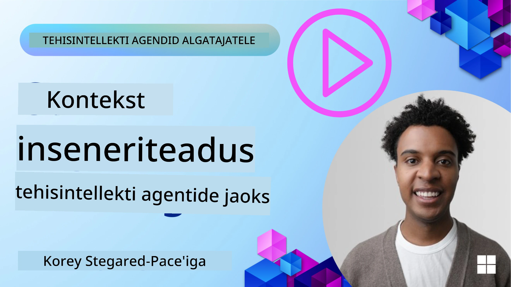
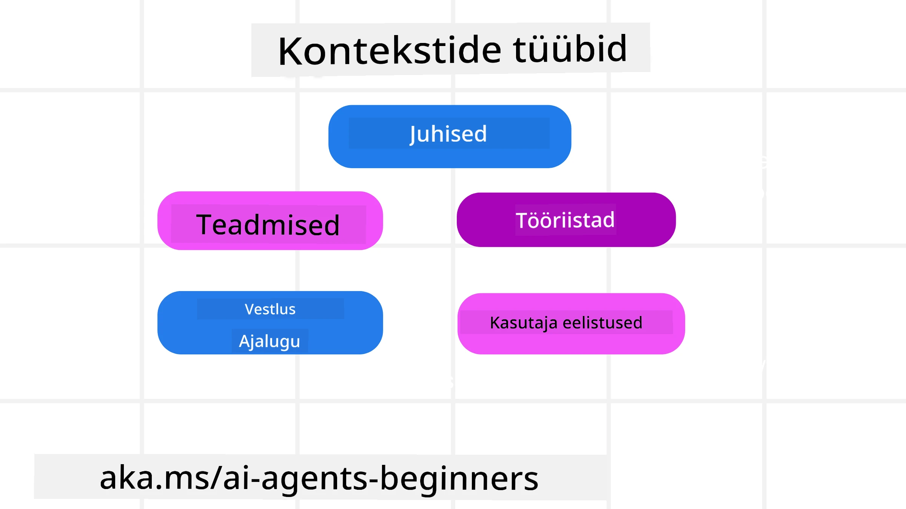
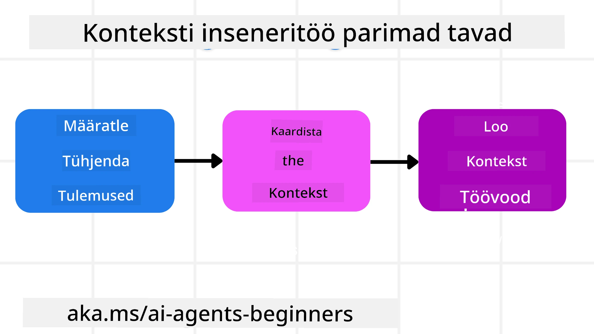

# Konteksti insenerteadus tehisintellekti agentide jaoks

> _(Klõpsa ülaloleval pildil selle õppetunni video vaatamiseks)_

Tehisintellekti agendi ehitatava rakenduse keerukuse mõistmine on oluline usaldusväärse agenti loomisel. Me peame ehitama AI agente, kes tõhusalt haldavad informatsiooni, et lahendada keerukaid vajadusi, mis ületavad lihtsalt promptide loomist.

Selles õppetunnis vaatleme, mis on konteksti insenerteadus ja selle roll AI agentide loomisel.

## Sissejuhatus

Selles õppetunnis käsitleme:

• **Mis on konteksti insenerteadus** ja miks see erineb promptide insenerteadusest.

• **Tõhusad strateegiad konteksti insenerteaduseks**, sh kuidas kirjutada, valida, tihendada ja isoleerida informatsiooni.

• **Levinud konteksti ebaõnnestumised**, mis võivad AI agenti takistada, ja nende parandamise võimalused.

## Õpieesmärgid

Pärast selle õppetunni lõpetamist oskad:

• **Määratleda konteksti insenerteadus** ja eristada seda promptide insenerteadusest.

• **Tuvastada peamised konteksti komponendid** suurte keelemudelite (LLM) rakendustes.

• **Rakendada strateegiaid konteksti kirjutamiseks, valimiseks, tihendamiseks ja isoleerimiseks**, et parandada agendi jõudlust.

• **Tunda ära tavalisi konteksti tõrkeid** nagu mürgitamine, tähelepanu hajumine, segadus ja vastuolu ning kasutada leevendusmeetodeid.

## Mis on konteksti insenerteadus?

AI agentide jaoks ajendab kontekst AI agendi kavandamist tegema kindlaid tegevusi. Konteksti insenerteadus on praktika, et tagada AI agendil õige info järgmise ülesande sammu täitmiseks. Kontekstiaken on piiratud suurusega, seega peame agendiehitajatena looma süsteeme ja protsesse, mis haldavad teabe lisamist, eemaldamist ja kokkusurumist kontekstiaknas.

### Promptide insenerteadus vs konteksti insenerteadus

Promptide insenerteadus keskendub ühele staatilisele juhiste komplektile, et tõhusalt suunata AI agente reeglite abil. Konteksti insenerteadus haldab dünaamilist informatsioonikomplekti, sh algset promti, tagamaks, et AI agentil on aja jooksul vajalik info olemas. Peamine idee konteksti insenerteaduses on selle protsessi korratavus ja usaldusväärsus.

### Konteksti liigid

Oluline on meeles pidada, et kontekst ei ole ainult üks asi. AI agendi vajaminev info võib pärineda mitmesugustest allikatest ja meie ülesanne on tagada agendi juurdepääs neile allikatele:

Konteksti liigid, mida AI agent võib vajada:

• **Juhised:** Need on nagu agendi "reeglid" – promptid, süsteemisõnumid, vähesed näited (mis näitavad AI-le, kuidas midagi teha), ja tööriistade kirjelduse, mida ta kasutada saab. Siin kohtuvad promptide ja konteksti insenerteadus.

• **Teadmised:** Faktid, andmebaasidest pärinev info või agendi kogutud pikaajalised mälestused. See hõlmab ka RAG (Retrieval Augmented Generation) süsteemi integreerimist, kui agent vajab ligipääsu erinevatele teadmiste hoidlatele ja andmebaasidele.

• **Tööriistad:** Väliste funktsioonide, API-de ja MCP serverite definitsioonid, mida agent saab kutsuda, koos tagasisidega (tulemused), mille ta nende kasutamisest saab.

• **Vestluste ajalugu:** Käimasolev dialoog kasutajaga. Aja möödudes muutuvad need vestlused pikemaks ja keerulisemaks ning võtavad konteksti aknas ruumi.

• **Kasutaja eelistused:** Informatsioon kasutaja eelistustest või mitte-meeldimistest aja jooksul. Neid võib talletada ja kasutada otsuste tegemisel, et kasutajat aidata.

## Tõhusate konteksti insenerteaduse strateegiad

### Planeerimisstrateegiad

Hea konteksti insenerteadus algab heast planeerimisest. Siin on lähenemine, mis aitab alustada mõtlemist konteksti insenerteaduse rakendamisest:

1. **Määra selged tulemused** – Tegevuste tulemused, mida AI agentidele määratakse, peaksid olema selgelt määratletud. Vastake küsimusele: "Milline maailm välja näeb, kui AI agent oma ülesande lõpetab?" Teisisõnu, milline muudatus, info või vastus peaks kasutajal olema pärast interaktsiooni AI agentiga.
2. **Kaardista kontekst** – Kui oled tulemused määratlenud, pead vastama küsimusele "Millist informatsiooni AI agent vajab, et selle ülesande täita?" Nii saad hakata kaardistama, kust see info leitav on.
3. **Loo konteksti torujuhtmed** – Nüüd, kui tead, kust info pärineb, pead vastama küsimusele: "Kuidas agent selle info saab?" Seda saab teha mitmel moel, sh RAG kasutamine, MCP serverid ja muud tööriistad.

### Praktilised strateegiad

Planeerimine on oluline, kuid kui info hakkab agendi kontekstiaknast voolama, vajad praktilisi strateegiaid selle haldamiseks:

#### Konteksti haldamine

Kuigi osa info lisatakse konteksti aknasse automaatselt, seisneb konteksti insenerteadus selles, et võtta sellest infost aktiivsem osa, mida saab teha mitme strateegiaga:

1. **Agendi märkmeleht**  
See võimaldab AI agendil teha märkmeid asjakohase info kohta praeguse sessiooni ülesannete ja kasutaja interaktsioonide kohta. See peaks paiknema konteksti aknast väljaspool failis või tööaja objektis, mida agent saaks vajadusel sellel sessioonil hiljem kasutada.

2. **Mälud**  
Märkmelehed on head ühe sessiooni konteksti aknast väljaspool info haldamiseks. Mälud võimaldavad agentidel salvestada ja taastada asjakohast infot mitme sessiooni jooksul. See võib hõlmata kokkuvõtteid, kasutaja eelistusi ja tagasisidet tulevikus paranduste tegemiseks.

3. **Konteksti tihendamine**  
Kui kontekstiaken kasvab ja läheneb piirile, saab kasutada tehnikaid nagu kokkuvõtete tegemine ja kärpimine. See tähendab kas hoida ainult kõige olulisemat infot või eemaldada vanemaid sõnumeid.

4. **Mitme agendi süsteemid**  
Mitme agendi süsteemi arendamine on konteksti insenerteaduse vorm, sest iga agendil on oma kontekstiaken. Kuidas seda konteksti jagada ja edasi anda erinevatele agentidele, on veel üks asi, mida tuleb nende süsteemide loomisel planeerida.

5. **Liivakasti keskkonnad**  
Kui agent peab käivitama koodi või töötlema suurt hulka infot dokumendis, võib see võtta palju token’eid tulemuste töötlemiseks. Selle asemel, et hoida seda kogu infot konteksti aknas, võib agent kasutada liivakasti keskkonda, mis suudab selle koodi käivitada ja lugeda ainult tulemusi ning muud asjakohast infot.

6. **Tööaja oleku objektid**  
See toimub info konteinerite loomisega, et hallata olukordi, kus agent peab teatud infole ligi pääsema. Keeruka ülesande puhul võimaldab see agentidel salvestada iga alamosa samm-sammult tulemusi, võimaldades kontekstil jätkuvalt olla seotud ainult selle konkreetse alamosaga.

#### Konteksti kontrollimine

Pärast ühe sellise strateegia rakendamist on kasulik kontrollida, mida järgmine mudelikõne tegelikult sai. Kasulik silumiseks küsimus on:

> Kas agent laadis liiga palju konteksti, vale konteksti või jäi vajaliku konteksti puudus?

Selle küsimuse jaoks ei pea logima tooreid promte, tööriistade väljundeid ega mälusisu. Tootmises eelistada väikseid konteksti kontrolli kirjeid, mis salvestavad arved, id-d, räsi ja poliitikamärgiseid:

- **Valik:** Jälgi, kui palju kandidaatosalõike, tööriistu või mälusid kaaluti, mitu neist valiti ja milline reegel või skoor põhjustas teised filtreerimise.
- **Tihendamine:** Salvestada allika ulatus või jälitus-id, kokkuvõtte id, hinnanguline tokenite arv enne ja pärast tihendamist ning kas toores sisaldus oli järgmise kõne jaoks välja jäetud.
- **Isolatsioon:** Märgi, milline alamosa jookse eraldi agendis, sessioonis või liivakastis, milline piiratud kokkuvõte tagastati ja kas suured tööriista väljundid jäid emotsiooni kontekstist välja.
- **Mälud ja RAG:** Salvestada otsitud dokumentide id-d, mälude id-d, skoorid, valitud id-d ja tsenseerimise olek täisteksti asemel.
- **Turvalisus ja privaatsus:** Eelistada räsi, id-sid, tokenite mahuteid ja poliitikamärgiseid tundlike promptide, tööriista argumentide, tulemuste või kasutaja mälusisude asemel.

Eesmärk ei ole hoida rohkem konteksti, vaid jätta piisavalt tõendeid, et arendaja saaks öelda, milline konteksti strateegia toimus ja kas see mõjutas järgmise mudelikõnet soovitud moel.

### Näide konteksti insenerteadusest

Oletame, et tahame AI agendi, kes **"Broneerib mulle reisi Pariisi."**

• Lihtne agent, kes kasutab ainult promptide insenerteadust, vastaks lihtsalt: **"Olgu, millal soovite Pariisi minna?**". See töötles ainult teie otsest küsimust hetkel, kui kasutaja seda esitas.

• Agent, kes kasutab siin käsitletud konteksti insenerteaduse strateegiaid, teeb palju rohkem. Enne vastamist võib tema süsteem:

  ◦ **Kontrollida sinu kalendrit** vabad kuupäevad (taasesitus reaalajas).

 ◦ **Mälestada varasemaid reisieelistusi** (pikaajaline mälu), nagu eelistatud lennufirma, eelarve või kas eelistad otse lende.

 ◦ **Tuua välja saadaolevad tööriistad** lennu- ja hotellikinnituseks.

- Siis võiks näidisvastus olla: "Hei [Sinu nimi]! Näen, et oled vaba oktoobri esimesel nädalal. Kas ma otsin otse lende Pariisi [Eelistatud lennufirma] piires sinu tavapärases eelarves [Eelarve]?" See rikkalik, konteksti teadvustav vastus demonstreerib konteksti insenerteaduse jõudu.

## Levinud konteksti ebaõnnestumised

### Konteksti mürgitamine

**Mis see on:** Kui hallutsinatsioon (valet informatsiooni genereerib LLM) või viga satub konteksti ja sellele viidatakse korduvalt, põhjustades agendi võimatute eesmärkide jälitamist või mõttetuid strateegiaid.

**Mida teha:** Rakenda **konteksti valideerimine** ja **karantiin**. Kontrolli infot enne selle lisamist pikaajalisse mällu. Kui tuvastatakse võimalik mürgitamine, alusta uusi konteksti lõimesid, et takistada halva info levikut.

**Reisibroneerimise näide:** Sinu agent hallutsineerib **otse lendu väiksemaa kohaliku lennujaama ja kauge rahvusvahelise linna vahel**, mida tegelikult rahvusvahelised lennud ei paku. See mitteolev lennu info salvestatakse konteksti. Hiljem, kui palud agendil broneerida, üritab ta ikka ja jälle neid pileteid sellel võimatul marsruudil leida, mis põhjustab korduvaid tõrkeid.

**Lahendus:** Rakenda samm, mis **valideerib lennu olemasolu ja marsruudid reaalajas API abil** _enne_ lennu info lisamist agendi töötavasse konteksti. Kui valideerimine ebaõnnestub, pannakse valeinfo "karantiini" ja seda ei kasutata edasi.

### Konteksti tähelepanu hajumine

**Mis see on:** Kui kontekst muutub nii suureks, et mudel keskendub liiga palju kogunenud ajaloole, mitte koolitusel õpitud infole, mis viib korduvate või ebaotstarbekate tegevusteni. Mudelid võivad tegema hakata vigu isegi enne kontekstiakna täitumist.

**Mida teha:** Kasuta **konteksti kokkuvõtete tegemist**. Aeg-ajalt tihenda kogunenud info lühemateks kokkuvõteteks, hoides olulised detailid, eemaldades üleliigse ajaloo. See aitab "taastada" keskendumist.

**Reisibroneerimise näide:** Oled pikalt arutanud erinevaid unistuste reisisihtkohti, sealhulgas üksikasjalikku tagasivaadet oma matkareisile kaks aastat tagasi. Kui sa lõpuks küsid **"Leia mulle odav lend järgmise kuu jaoks,"** siis agent jääb kinni vanadesse, asjakohatutesse detailidesse ning küsib jätkuvalt su seljakotireisivarustuse või varasemate marsruutide kohta, unustades su praeguse taotluse.

**Lahendus:** Pärast kindlat ringide arvu või kui kontekst muutub liiga suureks, peaks agent **kokku võtma viimased ja asjakohasemad vestlusosad** – keskendudes su praegustele reisikuupäevadele ja sihtkohale – ning kasutama seda kokkusurutud kokkuvõtet järgmise LLM kõne jaoks, jättes vähem asjakohase ajaloolise vestluse kõrvale.

### Konteksti segadus

**Mis see on:** Kui liigne kontekst, sageli liiga paljude saadaolevate tööriistade näol, põhjustab mudeli halbu vastuseid või kutsub esile ebaolulisi tööriistu. Väiksemad mudelid on eriti sellele vastuvõtlikud.

**Mida teha:** Rakenda **tööriistade laadihaldusega** RAG tehnikaid. Salvesta tööriistade kirjeldused vektorandmebaasi ning vali _ainult_ kõige asjakohasemad tööriistad konkreetse ülesande jaoks. Uuringud näitavad, et tööriistade arvu piiramine alla 30 on soovitatav.

**Reisibroneerimise näide:** Su agendil on juurdepääs kümnetele tööriistadele: `book_flight`, `book_hotel`, `rent_car`, `find_tours`, `currency_converter`, `weather_forecast`, `restaurant_reservations` jpt. Sa küsid: **"Mis on parim viis Pariisis ringiliikumiseks?"** Tööriistade tohutu hulgaga segaduses agent proovib kutsuda `book_flight` _Pariisis sees_ või `rent_car` hoolimata sellest, et eelistad ühistransporti, sest tööriistade kirjeldused võivad kattuda või ta lihtsalt ei suuda parimat eristada.

**Lahendus:** Kasuta **RAG tööriistade kirjelduste üle**. Kui sa küsid Pariisis ringiliikumisest, toob süsteem dünaamiliselt välja _ainult_ asjakohasemad tööriistad, nagu `rent_car` või `public_transport_info` vastavalt su päringule, esitades LLM-ile keskendunud tööriistade komplekti.

### Konteksti vastuolu

**Mis see on:** Kui konteksti sees on vastuolulist infot, mis viib ebajärjekindla mõtlemiseni või halbade lõpptulemusteni. See juhtub sageli, kui info jõuab mitmes faasis ja varasemad valeeeldused jäävad konteksti.

**Mida teha:** Kasuta **konteksti kärpimist** ja **mahalaadimist**. Kärpimine tähendab aegunud või vastuolulise info eemaldamist uute detailide saabudes. Mahalaadimine annab mudelile eraldi "märkmik" ruumi info töötlemiseks ilma põhikonteksti segamata.
**Reisibroneerimise näide:** Alguses ütlete oma agendile: **„Ma tahan lennata majandusklassis.“** Hiljem vestluses muudate meelt ja ütlete: **„Tegelikult, selle reisi jaoks valime äriklassi.“** Kui mõlemad juhised kontekstis alles jäävad, võib agent saada vastuolulisi otsingutulemusi või segadusse sattuda, millist eelistust eelistada.

**Lahendus:** Rakendage **konteksti kärpimist**. Kui uus juhis on vana vastuolus, eemaldatakse vanem juhis või antakse see kontekstis selgelt üle. Teise võimalusena võib agent kasutada **märkmeteraamatut**, et lahendada vastuolulisi eelistusi enne otsuse tegemist, tagades, et ainult lõplik ja ühtne juhis juhib tema tegevust.

## Kas sul on kontekstiinseneri kohta veel küsimusi?

Liitu [Microsoft Foundry Discord](https://aka.ms/ai-agents/discord) kogukonnaga ning kohtuge teiste õppuritega, osalege konsultatsioonitundides ja saate vastused oma AI agentide küsimustele.

---

<!-- CO-OP TRANSLATOR DISCLAIMER START -->
**Lahtiütlus**:
See dokument on tõlgitud kasutades AI tõlketeenust [Co-op Translator](https://github.com/Azure/co-op-translator). Kuigi me püüdleme täpsuse poole, palun pange tähele, et automatiseeritud tõlgetes võib esineda vigu või ebatäpsusi. Originaaldokument selle emakeeles tuleks pidada autoriteetseks allikaks. Olulise teabe puhul soovitatakse kasutada professionaalset inimtõlget. Me ei vastuta selle tõlkega seotud eksimustest või valesti mõistmistest.
<!-- CO-OP TRANSLATOR DISCLAIMER END -->