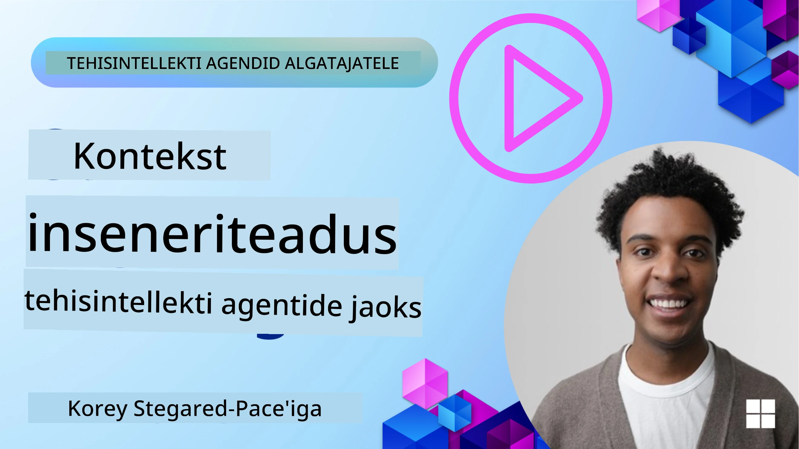
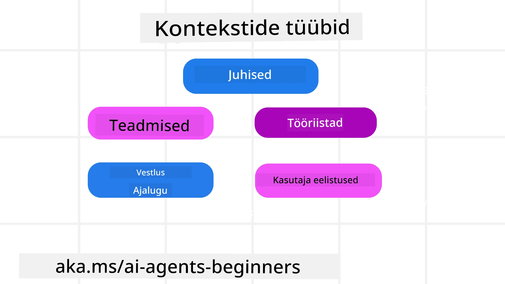
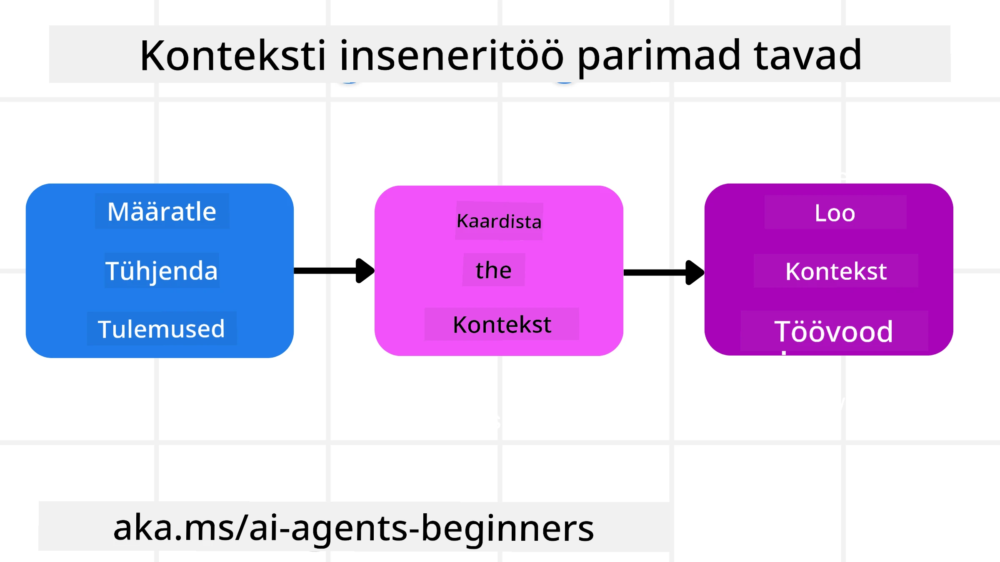

# Konteksti insenerteadus tehisintellekti agentide jaoks

> _(Klõpsa ülaloleval pildil, et vaadata selle tunni videot)_

On oluline mõista rakenduse keerukust, mille jaoks tehisintellekti agenti ehitad, et luua usaldusväärne agent. Me peame looma tehisintellekti agente, kes tõhusalt haldavad teavet keeruliste vajaduste rahuldamiseks, mis ulatuvad kaugemale pelgalt promptide insenerteadusest.

Selles õppetükis vaatleme, mis on konteksti insenerteadus ja milline on selle roll tehisintellekti agentide loomisel.

## Sissejuhatus

Selles tunnis käsitleme:

• **Mis on konteksti insenerteadus** ja miks see erineb promptide insenerteadusest.

• **Tõhusad strateegiad konteksti insenerteaduseks**, sealhulgas kuidas kirjutada, valida, tihendada ja isoleerida teavet.

• **Levinud konteksti vead**, mis võivad tehisintellekti agenti takistada, ja kuidas neid parandada.

## Õpieesmärgid

Selle tunni lõpetamisel saad teada, kuidas:

• **Määratleda konteksti insenerteadus** ja eristada seda promptide insenerteadusest.

• **Tuvastada peamised konteksti komponendid** suure keelelise mudeli (LLM) rakendustes.

• **Rakendada strateegiaid konteksti kirjutamiseks, valimiseks, tihendamiseks ja isoleerimiseks**, et parandada agendi toimivust.

• **Tuvastada levinud konteksti vead** nagu mürgitamine, tähelepanu hajumine, segadus ja konflikt ning rakendada leevendusmeetodeid.

## Mis on konteksti insenerteadus?

Tehisintellekti agentide puhul on kontekst see, mis juhib agendi tegevuste planeerimist. Konteksti insenerteadus on praktika, mis tagab, et tehisintellekti agendil on õige teave ülesande järgmise sammu lõpuleviimiseks. Konteksti aken on piiratud suurusega, seega peame agentide loojatena välja töötama süsteemid ja protsessid, et hallata teabe lisamist, eemaldamist ja kokkusurumist konteksti aknas.

### Promptide insenerteadus vs konteksti insenerteadus

Promptide insenerteadus keskendub ühele staatilisele juhiste kogumile, mis juhib agenti tõhusalt kindlate reeglite abil. Konteksti insenerteadus on see, kuidas hallata dünaamilist teabe hulka, sealhulgas algset prompti, et tagada, et agentil on kogu aeg vajalik info. Peamine idee on muuta see protsess korduvaks ja usaldusväärseks.

### Konteksti liigid

On oluline meeles pidada, et kontekst ei ole vaid üks asi. Teave, mida tehisintellekti agent vajab, võib pärineda mitmetest erinevatest allikatest ja meie ülesanne on tagada, et agent pääseb neile allikatele ligi:

Konteksti tüübid, mida tehisintellekti agent peab haldama, hõlmavad:

• **Juhised:** Need on nagu agendi "reeglid" – promptid, süsteemseteated, vähese näidisega näited (näitamaks, kuidas midagi teha), ja tööriistade kirjeldused, mida ta saab kasutada. Siin ühendub promptide insenerteadus konteksti insenerteadusega.

• **Teadmised:** Siia kuuluvad faktid, andmed, mis on saadud andmebaasidest, või agendi pikaajalised mälestused. See hõlmab ka Retrieval Augmented Generation (RAG) süsteemi integreerimist, kui agendil on vaja ligi erinevatele teadmistehoidlatele ja andmebaasidele.

• **Tööriistad:** Need on väliste funktsioonide, API-de ja MCP-serverite definitsioonid, mida agent saab kasutada, koos tagasisidega (tulemustega), mida ta nende kasutamisest saab.

• **Vestluse ajalugu:** Jooksev dialoog kasutajaga. Aja möödudes muutuvad need vestlused pikemaks ja keerulisemaks, mis tähendab, et need võtavad ruumi konteksti aknas.

• **Kasutaja eelistused:** Info kasutaja meeldimiste või mitteniimete kohta aja jooksul. Neid võidakse salvestada ja kasutada oluliste otsuste tegemisel kasutaja abistamiseks.

## Tõhusa konteksti insenerteaduse strateegiad

### Planeerimisstrateegiad

Hea konteksti insenerteadus algab heast planeerimisest. Siin on üks lähenemisviis, mis aitab sul hakata mõtlema, kuidas konteksti insenerteaduse kontseptsiooni rakendada:

1. **Määra selged tulemused** – ülesannete tulemused, mida AI agentidele määratakse, peaksid olema selgelt määratletud. Vastake küsimusele – „Kuidas maailm näeb välja, kui AI agent on oma ülesandega lõpetanud?“ Teisisõnu, milline muutus, info või vastus peaks kasutajal olema pärast suhtlemist AI agendiga.
2. **Konteksti kaardistamine** – Kui oled määratlenud AI agendi tulemused, tuleb vastata küsimusele „Millist teavet AI agent vajab selle ülesande täitmiseks?“. Nii saad hakata kaardistama, kust see info leitav on.
3. **Loo konteksti torujuhtmed** – Nüüd, kui tead, kust info tuleb, tuleb vastata küsimusele „Kuidas agent selle info saab?“. Seda saab teha mitmel viisil, sealhulgas RAG, MCP serverite ja teiste tööriistade abil.

### Praktilised strateegiad

Planeerimine on oluline, kuid kui info hakkab voolama meie agendi konteksti aknasse, vajame praktilisi strateegiaid selle haldamiseks:

#### Konteksti haldamine

Kuigi osa teabest lisatakse konteksti aknasse automaatselt, seisneb konteksti insenerteadus selles, et võtta see info aktiivsemalt juhtimise alla, mida saab teha mitmete strateegiate abil:

 1. **Agendi märkmik**
 See võimaldab AI agendil teha märkmeid praeguse ülesande ja kasutajategevuste kohta ühe sessiooni jooksul. See peaks asuma väljaspool konteksti akent failis või jooksva objektina, mille agent võib selle sessiooni jooksul hiljem vajadusel üles otsida.

 2. **Mälud**
 Märkmikud sobivad ühe seansi konteksti akna välise info haldamiseks. Mälud võimaldavad agentidel salvestada ja taastada asjakohast teavet mitme seansi jooksul. See võib sisaldada kokkuvõtteid, kasutaja eelistusi ja tagasisidet tulevaste parenduste tarbeks.

 3. **Konteksti tihendamine**
  Kui konteksti aken kasvab ja hakkab piiri lähedale jõudma, saab kasutada selliseid tehnikaid nagu kokkuvõtete tegemine ja kärpimine. See tähendab kas ainult kõige olulisema info hoidmist või vanemate sõnumite eemaldamist.
  
 4. **Mitraagentide süsteemid**
  Mitraagentide süsteemi väljatöötamine on konteksti insenerteaduse vorm, sest igal agendil on oma kontekstiaken. Kuidas see kontekst jagatakse ja edastatakse erinevatele agentidele, on samuti planeerimise küsimus nende süsteemide loomisel.
  
 5. **Turvalised keskkonnad**
  Kui agent peab käivitama koodi või töötlema suures mahus dokumentaalset infot, võib see nõuda palju token'eid tulemuste töötlemiseks. Selle asemel, et seda kõike hoida konteksti aknas, saab agent kasutada turvalist (sandbox) keskkonda, mis suudab koodi käivitada ja lugeda ainult tulemusi ja muud asjakohast infot.
  
 6. **Jooksuaja oleku objektid**
   Seda tehakse teabe konteinerite loomisega, et hallata olukordi, kus agent peab teatud infole ligi pääsema. Keerulise ülesande korral võimaldab see agendil samm-sammult salvestada iga alammomendi tulemused, hoides konteksti seotud ainult konkreetse alammomendiga.

#### Konteksti kontrollimine

Pärast ühe nende strateegiate rakendamist tasub kontrollida, mida järgmine mudelikõne tegelikult sai. Kasulik silumise küsimus on:

> Kas agent laadis liiga palju konteksti, vale konteksti või jäi vajaliku konteksti vahele?

Sellele küsimusele vastamiseks ei pea logima tooreid prompt'e, tööriistade väljundeid ega mälusisusid. Tootmises eelista väikseid kontekstiinspektiooni kirjeid, mis salvestavad arvu, ID-sid, räsi ja poliitikamärke:

- **Valik:** Jälgi, mitu kandidaattükki, tööriista või mälu arvestati, mitu neist valiti ja milline reegel või skoor põhjustas ülejäänute filtreerimise.
- **Tihendamine:** Salvesta algallika vahemik või jälitus-ID, kokkuvõtte ID, hinnanguline tokenite arv enne ja pärast tihendamist ning kas tooraine sisu jäi järgmise kõne juurest välja.
- **Isoleerimine:** Märgi, milline alamtöö jooksis eraldi agendis, sessioonis või turvalises keskkonnas, milline piiratud kokkuvõte tagastati ja kas suur tööriista väljund jäi vanema agendi konteksti aknast välja.
- **Mälu ja RAG:** Salvesta taaste dokumentide ID-d, mälude ID-d, skoorid, valitud ID-d ja redigeerimisstaatus täisteksti asemel.
- **Ohutus ja privaatsus:** Eelista räside, ID-de, tokenite kottide ja poliitikamärkide kasutamist tundlike promptide teksti, tööriista argumentide, tööriista tulemuste või kasutaja mälude sisu asemel.

Eesmärk ei ole hoida rohkem konteksti, vaid jätta piisavalt tõendeid, et arendaja saaks öelda, milline konteksti strateegia rakendus ja kas see muutis järgmist mudelikõnet kavandatud viisil.

### Näide konteksti insenerteadusest

Oletame, et me tahame, et AI agent **„Broneeriks mulle reisi Pariisi.“**

• Lihtne agent, kes kasutab ainult promptide insenerteadust, vastab lihtsalt: **„Okei, millal soovid Pariisi minna?“** Ta töödeldas ainult sinu otsest küsimust sel hetkel, kui kasutaja selle esitas.

• Agent, kes kasutab eespool käsitletud konteksti insenerteaduse strateegiaid, teeb palju enamat. Enne kui ta vastab, võib tema süsteem:

  ◦ **Kontrollida sinu kalendrit** saadaolevate kuupäevade kohta (reaalajas andmete päring).

 ◦ **Meeleolustada varasemaid reisieelistusi** (pikaajaline mälu), näiteks sinu eelistatud lennufirma, eelarve või kas eelistad otselende.

 ◦ **Tuvastada saadaval olevaid tööriistu** lennupiletite ja hotellibroneeringute jaoks.

- Seejärel võiks vastus olla näiteks: „Hei [Sinu nimi]! Näen, et oled vaba oktoobri esimese nädalaga. Kas otsin otselende Pariisi [Eelistatud lennufirmaga] tavapärases [Eelarve] raamistikus?“ See rikkalikult kontekstitundlik vastus demonstreerib konteksti insenerteaduse võimsust.

## Levinud konteksti vead

### Konteksti mürgitamine

**Mida see tähendab:** Kui hallutsinatsioon (LLM poolt genereeritud valeteave) või viga satub konteksti ja sellele viidatakse korduvalt, mis paneb agendi püüdlema võimatute eesmärkide poole või välja töötama mõttetuid strateegiaid.

**Mida teha:** Rakenda **konteksti valideerimine** ja **karantiin**. Kontrolli infot enne selle lisamist pikaajalisse mällu. Kui kahtlustatakse mürgitamist, alusta uusi kontekstitöötlustränge, et takistada halva info levikut.

**Näide reisibroneeringust:** Sinu agent hallutsineerib **otse lendu väikesest kohalikust lennujaamast kaugele rahvusvahelisse linna**, mis tegelikult rahvusvahelisi lende ei paku. See olematu lennuinfo salvestatakse konteksti. Hiljem, kui küsid agentilt broneeringut, püüab ta korduvalt leida pileteid sellele võimatule marsruudile, põhjustades korduvaid vigu.

**Lahendus:** Rakenda samm, mis **valideerib lennu olemasolu ja marsruute reaalaegse API abil** _enne_ lennuinfo lisamist agendi töötavasse konteksti. Kui valideerimine ebaõnnestub, pannakse valeinfo karantiini ega kasutata enam.

### Konteksti tähelepanu hajumine

**Mida see tähendab:** Kui kontekst kasvab nii suureks, et mudel keskendub liiga palju kogutud ajaloole, selle asemel et kasutada treeningu ajal omandatud teadmisi, mis viib korduvate või ebavajalike tegevusteni. Mudelid võivad hakata vigu tegemas isegi enne, kui kontekstiaken on täis.

**Mida teha:** Kasuta **konteksti kokkuvõtete tegemist**. Ajapikku tihenda kogutud teave lühemate kokkuvõtetena, hoides olulisi detaile ja eemaldades liigse ajaloo. See aitab „nullida“ mudeli fookuse.

**Näide reisibroneeringust:** Olete pikka aega arutanud erinevaid unistuste reisisihtkohti, kaasa arvatud põhjalik ülevaade sinu kahe aasta tagusest seljakotireisist. Kui lõpuks küsid: **„Leia mulle odav lend järgmise kuu jaoks“**, jääb agent kinni vanadesse ebaolulistesse detailidesse ja küsib jätkuvalt sinu seljakoti varustuse või varasemate reisiplaanide kohta, unustades sinu praeguse taotluse.

**Lahendus:** Pärast teatud arvu vahetusi või konteksti liiga suureks muutumisel peaks agent **kokku võtma vestluse kõige värskemad ja asjakohasemad osad** – keskendudes sinu praegustele reisiandmetele ja sihtkohale – ning kasutama seda kokkusurutud kokkuvõtet järgmise LLM kõne jaoks, visates vähem olulise ajaloolise vestluse ära.

### Konteksti segadus

**Mida see tähendab:** Kui mittevajalik kontekst, sageli liiga paljude saadaval olevate tööriistade näol, paneb mudeli genereerima halbu vastuseid või kutsuma välja ebaolulisi tööriistu. Väiksemad mudelid on selle suhtes eriti vastuvõtlikud.

**Mida teha:** Rakenda **tööriistade valiku juhtimist** RAG tehnikate abil. Salvesta tööriistade kirjeldused vektorandmebaasi ja vali _ainult_ kõige asjakohasemad tööriistad konkreetse ülesande jaoks. Uuringud näitavad, et tööriistade arvu tuleks piirata alla 30.

**Näide reisibroneeringust:** Sinu agent pääseb ligi kümnetele tööriistadele: `book_flight`, `book_hotel`, `rent_car`, `find_tours`, `currency_converter`, `weather_forecast`, `restaurant_reservations` jne. Küsimus on: **„Mis on parim viis Pariisis ringi liikumiseks?“** Tööriistade arv paneb agendi segadusse ja ta püüab kutsuda `book_flight` _Pariisi sees_, või `rent_car` kuigi eelistad ühistransporti, sest tööriistade kirjeldused võivad kattuda või agent ei oska valida kõige sobivamat.

**Lahendus:** Kasuta **RAG-i tööriistade kirjelduste põhjal**. Kui küsid Pariisis ringiliikumise kohta, otsib süsteem dünaamiliselt _ainult_ kõige asjakohasemaid tööriistu nagu `rent_car` või `public_transport_info` vastavalt sinu päringule, pakkudes LLM-ile keskendunud tööriistade komplekti.

### Konteksti konflikt

**Mida see tähendab:** Kui kontekstis on vastuoluline info, mis viib ebajärjekindla loogika või halbade lõplike vastusteni. See juhtub sageli siis, kui info tuleb osade kaupa ja varased valed oletused jäävad konteksti.

**Mida teha:** Kasuta **konteksti kärpimist** ja **väljaladustamist**. Kärpimine tähendab aegunud või vastuolulise teabe eemaldamist uute detailide saabudes. Väljaladustamine annab mudelile eraldi "märkmiku" tööruumi info töötlemiseks ilma peamist konteksti akent täitmata.

**Reisibroneerimise näide:** Alguses ütlete oma agendile: **„Ma tahan lennata majandusklassis.“** Hiljem vestluse käigus muudate meelt ja ütlete: **„Tegelikult, selleks reisiks valime äriklassi.“** Kui mõlemad juhised jäävad konteksti, võib agent saada vastuolulisi otsingutulemusi või segadusse sattuda, millist eelistust eelistada.

**Lahendus:** Rakendada **konteksti kärpimist**. Kui uus juhis on vastuolus vana juhisega, eemaldatakse vanem juhis kontekstist või kirjutatakse see selgelt üle. Alternatiivselt võib agent kasutada **pliiatsipinki**, et leppida kokku vastuolulistes eelistustes enne otsuse tegemist, tagades, et ainult lõplik, järjepidev juhis juhib tema tegevusi.

## Kas sul on rohkem küsimusi konteksti inseneri kohta?

Liitu [Microsoft Foundry Discord](https://discord.com/invite/ATgtXmAS5D) kanaliga, et kohtuda teiste õppijatega, osaleda vastuvõtu aegadel ja saada vastused oma tehisintellekti agentide küsimustele.

---

<!-- CO-OP TRANSLATOR DISCLAIMER START -->
**Lahtiütlus**:
See dokument on tõlgitud kasutades AI tõlketeenust [Co-op Translator](https://github.com/Azure/co-op-translator). Kuigi me püüdleme täpsuse poole, palun pange tähele, et automatiseeritud tõlgetes võib esineda vigu või ebatäpsusi. Originaaldokument selle emakeeles tuleks pidada autoriteetseks allikaks. Olulise teabe puhul soovitatakse kasutada professionaalset inimtõlget. Me ei vastuta selle tõlkega seotud eksimustest või valesti mõistmistest.
<!-- CO-OP TRANSLATOR DISCLAIMER END -->