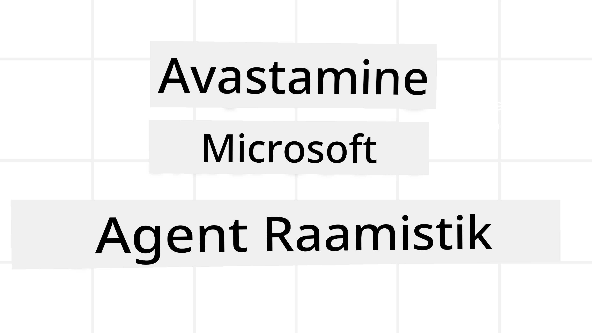
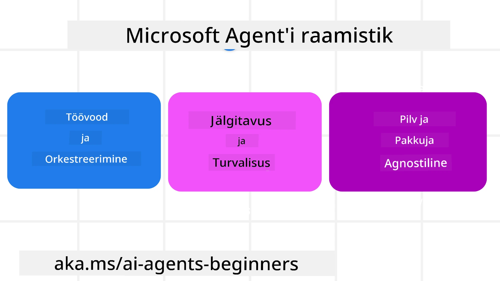
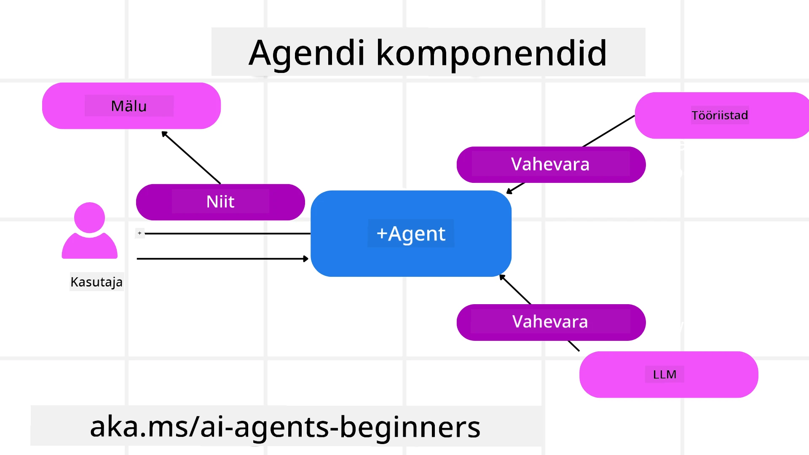

# Microsoft Agent Frameworki uurimine



### Sissejuhatus

See õppetund käsitleb:

- Microsoft Agent Frameworki mõistmine: peamised omadused ja väärtus  
- Microsoft Agent Frameworki põhikontseptide uurimine
- Täiustatud MAF mustrid: töövood, vahendustarkvara ja mälu

## Õpieesmärgid

Pärast selle õppetunni läbimist oskad sa:

- Ehita Microsoft Agent Frameworki abil tootmiseks valmis tehisintellekti agente
- Rakenda Microsoft Agent Frameworki põhifunktsioone oma agendi kasutusjuhtudel
- Kasuta täiustatud mustreid, sealhulgas töövooge, vahendustarkvara ja jälgitavust

## Koodinäited 

Koodinäited [Microsoft Agent Frameworki (MAF)](https://learn.microsoft.com/en-us/agent-framework/overview/?wt.mc_id=youtube_26688_organicsocial_reactor&pivots=programming-language-python) kohta on saadaval selles hoidlas failides `xx-python-agent-framework` ja `xx-dotnet-agent-framework`.

## Microsoft Agent Frameworki mõistmine



[Microsoft Agent Framework (MAF)](https://learn.microsoft.com/en-us/agent-framework/overview/?wt.mc_id=youtube_26688_organicsocial_reactor&pivots=programming-language-python) on Microsofti ühtne raamistik tehisintellekti agentide loomiseks. See pakub paindlikkust käsitleda laia valikut agentide kasutusjuhtumeid tootmise ja teadustöö keskkondades, sealhulgas:

- **Järjestikune agendi korraldus** olukordades, kus on vajalik samm-sammult töövoog.
- **Samaaegne korraldus** olukordades, kus agentidel tuleb ülesandeid samaaegselt täita.
- **Rühma vestluse korraldus** olukordades, kus agendid saavad töötada koos ühe ülesande kallal.
- **Ülesannete üleandmise korraldus** olukordades, kus agendid annavad ülesande omavahel üle, kui osülesanded on lõpetatud.
- **Magnetiline korraldus** olukordades, kus halduragent loob ja muudab ülesannete nimekirja ning koordineerib alltööagente ülesande täitmiseks.

Tootmises AI agentide pakkumiseks sisaldab MAF ka funktsioone:

- **Jälgitavus** OpenTelemetry kasutamise kaudu, kus iga AI agendi tegevus, sealhulgas tööriistakutsete, korralduslike sammude, põhjenduste ja jõudluse jälgimise kaudu Microsoft Foundry armatuurlaudadel, on jälgitav.
- **Turvalisus** majutades agentide loomulikult Microsoft Foundryl, mis sisaldab turvakontrolli nagu rollipõhine ligipääs, privaatsete andmete käsitlemine ja sisseehitatud sisuturvalisus.
- **Vastupidavus** kuna agendi lõimed ja töövood saavad pausida, jätkata ja taastuda vigadest, mis võimaldab pikemaajalist protsessi.
- **Juhtimine** kuna inimeste kaasamisega töövood on toetatud, kus ülesanded märgistatakse vajavatena inimkinnitust.

Microsoft Agent Framework keskendub ka koostalitlusvõimele, olles:

- **Pilve neutraalne** - agentidel on võimalik töötada konteinerites, kohapeal ja mitmetes erinevates pilvedes.
- **Tarnija neutraalne** - agendid saab luua sinu eelistatud SDK kaudu, sh Azure OpenAI ja OpenAI.
- **Avatud standardite integreerimine** - agendid saavad kasutada protokolle nagu Agent-to-Agent(A2A) ja Model Context Protocol (MCP) teiste agentide ja tööriistade avastamiseks ja kasutamiseks.
- **Pluginad ja ühendused** - saab luua ühendusi andmete ja mäluteenustega nagu Microsoft Fabric, SharePoint, Pinecone ja Qdrant.

Vaatame, kuidas neid funktsioone rakendatakse mõnedele Microsoft Agent Frameworki põhikontseptidele.

## Microsoft Agent Frameworki põhikontseptsioonid

### Agendid



**Agentide loomine**

Agendi loomine toimub määratledes tuletusteenus (LLM teenusepakkuja),  
juhiste kogum AI agendi järgimiseks ning määratud `name`:

```python
agent = AzureOpenAIChatClient(credential=AzureCliCredential()).create_agent( instructions="You are good at recommending trips to customers based on their preferences.", name="TripRecommender" )
```

Ülaltoodud kasutab `Azure OpenAI`, kuid agendid võivad luua erinevate teenuste abil, sh `Microsoft Foundry Agent Service`:

```python
AzureAIAgentClient(async_credential=credential).create_agent( name="HelperAgent", instructions="You are a helpful assistant." ) as agent
```

OpenAI `Responses`, `ChatCompletion` API-d

```python
agent = OpenAIResponsesClient().create_agent( name="WeatherBot", instructions="You are a helpful weather assistant.", )
```

```python
agent = OpenAIChatClient().create_agent( name="HelpfulAssistant", instructions="You are a helpful assistant.", )
```

või [MiniMax](https://platform.minimaxi.com/), mis pakub OpenAI ühilduvat API-d suurte kontekstakendega (kuni 204K tokenit):

```python
agent = OpenAIChatClient(base_url="https://api.minimax.io/v1", api_key=os.environ["MINIMAX_API_KEY"], model_id="MiniMax-M3").create_agent( name="HelpfulAssistant", instructions="You are a helpful assistant.", )
```

või kaugagente A2A protokolli kaudu:

```python
agent = A2AAgent( name=agent_card.name, description=agent_card.description, agent_card=agent_card, url="https://your-a2a-agent-host" )
```

**Agentide käivitamine**

Agendid käivitatakse `.run` või `.run_stream` meetoditega, kas mittevoogedastuse või voogedastuse vastuste saamiseks.

```python
result = await agent.run("What are good places to visit in Amsterdam?")
print(result.text)
```

```python
async for update in agent.run_stream("What are the good places to visit in Amsterdam?"):
    if update.text:
        print(update.text, end="", flush=True)

```

Iga agendi käivitamisel saab ka määrata valikuid nagu `max_tokens`, mida agent kasutab, `tools`, mida agent saab kutsuda, ja isegi `model`, mida agent kasutab.

See on kasulik juhtudel, kus konkreetseid mudeleid või tööriistu on vaja kasutaja ülesande täitmiseks.

**Tööriistad**

Tööriistu saab määratleda nii agendi loomisel:

```python
def get_attractions( location: Annotated[str, Field(description="The location to get the top tourist attractions for")], ) -> str: """Get the top tourist attractions for a given location.""" return f"The top attractions for {location} are." 


# Kui luuakse ChatAgenti otse

agent = ChatAgent( chat_client=OpenAIChatClient(), instructions="You are a helpful assistant", tools=[get_attractions]

```

ja ka agendi käivitamisel:

```python

result1 = await agent.run( "What's the best place to visit in Seattle?", tools=[get_attractions] # Tööriist, mis on mõeldud ainult selleks sõiduks )
```

**Agendi lõimed**

Agendi lõimesid kasutatakse mitme vooruga vestluste haldamiseks. Lõimesid saab luua:

- Kasutades `get_new_thread()`, mis võimaldab lõime aja jooksul salvestada
- Lõime automaatselt luues agendi käivitamisel ja lõime olemasolekut ainult praegusel käivitamisel.

Lõime loomise kood näeb välja selline:

```python
# Loo uus lõim.
thread = agent.get_new_thread() # Käivita agent lõimes.
response = await agent.run("Hello, I am here to help you book travel. Where would you like to go?", thread=thread)

```

Siis saab lõime seraliseerida ja hiljem kasutamiseks salvestada:

```python
# Loo uus lõim.
thread = agent.get_new_thread() 

# Käivita agent lõimedega.

response = await agent.run("Hello, how are you?", thread=thread) 

# Serialiseeri lõim salvestamiseks.

serialized_thread = await thread.serialize() 

# Deserialiseeri lõime olek pärast salvestist laadimist.

resumed_thread = await agent.deserialize_thread(serialized_thread)
```

**Agendi vahendustarkvara**

Agendid suhtlevad tööriistade ja LLM-idega, et täita kasutaja ülesandeid. Mõnes olukorras tahame täita või jälgida tegevusi nende suhtluste vahel. Agendi vahendustarkvara võimaldab seda läbi:

*Funktsioonide vahendustarkvara*

See võimaldab täita tegevust agendi ja funktsiooni/tööriista vahel, mida kutsutakse. Näiteks võib seda kasutada funktsioonikõnede logimiseks.

Alljärgnev koodis `next` määrab, kas kutsutakse järgmist vahendustarkvara või tegelikku funktsiooni.

```python
async def logging_function_middleware(
    context: FunctionInvocationContext,
    next: Callable[[FunctionInvocationContext], Awaitable[None]],
) -> None:
    """Function middleware that logs function execution."""
    # Eeltöötlus: logi enne funktsiooni käivitamist
    print(f"[Function] Calling {context.function.name}")

    # Jätka järgmise vahemehitaja või funktsiooni täitmisega
    await next(context)

    # Järel­töötlus: logi pärast funktsiooni käivitamist
    print(f"[Function] {context.function.name} completed")
```

*Vestluse vahendustarkvara*

See võimaldab täita või logida tegevust agendi ja LLM-i päringute vahel.

See sisaldab tähtsat infot, nagu `messages`, mis saadetakse tehisintellekti teenusele.

```python
async def logging_chat_middleware(
    context: ChatContext,
    next: Callable[[ChatContext], Awaitable[None]],
) -> None:
    """Chat middleware that logs AI interactions."""
    # Eeltöötlus: Logi enne AI kutsumist
    print(f"[Chat] Sending {len(context.messages)} messages to AI")

    # Jätka järgmise vahendustarkvara või AI teenusega
    await next(context)

    # Järelteostus: Logi pärast AI vastust
    print("[Chat] AI response received")

```

**Agendi mälu**

Nagu käsitleti õppetunnis `Agentic Memory`, on mälu oluline element võimaldamaks agenti töötada erinevates kontekstides. MAF pakub mitut tüüpi mälu:

*Mälu rakenduses*

See on mälu, mis salvestatakse lõimedes rakenduse ajal.

```python
# Loo uus niit.
thread = agent.get_new_thread() # Käivita agent koos niidiga.
response = await agent.run("Hello, I am here to help you book travel. Where would you like to go?", thread=thread)
```

*Püsivad sõnumid*

Seda mälu kasutatakse vestluse ajaloo salvestamiseks erinevate seansside vahel. Seda määratletakse kasutades `chat_message_store_factory`:

```python
from agent_framework import ChatMessageStore

# Loo kohandatud sõnumite pood
def create_message_store():
    return ChatMessageStore()

agent = ChatAgent(
    chat_client=OpenAIChatClient(),
    instructions="You are a Travel assistant.",
    chat_message_store_factory=create_message_store
)

```

*Dünaamiline mälu*

See mälu lisatakse konteksti enne agendi käivitamist. Neid mälu saab hoida ka välistes teenustes nagu mem0:

```python
from agent_framework.mem0 import Mem0Provider

# Mem0 kasutamine täiustatud mälufunktsioonide jaoks
memory_provider = Mem0Provider(
    api_key="your-mem0-api-key",
    user_id="user_123",
    application_id="my_app"
)

agent = ChatAgent(
    chat_client=OpenAIChatClient(),
    instructions="You are a helpful assistant with memory.",
    context_providers=memory_provider
)

```

**Agendi jälgitavus**

Jälgitavus on oluline usaldusväärsete ja hooldatavate agentide süsteemide ehitamiseks. MAF integreerub OpenTelemetryga, pakkudes jälgimist ja mõõdikuid parema jälgitavuse saavutamiseks.

```python
from agent_framework.observability import get_tracer, get_meter

tracer = get_tracer()
meter = get_meter()
with tracer.start_as_current_span("my_custom_span"):
    # tee midagi
    pass
counter = meter.create_counter("my_custom_counter")
counter.add(1, {"key": "value"})
```

### Töövood

MAF pakub töövooge, mis on eelmääratletud sammud ülesande täitmiseks ning hõlmavad AI agente nende sammude komponentidena.

Töövood koosnevad erinevatest komponentidest, mis võimaldavad paremat voolu juhtimist. Töövood võimaldavad ka **mitme agendi korraldust** ja **checkpointe** töövoole oleku salvestamiseks.

Töövoo põhikomponendid on:

**Täiturid**

Täiturid võtavad vastu sisendsõnumeid, täidavad määratud ülesandeid ja annavad väljundsõnumi, liikudes töövoos edasi suurema ülesande poole. Täiturid võivad olla AI agent või kohandatud loogika.

**Servad**

Servasid kasutatakse sõnumite voo määratlemiseks töövoos. Need võivad olla:

*Otsesed servad* - Lihtsad ühe-ühele ühendused täiturite vahel:

```python
from agent_framework import WorkflowBuilder

builder = WorkflowBuilder()
builder.add_edge(source_executor, target_executor)
builder.set_start_executor(source_executor)
workflow = builder.build()
```

*Tingimuslikud servad* - Aktiveeruvad, kui teatud tingimus on täidetud. Näiteks kui hotellitoad puuduvad, võib täitur soovitada muid võimalusi.

*Lüliti-servad* - Suunavad sõnumeid erinevatele täituritele määratletud tingimuste alusel. Näiteks kui reisiklient on prioriteediga, käsitletakse tema ülesandeid teises töövoos.

*Lahutatud servad* - Saadavad ühe sõnumi mitmele sihtmärgile.

*Kogutud servad* - Koguvad mitmeid sõnumeid erinevatelt täituritelt ja saadavad ühe sihtmärgile.

**Sündmused**

Parema jälgitavuse tagamiseks töövoogudes pakub MAF sisse ehitatud täitmise sündmusi, nagu:

- `WorkflowStartedEvent`  - Töövoo täitmine algab
- `WorkflowOutputEvent` - Töövoog genereerib väljundi
- `WorkflowErrorEvent` - Töövoog seisab silmitsi veaga
- `ExecutorInvokeEvent`  - Täitur alustab töötlemist
- `ExecutorCompleteEvent`  -  Täitur lõpetab töötlemise
- `RequestInfoEvent` - Päring on tehtud

## Täiustatud MAF mustrid

Eelnevad jaotised käsitlesid Microsoft Agent Frameworki põhikontseptsioone. Komplekssemate agentide loomisel tasub kaaluda järgmisi täiustatud mustreid:

- **Vahendustarkvara kokkupanek**: Ahelaid mitut vahendustarkvara käsitlejat (logimine, autentimine, kiirusepiirang) funktsiooni- ja vestluse vahendustarkvara abil, et saada peenhäälestatud kontroll agendi käitumise üle.
- **Töövoo checkpointe**: Kasutage töövoo sündmusi ja serialiseerimist pikaajaliste agentide protsesside salvestamiseks ja jätkamiseks.
- **Dünaamiline tööriista valik**: Kombineeri RAG tööriista kirjeldustega MAF tööriista registreeringuga, et pakkuda päringu kohta ainult asjakohaseid tööriistu.
- **Mitme agendi ülesande üleandmine**: Kasuta töövoo servi ja tingimuslikku marsruutimist spetsialiseerunud agentide vaheliseks ülesande üleandmiseks.

## LangChain / LangGraph agentide majutamine Microsoft Foundryl

Microsoft Agent Framework on **raamistiku-sõbralik** — sa ei ole piiratud ainult MAF-iga loodud agentidega. Kui sul on juba agent loodud **LangChain** või **LangGraph** abil, saad seda käivitada kui **Microsoft Foundry majutatud agenti**, kus Foundry haldab käitusaega, seansse, skaleerimist, identiteeti ja protokollide lõpp-punkte, samal ajal kui sinu agendi loogika jääb LangGraphi.

Selle saavutamiseks kasutatakse paketti `langchain_azure_ai.agents.hosting`, mis ekspordib kompileeritud LangGraphi graafi sama protokolli kaudu, mida kasutavad Foundry majutatud agendid.

**1. Paigalda hosting lisavalik:**

```bash
pip install -U "langchain-azure-ai[hosting]>=1.2.4" azure-identity
```

`hosting` lisavalik paigaldab Foundry protokolliraamatukogud: `azure-ai-agentserver-responses` (OpenAI-ühilduv `/responses` lõpp-punkt) ja `azure-ai-agentserver-invocations` (generaalne `/invocations` lõpp-punkt).

**2. Vali majutamise protokoll:**

| Protokoll | Host klass | Lõpp-punkt | Kasutamise olukord |
|----------|-----------|----------|----------|
| **Responses** | `ResponsesHostServer` | `/responses` | Soovite OpenAI-ühilduvat vestlust, voogesitust, vastuseajalugu ja vestluse lõimimist — soovitatud vaikeseade vestlusagentidele. |
| **Invocations** | `InvocationsHostServer` | `/invocations` | Vajate kohandatud JSON-kuju, webhook-laadset lõpp-punkti või mittevestluslikku töötlemist. |

Kuna **Responses API on peamine API agentstiilis arenduseks Foundry-s**, alustage enamike agentide puhul `ResponsesHostServer`-st.

**3. Konfigureeri keskkonnamuutujad** (`az login` enne, et `DefaultAzureCredential` saaks autentida):

```bash
export FOUNDRY_PROJECT_ENDPOINT="https://<resource>.services.ai.azure.com/api/projects/<project>"
export FOUNDRY_MODEL_NAME="gpt-5-mini"
```

Kui agent hiljem töötab Foundry majutatud agendina, süstib platvorm automaatselt `FOUNDRY_PROJECT_ENDPOINT`.

**4. Eksponeeri LangGraph agent Responses protokolli kaudu:**

```python
import os

from azure.ai.projects import AIProjectClient
from azure.identity import DefaultAzureCredential, get_bearer_token_provider
from langchain.agents import create_agent
from langchain_openai import ChatOpenAI
from langchain_azure_ai.agents.hosting import ResponsesHostServer

_AZURE_AI_SCOPE = "https://ai.azure.com/.default"


def build_chat_model() -> ChatOpenAI:
    project_endpoint = os.environ["FOUNDRY_PROJECT_ENDPOINT"].rstrip("/")
    deployment = os.environ.get("FOUNDRY_MODEL_NAME", "gpt-5-mini")
    credential = DefaultAzureCredential()
    project = AIProjectClient(endpoint=project_endpoint, credential=credential)
    openai_client = project.get_openai_client()
    token_provider = get_bearer_token_provider(credential, _AZURE_AI_SCOPE)

    # ChatOpenAI siin sihib Foundry projekti OpenAI-ga ühilduvat (Responses) lõpp-punkti.
    return ChatOpenAI(
        model=deployment,
        base_url=str(openai_client.base_url),
        api_key=token_provider,
    )


def main() -> None:
    graph = create_agent(build_chat_model(), tools=[])
    port = int(os.environ.get("PORT", "8088"))
    ResponsesHostServer(graph).run(port=port)


if __name__ == "__main__":
    main()
```

Käivita kohapeal käsuga `python main.py`, siis saada Responses-päring aadressile `http://localhost:8088/responses`.

**Peamised käitumised:**

- **Vestlused**: Kliendid jätkavad vestlust, edastades `previous_response_id` või `conversation` ID. Kui sinu graaf on koostatud LangGraphi checkpointeri abil, sidub Foundry vestluse oleku selle checkpointiga (kasuta vastupidavat checkpointerit tootmises; `MemorySaver` sobib kohalikuks testimiseks).
- **Inimene tsüklis**: Kui sinu graaf kasutab LangGraphi `interrupt()`, kuvab `ResponsesHostServer` ootel katkestuse kui Responses `function_call` / `mcp_approval_request` objekti, ja kliendid jätkavad sobiva `function_call_output` / `mcp_approval_response` abil.
- **Juhtimine Foundry-sse**: Kasuta Azure Developer CLI-d — `azd ext install azure.ai.agents`, `azd ai agent init -m <manifest>`, `azd ai agent run` (kohalik, vajab Dockerit), siis `azd provision` ja `azd deploy`. Majutatud agendi juurutamiseks on vajalik **Foundry Project Manager** roll.

Käivitatav näiteversioon on saadaval failis [code-samples/14-langchain-hosted-agent.py](../../../14-microsoft-agent-framework/code-samples/14-langchain-hosted-agent.py). Täieliku juhendi (Invocations protokoll, kohandatud päringuskemad ja tõrkeotsing) leiad lehelt [Host LangGraph agents as Foundry hosted agents](https://learn.microsoft.com/azure/foundry/how-to/develop/langchain-hosted-agents).

## Koodinäited 

Microsoft Agent Frameworki koodinäited on saadaval selles hoidlas failides `xx-python-agent-framework` ja `xx-dotnet-agent-framework`.

## Kas sul on Microsoft Agent Frameworki kohta veel küsimusi?

Liitu [Microsoft Foundry Discordi](https://discord.com/invite/ATgtXmAS5D) kanaliga, et kohtuda teiste õppijatega, osaleda kontoris ning saada vastuseid oma AI agentide küsimustele.
## Eelmine õppetund

[AI agentide mälu](../13-agent-memory/README.md)

## Järgmine õppetund

[Arvuti kasutusagentide loomine (CUA)](../15-browser-use/README.md)

---

<!-- CO-OP TRANSLATOR DISCLAIMER START -->
**Lahtiütlus**:
See dokument on tõlgitud kasutades AI tõlketeenust [Co-op Translator](https://github.com/Azure/co-op-translator). Kuigi me püüdleme täpsuse poole, palun pange tähele, et automatiseeritud tõlgetes võib esineda vigu või ebatäpsusi. Originaaldokument selle emakeeles tuleks pidada autoriteetseks allikaks. Olulise teabe puhul soovitatakse kasutada professionaalset inimtõlget. Me ei vastuta selle tõlkega seotud eksimustest või valesti mõistmistest.
<!-- CO-OP TRANSLATOR DISCLAIMER END -->