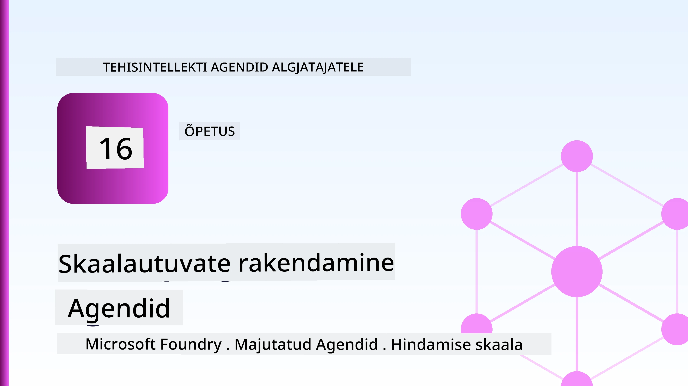
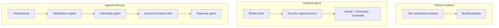
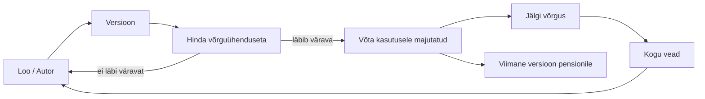
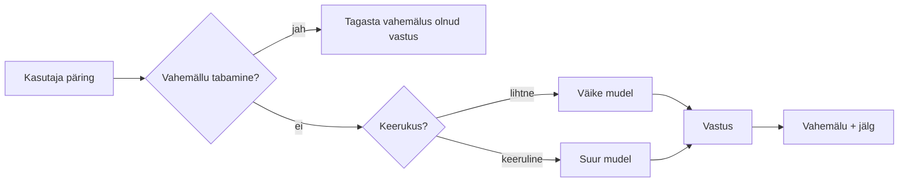
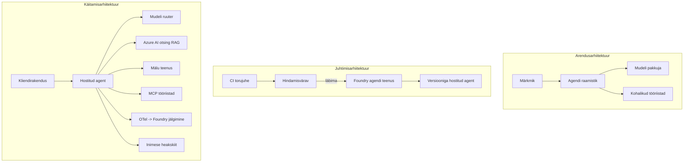

# Microsoft Foundry abil skaleeritavate agentide juurutamine



Selleks hetkeks kursusel olete loonud agente, kes töötavad teie sülearvutis, märkmikus, juhituna käsuga `az login` ja mõne keskkonnamuutujaga. Just see ongi õige õppimisviis. Kuid see ei ole õige viis juurutada agenti, kellele tuhanded kliendid 3 öösel loovad.

See õppetund käsitleb lõhet "see töötab mu masinas" ja "see töötab usaldusväärselt ja kulutõhusalt tootmises" vahel. Selle lõhe sulgeme, kasutades **Microsoft Foundryt** ja **Microsoft Foundry Agent Service'i**, ning teeme seda, ehitades reaalse klienditoe agendi, mis omab tööriistu, tagasitoomist, mälu, hindamist ja jälgimist.

## Sissejuhatus

See õppetund hõlmab:

- Vahe **prototüüpagentide** ja **juurutatud agentide** vahel, ning miks on üleminek peamiselt kõigest *mudeli ümber*.
- Agentide **juurutusmustrid**: kliendi majutatud, teenuse majutatud (Hosted Agents) ja töövoo orkestreeritud.
- Agentide **elutsükkel** Microsoft Foundry’s — loomine, versioonimine, juurutamine, hindamine, jälgimine, kasutusest kõrvaldamine.
- **Skaleerimisstrateegiad**: mudeli marsruutimine, vahemällu salvestamine, samaaegsus ja olekuta disain.
- **Jälgitavus** OpenTelemetry ja Foundry jälgimise abil.
- **Kuluoptimeerimine** mudeli valiku, marsruutimise ja hindamislinnakute kaudu.
- **Ettevõtte kaalutlused**: valitsemine, inimluba ja MCP serverite ohutu käitamine tootmises.

## Õpieesmärgid

Selle õppetunni läbimisel oskate:

- Valida õige juurutusmuster antud agendi töökoormuse jaoks.
- Juurutada agent Microsoft Foundry Agent Service’i nii, et see oleks versioonitud, valitsetud ja jälgitav.
- Instrumenteerida agent jälgimiseks ja ühendada hindamisvoog, mis töötab enne iga väljaannet.
- Rakendada mudeli marsruutimist ja vahemällu salvestamist, et hoida latentsus ja kulud skaleerudes kontrolli all.
- Lisada inimluba kõrge riskiga toimingute jaoks ja integreerida MCP server tootmises ohutult.

## Eeldused

See õppetund eeldab, et olete lõpetanud varasemad õppetunnid ja valdate:

- Agentide loomist kasutades [Microsoft Agent Frameworki](../14-microsoft-agent-framework/README.md) (Õppetund 14).
- [Tööriistade kasutamist](../04-tool-use/README.md) (Õppetund 4) ja [Agentic RAG](../05-agentic-rag/README.md) (Õppetund 5).
- [Agendi mälu](../13-agent-memory/README.md) (Õppetund 13) ja [Agentic protokollid / MCP](../11-agentic-protocols/README.md) (Õppetund 11).
- [Jälgitavus ja hindamine](../10-ai-agents-production/README.md) (Õppetund 10) — see õppetund tugineb otse sellele.

Teil on vaja ka:

- **Azure tellimus** ja **Microsoft Foundry projekt**, millel on vähemalt üks juurutatud vestlusmudel.
- Autentitud **Azure CLI** (`az login`).
- Python 3.12+ ja pakette hoidlas `requirements.txt`.

## Prototüübist tootmisse: mis tegelikult muutub

Prototüüpagendil ja tootmises agendil on sama põhitsükkel — põhjendamine, tööriistade kutsumine, vastamine. Muutub kõik, mis on selle tsükli ümber mähitud. Mudel moodustab võib-olla 20% tootmises agentist; ülejäänud 80% on operatiivne raamistiku osa.

| Murekoht | Prototüüp | Tootmine |
| --- | --- | --- |
| **Majutamine** | Jooksutab teie märkmikus | Jooksutab hostitud teenusena, versioonitud ja juurutatud |
| **Identiteet** | Teie `az login` token | Haldusega identiteet piiratud RBAC-iga |
| **Olek** | Mälus, kaob taaskäivitusel | Väljastatud (lõimede pood, mäluteenistus) |
| **Rike** | Näete tagasijälge | Taaskatkestused, varuplaanid, surnukirjade käitlemine, alertid |
| **Kulu** | "See on mõnisada senti" | Jälgitud päringu kohta, juhitud, vahemällu salvestatud, eelarvestatud |
| **Kvaliteet** | Kontrollite tulemuse visuaalselt | Hinnatud automaatselt enne iga väljaannet |
| **Usaldus** | Heaksite iga toimingu | Poliitika + inimluba riskantsete toimingute puhul |

Jätke see tabel meelde. Iga järgmine lõik vastab ühele reaelemendile.

## Agentide juurutusmustrid

Kasutate kolme mustrit, sageli koos.

### 1. Kliendi majutatud agentid

Agendi objekt elab *teie* rakenduse protsessis. Teie kood kutsub mudelipakkujat otse; põhjendamis-tsükkel jookseb teie teenuses. Seda on varasemates õppetundides tehtud.

- **Kasutage kui** vajate täielikku kontrolli tsükli üle, kohandatud vahendustarkvara või sisestate agendi olemasoleva tagapõhja sisse.
- **Kompromiss**: teie ise vastutate skaleerimise, oleku ja vastupidavuse eest.

### 2. Hostitud agentid (Foundry Agent Service)

Agent registreeritakse *ressursina* Microsoft Foundry’s. Foundry majutab põhjendamise tsükli, hoiab lõimede andmeid, rakendab sisuturvalisust ja RBAC-i ning kuvab agenti Foundry portaalis. Teie rakendus muutub õhukeseks kliendiks, kes loob lõime ja loeb vastuseid.

- **Kasutage kui** soovite vastupidavust, sisseehitatud jälgitavust, valitsemist ja väiksemat operatiivset pinnaala.
- **Kompromiss**: vähem madala taseme kontrolli hallatud käituskeskkonna vastu.

### 3. Agendi töövood

Mitmed agentid (ja tööriistad) on ühendatud graafikuks eksporditud juhtimisvooga — järjestikused sammud, harud, inimluba nõudvad sõlmed ja vastupidavad kontrollpunktid, mis võivad peatuda ja jätkata. See on Microsoft Agent Frameworki **Workflows** funktsioon, mis rakendub juurutuse skaalal.

- **Kasutage kui** ühe tegevuse täitmiseks on vaja mitut spetsialiseerunud agenti või keskel on vaja heakskiidutsüklit.
- **Kompromiss**: rohkem liikuvaid osi; vajab orkestreerimise tasandi jälgitavust.



## Agendi elutsükkel Microsoft Foundry’s

Agendi juurutamine ei ole ühekordne `push`. See on tsükkel, ja see sarnaneb suurversiooni tsüklile, sest see ongi see.



Peamine idee, mis tuli üle [Õppetunnist 10](../10-ai-agents-production/README.md): **võrguväline hindamine on värav, mitte mõtlematu lisand.** Uus agentide versioon ei lähe välja, kui see ei täida teie hindamiskünniseid. Võrgumonitoring toob tootmisvead tagasi võrguvälisele testkomplektile. See on kogu tsükkel.

## Skaleerimisstrateegiad

Agendi skaleerimine erineb olekuta veebigraafiku skaala tõusust, sest iga päring võib käivitada mitu kulukat mudeli- ja tööriistakutset. Neli lähenemist kannavad enamikku koormusest.

**Olekuta päringutöötlus.** Ärge hoidke kasutajapõhist olekut oma protsessimälus. Salvestage vestluslõimed Foundry lõimepoes või mälu teenuses, nii et iga eksemplar saab töödelda iga päringut. See võimaldab skaleerimist horisontaalselt — lisage eksemplare, ilma „kleepuvate“ sessioonideta.

**Mudeli marsruutimine.** Mitte igale päringule pole vaja kõige võimsamat (ja kallimat) mudelit. Lihtsate päringute — kavatsuse klassifitseerimine, lühikesed faktilised vastused — marsruutimine väikesele ja kiiremalt mudelile ning suur mudel reserveeritakse tõeliseks põhjendamiseks. Foundry **Model Router** teeb seda teie eest, või võite ise kergema klassifikaatori ehitada. Laboris ehitate selle ise.

**Vastuste vahemällu salvestamine.** Paljud tugipäringud on peaaegu korduvad („kuidas ma parooli lähtestan?“). Vahemälugege korduvad küsimused ja vastake neile ilma mudelit kutsumata. Isegi tagasihoidlik vahemälu tabamise määr vähendab märkimisväärselt kulusid ja latentsust.

**Samaaegsus ja tagasisurve.** Mudelipakkujatel on kiiruspiirangud. Piirake samaaegsust, kasutage korduskatseid eksponentsiaalse viivitusega ja katkestage väärikalt (järjekorda pandud „tegeleme sellega“ vastus on parem kui 500).



## Jälgitavus tootmises

Te ei saa juhtida, mida ei näe. Nagu Õppetunnis 10 käsitletud, emiteerib Microsoft Agent Framework natiivseid **OpenTelemetry** jälgi — iga mudelikutse, tööriista kasutuse ja orkestreerimisetapi kohta tekib spaan. Tootmises ekspordite need spaanid Microsoft Foundry’sse (või mõnda OTel-ühilduvasse taustsüsteemi), et saaksite:

- Jälgida üht klientide kaebust mudeli- ja tööriistakutse kaupa lõpuni.
- Vaadata p50/p95 latentsust ja päringu kulusid aja jooksul.
- Häirete korral teavitada veamäära hüppeliste kasvude ja kuluanomaaliate kohta enne kasutajate (või rahanduse meeskonna) märkamist.

```python
from agent_framework.observability import get_tracer

tracer = get_tracer()

with tracer.start_as_current_span("support_request") as span:
    span.set_attribute("customer.tier", "enterprise")
    span.set_attribute("routed.model", "gpt-5-nano")
    # agendi täitmist jälgitakse selle ulatuse sees automaatselt
```

Atribuudid nagu `customer.tier` ja `routed.model` muudavad jälgide virna vastatavaks küsimuseks ("Kas ettevõtte kliendid suunatakse liiga sageli väikesele mudelile?").

## Kuluoptimeerimine

Tootmises agentide kulu domineerivad tokenid. Kolm kangi järjest mõjuga:

1. **Sobita mudel suurusega.** Väike mudel, mis läbib teie hindamisvärava, on peaaegu alati odavam kui suur mudel, mis samuti läbib. Kasutage hindamist tõestamaks, et väike mudel on piisavalt hea, mitte vaikimisi kõige suurema mudeli kasutamist ettevaatlikkuse pärast.
2. **Marsruudi vastavalt keerukusele.** Nagu eelnevalt — maksa suurmudeli eest ainult neil päringutel, mis vajavad suure mudeli põhjendamist.
3. **Vahemälu agressiivselt.** Kõige odavam mudelikutse on see, mida te kunagi ei tee.

Hindamisväravad ja kulude kontroll on sama distsipliin kahelt poolelt: hindamine annab *kvaliteedi põranda*, marsruutimine ja vahemälu hoiavad teid võimalikult lähedal selle põranda *kulule*.

## Ettevõtte juurutuse kaalutlused

**Valitsemine.** Hostitud agentid pärivad Foundry RBAC-i, sisuturvalisuse ja auditeerimislogi. Andke iga agendi jaoks haldusidentiteet, millel on minimaalne vajaminev privileeg – ainult lugemisõigus teadmistebaasile, piiratud juurdepääs piletisüsteemi API-le, mitte rohkem.

**Inimene silmitsi.** Mõned toimingud on liiga olulised, et automatiseerida — tagasimakse tegemine, konto kustutamine, juriidilisse meeskonda eskaleerimine. Microsoft Agent Framework toetab **luba nõudvaid** tööriistu: agent pakub välja toimingu, täitmine peatub, inimene heaks kiidab või lükkab tagasi ja töövoog jätkub. Vaatasite seda primitiivi [Õppetunnis 6](../06-building-trustworthy-agents/README.md); siin juurutate seda.

**MCP tootmises.** [MCP](../11-agentic-protocols/README.md) võimaldab agendil tarbida väliseid tööriistu standardse liidese kaudu. Tootmises käsitlege iga MCP serverit usaldamatuna piirina: seostage serveri versioon, käivitage see piiratud identiteediga, kontrollige väljundeid ja ärge kunagi paljastage sellele saladusi. MCP server on sõltuvus, mida parandatakse, auditeeritakse ja mille kasutust piiratakse.



Need kolm diagrammi — arendus, juurutus, jooksutamine — on sama agent kolme eluetapi ajal. Järgmine labor juhendab teid selle ülesehitamisel.

## Käed-külge labor: tootmiskõlblik klienditoe agent

Avage [`code_samples/16-python-agent-framework.ipynb`](./code_samples/16-python-agent-framework.ipynb) ja käige see lõpuni läbi. Koostate **Contoso klienditoe agendi** kõigi tootmisküsimustega sisse ehitatuna:

1. **Tööriistade kasutamine** — tellimuse staatuse pärimine ja tugipiletite avamine.
2. **RAG** — vastamine poliitikaküsimustele teadmistebaasist (Azure AI Search, koos mälus olevap tagavara variandiga, et märkmik töötab ka ilma Search ressursita).
3. **Mälu** — kliendi meenutamine vestluse käigus.
4. **Mudeli marsruutimine** — keerukuse klassifikaator suunab iga päringu väikesele või suurele mudelile.
5. **Vastuste vahemälu** — korduvad küsimused serveeritakse vahemälust.
6. **Inimluba** — tagasimaksed üle lävendi peatavad agendi inimeste signiseerimiseks.
7. **Hindamisvoog** — väikene võrguväline testkomplekt hindab agenti ja toimib tarkvaraväljalaske väravana.
8. **Jälgitavus** — OpenTelemetry jälgimine iga päringu ümber.

### Käsiraamat

Märkmik on organiseeritud nii, et iga tootmisküsimus on iseseisev, käivitatav sektsioon. Selle süda on marsruutimise- ning vahemälukäsitleja:

```python
async def handle_support_request(query: str, customer_id: str) -> str:
    # 1. Serveeri vahemälust, kui võimalik.
    cached = response_cache.get(normalize(query))
    if cached:
        return cached

    # 2. Marsruudi keerukuse järgi, et kontrollida kulusid.
    model = "gpt-5-nano" if is_simple(query) else "gpt-5-mini"

    # 3. Käivita agent jälgimisvööndis jälgitavuse jaoks.
    with tracer.start_as_current_span("support_request") as span:
        span.set_attribute("routed.model", model)
        span.set_attribute("customer.id", customer_id)
        response = await support_agent.run(query, model=model)

    # 4. Vahemälu ja tagasta.
    response_cache.set(normalize(query), response.text)
    return response.text
```

Hindamisvärav, mis valvab väljalaset, näeb välja selline:

```python
async def evaluation_gate(agent, test_cases, threshold: float = 0.8) -> bool:
    passed = 0
    for case in test_cases:
        result = await agent.run(case["input"])
        if score_response(result.text, case["expected"]) >= 0.8:
            passed += 1
    pass_rate = passed / len(test_cases)
    print(f"Evaluation pass rate: {pass_rate:.0%} (gate: {threshold:.0%})")
    return pass_rate >= threshold  # rakenda ainult siis, kui värav läbib
```

Lugege iga rida — märkmik hoiab primitiivid teadlikult väikestena, nii et midagi ei varjata raamistikukutse taga.

## Juurutatud agendi valideerimine suitsutestidega

Ülaltoodud hindamisvärav töötab *võrguväliselt* teie agendi objekti vastu. Kui agent on juurutatud kui Hosted Agent, vajate veel üht, veel odavamat kontrolli: **kas juurutatud lõpp-punkt tegelikult vastab?**

"Edukalt" juurutamine tõestab ainult seda, et juhtimistasand võttis definitsiooni vastu — see ei tõesta, et agent vastab. Puuduv sõltuvus, vale mudelimarsruutimine või aegunud ühendus võib jätta rohelise juurutuse, mis mitte midagi ei tagasta. **Suitsutest** tabab selle sekunditega, iga juurutuse korral, ilma täishindamise kuluta.

See hoidla pakub kasutamiseks valmis suitsutestitoru, mis põhineb [AI Smoke Test](https://github.com/marketplace/actions/ai-smoke-test) GitHubi aktsioonil:

- **Kataloog** — [`tests/lesson-16-smoke-tests.json`](../../../tests/lesson-16-smoke-tests.json) sisaldab kirjeldusi ja väiteid Contoso tugisagent jaoks (põhineb poliitika vastustel, tellimuse pärimine, teemast kinnipidamine, ja mitme-lõimeline jatkuvus). Teiste õppetundide agentide kataloogid on selle kõrval — vt [`tests/README.md`](../tests/README.md).
- **Töövoog** — [`.github/workflows/smoke-test.yml`](../../../.github/workflows/smoke-test.yml) logib sisse Azure OIDC-ga ja POSTitab iga kirjeldise agendi vastuste lõpp-punkti, töö nurjub kui mõni väide ebaõnnestub.

```yaml
- name: Smoke-test hosted agent
  uses: JFolberth/ai-smoketest@v1
  with:
    project_endpoint: ${{ inputs.project_endpoint }}
    agent_name: ContosoSupportAgent
    tests_file: tests/lesson-16-smoke-tests.json
```


Käivita see vahekaardilt **Actions** pärast oma esindaja juurutamist, sisestades oma Foundry projekti lõpp-punkti ja esindaja nime. Föderatiivsel identiteedil peab olema Foundry projekti ulatuses roll **Azure AI User**. Mõtle kihtidele nagu püramiidile: suitsutestid (kas on kättesaadav ja reageerib?) käivitatakse iga juurutuse korral, võrguvälise hindamise (kas piisavalt hea saatmiseks?) käivitamine enne edasiviimist ning võrgus hindamine (kuidas see looduses töötab?) töötab pidevalt.

## Teadmiste kontroll

Testi oma arusaamist enne ülesandega jätkamist.

**1. Kui suur osa tootmise esindajast on ligikaudu "mudel" ja mis on ülejäänud?**

<details>
<summary>Vastus</summary>

Mudel on süsteemi vähemus — sageli nimetatud umbes 20%. Ülejäänud on operatiivne karkass: majutamine ja versioonihaldus, identiteet ja RBAC, väline olek, rikete käsitlemine, kulude jälgimine, hindamine ja inimkontrollid. Tootmisse minek tähendab eelkõige kõike ehitamist *mõtlemistsükli ümber*.
</details>

**2. Millal valiksid majutatud esindaja kliendimajutatud esindaja asemel?**

<details>
<summary>Vastus</summary>

Kui soovid hallatud käitusaega sisseehitatud vastupidavusega (teemad, mis püsivad ja suudavad jätkata), jälgitavust, sisuohutust ja RBAC-i ning oled valmis loovutama osa madala taseme kontrollist mõtlemistsükli üle väiksema operatiivse pinnapinna nimel. Kliendimajutatud on eelistatud, kui vajad täielikku kontrolli tsükli üle või manustad esindajat olemasolevasse backendisse.
</details>

**3. Miks peab skaleeritav esindaja olema oma protsessi mälus olekuta?**

<details>
<summary>Vastus</summary>

Nii saab ükskõik milline instance käsitleda ükskõik millist päringut, mis võimaldab horisontaalset skaleerimist ilma kinnihoidvate sessioonideta. Kasutaja-kohane vestluse olek on eksternaliseeritud teema andmehoidlasse või mäluteenusesse. Kui olek oleks protsessi mälus, siis selle taaskäivitamisel kaotaksid selle ja ei saaks koormust vabalt jagada.
</details>

**4. Millist probleemi lahendab mudeli marsruutimine ja kuidas see hindamisega seotud on?**

<details>
<summary>Vastus</summary>

Marsruutimine saadab lihtsad päringud väikese, odava ja kiirmodelli juurde ning jätab suure mudeli tõeliseks mõtlemiseks, kontrollides nii latentsust kui ka kulusid. See seostub hindamisega, kuna hindamine tõestab, et väike mudel on teatud päringutüüpi jaoks piisavalt hea — marsruutimine ilma hindamiseta on oletamine.
</details>

**5. Mis on "hindamisvärav" ja kus see elutsüklis asub?**

<details>
<summary>Vastus</summary>

Hindamisvärav käitab uue esindaja versiooni offline testkomplekti ning blokeerib juurutamise, kui läbimise määr ei ületa lävendit. See asub elutsükli "versioon" ja "juurutuse" vahel, muutes kvaliteedi väljaandmise eeltingimuseks, mitte millekski, mida kontrollitakse peale saatmist.
</details>

**6. Miks tuleks MCP serverit tootmises käsitleda usaldamata piirina?**

<details>
<summary>Vastus</summary>

Sest see on väline sõltuvus, kuhu sinu esindaja kutsub. Tuleks fikseerida selle versioon, käivitada see ulatusliku identiteediga, valideerida väljundid, piirata selle kasutusmahtu ja mitte kunagi jagada sellel saladusi — sama distsipliin, mida rakendad iga kolmanda osapoole sõltuvuse puhul. Selle väljundid voolavad su esindaja mõtlemisse, seega valideerimata usaldus on turvarisk.
</details>

**7. Milline üksik muudatus avaldab tavaliselt suurimat mõju tootmise esindaja kulule ja miks?**

<details>
<summary>Vastus</summary>

Mudeli õige suuruse valimine — kasutada võimalikult väikest mudelit, mis vastab sinu hindamisvärava nõuetele. Kulud on domineeritud tokenitest ja väiksem mudel, mis vastab kvaliteedinõuetele, on peaaegu alati odavam kui suurem. Vahemällu salvestamine ja marsruutimine vähendavad kulusid veelgi, kuid õige baasmudeli valikul on suurim esmase järjekorra efekt.
</details>

**8. Millist rolli mängivad jälgede atribuudid nagu `customer.tier` ja `routed.model` jälgitavuses?**

<details>
<summary>Vastus</summary>

Need muudavad põhijäljed vastatavateks äriküsimusteks. Ilma atribuutideta sul on sein jälgedest; nendega saad küsida "kas ärikliendid marsruuditakse liiga tihti väikese mudeli juurde?" või "milline mudel käsitleb meie aeglaseimaid päringuid?" Atribuudid on viis, kuidas lõigata telemeetria sinu tegevusele oluliste mõõtmete järgi.
</details>

## Ülesanne

Võta laboris olev klienditoe esindaja ja tugevda teda konkreetseks stsenaariumiks: **tellimuse arvelduse tugiesindaja SaaS ettevõttele.**

Sinu esituses peaks olema:

1. **Asenda tööriistad** arveldusega seotud tööriistadega: `get_subscription_status`, `get_invoice`, ja `issue_credit` (krediidid üle 50 dollari vajavad inimkinnitust).
2. **Lisa kolm RAG dokumenti**, mis käsitlevad ettevõtte tagasimaksepoliitikat, arveldustsüklit ja tühistamispoliitikat.
3. **Laienda hindamiskomplekti** vähemalt kaheksale juhtumile, sealhulgas vähemalt kaks, mis **peaksid** käivitama inimkinnituse tee, ja kinnita, et hindamisvärav õigesti läbib või ebaõnnestub.
4. **Lisa üks kuluaruanne**: pärast kümne erineva päringu käivitamist esindaja kaudu prindi, mitu neist osutus väiksele mudelile, mitu suurele ja mitu teenindati vahemälust.

Kirjuta lühike lõik (markdown lahtris), mis selgitab, millise mudeli marsruutimise reegli sa valisid ja kuidas sa seda päris liiklusega valideeriksid. Õiget vastust ei ole — sind hinnatakse selle põhjal, kas tootmise kaalutlused on sidusalt seotud.

## Kokkuvõte

Selles õppetükis viisid endi esindaja prototüübist tootmisse Microsoft Foundry abil:

- Tootmisse minek on eelkõige seotud mudeli ümber oleva **operatiivse karkassiga** — majutamine, identiteet, olek, rikete käsitlemine, kulud, kvaliteet ja usaldus.
- Õppisid kolme **juurutusmustrit** — kliendimajutatud, majutatud esindajad ja esindaja töövood — ning millal kumbki sobib.
- Läbikäisid **esindaja elutsükli**, kus offline **hindamine toimib väljaandmise väravana** ja võrgus jälgitavus suunab rikete info tagasi testikomplekti.
- Kasutasid **skaleerimisstrateegiaid** — olekuta disain, mudeli marsruutimine, vahemällu salvestamine ja piiratud paralleelsus — ning sidusid need **kulu optimeerimisega**.
- Sidusid sisse **ettevõtte kontrollid**: RBAC, inimene tsüklis kinnituses ja tootmises ohutu MCP integreerimise.
- Lõid **tootmiskõlbliku klienditoe esindaja**, mis ühendab kõik need kaalutlused käidavas koodis.

Järgmine õppetükk teekond on vastupidine: selle asemel, et skaleerida esindajaid pilves, tood need *alla* ühe arendajamasina peale ja jooksutad täielikult lokaalselt.

## Lisamaterjalid

- <a href="https://learn.microsoft.com/azure/ai-foundry/what-is-azure-ai-foundry" target="_blank">Microsoft Foundry dokumentatsioon</a>
- <a href="https://learn.microsoft.com/azure/ai-foundry/agents/overview" target="_blank">Microsoft Foundry Agent Service ülevaade</a>
- <a href="https://learn.microsoft.com/en-us/agent-framework/overview/?wt.mc_id=youtube_26688_organicsocial_reactor&pivots=programming-language-python" target="_blank">Microsoft Agent FrameWork</a>
- <a href="https://learn.microsoft.com/azure/ai-foundry/concepts/model-router" target="_blank">Mudeli marsruutija Microsoft Foundry-s</a>
- <a href="https://learn.microsoft.com/azure/search/search-what-is-azure-search" target="_blank">Azure AI Search</a>
- <a href="https://opentelemetry.io/" target="_blank">OpenTelemetry</a>
- <a href="https://github.com/marketplace/actions/ai-smoke-test" target="_blank">AI Smoke Test GitHub tegevus</a>
- <a href="https://modelcontextprotocol.io/" target="_blank">Model Context Protocol (MCP)</a>

## Eelmine õppetükk

[Arvuti kasutamise esindajate loomine (CUA)](../15-browser-use/README.md)

## Järgmine õppetükk

[Lokaalsete AI esindajate loomine](../17-creating-local-ai-agents/README.md)

---

<!-- CO-OP TRANSLATOR DISCLAIMER START -->
**Lahtiütlus**:
See dokument on tõlgitud kasutades AI tõlketeenust [Co-op Translator](https://github.com/Azure/co-op-translator). Kuigi me püüdleme täpsuse poole, palun pange tähele, et automatiseeritud tõlgetes võib esineda vigu või ebatäpsusi. Originaaldokument selle emakeeles tuleks pidada autoriteetseks allikaks. Olulise teabe puhul soovitatakse kasutada professionaalset inimtõlget. Me ei vastuta selle tõlkega seotud eksimustest või valesti mõistmistest.
<!-- CO-OP TRANSLATOR DISCLAIMER END -->