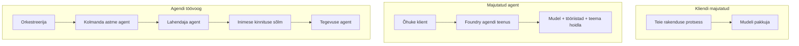
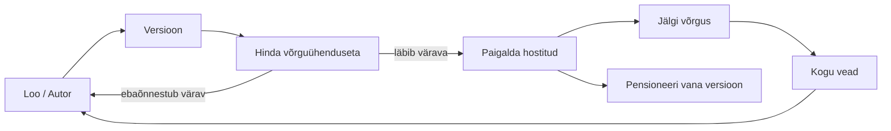
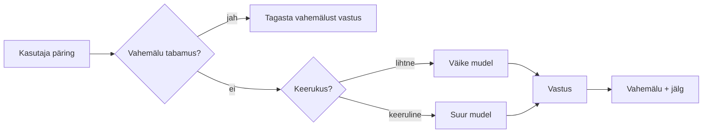
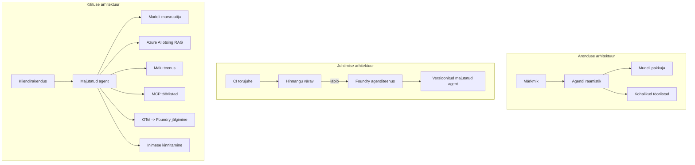

# Skaleeritavate agentide juurutamine Microsoft Foundry abil


Kuni selleni olete kursusel ehitanud agente, kes töötavad teie sülearvutis, märkmiku sees, käivitatud `az login` ja mõne keskkonnamuutujaga. See on täpselt õige viis õppimiseks. See ei ole õige viis agenti käivitamiseks, kellele tuhanded kliendid öösel kell 3 loovad sõltuvuse.

See õppetund räägib lõhetest "see töötab minu masinas" ja "see töötab usaldusväärselt ja taskukohaselt tootmises." Selle lõhe sulgeme kasutades **Microsoft Foundry't** ja **Microsoft Foundry Agent Service'i**, ning teeme seda, ehitades tõelise klienditoe agendi, millel on tööriistad, päringuvõime, mälu, hindamine ja järelevalve.

## Sissejuhatus

See õppetund katab:

- Erinevused **prototüüp-agendi** ja **juurutatud agendi** vahel ning miks üleminek puudutab peamiselt kõike *mudeli ümber*.
- Agendi **juurutamismustrid**: kliendi majutatud, teenuse majutatud (Hosted Agents) ja töövoo korraldatud.
- **Agendi elutsükkel** Microsoft Foundry's — loo, versiooniuuenda, juuruta, hinda, vaata, pensioneeri.
- **Skaleerimisstrateegiad**: mudeli marsruutimine, vahemälu, samal ajal töötamine ja seisundivaba disain.
- **Järelevalve** OpenTelemetry ja Foundry jälgimisega.
- **Kulu optimeerimine** mudeli valiku, marsruutimise ja hindamislukkude kaudu.
- **Ettevõtte kaalutlused**: valitsemine, inimluba ja MCP serverite turvaline käitamine tootmises.

## Õpieesmärgid

Pärast selle õppetunni läbimist oskate:

- Valida konkreetse agendi töökoormuse jaoks õige juurutamismuster.
- Juurutada agent Microsoft Foundry Agent Service’i, nii et sel on versioonimine, valitsemine ja jälgitavus.
- Instrumenteerida agent jälgimiseks ja ühendada hindamisvoog, mis töötab enne iga väljaannet.
- Rakendada mudeli marsruutimist ja vahemälu, et hoida latentsust ja kulusid skaleerudes kontrolli all.
- Lisada inimluba kõrge riskiga toimingute jaoks ja integreerida MCP server tootmisturvalisel viisil.

## Eeldused

See õppetund eeldab, et olete läbinud varasemad õppetunnid ja tunnete end mugavalt:

- Agente ehitades kasutades [Microsoft Agent Framework’i](../14-microsoft-agent-framework/README.md) (õppetund 14).
- [Tööriistade kasutamine](../04-tool-use/README.md) (õppetund 4) ja [Agentic RAG](../05-agentic-rag/README.md) (õppetund 5).
- [Agendi mälust](../13-agent-memory/README.md) (õppetund 13) ja [Agentic protokollidest / MCP](../11-agentic-protocols/README.md) (õppetund 11).
- [Jälgitavusest ja hindamisest](../10-ai-agents-production/README.md) (õppetund 10) — see tunnitus on otse sellele tuginev.

Vajate ka:

- **Azure’i tellimust** ja **Microsoft Foundry projekti**, millel on vähemalt üks juurutatud vestlusmudel.
- Autentitud **Azure CLI** (`az login`).
- Python 3.12+ ja paketid hoidlas [`requirements.txt`](../../../requirements.txt).

## Prototüübist tootmisse: mis tegelikult muutub

Prototüüpi-agent ja tootmisagent jagavad sama põhiloop’i — mõtlemine, tööriistade kutsumine, vastamine. Muutub kõik, mis seda loop’i ümbritseb. Mudel moodustab tootmisagendist võib-olla 20%; ülejäänud 80% on operatiivne raamistik.

| Kaalutlus | Prototüüp | Tootmine |
| --- | --- | --- |
| **Majutamine** | Jookseb teie märkmikus | Jookseb majutatud teenusena, versioonitud ja väljasaatmisega |
| **Identiteet** | Teie `az login` token | Hallatud identiteet koos RBAC-iga |
| **Oleku säilitamine** | Mälus, kaob taaskäivitamisel | Eksternaliseeritud (teemapoiss, mäluteenistus) |
| **Vigade käsitlus** | Näete virna jälge (traceback) | Taaskatsed, varuvõimalused, surnud kirja kettad, hoiatused |
| **Kulu** | "See on paar senti" | Jälgitakse taotluse kohta, marsruuditakse, vahemällu salvestatakse, eelarvestatakse |
| **Kvaliteet** | Kontrollite väljundit silmaga | Hinnatakse automaatselt enne iga väljaannet |
| **Usaldus** | Kinnitate iga toimingu | Poliitika + inimene tsüklis riskantsete toimingute jaoks |

Pidage seda tabelit meeles. Iga alljärgnev lõik vastab ühele reale selles tabelis.

## Agendi juurutamismustrid

On kolm mustrit, mida kasutate sageli koos.

### 1. Kliendi majutatud agentid

Agent-objekt elab *teie* rakenduse protsessis. Teie kood kutsub mudeli pakkujat otse; mõtlemise loom jookseb teie teenuses. Seda on tehtud kõigis eelnevates õppetundides.

- **Kasutage seda**, kui vajate täielikku kontrolli loop’i üle, kohandatud vahendustarkvara või manustate agenti olemasoleva taustsüsteemi sisse.
- **Kompromiss**: peate ise hoolitsema skaleerimise, oleku ja vastupidavuse eest.

### 2. Majutatud agentid (Foundry Agent Service)

Agent *registreeritakse ressursina* Microsoft Foundry's. Foundry majutab mõtlemise loopi, hoiab lõimeid, rakendab sisuohutust ja RBAC-i, ja teeb agendi nähtavaks Foundry portaalis. Teie rakendus muutub õhukeseks kliendiks, mis loob lõimeid ja loeb vastuseid.

- **Kasutage seda**, kui soovite vastupidavust, sisseehitatud jälgitavust, valitsemist ja väiksemat operatiivsust.
- **Kompromiss**: madalama taseme kontroll on väiksem, vastu saab hallatud käituskeskkonna.

### 3. Agendi töövood

Mitmed agentid (ja tööriistad) on kokkupandud graafikuks koos selge kontrollvooga — sekventiaalsed sammud, harunemine, inimese heakskiidu sõlmed ja vastupidavad kontrollpunktid, mis saavad peatada ja jätkata. See on Microsoft Agent Framework'i **Töövoogude** võimekus juurutamise mahus.

- **Kasutage seda**, kui üks ülesanne hõlmab mitut spetsialiseeritud agenti või vajab heakskiidumisastet keskel.
- **Kompromiss**: rohkem liikuvat osa; vajab korraldus-taseme jälgitavust.



## Agendi elutsükkel Microsoft Foundry's

Agendi juurutamine ei ole ühekordne `push`. See on tsükkel, mis näeb välja nagu tarkvara väljaandmise tsükkel, sest täpselt see ta ongi.



Põhimõte, mis tuli üle [Õppetundist 10](../10-ai-agents-production/README.md): **offline hindamine on lukk, mitte mõttekäigu lõpp.** Uus agentide versioon ei väljastata, kui ta ei ületa teie hindamiskünniseid. Võrgujälgitavus suunab seejärel reaalsed vead tagasi offline testikomplekti. See on kogu tsükkel.

## Skaleerimisstrateegiad

Agendi skaleerimine erineb seisundivaba veebiliidese skaleerimisest, sest iga päring võib vallandada mitu kulukat mudeli ja tööriista kutsumist. Neli tehnikat kannavad suurema osa koormusest.

**Seisundivaba päringute käsitlemine.** Ärge hoidke protsessi mälus kasutajapõhist olekut. Salvestage vestluslõimed Foundry lõimede salvestusruumis või mäluteenuses, nii et iga eksemplar suudab käsitleda kõiki päringuid. See võimaldab teil horisontaalselt skaleerida — lisage eksemplare, ei ole "sticky" sessioone.

**Mudeli marsruutimine.** Mitte iga päring ei vaja teie võimekaimat (ja kõige kallimat) mudelit. Marsruutige lihtsad päringud — kavandi tuvastus, lühikesed faktipõhised vastused — väikese, kiire mudeli juurde ja jätke suur mudel tõelise mõtlemise jaoks. Foundry **Mudeli marsruuter** suudab seda teie eest teha, või võite ise kergekaalulise klassifikaatori kirjutada. Te ehitate selle ise labs.

**Vastuste vahemällu salvestamine.** Paljud tugipäringud on peaaegu koopiad ("Kuidas ma oma parooli lähtestan?"). Salvestage vastused korduvatele küsimustele ja serveerige seda ilma mudelit üldse kasutamata. Isegi mõõdukas vahemälu osakaal vähendab oluliselt kulu ja latentsust.

**Samasel ajalisel paralleelsus ja tagasirõhk.** Mudelipakkujatel on määravad piirangud. Piirake oma paralleelsust, kasutage korduskatseid eksponentsiaalse viivitusega ja eksige graatsiliselt (järjekorda pandud "me tegeleme sellega" vastus on parem kui 500 veateade).



## Jälgitavus tootmises

Te ei saa juhtida seda, mida te ei näe. Nagu õppetund 10 selgitas, Microsoft Agent Framework tekitab loomulikult **OpenTelemetry** jälgi — iga mudelikutse, tööriista kutsumine ja orkestratsiooni samm muutub ulatuseks (span). Tootmises ekspordite need ulatused Microsoft Foundry'sse (või mis tahes OTel-sobivasse taustsüsteemi), et saaksite:

- Jälgida ühe kliendikaebuse algusest lõpuni läbi iga mudelit ja tööriista kutsumist.
- Vaadata p50/p95 latentsust ja kulu taotluse kohta aja jooksul.
- Teavitada vea määra tõusust ja kulu anomaaliatest enne, kui kasutajad (või raamatupidamismeeskond) neid märkavad.

```python
from agent_framework.observability import get_tracer

tracer = get_tracer()

with tracer.start_as_current_span("support_request") as span:
    span.set_attribute("customer.tier", "enterprise")
    span.set_attribute("routed.model", "gpt-5-nano")
    # agendi täitmine jälgitakse selle ulatuse sees automaatselt
```

Omadused nagu `customer.tier` ja `routed.model` muudavad suure jälgede massi vastatavaks küsimuste vastamiseks ("kas ettevõtte kliendid marsruuditakse liiga sageli väikese mudeli juurde?").

## Kulu optimeerimine

Tootmiagendide kulud kujunevad peamiselt tokenitest. Kolm hooba mõjususjärjestuses:

1. **Õige mudeli suuruse valimine.** Väike mudel, mis ületab teie hindamislukku, on peaaegu alati odavam kui suur mudel, mis samuti ületab. Kasutage hindamist, et tõestada väikese mudeli piisavust, mitte ei eelistaks ettevaatlikult suurimat mudelit.
2. **Marsruudi alusel keerukus.** Nagu eespool — maksate suurt mudeli hinda ainult nende päringute eest, mis vajavad suurmudeli mõtlemist.
3. **Agressiivne vahemällu salvestamine.** Kõige odavam mudelikutse on see, mida te ei tee kunagi.

Hindamislukud ja kulude kontroll on üks ja sama distsipliin kahest vaatenurgast: hindamine määrab *kvaliteedi põranda*, marsruutimine ja vahemälu hoiavad kulud sellest põrandast võimalikult lähedal.

## Ettevõtte juurutamise kaalutlused

**Valitsemine.** Majutatud agentid pärivad Foundry RBAC-i, sisuohutuse ja auditeerimise. Andke igale agendile hallatud identiteet minimaalse privileegiga, mida ta vajab — ainult lugemisõigus teadmistebaasile, piiratud ligipääs piletitarkvara API-le, mitte midagi rohkem.

**Inimene tsüklis.** Mõned toimingud on liiga olulised, et neid automaatselt teha — tagasimakse väljastamine, konto kustutamine, juhtumi eskaleerimine juristi meeskonnale. Microsoft Agent Framework toetab **heakskiidu nõudvaid** tööriistu: agent pakub toimingu, sooritus peatub, inimene kinnitab või lükkab tagasi ja töövoog jätkub. Seda primitiivi nägite [õppetund 6-s](../06-building-trustworthy-agents/README.md); siin juurutate seda.

**MCP tootmises.** [MCP](../11-agentic-protocols/README.md) võimaldab agendil kasutada väliseid tööriistu standardse liidese kaudu. Tootmises kohtlege iga MCP serverit kui usaldamata piiri: lukustage serveri versioon, käitage seda piiratud identiteediga, valideerige selle väljundid ja ärge kunagi jagage saladusi. MCP server on sõltuvus, ja sõltuvusi parandatakse, auditeeritakse ja piiratakse.



Need kolm diagrammi — arendus, juurutus, jooksuaeg — on sama agent kolme elutsükli faasis. Järgmine labirong juhatab teid selle ehitamisel.

## Praktiline labirong: tootmiskõlblik klienditoe agent

Avage [`code_samples/16-python-agent-framework.ipynb`](./code_samples/16-python-agent-framework.ipynb) ja töötage see otsast lõpuni läbi. Koostate **Contoso klienditoe agendi**, kus iga tootmise mure on integreeritud:

1. **Tööriistade kutsumine** — tellimuse staatuse otsimine ja tugipiletite avamine.
2. **RAG** — valikupõhiste küsimuste vastamine teadmistebaasist (Azure AI Search, mälus toimiva varuplaaniga, et märkmik töötab ilma Search ressursita).
3. **Mälu** — mäletab klienti vestluse pöörete vahel.
4. **Mudeli marsruutimine** — keerukuse klassifikaator suunab iga päringu väikesele või suurele mudelile.
5. **Vastuste vahemälu** — korduvad küsimused serveeritakse vahemälust.
6. **Inimese heakskiidu lukk** — tagasimaksed üle läve peatavad inimallkirja jaoks.
7. **Hindamisvoog** — väike offline testikomplekt hindab agenti ja töötab väljaandmislukuna.
8. **Jälgitavus** — OpenTelemetry jälgimine iga päringu ümber.

### Läbivaatus

Märkmik on organiseeritud nii, et iga tootmise mure on iseseisev, jooksutatav lõik. Selle südameks on marsruutimise ja vahemäluga päringutöötlus:

```python
async def handle_support_request(query: str, customer_id: str) -> str:
    # 1. Teenindage vahemälust, kui võimalik.
    cached = response_cache.get(normalize(query))
    if cached:
        return cached

    # 2. Suunake keerukuse alusel, et kontrollida kulusid.
    model = "gpt-5-nano" if is_simple(query) else "gpt-5-mini"

    # 3. Käivitage agent jälgimisspanssis jälgitavuse huvides.
    with tracer.start_as_current_span("support_request") as span:
        span.set_attribute("routed.model", model)
        span.set_attribute("customer.id", customer_id)
        response = await support_agent.run(query, model=model)

    # 4. Vahemäluge ja tagastage.
    response_cache.set(normalize(query), response.text)
    return response.text
```

Hindamislukk, mis kaitseb väljaandmist, näeb välja nii:

```python
async def evaluation_gate(agent, test_cases, threshold: float = 0.8) -> bool:
    passed = 0
    for case in test_cases:
        result = await agent.run(case["input"])
        if score_response(result.text, case["expected"]) >= 0.8:
            passed += 1
    pass_rate = passed / len(test_cases)
    print(f"Evaluation pass rate: {pass_rate:.0%} (gate: {threshold:.0%})")
    return pass_rate >= threshold  # tee juurutamine ainult juhul, kui värav läbib
```

Lugege iga rida — märkmik hoiab primitiivid eesmärgipäraselt väikestena, et midagi ei oleks raamistikukutse varjus.

## Juurutatud agendi valideerimine suitsutestidega

Ülalmainitud hindamislukk töötab *offline* teie agendi objekti vastu. Kui agent on juurutatud kui Hosted Agent, vajate veel üht, veel odavamat kontrolli: **kas juurutatud lõpp-punkt tegelikult vastab?**

Edukas juurutus tõestab ainult, et kontrolltase aktsepteeris definitsiooni — see ei tõesta, et agent vastab. Puuduv sõltuvus, halb mudeli marsruutimine või aegunud ühendus võivad jätta rohelise juurutamise, mis ei vasta midagi. **Suitsutest** tabab selle sekunditega, igal juurutusel, ilma täishindamiseta.

See hoidla sisaldab kasutusvalmis suitsutesti torujuhtme, mis põhineb [AI Smoke Test](https://github.com/marketplace/actions/ai-smoke-test) GitHub Action'il:

- **Kataloog** — [`tests/lesson-16-smoke-tests.json`](../../../tests/lesson-16-smoke-tests.json) sisaldab päringuid ja väiteid Contoso tugiedendi kohta (põhjalikud poliitikaküsimused, tellimuse otsing, teema hoidmine ja mitme-kordne lõimede järjepidevus). Muude õppetundide agentide kataloogid asuvad selle kõrvale — vaata [`tests/README.md`](../tests/README.md).
- **Töövoog** — [`.github/workflows/smoke-test.yml`](../../../.github/workflows/smoke-test.yml) logib sisse Azure OIDC-ga ja POSTitab iga päringu agendi Responses lõpp-punktile, ebaõnnestudes, kui mõni väide ei kehti.

```yaml
- name: Smoke-test hosted agent
  uses: JFolberth/ai-smoketest@v1
  with:
    project_endpoint: ${{ inputs.project_endpoint }}
    agent_name: ContosoSupportAgent
    tests_file: tests/lesson-16-smoke-tests.json
```


Käivitage see vahekaardilt **Actions** pärast agendi juurutamist, sisestades oma Foundry projektipunkti ja agendi nime. Liendatud identiteedil peab olema Foundry projekti ulatuses roll **Azure AI User**. Mõelge kihtidele nagu püramiidile: suitsutestid (kas see on saavutatav ja vastab?) käivad iga juurutuse ajal, võrguühenduseta hindamine (kas see on piisavalt hea edastamiseks?) tehakse enne reklaamimist ja võrgus hindamine (kuidas ta looduses toimib?) töötab pidevalt.

## Teadmiste kontroll

Testige oma arusaamist enne ülesandega jätkamist.

**1. Kui suur osa tootmisagentist on ligikaudu "mudel" ja mis on ülejäänu?**

<details>
<summary>Vastus</summary>

Mudel on süsteemi vähemus — tavaliselt mainitakse umbes 20%. Ülejäänu on operatiivne karkass: majutamine ja versioonihaldus, identiteet ja RBAC, eksternaliseeritud seisund, tõrketöötlus, kulude jälgimine, hindamine ja inimeste sekkumise kontrollid. Tootmisse liikumine tähendab peamiselt kogu asjade loomist *põhimõtlemise tsükli* ümber.
</details>

**2. Millal valiksite majutatud agendi asemel kliendi majutatud agendi?**

<details>
<summary>Vastus</summary>

Kui soovite haldatud käitusaja, millel on sisseehitatud vastupidavus (püsivad lõimed, mis saavad jätkuda), jälgitavus, turvalisus ja RBAC ning olete nõus kaotama veidi madalama taseme kontrolli mõtlemistsükli üle vastutasuks väiksema operatiivpinna eest. Kliendi majutatud on eelistatum, kui vajate täit kontrolli tsükli üle või kui agent on sisseehitatud olemasolevasse backendisse.
</details>

**3. Miks peab skaaleeritav agent olema oma protsessi mälus riigitu?**

<details>
<summary>Vastus</summary>

Nii saab ükski eksemplar iga taotluse ära teenindada, mis võimaldab horisontaalset skaleerimist ilma kinniste sessioonideta. Kasutajaspetsiifiline vestluse seisund on eksternaliseeritud lõimede poest või mäluteenusest. Kui seisund oleks protsessimälus, kaotaksite selle taaskäivitamisel ja ei saaks koormust vabalt jaotada.
</details>

**4. Millise probleemi lahendab mudelite marsruutimine ja kuidas see hindamisega seotud on?**

<details>
<summary>Vastus</summary>

Marsruutimine saadab lihtsad taotlused väikesele, odavale ja kiirele mudelile ning jätab suure mudeli päris mõtlemiseks, kontrollides nii latentsust kui ka kulusid. See on hindamisega seotud, sest hindamine tõestab, et väike mudel on piisavalt hea kindla taotlusteklassi jaoks — marsruutimine ilma hindamiseta on vaid oletus.
</details>

**5. Mis on "hindamisvärav" ja kus see tsüklis asub?**

<details>
<summary>Vastus</summary>

Hindamisvärav käitab võrguühenduseta testkomplekti uue agendi versiooni vastu ja blokeerib juurutuse, kui lävendi künnist ei ületata. See asub tsükli "versiooni" ja "juurutuse" vahel, pannakse kvaliteet vabastamise eeltingimuseks, mitte ei kontrollita peale tarnimist.
</details>

**6. Miks tuleks MCP-serverit tootmises käsitleda usaldusväärsena piiri jaoks?**

<details>
<summary>Vastus</summary>

Sest see on väline sõltuvus, kuhu agent pöördub. Tuleb fikseerida selle versioon, käitada seda piiratud identiteediga, valideerida väljundid, kiirusepiirata ja mitte kunagi anda saladusi — sama distsipliin kehtib kõigi kolmandate osapoolte sõltuvuste puhul. Selle väljundid mõjutavad agendi mõtlemist, nii et valideerimata usaldus on turvarisk.
</details>

**7. Milline üksik muutus avaldab tavaliselt tootmisagendi kuludele kõige suuremat mõju ja miks?**

<details>
<summary>Vastus</summary>

Õige mudeli suuruse valimine — kasutada väikseimat mudelit, mis siiski läbib hindamisvärava. Kulu domineerivad tokenid ja väiksem mudel, mis vastab kvaliteedinõuetele, on peaaegu alati odavam kui suurem. Vahemälu ja marsruutimine vähendavad kulu veelgi, kuid õige baasmudeli valikul on suurim esimese järgu mõju.
</details>

**8. Millist rolli mängivad jälgitavuses sellised pikkuse atribuudid nagu `customer.tier` ja `routed.model`?**

<details>
<summary>Vastus</summary>

Nad muudavad toore jälgimise vastatavaks äriküsimusteks. Ilma atribuutideta on teil massiivne hulk jälgimisi; nendega saate küsida "kas ettevõtte kliendid suunatakse väikese mudeli juurde liiga tihti?" või "milline mudel teenindab meie aeglaseimaid taotlusi?" Atribuudid on viis jaotada telemeetria mõõtmete järgi, mis on teie tegevusele olulised.
</details>

## Ülesanne

Võtke labist klienditoe agent ja tugevdage seda konkreetseks stsenaariumiks: **tellimusteenuse arveldustoestus SaaS ettevõttele.**

Teie esitus peaks sisaldama:

1. **Asendage tööriistad** arveldusele sobivatega: `get_subscription_status`, `get_invoice` ja `issue_credit` (üle 50-dollarilised kreeditid vajavad inimkinnitust).
2. **Lisage kolm RAG dokumenti**, mis katavad ettevõtte tagasimaksepoliitika, arveldustsükli ja tühistamispoliitika.
3. **Laiendage hindamiskomplekti** vähemalt kaheksa juhtumini, sealhulgas vähemalt kaks, mis *peaksid* käivitama inimkinnituse tee ning kinnitage, et teie hindamisvärav liigub õigesti edukalt või ebaõnnestub.
4. **Lisage üks kuluaruanne**: pärast kümne erineva päringu läbimist agentide kaudu printige, mitu läks väikesele mudelile, mitu suurele mudelile ja mitu teenindati vahemälust.

Kirjutage lühike lõik (markdown lahtris), mis selgitab, millise mudeli marsruutimise reegli valisite ja kuidas te seda reaalse liiklusega valideeriksite. Õiget vastust ei ole — hindatakse, kas tootmise aspektid on sidustatud mõistlikult.

## Kokkuvõte

Selles õppetükis viisite agendi prototüübist tootmisse Microsoft Foundry abil:

- Tootmisse hüpe on peamiselt seotud mudeli ümber oleva **operatiivse karkassiga** — majutamine, identiteet, seisund, tõrketöötlus, kulu, kvaliteet ja usaldus.
- Õppisite kolme **juurutusmustrit** — kliendi majutatud, majutatud agendid ja agendi töövood — ja millal kumbki sobib.
- Läbisite **agendi elutsükli**, kus võrguühenduseta **hindamine toimib vabastusväravana** ja veebijälgitavus suunab tõrked testikomplekti tagasi.
- Rakendasite **skaalimisstrateegiaid** — riigitu disain, mudelite marsruutimine, vahemällu salvestamine ja piiratud korraga töötamise järjekord — ning sidusite need **kulu optimeerimisega**.
- Ühendsite **ettevõtte kontrollid**: RBAC, inimkinnitusega heakskiidu ja tootmises ohutu MCP integratsiooni.
- Looite **tootmisvalmis klienditoe agendi**, mis ühendab kõik need aspektid töölepanekoodi.

Järgmine õppetund läbib vastupidise teekonna: skaleerimise asemel pilves viite agendid alla arendaja masinasse ja jooksutate neid täielikult lokaalselt.

## Lisamaterjalid

- <a href="https://learn.microsoft.com/azure/ai-foundry/what-is-azure-ai-foundry" target="_blank">Microsoft Foundry dokumentatsioon</a>
- <a href="https://learn.microsoft.com/azure/ai-foundry/agents/overview" target="_blank">Microsoft Foundry Agendi Teenuse ülevaade</a>
- <a href="https://learn.microsoft.com/en-us/agent-framework/overview/?wt.mc_id=youtube_26688_organicsocial_reactor&pivots=programming-language-python" target="_blank">Microsoft Agent Framework</a>
- <a href="https://learn.microsoft.com/azure/ai-foundry/concepts/model-router" target="_blank">Mudelite marsruutija Microsoft Foundrys</a>
- <a href="https://learn.microsoft.com/azure/search/search-what-is-azure-search" target="_blank">Azure AI Search</a>
- <a href="https://opentelemetry.io/" target="_blank">OpenTelemetry</a>
- <a href="https://github.com/marketplace/actions/ai-smoke-test" target="_blank">AI Smoke Test GitHub Action</a>
- <a href="https://modelcontextprotocol.io/" target="_blank">Model Context Protocol (MCP)</a>

## Eelmine õppetund

[Arvuti kasutusagentide ehitamine (CUA)](../15-browser-use/README.md)

## Järgmine õppetund

[Lokaalsete tehisintellekt agentide loomine](../17-creating-local-ai-agents/README.md)

---

<!-- CO-OP TRANSLATOR DISCLAIMER START -->
**Lahtiütlus**:
See dokument on tõlgitud kasutades AI tõlketeenust [Co-op Translator](https://github.com/Azure/co-op-translator). Kuigi me püüdleme täpsuse poole, palun pange tähele, et automatiseeritud tõlgetes võib esineda vigu või ebatäpsusi. Originaaldokument selle emakeeles tuleks pidada autoriteetseks allikaks. Olulise teabe puhul soovitatakse kasutada professionaalset inimtõlget. Me ei vastuta selle tõlkega seotud eksimustest või valesti mõistmistest.
<!-- CO-OP TRANSLATOR DISCLAIMER END -->