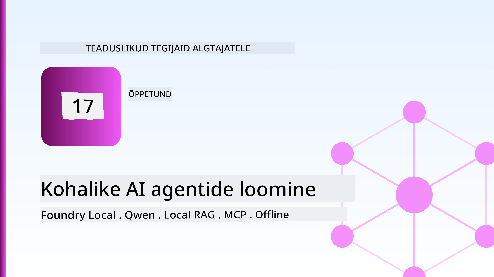
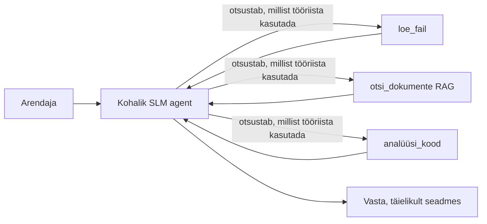
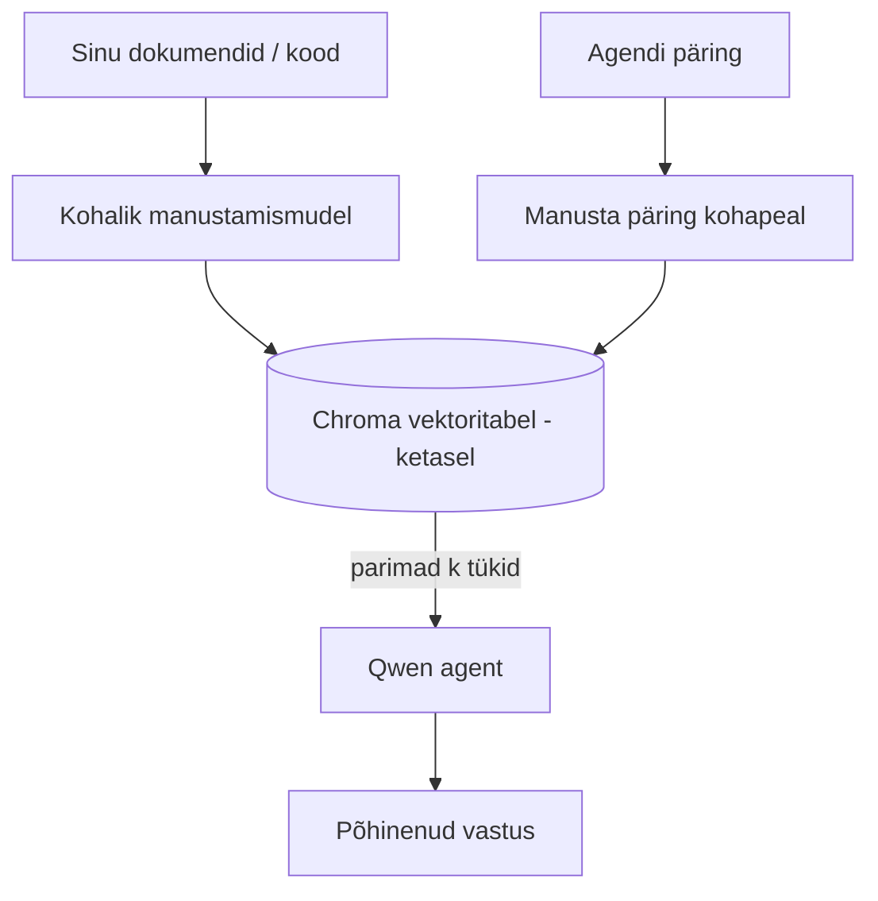
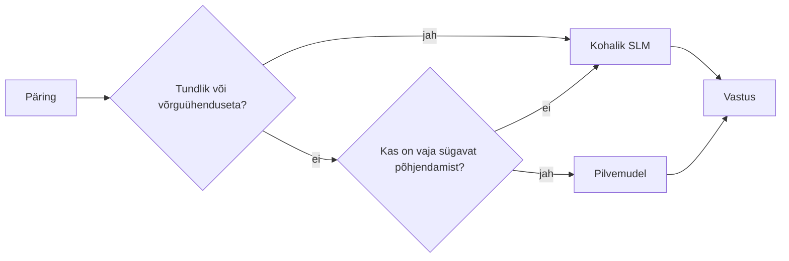

# Kohalike AI-agentide loomine Microsoft Foundry Locali ja Qweniga



Eelmine õppetund skaleeris agente pilve *ülalt üles*. See toob need *alla* ühele masina peale. Lõpuks on teil töötav inseneriassistent, kes põhjendab, kutsub tööriistu, loeb teie faile ja otsib teie dokumentatsiooni — **ilma ühegi pilve inference-kutseta.**

Miks peaks seda tahtma? Kolm põhjust, mis tõusid pidevalt esile päris inseneritöös:

- **Privaatsus.** Kood ja dokumendid ei lahku kunagi masinast. Ükski prompt, koodilõik ega kliendiandmed ei liigu võrgu piiridest välja.
- **Kulu.** Kohalik inference ei maksa iga tokeni eest. Võite terve päeva iteratsioonidega töötada elektriarve hinnaga.
- **Offline.** Lennukis, turvalises rajatises või katkestuse ajal agent töötab siiski.

Münt on see, et te vahetate tipptasemel pilvemudeli **väikese keelemudeli (SLM)** vastu, mis jookseb teie CPU-l, GPU-l või NPU-l. See õppetund käsitleb agentide ehitamist, mis on selles piirangus *head*, selle asemel et teeselda, et piirangut pole.

## Sissejuhatus

See õppetund katab:

- **Väikesed keelemudelid (SLM-id)** — mis need on, kus nad säravad ja kus mitte.
- **Microsoft Foundry Local** — jooksuaeg, mis laeb ja teenindab mudeleid seadmes **OpenAI-ühilduva API** kaudu.
- **Qweni funktsioonikõne mudelid** — SLM-id, mis usaldusväärselt teevad tööriistakõnesid, mis muudab kohaliku *agendi* (mitte ainult kohaliku jutuvestluse) võimalikuks.
- **Kohalikud tööriistad, kohalik RAG ja kohalik MCP** — agenti võimekus ilma pilveta.
- **Hübriidmustrid** — millal hoida asju kohapeal ja millal pilve poole pöörduda.

## Õpieesmärgid

Selle õppetunni lõpetamisel oskate:

- Selgitada SLM-ide kompromisse ja valida sobivad kohalikud agendi kasutuslood.
- Käivitada Qweni mudelit kohapeal Foundry Localiga ja ühendada see OpenAI-ühilduva lõpp-punktiga.
- Ehitada tööriistakõnet tegev agent, mis töötab täielikult teie tööjaamal.
- Lisada kohalik RAG oma dokumentide põhjal, kasutades kohalikku vektoriandmebaasi (Chroma).
- Ühendama agenti kohaliku MCP serveriga ja arutlema hübriidsete kohalike/pilvemudelite disainide üle.

## Eeltingimused

See õppetund eeldab, et olete läbinud varasemad õppetunnid ja tunnete end mugavalt:

- [Tööriistade kasutamine](../04-tool-use/README.md) (4. õppetund) ja [Agentic RAG](../05-agentic-rag/README.md) (5. õppetund).
- [Agent(protocolid) / MCP](../11-agentic-protocols/README.md) (11. õppetund).
- [Microsoft Agent Framework](../14-microsoft-agent-framework/README.md) (14. õppetund).

Samuti on vaja:

- Arendajatööjaam. **8 GB RAM on realistlik miinimum**; 16 GB+ on mugav. GPU või NPU aitab, aga pole nõutud.
- **Microsoft Foundry Local** installitud (vt allpool seadistuse jaotist).
- Python 3.12+ ja paketid repost [`requirements.txt`](../../../requirements.txt), lisaks `foundry-local-sdk`, `openai` ja `chromadb` selle õppetunni jaoks.

## Väikesed keelemudelid: õige tööriist kohaliku töö jaoks

Tipptasemel pilvemudelil on sadu miljardeid parameetreid ja andmekeskus selle taga. SLM-il on paar miljardit parameetrit ja see peab mahtuma teie sülearvuti RAM-i. See vahe seab selged ootused.

**SLM-id sobivad hästi:**

- Struktureeritud, piiratud ülesanded — klassifitseerimine, ekstraktsioon, teadaoleva dokumendi kokkuvõtlik analüüs.
- **Tööriistakõned** — otsustada, millist funktsiooni kutsuda ja milliste argumentidega.
- Kiire, odav, privaatne iteratsioon oma andmete peal.

**SLM-id on nõrgemad:**

- Avatud lõimumisega mitmehüppelised põhjendused suurema konteksti ulatuses.
- Lai maailmateadmine (nad on vähem näinud ja unustavad rohkem).

Seetõttu on kohalike agentide võidustrateegia: **las SLM orkestreerib ja tööriistad teevad raske töö.** Mudelil ei pea olema teie koodibaasi *teadmisi* — ta peab teadma, millal kutsuda `read_file` ja `search_docs`. See mängib SLM-i tugevuste kasuks.



## Microsoft Foundry Local

**Microsoft Foundry Local** on kergekaaluline jooksuaeg, mis laeb, haldab ja teenindab mudeleid täielikult teie masinal. Meile kõige oluline omadus on see, et ta pakub **OpenAI-ühilduvat HTTP-lõpp-punkti** — mis tähendab, et OpenAI SDK ja Microsoft Agent Frameworki OpenAI klient toimivad selle vastu ainult `base_url` muutmisega. Kõik, mida õppisite agentide ehitamisest, kandub üle; ainult lõpp-punkt liigub pilvest `localhost`-i.

Foundry Local valib mudeleid automaatselt vastavalt teie riistvarale — CPU versioon, CUDA/GPU versioon või NPU versioon — nii et te ei pea iga masinat eraldi optimeerima.

### Seadistamine

Installige Foundry Local (vt [dokumentatsiooni](https://learn.microsoft.com/azure/ai-foundry/foundry-local/) oma OS-i kohta) ja kontrollige, kas see töötab:

```bash
# Installi (näide; järgi oma platvormi dokumentatsiooni)
winget install Microsoft.FoundryLocal      # Windows
# brew install microsoft/foundrylocal/foundrylocal   # macOS

# Laadi alla ja käivita Qweni mudel, seejärel alusta kohalikku teenust
foundry model run qwen2.5-7b-instruct
foundry service status
```

Kui teenus töötab, on teil kohalik, OpenAI-ühilduv lõpp-punkt (tavaliselt `http://localhost:PORT/v1`). Märkmik kasutab `foundry-local-sdk` lõpp-punkti automaatseks leidmiseks, nii et te ei pea porti käsitsi määrama.

## Qweni funktsioonikõne: miks see on tähtis

Agent on alles agent, kui ta oskab tööriistu kutsuda. Paljud SLM-id suudavad vestelda, kuid tekitavad ebausaldusväärseid ja vigaseid tööriistakõnesid. **Qwen** mudelid on koolitatud funktsioonikõnedeks ja teevad korrapäraselt hästi vormistatud tööriistakõnesid — just see muudab kohaliku jutuvestlusmudeli kohalikuks *agendiks*.

Voog on standardne tööriistakõne tsükkel, mida te juba teate, ainult et jookseb seadmes:


## Kohalik RAG

Dokumentatsiooniotsing on koht, kus kohalikud agendid ennast tõestavad. SLM-i mälumise asemel saate oma raamatu dokumendid sisestada **kohalikku vektoriandmebaasi** ja lasta agendil vajalikud osad vastavalt vajadusele hankida.

Me kasutame **Chroma't**, sisseehitatud vektoripoodi, mis jookseb protsessis ega vaja eraldi serverit. Töövoog on täielikult kohalik: kohalik sisestusmudel → kohalikud vektorid → kohalik päring → kohalik SLM.



See on sama Agentic RAG muster nagu 5. õppetunnis — ainus erinevus on see, et kõik komponendid jooksevad teie masinal.

## Kohalikud MCP serverid

[MCP](../11-agentic-protocols/README.md) on transpordikiht, mitte pilveteenus. MCP server võib töötada lokaalse protsessina `stdio`-l, andes agentile ligipääsu tööriistadele üle standardprotokolli. See võimaldab taaskasutada kasvavat MCP serverite ökosüsteemi — failisüsteemi ligipääs, git operatsioonid, andmebaasi päringud — täielikult offline.

Turvapoliitika on pilvest erinev, aga mitte puuduv: kohalik MCP server jookseb teie kasutaja õigustes, nii et piirake, mida see võib kasutada (näiteks projekti kataloog, mitte kogu kodukataloog) ja käsitlege selle väljundeid sisenditena kontrollimiseks.

## Hübriidpilve-ja-kohaliku mustrid

Kohapealne esmalt ei tähenda ainult kohapealset. Küpsed süsteemid suunavad tundlikkuse ja raskuse järgi:

| Situatsioon | Kus jookseb |
| --- | --- |
| Tundlik kood / andmed või offline | **Kohalik SLM** |
| Lihtne, piiratud ülesanne | **Kohalik SLM** (odav, kiire) |
| Raske mitmehüppelise põhjenduse ülesanne mitte-tundlike andmete peal | **Pilvemudel** |
| Kõik katkestuse ajal | **Kohalik SLM** (siledalt halvenev) |

See peegeldab 16. õppetunni **mudelite suunamise** ideed — välja arvatud, et üks "mudelitest" on nüüd teie enda masin. Vastupidav disain lülitub pilve puudumisel kohalikule ja agent halveneb kvaliteedis, mitte ei ebaõnnestu täielikult.



## Käed-külge praktika: kohalik inseneriassistent

Avage [`code_samples/17-local-agent-foundry-local.ipynb`](./code_samples/17-local-agent-foundry-local.ipynb) ja töödelge see läbi. Ehitad **kohaliku inseneriassistendi**, mis jookseb täielikult teie tööjaamas ja suudab:

1. **Kutsuda tööriistu** — Qweni funktsioonikõne kaudu Foundry Localis.
2. **Teha kohalikke failitoiminguid** — loetleda ja lugeda faile projekti kataloogis.
3. **Analüüsida koodi** — anda põhilised mõõdikud lähtefaili kohta.
4. **Otsida dokumentatsioonist** — kohalik RAG dokumentide kaustal Chromaga.
5. **Kasutada MCP-d** — ühendada kohaliku MCP serveriga (aeglaselt vahele jätta, kui pole konfigureeritud).

Ühtegi pilve inference'it ei kasutata.

### Läbikäik

Assistent ühineb Foundry Localiga OpenAI-ühilduva lõpp-punkti kaudu, nii et agendi kood on peaaegu identne pilve õppetundidega — ainult klient muutub:

```python
from foundry_local import FoundryLocalManager
from openai import OpenAI

# Foundry Local leiab/laeb mudeli alla ja annab meile kohaliku lõpp-punkti.
manager = FoundryLocalManager(\"qwen2.5-7b-instruct\")
client = OpenAI(base_url=manager.endpoint, api_key=manager.api_key)  # api_key on kohalik kohatäide
```

Tööriistad on tavalised Python-funktsioonid, mis on piiratud projekti kataloogiga:

```python
def read_file(path: str) -> str:
    \"\"\"Read a file, but only inside the sandboxed project directory.\"\"\"
    full = (PROJECT_ROOT / path).resolve()
    if PROJECT_ROOT not in full.parents and full != PROJECT_ROOT:
        return \"Access denied: path is outside the project directory.\"
    return full.read_text(encoding=\"utf-8\")
```

Märkige liivakasti kontroll — isegi kohapeal on tööriist, mis loeb vabalt teid, vastutusrikas. Märkmik piirab iga tööriista ühe projekti juuriga.

## Teadmiste kontroll

Kontrollige mõistmist enne ülesande juurde liikumist.

**1. Too kaks konkreetset põhjust, miks agent kohapeal jooksutada pilve asemel.**

<details>
<summary>Vastus</summary>

Kaks mistahes: **privaatsus** (kood ja andmed ei lahku masinast), **kulu** (pole per-token inference arvet) ja **offline funktsionaalsus** (töötab võrguta — lennukis, turvalises rajatises või katkestuse ajal). Regulatiivsed/piirangud, mis keelavad andmete saatmise välisseadmetele, on privaatsuse põhjuse levinud põhjus.
</details>

**2. Milline on soovitatav tööjaotus SLM-i ja selle tööriistade vahel kohaliku agendi juures ja miks?**

<details>
<summary>Vastus</summary>

Las SLM **orjestreerib** (otsustab, millist tööriista kutsuda ja milliste argumentidega) ning tööriistad **teevad raske töö** (failide lugemine, dokumentide hankimine, tulemuste arvutamine). SLM-id on tugevad piiratud otsustes, nagu tööriistavalik, aga nõrgemad laiaulatusel teadmisel ja pika mitmehüppelise põhjenduse puhul, nii et tuge toetades mängitakse nende tugevustele.
</details>

**3. Mis teeb võimalikuks pilveagentkoodi taaskasutamise Foundry Locali abil?**

<details>
<summary>Vastus</summary>

Foundry Local pakub **OpenAI-ühilduvat HTTP-lõpp-punkti**. OpenAI SDK ja Agent Frameworki OpenAI klient töötavad selle vastu ainult `base_url` muutmisega (kasutades kohalikku asendus API võtit). Kõik muu agendi koodis jääb samaks.
</details>

**4. Miks kasutame just Qweni funktsioonikõnemudelit mitte lihtsalt mõnda muud SLM-i?**

<details>
<summary>Vastus</summary>

Sest agent peab tootma usaldusväärseid ja korrapäraseid **tööriistakõnesid**. Paljud SLM-id suudavad vestelda, kuid annavad välja vigaseid või ebatavalisi tööriistakõne struktuure. Qweni mudelid on koolitatud funktsioonikõnedeks ja toodavad järjepidevaid tööriistakõnesid, mis muudab kohaliku vestlusmudeli töökindlaks kohalikuks agendiks.
</details>

**5. Millised komponendid jooksevad masina peal kohalikus RAG-töövoos?**

<details>
<summary>Vastus</summary>

Kõik: sisestusmudel, vektoriandmebaas (Chroma kettal), päringusamm ja SLM. Dokumendid sisestatakse kohapeal, salvestatakse kohapeal, hangitakse kohapeal ja neile mõtleb kohalik mudel — ükski komponent ei puuduta pilve.
</details>

**6. Kohalik MCP server jookseb teie masinal. Kas see teeb selle automaatselt turvaliseks? Millist ettevaatust peaksite siiski rakendama?**

<details>
<summary>Vastus</summary>

Ei. Kohalik MCP server jookseb teie kasutaja õigustes, nii et see võib puudutada kõike, mida teie kasutaja saab puudutada. Piirake see vajaminevale (näiteks ühele projekti kataloogile, mitte kogu kodukataloogile) ja käsitlege selle väljundeid sisenditena, mida tuleb enne kasutamist valideerida.
</details>

**7. Kirjeldage mõistlikku hübriidset suunamispõhimõtet, mis sisaldab kohalikku mudelit.**

<details>
<summary>Vastus</summary>

Suunake tundlikud või offline päringud kohaliku SLM-i; lihtsad piiratud ülesanded suunake lokaalsetele SLM-idele kiiruse ja kulu tõttu; rasked mitmehüppelised põhjendused mitte-tundlike andmete peal suunake pilvemudelile; tagasi lülituks kohalikule SLM-ile, kui pilv pole saadaval, nii et agent halveneb siledalt, mitte ei ebaõnnestu. See on mudelite suunamine (16. õppetund) koos kohaliku masina lisamisega mudelina.
</details>

**8. Milline on selle õppetunni kohaliku agendi jooksutamiseks realistlik miinimum RAM-i kogus ja mida rohkem RAM-i toob?**

<details>
<summary>Vastus</summary>

Umbes **8 GB** on realistlik miinimum; 16 GB+ on mugav. Rohkem RAM-i võimaldab jooksutada suuremaid, võimekamaid mudeleid ja hoida rohkem konteksti mälus. GPU või NPU kiirendab inference'i, kuid pole nõutav — Foundry Local valib CPU ülesande, kui kiirendajat pole.
</details>

## Ülesanne

Laiendage kohaliku inseneriassistendi funktsioone, et saada **kohalik dokumentatsioonide ülevaataja** väikese projekti jaoks teie valikul (kasutage soovi korral selle repo mõnda õppetundi kausta).

Teie ülesanne peaks sisaldama:

1. **Indekseerima reaalseid dokumendi/koodi kaustu** Chromas (vähemalt viis faili).
2. **Lisama `find_todos` tööriista**, mis skaneerib projekti `TODO`/`FIXME` kommentaaride suhtes ja tagastab need koos faili ja reanumbriga — jättes samasama liivakasti piirangu nagu `read_file`. 

3. **Esitage agendile kolm küsimust**, mis sunnivad teda tööriistu kombineerima: üks puhas RAG-küsimus, üks, mis nõuab konkreetse faili lugemist, ja üks, mis nõuab TODO-de leidmist.
4. **Mõõtke aeg**: ajastage iga kolme vastuse täitmine ja märkige need üles markdown-rakku. Kommenteerige, kas latentsus on teie kavandatud töövoo jaoks aktsepteeritav.

Seejärel kirjutage lühike lõik selle kohta, **mida liigutaksite pilve ja mida hoiaksite lokaalselt** selle hindaja jaoks ning miks. Teid hinnatakse selle järgi, kas lokaalsed komponendid on õigesti ühendatud ja kas teie hübriidne mõtlemine on mõistlik — mitte mudeli kvaliteedi järgi.

## Kokkuvõte

Selles õppetükis ehitasite agendi, mis töötab täielikult teie enda masinas:

- **SLMid** vahetavad ulatuse privaatsuse, kulu ja võrguühenduseta töö vastu — ja säravad siis, kui nad **orkestreerivad tööriistu** selle asemel, et kogu teadmist ise kanda.
- **Foundry Local** teenindab mudeleid seadmel taga **OpenAI-ga ühilduva lõpp-punkti**, nii et teie pilveagendi kood kandub üle ühe rea muutusega.
- **Qwen funktsioonikõnede mudelid** teevad usaldusväärse kohaliku tööriistakõne — ja seega kohalike *agentide* — võimaliku.
- **Kohalik RAG** (Chroma) ja **kohalik MCP** annavad agendile võimekuse ilma masinast lahkumata.
- **Hübriid-mustrid** võimaldavad marsruutimist tundlikkuse ja raskuse järgi, kus kohalik töötlus on sujuv varuplaan.

See lõpetab juurutusarhitektuuri: õppetund 16 skaleeris agente Microsoft Foundry'sse ja see õppetund skaleeris need alla üksikule tööjaamale. Järgmine õppetund keskendub juurutatud agentide turvalisuse hoidmisele.

## Lisamaterjalid

- <a href="https://learn.microsoft.com/azure/ai-foundry/foundry-local/" target="_blank">Microsoft Foundry Local dokumentatsioon</a>
- <a href="https://learn.microsoft.com/azure/ai-foundry/what-is-azure-ai-foundry" target="_blank">Microsoft Foundry dokumentatsioon</a>
- <a href="https://learn.microsoft.com/en-us/agent-framework/overview/?wt.mc_id=youtube_26688_organicsocial_reactor&pivots=programming-language-python" target="_blank">Microsoft Agent Framework</a>
- <a href="https://qwen.readthedocs.io/en/latest/framework/function_call.html" target="_blank">Qwen funktsioonikõnede dokumentatsioon</a>
- <a href="https://modelcontextprotocol.io/" target="_blank">Mudeli konteksti protokoll (MCP)</a>
- <a href="https://docs.trychroma.com/" target="_blank">Chroma vektorandmebaas</a>

## Eelmine õppetund

[Skaleeritavate agentide juurutamine](../16-deploying-scalable-agents/README.md)

## Järgmine õppetund

[AI agentide turvamine](../18-securing-ai-agents/README.md)

---

<!-- CO-OP TRANSLATOR DISCLAIMER START -->
**Lahtiütlus**:
See dokument on tõlgitud kasutades AI tõlketeenust [Co-op Translator](https://github.com/Azure/co-op-translator). Kuigi me püüdleme täpsuse poole, palun pange tähele, et automatiseeritud tõlgetes võib esineda vigu või ebatäpsusi. Originaaldokument selle emakeeles tuleks pidada autoriteetseks allikaks. Olulise teabe puhul soovitatakse kasutada professionaalset inimtõlget. Me ei vastuta selle tõlkega seotud eksimustest või valesti mõistmistest.
<!-- CO-OP TRANSLATOR DISCLAIMER END -->