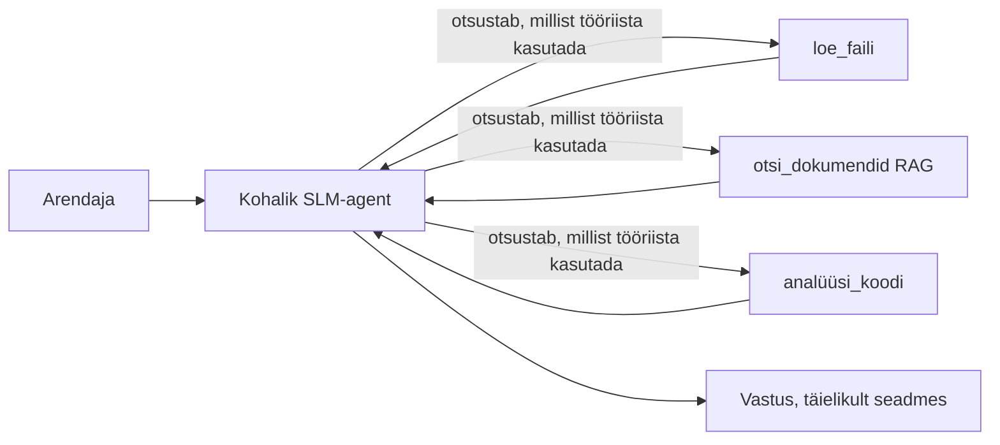
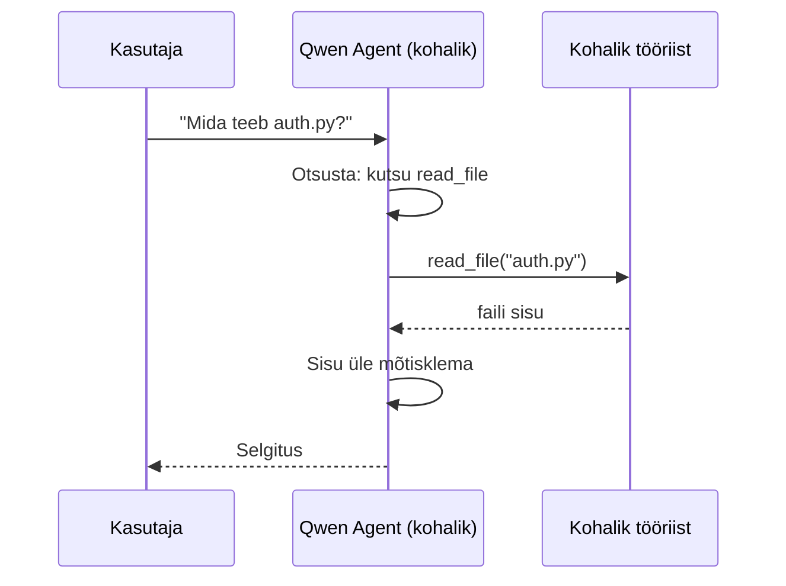
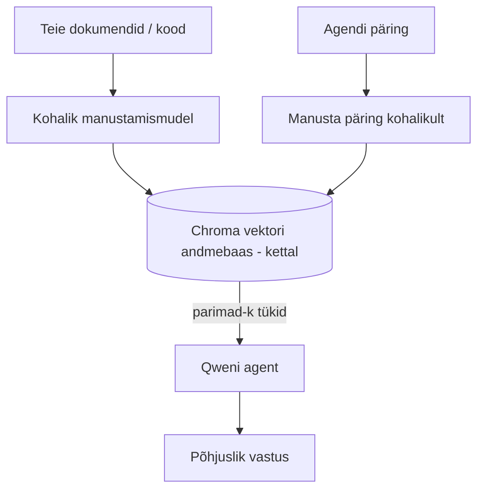
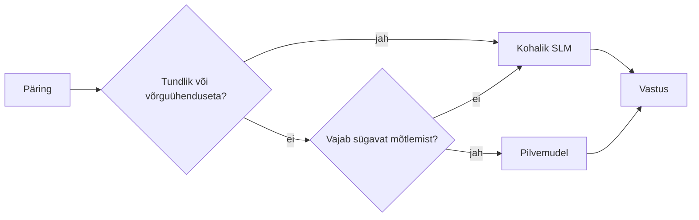

# Kohalike tehisintellekti agentide loomine Microsoft Foundry Locali ja Qweni abil


Eelmine õppetund laiendas agente *pilves*. See õpetus toob need *alla* ühele masinale. Lõpuks on sul töökorras inseneriabi, mis mõtleb, kasutab tööriistu, loeb su faile ja otsib dokumentatsiooni — **ilma ühegi pilvepõhise järelduse päringuta.**

Miks seda soovida? On kolm põhjust, mis reaalses inseneritöös pidevalt ette tulevad:

- **Privaatsus.** Kood ja dokumendid ei lahku kunagi masinast. Ühtki käsku, lõiku ega kliendiandmeid ei saadeta võrgupiiri taha.
- **Maksumus.** Kohalik järeldus ei tekita mingeid tasusid märke kohta. Võid kogu päev katsetada vaid elektri hinna eest.
- **Võrguvabadus.** Lennukis, turvatsoonis või voolukatkestuse ajal agent ikkagi töötab.

Kinni on see, et sa vahetad tipptasemel pilvemudeli välja **väikese keelemudeli (SLM)** vastu, mis jookseb su protsessoril, graafikakaardil või närvivõtmel. See õppetund räägib, kuidas ehitada agente, kes on *head* selle piirangu sees, mitte ette kujutada, et piirangut ei eksisteeri.

## Sissejuhatus

See õppetund käsitleb:

- **Väikesed keelemudelid (SLMid)** — mis need on, kus nad on head ja kus mitte.
- **Microsoft Foundry Local** — jooksuaeg, mis laadib ja teenindab mudeleid seadmel läbi **OpenAI-ühilduva API**.
- **Qweni funktsioonikutsumise mudelid** — SLMid, mis kindlalt toodavad tööriistakutseid, mis muudab kohalikud *agentid* (mitte lihtsalt kohtlused) võimalikuks.
- **Kohalikud tööriistad, kohalik RAG ja kohalik MCP** — andes agendile võimekuse ilma pilvita.
- **Hübriid-mustrid** — millal hoida asjad kohalikud ja millal pöörduda pilve poole.

## Õpieesmärgid

Pärast selle õppetunni läbimist oskad:

- Selgitada SLMide kompromisse ja valida sobivad kohalikud kasutusjuhtumid.
- Pakku Qwen mudeli kohapeal Foundry Localiga ja ühendada sellega OpenAI-ühilduva lõpp-punkti kaudu.
- Ehitada tööriistakutseid kasutav agent, mis jookseb täielikult su töökohal.
- Lisada kohaliku vektordokumendi baasi (Chroma) abil kohalik RAG oma dokumentide jaoks.
- Ühenduda agendiga kohaliku MCP serveri kaudu ja mõtiskleda hübriidse kohaliku/pilvelahenduse üle.

## Eeltingimused

Eeldame, et oled läbinud varasemad õppetunnid ja oskad:

- [Tööriistade kasutamine](../04-tool-use/README.md) (õppetund 4) ja [Agentne RAG](../05-agentic-rag/README.md) (õppetund 5).
- [Agentlikud protokollid / MCP](../11-agentic-protocols/README.md) (õppetund 11).
- [Microsofti agendiraamistik](../14-microsoft-agent-framework/README.md) (õppetund 14).

Vajalik on ka:

- Arendaja töökohamasin. **8 GB RAM on realistlik miinimum**; 16 GB+ on mugav. GPU või NPU aitab, aga pole kohustuslik.
- **Microsoft Foundry Local** installeeritud (vt allpool paigaldusjuhendit).
- Python 3.12+ ja reposti [`requirements.txt`](../../../requirements.txt) paketid ning lisaks `foundry-local-sdk`, `openai` ja `chromadb` selle õppetunni jaoks.

## Väikesed keelemudelid: õige tööriist kohaliku töö jaoks

Tipptasemel pilvemudelil on sadu miljardeid parameetreid ja taga andmekeskus. Väikesel keelemudelil on paar miljardit parameetrit ja see peab mahtuma sinu sülearvuti mällu. See vahe seab selged ootused.

**SLMid on head:**

- Struktureeritud ja piiritletud ülesannetes — klassifitseerimine, info eraldus, kokkuvõtete tegemine tuntud dokumendist.
- **Tööriistakutse tegemine** — otsustada, millist funktsiooni kutsuda ja milliste argumentidega.
- Kiire, odav, privaatne kordamine oma andmetega.

**SLMid on nõrgemad:**

- Avatud lõimestatusega, mitmetasandiline mõtlemine üle suure konteksti.
- Lai maailmateadmine (näha on vähem ja unustatakse rohkem).

Seega on kohalike agentide võidustrateegia: **las SLM koordineerib ja tööriistad teevad raske töö.** Mudelil ei pea olema *teadmist* sinu koodibaasist — ta peab teadma, millal kutsuda `read_file` ja `search_docs`. See mängib täpselt SLMi tugevuste kasuks.



## Microsoft Foundry Local

**Microsoft Foundry Local** on kergekaaluline jooksuaeg, mis laadib, haldab ja teenindab mudeleid täielikult su masinal. Meie jaoks on tähtsaim omadus, et see pakub **OpenAI-ühilduvat HTTP lõpp-punkti** — mis tähendab, et OpenAI SDK ja Microsoft Agent Frameworki OpenAI klient töötavad selle vastu vaid muutes `base_url`. Kõik agentide loomise teadmised on otse rakendatavad; ainult lõpp-punkt nihkub pilvest `localhost`i.

Foundry Local valib automaatselt sobivaima mudeli ehituse sinu riistvarale — kas CPU, CUDA/GPU või NPU — nii ei pea sa iga masina jaoks käsitsi optimeerima.

### Paigaldus

Paigalda Foundry Local (vt [dokumentatsiooni](https://learn.microsoft.com/azure/ai-foundry/foundry-local/) oma operatsioonisüsteemi kohta), seejärel kinnita, et töötab:

```bash
# Paigalda (näiteks; järgi oma platvormi juhiseid)
winget install Microsoft.FoundryLocal      # Windows
# brew install microsoft/foundrylocal/foundrylocal   # macOS

# Laadi alla ja käivita Qweni mudel, seejärel alusta lokaalteenust
foundry model run qwen2.5-7b-instruct
foundry service status
```

Kui teenus töötab, on sul olemas kohalik OpenAI-ühilduv lõpp-punkt (tavaliselt `http://localhost:PORT/v1`). Märkmik kasutab `foundry-local-sdk` automaatseks lõpp-punkti avastamiseks, nii et porti ei pea käsitsi kodeerima.

## Qweni funktsioonikutsumine: miks see oluline on

Agent on agent ainult siis, kui ta oskab tööriistu kutsuda. Paljud SLMid oskavad suhelda, kuid toodavad ebausaldusväärseid ja valesti vormistatud tööriistakutseid. **Qwen** mudelid on koolitatud funktsioonikutsumiseks ja toodavad järjekindlalt õigesti vormistatud tööriistakutseid — mis teeb kohalikust vestlusmudelist tõelise *agendi*.

Töövoog on juba teada-tuntud tööriistakutseloop, lihtsalt jooksutatakse otse seadmel:



## Kohalik RAG

Dokumentatsiooni otsing on koht, kus kohalikud agentid ennast tõestavad. Selle asemel, et loota SLMi mälu peale, sulandad need dokumendid kohalikku **vektorandmebaasi** ja lased agendil vajadusel sobivad tükid üles otsida.

Kasutame **Chromat**, sisseehitatud vektorpoodi, mis jookseb protsessis ega vaja serverit. Taim on täiesti kohalik: kohalik embeding mudel → kohalikud vektorid → kohalik otsing → kohalik SLM.



See on sama Agentic RAG-muster nagu õppetund 5 — ainus erinevus on see, et kõik komponendid jooksevad su masinal.

## Kohalikud MCP serverid

[MCP](../11-agentic-protocols/README.md) on transpordikiht, mitte pilveteenus. MCP server võib jooksutada kohaliku protsessina `stdio`l, pakkudes tööriistu su agendile standardprotokolli kaudu. See võimaldab taaskasutada kasvavat MCP serverite ökosüsteemi — failisüsteemi ligipääs, git-operatsioonid, andmebaasipäringud — täiesti võrguvabalt.

Turvalisus on erinev pilvest, aga mitte puuduv: kohalik MCP server jookseb su kasutaja õigustega, seega piira, mida ta võib puudutada (nt projekti kaust, mitte kogu kodukaust) ja käsitle selle väljundeid sisenditena, mida vajadusel valideerida.

## Hübriidsed pilve- ja kohalikud mustrid

Esmalt kohalik pole sama, mis ainult kohalik. Küpsed süsteemid marsruutivad tundlikkuse ja keerukuse alusel:

| Situatsioon | Kus jookseb |
| --- | --- |
| Tundlik kood/andmed või võrguvaba | **Kohalik SLM** |
| Lihtne, piiritletud ülesanne | **Kohalik SLM** (odav, kiire) |
| Raske mitmetasandiline mõtlemine mitte-tundlikel andmetel | **Pilvemudel** |
| Kõik, katkestuse ajal | **Kohalik SLM** (läbimõeldud degradeerumine) |

See peegeldab **mudeleid marsruutimise** ideed õppetundist 16 — ainult et üks „mudelitest“ on nüüd sinu enda masin. Vastupidav disain lülitub pilve puudumisel automaatselt kohalikule, nii et agent halveneb kvaliteedis, mitte ei vea alt.



## Praktiline ülesanne: Kohalik inseneriabimees

Ava [`code_samples/17-local-agent-foundry-local.ipynb`](./code_samples/17-local-agent-foundry-local.ipynb) ja tööta sellega. Ehita **kohalik inseneriabimees**, mis jookseb su töökohal ja suudab:

1. **Kutsuda tööriistu** — Qweni funktsioonikutsumise kaudu Foundry Localiga.
2. **Teha kohalikke failitöid** — listida ja lugeda faile projekti kaustast.
3. **Analüüsida koodi** — anda lihtsad mõõdikud lähtefailist.
4. **Otsida dokumentatsioonist** — kohalik RAG dokumentide kaustas Chromat kasutades.
5. **Kasutada MCPd** — ühendada kohaliku MCP serveriga (kerge vahelejätmisega, kui pole konfigureeritud).

Ühtegi pilvepõhist järeldust ei tehta.

### Läbikäik

Assistendil on ühendus Foundry Localiga OpenAI-ühilduva lõpp-punkti kaudu, nii et agendi kood näeb peaaegu pilveteemaliste õppetundide moodi välja — ainult klient vahetub:

```python
from foundry_local import FoundryLocalManager
from openai import OpenAI

# Foundry Local leiab/laadib mudeli alla ja annab meile kohaliku lõpp-punkti.
manager = FoundryLocalManager(\"qwen2.5-7b-instruct\")
client = OpenAI(base_url=manager.endpoint, api_key=manager.api_key)  # api_key on kohalik kohthoidja
```

Tööriistad on tavapärased Pythoni funktsioonid, mis piiritletud projekti kaustaga:

```python
def read_file(path: str) -> str:
    \"\"\"Read a file, but only inside the sandboxed project directory.\"\"\"
    full = (PROJECT_ROOT / path).resolve()
    if PROJECT_ROOT not in full.parents and full != PROJECT_ROOT:
        return \"Access denied: path is outside the project directory.\"
    return full.read_text(encoding=\"utf-8\")
```

Märka liivakasti-kontrolli — isegi kohapeal on tööriist, mis loeb suvalisi teid, risk. Märkmik hoiab iga tööriista piiratuna ühele projekti juurele.

## Teadmiste kontroll

Testi oma arusaamist enne ülesande lahendamist.

**1. Too kaks konkreetset põhjust, miks agent tööle panna kohapeal, mitte pilves.**

<details>
<summary>Vastus</summary>

Kõik kaks järgnevatest: **privaatsus** (kood ja andmed ei lahku masinast), **kulud** (ei maksa märgi kohta järelduse eest) ja **võrguvabadus** (töötab ilma võrguühenduseta — lennukis, turvatsoonis või voolukatkestuse ajal). Regulatiivsed ja vastavusnõuded, mis keelavad andmeid seadmeväliselt saatmast, on tihti privaatsuse põhjuseks.
</details>

**2. Kuidas on SLM ja selle tööriistade tööjaotus kohaliku agendi puhul ning miks?**

<details>
<summary>Vastus</summary>

Lase SLMil **koordineerida** (otsustada, mida ja kuidas kutsuda) ning lase **tööriistadel teha raske töö** (failide lugemine, dokumentide otsimine, arvutamine). SLMid on head piiritletud otsustes (nt tööriista valik) aga nõrgemad laiema teadmisruumi ja pika mitmeastmelise mõtlemisega, seega tugineda tööriistadele on nende tugevus.
</details>

**3. Miks on võimalik taaskasutada pilveagentide koodi Foundry Localiga?**

<details>
<summary>Vastus</summary>

Foundry Local pakub **OpenAI-ühilduvat HTTP lõpp-punkti**. OpenAI SDK ja agendiraamistiku OpenAI klient töötavad selle vastu ainult muutes `base_url` (kasutades kohalikku asendust API võtmele). Kõik muu agentkoodis jääb samaks.
</details>

**4. Miks kasutame just Qweni funktsioonikutsumist, mitte suvalist SLMi?**

<details>
<summary>Vastus</summary>

Sest agent peab tootma usaldusväärseid ja hästi vormistatud **tööriistakutseid**. Paljud SLMid oskavad vestelda, aga toodavad valevormis või ebajärjekindlaid tööriistakutseid. Qweni mudelid on koolitatud funktsioonikutsumiseks ja toodavad järjekindlaid tööriistakutseid, mis teeb kohalikust vestlussüsteemist toimiva agendi.
</details>

**5. Millised komponendid jooksevad masinal kohaliku RAG pipelinis?**

<details>
<summary>Vastus</summary>

Kõik: embeding-mudel, vektordata baas (Chroma kettal), otsinguetapp ja SLM. Dokumendid embedditakse kohapeal, salvestatakse kohapeal, leitakse kohapeal ja SLM paneb neile mõtlema — ükski komponent ei puutu pilve.
</details>

**6. Kohalik MCP server töötab su masinal. Kas see teeb selle automaatselt turvaliseks? Milliseid ettevaatusabinõusid peaksid siiski kasutama?**

<details>
<summary>Vastus</summary>

Ei. Kohalik MCP server töötab su kasutaja õigustes, nii et pääseb ligi kõikjale, kuhu sinu kasutaja pääseb. Piira teda vaid sellele, mida ta vajab (nt ühele projekti kaustale, mitte tervele kodukaustale) ja käsitle selle väljundeid nagu sisendeid, mida enne kasutamist peaks valideerima.
</details>

**7. Kirjelda mõistlikku hübriidset marsruutimise reeglit, mis hõlmab lokaalset mudelit.**

<details>
<summary>Vastus</summary>

Saada tundlikud või võrguvabad päringud kohalikule SLMile; saada lihtsad ja piiritletud ülesanded kohalikule SLMile kiiruse ja maksumuse tõttu; saada keerukas mitmesammuline mõtlemine mitte-tundlikel andmetel pilvemudelile; ja lülitu pilve puudumisel tagasi kohalikule SLMile nii, et agent degradeerub sujuvalt, mitte ei vea alt. See on mudelite marsruutimine (õppetund 16) kus ühe mudelina on sinu masin.
</details>

**8. Mis on selle õppetunni kohaliku agendi jooksutamiseks realistlik miinimum RAM maht ja mida rohkem RAMi annab?**

<details>
<summary>Vastus</summary>

Ligikaudu **8 GB** on realistlik miinimum; 16 GB+ on mugav. Rohkem RAMi võimaldab jooksutada suuremaid ja võimekamaid mudeleid ning hoida rohkem konteksti mälus. GPU või NPU kiirendab järeldust, aga pole kohustuslik — Foundry Local valib CPU ehituse, kui kiirendajat pole.
</details>

## Ülesanne

Laienda kohaliku inseneriabi rakendus **kohalikuks dokumentatsiooni vaatlejaks** väikese valitud projekti jaoks (kasuta soovi korral mõnda selle reposti õppetundide kaustadest).

Sinu lahendus peaks:

1. **Indekseerima reaalse dokumendi/koodi kausta** Chromasse (vähemalt viis faili).
2. **Lisama `find_todos` tööriista**, mis skaneerib projekti `TODO`/`FIXME` kommentaaride leidmiseks ja tagastab need koos faili ja rea numbriga — säilitades sama liivakasti kontrolli nagu `read_file`.

3. **Esitage agendile kolm küsimust**, mis sunnivad seda tööriistu kombineerima: üks puhas RAG-küsimus, üks, mis nõuab konkreetse faili lugemist, ja üks, mis nõuab TODOde leidmist.
4. **Mõõtke see**: aeglustage iga kolme vastuse aeg ja märkige see markdown-rakku. Kommenteerige, kas latentsus on teie planeeritud töövoo jaoks aktsepteeritav.

Kirjutage seejärel lühike lõik **mida te pilve viiksite ja mida hoiaksite lokaalselt** selle hindaja jaoks ning miks. Teid hinnatakse selle järgi, kas lokaalsed komponendid on õigesti omavahel ühendatud ja kas teie hübriidne mõtlemine on põhjendatud — mitte mudeli kvaliteedi järgi.

## Kokkuvõte

Selles õppetükis ehitasite agendi, mis töötab täielikult teie enda masinal:

- **SLM-id** vahetavad laiaulatuslikkuse privaatsuse, hinna ja võrguühenduseta töö eest — ja paistavad silma, kui nad **orkestreerivad tööriistu** selle asemel, et kogu teadmist endas kanda.
- **Foundry Local** teenindab mudeleid seadmes OpenAI-ga ühilduva lõpp-punkti taga, nii et teie pilveagendi kood kandub üle ühe reaga.
- **Qwen funktsioonikutsumise mudelid** võimaldavad usaldusväärset kohaliku tööriista kutsumist — ja seega kohalikke *agente*.
- **Lokaalne RAG** (Chroma) ja **lokaalne MCP** annavad agendile võimekuse ilma masina juurest lahkumata.
- **Hübriidmudelid** lasevad marsruutida tundlikkuse ja raskusastme järgi, kus lokaalne on peen langusvariant.

Sellega lõpeb juurutuse ring: Õppetund 16 skaleeris agendid Microsoft Foundrysse ja see õppetund skaleeris neid ühele tööjaamale. Järgmine õppetund keskendub juurutatud agentide turvalisusele.

## Täiendavad ressursid

- <a href="https://learn.microsoft.com/azure/ai-foundry/foundry-local/" target="_blank">Microsoft Foundry Local dokumentatsioon</a>
- <a href="https://learn.microsoft.com/azure/ai-foundry/what-is-azure-ai-foundry" target="_blank">Microsoft Foundry dokumentatsioon</a>
- <a href="https://learn.microsoft.com/en-us/agent-framework/overview/?wt.mc_id=youtube_26688_organicsocial_reactor&pivots=programming-language-python" target="_blank">Microsoft Agent Framework</a>
- <a href="https://qwen.readthedocs.io/en/latest/framework/function_call.html" target="_blank">Qweni funktsioonikutsumise dokumentatsioon</a>
- <a href="https://modelcontextprotocol.io/" target="_blank">Model Context Protocol (MCP)</a>
- <a href="https://docs.trychroma.com/" target="_blank">Chroma vektorandmebaas</a>

## Eelmine õppetund

[Skaleeritavate agentide juurutamine](../16-deploying-scalable-agents/README.md)

## Järgmine õppetund

[AI agentide turvamine](../18-securing-ai-agents/README.md)

---

<!-- CO-OP TRANSLATOR DISCLAIMER START -->
**Lahtiütlus**:
See dokument on tõlgitud kasutades AI tõlketeenust [Co-op Translator](https://github.com/Azure/co-op-translator). Kuigi me püüdleme täpsuse poole, palun pange tähele, et automatiseeritud tõlgetes võib esineda vigu või ebatäpsusi. Originaaldokument selle emakeeles tuleks pidada autoriteetseks allikaks. Olulise teabe puhul soovitatakse kasutada professionaalset inimtõlget. Me ei vastuta selle tõlkega seotud eksimustest või valesti mõistmistest.
<!-- CO-OP TRANSLATOR DISCLAIMER END -->