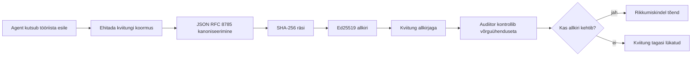
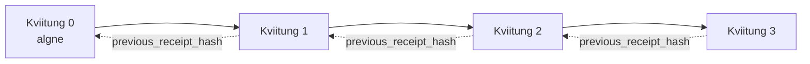

[Vaata õppetunni videot: AI agentide turvamine krüptograafiliste tõenditega](https://youtu.be/PLACEHOLDER_VIDEO_ID)

> _(Õppetunni video ja pisipilt lisatakse pärast liitmist Microsofti sisutiimi poolt, vastavalt õppetunni 14 / 15 mustrile.)_

# AI Agentide turvamine krüptograafiliste tõenditega

## Sissejuhatus

Selles õppetunnis käsitletakse:

- Miks on AI agentide auditeerimislogid olulised vastavuse, silumise ja usalduse jaoks.
- Mis on krüptograafiline tõend ja kuidas see erineb allkirjastamata logireast.
- Kuidas toota allkirjastatud tõendit agendi tööriistakutse jaoks tavalises Pythoni keeles.
- Kuidas tõendit võrrelda võrguühenduseta ja tuvastada muutmisi.
- Kuidas tõendeid ahelasse siduda nii, et ühe eemaldamine või järjekorra muutmine katkestab ahela.
- Mida tõendid tõendavad ja mida need otseselt ei tõenda.

## Õpieesmärgid

Pärast selle õppetunni läbimist oskad:

- Tuvastada ebaõnnestumistemaatikat, mis motiveerib krüptograafilist päritolutõendust agendi tegevuste puhul.
- Toota Ed25519 allkirjastatud tõendit kanonilise JSON-payload'i üle.
- Kontrollida tõendit iseseisvalt ainult allkirjastaja avaliku võtmega.
- Tuvastada mahasõidu katset, käivitades muutunud tõendi korral uuesti kontrolli.
- Koostada räsi-ahelaga järjestatud tõendite jada ja selgitada, miks ahel on oluline.
- Eristada, mida tõendid tõendavad (autentimine, terviklikkus, järjekord) ja mida mitte (tegevuse õigsus, poliitika korrektne järgimine).

## Probleem: Sinu agendi auditeerimislogi

Kujuta ette, et oled juurutanud AI agendi Contoso Travelile. Agent loeb kliendi päringuid, kutsub lennupileti API-t valikute leidmiseks ning broneerib kohad kliendi eest. Eelmisel kvartalil töötles agent 50 000 broneeringut.

Täna tuleb audiitor. Ta esitab lihtsa küsimuse: "Näita, mida sinu agent tegi."

Sa annad üle logifailid. Audiitor vaatab need üle ja esitab keerulisema küsimuse: "Kuidas ma tean, et neid logisid ei ole muudetud?"

See on auditeerimislogi probleem. Enamik tänapäevaseid agentide juurutusi toetub:

- **Rakenduse logidele**: mida agent ise kirjutab, mida saab muuta kõigil, kellel on failisüsteemile ligipääs.
- **Pilvelogimis teenustele**: platvormil vigadele avatud, kuid ainult juhul, kui audiitor usaldab platvormi haldajat.
- **Andmebaasi tehingulogidele**: sobivad andmebaasi muudatuste jaoks, aga mitte suvaliste tööriistakutsete jaoks.

Ükski neist ei suuda audiitori küsimusele vastata ilma audiitori usaldust nõudmata (sind, sinu pilveteenuse pakkujat, andmebaasipakkujat). Sisemise kasutuse puhul on see sageli vastuvõetav. Reguleeritud töökoormuste puhul (finants, tervishoid, kõik Euroopa Liidu AI seaduse alusel) mitte.

Krüptograafilised tõendid lahendavad selle, muutes iga agendi tegevuse iseseisvalt kontrollitavaks. Audiitor ei pea sind usaldama. Vajalik on ainult sinu avalik võti ja tõend ise.

## Mis on krüptograafiline tõend?

Tõend on JSON-objekt, mis salvestab, mida agent tegi, ning on allkirjastatud digitaalse allkirjaga.



Minimaalne tõend näeb välja selline:

```json
{
  "type": "agent.tool_call.v1",
  "agent_id": "contoso-travel-bot",
  "tool_name": "lookup_flights",
  "tool_args_hash": "sha256:a3f9c1...",
  "result_hash": "sha256:7b2e1d...",
  "policy_id": "contoso-travel-policy-v3",
  "timestamp": "2026-04-25T14:30:00Z",
  "sequence": 47,
  "previous_receipt_hash": "sha256:9d4e6a...",
  "signature": {
    "alg": "EdDSA",
    "sig": "c5af83...",
    "public_key": "8f3b2c..."
  }
}
```

Kolm omadust teevad töö:

1. **Allkiri**. Tõendi allkirjastab agendi värav Ed25519 privaatvõtmega. Igaüks, kellel on vastav avalik võti, saab allkirja võrguühenduseta kontrollida. Väljade muutmine teeb allkirja kehtetuks.

2. **Kanoniline kodeerimine**. Enne allkirjastamist serialiseeritakse tõend JSON Kanoniseerimise Skeemi (JCS, RFC 8785) abil. See tagab, et kaks poolt toodetud sama loogilise tõendi implementatsiooni annavad täpselt samad baitide jadad. Ilma kanoniseerimiseta toodaksid erinevad JSON serialisaatorid sama sisu jaoks erinevaid allkirju.

3. **Räsi-ahel**. `previous_receipt_hash` väli seob iga tõendi eelmisega. Tõendi eemaldamine või järjekorra muutmine katkestab kõik hiljem omavahel seotud tõendid. Muutmised muutuvad nähtavaks ahela tasandil isegi siis, kui ühekaupa allkirju ignoreerida.

Koos tagavad need omadused kolm garantiid:

- **Autentimine**: see võti allkirjastas selle sisu.
- **Terviklikkus**: sisu ei ole pärast allkirjastamist muutunud.
- **Järjestus**: see tõend tuli ahelas pärast eelmist tõendit.

## Tõendi tootmine Pythoni keeles

Tõendi tootmiseks ei ole vaja spetsiaalset teeki. Krüptograafilised primitiivid on laialdaselt kättesaadavad ja loogika on mõnisada rida Pythonit.

Käed-külge harjutused failis `code_samples/18-signed-receipts.ipynb` läbivad kogu protsessi. Kokkuvõte:

```python
import json
import hashlib
import base64
from nacl import signing
from jcs import canonicalize  # RFC 8785 kanoniline JSON

def b64url_nopad(data: bytes) -> str:
    return base64.urlsafe_b64encode(data).decode("ascii").rstrip("=")

def sha256_canonical(obj) -> str:
    """SHA-256 of a Python object's JCS-canonical JSON form."""
    return f"sha256:{hashlib.sha256(canonicalize(obj)).hexdigest()}"

# Genereeri või laadi allkirjastamise võti (tootmises salvesta võtmekeldrisse)
signing_key = signing.SigningKey.generate()
verify_key = signing_key.verify_key

# Koosta kviitungi andmepakett (veel allkirjata)
tool_args = {"origin": "SYD", "destination": "LAX"}
tool_result = [{"flight": "QF11", "price": 1850, "stops": 0}]

payload = {
    "type": "agent.tool_call.v1",
    "agent_id": "contoso-travel-bot",
    "tool_name": "lookup_flights",
    "tool_args_hash": sha256_canonical(tool_args),
    "result_hash": sha256_canonical(tool_result),
    "policy_id": "contoso-travel-policy-v3",
    "timestamp": "2026-04-25T14:30:00Z",
    "sequence": 0,
    "previous_receipt_hash": None,
}

# Kanoniseeri, räsi, allkirjasta.
canonical_bytes = canonicalize(payload)
message_hash = hashlib.sha256(canonical_bytes).digest()
signature_bytes = signing_key.sign(message_hash).signature

# Lisa struktureeritud allkirjaobjekt.
receipt = {
    **payload,
    "signature": {
        "alg": "EdDSA",
        "sig": b64url_nopad(signature_bytes),
        "public_key": b64url_nopad(bytes(verify_key)),
    },
}
```

See on kogu allkirjastamise töövoog. Märkmikus selgitatakse iga sammu.

## Tõendi kontrollimine ja manipulatsiooni tuvastamine

Kontroll on vastupidine protsess:

```python
import base64
import hashlib
from nacl import signing
from nacl.exceptions import BadSignatureError
from jcs import canonicalize

def b64url_decode(s: str) -> bytes:
    padding = "=" * ((4 - len(s) % 4) % 4)
    return base64.urlsafe_b64decode(s + padding)

def verify_receipt(receipt: dict) -> bool:
    # Allkiri on struktureeritud objekt: {"alg", "sig", "public_key"}.
    sig_obj = receipt.get("signature")
    if not sig_obj or sig_obj.get("alg") != "EdDSA":
        return False

    # Taasta tegelikult allkirjastatud sisu (kõik peale allkirja).
    payload = {k: v for k, v in receipt.items() if k != "signature"}

    canonical_bytes = canonicalize(payload)
    message_hash = hashlib.sha256(canonical_bytes).digest()

    try:
        verify_key = signing.VerifyKey(b64url_decode(sig_obj["public_key"]))
        verify_key.verify(message_hash, b64url_decode(sig_obj["sig"]))
        return True
    except BadSignatureError:
        return False
```

See funktsioon võtab tõendi ja tagastab `True`, kui allkiri on kehtiv, vastasel juhul `False`. Mitte ühtki võrguühendust, mitte ühtegi teenuse sõltuvust, ei ole vaja kolmanda osapoole usaldamiseks.

Manipulatsiooni tuvastamiseks teeb märkmik järgmist:

1. Tootab kehtiva tõendi ja kinnitab selle kontrollimist.
2. Muudab `tool_args_hash` välja ühe baiti.
3. Käivitab uuesti kontrolli ja näeb, et see ebaõnnestub.

See on praktiline näide, et tõendid on muutmise suhtes nähtavad: iga muutus, ükskõik kui väike, rikub allkirja.

## Mitmeastmeliste agentide tõendite ahelaks sidumine

Üks allkirjastatud tõend kaitseb ühte tegevust. Tõendite ahel kaitseb järjestust.



Iga tõend salvestab eelmise tõendi räsi. Kui ründaja tahab vaikselt eemaldada teise tõendi, peab ta kas:

- Muutma tõendi 3 `previous_receipt_hash` välja (lõhub tõendi 3 allkirja), VÕI
- Võltsima uue allkirja muudetud tõendile 3 (vajab agendi privaatvõtit).

Kui privaatvõti on riistvaralises võtmehoidlas ja avaliku võtme avalikustamine toimub iga tõendiga, ei ole kumbki rünnak võimalik ilma avastamata.

Märkmik demonstreerib:

1. Kuidas luua kolmekohaline tõendite ahel.
2. Kontrollida, kas iga tõendi `previous_receipt_hash` vastab tegeliku eelneva tõendi räsidele.
3. Muutmist ahela keskel ja näeb, kuidas ahel täpselt seal katkeb.

See on viis, kuidas luua auditeerimislogi, mida väline audiitor saab kontrollida ilma sind usaldamata.

## Mida tõendid tõendavad (ja mida mitte)

See on õppetunni kõige olulisem osa. Tõendid on võimsad, kuid nende võimsus on piiratud.

**Tõendid tõendavad kolme asja:**

1. **Autentimine**: konkreetne võti allkirjastas konkreetse sisu.
2. **Terviklikkus**: sisu ei ole allkirjastamise järel muutunud.
3. **Järjestus**: see tõend tuli pärast eelmise tõendi ahelas.

**Tõendid EI tõenda:**

1. **Õigsust**: et agendi tegevus oli õige tegevus. Tõendit saab allkirjastada sama puhtalt nii valede kui ka õige vastuse jaoks.
2. **Poliitika järgimist**: et väljal `policy_id` märgitud poliitikat tegelikult hinnati või et see oleks tegevuse heaks kiitnud. Tõend salvestab väite, mitte jõustamist.
3. **Isikut väljaspool võtit**: tõend ütleb "see võti allkirjastas selle sisu." See ei ütle, et "see inimene volitas selle." Võtme sidumine isiku või organisatsiooniga vajab eraldi identiteeditaristut (kataloog, avalike võtmete register jms).
4. **Sisendite tõepärasust**: kui agent saab manipuleeritud sisendi ja tegutseb selle põhjal, salvestab tõend tegevuse truult. Tõendid on allikas sisendite valideerimisele, mitte asenduseks.

See piir on oluline kahes mõttes:

- See ütleb, milleks tõendid kasulikud on: muuta agentide käitumine auditeeritavaks ja manipuleerimiskindlaks, isegi organisatsioonide vahel.
- See ütleb, milliseid lisakihte on veel vaja: sisendi valideerimine (õppetund 6), poliitika jõustamine (allpool veidi puudutatud) ja identiteeditaristu (väljas selle õppetunni ulatusest).

Levinud viga on arvata, et "meil on tõendid" tähendab "me juhime." Ei tähenda. Tõendid on alus. Juhimine on süsteem, mille ehitad selle peale.

## Tootmisviited

Selles õppetunnis on Python kood teadlikult minimaalne, et saaksid lugeda iga rea ja mõista täpselt, mis toimub. Tootmiskasutuses on sul kaks võimalust:

1. **Tee otsene töö krüptograafiliste primitiividega.** Ülal nähtud 50 rida sobivad paljudele kasutusjuhtumitele. PyNaCl (Ed25519) ja `jcs` pakett (kanoniline JSON) on hästi hooldatud ja auditeeritud teegid.

2. **Kasuta tootmistõendite teeki.** Mitmed avatud lähtekoodiga projektid rakendavad sama mustrit lisafunktsioonidega (võtme rotatsioon, paketitud kontroll, JWK komplekti levitus, poliitikamootoritega integratsioon):
   - Selles õppetunnis kasutatav tõendi formaat järgib IETF Internet-Draft'i (`draft-farley-acta-signed-receipts`), mis on hetkel standardite protsessis.
   - Microsoft Agent Governance Toolkit seob tõendid Cedar-põhiste poliitikakokkulepetega; vaata näidisena juhendit 33 vastavas repositooriumis.
   - `protect-mcp` (npm) ja `@veritasacta/verify` (npm) pakuvad Node rakenduse tõendite allkirjastamiseks ja võrguühenduseta kontrollimiseks, et pakkida iga MCP server manipuleerimise kindla auditeerimislogiga.
   - **[nobulex](https://github.com/arian-gogani/nobulex)** Pythoni SDK (`pip install nobulex`) pakub sama Ed25519 + JCS allkirjastamise mustrit Pythonis koos LangChain ja CrewAI integratsioonidega, sisaldades avaldatud ristkontrollveskektorid ja vastavuskaardi panuse läbi [OWASP PR #2210](https://github.com/OWASP/CheatSheetSeries/pull/2210).

Otsus kirjutada oma teek vs kasutada olemasolevat on võrreldav otsusega kirjutada oma JWT raamatukogu versus kasutada testitud raamatukogu: mõlemad on mõistlikud; teek säästab aega ja vähendab auditeerimispinda; nullist ülesehitus sunnib mõistma iga primitiivi. See õppetund õpetab nullist lähenemist, et sul oleks alus mõlema valiku jaoks.

## Teadmiste kontroll

Testi oma arusaamist enne praktikat.

**1. Tõend on allkirjastatud agendi privaatse Ed25519 võtmega. Audiitoril on ainult avalik võti. Kas audiitor saab tõendi võrguühenduseta kontrollida?**

<details>
<summary>Vastus</summary>

Jah. Ed25519 kontrolliks on vaja ainult avalikku võtit ja allkirjastatud baite. Ei mingit võrguühendust, teenus- ega kolmandate osapoolte usaldust. See omadus muudab tõendid kasulikuks õhuldistega, mitme organisatsiooni või madala usaldustasemega auditeerimiskeskkondades.
</details>

**2. Ründaja muudab tõendi `policy_id` välja, väites, et seda valitses lubavam poliitika. Allkiri oli tehtud algse payload'i peal. Mis kontrolli käigus juhtub?**

<details>
<summary>Vastus</summary>

Kontroll ebaõnnestub. Allkiri arvutati kanoniliste baitide peal originaalsetest andmetest; iga välja muutmine muudab kanonilisi baite, mis muudab SHA-256 räsi ning teeb allkirja kehtetuks. Ründajal oleks vaja privaatvõtit, et luua uus kehtiv allkiri, mida tal pole.
</details>

**3. Miks sisaldab tõend `tool_args_hash` ja `result_hash`, mitte otse argumente ja tulemust?**

<details>
<summary>Vastus</summary>

Kahe põhjusel. Esiteks, tõend võidakse arhiveerida või edastada keskkondades, kus otse sisu lekkimine (isiklik info, ärimäärangud) on probleem. Räsi hoiab tõendi väiksemana ja sisu privaatsemana; audiitor kontrollib räsiväärtust eraldi hoitud tegeliku sisuga. Teiseks, räside pikkus on fikseeritud, mistõttu on tõendi maht piiratud sõltumata sisendi ja väljundi suurusest.
</details>

**4. `previous_receipt_hash` ühendab iga tõendi eelkäijaga. Kui ründaja kustutab ahelas ühe tõendi vaikselt, mis lakkab kehtimast?**

<details>
<summary>Vastus</summary>

Iga hiljem jõudev tõend. Nende `previous_receipt_hash` väljad ei vasta enam ahelale (kuna viidatavat tõendit enam ei ole või ahel osutab nüüd teisele eelkäijale). Kustutuse varjamiseks peaks ründaja allkirjastama uuesti kõik hilisemad tõendid, mis nõuab privaatvõtit.
</details>

**5. Tõend on kenasti kontrollitud. Kas see tõendab, et agendi tegevus oli õige, asjakohane või poliitikale vastav?**

<details>
<summary>Vastus</summary>

Ei. Kehtiv tõend tõendab kolme asja: autentimist (see võti allkirjastas selle sisu), terviklikkust (sisu ei ole muutunud) ja järjekorda (see tõend tuli pärast eelmist). See EI tõenda, et tegevus oli õige, et `policy_id` märgitud poliitikat hinnati või et agent järgis kõiki reegleid. Tõendid muudavad agentide käitumise auditeeritavaks, mitte tingimata õigeks. See on õppetunni kõige olulisem piir.
</details>

## Praktiline ülesanne

Ava `code_samples/18-signed-receipts.ipynb` ja lõpeta kõik neli osa:

1. **I osa**: Allkirjasta esimene tõend ja kontrolli seda.
2. **II osa**: Muuda tõendit ja vaata, kuidas kontroll nurjub.
3. **III osa**: Loo kolme tõendi ahel ja kontrolli ahela terviklikkust.
4. **IV osa**: Rakenda mustrit Microsoft Agent Frameworkiga loodud agendile: paki tööriistakutse tõendi allkirjastamisse ja seejärel kontrolli tõendit iseseisvalt.
**Pikendusväljakutse 1:** laiendada kviitungi skeemi omal valikul täiendava väljadega (näiteks jälgimise taotlus-ID), uuendada kantselpärastamise allkirjastamise loogikat, et see hõlmaks seda välja, ja kinnitada, et kviitung läbib ikka verifitseerimise. Seejärel muuta väli pärast allkirjastamist ja kinnitada, et verifitseerimine ebaõnnestub. See sunnib teid mõistma, kuidas iga bait kantselpärastatud kodeeringus allkirjale kaasa aitab.

**Pikendusväljakutse 2:** SHA-256 räsi kahest teie kviitungist ühendatult (ühendades nende kantselpärastatud baidid määratletud järjekorras) ja manustada saadud räsi kolmanda kviitungi uue väljana enne selle allkirjastamist. Kinnitage, et kõik kolm kviitungit läbivad ikka verifitseerimise. Olete äsja loonud ühetasandilise kaasamise tõendi: keegi, kellel on kolmas kviitung, saab tõestada, et esimesed kaks eksisteerisid selle allkirjastamise ajal ilma nende sisu avaldamata. See on mustrit, mida selektiivseid avalikustavaid kviitungeid kasutatakse suurel hulgal (Merkle kohustused, RFC 6962).

## Kokkuvõte

Krüptograafilised kviitungid annavad tehisintellekti agentidele auditeerimisraja, mis on:

- **Iseseisvalt verifitseeritav**: iga osapool, kellel on avalik võti, saab verifitseerida, ei ole teenusesõltuvust.
- **Muutmiskindel**: iga muudatus tühistab allkirja.
- **Portatiivne**: kviitung on väike JSON-fail; seda saab arhiveerida, edastada ja verifitseerida igal pool.
- **Standarditega kooskõlas**: ehitatud Ed25519 (RFC 8032), JCS (RFC 8785) ja SHA-256 peale, mis kõik on laialdaselt kasutusel olevad primitiivid.

Need ei asenda sisendi valideerimist, poliitikate rakendamist ega identiteedi infrastruktuuri. Need on aluseks neile kihtidele. Kui paigaldate agente reguleeritud töökoormatesse, mitme organisatsiooni töövoogudesse või olukordadesse, kus tulevast audiitorit ei saa eeldada teid usaldavaks, on kviitungid viis ausa auditeerimisraja loomiseks.

Kõige olulisem arusaam: kviitungid tõestavad, kes ütles mida ja millal. Need ei tõesta, et öeldud oli tõene või õige. Hoidke seda vahet selgelt. See on erinevus ausa päritolussüsteemi ja eksitava vahel.

## Tootmise kontrollnimekiri

Kui olete valmis sellest õppetunnist edasi minema ja juurutama kviitungi allkirjastusega agente päris keskkonnas:

- [ ] **Liigutage allkirjastamisvõti arendaja sülearvutist eemale.** Kasutage Azure Key Vaulti, AWS KMS-i või riistvaralist turvemoodulit. Eravõti, millega teie kviitungeid allkirjastatakse, ei tohi kunagi olla lähtekoodihalduses ega selges tekstis rakenduse masinates.
- [ ] **Avalikustage verifitseerimise avalik võti.** Audiitoritel on seda vaja võrguühenduseta verifitseerimiseks. Standardne muster on JWK komplekt tuntud URL-il (RFC 7517), nt `https://your-org.example.com/.well-known/agent-keys.json`.
- [ ] **Ankurdatakse ahel väliselt.** Kirjutage perioodiliselt viimase ahela tipu räsi läbipaistvuslogisse (Sigstore Rekor, RFC 3161 ajatempli asutus või teine sisemine süsteem), et väline osapool saaks kinnitada "see ahel eksisteeris sellel ajal."
- [ ] **Salvestage kviitungid muutumatult.** Lisaainult plokkide hoiustamine (Azure Storage immuutsuspoliitikate, AWS S3 Objektploki abil) takistab siseisikut lugude ümberkirjutamisel hoiustamiskihil.
- [ ] **Otsustage säilitamisperiood.** Paljud nõuetele vastavuse režiimid nõuavad mitmeaastast säilitust. Planeerige kviitungite mahu kasvu (iga kviitung on ~500 baiti; agent, kes teeb 10 000 kutset päevas, toodab ~1,8 GB aastas).
- [ ] **Dokumenteerige, mida kviitungid ei kata.** Kviitungid tõestavad atribuutivust, terviklikkust ja järjekorda. Teie tööprotsessi dokument peaks selgelt loetlema, millised lisakontrollid (sisendi valideerimine, poliitikate rakendamine, kiiruse piiramine, identiteedi infrastruktuur) töötavad koos kviitungitega teie juhtimisseisundis.

### Rohkem küsimusi AI agentide turvamise kohta?

Liituge [Microsoft Foundry Discordiga](https://aka.ms/ai-agents/discord), et kohtuda teiste õppijatega, osaleda konsultatsiooni tundides ja saada vastuseid AI agentide küsimustele.

## Edasi sellest õppetunnist

See õppetund hõlmab ühe kviitungi allkirjastamist ja räsi ahela järjestusi. Samad primitiivid koosnevad mitmesugusteks arenenumateks mustriteks, millega võite kokku puutuda, kui teie juhtimispoliitika areneb:

- **Selektiivne avalikustamine.** Kui kviitungi väljad on iseseisvalt kohustatud (RFC 6962 stiilis Merkle puu), saate avaldada spetsiifilisi välju kindlatele audiitoritele ja tõestada, et ülejäänud on muutumatud ilma neid paljastamata. Kasulik, kui sama kviitung peab rahuldama nii põhjalikku auditit (mis soovib täielikkust) kui ka andmete minimaalset avalikustamist reglemente nagu GDPR (mis soovib audiitoril näha nii vähe kui võimalik).
- **Kviitungite tühistamine.** Kui allkirja võti on kompromiteeritud, peate suutma märkida kõik selle võtmega allkirjastatud kviitungid alates teatud ajast ebausaldust väärivateks. Standardmustrid: lühiajalised allkirjavõtmed koos avaldatud tühistusloendiga või läbipaistvuslogi tühistuskirjetega.
- **Kahepoolsed / jagatud allkirja kviitungid.** Mõned implementatsioonid jagavad allkirjastatud andmepaki eel- ja järgneva täitmise osadeks (vastavalt `authorization_*` ja `result_*`) sõltumatute allkirjadega, kasulik, kui autoriseerimisotsus ja täheldatud tulemus tulevad erinevatelt osapooltelt või eri aegadel. See lisandub selle õppetunni kviitungivormingule.
- **Andmepaki koosseis.** Kviitung tihendab ükskõik millised baidid, mis on paigutatud `result_hash` sisse. Reaalmaailma andmepakid on sageli rikkalikumad kui ühe tööriistakutse tulemus: otsuse-eelne põhjendus (mudeli prognoos, kaalutud valikud, tõendid ja nende täielikkus, riskipositsioon, vastutusahel, otsuse tulemus) võib kõik elada andmepakis, mis on ühtse kviitungiga tihendatud. See hoiab kviitungi vormingu minimaalsena, võimaldades samal ajal domeenipõhist skeemi arengut.
- **Rist-implementatsioonide vastavus.** Mitmed sõltumatud sama kviitungivormingu teostused (Python, TypeScript, Rust, Go) verifitseerivad üksteist jagatud testvektoritega. Kui ehitate oma teostuse, kinnitab avaldatud vektorite valideerimine ühilduvuse.
- **Pärast kvantajastu migratsioon.** Ed25519 on tänapäeval laialdaselt kasutusel, kuid see ei ole kvantajastu vastupidav. Kviitungivorming on algoritmide paindlik: `signature.alg` väli võib kanda `ML-DSA-65` (NIST-i postkvantajastu allkirjastamise standard), kui tuleb migratsiooni teha. Planeerige üleminekuperiood, kus kviitungeid allkirjastatakse topelt.

## Lisamaterjalid

- <a href="https://datatracker.ietf.org/doc/draft-farley-acta-signed-receipts/" target="_blank">IETF Internet-Draft: Masinatevahelise juurdepääsu kontrolli allkirjastatud otsuse kviitungid</a>
- <a href="https://learn.microsoft.com/azure/ai-studio/responsible-use-of-ai-overview" target="_blank">Vastutustundliku tehisintellekti ülevaade (Azure AI)</a>
- <a href="https://datatracker.ietf.org/doc/html/rfc8032" target="_blank">RFC 8032: Edwardsi kõver- digiallkirja algoritm (EdDSA)</a>
- <a href="https://datatracker.ietf.org/doc/html/rfc8785" target="_blank">RFC 8785: JSON kanoniseerimise skeem (JCS)</a>
- <a href="https://datatracker.ietf.org/doc/html/rfc6962" target="_blank">RFC 6962: Sertifikaadi läbipaistvus</a> (Merkle puu konstruktsioon, mida kasutavad selektiivsed avalikustavad kviitungid)
- <a href="https://github.com/microsoft/agent-governance-toolkit/blob/main/docs/tutorials/33-offline-verifiable-receipts.md" target="_blank">Microsoft Agent Governance Toolkit, õppeprogramm 33: võrguühenduseta verifitseeritavad otsuse kviitungid</a>
- <a href="https://github.com/ScopeBlind/agent-governance-testvectors" target="_blank">Rist-implementatsiooni vastavuse testvektorid</a> selle õppetunni kviitungivormingu jaoks (Apache-2.0)
- <a href="https://pynacl.readthedocs.io/" target="_blank">PyNaCl dokumentatsioon</a> (Ed25519 Pythonis)

## Eelmine õppetund

[Arvutikasutusagentide loomine (CUA)](../15-browser-use/README.md)

## Järgmine õppetund

_(Määrab väljaõppe korraldajad)_

---

<!-- CO-OP TRANSLATOR DISCLAIMER START -->
**Lahtiütlus**:
See dokument on tõlgitud kasutades AI tõlketeenust [Co-op Translator](https://github.com/Azure/co-op-translator). Kuigi me püüdleme täpsuse poole, palun pange tähele, et automatiseeritud tõlgetes võib esineda vigu või ebatäpsusi. Originaaldokument selle emakeeles tuleks pidada autoriteetseks allikaks. Olulise teabe puhul soovitatakse kasutada professionaalset inimtõlget. Me ei vastuta selle tõlkega seotud eksimustest või valesti mõistmistest.
<!-- CO-OP TRANSLATOR DISCLAIMER END -->