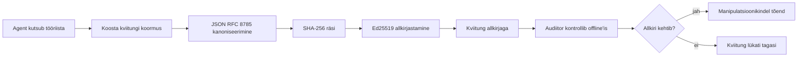

[Vaadake õppetunni videot: AI agentide turvamine krüptograafiliste kviitungitega](https://youtu.be/PLACEHOLDER_VIDEO_ID)

> _(Õppetunni video ja pisipilt lisab Microsofti sisutiim pärast liitmist, vastavalt õppetunni 14 / 15 mustrile.)_

# AI agentide turvamine krüptograafiliste kviitungitega

## Sissejuhatus

Selles õppetunnis käsitletakse:

- Miks on AI agentide auditeerimisteed olulised vastavuse, silumise ja usalduse jaoks.
- Mis on krüptograafiline kviitung ja kuidas see erineb allkirjastamata logireast.
- Kuidas toota agenti tööriistakutse jaoks allkirjastatud kviitungit tavalises Pythonis.
- Kuidas kontrollida kviitungit võrguühenduseta ja tuvastada muutmisi.
- Kuidas aheldada kviitungeid nii, et ühe eemaldamine või ümberjärjestamine katkestab ahela.
- Mida kviitungid tõendavad ja mida need selgesõnaliselt ei tõenda.

## Õpieesmärgid

Pärast selle õppetunni läbimist oskad:

- Tuvastada ebaõnnestumise mustreid, mis motiveerivad agentide tegevuste krüptograafilist jälgitavust.
- Toota Ed25519 allkirjastatud kviitungit kanonilise JSON-maketi üle.
- Kinnitust iseseisvalt kontrollida, kasutades ainult allkirjastaja avalikku võtit.
- Tuvastada muutmisi, tehes kontrolli muudetud kviitungiga uuesti.
- Luua räsi-ahelaga järjestatud kviitungite jada ja selgitada, miks see ahel on oluline.
- Eraldada, mida kviitungid tõendavad (atributsioon, terviklikkus, järjestus) ja mida need ei tõenda (tegevuse õigsus, poliitika paikapidavus).

## Probleem: Sinu agendi auditeerimise rada

Kujuta ette, et oled juurutanud AI agendi Contoso Travel jaoks. Agent loeb kliendi päringuid, kutsub lennupiletite API-d valikute leidmiseks ja broneerib kohad kliendi nimel. Eelmisel kvartalil töötles agent 50 000 broneeringut.

Täna tuleb auditeerija. Ta esitab lihtsa küsimuse: "Näidake, mida teie agent tegi."

Sa annad üle oma logifailid. Auditeerija vaatab neid ja küsib keerulisemat küsimust: "Kuidas ma tean, et neid logisid ei ole muudetud?"

See on auditeerimise tee probleem. Enamus agentide juurutusi tänapäeval tuginevad:

- **Rakenduste logid**: mida agent ise kirjutab, kuid mida saab muuta ükskõik kes, kellel on failisüsteemi juurdepääs.
- **Pilvelogimise teenused**: muudatuste tuvastamine platvormitasemel, aga ainult siis, kui auditeerija usaldab platvormi haldajat.
- **Andmebaasi tehingulogid**: sobivad hästi andmebaasi muudatuste jaoks, kuid mitte meelevaldsete tööriistakutsete jaoks.

Ükski neist ei suuda auditeerija küsimust vastata ilma, et auditeerija peaks kedagi usaldama (sind, sinu pilvepakkujat või andmebaasi müüjat). Sisemiseks kasutuseks on see usaldus sageli vastuvõetav. Reguleeritud koormuste (finantsid, tervishoid, midagi EL AI määruse all) puhul mitte.

Krüptograafilised kviitungid lahendavad selle, muutes iga agendi tegevuse iseseisvalt kinnitatavaks. Auditeerija ei pea sind usaldama. Tal on vaja ainult sinu avalikku võtit ja kviitungit ennast.

## Mis on krüptograafiline kviitung?

Kviitung on JSON-objekt, mis salvestab, mida agent tegi, allkirjastatud digitaalallkirjaga.



Minimaalne kviitung näeb välja nii:

```json
{
  "type": "agent.tool_call.v1",
  "agent_id": "contoso-travel-bot",
  "tool_name": "lookup_flights",
  "tool_args_hash": "sha256:a3f9c1...",
  "result_hash": "sha256:7b2e1d...",
  "policy_id": "contoso-travel-policy-v3",
  "timestamp": "2026-04-25T14:30:00Z",
  "sequence": 47,
  "previous_receipt_hash": "sha256:9d4e6a...",
  "signature": {
    "alg": "EdDSA",
    "sig": "c5af83...",
    "public_key": "8f3b2c..."
  }
}
```

Tööd teevad kolm omadust:

1. **Allkiri**. Kviitung on allkirjastatud agendi värava poolt, kasutades Ed25519 privaatvõtit. Keegi, kellel on vastav avalik võti, saab allkirja võrguühenduseta kontrollida. Väärtuse muutmine tühistab allkirja kehtivuse.

2. **Kanoniline kodeerimine**. Enne allkirjastamist serialiseeritakse kviitung JSON Kanoniseerimise skeemi (JCS, RFC 8785) abil. See tagab, et kaks implementatsiooni, mis genereerivad sama loogilise sisu, annavad bait-baidilt identsed väljundid. Ilma kanoniseerimiseta toodaks sama sisu jaoks erineva allkirja erinevate JSON-serialiseerijatega.

3. **Räsi-ahel**. Väli `previous_receipt_hash` seob iga kviitungi eelmisega. Kviitungi eemaldamine või ümberpaigutamine katkestab kõik pärast seda tulevad kviitungid. Muutmine muutub nähtavaks terviku ahela tasandil isegi siis, kui individuaalseid allkirju suudetakse mööda hiilida.

Need kolm omadust annavad kolm garantiid:

- **Atributsioon**: see võti allkirjastas selle sisu.
- **Terviklikkus**: sisu pole allkirjastamisest alates muutunud.
- **Järjestus**: see kviitung tuli selle ahela sees pärast eelmist kviitungit.

## Kviitungi tootmine Pythoni abil

Kviitungi tootmiseks pole vaja eraldi teeki. Krüptograafilised põhimõisted on laialt kättesaadavad ja loogika on mõnes kümnes realses Pythonis.

Praktilised harjutused failis `code_samples/18-signed-receipts.ipynb` selgitavad kogu protsessi. Kokkuvõte:

```python
import json
import hashlib
import base64
from nacl import signing
from jcs import canonicalize  # RFC 8785 kanooniline JSON

def b64url_nopad(data: bytes) -> str:
    return base64.urlsafe_b64encode(data).decode("ascii").rstrip("=")

def sha256_canonical(obj) -> str:
    """SHA-256 of a Python object's JCS-canonical JSON form."""
    return f"sha256:{hashlib.sha256(canonicalize(obj)).hexdigest()}"

# Genereeri või laadi allkirjastamise võti (tootmises hoia võtmehoidlasse)
signing_key = signing.SigningKey.generate()
verify_key = signing_key.verify_key

# Koosta tšeki andmepakett (eespool allkirja pole)
tool_args = {"origin": "SYD", "destination": "LAX"}
tool_result = [{"flight": "QF11", "price": 1850, "stops": 0}]

payload = {
    "type": "agent.tool_call.v1",
    "agent_id": "contoso-travel-bot",
    "tool_name": "lookup_flights",
    "tool_args_hash": sha256_canonical(tool_args),
    "result_hash": sha256_canonical(tool_result),
    "policy_id": "contoso-travel-policy-v3",
    "timestamp": "2026-04-25T14:30:00Z",
    "sequence": 0,
    "previous_receipt_hash": None,
}

# Kanooniline, räsi, allkirjasta.
canonical_bytes = canonicalize(payload)
message_hash = hashlib.sha256(canonical_bytes).digest()
signature_bytes = signing_key.sign(message_hash).signature

# Lisa struktureeritud allkirja objekt.
receipt = {
    **payload,
    "signature": {
        "alg": "EdDSA",
        "sig": b64url_nopad(signature_bytes),
        "public_key": b64url_nopad(bytes(verify_key)),
    },
}
```

See on kogu allkirjastamise torujuhe. Märkmete harjutused lähevad iga sammu läbi.

## Kviitungi kontrollimine ja muutmise tuvastamine

Kontrollimine on vastupidine protsess:

```python
import base64
import hashlib
from nacl import signing
from nacl.exceptions import BadSignatureError
from jcs import canonicalize

def b64url_decode(s: str) -> bytes:
    padding = "=" * ((4 - len(s) % 4) % 4)
    return base64.urlsafe_b64decode(s + padding)

def verify_receipt(receipt: dict) -> bool:
    # Allkiri on struktureeritud objekt: {"alg", "sig", "public_key"}.
    sig_obj = receipt.get("signature")
    if not sig_obj or sig_obj.get("alg") != "EdDSA":
        return False

    # Rekonstrueeri laad, mis tegelikult allkirjastati (kõik peale allkirja).
    payload = {k: v for k, v in receipt.items() if k != "signature"}

    canonical_bytes = canonicalize(payload)
    message_hash = hashlib.sha256(canonical_bytes).digest()

    try:
        verify_key = signing.VerifyKey(b64url_decode(sig_obj["public_key"]))
        verify_key.verify(message_hash, b64url_decode(sig_obj["sig"]))
        return True
    except BadSignatureError:
        return False
```

See funktsioon võtab kviitungi ja tagastab `True`, kui allkiri on kehtiv, muul juhul `False`. Puudub võrgukõne, teenuse sõltuvus ega vajadus usaldada kolmandat osapoolt.

Muudatuste tuvastust demonstreerimiseks teeb märkmik:

1. Toob välja kehtiva kviitungi ja kinnitab selle tõesuse.
2. Muudab välja `tool_args_hash` ühe baiti.
3. Jookseb kontrolli uuesti ja näeb, et see ebaõnnestub.

See on praktiline näide, et kviitungid on muutmiskindlad: iga muutus, olgu kui väike tahes, katkestab allkirja.

## Kviitungite aheldamine mitmeastmeliste agentide jaoks

Üks allkirjastatud kviitung kaitseb ühte tegevust. Kviitungite ahel kaitseb järjestust.


Iga kviitung salvestab eelmise kviitungi räsi. Kui ründaja tahaks vaikides eemaldada kviitungi nr 2, peaks ta kas:

- Muutma kviitungi 3 välja `previous_receipt_hash` (katkestab kviitungi 3 allkirja), VÕI
- Võltsima uue allkirja muudetud kviitungile 3 (nõuab agendi privaatvõtit).

Kui privaatvõti on riistvaralises võtmehoidlas ja avalikku võtit avaldatakse iga kviitungiga, ei ole kumbki rünnak avastamata teostatav.

Märkmik läbib:

1. Kolme kviitungi ahela loomise.
2. Kontrollib, et iga kviitungi `previous_receipt_hash` vastab eelmise kviitungi tegelikule räsidele.
3. Muudab keskmist kviitungit ja näeb, et ahel katkeb täpselt seal.

See on viis, kuidas luua auditeerimistee, mida väline auditeerija saab kontrollida ilma sind usaldamata.

## Mida kviitungid tõendavad (ja mida mitte)

See on õppetunni kõige olulisem osa. Kviitungid on võimsad, kuid nende võimekus on piiratud.

**Kviitungid tõendavad kolme asja:**

1. **Atributsioon**: konkreetne võti allkirjastas konkreetse maketi.
2. **Terviklikkus**: sisu pole allkirjastamisest peale muutunud.
3. **Järjestus**: see kviitung tuli pärast eelmist kviitungit ahelas.

**Kviitungid EI tõenda:**

1. **Õigsust**: et agendi tegevus oli õige valik. Kviitung saab allkirjastada sama selgelt nii valede kui ka õiget vastustest.
2. **Poliitikajärgimist**: et `policy_id` viidatud poliitikat hinnati või et see oleks selle tegevuse lubanud, kui seda kontrolliti. Kviitung salvestab, mida väideti, mitte mida rakendati.
3. **Isikut peale võtme**: kviitung ütleb "see võti allkirjastas selle sisu." See ei ütle "see inimene volitas." Võtme sidumine isiku või organisatsiooniga vajab eraldi identiteedi infrastruktuuri (kaust, avalike võtmete register jms).
4. **Sisendite tõesust**: kui agent saab manipuleeritud juhise ja toimib selle põhjal, siis kviitung salvestab tegevuse truult. Kviitung on sisendite valideerimise järgses etapis, mitte selle asendaja.

See piir on oluline kahe põhjusel:

- See ütleb, milleks kviitungid kasulikud on: muuta agendi käitumine auditeeritavaks ja muutmiskindlaks, isegi organisatsioonide vahel.
- See ütleb, milliseid lisakihtide vajadusi sul endiselt on: sisendi valideerimine (õppetund 6), poliitika rakendamine (allpool lühidalt), ja identiteedi infrastruktuur (selle õppetunni piiridest väljas).

Tavaline viga on arvata, et "meil on kviitungid" tähendab "meil on juhtimine." Ei tähenda. Kviitungid on alus. Juhtimine on süsteem, mille sa sellele peale ehitad.

## Tootmisviited

Selles õppetunnis on Python-kood meelega minimaalne, et saaksid iga rea läbi lugeda ja täielikult mõista. Tootmiskeskkonnas on sul kaks valikut:

1. **Ehita otse krüptograafiliste primitiivide peale.** Ülal näidatud 50 rida on paljude kasutusjuhtumite jaoks piisav. PyNaCl (Ed25519) ja `jcs` pakett (kanoniline JSON) on hästi hooldatud ja auditeeritud teegid.

2. **Kasuta tootmiskõlblikku kviitungite teeki.** Mitmed avatud lähtekoodiga projektid rakendavad sama mustrit lisafunktsioonidega (võtme pööramine, partii kontroll, JWK komplekti jaotamine, integreerimine poliitikamasinatesse):
   - Selle õppetunni kviitungi formaat järgib IETF Internet-Draft’i (`draft-farley-acta-signed-receipts`), mis on hetkel standardimisprotsessis.
   - Microsoft Agent Governance Toolkit ühendab kviitungeid Cedar-põhiste poliitikakäikudega; vt selle hoidla juhendit 33 lõplikuks näidiseks.
   - Paketid `protect-mcp` (npm) ja `@veritasacta/verify` (npm) pakuvad Node-põhist lahendust kviitunge allkirjastamiseks ja võrguühenduseta kontrolliks, mõeldud mis tahes MCP serveri ümber pakkimiseks muutmiskindla auditeerimisteega.

Otsus, kas ehitada ise või kasutada teeki, sarnaneb otsusele kirjutada oma JWT teek või kasutada testitud teeki: mõlemad on mõistlikud; teek säästab aega ja vähendab auditeerimise pinda; algusest peale kirjutamine sunnib mõistma iga primitiivi. See õppetund õpetab algusest, et sul oleks alus ükskõik kumma valiku jaoks.

## Teadmistest

Testi oma arusaamist enne praktilisse harjutusse minekut.

**1. Kviitung on allkirjastatud agendi privaat-ed25519 võtmega. Auditeerijal on ainult avalik võti. Kas auditeerija saab kviitungit võrguühenduseta kontrollida?**

<details>
<summary>Vastus</summary>

Jah. Ed25519 kontrollimiseks on vaja ainult avalikku võtit ja allkirjastatud baite. Puudub võrgukõne ja teenuse sõltuvus. See omadus teeb kviitungid kasulikuks võrguühenduseta, mitme organisatsiooni või madala usaldusastmega auditeerimistel.
</details>

**2. Ründaja muudab kviitungi välja `policy_id`, väites, et seda valitses lubavam poliitika. Allkiri oli tehtud originaalse maketi üle. Mis juhtub kontrollimise käigus?**

<details>
<summary>Vastus</summary>

Kontroll ebaõnnestub. Allkiri arvutati originaalse kanonilise maketi baidide üle; iga välja muutmine muudab kanonilisi baite, mis muudab SHA-256 räsi ja tühistab allkirja kehtivuse. Ründaja peaks olema privaatvõti, et toota uus kehtiv allkiri, mida tal ei ole.
</details>

**3. Miks kviitung sisaldab `tool_args_hash` ja `result_hash` selle asemel, et katta otse argumendid ja tulemuse?**

<details>
<summary>Vastus</summary>

Kaks põhjusel. Esiteks võib kviitungit arhiveerida või edasi saata keskkondades, kus tühja sisu lekkimine (isikukaitseandmed, ärisaladused) on probleem. Räsi hoiab kviitungi väikse ja sisu privaatse; auditeerija kontrollib, et räsi vastab eraldi hoitava originaalse sisuga. Teiseks on räsi fikseeritud suurusega; kviitung, mis sisaldab räsi, on suuruse piiratud olenemata sisendi ja väljundi mahust.
</details>

**4. Väli `previous_receipt_hash` seob iga kviitungi eelmisega. Kui ründaja vaikides kustutab ühe kviitungi ahela keskelt, mis muutub kehtetuks?**

<details>
<summary>Vastus</summary>

Kõik kviitungid, mis tulid pärast kustutatud kviitungit. Nende `previous_receipt_hash` väljad ei vasta enam tegelikule ahelale (kuna viidatav kviitung puudub või ahel viitab nüüd teisele eelkäijale). Kustutuse varjamiseks peaks ründaja uuesti allkirjastama kõik hilisemad kviitungid, mis nõuab privaatvõtit.
</details>

**5. Kviitung kontrollib korrektselt. Kas see tõendab, et agendi tegevus oli õige, loogiline või poliitikaga kooskõlas?**

<details>
<summary>Vastus</summary>

Ei. Kehtiv kviitung tõendab kolme asja: atributsiooni (see võti allkirjastas selle sisu), terviklikkust (sisu pole muutunud) ja järjestust (see kviitung tuli pärast eelmist). See EI tõenda, et tegevus oli õige, et poliitika `policy_id` hinnati või et agent järgnes kõikidele reeglitele. Kviitungid teevad agendi käitumise auditeeritavaks, mitte ilmtingimata õigeks. See on õppetunni kõige olulisem piir.
</details>

## Praktiline harjutus

Ava `code_samples/18-signed-receipts.ipynb` ja lõpeta kõik neli osa:

1. **1. osa**: Allkirjasta oma esimene kviitung ja kontrolli seda.
2. **2. osa**: Muuda kviitungit ja jälgi, kuidas kontroll ebaõnnestub.
3. **3. osa**: Koosta kolme kviitungi ahel ja kontrolli selle terviklikkust.
4. **4. osa**: Rakenda see muster Microsoft Agent Frameworkiga ehitatud agendi tööriistakutses: paki tööriistakutse ümber kviitungi allkirjastamisega, seejärel kontrolli kviitungit iseseisvalt.

**Lisaväljakutse 1:** laienda kviitungi skeemi omavalitud lisaväljaga (näiteks päringu ID jälgimiseks), uuenda kanonilise allkirjastamise loogikat, et see sisaldaks seda, ja kinnita, et kviitung läbib kontrolli hästi. Seejärel muuda välja pärast allkirjastamist ja kinnita, et kontroll ebaõnnestub. See sunnib mõistma, kuidas iga bait kanonilises kodeeringus allkirjale kaasa aitab.
**Väljakutse 2:** SHA-256-tehke kahe oma tšeki räsi kokku (ühendades nende kanonilised baidid deterministlikus järjekorras) ja lisage saadud digesto kolmanda tšeki uue väljana enne selle allkirjastamist. Kontrollige, et kõik kolm tšeki ikka ümberringi käivad. Olete just loonud üheastmelise kaasamise tõendi: igaüks, kellel on kolmas tšekk, suudab tõestada, et kaks esimest eksisteerisid selle allkirjastamise ajal, ilma nende sisu avaldamata. See on mustrit, mida kasutatakse selektiivse avalikustamise tšekkidel suuremas mahus (Merkle kohustused, RFC 6962).

## Kokkuvõte

Krüptograafilised tšekid annavad tehisintellekti agentidele auditeerimise jälje, mis on:

- **Iseseisvalt kontrollitav:** iga osapool, kellel on avalik võti, saab kontrollida, teenusest sõltumatult.
- **Muutmiskindel:** kõik muudatused rikuvad allkirja.
- **Portatiivne:** tšekk on väike JSON-fail; seda saab arhiveerida, edastada ja kinnitada ükskõik kus.
- **Standarditele vastav:** põhineb Ed25519-l (RFC 8032), JCS-il (RFC 8785) ja SHA-256-l, kõik laialdaselt kasutatavad primitiivid.

Need ei asenda sisendi valideerimist, poliitika täitmist ega identiteedistruktuuri. Nad on nende kihtide alus. Kui rakendate agente reguleeritud töökoormatesse, mitmeorganisatsioonilistesse töövoogudesse või igasse keskkonda, kus tulevikus auditeerijat ei saa eeldada teid usaldavat, siis tšekid on see, kuidas muuta auditeerimise jälg ausaks.

Kõige olulisem järeldus: tšekid tõestavad, kes ütles mida ja millal. Need ei tõesta, et öeldu oli tõene või õige. Hoidke seda erinevust kindlalt. See on ausa päritolusüsteemi ja eksitava vahel vahe.

## Tootmiskontrollnimekiri

Kui olete valmis sellest tunnist edasi minema ja rakendama tšekkidega signeeritud agente reaalses keskkonnas:

- [ ] **Eemaldage allkirjastamise võti arendaja sülearvutist.** Kasutage Azure Key Vaulti, AWS KMS-i või riistvaralist turvamoodulit. Privaatvõti, millega oma tšekke allkirjastate, ei tohi kunagi elada lähtekoodi halduses ega tekstitöötlejana rakenduse masinatel.
- [ ] **Avaldage verifitseerimise avalik võti.** Auditeerijad vajavad seda võrguühenduseta kontrollimiseks. Standardne muster on JWK-komplekt tuntud URL-il (RFC 7517), näiteks `https://your-org.example.com/.well-known/agent-keys.json`.
- [ ] **Ankurige ahel väliselt.** Kirjutage perioodiliselt ahela viimase tipu räsi läbipaistvuslogisse (Sigstore Rekor, RFC 3161 ajatemplivolinik või teine sisevõrk), et välisosapool saaks kinnitada „see ahel eksisteeris sellel ajal“.
- [ ] **Salvestage tšekid muutumatult.** Ainult lisatav blobisalvestus (Azure Storage koos muutumatuse poliitikaga, AWS S3 objekt lukustus) takistab sisemist juhti ajaloo ümberkirjutamisel salvestuskihil.
- [ ] **Otsustage säilitamisperioodi üle.** Paljud nõuete raamistikud nõuavad mitmeaastast säilitust. Planeerige tšekkide kasv (iga tšekk on umbes 500 baiti; agent, kes teeb päevas 10 000 kõnet, toodab ~1,8 GB aastas).
- [ ] **Dokumenteerige, mida tšekid ei hõlma.** Tšekid tõestavad atribuuti, terviklikkust ja järjestust. Teie protseduuri käsiraamat peaks selgesõnaliselt loetlema, millised lisakontrollid (sisendi valideerimine, poliitika rakendamine, kiirusepiirang, identiteedistruktuur) on tšekkide kõrval teie juhtimises.

### Kas teil on rohkem küsimusi AI agentide turvamise kohta?

Liituge [Microsoft Foundry Discordiga](https://aka.ms/ai-agents/discord), et kohtuda teiste õppijatega, osaleda töötubades ja saada oma AI agentide küsimustele vastused.

## Selle tunni järel

See tund käsitleb ühe tšeki allkirjastamist ja räsi-ahelaga järjestusi. Samad primitiivid koonduvad mitmeks keerukamaks mustriks, millega võite kokku puutuda, kui teie juhtimispraktika areneb:

- **Selektiivne avalikustamine.** Kui tšeki väljad on iseseisvalt kohustatud (RFC 6962-laadne Merkle-puu), saate konkreetseid välju konkreetsetele auditeerijatele avaldada ja tõestada, et ülejäänud väljad on muutumatud, ilma neid paljastamata. Kasulik, kui sama tšekk peab rahuldama nii põhjalikku auditit (mis soovib täielikkust) kui ka andmekaitse regulatsioone nagu GDPR (mis soovivad, et audiitor näeks nii vähe kui võimalik).
- **Tšekivõltsimise tühistamine.** Kui allkirjastamise võti on ohustatud, vajate võimalust märkida kõik selle võtmega allkirjastatud tšekid pärast kindlat aega usaldamatuks. Standardmustrid: lühiajalised allkirjastamise võtmed ja avaldatud tühistamisnimekiri või läbipaistvuslogi tühistamiskirjetega.
- **Kahepoolsed / jagatud allkirjaga tšekid.** Mõnes rakenduses jagatakse allkirjastatud koorem enne täitmist (`authorization_*`) ja pärast täitmist (`result_*`) sõltumatuteks osadeks, mõlemas oma allkirjaga, mis sobib olukordades, kus volituse otsus ja täidetud tulemus on tehtud erinevate osapoolte või erineval ajal. See kombineerub lisaks selle tunni tšekiivormingule.
- **Koorimiskoormuse kooskomponeerimine.** Tšekk lukustab mis tahes baidid, mille panete `result_hash`-i. Reaalmaailma koormused on sageli rikkalikumad kui ühe tööriista kõne tulemus: eelloogika (mudeli prognoos, kaalutud valikud, tõendid ja nende täielikkus, riskipositsioon, vastutusahela otsus) võib kõik elada koormuses, mida lukustab üks tšekk. See hoiab tšeki formaadi minimaalsena ja võimaldab koormuse skeemidel areneda domeen järgi.
- **Ristrakenduse kooskõla.** Mitmed iseseisvad rakendused sama tšekivormingu jaoks (Python, TypeScript, Rust, Go) kontrollivad ühiselt jagatud testvektoreid. Kui ehitate oma rakenduse, kinnitab avaldatud vektorite valideerimine ülesannete kokkusobivuse.
- **Kvantarvutite eest kaitsmise migratsioon.** Ed25519 on tänapäeval laialdaselt kasutusel, kuid ei ole kvantarvutitele vastupidav. Tšekivorming on algoritmide kohanduv: väli `signature.alg` võib kanda `ML-DSA-65` (NISTi postkvantallkirjastandard), kui on tarvis migratsiooni. Planeerige üleminiperiood, kus tšekid on kaheahelalised.

## Lisamaterjalid

- <a href="https://datatracker.ietf.org/doc/draft-farley-acta-signed-receipts/" target="_blank">IETF Interneti eelnõu: Masinatevahelise juurdepääsu kontrolli allkirjastatud otsusetšekid</a>
- <a href="https://learn.microsoft.com/azure/ai-studio/responsible-use-of-ai-overview" target="_blank">Vastutustundliku tehisintellekti ülevaade (Azure AI)</a>
- <a href="https://datatracker.ietf.org/doc/html/rfc8032" target="_blank">RFC 8032: Edwards-kõvera digiallkirjastusalgoritm (EdDSA)</a>
- <a href="https://datatracker.ietf.org/doc/html/rfc8785" target="_blank">RFC 8785: JSON Kanoniseerimise skeem (JCS)</a>
- <a href="https://datatracker.ietf.org/doc/html/rfc6962" target="_blank">RFC 6962: Sertifikaatide läbipaistvus</a> (Merkle-puu ehitus, mida kasutavad selektiivse avalikustamise tšekid)
- <a href="https://github.com/microsoft/agent-governance-toolkit/blob/main/docs/tutorials/33-offline-verifiable-receipts.md" target="_blank">Microsofti agentide juhtimisvahendite komplekt, juhend 33: võrguühenduseta tõendatavad otsusetšekid</a>
- <a href="https://github.com/ScopeBlind/agent-governance-testvectors" target="_blank">Ristrakenduse kooskõla testvektorid</a> selle tunni tšekivormingu jaoks (Apache-2.0)
- <a href="https://pynacl.readthedocs.io/" target="_blank">PyNaCl dokumentatsioon</a> (Ed25519 Pythonis)

## Eelmine tund

[Arvutikasutusagentide loomine (CUA)](../15-browser-use/README.md)

## Järgmine tund

_(Määrab õppekava haldur)_

---

<!-- CO-OP TRANSLATOR DISCLAIMER START -->
**Lahtiütlus**:
See dokument on tõlgitud kasutades AI tõlketeenust [Co-op Translator](https://github.com/Azure/co-op-translator). Kuigi me püüdleme täpsuse poole, palun pange tähele, et automatiseeritud tõlgetes võib esineda vigu või ebatäpsusi. Originaaldokument selle emakeeles tuleks pidada autoriteetseks allikaks. Olulise teabe puhul soovitatakse kasutada professionaalset inimtõlget. Me ei vastuta selle tõlkega seotud eksimustest või valesti mõistmistest.
<!-- CO-OP TRANSLATOR DISCLAIMER END -->