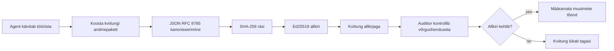
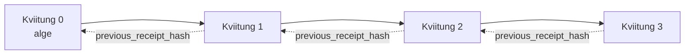

[Vaata õppetunni videot: Kunstintellekti agentide turvamine krüptograafiliste kviitungitega](https://youtu.be/PLACEHOLDER_VIDEO_ID)

> _(Õppetunni video ja pisipilt lisatakse pärast ühendamist Microsofti sisutiimi poolt, järgides õppetunni 14 / 15 mustrit.)_

# Kunstintellekti agentide turvamine krüptograafiliste kviitungitega

## Sissejuhatus

Selles õppetunnis käsitletakse:

- Miks on AI agentide auditeerimisrajad olulised vastavuse, veaotsingu ja usalduse jaoks.
- Mis on krüptograafiline kviitung ja kuidas see erineb allkirjastamata logi reast.
- Kuidas luua allkirjastatud kviitung agenti tööriistakutse jaoks lihtsas Pythoni keeles.
- Kuidas kviitungit võrrelda võrguühenduseta ning tuvastada manipuleerimist.
- Kuidas kviitusid ahelana ühendada nii, et ühe eemaldamine või ümberjärjestamine katkestab ahela.
- Mida tõendavad kviitungid ning mida need otseselt ei tõenda.

## Õpieesmärgid

Pärast selle õppetunni läbimist tead, kuidas:

- Tuvastada veamustrid, mis motiveerivad krüptograafilist päritolu agentide tegevustele.
- Luua Ed25519 allkirjastatud kviitung kanonilise JSON koormuse põhjal.
- Üksinda kviitungit kontrollida ainult allkirjastaja avaliku võtmega.
- Tuua välja manipuleerimise, käivitades uuesti kontrolli muudetud kviitungil.
- Ehita kviitungite räsiahel ning selgitada, miks ahel on oluline.
- Eristada, mida kviitungid tõendavad (attribuut, terviklikkus, järjekord) ja mida nad ei tõenda (tegevuse õigsus, poliitika kehtivus).

## Probleem: Sinu agendi auditeerimisrada

Kujuta ette, et oled välja saatnud AI agendi Contoso Travel jaoks. Agent loeb klientide päringuid, kasutab lennu API-t valikute otsimiseks ja broneerib klientide nimel kohti. Eelmisel kvartalil töötles agent 50 000 broneeringut.

Täna saabub audiitor. Nad küsivad lihtsa küsimuse: „Näita mulle, mida su agent tegi.“

Sa annad üle logifailid. Audiitor vaatab neid ja esitab keerulisema küsimuse: „Kust ma tean, et neid logisid pole muudetud?“

See on auditeerimisraja probleem. Enamik tänastest agentide paigaldustest sõltub:

- **Rakenduse logidest**: agent ise kirjutab need, keda iganes failisüsteemile ligipääsu on, võib neid muuta.
- **Pilve logimise teenustest**: platvormi tasemel on nende ärakasutamine jälgitav, aga ainult kui audiitor usaldab platvormi operaatorit.
- **Andmebaasi tehingulogidest**: sobivad hästi andmebaasi muudatustele, kuid mitte suvalistele tööriistakutsetele.

Ükski neist ei saa audiitori küsimusele vastata, ilma et audiitor peaks kellelegi usaldama (sind, su pilvepakkujat, andmebaasitarnijat). Siseotstarbel on see usaldus tihti aktsepteeritav. Reguleeritud töökoormuste puhul (finants, tervishoid, kõik, mis kuulub ELi AI akti alla) see ei kehti.

Krüptograafilised kviitungid lahendavad selle, muutes iga agendi tegevuse sõltumatult valideeritavaks. Audiitor ei pea sind usaldama. Vaja on vaid su avalikku võtit ja kviitungit ennast.

## Mis on krüptograafiline kviitung?

Kviitung on JSON objekt, mis salvestab, mida agent tegi, ning on allkirjastatud digitaalse allkirjaga.


```mermaid
flowchart LR
    A[Agent käivitab tööriista] --> B[Koosta kviitungi andmepakett]
    B --> C[JSON RFC 8785 kanoniseerimine]
    C --> D[SHA-256 räsi]
    D --> E[Ed25519 allkiri]
    E --> F[Kviitung allkirjaga]
    F --> G[Audiitor kontrollib võrguühenduseta]
    G --> H{Allkiri kehtib?}
    H -- yes --> I[Määramata muutmiste tõend]
    H -- no --> J[Kviitung lükati tagasi]
```

Minimaalne kviitung näeb välja selline:

```json
{
  "type": "agent.tool_call.v1",
  "agent_id": "contoso-travel-bot",
  "tool_name": "lookup_flights",
  "tool_args_hash": "sha256:a3f9c1...",
  "result_hash": "sha256:7b2e1d...",
  "policy_id": "contoso-travel-policy-v3",
  "timestamp": "2026-04-25T14:30:00Z",
  "sequence": 47,
  "previous_receipt_hash": "sha256:9d4e6a...",
  "signature": {
    "alg": "EdDSA",
    "sig": "c5af83...",
    "public_key": "8f3b2c..."
  }
}
```

Kolm omadust teevad selle töö:

1. **Allkiri**. Kviitungi allkirjastab agendi värav Ed25519 privaatvõtmega. Kõik, kellel on vastav avalik võti, saavad allkirja võrguühenduseta kontrollida. Väli muutmine muudab allkirja kehtetuks.

2. **Kanoniline kodeerimine**. Enne allkirjastamist serialiseeritakse kviitung JSON Kanoniseerimise skeemi (JCS, RFC 8785) abil. See kindlustab, et kaks sama loogika järgi töötavat teostust annavad täpselt identse baitide järjendi. Ilma kanoniseerimiseta erinevad JSON-id annaksid sama sisuga erinevaid allkirju.

3. **Räsiahel**. `previous_receipt_hash` väli ühendab iga kviitungi eelnevaga. Ühe kviitungi eemaldamine või ümberjärjestamine katkestab iga järgneva kviitungi. Manipuleerimine on nähtav ahela tasemel, isegi kui mõnda üksikut allkirja üritatakse mööda minna.

Need omadused koos pakuvad kolme garantiid:

- **Attribuut**: see võti allkirjastas selle sisu.
- **Terviklikkus**: sisu pole allkirjastamisest alates muutunud.
- **Järjekord**: see kviitung tuli pärast seda kviitungit ahelas.

## Kviitungi loomine Pythonis

Kviitungi loomiseks ei ole vaja spetsiaalset teeki. Krüptograafilised primitiivid on laialt kättesaadavad ja loogika on mõnesaja koodireaga Pythonis.

`code_samples/18-signed-receipts.ipynb` praktilises ülesandes käiakse läbi kogu voog. Kokkuvõte:

```python
import json
import hashlib
import base64
from nacl import signing
from jcs import canonicalize  # RFC 8785 kanooniline JSON

def b64url_nopad(data: bytes) -> str:
    return base64.urlsafe_b64encode(data).decode("ascii").rstrip("=")

def sha256_canonical(obj) -> str:
    """SHA-256 of a Python object's JCS-canonical JSON form."""
    return f"sha256:{hashlib.sha256(canonicalize(obj)).hexdigest()}"

# Genereeri või laadi alla allkirjastamise võti (tootmises säilita võtmehoidlas)
signing_key = signing.SigningKey.generate()
verify_key = signing_key.verify_key

# Koosta kviitungi andmepakett (veel allkirja pole)
tool_args = {"origin": "SYD", "destination": "LAX"}
tool_result = [{"flight": "QF11", "price": 1850, "stops": 0}]

payload = {
    "type": "agent.tool_call.v1",
    "agent_id": "contoso-travel-bot",
    "tool_name": "lookup_flights",
    "tool_args_hash": sha256_canonical(tool_args),
    "result_hash": sha256_canonical(tool_result),
    "policy_id": "contoso-travel-policy-v3",
    "timestamp": "2026-04-25T14:30:00Z",
    "sequence": 0,
    "previous_receipt_hash": None,
}

# Kanoonista, räsi, allkirjasta.
canonical_bytes = canonicalize(payload)
message_hash = hashlib.sha256(canonical_bytes).digest()
signature_bytes = signing_key.sign(message_hash).signature

# Lisa struktureeritud allkirja objekt.
receipt = {
    **payload,
    "signature": {
        "alg": "EdDSA",
        "sig": b64url_nopad(signature_bytes),
        "public_key": b64url_nopad(bytes(verify_key)),
    },
}
```

See on kogu allkirjastamise töövoog. Märkmikus tehakse iga sammu läbi.

## Kviitungi kontrollimine ja manipuleerimise tuvastamine

Kontrollimine on vastupidine protsess:

```python
import base64
import hashlib
from nacl import signing
from nacl.exceptions import BadSignatureError
from jcs import canonicalize

def b64url_decode(s: str) -> bytes:
    padding = "=" * ((4 - len(s) % 4) % 4)
    return base64.urlsafe_b64decode(s + padding)

def verify_receipt(receipt: dict) -> bool:
    # Allkiri on struktureeritud objekt: {"alg", "sig", "public_key"}.
    sig_obj = receipt.get("signature")
    if not sig_obj or sig_obj.get("alg") != "EdDSA":
        return False

    # Rekonstrueeri tegelikult allkirjastatud koormus (kõik peale allkirja).
    payload = {k: v for k, v in receipt.items() if k != "signature"}

    canonical_bytes = canonicalize(payload)
    message_hash = hashlib.sha256(canonical_bytes).digest()

    try:
        verify_key = signing.VerifyKey(b64url_decode(sig_obj["public_key"]))
        verify_key.verify(message_hash, b64url_decode(sig_obj["sig"]))
        return True
    except BadSignatureError:
        return False
```

See funktsioon võtab kviitungi ja tagastab `True`, kui allkiri kehtib, vastasel juhul `False`. Võrguühendust pole vaja, teenuse sõltuvust pole, kolmanda osapoole usaldamine ei ole vajalik.

Tuvastamismenetlust demonstreeritakse nii:

1. Eraldatakse kehtiv kviitung ja kinnitatakse, et see kontrollib.
2. Muudetakse üks bait `tool_args_hash` väljal.
3. Käivitatakse kontroll uuesti ja näidatakse, et see ebaõnnestub.

See on praktiline näide, et kviitungid on manipuleerimisekindlad: iga muudatus, kui pisike tahes, muudab allkirja kehtetuks.

## Kviitungite ühendamine ahelaks mitmeastmeliste agentide jaoks

Üks allkirjastatud kviitung kaitseb ühte tegevust. Kviitungite ahel kaitseb toimingute jada.


```mermaid
flowchart LR
    R0[Kviitung 0<br/>alge] --> R1[Kviitung 1]
    R1 --> R2[Kviitung 2]
    R2 --> R3[Kviitung 3]
    R1 -. previous_receipt_hash .-> R0
    R2 -. previous_receipt_hash .-> R1
    R3 -. previous_receipt_hash .-> R2
```

Iga kviitung salvestab eelmise kviitungi räsi. Selleks, et kaudselt 2. kviitung eemaldada, peaks ründaja kas:

- Muutma kviitungi 3 välja `previous_receipt_hash` (katkestab kviitungi 3 allkirja) VÕI
- Võltsima uut allkirja muudetud kviitungi 3 peal (vajab agendi privaatvõtit).

Kui privaatvõti on riistvaralises võtmetehoidlasse paigutatud ja avalik võti avaldatakse iga kviitungi juures, pole kumbki rünnak võimalik avastamata.

Märkmik läbib:

1. Kolme kviitungi ahela loomine.
2. Kontroll, et iga kviitungi `previous_receipt_hash` vastab eelneva kviitungi tegelikule räsidele.
3. Keskmise kviitungi manipuleerimine ja näitamine, kuidas ahel sellel kohal katkeb.

See on, kuidas saad luua auditeerimisraja, mida väline audiitor saab kontrollida ilma sind usaldamata.

## Mida kviitungid tõendavad (ja mida mitte)

See on selle õppetunni kõige olulisem osa. Kviitungid on võimsad, aga nende mõju on piiratud.

**Kviitungid tõendavad kolme asja:**

1. **Attribuut**: konkreetne võti allkirjastas konkreetse koormuse.
2. **Terviklikkus**: koormus pole allkirjastamisest alates muutunud.
3. **Järjekord**: see kviitung tuli pärast seda kviitungit räsiahelas.

**Kviitungid EI tõenda:**

1. **Õigsust**: et agente tegevus oli õige tegu. Kviitung võib olla allkirjastatud nii valele kui õigele vastusele.
2. **Poliitikajärgimist**: et `policy_id`-s nimetatud poliitikat tegelikult hinnati või et see oleks lubanud selle tegevuse. Kviitung salvestab vaid väiteid, mitte täitmist.
3. **Identiteeti peale võtme**: kviitung ütleb „see võti allkirjastas selle sisu“. See ei ütle „see inimene või organisatsioon volitas selle“. Võtme sidumine isiku või organisatsiooniga nõuab eraldi identiteedistruktuuri (kataloog, avalike võtmete register jms).
4. **Sisendite tõesust**: kui agent saab manipuleeritud käsu ja tegutseb selle põhjal, siis kviitung salvestab siiski tõepäraselt toimingu. Kviitungid on sisendi valideerimise allikad, mitte selle asendajad.

See piir kemknab kaheks:

- See näitab, milleks kviitungid kasulikud on: nende abil saab agente auditeerida ja muutmiskindlaks muuta, isegi organisatsioonideülestes tingimustes.
- Samas vajavad täiendavaid kihte: sisendi valideerimine (Õppetund 6), poliitika rakendamine (allpool lühidalt) ja identiteedistruktuur (siia õppetundi ei mahu).

Sageli eeldatakse, et „kviitungid olemas“ tähendab „valitsetud“. See ei kehti. Kviitungid on alus. Valitsemine on süsteem, mille ehitad sinna peale.

## Tootmise viited

Selle õppetunni Python kood on tahtlikult minimaalne, et saaksid lugeda iga rida ja täpselt mõista, mis toimub. Tootmises on sul kaks varianti:

1. **Ehita otse krüptograafiliste primitiivide peale.** Eelnevad 50 rida on paljude kasutusjuhtude jaoks piisavad. PyNaCl (Ed25519) ja `jcs` pakett (kanoniline JSON) on hästi hooldatud ja auditeeritud teegid.

2. **Kasuta tootmiskviitungite teeki.** Mitmed avatud lähtekoodiga projektid rakendavad sarnast mustrit lisafunktsioonidega (võtmete rotatsioon, partii kontroll, JWK komplekti levitus, integratsioon poliitika mootoritega):
   - Selles õppetunnis kasutatav kviitungite formaat järgib IETF Internet-Drafti (`draft-farley-acta-signed-receipts`), mis on hetkel standardiprotsessis.
   - Microsoft Agent Governance Toolkit kombineerib kviitungid Cedar-põhiste poliitikotsustega; koguvõimalik näide on saadaval selle hoidla õpetuses 33.
   - `protect-mcp` (npm) ja `@veritasacta/verify` (npm) paketid pakuvad Node-põhist konkreetse kviitungi allkirjastamise ja võrguühenduseta kontrolli, et pakendada iga MCP serveri muutmiskindla auditeerimistrajaga.
   - **[nobulex](https://github.com/arian-gogani/nobulex)** Pythoni SDK (`pip install nobulex`) pakub sama Ed25519 + JCS allkirjastamise mustrit, sisaldades LangChain ja CrewAI integratsioone, avaldatud ristkontrolli testvektoreid ja vastavuskaart sattus sinna läbi [OWASP PR #2210](https://github.com/OWASP/CheatSheetSeries/pull/2210).

Otsus ise teegi kirjutamise ja valmis teegi kasutamise vahel on sarnane otsusega kirjutada oma JWT teek või kasutada testitud teeki: mõlemad on mõistlikud; teek säästab aega ja vähendab auditipinda; nullist kirjutamine õpetab tundma iga primitiivi eraldi. See õppetund õpetab nullist moodustamist, et sul oleks alus mõlemaks valikuks.

## Teadmiste kontroll

Kontrolli oma arusaamist enne harjutuse juurde minekut.

**1. Kviitung on allkirjastatud agendi privaatse Ed25519 võtmega. Audiitoril on ainult avalik võti. Kas audiitor saab kviitungit võrguühenduseta kontrollida?**

<details>
<summary>Vastus</summary>

Jah. Ed25519 kontrollimiseks on vaja ainult avalikku võtit ja allkirjastatud baite. Võrguühendust ega teenusesõltuvust pole. See omadus teeb kviitungid kasulikuks võrguühenduseta, mitme organisatsiooni ja madala usalduse auditeerimistel.
</details>

**2. Ründaja muudab kviitungi välja `policy_id`, väites, et seda kontrollis leebem poliitika. Allkiri oli tehtud originaalkoormuse peal. Mis juhtub kontrolli ajal?**

<details>
<summary>Vastus</summary>

Kontroll ebaõnnestub. Allkiri arvutati originaalkoormuse kanoniliste baitide jaoks; välja muutmine muudab baitide järjestust, mis muudab SHA-256 räsi, mis muudab allkirja kehtetuks. Ründajal pole privaatvõtit, et luua uus kehtiv allkiri.
</details>

**3. Miks sisaldab kviitung `tool_args_hash` ja `result_hash`, mitte toores argumente ja tulemust?**

<details>
<summary>Vastus</summary>

Kaks põhjust. Esiteks peab kviitungi arhiveerimine või edastamine olema võimalik kohtades, kus toore sisu lekkimine (isikuandmed, äriandmed) on probleem. Räsi hoiab kviitungi väikese ja sisu privaatse, audiitor saab kinnitada, et räsi vastab eraldi hoitavale sisule. Teiseks on räside suurus fikseeritud; kviitung, mis kasutab räsi, on mõistliku suurusega ükskõik kui suured sisendid-väljundid olid.
</details>

**4. Välja `previous_receipt_hash` abil on iga kviitung seotud eelnevaga. Kui ründaja kustutab ahelast vaikselt ühe kviitungi keskel, mis muutub kehtetuks?**

<details>
<summary>Vastus</summary>

Iga kviitung, mis tuli kustutatu järel. Nende `previous_receipt_hash` väljad enam ei vasta ahela reaalsele olekule (kuna viidatud kviitung puudub või ahel viitab nüüd teisele eelnevale). Kustutuse varjamiseks peaks ründaja uuesti allkirjastama iga järeltuleva kviitungi, mis nõuab privaatvõtit.
</details>

**5. Kviitung kinnitatakse kehtivaks. Kas see tõendab, et agendi tegevus oli õige, õiguslik või poliitikaga kooskõlas?**

<details>
<summary>Vastus</summary>

Ei. Kehtiv kviitung tõendab kolme asja: atribuut (see võti signis selle sisu), terviklikkus (sisu pole muutunud) ja järjekord (see kviitung tuli pärast eelmise ahelas). See EI tõesta, et tegevus oli õige, poliitikat hinnati või et agent reegleid järgis. Kviitungid teevad agendi käitumise auditeeritavaks, mitte tingimata õiglaseks. See on õppetunni kõige tähtsam piir.
</details>

## Praktiline ülesanne

Ava `code_samples/18-signed-receipts.ipynb` ja täida kõik neli osa:

1. **Osa 1**: Allkirjasta oma esimene kviitung ja kontrolli seda.
2. **Osa 2**: Muutke kviitungit ja jälgige kontrolli ebaõnnestumist.
3. **Osa 3**: Ehita kolme kviitungi ahel ja kinnita ahela terviklikkust.
4. **Osa 4**: Rakenda see muster Microsoft Agent Framework’is loodud agendile: paki tööriistakutse kviitungi allkirjastamisse, seejärel kontrolli kviitungit iseseisvalt.


**Väljakutse 1:** laiendage kviitungi skeemi täiendava valitud väljaga (näiteks jälgimis-ID), värskendage kanonilist allkirjastamisloogikat, et see sisaldaks uut välja, ja kinnitage, et kviitung läbiks ikka veel edukalt verifitseerimise. Seejärel muutke välja pärast allkirjastamist ja kinnitage, et verifitseerimine ebaõnnestub. See sunnib teid mõistma, kuidas iga kanonilise kodeeringu bait panustab allkirja.

**Väljakutse 2:** SHA-256 hashige kaks oma kviitungit koos (liites nende kanonilised baitid deterministlikus järjekorras) ja lisage saadud kontrollsumma uue väljana kolmandale kviitungile enne selle allkirjastamist. Kontrollige, et kõik kolm kviitungit läbiksid ikka veel edukalt verifitseerimise. Olete just loonud üheastmelise kaasamise tõendi: keegi, kellel on kolmas kviitung, saab tõendada, et esimesed kaks eksisteerisid allkirjastamise ajal, ilma et peaks nende sisu avalikustama. See on mustritena, mida valikulise avalikustamisega kviitungid suures mahus kasutavad (Merkle pühendumused, RFC 6962).

## Kokkuvõte

Krüptograafilised kviitungid annavad tehisintellektagentidele auditeerimistee, mis on:

- **Iseseisvalt verifitseeritav:** iga osapool, kellel on avalik võti, saab kontrollida, pole teenusesõltuvust.
- **Manipulatsioonitõendav:** iga muudatus tühistab allkirja.
- **Ülekanneväärne:** kviitung on väike JSON-fail; seda saab arhiveerida, edastada ja verifitseerida kõikjal.
- **Standarditele vastav:** põhineb Ed25519-l (RFC 8032), JCS-il (RFC 8785) ja SHA-256-l, kõik laialt kasutatavad primitiivid.

Need ei asenda sisendi valideerimist, poliitikate rakendamist ega identiteeditaristut. Need on nende kihtide alus. Kui paigaldate agente reguleeritud töökoormatesse, mitmeorganisatsioonilistesse töövoogudesse või olukordadesse, kus tulevikuaudiitori usaldust ei saa eeldada, on kviitungid see, kuidas teha auditeerimisteest aus.

Kõige tähtsam arusaam: kviitungid tõendavad, kes ütles mida ja millal. Need ei tõenda, et öeldu oli tõene või õige. Hoidke seda vahet rangelt. See on vahe ausa ja petliku allikateabe süsteemi vahel.

## Tootmise kontrollnimekiri

Kui olete valmis sellest õppetunnist edasi liikuma ja paigaldama allkirjastatud kviitungitega agente tootmiskeskkonda:

- [ ] **Viige allkirjastamisvõti arendajal sülearvutist eemale.** Kasutage Azure Key Vault'i, AWS KMS-i või riistvaralist turvamehhanismi. Privaatsvõti, mis allkirjastab teie kviitungid, ei tohi kunagi asuda lähtekoodihalduses ega olla tavaltekstil rakenduste hostidel.
- [ ] **Avaldage verifitseerimise avalik võti.** Audiitoritel on vaja seda võrguühenduseta verifitseerimiseks. Standardne muster on JWK Set tuntud URL-il (RFC 7517), nt `https://your-org.example.com/.well-known/agent-keys.json`.
- [ ] **Kinnitage plokiahel väliselt.** Kirjutage perioodiliselt uusima plokiahela tipu räsi läbipaistvuslogisse (Sigstore Rekor, RFC 3161 ajatähise asutus või teine sise süsteem), et väline osapool saaks kinnitada "see plokiahel eksisteeris sel ajal."
- [ ] **Salvestage kviitungid muutumatult.** Lisaainult blob-salvestus (Azure Storage koos muutumatuse poliitikatega, AWS S3 Objekti lukustus) takistab tööladuda sellel tasemel ajaloos ümberkirjutamist.
- [ ] **Otsustage säilitamise pikkus.** Paljud vastavusnõuded nõuavad mitmeaastast säilitust. Planeerige kviitungite mahu kasvu (iga kviitung on umbes 500 baiti; agent, mis teeb 10 000 kõnet päevas, toodab umbes 1,8 GB aastas).
- [ ] **Dokumenteerige, mida kviitungid ei kata.** Kviitungid tõendavad tuvastamist, terviklikkust ja järjekorda. Teie tööjuhendis peaks selgelt olema kirjas, millised täiendavad kontrollid (sisendi valideerimine, poliitikate rakendamine, kiirusepiirangud, identiteeditaristu) täiendavad kviitungeid teie halduspositsioonis.

### Rohkem küsimusi AI agentide turvamise kohta?

Liituge [Microsoft Foundry Discordiga](https://aka.ms/ai-agents/discord), et kohtuda teiste õppijatega, osaleda kontorite tundides ja saada vastuseid oma AI agentide küsimustele.

## Pärast seda õppetundi

See õppetund katab ühe kviitungi allkirjastamist ja hash-keti sekvense. Samad primitiivid kombineeruvad mitmeks keerukamaks mustriks, millega võite kohtuda oma halduspositsiooni küpsemisel:

- **Valikuline avalikustamine.** Kui kviitungi väljad on iseseisvalt pühendatud (RFC 6962 stiilis Merkle puu), saate avaldada konkreetseid välju konkreetsetele audiitoritele ja tõendada, et ülejäänud on muutumatud, ilma et peaksite neid avalikustama. Kasulik, kui sama kviitung peab rahuldama nii põhjalikku auditi (mis soovib täielikkust) kui ka andmete minimeerimise regulatsioone nagu GDPR (mis nõuab audiitorile võimalikult vähe näitamist).
- **Kviitungi tühistamine.** Kui allkirjastamisvõti kompromiteerub, vajate viisi kõigi selle võtmega allkirjastatud kviitungite usaldamatuks märkimiseks alates kindlast ajast. Standardmustrid: lühiajalised allkirjastamisvõtmed koos avaldatud tühistamisnimekirjaga või läbipaistvuslogi tühistamiskirjetega.
- **Kahepoolsed / jagatud allkirjaga kviitungid.** Mõned rakendused jagavad allkirjastatud koormuse eelneks täitmiseks (`authorization_*`) ja järgmiseks täitmiseks (`result_*`) poolsena iseseisvate allkirjadega, kasulik, kui volituste otsuse ja täidetud tulemuse toodavad erinevad osapooled või eri aegadel. See ladestub ühendliselt selle õppetunni kviitungiformaadile.
- **Koormuse koostamine.** Kviitung suleb kõik baitid, mida panete `result_hash´i. Reaalse maailma koormused on sageli rikkalikumad kui ühe tööriista tulemused: eelotsuse põhjendus (mudeliprognoos, kaalutletud valikud, tõendid ja nende täielikkus, riskipositsioon, vastutusahel, värava tulemus) võivad kõik elada koormuses, mis on ühes kviitungis suletud. See hoiab kviitungi formaadi minimaalsena, võimaldades rakendusevaldkonniti koormuse skeeme areneda.
- **Rakenduste ristkontroll:** Mitmed iseseisvad sama kviitungiformaadi rakendused (Python, TypeScript, Rust, Go) ristverifitseerivad jagatud testvektorite vastu. Kui ehitate oma rakenduse, kinnitab avaldatud vektorite valideerimine ühenduvuse vastavuse.
- **Postkvantümigratsioon:** Ed25519 on praegu laialdaselt kasutusel, kuid ei ole kvantkaitstud. Kviitungivorming on algoritmide vahetusvõimeline: `signature.alg` väli võib kanda väärtust `ML-DSA-65` (NIST postkvant allkirjastamisstandard), kui on vaja migreeruda. Planeerige ülemineku periood, kus kviitungid on kahekordselt allkirjastatud.

## Lisamaterjalid

- <a href="https://datatracker.ietf.org/doc/draft-farley-acta-signed-receipts/" target="_blank">IETF Internet-tööversioon: Masinvahelise ligipääsu allkirjastatud otsuse kviitungid</a>
- <a href="https://learn.microsoft.com/azure/ai-studio/responsible-use-of-ai-overview" target="_blank">Vastutustundliku tehisintellekti ülevaade (Azure AI)</a>
- <a href="https://datatracker.ietf.org/doc/html/rfc8032" target="_blank">RFC 8032: Edwards kõvera digiallkirjastamisalgoritm (EdDSA)</a>
- <a href="https://datatracker.ietf.org/doc/html/rfc8785" target="_blank">RFC 8785: JSON kanoniseerimisskeem (JCS)</a>
- <a href="https://datatracker.ietf.org/doc/html/rfc6962" target="_blank">RFC 6962: Sertifikaadi läbipaistvus</a> (Merkle-puu konstruktsioon, mida kasutavad valikavalikuga kviitungid)
- <a href="https://github.com/microsoft/agent-governance-toolkit/blob/main/docs/tutorials/33-offline-verifiable-receipts.md" target="_blank">Microsoft Agent Governance Toolkit, Õpetus 33: võrguühenduseta verifitseeritavad otsuse kviitungid</a>
- <a href="https://github.com/ScopeBlind/agent-governance-testvectors" target="_blank">Rakendustevahelised vastavustestvektorid</a> selles õppetunnis kasutatud kviitungiformaadi jaoks (Apache-2.0)
- <a href="https://pynacl.readthedocs.io/" target="_blank">PyNaCl dokumentatsioon</a> (Ed25519 Pythonis)

## Eelmine õppetund

[Arvuti kasutusagentide loomine (CUA)](../15-browser-use/README.md)

---

<!-- CO-OP TRANSLATOR DISCLAIMER START -->
**Lahtiütlus**:
See dokument on tõlgitud kasutades AI tõlketeenust [Co-op Translator](https://github.com/Azure/co-op-translator). Kuigi me püüdleme täpsuse poole, palun pange tähele, et automatiseeritud tõlgetes võib esineda vigu või ebatäpsusi. Originaaldokument selle emakeeles tuleks pidada autoriteetseks allikaks. Olulise teabe puhul soovitatakse kasutada professionaalset inimtõlget. Me ei vastuta selle tõlkega seotud eksimustest või valesti mõistmistest.
<!-- CO-OP TRANSLATOR DISCLAIMER END -->