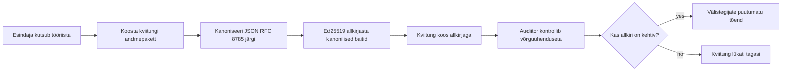

[Vaadake õppetunni videot: AI agentide turvamine krüptograafiliste kviitungitega](https://youtu.be/PLACEHOLDER_VIDEO_ID)

> _(Õppetunni video ja pisipilt lisatakse Microsofti sisutiimi poolt pärast ühendamist, järgides õppetunni 14 / 15 mustrit.)_

# AI agentide turvamine krüptograafiliste kviitungitega

## Sissejuhatus

See õppetund käsitleb:

- Miks AI agentide auditeerimisjäljed on olulised vastavuse, veaotsingu ja usalduse seisukohalt.
- Mis on krüptograafiline kviitung ja kuidas see erineb allkirjastamata logireast.
- Kuidas toota allkirjastatud kviitungit agendi tööriista kõne jaoks tavapärases Pythoni keeles.
- Kuidas kviitungit võrrelda võrguühenduseta ja avastada manipuleerimist.
- Kuidas keti moodustada nii, et ühe kviitungi eemaldamine või ümberjärjestamine katki lõhub kogu ketti.
- Mida kviitungid tõestavad ja mida nad otseselt ei tõesta.

## Õpieesmärgid

Pärast selle õppetunni lõpetamist oskad sa:

- Tuvastada rikeviise, mis motiveerivad krüptograafilist päritolu agentide tegevuste puhul.
- Toota Ed25519 allkirjastatud kviitungit kanonilise JSON andmepaketi üle.
- Kontrollida kviitungit iseseisvalt, kasutades ainult allkirjastaja avalikku võtit.
- Avastada manipuleerimist, kui kviitungit muudetud kujul uuesti kontrollitakse.
- Koostada räsi-põhine kviitungite jada ja selgitada, miks see jada on oluline.
- Eristada, mida kviitungid tõestavad (attribuut, terviklikkus, järjestus) ja mida nad ei tõesta (tegevuse korrektsus, poliitika õigsus).

## Probleem: Sinu Agendi Auditeerimisjälg

Kujuta ette, et oled rakendanud AI agendi Contoso Travel jaoks. Agent loeb klientide päringuid, kutsub lendude API-d, et otsida võimalusi, ja broneerib istekohti kliendi nimel. Eelmisel kvartalil töötles agent 50 000 broneeringut.

Täna ilmub audiitor. Ta küsib lihtsa küsimuse: "Näita mulle, mida sinu agent tegi."

Sa annad üle oma logifailid. Audiitor vaatab neid ja esitab raskema küsimuse: "Kuidas ma tean, et neid logisid ei muudetud?"

See on auditeerimisjälje probleem. Enamik agendi rakendusi tänapäeval toetub järgnevatele:

- **Rakenduse logid**: kirjed agenti poolt, mida võib muuta igaüks, kellel on failisüsteemi ligipääs.
- **Pilve logiteenused**: platvormil manipuleerimise tuvastus, kuid ainult juhul, kui audiitor usaldab platvormi haldajat.
- **Andmebaasi tehingulogid**: sobivad hästi andmebaasi muudatusteks, kuid mitte suvaliste tööriistakõnede jaoks.

Ükski neist ei suuda audiitori küsimusele vastata ilma, et audiitor peaks kedagi usaldama (sind, sinu pilveteenuse pakkujat, sinu andmebaasi pakkujat). Siseotstarbel on see usaldus sageli vastuvõetav. Reguleeritud töökoormuste puhul (finants, tervishoid, mis iganes Euroopa Liidu AI seaduse alla kuulub) see ei kehti.

Krüptograafilised kviitungid lahendavad selle, muutes iga agendi tegevuse iseseisvalt kontrollitavaks. Audiitor ei pea sind usaldama. Tal on vaja vaid sinu avalikku võtit ja kviitungit ennast.

## Mis on krüptograafiline kviitung?

Kviitung on JSON-objekt, mis salvestab, mida agent tegi, allkirjastatud digitaalse allkirjaga.


```mermaid
flowchart LR
    A[Esindaja kutsub tööriista] --> B[Koosta kviitungi andmepakett]
    B --> C[Kanoniseeri JSON RFC 8785 järgi]
    C --> E[Ed25519 allkirjasta kanonilised baitid]
    E --> F[Kviitung koos allkirjaga]
    F --> G[Audiitor kontrollib võrguühenduseta]
    G --> H{Kas allkiri on kehtiv?}
    H -- yes --> I[Välistegijate puutumatu tõend]
    H -- no --> J[Kviitung lükati tagasi]
```

Minimalistlik kviitung näeb välja selline:

```json
{
  "type": "agent.tool_call.v1",
  "agent_id": "contoso-travel-bot",
  "tool_name": "lookup_flights",
  "tool_args_hash": "sha256:a3f9c1...",
  "result_hash": "sha256:7b2e1d...",
  "policy_id": "contoso-travel-policy-v3",
  "timestamp": "2026-04-25T14:30:00Z",
  "sequence": 47,
  "previous_receipt_hash": "sha256:9d4e6a...",
  "signature": {
    "alg": "EdDSA",
    "sig": "c5af83...",
    "public_key": "8f3b2c..."
  }
}
```

Kolm omadust teevad selle töö:

1. **Allkiri**. Kviitungi allkirjastab agendi värav Ed25519 privaatvõtmega. Kõik, kellel on vastav avalik võti, saavad allkirja võrguühenduseta kontrollida. Välja muutmine rikub allkirja.

2. **Kanoniline kodeerimine**. Enne allkirjastamist serialiseeritakse kviitung JSON-i kanoniseerimisskeemi (JCS, RFC 8785) järgi. See tagab, et kaks erinevat rakendust, mis toodavad sama loogilist kviitungit, annavad baiti täpselt võrdsed tulemused. Ilma kanoniseerimiseta tooteks erinevad allkirjad.

3. **Räsiketting**. Välja `previous_receipt_hash` ühendab iga kviitungi eelmisega. Kviitungi eemaldamine või ümberjärjestamine katki lõhub kõiki pärast seda olevaid kviitungeid. Manipuleerimine muutub nähtavaks ka keti tasemel, isegi kui üksikud allkirjad jäävad vahele.

Koos annavad need kolm omadust kolm garantiid:

- **Attribuut**: see võti allkirjastas selle sisu.
- **Terviklikkus**: sisu ei ole pärast allkirjastamist muutunud.
- **Järjestus**: see kviitung tuli selle kviitungi järel ketis.

## Kviitungi tootmine Pythoni abil

Sul ei ole vaja spetsiaalset teeki kviitungi tootmiseks. Krüptograafilised primitiivid on laialdaselt kättesaadavad ning loogika on paarikümne rea pikkune Python.

Praktilistes harjutustes failis `code_samples/18-signed-receipts.ipynb` on kogu protsess samm-sammult lahti kirjutatud. Kokkuvõte:

```python
import json
import hashlib
import base64
from nacl import signing
from jcs import canonicalize  # RFC 8785 kanoniline JSON

def b64url_nopad(data: bytes) -> str:
    return base64.urlsafe_b64encode(data).decode("ascii").rstrip("=")

def sha256_canonical(obj) -> str:
    """SHA-256 of a Python object's JCS-canonical JSON form."""
    return f"sha256:{hashlib.sha256(canonicalize(obj)).hexdigest()}"

# Genereeri või laadi allkirjastamise võti (tootmises hoia võtmekeldris)
signing_key = signing.SigningKey.generate()
verify_key = signing_key.verify_key

# Koosta kviitungi laad (veel allkirjata)
tool_args = {"origin": "SYD", "destination": "LAX"}
tool_result = [{"flight": "QF11", "price": 1850, "stops": 0}]

payload = {
    "type": "agent.tool_call.v1",
    "agent_id": "contoso-travel-bot",
    "tool_name": "lookup_flights",
    "tool_args_hash": sha256_canonical(tool_args),
    "result_hash": sha256_canonical(tool_result),
    "policy_id": "contoso-travel-policy-v3",
    "timestamp": "2026-04-25T14:30:00Z",
    "sequence": 0,
    "previous_receipt_hash": None,
}

# Kanoniliseeri ja allkirjasta JCS baitid otse. Puhtalt EdDSA räsi seesmiselt.
canonical_bytes = canonicalize(payload)
signature_bytes = signing_key.sign(canonical_bytes).signature

# Lisa struktureeritud allkirjaobjekt.
receipt = {
    **payload,
    "signature": {
        "alg": "EdDSA",
        "sig": b64url_nopad(signature_bytes),
        "public_key": b64url_nopad(bytes(verify_key)),
    },
}
```

See on kogu allkirjastamise torujuhe. Harjutused märkmikus selgitavad kõiki samme.

## Kviitungi kontrollimine ja manipuleerimise avastamine

Kontrollimine on vastupidine protsess:

```python
import base64
import hashlib
from nacl import signing
from nacl.exceptions import BadSignatureError
from jcs import canonicalize

def b64url_decode(s: str) -> bytes:
    padding = "=" * ((4 - len(s) % 4) % 4)
    return base64.urlsafe_b64decode(s + padding)

def verify_receipt(receipt: dict) -> bool:
    # Allkiri on struktureeritud objekt: {"alg", "sig", "public_key"}.
    sig_obj = receipt.get("signature")
    if not sig_obj or sig_obj.get("alg") != "EdDSA":
        return False

    # Taasta koormus, mis tegelikult allkirjastati (kõik peale allkirja).
    payload = {k: v for k, v in receipt.items() if k != "signature"}

    canonical_bytes = canonicalize(payload)

    try:
        verify_key = signing.VerifyKey(b64url_decode(sig_obj["public_key"]))
        verify_key.verify(canonical_bytes, b64url_decode(sig_obj["sig"]))
        return True
    except BadSignatureError:
        return False
```

See funktsioon võtab kviitungi ja tagastab `True`, kui allkiri on kehtiv, muidu `False`. Ei mingit võrguiga, ei teenuse sõltuvust ega usaldust kolmandatesse osapooltesse.

Manipuleerimise avastamist näitab märkmes:

1. Toota kehtiv kviitung ja kinnitada selle õigsus.
2. Muuta ühte baiti välja `tool_args_hash` sees.
3. Kontrollida uuesti ja näha, et kontroll ebaõnnestub.

See on praktiline demonstratsioon, et kviitungid on manipuleerimise suhtes haavatavad: iga muudatus, isegi väga väike, katkestab allkirja.

## Kviitungite kettide moodustamine mitmeastmelistele agentidele

Üksik allkirjastatud kviitung kaitseb üht tegevust. Kviitungite jada kaitseb järjestust.


```mermaid
flowchart LR
    R0[Kviitung 0<br/>algus] --> R1[Kviitung 1]
    R1 --> R2[Kviitung 2]
    R2 --> R3[Kviitung 3]
    R1 -. previous_receipt_hash .-> R0
    R2 -. previous_receipt_hash .-> R1
    R3 -. previous_receipt_hash .-> R2
```

Iga kviitung salvestab eelmise kviitungi räsi. Kviitungi 2 vaikselt eemaldamiseks peaks ründaja:

- Muutma kviitungi 3 välja `previous_receipt_hash` (katkestab kviitungi 3 allkirja), VÕI
- Võltsima uut allkirja muudetud kviitungile 3 (nõuab agendi privaatvõtit).

Kui privaatvõti on riistvaras ja avalikku võtit publitseeritakse iga kviitungiga, ei ole kumbki rünnak avastamata võimalik.

Märkmik selgitab:

1. Kolme kviitungi keti loomine.
2. Kontrollida, et iga kviitungi välja `previous_receipt_hash` vastab eelmise kviitungi räsidele.
3. Ühe kviitungi keskel manipuleerimine ja keti purunemine täpselt sama koha peal.

Nii toodad auditeerimisjälje, mida väline audiitor saab kontrollida ilma sind usaldamata.

## Mida kviitungid tõestavad (ja mida mitte)

See on selle õppetunni kõige olulisem osa. Kviitungid on võimsad, kuid nende võim on piiratud.

**Kviitungid tõestavad kolme asja:**

1. **Attribuut**: konkreetne võti allkirjastas konkreetse andmepaketi.
2. **Terviklikkus**: andmepakett ei ole pärast allkirjastamist muutunud.
3. **Järjestus**: see kviitung tuli pärast seda kviitungit räsiketis.

**Kviitungid EI TÕESTA:**

1. **Õigsust**: et agendi tegevus oli õige tegevus. Kviitung võib olla allkirjastatud nii vale kui õige vastuse puhul.
2. **Poliitika järgimist**: et `policy_id`-s viidatud poliitika oli tegelikult hinnatud või et see oleks selle tegevuse lubanud. Kviitung salvestab, mida väideti, mitte mida rakendati.
3. **Identiteeti väljaspool võtit**: kviitung ütleb "see võti allkirjastas selle sisu." See ei ütle "seda inimest volitati." Võtme sidumine isiku või organisatsiooniga nõuab eraldi identiteeditaristut (kataloog, avaliku võtme register jms).
4. **Sisendite tõesust**: kui agent saab manipuleeritud käsu ja tegutseb selle põhjal, salvestab kviitung tegevuse täpselt. Kviitungid sõltuvad sisendi valideerimisest, nad ei asenda seda.

See piirastus on oluline kahe põhjusel:

- See ütleb, milleks kviitungid kasulikud on: muuta agendi käitumine auditeeritavaks ja manipuleerimiskindlaks, isegi organisatsioonidevaheliselt.
- See ütleb, milliseid täiendavaid kihte on vaja: sisendi valideerimine (õppetund 6), poliitika rakendamine (veenvaid lühidalt allpool), ja identiteeditaristu (see õppetund ei hõlma).

Levinud viga on arvata, et "meil on kviitungid" tähendab "meil on regulatsioon." See ei kehti. Kviitungid on alus. Regulatsioon on süsteem, mida sellele rajad.

## Kuidas tõestada inimese heakskiitu täpsele tegevusele

Punkt 3 on omaette teema: tegevuse kviitung ütleb "see võti allkirjastas selle sisu," mitte kunagi "see inimene volitas seda." Kõrge riski tegevustele (tagasimaksed, kustutused, ülekanded) nõuavad regulatsiooniraamistikud üha enam seda täpselt puuduvat avaldust, mis on saavutatav siin koolitatud primitiividega.

Järgnev märkmete komplekt `code_samples/human-authorization-receipts.ipynb` lisab teise liigi kviitungid, `human.approval.v1`, samas ümbrikus nagu selle õppetunni kviitungid (tüüpidatud andmepakett, millele on Ed25519 allkiri kanonilisel JCS kujul, kus `signature` objekt on allkirjastatud baitidest väljaspool). Nimetatud heakskiitja allkirjastab **täieliku kanonilise tegevuse ja selle räsi** enne täideviimist; agendi tegevuse kviitung kannab sama tegevuse räsi ja `parent_approval_ref`, heakskiidu `receipt_hash`, see on sama tava, mis `previous_receipt_hash` keti puhul eespool. Üks `verify_chain` kontrollib mõlemat objekti **erinevates kinnitatud võtme registrites** (volitaja võtmed vs agendi võtmed), nii et koodi tee on ühine, ent volitused ei ole kunagi.

Selle omandamise mõiste kõlab nii: *inimene heaks kiitis selle täpse tegevuse ja agent sooritas täpselt selle heakskiidetud tegevuse.* Märkmiku keeldumisjuhtumid teevad omaduse reaalseks, mitte ainult väljaütlemiseks:

- klassikalised komplektid: manipuleerimine, segadusse ajav esindaja, kordus, võltsitud võtmed mõlemal poolel, vigane sisend;
- **aegunud volitus**: allkiri kehtib endiselt, kuid keeldutakse sellegipoolest, kuna poliitika versioon muutus, volitaja võti eemaldati kinnitatud registrist või heakskiit aegus enne täideviimist;
- **räsi asendus**: kehtivalt allkirjastatud tegevuse kviitung viitab *tõelisele* heakskiidule, mis seob *erineva* kanonilise tegevusega.

Iga viga keelab teatud põhjusel, nii et audiitor saab lugeda, kas volitus aegus või tegevus muutus. Märkmik õpetab: allkirjastatud heakskiit ei ole volitus iseenesest. Volitus eksisteerib ainult, kui mõlemad kviitungid seovad endiselt sama kanonilise tegevusega selle täideviimise ajal. Inimese heakskiidu kviitung on hariduslik kompositsioon, mille määrab see õppetund, mitte tüüpiline kviitung `draft-farley-acta-signed-receipts`.

## Tootmise viited

Selle õppetunni Pythoni kood on tahtlikult minimaalne, et sa saaksid iga rea läbi lugeda ja mõista, mis toimub. Tootmises on sul kaks võimalust:

1. **Ehita otse krüptograafiliste primitiivide peale.** Eespool nähtud 50 rida katavad paljud kasutusjuhtumid. PyNaCl (Ed25519) ja `jcs` pakett (kanoniline JSON) on hästi hooldatud ja auditeeritud teegid.

2. **Kasuta tootmislikku kviitungite teeki.** Mitmed avatud lähtekoodiga projektid rakendavad sama mustrit lisafunktsioonidega (võtme pööramine, kihiline kontroll, JWK kogumite levitamine, poliitika mootorite integreerimine):
   - Allkirjastamistoru kasutab JCS ja allkirja ulatuse konventsioone sõltumatult IETF Internet-Draft'is ([`draft-farley-acta-signed-receipts`](https://datatracker.ietf.org/doc/draft-farley-acta-signed-receipts/), revisjon 02). Selle õppetunni tasane hariduslik kviitung erineb drafti `{payload, signature}` ümbrikust ega ole esitatud kui nõuetele vastav teostus. Draft avaldab ühise vastavuskomplekti ([agent-governance-testvectors](https://github.com/ScopeBlind/agent-governance-testvectors)) neile, kes sihivad tema juurdepääsuformaati.
   - Microsoft Agent Governance Toolkit kombineerib kviitungid Cedar-põhiste poliitika otsustega; näide lõpp-lõpuni on juhendis nr 33.
   - Pakid `protect-mcp` (npm) ja `@veritasacta/verify` (npm) pakuvad Node-põhist teostust kviitungite allkirjastamiseks ja võrguühenduseta kontrolliks, mõeldud MCP serveri ümber mässimiseks manipuleerimiskindla auditeerimisjäljega, kaasa arvatud ootel oleku kooskõlastusvool, kus pausitud tegevus väljastab heakskiidu kviitungi, mis on seotud tegevuse räsidega (WebAuthn tugi töölaua voos), sama heakskiit-kviitungi mustriga nagu eelnevalt mainitud inimese volituse märkmete komplekt.
   - **[nobulex](https://github.com/arian-gogani/nobulex)** Python SDK (`pip install nobulex`) pakub sama Ed25519 + JCS allkirjastamise mustrit Pythonis koos LangChain ja CrewAI integratsioonidega, sisaldades avaldatud ristkontrolli testvektoreid ja vastavuskaardi panust OWASP PR #2210 kaudu.

Rohelise teegi ja oma teegi valiku otsus on sama, mis JWT teegi enda kirjutamise ja testitud kolmanda osapoole kasutamise vahe. Mõlemad on põhjendatud; teek säästab aega ja vähendab auditeerimise pindala; algne lähenemine sunnib sind mõistma iga primitiivi. See õppetund õpetab algusest algust, et sul oleks alus mõlemaks valikuks.

## Teadmiste kontroll

Testi oma arusaama enne praktilist harjutust.

**1. Kviitung on allkirjastatud agendi privaatse Ed25519 võtmega. Audiitoril on ainult avalik võti. Kas audiitor saab kviitungit võrguühenduseta kontrollida?**

<details>
<summary>Vastus</summary>

Jah. Ed25519 kontrollimiseks on vaja ainult avalikku võtit ja allkirjastatud baite. Ei mingit võrguiga, teenuse sõltuvust. See omadus teeb kviitungid kasulikuks võrgust välja lõigatud, mitme organisatsiooni või madala usaldustasemega auditeerimiskeskkondades.
</details>

**2. Ründaja muudab kviitungi välja `policy_id`, et väita, et seda valitses lubavam poliitika. Allkiri oli algse andmepaketi peal. Mis juhtub kontrolli käigus?**

<details>
<summary>Vastus</summary>


Kontroll ebaõnnestub. Allkiri arvutati algse kande kanoniliste baitide üle; mis tahes välja muutmine muudab need baitid, mis teeb allkirja kehtetuks. Ründajal oleks värske kehtiva allkirja loomise jaoks vaja privaatvõtit, mida tal ei ole.
</details>

**3. Miks sisaldab kviitung `tool_args_hash` ja `result_hash` asemel toorargumente ja -tulemust?**

<details>
<summary>Vastus</summary>

Kahel põhjusel. Esiteks võib kviitungit vaja olla arhiveerida või edasi saata keskkondades, kus tooraine sisu lekkimine (PII, ärilised andmed) on probleem. Räsimine hoiab kviitungi väikse ja sisu privaatse; audiitor kontrollib, et räsi vastab eraldi salvestatud tegeliku sisuga. Teiseks on räsidel fikseeritud suurus; kviitung räsidega on suuruselt piiratud sõltumata sellest, kui suured olid sisendid ja väljundid.
</details>

**4. Välja `previous_receipt_hash` kaudu lingib iga kviitung oma eelkäijaga. Kui ründaja kustutab ahelast vaikselt ühe kviitungi keskel, mis muutub kehtetuks?**

<details>
<summary>Vastus</summary>

Iga kviitung, mis tuli kustutatu järel. Nende `previous_receipt_hash` väljad ei vasta enam tegelikule ahelale (sest kviitung, millele nad viitasid, ei eksisteeri enam või ahel viitab nüüd teisele eelkäijale). Kustutamise varjamiseks peaks ründaja uuesti allkirjastama iga hilisema kviitungi, mis vajab privaatvõtit.
</details>

**5. Kviitung kontrollitakse õigeks. Kas see tõestab, et agendi tegevus oli õige, korrektselt tehtud või vastavuses poliitikaga?**

<details>
<summary>Vastus</summary>

Ei. Kehtiv kviitung tõestab kolme asja: omistamist (see võti allkirjastas selle sisu), terviklikkust (sisu ei ole muutunud) ja järjekorda (see kviitung tuli pärast seda kviitungit). See EI tõesta, et tegevus oli õige, et `policy_id` nimega poliitikat hinnati või et agent järgnes kõigile reeglitele. Kviitungid teevad agendi käitumise auditeeritavaks, mitte tingimata õigeks. See on kõige olulisem piirihaare selles õppetükis.
</details>

## Praktikaülesanne

Ava `code_samples/18-signed-receipts.ipynb` ja täida kõik neli osa:

1. **1. osa**: Allkirjasta oma esimene kviitung ja kontrolli seda.
2. **2. osa**: Muuda kviitungit ja märka kontrolli ebaõnnestumist.
3. **3. osa**: Koo kolmekohaline kviitungite ahel ja kontrolli ahela terviklikkust.
4. **4. osa**: Rakenda mustrit Microsoft Agent Frameworkiga loodud agendi peale: paki tööriistakõne kviitungi allkirjastamisse ja siis kontrolli kviitungit iseseisvalt.

**Lisaväljakutse 1:** pikenda kviitungiskeemi ühe lisaväljaga, mille valid ise (näiteks taotlus-ID jälgimiseks), uuenda kanonilist allkirjastamiste loogikat, et see seda sisaldaks, ja kinnita, et kviitung läbib endiselt kontrolli. Muuda välja pärast allkirjastamist ja kinnita kontrolli ebaõnnestumist. See sunnib sind mõistma, kuidas iga bait kanonilises kodeerimises allkirja panustab.

**Lisaväljakutse 2:** SHA-256 hash'i kaks sinu kviitungit kokku (ühenda nende kanonilised baitid deterministlikus järjekorras) ja pane tulemuslik digest kolmanda kviitungi uue väljaga enne allkirjastamist. Kontrolli, et kõik kolm kviitungit läbivad endiselt kontrolli. Sa oled just loonud ühe-käigulise kaasatatuse tõendi: kellel on kolmas kviitung, saab tõestada, et esimesed kaks olid olemas allkirjastamisajal, ilma et peaks nende sisu avaldama. See on mustrit, mida selektiivse avalikustamise kviitungid suures mahus kasutavad (Merkle kohustused, RFC 6962).

## Kokkuvõte

Krüptograafilised kviitungid annavad tehisintellekti agentidele auditeerimisjälje, mis on:

- **Iseseisvalt kontrollitav**: iga osapool, kellel on avalik võti, saab kontrollida, ilma teenuse sõltuvuseta.
- **Muutmisele vastupidav**: mis tahes muudatus tühistab allkirja.
- **Ülekantav**: kviitung on väike JSON-fail; seda saab arhiveerida, edastada ja kontrollida kõikjal.
- **Standarditele vastav**: ehitatud Ed25519 (RFC 8032), JCS (RFC 8785) ja SHA-256 peal, kõik laialdaselt kasutatavad primitiivid.

Need ei asenda sisendite valideerimist, poliitikate rakendamist ega identiteeditaristut. Nad on nende kihtide alus. Kui saadad agente reguleeritud töökoormatesse, mitmeorganisatsioonilistesse töövoogudesse või ükskõik millisesse olukorda, kus tulevast audiitorit ei saa eeldada usaldavat sind, siis kviitungid on see, kuidas sa teed auditeerimisjälje ausaks.

Kõige olulisem õppetund: kviitungid tõestavad, kes ütles mida, millal. Nad ei tõesta, et öeldu oli tõene või õige. Hoia seda vahet rangelt. See on vahe ausa päritolusüsteemi ja eksitava vahel.

## Tootmisse mineku kontrollnimekiri

Kui oled valmis sellest õppetükist edasi liikuma ning kasutama allkirjastatud kviitungitega agente tõelises keskkonnas:

- [ ] **Liiguta allkirjastamisvõti arendaja sülearvutist ära.** Kasuta Azure Key Vaulti, AWS KMS-i või riistvaralist turvemoodulit. Privaatvõti, millega allkirjastad kviitungid, ei tohi kunagi elada lähtekoodihalduses ega selges tekstis rakenduse masinatel.
- [ ] **Avalda kontrolli avalik võti.** Audiitoritel on vaja seda võrguühenduseta kontrollimiseks. Standardne muster on JWK komplekt hästi tuntud URL-is (RFC 7517), nt `https://your-org.example.com/.well-known/agent-keys.json`.
- [ ] **Ankurda ahel välistesse allikatesse.** Kirjuta perioodiliselt viimase ahelapea räsi läbipaistvuse logisse (Sigstore Rekor, RFC 3161 ajatempli autoriteet või teine sise-eiustooria süsteem), et väline osapool saaks kinnitada „see ahel eksisteeris sel ajal“.
- [ ] **Säilita kviitungid muutumatult.** Lisa-ainult blob-salvestus (Azure Storage koos muutumatuse poliitikatega, AWS S3 objekt lukustamine) takistab sisemist isikut ajaloo ümberkirjutamisel salvestustasemel.
- [ ] **Otsusta säilitamise üle.** Paljud nõuetele vastavuse režiimid nõuavad mitmeaastast säilitust. Planeeri kviitungite kasvu (iga kviitung on ~500 baiti; agent, kes teeb 10K kõnet päevas, toodab ~1,8 GB aastas).
- [ ] **Dokumenteeri, mida kviitungid ei hõlma.** Kviitungid tõestavad omistamist, terviklikkust ja järjekorda. Sinu tööjuhendis peaks olema selgelt loetletud, millised täiendavad kontrollid (sisendite valideerimine, poliitikate rakendamine, kiirusepiirangud, identiteeditaristu) asuvad kviitungitega kõrvuti sinu valitsemispoliitikas.

### Rohkem küsimusi AI agentide turvamise kohta?

Liitu [Microsoft Foundry Discordi](https://aka.ms/ai-agents/discord) kanaliga, et kohtuda teiste õppijatega, osaleda kontorite tundides ja saada vastuseid oma AI agentide küsimustele.

## Selle õppetüki järg

See õppetükk hõlmab ühe kviitungi allkirjastamist ja räsi ahelates järjestamist. Samad primitiivid moodustavad veel mitmeid edasijõudnute mustreid, millega võid kokku puutuda oma valitsemispoliitika küpsemisel:

- **Selektiivne avalikustamine.** Kui kviitungi väljad on iseseisvalt kohustatud (RFC 6962 stiilis Merkle puu), saad avalikustada konkreetseid välju spetsiifilistele audiitoritele ja tõestada, et ülejäänud pole muutunud, ilma et neid paljastaksid. Kasulik, kui sama kviitung peab rahuldama nii põhjaliku auditi (mis tahab täielikkust) kui andmekaitse regulatsioonide nagu GDPR nõudeid (mis tahavad, et audiitor näeks minimaalselt vajalikku).
- **Kviitungi tühistamine.** Kui allkirjastamisvõti kompromiteerub, vajad viisi kõikide selle võtmega allkirjastatud kviitungite usaldamatuks märkimiseks edaspidi. Standardmustrid: lühiajalised allkirjastamisvõtmed koos avaldatud tühistamisnimekirjaga või läbipaistvuse logi tühistamississetulekutega.
- **Kahepoolsed / jaotatud allkirjaga kviitungid.** Mõned rakendused jagavad allkirjastatud kande kahte ossa: eel-käivitus (`authorization_*`) ja järel-käivitus (`result_*`) poolteks iseseisvate allkirjadega, kasulik siis, kui autoriseerimisotsuse ja vaadeldud tulemuse toodavad erinevad osapooled või erinevatel aegadel. See moodustab liitmise lisaks selles õppetükis õpetatud kviitungivormingule.
- **Andmekande kompositsioon.** Kviitung kinnitab kõiki baitisid, mis paned `result_hash`-i. Reaalsed andmekanded on sageli rikkalikumad kui üks tööriistakõne tulemus: otsuse-eelne põhjendus (mõtlemine, mudeli prognoos, arvestatud valikud, tõendusmaterjal ja selle täielikkus, riskipositsioon, vastutusahel, väravtulemus) võib kõik elada andmekandes, mida kinnitab üks kviitung. See hoiab kviitungi formaadi minimaalsena, võimaldades andmeskeemidel areneda domeenipõhiselt.
- **Ristrakenduste vastavus.** Mitmed iseseisvad rakendused samale kviitungiformaadile (Python, TypeScript, Rust, Go) kontrollivad omavahel vastavust jagatud testvektorite vastu. Kui ehitad enda rakenduse, kinnitab avaldatud vektorite vastu valideerimine juhtmestiku ühilduvust.
- **Kvantarvutitejärgne migratsioon.** Ed25519 on tänapäeval laialdaselt kasutusel, kuid ei ole kvantarvutite vastu vastupidav. Kviitungi formaat on algoritmiliselt paindlik: `signature.alg` väli võib kanda `ML-DSA-65` (NIST-i kvantarvutijärgne allkirjastamisstandard), kui vajad migreerumist. Plaani üleminekuperiood, mil kviitungid on kahekordselt allkirjastatud.

## Täiendavad ressursid

- <a href="https://datatracker.ietf.org/doc/draft-farley-acta-signed-receipts/" target="_blank">IETF Internet-Draft: Masinatevahelise juurdepääsu kontrolli allkirjastatud otsuse kviitungid</a>
- <a href="https://learn.microsoft.com/azure/ai-studio/responsible-use-of-ai-overview" target="_blank">Vastutustundliku AI ülevaade (Azure AI)</a>
- <a href="https://datatracker.ietf.org/doc/html/rfc8032" target="_blank">RFC 8032: Edwards kõvera digitaalse allkirja algoritm (EdDSA)</a>
- <a href="https://datatracker.ietf.org/doc/html/rfc8785" target="_blank">RFC 8785: JSON-i kanonilise vormindamise skeem (JCS)</a>
- <a href="https://datatracker.ietf.org/doc/html/rfc6962" target="_blank">RFC 6962: Sertifikaadi läbipaistvus</a> (Merkle-puu konstruktsioon selektiivse avalikustamise kviitungite jaoks)
- <a href="https://github.com/microsoft/agent-governance-toolkit/blob/main/docs/tutorials/33-offline-verifiable-receipts.md" target="_blank">Microsoft Agent Governance Toolkit, juhend 33: võrguühenduseta kontrollitavad otsuse kviitungid</a>
- <a href="https://github.com/ScopeBlind/agent-governance-testvectors" target="_blank">Ristrakenduste vastavuse testvektorid</a> selle õppetüki kviitungivormingule (Apache-2.0)
- <a href="https://pynacl.readthedocs.io/" target="_blank">PyNaCl dokumentatsioon</a> (Ed25519 Pythoni jaoks)

## Eelmine õppetükk

[Kohalikud AI agendid](../17-creating-local-ai-agents/README.md)

---

<!-- CO-OP TRANSLATOR DISCLAIMER START -->
**Lahtiütlus**:
See dokument on tõlgitud kasutades AI tõlketeenust [Co-op Translator](https://github.com/Azure/co-op-translator). Kuigi me püüdleme täpsuse poole, palun pange tähele, et automatiseeritud tõlgetes võib esineda vigu või ebatäpsusi. Originaaldokument selle emakeeles tuleks pidada autoriteetseks allikaks. Olulise teabe puhul soovitatakse kasutada professionaalset inimtõlget. Me ei vastuta selle tõlkega seotud eksimustest või valesti mõistmistest.
<!-- CO-OP TRANSLATOR DISCLAIMER END -->