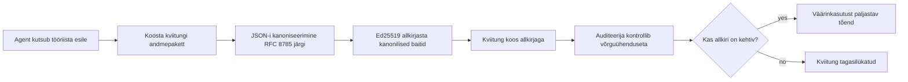

[Vaata õppetunni videot: AI agentide turvalisus krüptograafiliste tšekkidega](https://youtu.be/PLACEHOLDER_VIDEO_ID)

> _(Õppetunni video ja pisipilt lisab pärast ühinemist Microsofti sisutiim, järgides õppetunni 14 / 15 mustrit.)_

# AI agentide turvamine krüptograafiliste tšekkidega

## Sissejuhatus

Selles õppetunnis käsitletakse:

- Miks auditeerimislugude olulisus AI agentidele vastavuse, silumise ja usaldusväärsuse tagamisel.
- Mis on krüptograafiline tšekk ja kuidas see erineb allkirjastamata logireaist.
- Kuidas toodetakse agenti tööriistakutse jaoks allkirjastatud tšekk tavalise Pythoniga.
- Kuidas tšekki võrrelda võrguühenduseta ja tuvastada muutmine.
- Kuidas ühendada tšekke ahelasse nii, et ühe eemaldamine või ümberjärjestamine katkestab ahela.
- Mida tšekid tõendavad ja mida need otseselt ei tõenda.

## Õpieesmärgid

Selle õppetunni läbimisel oskad:

- Tuvastada ebaõnnestumise juhtumid, mis nõuavad agentide tegevuste krüptograafilist jälgitavust.
- Toota Ed25519 allkirjastatud tšekk kanonilise JSON-i kohta.
- Kontrollida tšekki sõltumatult, kasutades ainult allkirjastaja avalikku võtit.
- Tuvastada muutmine, kordades kontrolli muudetud tšeki puhul.
- Ehita räsiühendustega tšekkide järjestus ja selgita, miks ahel on oluline.
- Tuvastada piir, mida tšekid tõendavad (omistamine, terviklikkus, järjekord) ja mida mitte (tegevuse õigsus, poliitika korrektsus).

## Probleem: sinu agendi auditeerimisjälg

Kujuta ette, et oled paigaldanud Contoso Reisi AI agendi. Agent loeb kliendi päringud, kutsub lendude API-d valikute leidmiseks ja broneerib istekohti kliendi eest. Eelmisel kvartalil töötles agent 50 000 broneeringut.

Täna saabub audiitor. Ta esitab lihtsa küsimuse: "Näita mulle, mida su agent tegi."

Sa annad üle oma logifailid. Audiitor vaatab neid ja esitab raskema küsimuse: "Kuidas ma tean, et neid logisid ei ole muudetud?"

See on auditeerimisjälje probleem. Enamik tänapäevaseid agentide paigaldusi tugineb:

- **Rakenduse logidele**: mida agent ise kirjutab, mida saab muuta kellel iganes failisüsteemi ligipääs.
- **Pilvelogimise teenustele**: platvormitasemel muutmisvastased, kuid ainult juhul kui audiitor usaldab platvormi opereerijat.
- **Andmebaasi tehingulogidele**: sobivad hästi andmebaasi muudatustele, kuid mitte suvalistele tööriistakutsetele.

Ükski neist ei oska audiitori küsimust vastata ilma audiitori usaldust taotlema (sind, sinu pilvetarnijat, sinu andmebaasi pakkujat). Sisevõtete puhul on see sageli vastuvõetav. Reguleeritud koormuste korral (finants, tervishoid, kõik mida reguleerib EL AI määrus) see ei sobi.

Krüptograafilised tšekid lahendavad selle, võimaldades iga agenttegevust iseseisvalt kontrollida. Audiitor ei pea sind usaldama. Tal on vaja ainult sinu avalikku võtit ja tšekki ennast.

## Mis on krüptograafiline tšekk?

Tšekk on JSON-objekt, mis salvestab, mida agent tegi, allkirjastatud digitaalse allkirjaga.


```mermaid
flowchart LR
    A[Agent kutsub tööriista esile] --> B[Koosta kviitungi andmepakett]
    B --> C[JSON-i kanoniseerimine RFC 8785 järgi]
    C --> E[Ed25519 allkirjasta kanonilised baitid]
    E --> F[Kviitung koos allkirjaga]
    F --> G[Auditeerija kontrollib võrguühenduseta]
    G --> H{Kas allkiri on kehtiv?}
    H -- yes --> I[Väärinkasutust paljastav tõend]
    H -- no --> J[Kviitung tagasilükatud]
```

Minimaalne tšekk näeb välja selline:

```json
{
  "type": "agent.tool_call.v1",
  "agent_id": "contoso-travel-bot",
  "tool_name": "lookup_flights",
  "tool_args_hash": "sha256:a3f9c1...",
  "result_hash": "sha256:7b2e1d...",
  "policy_id": "contoso-travel-policy-v3",
  "timestamp": "2026-04-25T14:30:00Z",
  "sequence": 47,
  "previous_receipt_hash": "sha256:9d4e6a...",
  "signature": {
    "alg": "EdDSA",
    "sig": "c5af83...",
    "public_key": "8f3b2c..."
  }
}
```

Kolm omadust teevad kogu töö:

1. **Allkiri**. Tšekki allkirjastab agendi värav Ed25519 privaatvõtmega. Kõik, kellel on vastav avalik võti, saavad allkirja võrguühenduseta kontrollida. Igasugune muutmine tühistab allkirja.

2. **Kanoniline kodeerimine**. Enne allkirjastamist teisendatakse tšekk JSONi Kanonilise Süntaksi skeemi (JCS, RFC 8785) järgi. See tagab, et kaks erinevat implementatsiooni, mis toodavad sama loogilise tšeki, annavad täpselt samad baitid. Ilma kanoniseerimiseta annaksid erinevad JSON-i seriaalijad erineva allkirja samale sisule.

3. **Räsiühendus**. Välja `previous_receipt_hash` seob iga tšeki eelmisega. Ühe tšeki eemaldamine või ümberjärjestamine katkestab kõik pärast seda järgnevad tšekid. Muutmine paistab tulevat ahela tasemel nähtavale, isegi kui üksiku allkirja vahele jäetakse.

Koos tagavad need omadused kolm garantiid:

- **Omistamine**: see võti allkirjastas selle sisu.
- **Terviklikkus**: sisu ei ole alates allkirjastamisest muutunud.
- **Järjestus**: see tšekk tuli pärast seda tšekki ahelas.

## Tšeki tootmine Pythoni abil

Tšeki tootmiseks pole vaja erilist teeki. Krüptograafilised primitiivid on laialdaselt kättesaadavad ja loogika on vaid paarikümne rea pikkune.

Praktilised harjutused failis `code_samples/18-signed-receipts.ipynb` juhendavad tervet protsessi. Kokkuvõttev versioon:

```python
import json
import hashlib
import base64
from nacl import signing
from jcs import canonicalize  # RFC 8785 kanooniline JSON

def b64url_nopad(data: bytes) -> str:
    return base64.urlsafe_b64encode(data).decode("ascii").rstrip("=")

def sha256_canonical(obj) -> str:
    """SHA-256 of a Python object's JCS-canonical JSON form."""
    return f"sha256:{hashlib.sha256(canonicalize(obj)).hexdigest()}"

# Genereeri või lae allkirjastamisvõti (tootmises hoia võtmevaras)
signing_key = signing.SigningKey.generate()
verify_key = signing_key.verify_key

# Koosta kviitungi koormus (veel ilma allkirjata)
tool_args = {"origin": "SYD", "destination": "LAX"}
tool_result = [{"flight": "QF11", "price": 1850, "stops": 0}]

payload = {
    "type": "agent.tool_call.v1",
    "agent_id": "contoso-travel-bot",
    "tool_name": "lookup_flights",
    "tool_args_hash": sha256_canonical(tool_args),
    "result_hash": sha256_canonical(tool_result),
    "policy_id": "contoso-travel-policy-v3",
    "timestamp": "2026-04-25T14:30:00Z",
    "sequence": 0,
    "previous_receipt_hash": None,
}

# Kanooniline ja allkirjasta JCS-baidid otse. PureEdDSA teostab sisemiselt räsimisi.
canonical_bytes = canonicalize(payload)
signature_bytes = signing_key.sign(canonical_bytes).signature

# Lisa struktureeritud allkirja objekt.
receipt = {
    **payload,
    "signature": {
        "alg": "EdDSA",
        "sig": b64url_nopad(signature_bytes),
        "public_key": b64url_nopad(bytes(verify_key)),
    },
}
```

See on kogu allkirjastamise ahel. Märkmiku harjutused käsitlevad iga sammu üksikasjalikult.

## Tšeki kontrollimine ja muutmiste tuvastamine

Kontroll on pöördoperatsioon:

```python
import base64
import hashlib
from nacl import signing
from nacl.exceptions import BadSignatureError
from jcs import canonicalize

def b64url_decode(s: str) -> bytes:
    padding = "=" * ((4 - len(s) % 4) % 4)
    return base64.urlsafe_b64decode(s + padding)

def verify_receipt(receipt: dict) -> bool:
    # Allkiri on struktureeritud objekt: {"alg", "sig", "public_key"}.
    sig_obj = receipt.get("signature")
    if not sig_obj or sig_obj.get("alg") != "EdDSA":
        return False

    # Rekonstrueeri kasulik koormus, mida tegelikult allkirjastati (kõik peale allkirja).
    payload = {k: v for k, v in receipt.items() if k != "signature"}

    canonical_bytes = canonicalize(payload)

    try:
        verify_key = signing.VerifyKey(b64url_decode(sig_obj["public_key"]))
        verify_key.verify(canonical_bytes, b64url_decode(sig_obj["sig"]))
        return True
    except BadSignatureError:
        return False
```

See funktsioon võtab tšeki ja tagastab `True`, kui allkiri on kehtiv, ja `False` vastasel juhul. Ilma võrgukõneta, teenusesõltuvuseta ega kolmanda osapoole usaldamiseta.

Muutmiste tuvastamise demonstratsiooniks juhendatakse märkmikus:

1. Olulise tšeki tootmine ja kontrolli kinnitamine.
2. Ühe baidi muutmine väljal `tool_args_hash`.
3. Kontrolli uuesti käivitamine ja ebaõnnestumine.

See on praktiline näide, et tšekid on muutmiste suhtes nähtavad: iga muudatus, ükskõik kui väike, rikub allkirja.

## Tšekkide ahel ühendamata agentidele

Üks allkirjastatud tšekk kaitseb ühte tegevust. Tšekkide ahel kaitseb järjestust.


```mermaid
flowchart LR
    R0[Kviitung 0<br/>algus] --> R1[Kviitung 1]
    R1 --> R2[Kviitung 2]
    R2 --> R3[Kviitung 3]
    R1 -. previous_receipt_hash .-> R0
    R2 -. previous_receipt_hash .-> R1
    R3 -. previous_receipt_hash .-> R2
```

Iga tšekk salvestab eelneva tšeki räsi. Kui ründaja sooviks vaikides eemaldada tšeki nr 2, peaks ta kas:

- Muutma tšeki nr 3 välja `previous_receipt_hash` (rikub tšeki nr 3 allkirja), VÕI
- Võltsima uut allkirja muudetud tšekile nr 3 (nõuab agendi privaatvõtit).

Kui privaatvõti hoitakse riistvara võtmete varjulis ja avalik võti avaldatakse koos iga tšekiga, pole kumbki rünnak avastamiseta võimalik.

Märkmik juhendab:

1. Kolme tšeki ahela ehitamist.
2. Iga tšeki välja `previous_receipt_hash` vastavuse kontrollimist eelmise tšeki tegeliku räsidega.
3. Muutmise proovimist ühe tšeki keskel ja ahela katkestamist täpselt selles punktis.

Nii toodad auditeerimisjälje, mida väline audiitor saab kontrollida ilma sinu usalduseta.

## Mida tšekid tõendavad (ja mida mitte)

See on õppetunni kõige olulisem osa. Tšekid on võimsad, kuid nende mõjurõhk on piiratud.

**Tšekid tõendavad kolme asja:**

1. **Omistamine**: konkreetne võti allkirjastas konkreetse andmepaki.
2. **Terviklikkus**: andmepakk ei ole allkirjastamisest muutunud.
3. **Järjestus**: see tšekk tuli selle tšeki järel räsi ahelas.

**Tšekid EI tõenda:**

1. **Õigsus**: et agendi tegevus oli õige. Tšekki saab allkirjastada valedele vastustele samamoodi kui õigele.
2. **Poliitikajärgimine**: et välja `policy_id` viidatud poliitikat hinnati või et see oleks lubanud tegevuse. Tšekk salvestab väidet, mitte nõuet.
3. **Identiteet väljaspool võtit**: tšekk ütleb "see võti allkirjastas selle sisu." Mitte "inimene kinnitas seda." Võtme sidumine isiku või organisatsiooniga eeldab eraldi identiteeditaristut (kataloog, avalike võtmete register jne).
4. **Sisendite tõesus**: kui agent saab manipuleeritud sisendi ja tegutseb selle järgi, salvestab tšekk tegevuse truult. Tšekid on allpool sisendikontrollist, mitte selle asendajad.

See piir on oluline kahest põhjusest:

- See ütleb, mille jaoks tšekid on kasulikud: muutes agendi käitumise auditeeritavaks ja muutmisvastaseks, ka organisatsioonipiiride ületamisel.
- See ütleb, milliseid täiendavaid kihte veel vajad: sisendikontroll (Õppetund 6), poliitika täitmine (allpool lühidalt) ja identiteeditaristu (täiesti õppetunnist väljas).

Levinud eksitus on eeldada, et "meil on tšekid" tähendab "meil on juhtimine." Ei tähenda. Tšekid on alus. Juhtimine on süsteem, mida sellele rajad.

## Tõestamaks, et inimene kinnitas täpselt selle tegevuse

Punkt 3 on omaette teema: tegevustšekk ütleb "see võti allkirjastas selle sisu," mitte "inimene kinnitas seda." Kõrge riskiga tegevuste (tagasimaksed, kustutused, ülekanded) puhul nõuavad juhtimisraamistikud üha rohkem täpselt puuduvat kinnitust, mis on teostatav nende samade primitiividega, mida õppetunnis ehitati.

Järgmine märkmik `code_samples/human-authorization-receipts.ipynb` lisab teise tšeki tüübi, `human.approval.v1`, samas ümbrikuvormis, nagu selle õppetunni tšekid (tüübitud andmepakk, mis on Ed25519-ga allkirjastatud kanoniliste JCS baitide üle, kus objekt `signature` on allkirjastatud baitidest väljaspool). Nimetatud kinnitaja allkirjastab **täieliku kanonilise tegevuse ja selle räsi** enne täitmist; agendi tegevustšekk kannab **sama tegevuse räsi** ja `parent_approval_ref`, mis on kinnituse `receipt_hash`, sama konventsioon nagu `previous_receipt_hash` ahelas, mille ehitasid ülal. Üks `verify_chain` käivitab mõlemad objektid **separaatsete kinnitatud võtme registrite** all (kinnitaja võtmed vs agendi võtmed), nii et kooditee on jagatud, aga volitused mitte.

Omandatud omadus, hoolikalt sõnastatud: *inimene kinnitas täpselt selle tegevuse ja agent täitis täpselt selle kinnitatud tegevuse.* Märkmikus olevad keeldumiseksemplarid muudavad selle omaduse reaalseks, mitte vaid väidetavaks:

- klassikaline komplekt: muutmine, segadusse ajav esindaja, kordus, mõlema poole võltsitud võtmed, valesti vormistatud sisend;
- **aegunud volitus**: allkiri, mis endiselt kontrollib, kuid keeldutakse sellepärast, et poliitika versioon muutus, kinnitaja võti eemaldati registrist või kinnitus aegus enne täitmist;
- **räsi asendus**: kehtivalt allkirjastatud tegevustšekk, mis viitab *päris* kinnitusele, mis seob *erineva* kanonilise tegevusega.

Iga ebaõnnestumine keeldub erineval põhjusel, nii et audiitor saab keeldumise lugedes aru, kas volitus aegus või täidetud tegevus muutus. Märkmiku reegel: allkirjastatud kinnitus ei ole volitus iseenesest. Volitus on alles siis, kui mõlemad tšekid seovad sama kanonilist tegevust täitmise hetkel. Inimese kinnitustšekk on hariduslik kompositsioon, mille määrab see õppetund, mitte tšeki tüüp, mida määrab `draft-farley-acta-signed-receipts`.

## Tööstuslikud viited

Selle õppetunni Python-kood on taotluslikult minimaalne, et sa saaksid iga rea kätte ja täpselt mõista, mis toimub. Tootmises on sul kaks võimalust:

1. **Ehita krüptograafiliste primitiivide peale.** Ülal näidatud 50 rida sobivad paljudeks juhtudeks. PyNaCl (Ed25519) ja pakett `jcs` (kanoniline JSON) on hästi hooldatud ja auditeeritud teegid.

2. **Kasuta tootmistšeki teeki.** Mitmed avatud lähtekoodi projektid rakendavad sama mustrit lisafunktsioonidega (võtme rotatsioon, hulgi kontroll, JWK Seti levitamine, integratsioon poliitikamootoritega):
   - Allkirjastamise ahel kasutab JCS-i ja allkirja ulatuse konventsioone sõltumatul IETF Internet-Draftil ([`draft-farley-acta-signed-receipts`](https://datatracker.ietf.org/doc/draft-farley-acta-signed-receipts/), versioon 02). Selle õppetunni lihtne hariduslik tšekk erineb selle eelnõu `{payload, signature}` ümbrikust ega ole esitatud vastavaks implementeerimiseks. Eelnõu avaldab ühise vastavustesti komplekti ([agent-governance-testvectors](https://github.com/ScopeBlind/agent-governance-testvectors)) juhtudel, mis sihivad selle traadiformaati.
   - Microsoft Agent Governance Toolkit koostab tšekke Cedar-põhiste poliitikaotsustega; vt 33. juhendit selles hoidlas terviknäite jaoks.
   - Paketid `protect-mcp` (npm) ja `@veritasacta/verify` (npm) pakuvad Node-põhist implementatsiooni tšekiallkirjastamiseks ja võrguühenduseta kontrolliks, mõeldud MCP serverite ümbermähkimiseks muutmisvastase auditeerimisjälje jaoks, sealhulgas pausisoleva tegevuse jaoks kinnitustšeki eraldi allkirjastamise voogu (WebAuthn-põhine lauaarvutil); sama kinnitustšeki mustriga nagu inimese autoriseerimise märkmikus eespool.
   - **[nobulex](https://github.com/arian-gogani/nobulex)** Python SDK (`pip install nobulex`) pakub sama Ed25519 + JCS allkirjastamise mustrit Pythonis koos LangChaini ja CrewAI integratsioonidega, sealhulgas avaldatud ristkinnituste testvektorid ja vastavuskaardistus, mille panustas [OWASP PR #2210](https://github.com/OWASP/CheatSheetSeries/pull/2210).

Otsus, kas kirjutada oma või kasutada teeki, sarnaneb otsusega kirjutada oma JWT teek või kasutada testitud teeki: mõlemad on mõistlikud; teek säästab aega ja vähendab auditi haavatavust; nullist kirjutamine sunnib iga primitiivi mõistma. See õppetund õpetab nullist teed, et sul oleks alus mõlemaks valikuks.

## Teadmiste kontroll

Testi oma arusaamist enne praktikaülesandesse liikumist.

**1. Tšekk on allkirjastatud agendi privaatse Ed25519 võtmega. Audiitoril on ainult avalik võti. Kas audiitor saab tšeki võrguühenduseta kontrollida?**

<details>
<summary>Vastus</summary>

Jah. Ed25519 kontrollimiseks on vaja ainult avalikku võtit ja allkirjastatud baite. Ilma võrguühenduseta, ilma teenusesõltuvuseta. See omadus muudab tšekid kasulikuks võrguühenduseta, mitme organisatsiooni või vähese usaldusega auditeerimisolukordades.
</details>

**2. Ründaja muudab tšeki välja `policy_id`, väites, et seda valitses leebem poliitika. Allkiri oli tehtud algse andmepaki üle. Mis juhtub kontrollimisel?**

<details>
<summary>Vastus</summary>


Kinnitus ebaõnnestub. Allkiri arvutati originaalse kande kanoniliste baitide põhjal; mis tahes välja muutmine muudab neid baite, muutes allkirja kehtetuks. Ründajal oleks vaja privaatvõtit uue kehtiva allkirja loomiseks, kuid tal seda ei ole.
</details>

**3. Miks sisaldab kviitung `tool_args_hash` ja `result_hash` ning mitte toorargumente ja -tulemust?**

<details>
<summary>Vastus</summary>

Kaks põhjust. Esiteks võib kviitungit vaja arhiveerida või edastada keskkondades, kus toor sisu (PII, ärandmed) lekkimine on probleem. Hashimine hoiab kviitungi väikese ja sisu privaatse; audiitor kontrollib, et hash vastab eraldi salvestatud tegelikule sisule. Teiseks on hashidel kindel suurus; hashidega kviitungi maht on piiratult konstantne olenemata sisendite ja väljundite suurusest.
</details>

**4. Väljale `previous_receipt_hash` lingitakse iga kviitung oma eelkäijaga. Kui ründaja kustutab ahelast vaikselt ühe kviitungi keskel, mis muutub kehtetuks?**

<details>
<summary>Vastus</summary>

Iga kviitung, mis tuli pärast kustutatut. Nende `previous_receipt_hash` väljad ei vasta enam tegelikule ahelale (sest mainitud kviitung ei eksisteeri või ahel viitab nüüd teisele eelkäijale). Kustutamise varjamiseks peaks ründaja uuesti allkirjastama iga hilisema kviitungi, mis nõuab privaatvõtit.
</details>

**5. Kviitung kinnitab puhtalt. Kas see tõestab, et agendi tegevus oli õige, korrektselt tehtud või vastavuses poliitikaga?**

<details>
<summary>Vastus</summary>

Ei. Kehtiv kviitung tõestab kolme asja: omistamist (see võti allkirjastas selle sisu), terviklikkust (sisu ei ole muudetud) ja järjekorda (see kviitung tuli pärast teist kviitungit). See EI tõesta, et tegevus oli õige, et `policy_id` all oleva poliitikat tõepoolest hinnati või et agent järgis kõiki reegleid. Kviitungid teevad agendi käitumise auditeeritavaks, mitte tingimata õigeks. See on õppetunni kõige olulisem piir.
</details>

## Praktiline harjutus

Ava `code_samples/18-signed-receipts.ipynb` ja täida kõik neli sektsiooni:

1. **Sektsioon 1**: Allkirjasta oma esimene kviitung ja kinnita see.
2. **Sektsioon 2**: Muuda kviitungit ja jälgi kinnitusprotsessi ebaõnnestumist.
3. **Sektsioon 3**: Koosta kolm kviitungit ühendav ahel ja testi selle terviklikkust.
4. **Sektsioon 4**: Rakenda mustrit Microsoft Agent Frameworkil ehitatud agendi puhul: paku tööriista kutsele kviitungi allkirjastamine ja seejärel kinnita kviitung iseseisvalt.

**Lisakordus 1:** laienda kviitungiskeemi veel ühe enda valitud väljaga (näiteks päringu ID jälgimiseks), uuenda kanonilise allkirjastamise loogikat selle kaasamiseks ja kinnita, et kviitung läbib endiselt kinnituse edukalt. Seejärel muuda välja pärast allkirjastamist ja kinnita, et kinnitus ebaõnnestub. See sunnib sind mõistma, kuidas iga kanonilise kodeeringu bait mõjutab allkirja.

**Lisakordus 2:** tee SHA-256-hash kahest kviitungist koos (kinnita nende kanonilised baitid määratletud järjekorras) ja pane saadud digest kolmanda kviitungi uue väljana enne allkirjastamist. Kontrolli, et kõik kolm kviitungit läbivad endiselt kontrolli. Sa ehitasid just üheastmelise kaasamis-tõendi: kes iganes omab kolmandat kviitungit, saab tõendada, et kaks esimest eksisteerisid allkirjastamise ajal ilma nende sisu avalikustamata. See muster on selektiivse avalikustamise kviitungite aluseks (Merkle-kohustused, RFC 6962).

## Kokkuvõte

Krüptograafilised kviitungid annavad tehisintellekti agentidele auditeeritava jälje, mis on:

- **Iseseisvalt kinnitatavad**: iga avaliku võtmega osapool saab kinnitada, ilma teenusesõltuvuseta.
- **Muudetavuse avastamisega**: mis tahes muutus muudab allkirja kehtetuks.
- **Ülekanne- ja kandekindlad**: kviitung on väike JSON-fail; seda saab arhiveerida, saata ja kinnitada ükskõik kus.
- **Standarditele vastavad**: ehitatud Ed25519 (RFC 8032), JCS (RFC 8785) ja SHA-256 peale, kõik laialt kasutatavad primitiivid.

Need ei asenda sisendi valideerimist, poliitika täitmist ega identiteedistruktuure. Need moodustavad nendeks kihtideks aluse. Kui paigaldate agente reguleeritud töökoormatesse, mitmeorganisatsiooniliste töövoogude juurde või ükskõik millisesse keskkonda, kus tulevikus audiitor ei pruugi teile usaldust omada, aitavad kviitungid muuta auditeerimisjälje ausaks.

Kõige olulisem sõnum: kviitungid tõestavad, kes ütles mida ja millal. Nad ei tõesta, et öeldu oli tõene või õige. Hoia seda vahet kindlalt. See on ausa päritolu süsteemi ja eksitava süsteemi vahe.

## Tootmise kontrollnimekiri

Kui oled valmis sellest õppetunnist üleminekuks ja kviitungiga-allkirjastatud agentide kasutuselevõtuks reaalses keskkonnas:

- [ ] **Viige allkirjastamisvõti arendaja sülearvutist eemale.** Kasutage Azure Key Vaulti, AWS KMS-i või riistvaralist turvamoodulit. Privaatvõti, millega kviitungeid allkirjastatakse, ei tohi kunagi olla versioonikontrollis ega rakenduse masinatel tavalises tekstis.
- [ ] **Avalikustage kinnitamiseks avalik võti.** Audiitorid vajavad seda, et offline-kinnitust teha. Tavapärane mustrit on JWK komplekt tuntud URL-il (RFC 7517), nt `https://your-org.example.com/.well-known/agent-keys.json`.
- [ ] **Tehke ahel väliselt nähtavaks.** Kirjutage perioodiliselt viimase ahela pea hash läbipaistvuslogisse (Sigstore Rekor, RFC 3161 ajatempli asutus või teine sisemine süsteem), et väline osapool saaks kinnitada „see ahel eksisteeris sellel ajal“.
- [ ] **Salvestage kviitungid muutumatult.** Lisatud ainult blob-salvestus (Azure Storage immuutsuspoliitikatega, AWS S3 Object Lock) takistab siseinimest ajaloo ümberkirjutamist salvestustasemel.
- [ ] **Mõelge säilitamisajale.** Paljud vastavusreeglid nõuavad mitu aastat säilitamist. Planeerige kviitungite kasv (üks kviitung on umbes 500 baiti; agent, kes teeb 10 000 kutset päevas, toodab aastas umbes 1,8 GB).
- [ ] **Kirjeldage, mida kviitungid ei kata.** Kviitungid tõestavad omistamist, terviklikkust ja järjekorda. Teie käitamisjuhis peaks selgelt loetlema, millised täiendavad kontrollid (sisendi valideerimine, poliitika täitmine, kiirusepiirang, identiteedistruktuur) töötavad koos kviitungitega teie juhendamises.

### Kas Sul On Rohkem Küsimusi AI Agentide Turvamise Kohta?

Liitu [Microsoft Foundry Discordiga](https://aka.ms/ai-agents/discord), et kohtuda teiste õppijatega, osaleda kontorites ja saada vastused oma AI Agentide küsimustele.

## Selle Õppetunni Edasi

See õppetund katab ühe kviitungi allkirjastamise ja hash-ahelaga järjestused. Samad primitiivid koos moodustavad mitu edasijõudnumat mustrit, millega võid kokku puutuda, kui su juhendamise tase paraneb:

- **Selektiivne avalikustamine.** Kui kviitungi väljad on iseseisvalt kohustunud (RFC 6962 tüüpi Merkle puu), saad avalikustada kindlad väljad kindlatele audiitoritele ja tõestada, et ülejäänud on muutumatud ilma neid avalikustamata. Kasulik, kui sama kviitung peab rahuldama nii põhjaliku auditi (mis tahab täielikkust) kui ka andmete vähendamise nõuded nagu GDPR (mis tahavad, et audiitor näeks vaid võimalikult vähe).
- **Kviitungi tühistamine.** Kui allkirjastamisvõti on kompromiteeritud, vajad võimalust märkida kõik selle võtmega allkirjastatud kviitungid usaldamatutena alates kindlast hetkest. Standardmustrid: lühiajalised allkirjastamisvõtmed + avaldatud tühistusnimekiri või läbipaistvuslogi tühistusdetailidega.
- **Kahepoolsed / jagatud allkiri kviitungid.** Mõnes rakenduses on allkirjastatud kande jagatud e-käskluse (`authorization_*`) ja järelduse (`result_*`) poolteks, millel on sõltumatud allkirjad, kasulik, kui volituse otsuse ja täheldatud tulemuse annavad erinevad osapooled või eri ajadel. See kombineerub selle õppetunni kviitungiformaadi kohal.
- **Kande koostamine.** Kviitung tihendab kõiki bitte, mis paned `result_hash`-i. Reaalmaailma kanded on sageli rikkalikumad kui ühe tööriistakutse tulemus: eotsustuslik kaalumine (mudeli prognoos, kaalutletud võimalused, tõendid ja nende täielikkus, riskipositsioon, vastutusketi lõpp, värava tulemus) võib kõik asuda kannete sees, mis on ühtse kviitungiga suletud. See hoiab kviitungi formaadi minimaalsena, lastes kandeskemadel domeeniti areneda.
- **Rakendusteülene kokkusobivus.** Mitmed sõltumatud sama kviitungiformaadi rakendused (Python, TypeScript, Rust, Go) teevad ristkontrolli ühiste testvektoritega. Kui ehitad oma lahenduse, kinnitavad avaldatud vektoritega võrdlemine juhtmeühilduvust.
- **Kvantarvutuse-eelsel migratsioonil.** Ed25519 on laialt kasutusel, kuid ei ole kvantarvutuse suhtes vastupidav. Kviitungiformaat on algoritmipõhine: välja `signature.alg` võib kanda `ML-DSA-65` (NIST kvantarvutuse-eelne allkirjastamisstandard), kui on vaja migratsiooni teha. Plaani üleminekuperiood, kus kviitungid on kahekordselt allkirjastatud.

## Täiendavad Ressursid

- <a href="https://datatracker.ietf.org/doc/draft-farley-acta-signed-receipts/" target="_blank">IETF Internet-Draft: Allkirjastatud otsuse kviitungid masina-automaatjuurdepääsu kontrolliks</a>
- <a href="https://learn.microsoft.com/azure/ai-studio/responsible-use-of-ai-overview" target="_blank">Vastutustundlik AI ülevaade (Azure AI)</a>
- <a href="https://datatracker.ietf.org/doc/html/rfc8032" target="_blank">RFC 8032: Edwards-kõvera digitaalallkirja algoritm (EdDSA)</a>
- <a href="https://datatracker.ietf.org/doc/html/rfc8785" target="_blank">RFC 8785: JSON-i kanoniseerimise skeem (JCS)</a>
- <a href="https://datatracker.ietf.org/doc/html/rfc6962" target="_blank">RFC 6962: Sertifikaadi läbipaistvus</a> (Merkle-puu konstruktsioon, mida kasutavad selektiivse avalikustamise kviitungid)
- <a href="https://github.com/microsoft/agent-governance-toolkit/blob/main/docs/tutorials/33-offline-verifiable-receipts.md" target="_blank">Microsoft Agent Governance Toolkit, juhend 33: Offline-kinnituvad otsuse kviitungid</a>
- <a href="https://github.com/ScopeBlind/agent-governance-testvectors" target="_blank">Kviitungiformaadi kasutatavad rakendusteüleste vastavustestide vektorid</a> (Apache-2.0)
- <a href="https://pynacl.readthedocs.io/" target="_blank">PyNaCl dokumentatsioon</a> (Ed25519 Pythoni jaoks)

## Eelmine Õppetund

[Kohalike AI Agentide Loomine](../17-creating-local-ai-agents/README.md)

---

<!-- CO-OP TRANSLATOR DISCLAIMER START -->
**Lahtiütlus**:
See dokument on tõlgitud kasutades AI tõlketeenust [Co-op Translator](https://github.com/Azure/co-op-translator). Kuigi me püüdleme täpsuse poole, palun pange tähele, et automatiseeritud tõlgetes võib esineda vigu või ebatäpsusi. Originaaldokument selle emakeeles tuleks pidada autoriteetseks allikaks. Olulise teabe puhul soovitatakse kasutada professionaalset inimtõlget. Me ei vastuta selle tõlkega seotud eksimustest või valesti mõistmistest.
<!-- CO-OP TRANSLATOR DISCLAIMER END -->