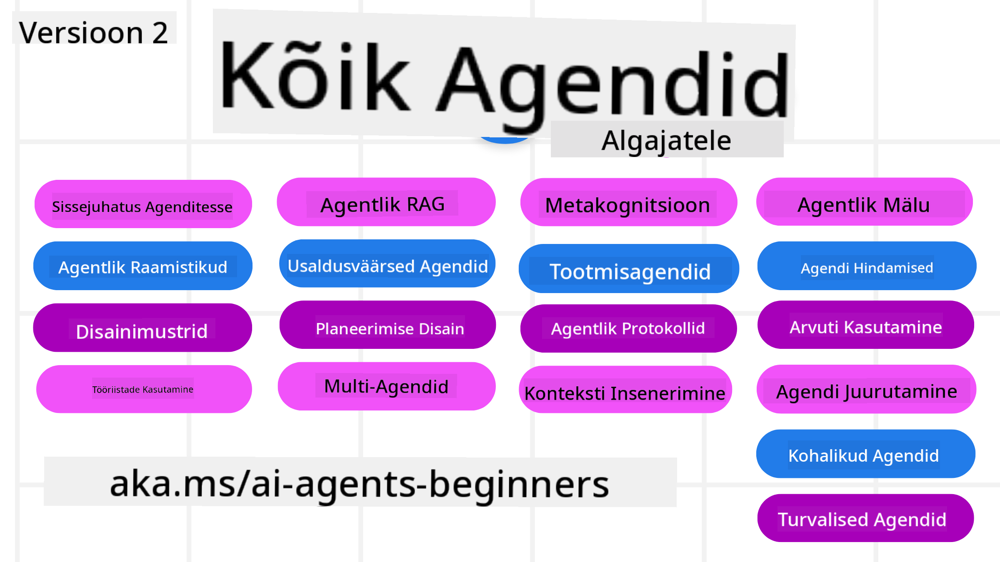

<!--
CO_OP_TRANSLATOR_METADATA:
{
  "original_hash": "b3581c11869b3563f33773adfb011949",
  "translation_date": "2025-12-25T00:27:26+00:00",
  "source_file": "README.md",
  "language_code": "et"
}
-->
# AI-agendid algajatele - Kursus

## Kursus, mis õpetab kõike, mida on vaja teada, et alustada AI-agendide loomist

### 🌐 Mitmekeelne tugi

#### Toetatud GitHub Actioni kaudu (automaatne ja alati ajakohane)

<!-- CO-OP TRANSLATOR LANGUAGES TABLE START -->
[Arabic](../ar/README.md) | [Bengali](../bn/README.md) | [Bulgarian](../bg/README.md) | [Burmese (Myanmar)](../my/README.md) | [Chinese (Simplified)](../zh/README.md) | [Chinese (Traditional, Hong Kong)](../hk/README.md) | [Chinese (Traditional, Macau)](../mo/README.md) | [Chinese (Traditional, Taiwan)](../tw/README.md) | [Croatian](../hr/README.md) | [Czech](../cs/README.md) | [Danish](../da/README.md) | [Dutch](../nl/README.md) | [Estonian](./README.md) | [Finnish](../fi/README.md) | [French](../fr/README.md) | [German](../de/README.md) | [Greek](../el/README.md) | [Hebrew](../he/README.md) | [Hindi](../hi/README.md) | [Hungarian](../hu/README.md) | [Indonesian](../id/README.md) | [Italian](../it/README.md) | [Japanese](../ja/README.md) | [Kannada](../kn/README.md) | [Korean](../ko/README.md) | [Lithuanian](../lt/README.md) | [Malay](../ms/README.md) | [Malayalam](../ml/README.md) | [Marathi](../mr/README.md) | [Nepali](../ne/README.md) | [Nigerian Pidgin](../pcm/README.md) | [Norwegian](../no/README.md) | [Persian (Farsi)](../fa/README.md) | [Polish](../pl/README.md) | [Portuguese (Brazil)](../br/README.md) | [Portuguese (Portugal)](../pt/README.md) | [Punjabi (Gurmukhi)](../pa/README.md) | [Romanian](../ro/README.md) | [Russian](../ru/README.md) | [Serbian (Cyrillic)](../sr/README.md) | [Slovak](../sk/README.md) | [Slovenian](../sl/README.md) | [Spanish](../es/README.md) | [Swahili](../sw/README.md) | [Swedish](../sv/README.md) | [Tagalog (Filipino)](../tl/README.md) | [Tamil](../ta/README.md) | [Telugu](../te/README.md) | [Thai](../th/README.md) | [Turkish](../tr/README.md) | [Ukrainian](../uk/README.md) | [Urdu](../ur/README.md) | [Vietnamese](../vi/README.md)
<!-- CO-OP TRANSLATOR LANGUAGES TABLE END -->

**If you wish to have additional translations languages supported are listed [here](https://github.com/Azure/co-op-translator/blob/main/getting_started/supported-languages.md)**

## 🌱 Alustamine

See kursus sisaldab õppetunde, mis käsitlevad AI-agendide loomise põhialuseid. Iga õppetund käsitleb oma teemat, nii et alustage sealt, kus teile sobib!

Selle kursuse jaoks on mitmekeelne tugi. Vaadake meie [saadavalolevaid keeli siit](../..). 

Kui see on teie esimene kord Generatiivsete tehisintellektimudelitega ehitamisel, vaadake meie [Generative AI For Beginners](https://aka.ms/genai-beginners) kursust, mis sisaldab 21 õppetundi GenAI-ga ehitamisest.

Ärge unustage [anda sellele repositooriumile tärni (🌟)](https://docs.github.com/en/get-started/exploring-projects-on-github/saving-repositories-with-stars?WT.mc_id=academic-105485-koreyst) ja [forkida see repositoorium](https://github.com/microsoft/ai-agents-for-beginners/fork) koodi jooksutamiseks.

### Tutvuge teiste õppuritega, saage oma küsimustele vastused

Kui takerdate või teil tekib küsimusi AI-agendide loomise kohta, liituge meie pühendatud Discordi kanaliga Microsoft Foundry Discordis (https://aka.ms/ai-agents/discord).

### Mida vajate

Iga õppetund selles kursuses sisaldab koodinäiteid, mis asuvad code_samples kaustas. Saate [forkida selle repositooriumi](https://github.com/microsoft/ai-agents-for-beginners/fork) oma koopia loomiseks.  

Nendes harjutustes olevad koodinäited kasutavad Azure AI Foundry ja GitHub Model Catalogs’it keelemudelitega suhtlemiseks:

- [Github Models](https://aka.ms/ai-agents-beginners/github-models) - Tasuta / Piiratud
- [Azure AI Foundry](https://aka.ms/ai-agents-beginners/ai-foundry) - Nõutav Azure'i konto

See kursus kasutab ka järgmisi Microsofti AI-agendi raamistikke ja teenuseid:

- [Microsoft Agent Framework (MAF) - Uus!](https://aka.ms/ai-agents-beginners/agent-framewrok)
- [Azure AI Agent Service](https://aka.ms/ai-agents-beginners/ai-agent-service)
- [Semantic Kernel](https://aka.ms/ai-agents-beginners/semantic-kernel)
- [AutoGen](https://aka.ms/ai-agents/autogen)

Lisateabe saamiseks selle kursuse koodi käivitamise kohta minge [Course Setup](./00-course-setup/README.md).

## 🙏 Kas soovite aidata?

Kas teil on ettepanekuid või leiate õigekirja- või koodivead? [Esitage probleem](https://github.com/microsoft/ai-agents-for-beginners/issues?WT.mc_id=academic-105485-koreyst) või [loo pull-päring](https://github.com/microsoft/ai-agents-for-beginners/pulls?WT.mc_id=academic-105485-koreyst)

## 📂 Iga õppetund sisaldab

- Kirjalik õppetund README-s ja lühike video
- Pythoni koodinäited, mis toetavad Azure AI Foundry ja Github Models (tasuta)
- Lingid täiendavatele materjalidele, et jätkata õppimist

## 🗃️ Õppetunnid

| **Õppetund**                                   | **Tekst & Kood**                                    | **Video**                                                  | **Lisamaterjalid**                                                                     |
|----------------------------------------------|----------------------------------------------------|------------------------------------------------------------|----------------------------------------------------------------------------------------|
| Sissejuhatus AI-agenditesse ja agendi kasutusjuhtumitesse       | [Link](./01-intro-to-ai-agents/README.md)          | [Video](https://youtu.be/3zgm60bXmQk?si=z8QygFvYQv-9WtO1)  | [Link](https://aka.ms/ai-agents-beginners/collection?WT.mc_id=academic-105485-koreyst) |
| AI-agendiliste raamistike uurimine              | [Link](./02-explore-agentic-frameworks/README.md)  | [Video](https://youtu.be/ODwF-EZo_O8?si=Vawth4hzVaHv-u0H)  | [Link](https://aka.ms/ai-agents-beginners/collection?WT.mc_id=academic-105485-koreyst) |
| AI-agendiliste disainimustrite mõistmine     | [Link](./03-agentic-design-patterns/README.md)     | [Video](https://youtu.be/m9lM8qqoOEA?si=BIzHwzstTPL8o9GF)  | [Link](https://aka.ms/ai-agents-beginners/collection?WT.mc_id=academic-105485-koreyst) |
| Tööriista kasutamise disainmuster                      | [Link](./04-tool-use/README.md)                    | [Video](https://youtu.be/vieRiPRx-gI?si=2z6O2Xu2cu_Jz46N)  | [Link](https://aka.ms/ai-agents-beginners/collection?WT.mc_id=academic-105485-koreyst) |
| Agentne RAG                                  | [Link](./05-agentic-rag/README.md)                 | [Video](https://youtu.be/WcjAARvdL7I?si=gKPWsQpKiIlDH9A3)  | [Link](https://aka.ms/ai-agents-beginners/collection?WT.mc_id=academic-105485-koreyst) |
| Usaldusväärsete AI-agendide loomine               | [Link](./06-building-trustworthy-agents/README.md) | [Video](https://youtu.be/iZKkMEGBCUQ?si=jZjpiMnGFOE9L8OK ) | [Link](https://aka.ms/ai-agents-beginners/collection?WT.mc_id=academic-105485-koreyst) |
| Planeerimise disainimuster                      | [Link](./07-planning-design/README.md)             | [Video](https://youtu.be/kPfJ2BrBCMY?si=6SC_iv_E5-mzucnC)  | [Link](https://aka.ms/ai-agents-beginners/collection?WT.mc_id=academic-105485-koreyst) |
| Mitmeagendi disainimuster                   | [Link](./08-multi-agent/README.md)                 | [Video](https://youtu.be/V6HpE9hZEx0?si=rMgDhEu7wXo2uo6g)  | [Link](https://aka.ms/ai-agents-beginners/collection?WT.mc_id=academic-105485-koreyst) |
| Metakognitsiooni disainimuster                 | [Link](./09-metacognition/README.md)               | [Video](https://youtu.be/His9R6gw6Ec?si=8gck6vvdSNCt6OcF)  | [Link](https://aka.ms/ai-agents-beginners/collection?WT.mc_id=academic-105485-koreyst) |
| Tehisintellekti agentid tootmises                      | [Ling](./10-ai-agents-production/README.md)        | [Video](https://youtu.be/l4TP6IyJxmQ?si=31dnhexRo6yLRJDl)  | [Ling](https://aka.ms/ai-agents-beginners/collection?WT.mc_id=academic-105485-koreyst) |
| Agentsete protokollide kasutamine (MCP, A2A ja NLWeb) | [Ling](./11-agentic-protocols/README.md)           | [Video](https://youtu.be/X-Dh9R3Opn8)                                 | [Ling](https://aka.ms/ai-agents-beginners/collection?WT.mc_id=academic-105485-koreyst) |
| Tehisintellekti agentide konteksti inseneritöö            | [Ling](./12-context-engineering/README.md)         | [Video](https://youtu.be/F5zqRV7gEag)                                 | [Ling](https://aka.ms/ai-agents-beginners/collection?WT.mc_id=academic-105485-koreyst) |
| Agentse mälu haldamine                      | [Ling](./13-agent-memory/README.md)     |      [Video](https://youtu.be/QrYbHesIxpw?si=vZkVwKrQ4ieCcIPx)                                                      |                                                                                        |
| Microsoft Agent Frameworki uurimine                         | [Ling](./14-microsoft-agent-framework/README.md)                            |                                                            |                                                                                        |
| Arvutikasutuse agentide loomine (CUA)           | Varsti                            |                                                            |                                                                                        |
| Skaalautuvate agentide juurutamine                    | Varsti                            |                                                            |                                                                                        |
| Lokaalsete tehisintellekti agentide loomine                     | Varsti                               |                                                            |                                                                                        |
| Tehisintellekti agentide turvamine                           | Varsti                               |                                                            |                                                                                        |

## 🎒 Muud kursused

Meie meeskond pakub ka teisi kursusi! Tutvuge:

<!-- CO-OP TRANSLATOR OTHER COURSES START -->
### LangChain

---

### Azure / Edge / MCP / Agendid

---
 
### Generatiivse AI sari

[-9333EA?style=for-the-badge&labelColor=E5E7EB&color=9333EA)](https://github.com/microsoft/Generative-AI-for-beginners-dotnet?WT.mc_id=academic-105485-koreyst)
[-C084FC?style=for-the-badge&labelColor=E5E7EB&color=C084FC)](https://github.com/microsoft/generative-ai-for-beginners-java?WT.mc_id=academic-105485-koreyst)
[-E879F9?style=for-the-badge&labelColor=E5E7EB&color=E879F9)](https://github.com/microsoft/generative-ai-with-javascript?WT.mc_id=academic-105485-koreyst)

---
 
### Põhikoolitus

---
 
### Copilot sari

<!-- CO-OP TRANSLATOR OTHER COURSES END -->

## 🌟 Kogukonna tänu

Täname [Shivam Goyal](https://www.linkedin.com/in/shivam2003/) oluliste koodinäidete panustamise eest, mis demonstreerivad Agentic RAG-i. 

## Panustamine

Seda projekti on oodatud panustama ja esitama ettepanekuid. Enamik panustusi eeldab, et nõustute Contributor License Agreement (CLA) tingimustega, mis kinnitavad, et teil on õigus ning te annate meile tegelikult õigused teie panuse kasutamiseks. Lisateabe saamiseks külastage <https://cla.opensource.microsoft.com>.

Kui esitate pull requesti, määrab CLA-bot automaatselt, kas peate esitama CLA ning märgistab PR-i vastavalt (nt oleku kontroll, kommentaar). Järgige lihtsalt boti juhiseid. Seda tuleb teha vaid korra kõigi hoidlate puhul, mis kasutavad meie CLA-d.

See projekt on võtnud kasutusele [Microsoft Open Source Code of Conduct](https://opensource.microsoft.com/codeofconduct/).
Lisateabe saamiseks vaadake [Code of Conduct FAQ](https://opensource.microsoft.com/codeofconduct/faq/) või võtke ühendust aadressil [opencode@microsoft.com](mailto:opencode@microsoft.com) täiendavate küsimuste või kommentaaride korral.

## Kaubamärgid

See projekt võib sisaldada projekti, toote või teenuse kaubamärke või logosid. Microsofti kaubamärkide või logode autoriseeritud kasutamine sõltub ning peab järgima
[Microsoft's Trademark & Brand Guidelines](https://www.microsoft.com/legal/intellectualproperty/trademarks/usage/general).
Microsofti kaubamärkide või logode kasutamine muudetud versioonides ei tohi tekitada segadust ega viidata Microsofti sponsorlusele.
Kolmandate osapoolte kaubamärkide või logode kasutamine allub nende kolmandate osapoolte eeskirjadele.

## Abi saamine

Kui jääte kinni või teil on küsimusi AI-rakenduste loomise kohta, liituge:

Kui teil on toodetele tagasisidet või arendamise ajal tekib vigu, külastage:

---

<!-- CO-OP TRANSLATOR DISCLAIMER START -->
**Vastutusest loobumine**:
See dokument on tõlgitud tehisintellektil põhineva tõlketeenuse [Co-op Translator](https://github.com/Azure/co-op-translator) abil. Kuigi me püüame tagada tõlke täpsust, pidage meeles, et automatiseeritud tõlked võivad sisaldada vigu või ebatäpsusi. Originaaldokumenti selle emakeeles tuleks lugeda autoriteetseks allikaks. Olulise teabe korral soovitatakse kasutada professionaalset inimtõlget. Me ei vastuta selle tõlke kasutamisest tulenevate arusaamatuste ega valesti tõlgendamise eest.
<!-- CO-OP TRANSLATOR DISCLAIMER END -->