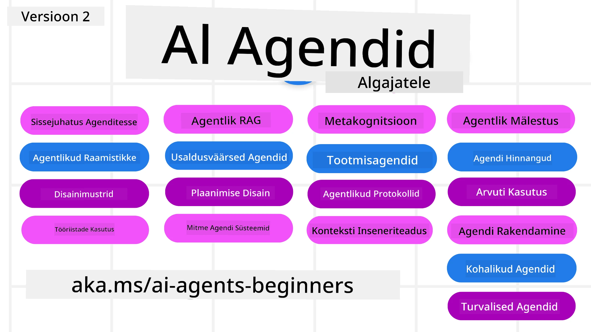

# Tehisintellekti agendid algajatele - kursus



## Kursus, mis õpetab kõike, mida vajad, et alustada tehisintellekti agentide loomist

[](https://github.com/microsoft/ai-agents-for-beginners/blob/master/LICENSE?WT.mc_id=academic-105485-koreyst)
[](https://GitHub.com/microsoft/ai-agents-for-beginners/graphs/contributors/?WT.mc_id=academic-105485-koreyst)
[](https://GitHub.com/microsoft/ai-agents-for-beginners/issues/?WT.mc_id=academic-105485-koreyst)
[](https://GitHub.com/microsoft/ai-agents-for-beginners/pulls/?WT.mc_id=academic-105485-koreyst)
[](http://makeapullrequest.com?WT.mc_id=academic-105485-koreyst)

### 🌐 Mitmekeelne tugi

#### Toetatud GitHub Actioni abil (Automaatne ja alati ajakohane)

<!-- CO-OP TRANSLATOR LANGUAGES TABLE START -->
[Arabic](../ar/README.md) | [Bengali](../bn/README.md) | [Bulgarian](../bg/README.md) | [Burmese (Myanmar)](../my/README.md) | [Chinese (Simplified)](../zh-CN/README.md) | [Chinese (Traditional, Hong Kong)](../zh-HK/README.md) | [Chinese (Traditional, Macau)](../zh-MO/README.md) | [Chinese (Traditional, Taiwan)](../zh-TW/README.md) | [Croatian](../hr/README.md) | [Czech](../cs/README.md) | [Danish](../da/README.md) | [Dutch](../nl/README.md) | [Estonian](./README.md) | [Finnish](../fi/README.md) | [French](../fr/README.md) | [German](../de/README.md) | [Greek](../el/README.md) | [Hebrew](../he/README.md) | [Hindi](../hi/README.md) | [Hungarian](../hu/README.md) | [Indonesian](../id/README.md) | [Italian](../it/README.md) | [Japanese](../ja/README.md) | [Kannada](../kn/README.md) | [Khmer](../km/README.md) | [Korean](../ko/README.md) | [Lithuanian](../lt/README.md) | [Malay](../ms/README.md) | [Malayalam](../ml/README.md) | [Marathi](../mr/README.md) | [Nepali](../ne/README.md) | [Nigerian Pidgin](../pcm/README.md) | [Norwegian](../no/README.md) | [Persian (Farsi)](../fa/README.md) | [Polish](../pl/README.md) | [Portuguese (Brazil)](../pt-BR/README.md) | [Portuguese (Portugal)](../pt-PT/README.md) | [Punjabi (Gurmukhi)](../pa/README.md) | [Romanian](../ro/README.md) | [Russian](../ru/README.md) | [Serbian (Cyrillic)](../sr/README.md) | [Slovak](../sk/README.md) | [Slovenian](../sl/README.md) | [Spanish](../es/README.md) | [Swahili](../sw/README.md) | [Swedish](../sv/README.md) | [Tagalog (Filipino)](../tl/README.md) | [Tamil](../ta/README.md) | [Telugu](../te/README.md) | [Thai](../th/README.md) | [Turkish](../tr/README.md) | [Ukrainian](../uk/README.md) | [Urdu](../ur/README.md) | [Vietnamese](../vi/README.md)

> **Eelistad kloonida lokaalselt?**
>
> See hoidla sisaldab üle 50 keele tõlkeid, mis suurendab allalaadimismahtu märkimisväärselt. Selleks, et kloonida ilma tõlgeteta, kasuta osalist (sparse) ülevaatamist:
>
> **Bash / macOS / Linux:**
> ```bash
> git clone --filter=blob:none --sparse https://github.com/microsoft/ai-agents-for-beginners.git
> cd ai-agents-for-beginners
> git sparse-checkout set --no-cone '/*' '!translations' '!translated_images'
> ```
>
> **CMD (Windows):**
> ```cmd
> git clone --filter=blob:none --sparse https://github.com/microsoft/ai-agents-for-beginners.git
> cd ai-agents-for-beginners
> git sparse-checkout set --no-cone "/*" "!translations" "!translated_images"
> ```
>
> See annab sulle kõik vajaliku kursuse läbimiseks palju kiiremalt.
<!-- CO-OP TRANSLATOR LANGUAGES TABLE END -->

**Kui soovid, et toetataks täiendavaid tõlkekeeli, siis need on loetletud [siin](https://github.com/Azure/co-op-translator/blob/main/getting_started/supported-languages.md).**

[](https://GitHub.com/microsoft/ai-agents-for-beginners/watchers/?WT.mc_id=academic-105485-koreyst)
[](https://GitHub.com/microsoft/ai-agents-for-beginners/network/?WT.mc_id=academic-105485-koreyst)
[](https://GitHub.com/microsoft/ai-agents-for-beginners/stargazers/?WT.mc_id=academic-105485-koreyst)

[](https://discord.com/invite/ATgtXmAS5D)


## 🌱 Alustamine

See kursus sisaldab õppetunde, mis käsitlevad tehisintellekti agentide loomise aluseid. Iga õppetund käsitleb oma teemat, nii et alusta just sealt, kus soovid!

Sellel kursusel on mitmekeelne tugi. Vaata saadaolevaid keeli [siit](#-multi-language-support). 

Kui see on sinu esimene kord kasutada generatiivseid tehisintellekti mudeleid, vaata meie kursust [Generatiivne AI algajatele](https://aka.ms/genai-beginners), mis sisaldab 21 õppetundi GenAI kasutusest.

Ära unusta [märgista täht(🌟) see hoidla](https://docs.github.com/en/get-started/exploring-projects-on-github/saving-repositories-with-stars?WT.mc_id=academic-105485-koreyst) ja [hargne see hoidla](https://github.com/microsoft/ai-agents-for-beginners/fork), et koodi jooksutada.

### Kohtuge teiste õppijatega, saage vastuseid oma küsimustele

Kui jääd hätta või sul on küsimusi tehisintellekti agentide loomise kohta, liitu meie eraldi Discordi kanaliga [Microsoft Foundry Discord](https://aka.ms/ai-agents/discord).

### Mida vajad 

Iga kursuse õppetund sisaldab koodinäiteid, mis asuvad kaustas code_samples. Võid [hargneda selle hoidla](https://github.com/microsoft/ai-agents-for-beginners/fork), et luua oma koopia.  

Nendes harjutustes kasutatav kood põhineb Microsoft Agent Frameworkil koos Microsoft Foundry Agent Service V2-ga:

- [Microsoft Foundry](https://aka.ms/ai-agents-beginners/ai-foundry) - nõutav Azure konto

See kursus kasutab järgmisi Microsofti AI agentide raamistikke ja teenuseid:

- [Microsoft Agent Framework (MAF)](https://aka.ms/ai-agents-beginners/agent-framework)
- [Microsoft Foundry Agent Service V2](https://aka.ms/ai-agents-beginners/ai-agent-service)

Mõned koodinäited toetavad ka alternatiivseid OpenAI ühilduvaid pakkujaid nagu [MiniMax](https://platform.minimaxi.com/), mis pakub suure kontekstiga mudeleid (kuni 204K märki). Vaata konfiguratsiooni üksikasju [Kursuse seadistamine](./00-course-setup/README.md) alt.

Lisateabe saamiseks selle kursuse koodi jooksutamise kohta vaata [Kursuse seadistamine](./00-course-setup/README.md).

## 🙏 Tahad aidata?

Kas sul on ettepanekuid või oled leidnud kirjavigu või koodivigu? [Esita probleem](https://github.com/microsoft/ai-agents-for-beginners/issues?WT.mc_id=academic-105485-koreyst) või [Loo pull request](https://github.com/microsoft/ai-agents-for-beginners/pulls?WT.mc_id=academic-105485-koreyst)


## 📂 Iga õppetund sisaldab

- Kirjaliku õppetunni, mis asub README-s ning lühikest videot
- Pythoni koodinäiteid, mis kasutavad Microsoft Agent Frameworki koos Microsoft Foundryga
- Lingid lisamaterjalidele, et jätkata õppimist


## 🗃️ Õppetunnid

| **Õppetund**                                  | **Tekst ja kood**                                   | **Video**                                                  | **Lisaõpe**                                                                            |
|----------------------------------------------|----------------------------------------------------|------------------------------------------------------------|----------------------------------------------------------------------------------------|
| Sissejuhatus tehisintellekti agentidesse ja agentide kasutusjuhtumid | [Link](./01-intro-to-ai-agents/README.md)           | [Video](https://youtu.be/3zgm60bXmQk?si=z8QygFvYQv-9WtO1)  | [Link](https://aka.ms/ai-agents-beginners/collection?WT.mc_id=academic-105485-koreyst) |
| Tehisintellekti agentide raamistikude uurimine                | [Link](./02-explore-agentic-frameworks/README.md)   | [Video](https://youtu.be/ODwF-EZo_O8?si=Vawth4hzVaHv-u0H)  | [Link](https://aka.ms/ai-agents-beginners/collection?WT.mc_id=academic-105485-koreyst) |
| Tehisintellekti agentide disainimustrite mõistmine              | [Link](./03-agentic-design-patterns/README.md)      | [Video](https://youtu.be/m9lM8qqoOEA?si=BIzHwzstTPL8o9GF)  | [Link](https://aka.ms/ai-agents-beginners/collection?WT.mc_id=academic-105485-koreyst) |
| Vahendite kasutamise disainimuster                             | [Link](./04-tool-use/README.md)                     | [Video](https://youtu.be/vieRiPRx-gI?si=2z6O2Xu2cu_Jz46N)  | [Link](https://aka.ms/ai-agents-beginners/collection?WT.mc_id=academic-105485-koreyst) |
| Agentic RAG                                                | [Link](./05-agentic-rag/README.md)                  | [Video](https://youtu.be/WcjAARvdL7I?si=gKPWsQpKiIlDH9A3)  | [Link](https://aka.ms/ai-agents-beginners/collection?WT.mc_id=academic-105485-koreyst) |
| Usaldusväärsete tehisintellekti agentide loomine                | [Link](./06-building-trustworthy-agents/README.md)  | [Video](https://youtu.be/iZKkMEGBCUQ?si=jZjpiMnGFOE9L8OK ) | [Link](https://aka.ms/ai-agents-beginners/collection?WT.mc_id=academic-105485-koreyst) |
| Planeerimise disainimuster                                   | [Link](./07-planning-design/README.md)              | [Video](https://youtu.be/kPfJ2BrBCMY?si=6SC_iv_E5-mzucnC)  | [Link](https://aka.ms/ai-agents-beginners/collection?WT.mc_id=academic-105485-koreyst) |
| Mitme agendi disainimuster                                | [Link](./08-multi-agent/README.md)                  | [Video](https://youtu.be/V6HpE9hZEx0?si=rMgDhEu7wXo2uo6g)  | [Link](https://aka.ms/ai-agents-beginners/collection?WT.mc_id=academic-105485-koreyst) |

| Metakognitsiooni disainimuster                 | [Link](./09-metacognition/README.md)               | [Video](https://youtu.be/His9R6gw6Ec?si=8gck6vvdSNCt6OcF)  | [Link](https://aka.ms/ai-agents-beginners/collection?WT.mc_id=academic-105485-koreyst) |
| Tehisintellekti agendid tootmises                      | [Link](./10-ai-agents-production/README.md)        | [Video](https://youtu.be/l4TP6IyJxmQ?si=31dnhexRo6yLRJDl)  | [Link](https://aka.ms/ai-agents-beginners/collection?WT.mc_id=academic-105485-koreyst) |
| Agenti protokollide kasutamine (MCP, A2A ja NLWeb) | [Link](./11-agentic-protocols/README.md)           | [Video](https://youtu.be/X-Dh9R3Opn8)                                 | [Link](https://aka.ms/ai-agents-beginners/collection?WT.mc_id=academic-105485-koreyst) |
| Konteksti inseneritöö AI agentidele            | [Link](./12-context-engineering/README.md)         | [Video](https://youtu.be/F5zqRV7gEag)                                 | [Link](https://aka.ms/ai-agents-beginners/collection?WT.mc_id=academic-105485-koreyst) |
| Agentmälu haldamine                      | [Link](./13-agent-memory/README.md)     |      [Video](https://youtu.be/QrYbHesIxpw?si=vZkVwKrQ4ieCcIPx)                                                      |                                                                                        |
| Microsoft Agent raamistiku uurimine                         | [Link](./14-microsoft-agent-framework/README.md)                            |                                                            |                                                                                        |
| Arvuti kasutamise agentide loomine (CUA)           | [Link](./15-browser-use/README.md)     |                                                            | [Link](https://docs.browser-use.com/examples/templates/playwright-integration)         |
| Skaalautuvate agentide juurutamine                    | Peatselt                      |                                                            |                                                                                        |
| Kohalike AI agentide loomine                     | Peatselt                               |                                                            |                                                                                        |
| AI agentide turvamine                           | [Link](./18-securing-ai-agents/README.md)  |                                                            | [Link](https://aka.ms/ai-agents-beginners/collection?WT.mc_id=academic-105485-koreyst) |

## 🎒 Teised kursused

Meie meeskond loob ka teisi kursuseid! Vaata:

<!-- CO-OP TRANSLATOR OTHER COURSES START -->
### LangChain
[](https://aka.ms/langchain4j-for-beginners)
[](https://aka.ms/langchainjs-for-beginners?WT.mc_id=m365-94501-dwahlin)
[](https://github.com/microsoft/langchain-for-beginners?WT.mc_id=m365-94501-dwahlin)
---

### Azure / Edge / MCP / Agendid
[](https://github.com/microsoft/AZD-for-beginners?WT.mc_id=academic-105485-koreyst)
[](https://github.com/microsoft/edgeai-for-beginners?WT.mc_id=academic-105485-koreyst)
[](https://github.com/microsoft/mcp-for-beginners?WT.mc_id=academic-105485-koreyst)
[](https://github.com/microsoft/ai-agents-for-beginners?WT.mc_id=academic-105485-koreyst)

---
 
### Generatiivse AI seeria
[](https://github.com/microsoft/generative-ai-for-beginners?WT.mc_id=academic-105485-koreyst)
[-9333EA?style=for-the-badge&labelColor=E5E7EB&color=9333EA)](https://github.com/microsoft/Generative-AI-for-beginners-dotnet?WT.mc_id=academic-105485-koreyst)
[-C084FC?style=for-the-badge&labelColor=E5E7EB&color=C084FC)](https://github.com/microsoft/generative-ai-for-beginners-java?WT.mc_id=academic-105485-koreyst)
[-E879F9?style=for-the-badge&labelColor=E5E7EB&color=E879F9)](https://github.com/microsoft/generative-ai-with-javascript?WT.mc_id=academic-105485-koreyst)

---
 
### Põhjalik õppimine
[](https://aka.ms/ml-beginners?WT.mc_id=academic-105485-koreyst)
[](https://aka.ms/datascience-beginners?WT.mc_id=academic-105485-koreyst)
[](https://aka.ms/ai-beginners?WT.mc_id=academic-105485-koreyst)
[](https://github.com/microsoft/Security-101?WT.mc_id=academic-96948-sayoung)
[](https://aka.ms/webdev-beginners?WT.mc_id=academic-105485-koreyst)
[](https://aka.ms/iot-beginners?WT.mc_id=academic-105485-koreyst)
[](https://github.com/microsoft/xr-development-for-beginners?WT.mc_id=academic-105485-koreyst)

---
 
### Copiloti seeria
[](https://aka.ms/GitHubCopilotAI?WT.mc_id=academic-105485-koreyst)
[](https://github.com/microsoft/mastering-github-copilot-for-dotnet-csharp-developers?WT.mc_id=academic-105485-koreyst)
[](https://github.com/microsoft/CopilotAdventures?WT.mc_id=academic-105485-koreyst)
<!-- CO-OP TRANSLATOR OTHER COURSES END -->

## 🌟 Tänu kogukonnale

Täname [Shivam Goyal](https://www.linkedin.com/in/shivam2003/) oluliste koodinäidete panustamise eest, mis demonstreerivad Agentic RAG-i. 

## Panustamine

See projekt tervitab panuseid ja ettepanekuid. Enamik panuseid nõuab, et nõustuksite
Kaastööleppega (Contributor License Agreement, CLA), millega kinnitate, et teil on õigus ja te tegelikult annate meile
õigused teie panust kasutada. Lisateavet leiate aadressilt <https://cla.opensource.microsoft.com>.

Kui esitate pull-päringu, tuvastab CLA robot automaatselt, kas peate esitama CLA ja lisab vastava märgi PR-le (nt staatuskontroll, kommentaar). Lihtsalt järgige roboti juhiseid. Seda tuleb teha ainult üks kord kõigi meie CLA kasutavate hoidlate jaoks.


See projekt on vastu võtnud [Microsofti avatud lähtekoodiga käitumisreeglid](https://opensource.microsoft.com/codeofconduct/).
Lisateabe saamiseks vaadake [käitumisreeglite korduma kippuvad küsimused](https://opensource.microsoft.com/codeofconduct/faq/) või
võtke ühendust aadressil [opencode@microsoft.com](mailto:opencode@microsoft.com) lisaküsimuste või kommentaaride jaoks.

## Kaubamärgid

See projekt võib sisaldada kaubamärke või logosid seotud projektide, toodete või teenuste kohta. Microsofti
kaubamärkide või logode autoriseeritud kasutamine peab toimuma vastavalt
[Microsofti kaubamärgi- ja brändijuhistele](https://www.microsoft.com/legal/intellectualproperty/trademarks/usage/general).
Microsofti kaubamärkide või logode kasutamine selle projekti muudetud versioonides ei tohi põhjustada segadust ega viidata Microsofti sponsorlusele.
Kolmandate osapoolte kaubamärkide või logode kasutamine allub nende osapoolte poliitikatele.

## Abi saamine


Kui jääte hätta või teil on küsimusi AI-rakenduste loomise kohta, liituge:

[](https://aka.ms/foundry/discord)

Kui teil on tootearenduse tagasisidet või vigasid rakenduse ehitamisel, külastage:

[](https://aka.ms/foundry/forum)

---

<!-- CO-OP TRANSLATOR DISCLAIMER START -->
**Lahtiütlus**:
See dokument on tõlgitud kasutades AI tõlketeenust [Co-op Translator](https://github.com/Azure/co-op-translator). Kuigi me püüdleme täpsuse poole, palun pange tähele, et automatiseeritud tõlgetes võib esineda vigu või ebatäpsusi. Originaaldokument selle emakeeles tuleks pidada autoriteetseks allikaks. Olulise teabe puhul soovitatakse kasutada professionaalset inimtõlget. Me ei vastuta selle tõlkega seotud eksimustest või valesti mõistmistest.
<!-- CO-OP TRANSLATOR DISCLAIMER END -->