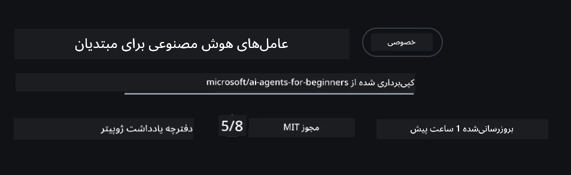
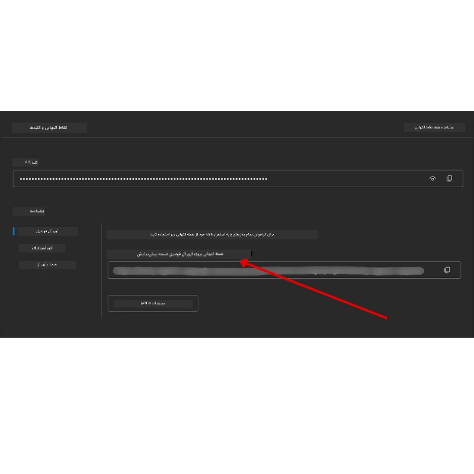

# راه‌اندازی دوره

## مقدمه

این درس نحوه اجرای نمونه‌های کد این دوره را پوشش می‌دهد.

## پیوستن به دیگر یادگیرندگان و دریافت کمک

قبل از شروع به کلون کردن مخزن خود، به [کانال Discord آژانس‌های هوش مصنوعی برای مبتدیان](https://aka.ms/ai-agents/discord) ملحق شوید تا در صورت نیاز به کمک برای راه‌اندازی، پرسش در مورد دوره، یا ارتباط با دیگر یادگیرندگان کمک بگیرید.

## کلون یا فورک کردن این مخزن

برای شروع، لطفاً مخزن GitHub را کلون یا فورک کنید. این کار نسخه‌ای از محتوای دوره را برای شما ایجاد می‌کند تا بتوانید کد را اجرا، تست و تغییر دهید!

این کار با کلیک روی لینک <a href="https://github.com/microsoft/ai-agents-for-beginners/fork" target="_blank">فورک مخزن</a> انجام می‌شود

شما اکنون باید نسخه فورک‌شده خود از این دوره را در لینک زیر داشته باشید:



### کلون سطحی (توصیه‌شده برای کارگاه / Codespaces)

  >مخزن کامل می‌تواند هنگام دانلود تاریخچه کامل و تمام فایل‌ها بزرگ باشد (~3 GB). اگر فقط در کارگاه شرکت می‌کنید یا فقط به چند پوشه درس نیاز دارید، یک کلون سطحی (یا کلون پراکنده) با کوتاه‌کردن تاریخچه و/یا رد کردن blobs از دانلود بخش عمده‌ای جلوگیری می‌کند.

#### کلون سطحی سریع — تاریخچه حداقلی، تمام فایل‌ها

در دستورات زیر `<your-username>` را با URL فورک خود (یا URL upstream اگر ترجیح می‌دهید) جایگزین کنید.

برای کلون کردن تنها تاریخچه آخرین کامیت (دانلود کوچک):

```bash|powershell
git clone --depth 1 https://github.com/<your-username>/ai-agents-for-beginners.git
```

برای کلون کردن یک شاخه خاص:

```bash|powershell
git clone --depth 1 --branch <branch-name> https://github.com/<your-username>/ai-agents-for-beginners.git
```

#### کلون جزئی (sparse) — blobs حداقلی + تنها پوشه‌های انتخاب‌شده

این روش از کلون جزئی و sparse-checkout استفاده می‌کند (نیاز به Git 2.25+ و توصیه می‌شود از نسخه مدرن Git با پشتیبانی کلون جزئی استفاده کنید):

```bash|powershell
git clone --depth 1 --filter=blob:none --sparse https://github.com/<your-username>/ai-agents-for-beginners.git
```

وارد پوشه مخزن شوید:

```bash|powershell
cd ai-agents-for-beginners
```

سپس مشخص کنید کدام پوشه‌ها را می‌خواهید (مثال زیر دو پوشه را نشان می‌دهد):

```bash|powershell
git sparse-checkout set 00-course-setup 01-intro-to-ai-agents
```

پس از کلون و بررسی فایل‌ها، اگر تنها به فایل‌ها نیاز دارید و می‌خواهید فضا آزاد کنید (بدون تاریخچه git)، لطفاً متادیتای مخزن را حذف کنید (💀 غیرقابل بازگشت — تمام قابلیت‌های Git را از دست خواهید داد: هیچ کامیت، pull، push یا دسترسی به تاریخچه).

```bash
# زی‌اس‌اچ/بش
rm -rf .git
```

```powershell
# پاورشل
Remove-Item -Recurse -Force .git
```

#### استفاده از GitHub Codespaces (توصیه‌شده برای جلوگیری از دانلودهای بزرگ محلی)

- برای این مخزن یک Codespace جدید از طریق [رابط کاربری GitHub](https://github.com/codespaces) ایجاد کنید.  

- در ترمینال Codespace تازه ایجاد شده، یکی از دستورات کلون سطحی/پراکنده بالا را اجرا کنید تا تنها پوشه‌های درسی مورد نیاز به فضای کاری Codespace آورده شوند.
- انتخابی: پس از کلون کردن داخل Codespaces، برای بازیابی فضای اضافی .git را حذف کنید (دستورات حذف را در بالا ببینید).
- توجه: اگر ترجیح می‌دهید مخزن را مستقیماً در Codespaces باز کنید (بدون کلون اضافی)، آگاه باشید که Codespaces محیط devcontainer را می‌سازد و ممکن است هنوز بیش از نیاز شما منابع فراهم کند. کلون کردن یک نسخه سطحی داخل یک Codespace تازه کنترل بیشتری روی استفاده دیسک به شما می‌دهد.

#### نکات

- همیشه آدرس کلون را با فورک خود جایگزین کنید اگر می‌خواهید ویرایش/کامیت کنید.
- اگر بعداً به تاریخچه یا فایل‌های بیشتری نیاز داشتید، می‌توانید آن‌ها را fetch کنید یا sparse-checkout را تنظیم کنید تا پوشه‌های اضافی را شامل شود.

## اجرای کد

این دوره مجموعه‌ای از Jupyter Notebooks ارائه می‌دهد که می‌توانید برای کسب تجربه عملی در ساخت AI Agents اجرا کنید.

نمونه‌های کد از **Microsoft Agent Framework (MAF)** با `AzureAIProjectAgentProvider` استفاده می‌کنند، که از طریق **Microsoft Foundry** به **Azure AI Agent Service V2** (Responses API) متصل می‌شود.

تمام نوت‌بوک‌های Python با `*-python-agent-framework.ipynb` برچسب‌گذاری شده‌اند.

## پیش‌نیازها

- Python 3.12+
  - **توجه**: اگر Python3.12 را نصب ندارید، حتماً آن را نصب کنید. سپس venv خود را با استفاده از python3.12 ایجاد کنید تا نسخه‌های صحیح از فایل requirements.txt نصب شوند.
  
    >نمونه

    ایجاد دایرکتوری venv پایتون:

    ```bash|powershell
    python -m venv venv
    ```

    سپس محیط venv را برای فعال کنید:

    ```bash
    # زی‌اس‌اچ/باش
    source venv/bin/activate
    ```
  
    ```dos
    # Command Prompt for Windows
    venv\Scripts\activate
    ```

- .NET 10+: برای نمونه‌های کد که از .NET استفاده می‌کنند، مطمئن شوید [.NET 10 SDK](https://dotnet.microsoft.com/download/dotnet/10.0) یا نسخه‌های بعدی را نصب کرده‌اید. سپس نسخه نصب‌شده .NET SDK خود را بررسی کنید:

    ```bash|powershell
    dotnet --list-sdks
    ```

- **Azure CLI** — برای احراز هویت لازم است. از [aka.ms/installazurecli](https://aka.ms/installazurecli) نصب کنید.
- **Azure Subscription** — برای دسترسی به Microsoft Foundry و Azure AI Agent Service.
- **Microsoft Foundry Project** — پروژه‌ای با مدل مستقرشده (مثلاً `gpt-4o`). ببینید [گام 1](../../../00-course-setup) در پایین.

ما یک فایل `requirements.txt` را در ریشه این مخزن گنجانده‌ایم که شامل تمام بسته‌های پایتون مورد نیاز برای اجرای نمونه‌های کد است.

می‌توانید آن‌ها را با اجرای دستور زیر در ترمینال خود در ریشه مخزن نصب کنید:

```bash|powershell
pip install -r requirements.txt
```

پیشنهاد می‌کنیم یک محیط مجازی پایتون ایجاد کنید تا از هرگونه تداخل و مشکل جلوگیری شود.

## تنظیم VSCode

مطمئن شوید که در VSCode از نسخه مناسب پایتون استفاده می‌کنید.


## راه‌اندازی Microsoft Foundry و Azure AI Agent Service

### گام ۱: ایجاد پروژه Microsoft Foundry

برای اجرای نوت‌بوک‌ها به یک **hub** و **project** در Azure AI Foundry با یک مدل مستقر نیاز دارید.

1. به [ai.azure.com](https://ai.azure.com) بروید و با حساب Azure خود وارد شوید.
2. یک **hub** ایجاد کنید (یا از یک مورد موجود استفاده کنید). ببینید: [Hub resources overview](https://learn.microsoft.com/azure/ai-foundry/concepts/ai-resources).
3. درون hub، یک **project** ایجاد کنید.
4. یک مدل را مستقر کنید (مثلاً `gpt-4o`) از **Models + Endpoints** → **Deploy model**.

### گام ۲: بازیابی نقطه پایانی پروژه و نام استقرار مدل

از پروژه خود در پورتال Microsoft Foundry:

- **Project Endpoint** — به صفحه **Overview** بروید و URL نقطه پایانی را کپی کنید.



- **Model Deployment Name** — به **Models + Endpoints** بروید، مدل مستقرشده خود را انتخاب کنید و **Deployment name** را یادداشت کنید (مثلاً `gpt-4o`).

### گام ۳: ورود به Azure با `az login`

تمام نوت‌بوک‌ها برای احراز هویت از **`AzureCliCredential`** استفاده می‌کنند — نیازی به مدیریت کلیدهای API نیست. این مستلزم این است که از طریق Azure CLI وارد شده باشید.

1. **Azure CLI را نصب کنید** اگر هنوز نصب نکرده‌اید: [aka.ms/installazurecli](https://aka.ms/installazurecli)

2. **وارد شوید** با اجرای:

    ```bash|powershell
    az login
    ```

    یا اگر در یک محیط راه دور/Codespace بدون مرورگر هستید:

    ```bash|powershell
    az login --use-device-code
    ```

3. **اشتراک خود را انتخاب کنید** اگر درخواست شد — اشتراکی را انتخاب کنید که شامل پروژه Foundry شما است.

4. **تأیید** کنید که وارد شده‌اید:

    ```bash|powershell
    az account show
    ```

> چرا `az login`؟ نوت‌بوک‌ها با استفاده از `AzureCliCredential` از بسته `azure-identity` احراز هویت می‌کنند. این بدان معناست که جلسه Azure CLI شما مدارک را فراهم می‌کند — هیچ کلید API یا راز در فایل `.env` شما وجود ندارد. این یک [بهترین روش امنیتی](https://learn.microsoft.com/azure/developer/ai/keyless-connections) است.

### گام ۴: ایجاد فایل `.env` خود

نسخه مثال فایل را کپی کنید:

```bash
# zsh/bash
cp .env.example .env
```

```powershell
# پاورشل
Copy-Item .env.example .env
```

فایل `.env` را باز کنید و این دو مقدار را پر کنید:

```env
AZURE_AI_PROJECT_ENDPOINT=https://<your-project>.services.ai.azure.com/api/projects/<your-project-id>
AZURE_AI_MODEL_DEPLOYMENT_NAME=gpt-4o
```

| متغیر | محل پیدا کردن |
|----------|-----------------|
| `AZURE_AI_PROJECT_ENDPOINT` | پورتال Foundry → پروژه شما → صفحه **Overview** |
| `AZURE_AI_MODEL_DEPLOYMENT_NAME` | پورتال Foundry → **Models + Endpoints** → نام مدل مستقرشده شما |

همین برای بیشتر درس‌ها کافی است! نوت‌بوک‌ها به‌طور خودکار از طریق جلسه `az login` شما احراز هویت می‌کنند.

### گام ۵: نصب وابستگی‌های Python

```bash|powershell
pip install -r requirements.txt
```

پیشنهاد می‌کنیم این را داخل محیط مجازی که قبلاً ایجاد کرده‌اید اجرا کنید.

## تنظیمات اضافی برای درس ۵ (Agentic RAG)

درس ۵ از **Azure AI Search** برای تولید تقویت‌شده با بازیابی استفاده می‌کند. اگر قصد دارید آن درس را اجرا کنید، این متغیرها را به فایل `.env` خود اضافه کنید:

| متغیر | محل پیدا کردن |
|----------|-----------------|
| `AZURE_SEARCH_SERVICE_ENDPOINT` | پورتال Azure → منبع **Azure AI Search** شما → **Overview** → URL |
| `AZURE_SEARCH_API_KEY` | پورتال Azure → منبع **Azure AI Search** شما → **Settings** → **Keys** → کلید ادمین اولیه |

## تنظیمات اضافی برای درس ۶ و درس ۸ (GitHub Models)

برخی نوت‌بوک‌ها در درس‌های ۶ و ۸ از **GitHub Models** به‌جای Azure AI Foundry استفاده می‌کنند. اگر قصد دارید آن نمونه‌ها را اجرا کنید، این متغیرها را به فایل `.env` اضافه کنید:

| متغیر | محل پیدا کردن |
|----------|-----------------|
| `GITHUB_TOKEN` | GitHub → **Settings** → **Developer settings** → **Personal access tokens** |
| `GITHUB_ENDPOINT` | از `https://models.inference.ai.azure.com` استفاده کنید (مقدار پیش‌فرض) |
| `GITHUB_MODEL_ID` | نام مدل برای استفاده (مثلاً `gpt-4o-mini`) |

## تنظیمات اضافی برای درس ۸ (Bing Grounding Workflow)

دفترچه کاری جریان کاری شرطی در درس ۸ از **Bing grounding** از طریق Azure AI Foundry استفاده می‌کند. اگر قصد دارید آن نمونه را اجرا کنید، این متغیر را به فایل `.env` اضافه کنید:

| متغیر | محل پیدا کردن |
|----------|-----------------|
| `BING_CONNECTION_ID` | پورتال Azure AI Foundry → پروژه شما → **Management** → **Connected resources** → اتصال Bing شما → شناسه اتصال را کپی کنید |

## عیب‌یابی

### خطاهای تأیید گواهی‌نامه SSL در macOS

اگر در macOS هستید و با خطایی مانند زیر مواجه می‌شوید:

```plaintext
ssl.SSLCertVerificationError: [SSL: CERTIFICATE_VERIFY_FAILED] certificate verify failed: self-signed certificate in certificate chain
```

این یک مشکل شناخته‌شده با پایتون در macOS است که در آن گواهی‌های SSL سیستم به‌طور خودکار مورد اعتماد قرار نمی‌گیرند. راه‌حل‌های زیر را به ترتیب امتحان کنید:

**گزینه ۱: اجرای اسکریپت Install Certificates پایتون (توصیه‌شده)**

```bash
# 3.XX را با نسخهٔ پایتون نصب‌شدهٔ خود جایگزین کنید (مثلاً 3.12 یا 3.13):
/Applications/Python\ 3.XX/Install\ Certificates.command
```

**گزینه ۲: استفاده از `connection_verify=False` در نوت‌بوک شما (فقط برای نوت‌بوک‌های GitHub Models)**

در نوت‌بوک درس ۶ (`06-building-trustworthy-agents/code_samples/06-system-message-framework.ipynb`)، یک راه‌حل کامنت‌شده از قبل گنجانده شده است. هنگام ایجاد مشتری، `connection_verify=False` را از حالت کامنت خارج کنید:

```python
client = ChatCompletionsClient(
    endpoint=endpoint,
    credential=AzureKeyCredential(token),
    connection_verify=False,  # اگر با خطاهای گواهی مواجه شدید، اعتبارسنجی SSL را غیرفعال کنید
)
```

> **⚠️ هشدار:** غیرفعال کردن تأیید SSL (`connection_verify=False`) با رد اعتبارسنجی گواهی امنیت را کاهش می‌دهد. از این فقط به‌عنوان راه‌حل موقت در محیط‌های توسعه استفاده کنید، هرگز در تولید.

**گزینه ۳: نصب و استفاده از `truststore`**

```bash
pip install truststore
```

سپس مورد زیر را در بالای نوت‌بوک یا اسکریپت خود قبل از انجام هر فراخوانی شبکه‌ای اضافه کنید:

```python
import truststore
truststore.inject_into_ssl()
```

## گیر کرده‌اید؟

اگر در اجرای این تنظیمات با مشکلی مواجه شدید، به <a href="https://discord.gg/kzRShWzttr" target="_blank">Discord جامعه Azure AI</a> بپیوندید یا <a href="https://github.com/microsoft/ai-agents-for-beginners/issues?WT.mc_id=academic-105485-koreyst" target="_blank">یک issue ایجاد کنید</a>.

## درس بعدی

شما اکنون آماده اجرای کد این دوره هستید. یادگیری خوش بگذرد و درباره دنیای آژانس‌های هوش مصنوعی بیشتر بیاموزید!

[مقدمه‌ای بر آژانس‌های هوش مصنوعی و موارد استفاده](../01-intro-to-ai-agents/README.md)

---

<!-- CO-OP TRANSLATOR DISCLAIMER START -->
سلب مسئولیت:
این سند با استفاده از سرویس ترجمهٔ هوش مصنوعی [Co-op Translator](https://github.com/Azure/co-op-translator) ترجمه شده است. در حالی که ما تلاش می‌کنیم دقت را حفظ کنیم، لطفاً توجه داشته باشید که ترجمه‌های خودکار ممکن است حاوی خطاها یا نادرستی‌هایی باشند. نسخهٔ اصلی سند به زبان مادری آن باید به‌عنوان منبع معتبر در نظر گرفته شود. برای اطلاعات حیاتی، توصیه می‌شود از ترجمهٔ حرفه‌ای انسانی استفاده شود. ما در قبال هرگونه سوءتفاهم یا تفسیر نادرست ناشی از استفاده از این ترجمه مسئولیتی نداریم.
<!-- CO-OP TRANSLATOR DISCLAIMER END -->