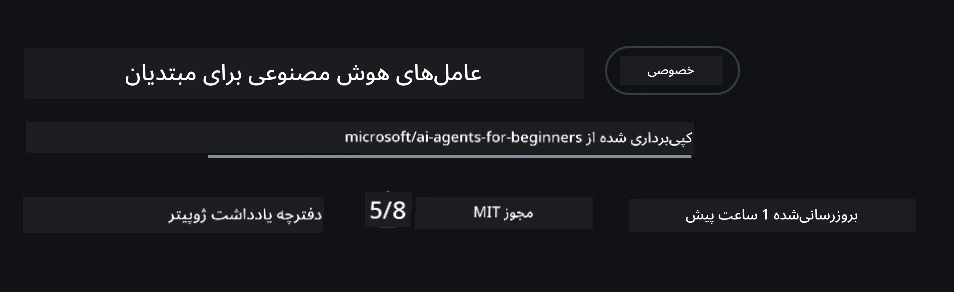
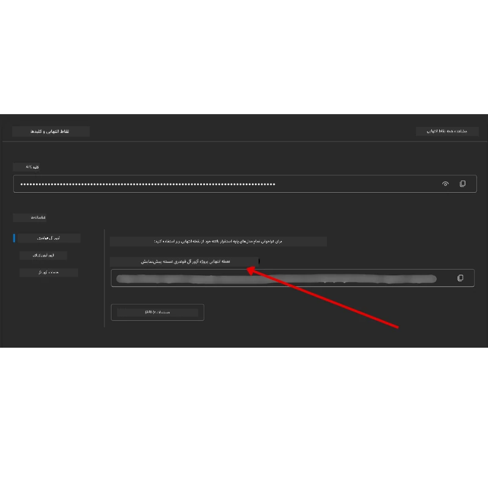

# تنظیم دوره

## مقدمه

این درس نحوه اجرای نمونه کدهای این دوره را پوشش خواهد داد.

## به سایر یادگیرندگان بپیوندید و کمک بگیرید

قبل از شروع کلون کردن مخزن خود، به [کانال Discord “AI Agents For Beginners”](https://aka.ms/ai-agents/discord) بپیوندید تا هر گونه کمک در راه‌اندازی، سوال درباره دوره یا ارتباط با سایر یادگیرندگان دریافت کنید.

## کلون یا فورک این مخزن

برای شروع، لطفاً مخزن GitHub را کلون یا فورک کنید. این کار نسخه خودتان از مطالب دوره را ایجاد می‌کند تا بتوانید کد را اجرا، تست و تنظیم کنید!

این کار با کلیک روی لینک <a href="https://github.com/microsoft/ai-agents-for-beginners/fork" target="_blank">فورک مخزن</a> انجام می‌شود

اکنون باید نسخه فورک شده خودتان از این دوره را در لینک زیر داشته باشید:



### کلون سطحی (توصیه شده برای کارگاه / Codespaces)

  > کل مخزن می‌تواند حجیم باشد (~3 گیگابایت) زمانی که تاریخچه کامل و همه فایل‌ها را دانلود می‌کنید. اگر فقط در کارگاه شرکت می‌کنید یا فقط به چند پوشه درس نیاز دارید، یک کلون سطحی (یا کلون پراکنده) حجم کمتری دانلود می‌کند.

#### کلون سطحی سریع — کمترین تاریخچه، همه فایل‌ها

`<your-username>` را در دستورات زیر با URL فورک خودتان (یا URL اصلی اگر ترجیح می‌دهید) جایگزین کنید.

برای کلون فقط تاریخچه جدیدترین کامیت (دانلود کم):

```bash
git clone --depth 1 https://github.com/<your-username>/ai-agents-for-beginners.git
```

برای کلون یک شاخه خاص:

```bash
git clone --depth 1 --branch <branch-name> https://github.com/<your-username>/ai-agents-for-beginners.git
```

#### کلون جزئی (پراکنده) — کمترین بلاک‌ها + فقط پوشه‌های انتخاب شده

این از کلون جزئی و sparse-checkout استفاده می‌کند (نیاز به Git 2.25+ و توصیه می‌شود از Git مدرن با پشتیبانی کلون جزئی استفاده کنید):

```bash
git clone --depth 1 --filter=blob:none --sparse https://github.com/<your-username>/ai-agents-for-beginners.git
```

به پوشه مخزن بروید:

```bash
cd ai-agents-for-beginners
```

سپس مشخص کنید چه پوشه‌هایی می‌خواهید (نمونه زیر دو پوشه را نشان می‌دهد):

```bash
git sparse-checkout set 00-course-setup 01-intro-to-ai-agents
```

پس از کلون و بررسی فایل‌ها، اگر فقط به فایل‌ها نیاز دارید و می‌خواهید فضای آزاد کنید (بدون تاریخچه git)، لطفاً متادیتای مخزن را حذف کنید (💀غیرقابل بازگشت — تمام عملکردهای Git را از دست خواهید داد):

```bash
# زد‌ش/باش
rm -rf .git
```

```powershell
# پاورشل
Remove-Item -Recurse -Force .git
```

#### استفاده از GitHub Codespaces (پیشنهاد شده برای جلوگیری از دانلودهای بزرگ محلی)

- یک Codespace جدید برای این مخزن از طریق [رابط GitHub](https://github.com/codespaces) ایجاد کنید.  

- در ترمینال Codespace تازه ایجاد شده، یکی از دستورات کلون سطحی/پراکنده بالا را اجرا کنید تا فقط پوشه‌های درسی که نیاز دارید به فضای کاری Codespace بیاید.
- اختیاری: پس از کلون در داخل Codespaces، برای آزاد کردن فضای بیشتر، پوشه .git را حذف کنید (دستورات حذف را بالاتر ببینید).
- توجه: اگر ترجیح می‌دهید مستقیماً مخزن را در Codespaces باز کنید (بدون کلون اضافی)، توجه داشته باشید که Codespaces محیط devcontainer را می‌سازد و ممکن است بیشتر از حد نیاز شما تنظیمات فراهم کند.

#### نکات

- همیشه URL کلون را با فورک خود جایگزین کنید اگر می‌خواهید ویرایش و کامیت کنید.
- اگر بعداً به تاریخچه یا فایل‌های بیشتری نیاز داشتید، می‌توانید آنها را دریافت کنید یا تنظیمات sparse-checkout را برای پوشه‌های بیشتر تغییر دهید.

## اجرای کد

این دوره مجموعه‌ای از دفترچه‌های Jupyter ارائه می‌دهد که می‌توانید آنها را اجرا کنید تا تجربه عملی ساخت AI Agents کسب کنید.

نمونه‌های کد از **Microsoft Agent Framework (MAF)** با `FoundryChatClient` استفاده می‌کنند، که به **Microsoft Foundry Agent Service V2** (واسط پاسخ‌ها) از طریق **Microsoft Foundry** متصل می‌شود.

همه دفترچه‌های Python برچسب `*-python-agent-framework.ipynb` دارند.

## نیازمندی‌ها

- Python 3.12+
  - **توجه**: اگر Python3.12 نصب ندارید، حتماً نصب کنید. سپس با استفاده از python3.12 محیط مجازی (venv) خود را بسازید تا نسخه‌های صحیح از فایل requirements.txt نصب شود.
  
    >مثال

    ساخت دایرکتوری محیط مجازی Python:

    ```bash
    python -m venv venv
    ```

    سپس محیط venv را فعال کنید برای:

    ```bash
    # زد شل/باش
    source venv/bin/activate
    ```
  
    ```dos
    # Command Prompt for Windows
    venv\Scripts\activate
    ```

- .NET 10+: برای نمونه کدهای استفاده کننده از .NET، مطمئن شوید [.NET 10 SDK](https://dotnet.microsoft.com/download/dotnet/10.0) یا جدیدتر را نصب کرده‌اید. سپس نسخه .NET SDK نصب شده را بررسی کنید:

    ```bash
    dotnet --list-sdks
    ```

- **Azure CLI** — برای احراز هویت لازم است. از [aka.ms/installazurecli](https://aka.ms/installazurecli) نصب کنید.
- **اشتراک Azure** — برای دسترسی به Microsoft Foundry و Microsoft Foundry Agent Service.
- **پروژه Microsoft Foundry** — پروژه‌ای با مدل مستقر شده (مثلاً `gpt-5-mini`). بخش [گام 1](#گام-1-ساخت-پروژه-microsoft-foundry) را ببینید.

ما یک فایل `requirements.txt` در ریشه این مخزن قرار داده‌ایم که شامل همه بسته‌های Python مورد نیاز برای اجرای نمونه کدها است.

می‌توانید آنها را با اجرای دستور زیر در ترمینال خود در ریشه مخزن نصب کنید:

```bash
pip install -r requirements.txt
```

پیشنهاد می‌کنیم یک محیط مجازی Python بسازید تا از هر گونه تداخل و مشکل جلوگیری شود.

## تنظیم VSCode

مطمئن شوید که از نسخه درست Python در VSCode استفاده می‌کنید.


## راه‌اندازی Microsoft Foundry و Microsoft Foundry Agent Service

### گام 1: ساخت پروژه Microsoft Foundry

برای اجرای دفترچه‌ها به یک **هاب** و **پروژه** Microsoft Foundry با مدل مستقر شده نیاز دارید.

1. به [ai.azure.com](https://ai.azure.com) بروید و با حساب Azure خود وارد شوید.
2. یک **هاب** بسازید (یا از هاب موجود استفاده کنید). ملاحظه کنید: [بررسی منابع هاب](https://learn.microsoft.com/azure/ai-foundry/concepts/ai-resources).
3. داخل هاب، یک **پروژه** ایجاد کنید.
4. یک مدل مستقر کنید (مثلاً `gpt-5-mini`) از بخش **Models + Endpoints** → **Deploy model**.

### گام 2: دریافت آدرس انتهایی پروژه و نام استقرار مدل

از پروژه خود در پورتال Microsoft Foundry:

- **آدرس انتهایی پروژه** — به صفحه **Overview** بروید و آدرس URL انتهایی را کپی کنید.



- **نام استقرار مدل** — به بخش **Models + Endpoints** رفته، مدل مستقر شده خود را انتخاب کنید و نام **Deployment** را یادداشت کنید (مثلاً `gpt-5-mini`).

### گام 3: با `az login` وارد Azure شوید

بیشتر دفترچه‌ها از طریق **ورود به Azure CLI** شما احراز هویت می‌کنند — با استفاده از `AzureCliCredential` یا `DefaultAzureCredential` (هر دو نشست `az login` شما را دریافت می‌کنند) از بسته `azure-identity` — بنابراین نیازی به کلیدهای API نیست. چند درس و ادغام اختیاری از کلیدهای API استفاده می‌کنند؛ پیش‌نیازهای هر درس را برای متغیرهای محیطی اضافی بررسی کنید. این نیازمند ورود شما از طریق Azure CLI است.

1. اگر هنوز نصب نکرده‌اید **Azure CLI را نصب کنید**: [aka.ms/installazurecli](https://aka.ms/installazurecli)

2. **وارد شوید** با اجرای:

    ```bash
    az login
    ```

    یا اگر در یک محیط دور/کداسپیس بدون مرورگر هستید:

    ```bash
    az login --use-device-code
    ```

3. اگر خواسته شد **اشتراک خود را انتخاب کنید** — اشتراکی که پروژه Foundry شما در آن است را انتخاب کنید.

4. **تأیید کنید** که وارد شده‌اید:

    ```bash
    az account show
    ```

> **چرا `az login`؟** دفترچه‌ها از `AzureCliCredential` (یا `DefaultAzureCredential`، که ورود Azure CLI شما را هم دریافت می‌کند) از بسته `azure-identity` برای احراز هویت استفاده می‌کنند. این به معنای استفاده از نشست Azure CLI شما برای مجوزها است — بدون کلیدهای API یا اسرار در فایل `.env`. این یک [روش برتر امنیتی](https://learn.microsoft.com/azure/developer/ai/keyless-connections) است.

### گام 4: ساخت فایل `.env` خود

فایل نمونه را کپی کنید:

```bash
# زش/باش
cp .env.example .env
```

```powershell
# پاورشل
Copy-Item .env.example .env
```

فایل `.env` را باز کنید و این دو مقدار را پر کنید:

```env
AZURE_AI_PROJECT_ENDPOINT=https://<your-project>.services.ai.azure.com/api/projects/<your-project-id>
AZURE_AI_MODEL_DEPLOYMENT_NAME=gpt-5-mini
```

| متغیر | محل پیدا کردن |
|----------|-----------------|
| `AZURE_AI_PROJECT_ENDPOINT` | پورتال Foundry → پروژه شما → صفحه **Overview** |
| `AZURE_AI_MODEL_DEPLOYMENT_NAME` | پورتال Foundry → **Models + Endpoints** → نام مدل مستقر شده شما |

این برای اکثر درس‌ها کافی است! دفترچه‌ها به صورت خودکار از نشست `az login` شما احراز هویت می‌کنند.

### گام 5: نصب وابستگی‌های Python

```bash
pip install -r requirements.txt
```

توصیه می‌کنیم این را داخل محیط مجازی که قبلاً ساختید اجرا کنید.

## راه‌اندازی اختیاری: جستجوی Azure AI (درس‌های ۵ و ۱۶)

دفترچه‌های درس ۵ (Agentic RAG) و درس ۱۶ بدون نیاز به منابع اضافی Azure با یک **بانک دانش در حافظه** اجرا می‌شوند. اگر می‌خواهید آنها را با یک اندیس واقعی **Azure AI Search** پشتیبانی کنید، توجه داشته باشید که دفترچه درس ۱۶ فعلاً از احراز هویت مبتنی بر کلید استفاده می‌کند: تنها زمانی از جستجوی Azure AI استفاده می‌کند که **هر دو** `AZURE_SEARCH_SERVICE_ENDPOINT` و `AZURE_SEARCH_API_KEY` تنظیم شده باشند، در غیر این صورت روی جستجوی در حافظه باقی می‌ماند — پس برای اجرای آن روی یک اندیس واقعی باید کلید مدیر را هم تنظیم کنید. احراز هویت بدون کلید با Microsoft Entra ID (RBAC) روش توصیه شده برای کدهای عملیاتی شما است که مشابه روند `az login` در سایر بخش‌های این دوره است.

مراحل RBAC زیر برای نمونه‌های راهنمای راه‌اندازی و کد خود شما کاربرد دارد. آنها احراز هویت بدون کلید در دفترچه درس ۱۶ را فعال نمی‌کنند؛ درس ۱۶ هنوز نیاز به هر دو آدرس انتهایی و کلید مدیر برای استفاده از Azure AI Search دارد.

1. **دسترسی مبتنی بر نقش را** روی سرویس جستجوی خود فعال کنید:

    ```bash
    az search service update --name <service-name> --resource-group <resource-group> --auth-options aadOrApiKey
    ```

2. **نقش‌های مورد نیاز** را به خودتان اختصاص دهید (ساخت/بارگذاری اندیس‌ها و پرس‌و‌جو):

    ```bash
    az role assignment create --assignee <your-user-or-principal-id> --role "Search Service Contributor" --scope $(az search service show -g <resource-group> -n <service-name> --query id -o tsv)
    az role assignment create --assignee <your-user-or-principal-id> --role "Search Index Data Contributor" --scope $(az search service show -g <resource-group> -n <service-name> --query id -o tsv)
    ```

3. **آدرس انتهایی** را به فایل `.env` خود اضافه کنید:

| متغیر | محل پیدا کردن |
|----------|-----------------|
| `AZURE_SEARCH_SERVICE_ENDPOINT` | پورتال Azure → منبع **Azure AI Search** شما → **Overview** → URL |
| `AZURE_SEARCH_API_KEY` | ضروری (همراه با آدرس انتهایی) برای فعال کردن Azure AI Search در دفترچه درس ۱۶ که از احراز هویت مبتنی بر کلید استفاده می‌کند. پورتال Azure → **Settings** → **Keys** → کلید اصلی مدیر |

> **چرا بدون کلید؟** کلیدهای مدیر دسترسی کامل نوشتن به سرویس جستجوی شما می‌دهند و ممکن است از فایل‌های `.env` نشت کنند. با RBAC، به جای آن هویت `az login` شما استفاده می‌شود — همان الگوی بدون کلید Entra ID که دفترچه‌های دوره استفاده می‌کنند (از طریق `AzureCliCredential` / `DefaultAzureCredential`). ملاحظه کنید [اتصال به Azure AI Search با استفاده از نقش‌ها](https://learn.microsoft.com/azure/search/search-security-rbac).

راهنمای کامل ساخت اندیس در Python و .NET را در [Azure AI Search setup guide](./AzureSearch.md) ببینید.

## تنظیمات اضافی برای درس‌هایی که به طور مستقیم Azure OpenAI را فراخوانی می‌کنند (درس‌های ۶ و ۸)

برخی دفترچه‌ها در درس‌های ۶ و ۸ مستقیماً از **Azure OpenAI** (با استفاده از **واسط پاسخ‌ها**) استفاده می‌کنند به جای اینکه از پروژه Microsoft Foundry عبور کنند. این نمونه‌ها قبلاً از GitHub Models استفاده می‌کردند که قدیمی است و از Responses API پشتیبانی نمی‌کند. این متغیرها را به فایل `.env` خود اضافه کنید:

| متغیر | محل پیدا کردن |
|----------|-----------------|
| `AZURE_OPENAI_ENDPOINT` | پورتال Azure → منبع **Azure OpenAI** شما → **Keys and Endpoint** → آدرس انتهایی (مثلاً `https://<your-resource>.openai.azure.com`) |
| `AZURE_OPENAI_DEPLOYMENT` | نام مدل مستقر شده شما (مثلاً `gpt-5-mini`) که از Responses API پشتیبانی می‌کند |
| `AZURE_OPENAI_API_KEY` | اختیاری — فقط اگر از احراز هویت مبتنی بر کلید به جای `az login` / Entra ID استفاده می‌کنید |

> Responses API از آدرس پایدار `/openai/v1/` استفاده می‌کند، بنابراین `api-version` نیاز نیست. با `az login` وارد شوید تا از احراز هویت بدون کلید Entra ID استفاده کنید.

## فراهم‌کننده جایگزین: MiniMax (سازگار با OpenAI)

[MiniMax](https://platform.minimaxi.com/) مدل‌های با زمینه بزرگ (تا ۲۰۴ هزار توکن) از طریق API سازگار با OpenAI ارائه می‌دهد. از آنجا که `OpenAIChatClient` چارچوب Microsoft Agent با هر آدرس سازگار با OpenAI کار می‌کند، می‌توانید MiniMax را به عنوان جایگزین در درس‌هایی که از `OpenAIChatClient` استفاده می‌کنند به کار ببرید.

این متغیرها را به فایل `.env` خود اضافه کنید:

| متغیر | محل پیدا کردن |
|----------|-----------------|
| `MINIMAX_API_KEY` | [پلتفرم MiniMax](https://platform.minimaxi.com/) → کلیدهای API |
| `MINIMAX_BASE_URL` | مقدار پیش‌فرض `https://api.minimax.io/v1` است |
| `MINIMAX_MODEL_ID` | نام مدل برای استفاده (مثلاً `MiniMax-M3`) |

**نمونه مدل‌ها**: `MiniMax-M3` (توصیه شده)، `MiniMax-M2.7`، `MiniMax-M2.7-highspeed` (پاسخ‌های سریع‌تر). نام مدل‌ها و دسترسی به آنها ممکن است با گذشت زمان تغییر کند و دسترسی به یک مدل خاص ممکن است به حساب شما بستگی داشته باشد.

نمونه‌های کدی که از `OpenAIChatClient` استفاده می‌کنند (مثلاً جریان کاری رزرو هتل درس ۱۴) به طور خودکار پیکربندی MiniMax شما را هنگامی که کلید `MINIMAX_API_KEY` تنظیم باشد، شناسایی و استفاده می‌کنند.


## ارائه‌دهنده جایگزین: Foundry Local (اجرای مدل‌ها روی دستگاه)

[Foundry Local](https://foundrylocal.ai) یک محیط اجرایی سبک است که مدل‌های زبانی را **کاملاً روی دستگاه خودتان** دانلود، مدیریت و ارائه می‌دهد از طریق یک API سازگار با OpenAI — بدون نیاز به فضای ابری.

از آنجا که `OpenAIChatClient` چارچوب Microsoft Agent Framework با هر نقطه انتهایی سازگار با OpenAI کار می‌کند، Foundry Local جایگزینی محلی و آماده به جای Azure OpenAI است.

**1. نصب Foundry Local**

```bash
# ویندوز
winget install Microsoft.FoundryLocal

# مک‌اواس
brew install foundrylocal
```

**2. دانلود و اجرای یک مدل** (اینکار همچنین سرویس محلی را راه‌اندازی می‌کند):

```bash
foundry model list          # مشاهده مدل‌های موجود
foundry model run phi-4-mini
```

**3. نصب SDK پایتون** برای کشف نقطه انتهایی محلی:

```bash
pip install foundry-local-sdk
```

**4. تنظیم چارچوب Microsoft Agent بر روی مدل محلی خود:**

```python
from foundry_local import FoundryLocalManager
from agent_framework.openai import OpenAIChatClient

# مدل را به صورت محلی دانلود می‌کند (در صورت نیاز) و ارائه می‌دهد، سپس نقطه پایانی/پورت را کشف می‌کند.
manager = FoundryLocalManager("phi-4-mini")

chat_client = OpenAIChatClient(
    base_url=manager.endpoint,      # مثلاً http://localhost:<port>/v1
    api_key=manager.api_key,        # همیشه برای Foundry Local "not-required" است
    model_id=manager.get_model_info("phi-4-mini").id,
)

agent = chat_client.as_agent(
    name="LocalAgent",
    instructions="You are a helpful assistant running fully on-device.",
)
```

> **توجه:** Foundry Local یک نقطه انتهایی **چت تکمیل‌ها** سازگار با OpenAI ارائه می‌دهد. برای توسعه محلی و سناریوهای آفلاین از آن استفاده کنید. برای مجموعه کامل ویژگی‌های **API پاسخ‌ها** (گفتگوهای حالت‌دار و غیره)، از Azure OpenAI یا پروژه Microsoft Foundry استفاده کنید.

## تنظیمات اضافی برای درس ۸ (روند کار Bing Grounding)

دفترچه روند کار شرطی در درس ۸ از طریق Microsoft Foundry از **Bing grounding** استفاده می‌کند. اگر قصد اجرای آن نمونه را دارید، این متغیر را به فایل `.env` خود اضافه کنید:

| متغیر | محل پیدا کردن |
|----------|-----------------|
| `BING_CONNECTION_ID` | درگاه Microsoft Foundry → پروژه شما → **مدیریت** → **منابع متصل** → اتصال Bing شما → شناسه اتصال را کپی کنید |

## عیب‌یابی

### خطاهای تأیید گواهی SSL در macOS

اگر در macOS با خطایی مشابه زیر مواجه شدید:

```plaintext
ssl.SSLCertVerificationError: [SSL: CERTIFICATE_VERIFY_FAILED] certificate verify failed: self-signed certificate in certificate chain
```

این یک مشکل شناخته شده در پایتون روی macOS است که گواهی‌های SSL سیستم به طور خودکار معتبر شمرده نمی‌شوند. راهکارهای زیر را به ترتیب امتحان کنید:

**گزینه ۱: اجرای اسکریپت نصب گواهی‌های پایتون (توصیه شده)**

```bash
# نسخه پایتون نصب شده خود را به جای 3.XX وارد کنید (مثلاً ۳.۱۲ یا ۳.۱۳):
/Applications/Python\ 3.XX/Install\ Certificates.command
```

**گزینه ۲: استفاده از `connection_verify=False` در دفترچه یادداشت شما (فقط برای دفترچه‌های GitHub Models)**

در دفترچه درس ۶ (`06-building-trustworthy-agents/code_samples/06-system-message-framework.ipynb`)، یک راه‌حل موقتی به صورت کامنت شده قرار دارد. زمانی که به خطاهای گواهی رسیدید، `connection_verify=False` را از حالت کامنت خارج کنید:

```python
client = ChatCompletionsClient(
    endpoint=endpoint,
    credential=AzureKeyCredential(token),
    connection_verify=False,  # تأیید SSL را غیرفعال کنید اگر با خطاهای گواهی‌نامه مواجه شدید
)
```

> **⚠️ هشدار:** غیر فعال کردن تأیید SSL (`connection_verify=False`) امنیت را با رد اعتبارسنجی گواهی کاهش می‌دهد. این کار فقط به عنوان یک راه‌حل موقت در محیط‌های توسعه استفاده شود. هرگز در محیط تولید استفاده نکنید.

**گزینه ۳: نصب و استفاده از `truststore`**

```bash
pip install truststore
```

سپس کد زیر را در بالای دفترچه یادداشت یا اسکریپت خود قبل از هر فراخوانی شبکه اضافه کنید:

```python
import truststore
truststore.inject_into_ssl()
```

## گیر کرده‌اید؟

اگر در اجرای این تنظیمات مشکلی دارید، به <a href="https://discord.gg/kzRShWzttr" target="_blank">دیسکورد جامعه Azure AI</a> مراجعه کنید یا <a href="https://github.com/microsoft/ai-agents-for-beginners/issues?WT.mc_id=academic-105485-koreyst" target="_blank">یک مشکل ثبت کنید</a>.

## درس بعدی

اکنون آماده‌اید کد این دوره را اجرا کنید. از یادگیری دنیای عوامل هوش مصنوعی لذت ببرید!

[مقدمه‌ای بر عوامل هوش مصنوعی و موارد استفاده از عوامل](../01-intro-to-ai-agents/README.md)

---

<!-- CO-OP TRANSLATOR DISCLAIMER START -->
**سلب مسئولیت**:
این سند با استفاده از سرویس ترجمه هوش مصنوعی [Co-op Translator](https://github.com/Azure/co-op-translator) ترجمه شده است. در حالی که ما در تلاش برای دقت هستیم، لطفاً توجه داشته باشید که ترجمه‌های خودکار ممکن است شامل خطاها یا نادرستی‌هایی باشند. سند اصلی به زبان مادری خود باید به عنوان منبع معتبر در نظر گرفته شود. برای اطلاعات حیاتی، ترجمه حرفه‌ای انسانی توصیه می‌شود. ما در قبال هرگونه سوء تفاهم یا برداشت نادرست ناشی از استفاده از این ترجمه مسئولیتی نداریم.
<!-- CO-OP TRANSLATOR DISCLAIMER END -->