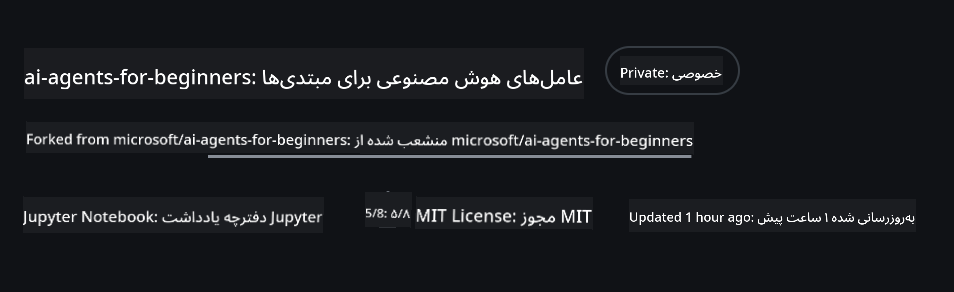
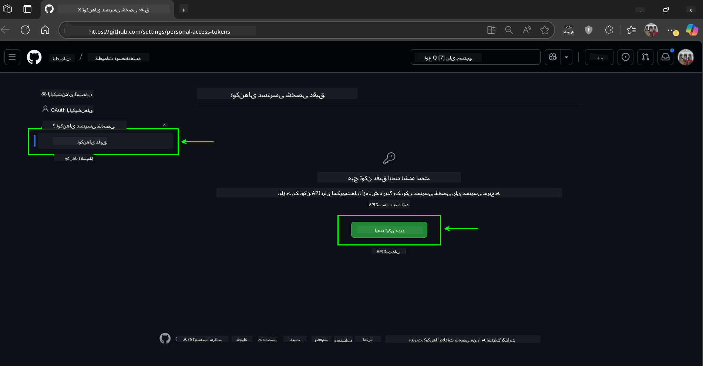
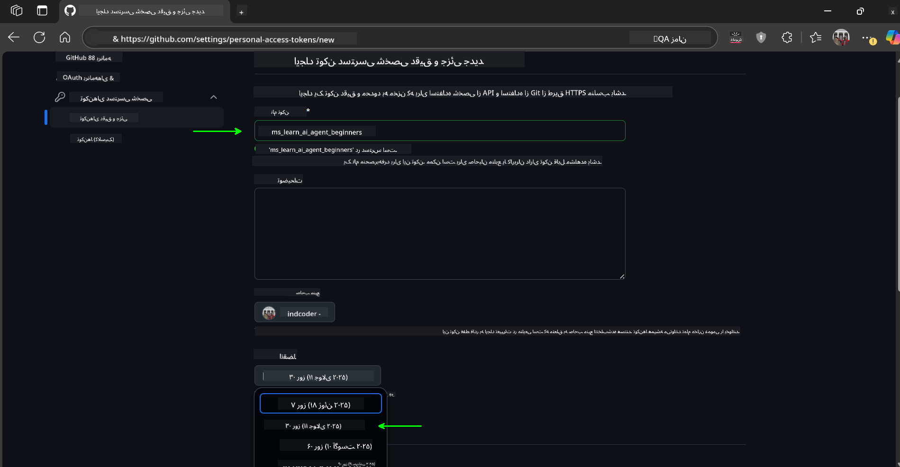
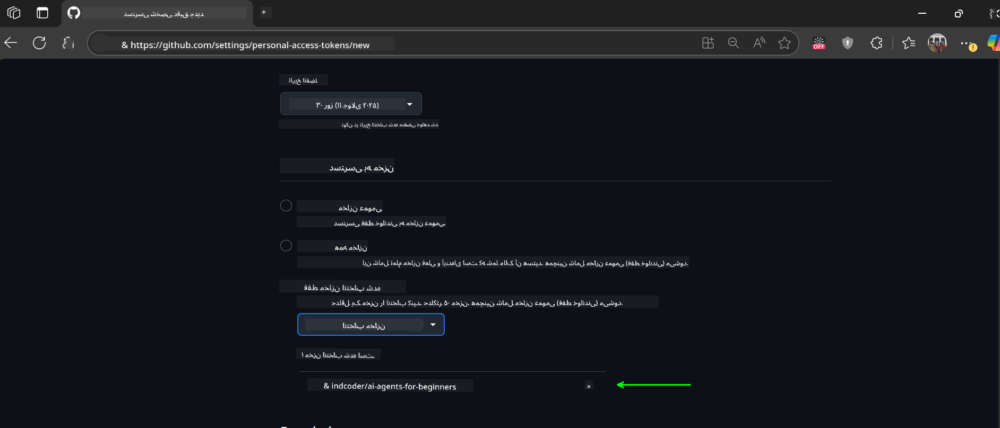
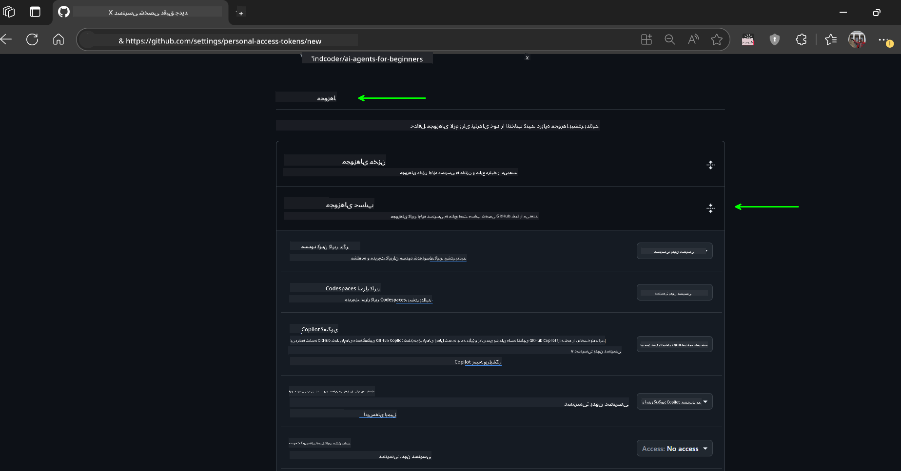
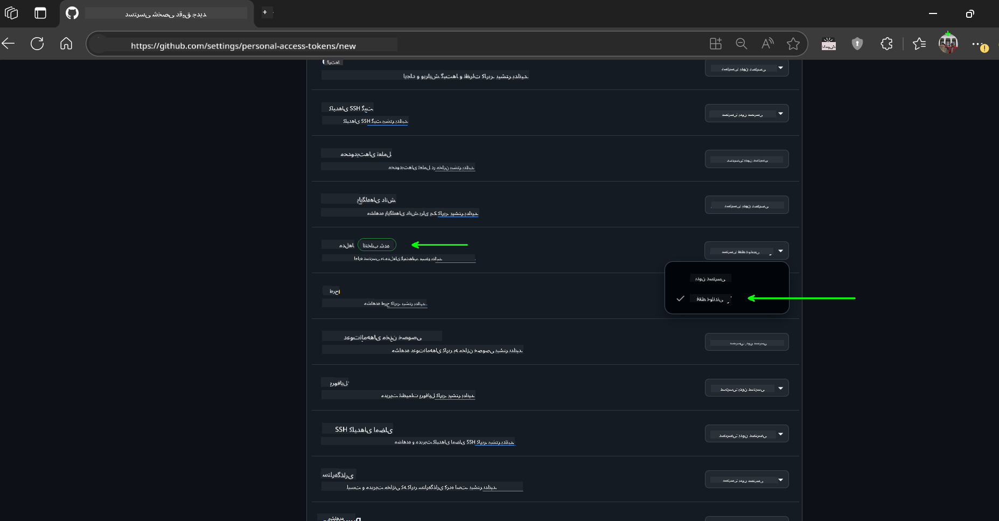
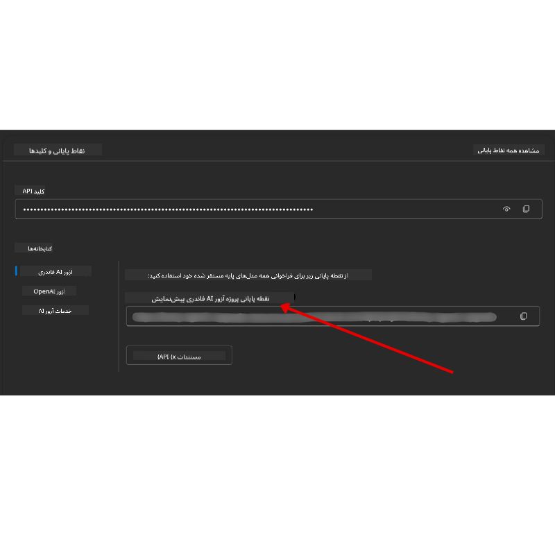

<!--
CO_OP_TRANSLATOR_METADATA:
{
  "original_hash": "c6a79c8f2b56a80370ff7e447765524f",
  "translation_date": "2025-07-24T07:41:25+00:00",
  "source_file": "00-course-setup/README.md",
  "language_code": "fa"
}
-->
# راه‌اندازی دوره

## مقدمه

این درس نحوه اجرای نمونه کدهای این دوره را پوشش می‌دهد.

## کلون یا فورک کردن این مخزن

برای شروع، لطفاً مخزن GitHub را کلون یا فورک کنید. این کار نسخه‌ای از محتوای دوره را برای شما ایجاد می‌کند تا بتوانید کدها را اجرا، آزمایش و تغییر دهید!

این کار با کلیک روی لینک زیر انجام می‌شود:



## اجرای کد

این دوره مجموعه‌ای از نوت‌بوک‌های Jupyter ارائه می‌دهد که می‌توانید با آن‌ها تجربه عملی در ساخت عوامل هوش مصنوعی کسب کنید.

نمونه کدها از یکی از موارد زیر استفاده می‌کنند:

**نیازمند حساب GitHub - رایگان**:

1) چارچوب Semantic Kernel Agent + بازار مدل‌های GitHub. با عنوان (semantic-kernel.ipynb)
2) چارچوب AutoGen + بازار مدل‌های GitHub. با عنوان (autogen.ipynb)

**نیازمند اشتراک Azure**:
3) Azure AI Foundry + سرویس Azure AI Agent. با عنوان (azureaiagent.ipynb)

ما شما را تشویق می‌کنیم که هر سه نوع مثال را امتحان کنید تا ببینید کدام یک برای شما بهتر عمل می‌کند.

هر گزینه‌ای که انتخاب کنید، تعیین می‌کند که کدام مراحل راه‌اندازی را باید در زیر دنبال کنید:

## الزامات

- Python 3.12+
  - **NOTE**: اگر Python3.12 نصب نشده است، مطمئن شوید که آن را نصب کنید. سپس محیط مجازی خود را با استفاده از python3.12 ایجاد کنید تا نسخه‌های صحیح از فایل requirements.txt نصب شوند.
- یک حساب GitHub - برای دسترسی به بازار مدل‌های GitHub
- اشتراک Azure - برای دسترسی به Azure AI Foundry
- حساب Azure AI Foundry - برای دسترسی به سرویس Azure AI Agent

ما یک فایل `requirements.txt` در ریشه این مخزن قرار داده‌ایم که شامل تمام بسته‌های پایتون مورد نیاز برای اجرای نمونه کدها است.

می‌توانید آن‌ها را با اجرای دستور زیر در ترمینال خود در ریشه مخزن نصب کنید:

```bash
pip install -r requirements.txt
```
ما توصیه می‌کنیم یک محیط مجازی پایتون ایجاد کنید تا از هرگونه تداخل و مشکل جلوگیری شود.

## راه‌اندازی VSCode
مطمئن شوید که از نسخه صحیح پایتون در VSCode استفاده می‌کنید.


## راه‌اندازی برای نمونه‌ها با استفاده از مدل‌های GitHub 

### مرحله 1: دریافت توکن دسترسی شخصی (PAT) GitHub

این دوره از بازار مدل‌های GitHub استفاده می‌کند که دسترسی رایگان به مدل‌های زبان بزرگ (LLM) را فراهم می‌کند که شما برای ساخت عوامل هوش مصنوعی از آن‌ها استفاده خواهید کرد.

برای استفاده از مدل‌های GitHub، باید یک [توکن دسترسی شخصی GitHub](https://docs.github.com/en/authentication/keeping-your-account-and-data-secure/managing-your-personal-access-tokens) ایجاد کنید.

این کار با رفتن به حساب GitHub شما انجام می‌شود.

لطفاً هنگام ایجاد توکن خود، [اصل حداقل امتیاز](https://docs.github.com/en/get-started/learning-to-code/storing-your-secrets-safely) را دنبال کنید. این بدان معناست که باید فقط مجوزهای مورد نیاز برای اجرای نمونه کدهای این دوره را به توکن بدهید.

1. گزینه `Fine-grained tokens` را در سمت چپ صفحه خود انتخاب کنید.

    سپس گزینه `Generate new token` را انتخاب کنید.

    

1. یک نام توصیفی برای توکن خود وارد کنید که هدف آن را منعکس کند و شناسایی آن را در آینده آسان کند. یک تاریخ انقضا تنظیم کنید (توصیه: 30 روز؛ می‌توانید دوره کوتاه‌تری مانند 7 روز را برای امنیت بیشتر انتخاب کنید.)

    

1. دامنه توکن را به فورک مخزن خود محدود کنید.

    

1. مجوزهای توکن را محدود کنید: در بخش **Permissions**، گزینه **Account Permissions** را فعال کنید، به **Models** بروید و فقط دسترسی خواندن مورد نیاز برای مدل‌های GitHub را فعال کنید.

    

    

توکن جدیدی که ایجاد کرده‌اید را کپی کنید. اکنون این توکن را به فایل `.env` که در این دوره گنجانده شده است اضافه خواهید کرد.

### مرحله 2: ایجاد فایل `.env`

برای ایجاد فایل `.env` دستور زیر را در ترمینال خود اجرا کنید.

```bash
cp .env.example .env
```

این دستور فایل نمونه را کپی کرده و یک فایل `.env` در دایرکتوری شما ایجاد می‌کند که در آن مقادیر متغیرهای محیطی را پر می‌کنید.

با کپی کردن توکن خود، فایل `.env` را در ویرایشگر متن مورد علاقه خود باز کنید و توکن خود را در فیلد `GITHUB_TOKEN` جای‌گذاری کنید.

اکنون باید بتوانید نمونه کدهای این دوره را اجرا کنید.

## راه‌اندازی برای نمونه‌ها با استفاده از Azure AI Foundry و Azure AI Agent Service

### مرحله 1: دریافت نقطه پایانی پروژه Azure خود

مراحل ایجاد یک هاب و پروژه در Azure AI Foundry را از اینجا دنبال کنید: [بررسی اجمالی منابع هاب](https://learn.microsoft.com/en-us/azure/ai-foundry/concepts/ai-resources)

پس از ایجاد پروژه خود، باید رشته اتصال پروژه خود را دریافت کنید.

این کار با رفتن به صفحه **Overview** پروژه شما در پورتال Azure AI Foundry انجام می‌شود.



### مرحله 2: ایجاد فایل `.env`

برای ایجاد فایل `.env` دستور زیر را در ترمینال خود اجرا کنید.

```bash
cp .env.example .env
```

این دستور فایل نمونه را کپی کرده و یک فایل `.env` در دایرکتوری شما ایجاد می‌کند که در آن مقادیر متغیرهای محیطی را پر می‌کنید.

با کپی کردن توکن خود، فایل `.env` را در ویرایشگر متن مورد علاقه خود باز کنید و توکن خود را در فیلد `PROJECT_ENDPOINT` جای‌گذاری کنید.

### مرحله 3: ورود به Azure

به عنوان یک روش امنیتی، از [احراز هویت بدون کلید](https://learn.microsoft.com/azure/developer/ai/keyless-connections?tabs=csharp%2Cazure-cli?WT.mc_id=academic-105485-koreyst) برای احراز هویت به Azure OpenAI با Microsoft Entra ID استفاده خواهیم کرد.

سپس، یک ترمینال باز کنید و دستور `az login --use-device-code` را اجرا کنید تا به حساب Azure خود وارد شوید.

پس از ورود، اشتراک خود را در ترمینال انتخاب کنید.

## متغیرهای محیطی اضافی - Azure Search و Azure OpenAI 

برای درس Agentic RAG - درس 5 - نمونه‌هایی وجود دارد که از Azure Search و Azure OpenAI استفاده می‌کنند.

اگر می‌خواهید این نمونه‌ها را اجرا کنید، باید متغیرهای محیطی زیر را به فایل `.env` خود اضافه کنید:

### صفحه Overview (پروژه)

- `AZURE_SUBSCRIPTION_ID` - جزئیات پروژه را در صفحه **Overview** پروژه خود بررسی کنید.

- `AZURE_AI_PROJECT_NAME` - به بالای صفحه **Overview** پروژه خود نگاه کنید.

- `AZURE_OPENAI_SERVICE` - این مورد را در تب **Included capabilities** برای **Azure OpenAI Service** در صفحه **Overview** پیدا کنید.

### مرکز مدیریت

- `AZURE_OPENAI_RESOURCE_GROUP` - به **Project properties** در صفحه **Overview** مرکز مدیریت بروید.

- `GLOBAL_LLM_SERVICE` - در بخش **Connected resources**، نام اتصال **Azure AI Services** را پیدا کنید. اگر لیست نشده است، در **پورتال Azure** زیر گروه منابع خود، نام منبع AI Services را بررسی کنید.

### صفحه Models + Endpoints

- `AZURE_OPENAI_EMBEDDING_DEPLOYMENT_NAME` - مدل embedding خود را انتخاب کنید (مثلاً `text-embedding-ada-002`) و نام **Deployment** را از جزئیات مدل یادداشت کنید.

- `AZURE_OPENAI_CHAT_DEPLOYMENT_NAME` - مدل چت خود را انتخاب کنید (مثلاً `gpt-4o-mini`) و نام **Deployment** را از جزئیات مدل یادداشت کنید.

### پورتال Azure

- `AZURE_OPENAI_ENDPOINT` - به دنبال **Azure AI services** بگردید، روی آن کلیک کنید، سپس به **Resource Management**، **Keys and Endpoint** بروید، به پایین اسکرول کنید تا "Azure OpenAI endpoints" را ببینید و آن را که "Language APIs" می‌گوید کپی کنید.

- `AZURE_OPENAI_API_KEY` - از همان صفحه، کلید 1 یا کلید 2 را کپی کنید.

- `AZURE_SEARCH_SERVICE_ENDPOINT` - منبع **Azure AI Search** خود را پیدا کنید، روی آن کلیک کنید و **Overview** را ببینید.

- `AZURE_SEARCH_API_KEY` - سپس به **Settings** و سپس **Keys** بروید تا کلید اصلی یا ثانویه مدیر را کپی کنید.

### صفحه وب خارجی

- `AZURE_OPENAI_API_VERSION` - به صفحه [چرخه عمر نسخه API](https://learn.microsoft.com/en-us/azure/ai-services/openai/api-version-deprecation#latest-ga-api-release) در بخش **Latest GA API release** مراجعه کنید.

### راه‌اندازی احراز هویت بدون کلید

به جای کدنویسی ثابت اعتبارنامه‌های خود، از یک اتصال بدون کلید با Azure OpenAI استفاده خواهیم کرد. برای این کار، `DefaultAzureCredential` را وارد کرده و بعداً تابع `DefaultAzureCredential` را برای دریافت اعتبارنامه فراخوانی می‌کنیم.

```python
from azure.identity import DefaultAzureCredential, InteractiveBrowserCredential
```

## جایی گیر کرده‌اید؟

اگر در اجرای این راه‌اندازی مشکلی دارید، به گروه ما بپیوندید یا...

## درس بعدی

اکنون آماده اجرای کد این دوره هستید. از یادگیری بیشتر درباره دنیای عوامل هوش مصنوعی لذت ببرید!

[مقدمه‌ای بر عوامل هوش مصنوعی و موارد استفاده از آن‌ها](../01-intro-to-ai-agents/README.md)

**سلب مسئولیت**:  
این سند با استفاده از سرویس ترجمه هوش مصنوعی [Co-op Translator](https://github.com/Azure/co-op-translator) ترجمه شده است. در حالی که ما تلاش می‌کنیم دقت را حفظ کنیم، لطفاً توجه داشته باشید که ترجمه‌های خودکار ممکن است شامل خطاها یا نادرستی‌ها باشند. سند اصلی به زبان اصلی آن باید به عنوان منبع معتبر در نظر گرفته شود. برای اطلاعات حساس، توصیه می‌شود از ترجمه حرفه‌ای انسانی استفاده کنید. ما مسئولیتی در قبال سوء تفاهم‌ها یا تفسیرهای نادرست ناشی از استفاده از این ترجمه نداریم.