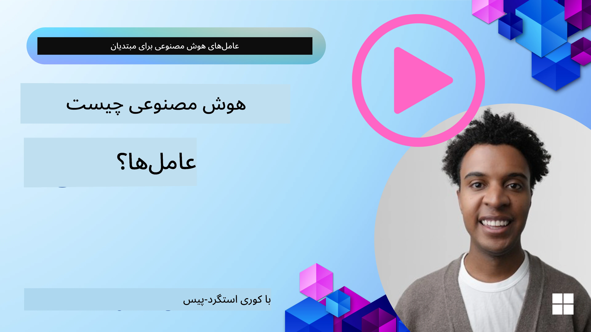
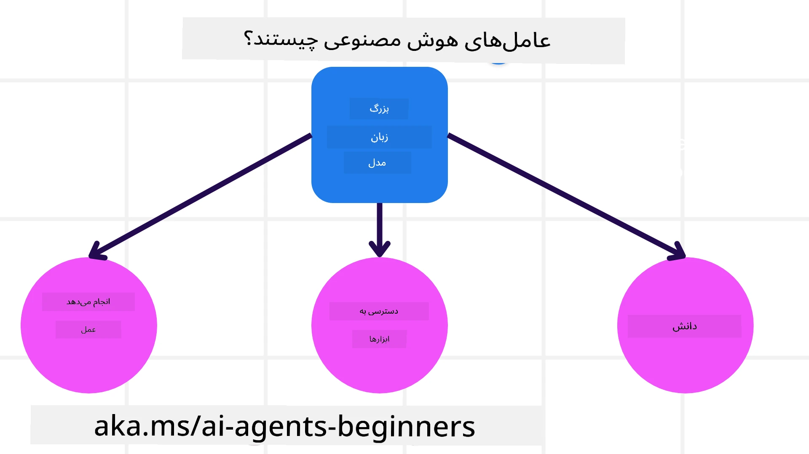
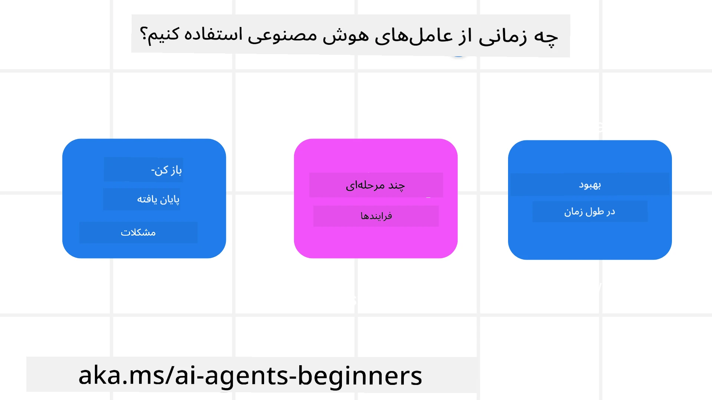

> _(برای مشاهده ویدیوی این درس روی تصویر بالا کلیک کنید)_

# مقدمه‌ای بر عامل‌های هوش مصنوعی و موارد استفاده از عامل‌ها

به دوره «عامل‌های هوش مصنوعی برای مبتدیان» خوش آمدید! این دوره دانش پایه‌ای و نمونه‌های کاربردی برای ساخت عامل‌های هوش مصنوعی را فراهم می‌کند.

به <a href="https://discord.gg/kzRShWzttr" target="_blank">جامعهٔ Discord مربوط به Azure AI</a> بپیوندید تا با سایر یادگیرندگان و سازندگان عامل‌های هوش مصنوعی ملاقات کنید و هر سوالی دربارهٔ این دوره دارید بپرسید.

برای شروع این دوره، ابتدا با درک بهتر اینکه عامل‌های هوش مصنوعی چه هستند و چگونه می‌توانیم از آن‌ها در برنامه‌ها و جریان‌های کاری‌ای که می‌سازیم استفاده کنیم آغاز می‌کنیم.

## مقدمه

این درس شامل موارد زیر است:

- عامل‌های هوش مصنوعی چه هستند و انواع مختلف عامل‌ها کدام‌اند؟
- چه موارد استفاده‌ای برای عامل‌های هوش مصنوعی مناسب‌ترند و چگونه می‌توانند به ما کمک کنند؟
- برخی از بلوک‌های سازندهٔ اساسی هنگام طراحی راه‌حل‌های عاملی چه هستند؟

## اهداف یادگیری
بعد از اتمام این درس، شما باید قادر باشید:

- مفاهیم عامل‌های هوش مصنوعی را درک کنید و تفاوت آن‌ها با سایر راه‌حل‌های هوش مصنوعی را بدانید.
- عامل‌های هوش مصنوعی را به مؤثرترین شکل به‌کار ببرید.
- راه‌حل‌های عاملی را به‌صورت کاربردی برای کاربران و مشتریان طراحی کنید.

## تعریف عامل‌های هوش مصنوعی و انواع عامل‌های هوش مصنوعی

### عامل‌های هوش مصنوعی چیستند؟

عامل‌های هوش مصنوعی سیستم‌هایی هستند که امکان می‌دهند **مدل‌های زبانی بزرگ (LLMs)** با **انجام اقدامات** توانایی‌های خود را گسترش دهند از طریق دادن **دسترسی به ابزارها** و **دانش** به LLMها.

بیایید این تعریف را به بخش‌های کوچکتر تقسیم کنیم:

- **سیستم** - مهم است که به عامل‌ها نه به‌عنوان تنها یک مؤلفه، بلکه به‌عنوان یک سیستم از چندین مؤلفه فکر کنیم. در سطح پایه، مؤلفه‌های یک عامل هوش مصنوعی عبارتند از:
  - **محیط** - فضای تعریف‌شده‌ای که عامل هوش مصنوعی در آن عمل می‌کند. به‌عنوان مثال، اگر ما یک عامل رزرو سفر داشته باشیم، محیط می‌تواند سیستم رزرو سفر باشد که عامل برای تکمیل وظایف از آن استفاده می‌کند.
  - **حسگرها** - محیط‌ها اطلاعات دارند و بازخورد ارائه می‌دهند. عامل‌های هوش مصنوعی از حسگرها برای جمع‌آوری و تفسیر این اطلاعات دربارهٔ وضعیت فعلی محیط استفاده می‌کنند. در مثال عامل رزرو سفر، سیستم رزرو می‌تواند اطلاعاتی مانند دسترسی اتاق یا قیمت پروازها را فراهم کند.
  - **عملگرها** - زمانی که عامل هوش مصنوعی وضعیت فعلی محیط را دریافت می‌کند، برای وظیفهٔ جاری تعیین می‌کند که چه عملی را باید انجام دهد تا محیط تغییر کند. برای عامل رزرو سفر، ممکن است رزرو یک اتاق در دسترس برای کاربر باشد.

**مدل‌های زبانی بزرگ** - مفهوم عامل‌ها پیش از ایجاد LLMها وجود داشت. مزیت ساخت عامل‌های هوش مصنوعی با LLMها توانایی آن‌ها در تفسیر زبان انسانی و داده‌ها است. این توانایی به LLMها امکان می‌دهد اطلاعات محیطی را تفسیر کرده و یک برنامه برای تغییر محیط تعریف کنند.

**انجام اقدامات** - خارج از سیستم‌های عامل، LLMها محدود به موقعیت‌هایی هستند که اقدام تولید محتوا یا اطلاعات بر اساس پرسش کاربر است. در داخل سیستم‌های عامل، LLMها می‌توانند با تفسیر درخواست کاربر و استفاده از ابزارهای موجود در محیط وظایف را انجام دهند.

**دسترسی به ابزارها** - اینکه LLM به چه ابزارهایی دسترسی دارد توسط 1) محیطی که در آن کار می‌کند و 2) توسعه‌دهندهٔ عامل تعریف می‌شود. در مثال عامل سفر، ابزارهای عامل محدود به عملیات موجود در سیستم رزرو هستند، و/یا توسعه‌دهنده می‌تواند دسترسی ابزار عامل را به پروازها محدود کند.

**حافظه + دانش** - حافظه می‌تواند کوتاه‌مدت در زمینهٔ گفتگو بین کاربر و عامل باشد. در بلندمدت، خارج از اطلاعات ارائه‌شده توسط محیط، عامل‌های هوش مصنوعی همچنین می‌توانند دانش را از سایر سیستم‌ها، خدمات، ابزارها و حتی سایر عامل‌ها بازیابی کنند. در مثال عامل سفر، این دانش می‌تواند اطلاعات ترجیحات سفر کاربر باشد که در پایگاه‌دادهٔ مشتریان قرار دارد.

### انواع مختلف عامل‌ها

حال که تعریفی کلی از عامل‌های هوش مصنوعی داریم، بیایید به برخی از انواع خاص عامل‌ها و چگونگی اعمال آن‌ها در یک عامل رزرو سفر نگاه کنیم.

| **نوع عامل**                | **توضیح**                                                                                                                       | **مثال**                                                                                                                                                                                                                   |
| ----------------------------- | ------------------------------------------------------------------------------------------------------------------------------------- | ----------------------------------------------------------------------------------------------------------------------------------------------------------------------------------------------------------------------------- |
| **عامل‌های واکنشی ساده**      | بر اساس قوانین از پیش تعریف‌شده اقدامات فوری انجام می‌دهند.                                                                                  | عامل رزرو سفر زمینهٔ ایمیل را تفسیر می‌کند و شکایات سفر را به خدمات مشتریان ارجاع می‌دهد.                                                                                                                          |
| **عامل‌های بازتابی مبتنی بر مدل** | بر اساس یک مدل از جهان و تغییرات آن مدل اقدام می‌کنند.                                                              | عامل رزرو سفر مسیرهایی با تغییرات قیمت قابل‌توجه را بر اساس دسترسی به داده‌های قیمت تاریخی اولویت‌بندی می‌کند.                                                                                                             |
| **عامل‌های مبتنی بر هدف**         | با تفسیر هدف و تعیین اقدامات برای رسیدن به آن، برنامه‌هایی برای دستیابی به اهداف خاص ایجاد می‌کنند.                                  | عامل رزرو سفر با تعیین ترتیبات لازم (ماشین، حمل‌ونقل عمومی، پروازها) برای حرکت از مکان فعلی به مقصد، سفر را رزرو می‌کند.                                                                                |
| **عامل‌های مبتنی بر سودمندی**      | ترجیحات را در نظر می‌گیرند و با ارزیابی عددیِ مصالحه‌ها تعیین می‌کنند چگونه اهداف را تحقق بخشند.                                               | عامل رزرو سفر با سنجش آسایش در برابر هزینه هنگام رزرو سفر، سودمندی را به حداکثر می‌رساند.                                                                                                                                          |
| **عامل‌های یادگیرنده**           | با پاسخ به بازخورد و تنظیم اقدامات متناسب با آن در طول زمان بهبود می‌یابند.                                                        | عامل رزرو سفر با استفاده از بازخورد مشتریان در نظرسنجی‌های پس از سفر، در رزروهای آینده اصلاحاتی ایجاد می‌کند.                                                                                                               |
| **عامل‌های سلسله‌مراتبی**       | شامل چندین عامل در یک سیستم لایه‌ای هستند، با عامل‌های سطح بالاتر که وظایف را به زیروظایف تقسیم می‌کنند تا عامل‌های سطح پایین‌تر آن‌ها را تکمیل کنند. | عامل رزرو سفر یک سفر را با تقسیم وظیفه به زیروظایف (برای مثال، لغو رزروهای خاص) لغو می‌کند و عامل‌های سطح پایین‌تر آن‌ها را تکمیل کرده و به عامل سطح بالاتر گزارش می‌دهند.                                     |
| **سیستم‌های چندعاملی (MAS)** | عامل‌ها به‌صورت مستقل، یا به‌طور همکاری یا رقابت، وظایف را تکمیل می‌کنند.                                                           | همکاری: چندین عامل خدمات سفر خاص مانند هتل‌ها، پروازها و سرگرمی را رزرو می‌کنند. رقابت: چندین عامل بر سر یک تقویم رزرو هتل مشترک رقابت می‌کنند تا مشتریان را در هتل جا دهند. |

## چه زمانی از عامل‌های هوش مصنوعی استفاده کنیم

در بخش قبلی، از مورد استفادهٔ عامل رزرو سفر برای توضیح اینکه چگونه انواع مختلف عامل‌ها می‌توانند در سناریوهای مختلف رزرو سفر استفاده شوند بهره بردیم. ما به استفاده از همین برنامه در سراسر دوره ادامه خواهیم داد.

بیایید به انواع موارد استفاده که عامل‌های هوش مصنوعی برای آن‌ها بهترین کاربرد را دارند نگاه کنیم:

- **مسائل باز و بدون پاسخ قطعی** - اجازه دادن به LLM برای تعیین مراحل لازم برای تکمیل یک وظیفه زیرا همیشه نمی‌توان آن‌ها را در یک جریان کاری سخت‌کدنویسی کرد.
- **فرآیندهای چندمرحله‌ای** - وظایفی که نیاز به سطحی از پیچیدگی دارند که عامل هوش مصنوعی باید در طول چند نوبت از ابزارها یا اطلاعات استفاده کند به‌جای بازیابی در یک مرحلهٔ واحد.
- **بهبود در طول زمان** - وظایفی که عامل می‌تواند با دریافت بازخورد از محیط یا کاربران در طول زمان بهبود یابد تا سودمندی بهتری ارائه دهد.

ما ملاحظات بیشتری دربارهٔ استفاده از عامل‌های هوش مصنوعی را در درس «ساخت عامل‌های هوش مصنوعی قابل‌اعتماد» پوشش می‌دهیم.

## مبانی راه‌حل‌های عاملی

### توسعهٔ عامل

اولین گام در طراحی یک سیستم عامل هوش مصنوعی تعریف ابزارها، اقدامات و رفتارها است. در این دوره، ما بر استفاده از **Azure AI Agent Service** برای تعریف عامل‌هایمان تمرکز می‌کنیم. این سرویس قابلیت‌هایی مانند:

- انتخاب مدل‌های متن‌باز مانند OpenAI، Mistral و Llama
- استفاده از داده‌های دارای مجوز از طریق تأمین‌کنندگانی مانند Tripadvisor
- استفاده از ابزارهای استاندارد OpenAPI 3.0

### الگوهای عاملی

ارتباط با LLMها از طریق پرامپت‌ها انجام می‌شود. با توجه به طبیعت نیمه‌خودمختار عامل‌ها، همیشه ممکن یا لازم نیست که بعد از تغییر در محیط به‌صورت دستی دوباره به LLM پرامپت داده شود. ما از **الگوهای عاملی** استفاده می‌کنیم که به ما اجازه می‌دهد در چندین مرحله به‌صورت مقیاس‌پذیرتری به LLM پرامپت دهیم.

این دوره به برخی از الگوهای عاملی محبوب کنونی تقسیم شده است.

### چارچوب‌های عاملی

چارچوب‌های عاملی به توسعه‌دهندگان اجازه می‌دهند الگوهای عاملی را از طریق کد پیاده‌سازی کنند. این چارچوب‌ها قالب‌ها، افزونه‌ها و ابزارهایی برای همکاری بهتر عامل‌ها فراهم می‌کنند. این مزایا توانایی‌هایی برای مشاهده‌پذیری و عیب‌یابی بهتر سیستم‌های عامل هوش مصنوعی فراهم می‌کنند.

در این دوره، ما چارچوب عامل مایکروسافت (Microsoft Agent Framework (MAF)) را برای ساخت عامل‌های آمادهٔ تولید بررسی خواهیم کرد.

## نمونه کدها

- Python: [چارچوب عامل](./code_samples/01-python-agent-framework.ipynb)
- .NET: [چارچوب عامل](./code_samples/01-dotnet-agent-framework.md)

## سوالات بیشتری درباره عامل‌های هوش مصنوعی دارید؟

به [Microsoft Foundry Discord](https://aka.ms/ai-agents/discord) بپیوندید تا با سایر یادگیرندگان ملاقات کنید، در ساعات اداری شرکت کنید و سوالات مربوط به عامل‌های هوش مصنوعی خود را پاسخ بگیرید.

## درس قبلی

[راه‌اندازی دوره](../00-course-setup/README.md)

## درس بعدی

[کاوش چارچوب‌های عاملی](../02-explore-agentic-frameworks/README.md)

---

<!-- CO-OP TRANSLATOR DISCLAIMER START -->
سلب مسئولیت:
این سند با استفاده از سرویس ترجمه مبتنی بر هوش مصنوعی Co-op Translator (https://github.com/Azure/co-op-translator) ترجمه شده است. در حالی که ما برای دقت تلاش می‌کنیم، لطفاً توجه داشته باشید که ترجمه‌های خودکار ممکن است حاوی خطاها یا نادرستی‌هایی باشند. سند اصلی به زبان مبدأ باید به عنوان منبع معتبر در نظر گرفته شود. برای اطلاعات حیاتی، استفاده از ترجمه حرفه‌ای انسانی توصیه می‌شود. ما در قبال هرگونه سوء تفاهم یا تفسیر نادرست ناشی از استفاده از این ترجمه مسئولیتی نداریم.
<!-- CO-OP TRANSLATOR DISCLAIMER END -->