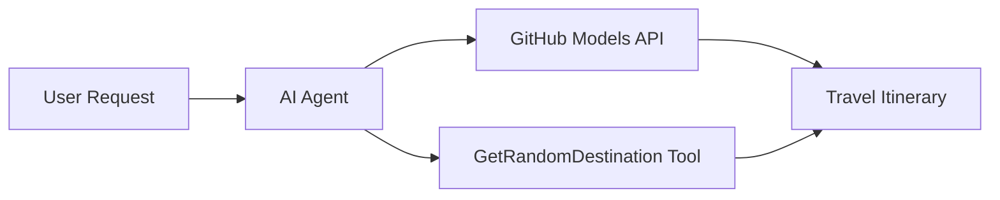

<!--
CO_OP_TRANSLATOR_METADATA:
{
  "original_hash": "23afd9be7b6ba5b69a44c3b6a78e07f6",
  "translation_date": "2025-11-06T10:01:42+00:00",
  "source_file": "01-intro-to-ai-agents/code_samples/01-dotnet-agent-framework.md",
  "language_code": "fa"
}
-->
# 🌍 عامل سفر هوشمند با Microsoft Agent Framework (.NET)

## 📋 نمای کلی سناریو

این دفترچه نشان می‌دهد که چگونه می‌توان یک عامل هوشمند برای برنامه‌ریزی سفر با استفاده از Microsoft Agent Framework برای .NET ساخت. این عامل می‌تواند برنامه‌های سفر روزانه شخصی‌سازی‌شده‌ای برای مقاصد تصادفی در سراسر جهان ایجاد کند.

**قابلیت‌های کلیدی:**
- 🎲 **انتخاب مقصد تصادفی**: از یک ابزار سفارشی برای انتخاب مکان‌های تعطیلات استفاده می‌کند
- 🗺️ **برنامه‌ریزی سفر هوشمند**: برنامه‌های دقیق روزانه ایجاد می‌کند
- 🔄 **پخش زنده در زمان واقعی**: از پاسخ‌های فوری و پخش زنده پشتیبانی می‌کند
- 🛠️ **ادغام ابزار سفارشی**: نشان می‌دهد که چگونه قابلیت‌های عامل را گسترش دهید

## 🔧 معماری فنی

### فناوری‌های اصلی
- **Microsoft Agent Framework**: آخرین پیاده‌سازی .NET برای توسعه عامل‌های هوش مصنوعی
- **ادغام مدل‌های GitHub**: از سرویس استنتاج مدل‌های هوش مصنوعی GitHub استفاده می‌کند
- **سازگاری با OpenAI API**: از کتابخانه‌های مشتری OpenAI با نقاط پایانی سفارشی بهره می‌برد
- **پیکربندی امن**: مدیریت کلیدهای API مبتنی بر محیط

### اجزای کلیدی
1. **AIAgent**: هماهنگ‌کننده اصلی عامل که جریان مکالمه را مدیریت می‌کند
2. **ابزارهای سفارشی**: تابع `GetRandomDestination()` که در دسترس عامل است
3. **کلاینت چت**: رابط مکالمه پشتیبانی‌شده توسط مدل‌های GitHub
4. **پشتیبانی از پخش زنده**: قابلیت‌های تولید پاسخ در زمان واقعی

### الگوی ادغام


## 🚀 شروع به کار

**پیش‌نیازها:**
- .NET نسخه 10.0 یا بالاتر
- توکن دسترسی API مدل‌های GitHub
- متغیرهای محیطی پیکربندی‌شده در فایل `.env`

**متغیرهای محیطی مورد نیاز:**
```env
GITHUB_TOKEN=your_github_token
GITHUB_ENDPOINT=https://models.inference.ai.azure.com
GITHUB_MODEL_ID=gpt-4o-mini
```

کد نمونه زیر را به ترتیب اجرا کنید تا عامل سفر را در عمل مشاهده کنید!

---

## برنامه تک‌فایلی .NET: نمونه عامل سفر هوشمند

کد کامل قابل اجرا را در `01-dotnet-agent-framework.cs` مشاهده کنید.

```bash
dotnet run 01-dotnet-agent-framework.cs
```

### کد نمونه

```csharp
static string GetRandomDestination()
{
    var destinations = new List<string>
    {
        "Paris, France",
        "Tokyo, Japan",
        "New York City, USA",
        "Sydney, Australia",
        "Rome, Italy",
        "Barcelona, Spain",
        "Cape Town, South Africa",
        "Rio de Janeiro, Brazil",
        "Bangkok, Thailand",
        "Vancouver, Canada"
    };
    var random = new Random();
    int index = random.Next(destinations.Count);
    return destinations[index];
}

// Extract configuration from environment variables
var github_endpoint = Environment.GetEnvironmentVariable("GITHUB_ENDPOINT") ?? throw new InvalidOperationException("GITHUB_ENDPOINT is not set.");
var github_model_id = Environment.GetEnvironmentVariable("GITHUB_MODEL_ID") ?? "gpt-4o-mini";
var github_token = Environment.GetEnvironmentVariable("GITHUB_TOKEN") ?? throw new InvalidOperationException("GITHUB_TOKEN is not set.");

// Configure OpenAI Client Options
var openAIOptions = new OpenAIClientOptions()
{
    Endpoint = new Uri(github_endpoint)
};

// Initialize OpenAI Client with GitHub Models Configuration
var openAIClient = new OpenAIClient(new ApiKeyCredential(github_token), openAIOptions);

// Create AI Agent with Travel Planning Capabilities
AIAgent agent = openAIClient
    .GetChatClient(github_model_id)
    .CreateAIAgent(
        instructions: "You are a helpful AI Agent that can help plan vacations for customers at random destinations",
        tools: [AIFunctionFactory.Create(GetRandomDestination)]
    );

// Execute Agent: Plan a Day Trip (Non-Streaming)
Console.WriteLine(await agent.RunAsync("Plan me a day trip"));

// Execute Agent: Plan a Day Trip (Streaming Response)
await foreach (var update in agent.RunStreamingAsync("Plan me a day trip"))
{
    Console.Write(update);
}
```

---

**سلب مسئولیت**:  
این سند با استفاده از سرویس ترجمه هوش مصنوعی [Co-op Translator](https://github.com/Azure/co-op-translator) ترجمه شده است. در حالی که ما تلاش می‌کنیم دقت را حفظ کنیم، لطفاً توجه داشته باشید که ترجمه‌های خودکار ممکن است شامل خطاها یا نادرستی‌ها باشند. سند اصلی به زبان اصلی آن باید به عنوان منبع معتبر در نظر گرفته شود. برای اطلاعات حیاتی، ترجمه حرفه‌ای انسانی توصیه می‌شود. ما مسئولیتی در قبال سوء تفاهم‌ها یا تفسیرهای نادرست ناشی از استفاده از این ترجمه نداریم.