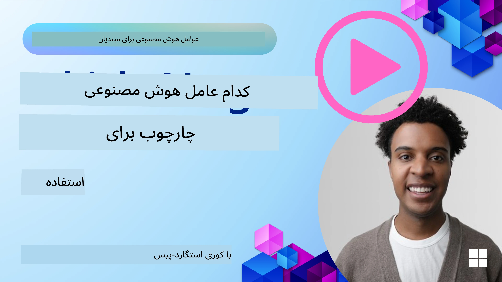

[](https://youtu.be/ODwF-EZo_O8?si=1xoy_B9RNQfrYdF7)

> _(برای تماشای ویدیو این درس روی تصویر بالا کلیک کنید)_

# کاوش چارچوب‌های عامل هوش مصنوعی

چارچوب‌های عامل هوش مصنوعی پلتفرم‌های نرم‌افزاری‌ای هستند که برای ساده‌سازی ساخت، استقرار و مدیریت عامل‌های هوش مصنوعی طراحی شده‌اند. این چارچوب‌ها به توسعه‌دهندگان اجزای از پیش ساخته‌شده، انتزاع‌ها و ابزارهایی می‌دهند که توسعه سیستم‌های پیچیده هوش مصنوعی را تسهیل می‌کنند.

این چارچوب‌ها به توسعه‌دهندگان کمک می‌کنند با فراهم کردن رویکردهای استاندارد برای چالش‌های رایج در توسعه عامل‌های هوش مصنوعی، بر جنبه‌های منحصربه‌فرد برنامه‌هایشان تمرکز کنند. آن‌ها مقیاس‌پذیری، دسترسی‌پذیری و کارایی در ساخت سیستم‌های هوش مصنوعی را افزایش می‌دهند.

## مقدمه 

این درس موارد زیر را پوشش خواهد داد:

- چارچوب‌های عامل هوش مصنوعی چه هستند و چه چیزی به توسعه‌دهندگان امکان می‌دهند؟
- تیم‌ها چگونه می‌توانند از این چارچوب‌ها برای ساخت نمونه اولیه سریع، تکرار و بهبود قابلیت‌های عامل خود استفاده کنند؟
- تفاوت بین چارچوب‌ها و ابزارهای ساخته‌شده توسط مایکروسافت (<a href="https://aka.ms/ai-agents-beginners/ai-agent-service" target="_blank">سرویس Azure AI Agent</a> و <a href="https://learn.microsoft.com/azure/ai-services/openai/how-to/responses" target="_blank">چارچوب عامل مایکروسافت</a>) چیست؟
- آیا می‌توانم ابزارهای موجود در اکوسیستم Azure خود را مستقیماً یکپارچه کنم، یا به راه‌حل‌های مستقل نیاز دارم؟
- سرویس Azure AI Agents چیست و چگونه به من کمک می‌کند؟

## اهداف یادگیری

اهداف این درس به شما کمک می‌کند تا درک کنید:

- نقش چارچوب‌های عامل هوش مصنوعی در توسعه هوش مصنوعی.
- چگونه از چارچوب‌های عامل هوش مصنوعی برای ساخت عامل‌های هوشمند استفاده کنید.
- قابلیت‌های کلیدی که توسط چارچوب‌های عامل هوش مصنوعی فراهم می‌شود.
- تفاوت‌ها بین چارچوب عامل مایکروسافت و سرویس Azure AI Agent.

## چارچوب‌های عامل هوش مصنوعی چه هستند و چه کاری به توسعه‌دهندگان امکان می‌دهند؟

چارچوب‌های سنتی هوش مصنوعی می‌توانند به شما در یکپارچه‌سازی هوش مصنوعی در اپلیکیشن‌هایتان و بهبود این اپلیکیشن‌ها به روش‌های زیر کمک کنند:

- **شخصی‌سازی**: هوش مصنوعی می‌تواند رفتار و ترجیحات کاربر را تحلیل کند تا پیشنهادات، محتوا و تجربه‌های شخصی‌سازی‌شده ارائه دهد.
مثال: سرویس‌های پخش مانند Netflix از هوش مصنوعی برای پیشنهاد فیلم‌ها و برنامه‌ها بر اساس تاریخچه تماشا استفاده می‌کنند و مشارکت و رضایت کاربر را افزایش می‌دهند.
- **اتوماسیون و کارایی**: هوش مصنوعی می‌تواند وظایف تکراری را خودکار کند، گردش‌کارها را ساده‌سازی کند و کارایی عملیاتی را بهبود بخشد.
مثال: اپلیکیشن‌های خدمات مشتری از چت‌بات‌های مبتنی بر هوش مصنوعی برای رسیدگی به پرسش‌های رایج استفاده می‌کنند که زمان پاسخ را کاهش داده و نیروی انسانی را برای مسائل پیچیده‌تر آزاد می‌کند.
- **بهبود تجربه کاربری**: هوش مصنوعی می‌تواند تجربه کاربری کلی را با ارائه ویژگی‌های هوشمند مانند تشخیص صوت، پردازش زبان طبیعی و نوشتن پیش‌بینی‌شده بهبود بخشد.
مثال: دستیاران مجازی مانند Siri و Google Assistant از هوش مصنوعی برای درک و پاسخ به فرمان‌های صوتی استفاده می‌کنند و تعامل کاربران با دستگاه‌ها را ساده‌تر می‌کنند.

### همه این‌ها عالی به نظر می‌رسد، پس چرا به چارچوب عامل هوش مصنوعی نیاز داریم؟

چارچوب‌های عامل هوش مصنوعی چیزی فراتر از چارچوب‌های معمولی هوش مصنوعی هستند. آن‌ها برای امکان‌پذیر ساختن ایجاد عامل‌های هوشمندی طراحی شده‌اند که می‌توانند با کاربران، سایر عامل‌ها و محیط تعامل داشته باشند تا اهداف خاصی را محقق کنند. این عامل‌ها می‌توانند رفتار خودمختار نشان دهند، تصمیم‌گیری کنند و با شرایط متغیر سازگار شوند. بیایید نگاهی به برخی قابلیت‌های کلیدی که چارچوب‌های عامل فراهم می‌کنند بیندازیم:

- **همکاری و هماهنگی عامل‌ها**: امکان ایجاد چند عامل هوش مصنوعی که می‌توانند با هم کار کنند، ارتباط برقرار کنند و برای حل وظایف پیچیده هماهنگ شوند.
- **اتوماسیون و مدیریت وظایف**: فراهم کردن مکانیزم‌هایی برای خودکارسازی جریان‌های کاری چندمرحله‌ای، واگذاری وظایف و مدیریت پویا وظایف بین عامل‌ها.
- **درک زمینه‌ای و تطبیق‌پذیری**: تجهیز عامل‌ها با توانایی درک زمینه، سازگار شدن با محیط‌های در حال تغییر و تصمیم‌گیری بر اساس اطلاعات زمان‌واقعی.

در خلاصه، عامل‌ها به شما امکان می‌دهند کارهای بیشتری انجام دهید، اتوماسیون را به سطح بعدی ببرید و سیستم‌های هوشمندتری ایجاد کنید که می‌توانند از محیط خود یاد بگیرند و سازگار شوند.

## چگونه به‌سرعت نمونه اولیه بسازیم، تکرار کنیم و قابلیت‌های عامل را بهبود دهیم؟

این حوزه با سرعت حرکت می‌کند، اما چیزهایی وجود دارند که در بسیاری از چارچوب‌های عامل هوش مصنوعی مشترک هستند و می‌توانند به شما کمک کنند به‌سرعت نمونه اولیه بسازید و تکرار کنید؛ از جمله مؤلفه‌های ماژولار، ابزارهای همکاری و یادگیری زمان‌واقعی. بیایید به این موارد بپردازیم:

- **استفاده از مؤلفه‌های ماژولار**: SDKهای هوش مصنوعی مؤلفه‌های از پیش ساخته‌ای مانند اتصال‌دهنده‌های AI و حافظه، فراخوانی تابع با استفاده از زبان طبیعی یا افزونه‌های کد، قالب‌های prompt و غیره ارائه می‌دهند.
- **بهره‌گیری از ابزارهای همکاری**: عامل‌ها را با نقش‌ها و وظایف مشخص طراحی کنید تا بتوانند گردش‌کارهای مشارکتی را آزمایش و اصلاح کنند.
- **یادگیری در زمان واقعی**: حلقه‌های بازخوردی پیاده‌سازی کنید که در آن عامل‌ها از تعاملات یاد می‌گیرند و رفتار خود را به‌صورت پویا تنظیم می‌کنند.

### استفاده از مؤلفه‌های ماژولار

SDKهایی مانند چارچوب عامل مایکروسافت مؤلفه‌های از پیش ساخته‌ای مانند اتصال‌دهنده‌های هوش مصنوعی، تعریف ابزارها و مدیریت عامل را ارائه می‌دهند.

**تیم‌ها چگونه می‌توانند از این‌ها استفاده کنند**: تیم‌ها می‌توانند به‌سرعت این مؤلفه‌ها را کنار هم قرار دهند تا یک نمونه اولیه کاربردی ایجاد کنند بدون اینکه از صفر شروع کنند، که این امکان را برای آزمایش و تکرار سریع فراهم می‌آورد.

**عملکرد در عمل چگونه است**: می‌توانید از یک پارسر از پیش ساخته برای استخراج اطلاعات از ورودی کاربر، یک ماژول حافظه برای ذخیره و بازیابی داده‌ها و یک تولیدکننده prompt برای تعامل با کاربران استفاده کنید، همه بدون نیاز به ساخت این مؤلفه‌ها از ابتدا.

**کد نمونه**. بیایید نگاهی به نمونه‌ای بیندازیم که چگونه می‌توانید از چارچوب عامل مایکروسافت با `AzureAIProjectAgentProvider` استفاده کنید تا مدل به ورودی کاربر با فراخوانی ابزار پاسخ دهد:

``` python
# مثال چارچوب عامل مایکروسافت با پایتون

import asyncio
import os
from typing import Annotated

from agent_framework.azure import AzureAIProjectAgentProvider
from azure.identity import AzureCliCredential


# تعریف یک تابع نمونه ابزار برای رزرو سفر
def book_flight(date: str, location: str) -> str:
    """Book travel given location and date."""
    return f"Travel was booked to {location} on {date}"


async def main():
    provider = AzureAIProjectAgentProvider(credential=AzureCliCredential())
    agent = await provider.create_agent(
        name="travel_agent",
        instructions="Help the user book travel. Use the book_flight tool when ready.",
        tools=[book_flight],
    )

    response = await agent.run("I'd like to go to New York on January 1, 2025")
    print(response)
    # خروجی نمونه: پرواز شما به نیویورک در 1 ژانویه 2025 با موفقیت رزرو شد. سفر خوبی داشته باشید! ✈️🗽


if __name__ == "__main__":
    asyncio.run(main())
```

آنچه از این مثال می‌بینید نشان می‌دهد چگونه می‌توانید از یک پارسر از پیش ساخته برای استخراج اطلاعات کلیدی از ورودی کاربر، مانند مبدا، مقصد و تاریخ یک درخواست رزرو پرواز استفاده کنید. این رویکرد ماژولار به شما امکان می‌دهد بر منطق سطح بالا تمرکز کنید.

### بهره‌گیری از ابزارهای همکاری

چارچوب‌هایی مانند چارچوب عامل مایکروسافت ایجاد چند عامل که می‌توانند با هم همکاری کنند را تسهیل می‌کنند.

**تیم‌ها چگونه می‌توانند از این‌ها استفاده کنند**: تیم‌ها می‌توانند عامل‌هایی با نقش‌ها و وظایف مشخص طراحی کنند تا بتوانند گردش‌کارهای مشارکتی را آزمایش و اصلاح کرده و کارایی کلی سیستم را بهبود بخشند.

**عملکرد در عمل چگونه است**: می‌توانید یک تیم عامل ایجاد کنید که هر عامل عملکرد تخصصی‌ای مانند بازیابی داده، تحلیل یا تصمیم‌گیری داشته باشد. این عامل‌ها می‌توانند ارتباط برقرار کنند و اطلاعات را به اشتراک بگذارند تا به هدف مشترکی مانند پاسخ به پرسش کاربر یا تکمیل یک وظیفه برسند.

**کد نمونه (چارچوب عامل مایکروسافت)**:

```python
# ایجاد چندین عامل که با هم با استفاده از چارچوب عامل مایکروسافت کار می‌کنند

import os
from agent_framework.azure import AzureAIProjectAgentProvider
from azure.identity import AzureCliCredential

provider = AzureAIProjectAgentProvider(credential=AzureCliCredential())

# عامل بازیابی داده‌ها
agent_retrieve = await provider.create_agent(
    name="dataretrieval",
    instructions="Retrieve relevant data using available tools.",
    tools=[retrieve_tool],
)

# عامل تحلیل داده‌ها
agent_analyze = await provider.create_agent(
    name="dataanalysis",
    instructions="Analyze the retrieved data and provide insights.",
    tools=[analyze_tool],
)

# اجرای عوامل به صورت دنباله‌دار روی یک وظیفه
retrieval_result = await agent_retrieve.run("Retrieve sales data for Q4")
analysis_result = await agent_analyze.run(f"Analyze this data: {retrieval_result}")
print(analysis_result)
```

آنچه در کد قبلی می‌بینید نشان می‌دهد چگونه می‌توانید یک وظیفه ایجاد کنید که شامل چند عامل است که با هم برای تحلیل داده‌ها کار می‌کنند. هر عامل یک عملکرد خاص را انجام می‌دهد و وظیفه از طریق هماهنگی عامل‌ها اجرا می‌شود تا نتیجه موردنظر حاصل شود. با ایجاد عامل‌های اختصاصی با نقش‌های تخصصی، می‌توانید کارایی و عملکرد وظایف را بهبود بخشید.

### یادگیری در زمان واقعی

چارچوب‌های پیشرفته قابلیت‌هایی برای درک زمینه و تطبیق‌پذیری در زمان واقعی فراهم می‌کنند.

**تیم‌ها چگونه می‌توانند از این‌ها استفاده کنند**: تیم‌ها می‌توانند حلقه‌های بازخوردی پیاده‌سازی کنند که در آن عامل‌ها از تعاملات یاد می‌گیرند و رفتار خود را به‌طور پویا تنظیم می‌کنند، که منجر به بهبود مستمر و پالایش قابلیت‌ها می‌شود.

**عملکرد در عمل چگونه است**: عامل‌ها می‌توانند بازخورد کاربران، داده‌های محیطی و نتایج وظایف را برای به‌روزرسانی پایگاه دانش خود، تنظیم الگوریتم‌های تصمیم‌گیری و افزایش عملکرد در طول زمان تجزیه و تحلیل کنند. این فرایند یادگیری تکراری به عامل‌ها اجازه می‌دهد با شرایط و ترجیحات کاربران سازگار شوند و اثربخشی کلی سیستم را افزایش دهند.

## تفاوت میان چارچوب عامل مایکروسافت و سرویس Azure AI Agent چیست؟

راه‌های زیادی برای مقایسه این رویکردها وجود دارد، اما بیایید به برخی تفاوت‌های کلیدی از نظر طراحی، قابلیت‌ها و موارد استفاده هدف‌گذاری‌شده نگاهی بیندازیم:

## چارچوب عامل مایکروسافت (MAF)

چارچوب عامل مایکروسافت یک SDK ساده‌شده برای ساخت عامل‌های هوش مصنوعی با استفاده از `AzureAIProjectAgentProvider` ارائه می‌دهد. این امکان را به توسعه‌دهندگان می‌دهد تا عامل‌هایی بسازند که از مدل‌های Azure OpenAI با فراخوانی ابزار داخلی، مدیریت مکالمه و امنیت سطح سازمانی از طریق هویت Azure بهره‌مند شوند.

**موارد استفاده**: ساخت عامل‌های آماده برای تولید با استفاده از ابزارها، جریان‌های کاری چندمرحله‌ای و سناریوهای یکپارچه‌سازی سازمانی.

در اینجا برخی مفاهیم اصلی چارچوب عامل مایکروسافت آمده است:

- **عامل‌ها**. یک عامل از طریق `AzureAIProjectAgentProvider` ایجاد می‌شود و با یک نام، دستورالعمل‌ها و ابزارها پیکربندی می‌گردد. عامل می‌تواند:
  - **پیام‌های کاربر را پردازش کند** و با استفاده از مدل‌های Azure OpenAI پاسخ تولید کند.
  - **ابزارها را فراخوانی کند** به‌طور خودکار بر اساس زمینه مکالمه.
  - **وضعیت مکالمه را حفظ کند** در تعاملات متعدد.

  در اینجا یک قطعه کد نشان می‌دهد چگونه یک عامل ایجاد شود:

    ```python
    import os
    from agent_framework.azure import AzureAIProjectAgentProvider
    from azure.identity import AzureCliCredential

    provider = AzureAIProjectAgentProvider(credential=AzureCliCredential())
    agent = await provider.create_agent(
        name="my_agent",
        instructions="You are a helpful assistant.",
    )

    response = await agent.run("Hello, World!")
    print(response)
    ```

- **ابزارها**. این چارچوب از تعریف ابزارها به‌عنوان توابع Python که عامل می‌تواند به‌طور خودکار فراخوانی کند، پشتیبانی می‌کند. ابزارها هنگام ایجاد عامل ثبت می‌شوند:

    ```python
    def get_weather(location: str) -> str:
        """Get the current weather for a location."""
        return f"The weather in {location} is sunny, 72\u00b0F."

    agent = await provider.create_agent(
        name="weather_agent",
        instructions="Help users check the weather.",
        tools=[get_weather],
    )
    ```

- **هماهنگی چندعاملی**. می‌توانید چندین عامل با تخصص‌های مختلف ایجاد کنید و کار آن‌ها را هماهنگ نمایید:

    ```python
    planner = await provider.create_agent(
        name="planner",
        instructions="Break down complex tasks into steps.",
    )

    executor = await provider.create_agent(
        name="executor",
        instructions="Execute the planned steps using available tools.",
        tools=[execute_tool],
    )

    plan = await planner.run("Plan a trip to Paris")
    result = await executor.run(f"Execute this plan: {plan}")
    ```

- **یکپارچگی هویت Azure**. این چارچوب از `AzureCliCredential` (یا `DefaultAzureCredential`) برای احراز هویت امن و بدون کلید استفاده می‌کند و نیاز به مدیریت مستقیم کلیدهای API را از بین می‌برد.

## سرویس Azure AI Agent

سرویس Azure AI Agent یک افزوده نسبتاً جدید است که در Microsoft Ignite 2024 معرفی شد. این سرویس امکان توسعه و استقرار عامل‌های هوش مصنوعی را با مدل‌های انعطاف‌پذیرتر فراهم می‌کند، مانند فراخوانی مستقیم مدل‌های متن‌باز Llama 3، Mistral و Cohere.

سرویس Azure AI Agent مکانیزم‌های امنیتی سازمانی قوی‌تر و روش‌های ذخیره‌سازی داده فراهم می‌کند که آن را برای برنامه‌های سازمانی مناسب می‌سازد.

این سرویس به‌صورت آماده با چارچوب عامل مایکروسافت کار می‌کند تا ساخت و استقرار عامل‌ها را تسهیل کند.

این سرویس در حال حاضر در Public Preview است و از Python و C# برای ساخت عامل‌ها پشتیبانی می‌کند.

با استفاده از SDK پایتون سرویس Azure AI Agent، می‌توانیم یک عامل با یک ابزار تعریف‌شده توسط کاربر ایجاد کنیم:

```python
import asyncio
from azure.identity import DefaultAzureCredential
from azure.ai.projects import AIProjectClient

# تعریف توابع ابزار
def get_specials() -> str:
    """Provides a list of specials from the menu."""
    return """
    Special Soup: Clam Chowder
    Special Salad: Cobb Salad
    Special Drink: Chai Tea
    """

def get_item_price(menu_item: str) -> str:
    """Provides the price of the requested menu item."""
    return "$9.99"


async def main() -> None:
    credential = DefaultAzureCredential()
    project_client = AIProjectClient.from_connection_string(
        credential=credential,
        conn_str="your-connection-string",
    )

    agent = project_client.agents.create_agent(
        model="gpt-4o-mini",
        name="Host",
        instructions="Answer questions about the menu.",
        tools=[get_specials, get_item_price],
    )

    thread = project_client.agents.create_thread()

    user_inputs = [
        "Hello",
        "What is the special soup?",
        "How much does that cost?",
        "Thank you",
    ]

    for user_input in user_inputs:
        print(f"# User: '{user_input}'")
        message = project_client.agents.create_message(
            thread_id=thread.id,
            role="user",
            content=user_input,
        )
        run = project_client.agents.create_and_process_run(
            thread_id=thread.id, agent_id=agent.id
        )
        messages = project_client.agents.list_messages(thread_id=thread.id)
        print(f"# Agent: {messages.data[0].content[0].text.value}")


if __name__ == "__main__":
    asyncio.run(main())
```

### مفاهیم اصلی

سرویس Azure AI Agent دارای مفاهیم اصلی زیر است:

- **عامل**. سرویس Azure AI Agent با Microsoft Foundry یکپارچه می‌شود. در داخل AI Foundry، یک عامل هوش مصنوعی به‌عنوان یک «میکروسرویس» هوشمند عمل می‌کند که می‌تواند برای پاسخ‌دهی به سوالات (RAG)، انجام عملیات یا خودکارسازی کامل جریان‌های کاری استفاده شود. این امر را با ترکیب قدرت مدل‌های تولیدی AI با ابزارهایی که به آن اجازه می‌دهند به منابع داده واقعی دسترسی پیدا کند و با آن‌ها تعامل کند، تحقق می‌بخشد. در اینجا یک مثال از یک عامل آمده است:

    ```python
    agent = project_client.agents.create_agent(
        model="gpt-4o-mini",
        name="my-agent",
        instructions="You are helpful agent",
        tools=code_interpreter.definitions,
        tool_resources=code_interpreter.resources,
    )
    ```

    در این مثال، یک عامل با مدل `gpt-4o-mini`، نام `my-agent` و دستورالعمل‌ها `You are helpful agent` ایجاد شده است. عامل با ابزارها و منابعی برای انجام وظایف تفسیر کد تجهیز شده است.

- **رشته و پیام‌ها**. رشته (thread) یک مفهوم مهم دیگر است. رشته نمایانگر یک مکالمه یا تعامل بین یک عامل و یک کاربر است. از رشته‌ها می‌توان برای پیگیری پیشرفت یک مکالمه، ذخیره اطلاعات زمینه و مدیریت وضعیت تعامل استفاده کرد. در اینجا یک مثال از یک رشته آمده است:

    ```python
    thread = project_client.agents.create_thread()
    message = project_client.agents.create_message(
        thread_id=thread.id,
        role="user",
        content="Could you please create a bar chart for the operating profit using the following data and provide the file to me? Company A: $1.2 million, Company B: $2.5 million, Company C: $3.0 million, Company D: $1.8 million",
    )
    
    # Ask the agent to perform work on the thread
    run = project_client.agents.create_and_process_run(thread_id=thread.id, agent_id=agent.id)
    
    # Fetch and log all messages to see the agent's response
    messages = project_client.agents.list_messages(thread_id=thread.id)
    print(f"Messages: {messages}")
    ```

    در کد قبلی، یک رشته ایجاد می‌شود. سپس پیامی به رشته ارسال می‌شود. با فراخوانی `create_and_process_run` از عامل خواسته می‌شود روی رشته کار انجام دهد. در نهایت، پیام‌ها واکشی و لاگ می‌شوند تا پاسخ عامل مشاهده شود. پیام‌ها نشان‌دهنده پیشرفت مکالمه بین کاربر و عامل هستند. همچنین مهم است که بدانید پیام‌ها می‌توانند از انواع مختلفی مانند متن، تصویر یا فایل باشند؛ یعنی کار عامل ممکن است به‌عنوان مثال منجر به یک تصویر یا یک پاسخ متنی شود. به‌عنوان توسعه‌دهنده، می‌توانید سپس از این اطلاعات برای پردازش بیشتر پاسخ یا نمایش آن به کاربر استفاده کنید.

- **یکپارچگی با چارچوب عامل مایکروسافت**. سرویس Azure AI Agent به‌طور یکپارچه با چارچوب عامل مایکروسافت کار می‌کند، به این معنی که می‌توانید عامل‌ها را با استفاده از `AzureAIProjectAgentProvider` بسازید و آن‌ها را از طریق Agent Service برای سناریوهای تولیدی مستقر کنید.

**موارد استفاده**: سرویس Azure AI Agent برای برنامه‌های سازمانی طراحی شده که نیاز به استقرار عامل‌های هوش مصنوعی امن، مقیاس‌پذیر و انعطاف‌پذیر دارند.

## تفاوت بین این رویکردها چیست؟
 
به نظر می‌رسد همپوشانی وجود دارد، اما تفاوت‌های کلیدی‌ای در طراحی، قابلیت‌ها و موارد استفاده هدف وجود دارد:
 
- **چارچوب عامل مایکروسافت (MAF)**: یک SDK آماده برای تولید برای ساخت عامل‌های هوش مصنوعی است. این SDK یک API ساده‌شده برای ایجاد عامل‌ها با فراخوانی ابزار، مدیریت مکالمه و یکپارچگی هویت Azure فراهم می‌کند.
- **سرویس Azure AI Agent**: یک پلتفرم و سرویس استقرار در Azure Foundry برای عامل‌ها است. این سرویس اتصال داخلی به سرویس‌هایی مانند Azure OpenAI، Azure AI Search، Bing Search و اجرای کد را ارائه می‌دهد.
 
هنوز مطمئن نیستید کدام را انتخاب کنید؟

### موارد استفاده
 
بیایید ببینیم آیا می‌توانیم با مرور برخی موارد استفاده رایج به شما کمک کنیم:
 
> Q: من در حال ساخت برنامه‌های عامل هوش مصنوعی تولیدی هستم و می‌خواهم سریع شروع کنم
>

> A: چارچوب عامل مایکروسافت انتخاب بسیار خوبی است. این چارچوب یک API پایتونیک ساده از طریق `AzureAIProjectAgentProvider` فراهم می‌کند که به شما اجازه می‌دهد عامل‌هایی با ابزارها و دستورالعمل‌ها را در فقط چند خط کد تعریف کنید.

>Q: من نیاز به استقرار در سطح سازمانی با یکپارچگی‌های Azure مانند Search و اجرای کد دارم
>
> A: سرویس Azure AI Agent بهترین گزینه است. این یک سرویس پلتفرمی است که قابلیت‌های داخلی برای مدل‌های متعدد، Azure AI Search، Bing Search و Azure Functions فراهم می‌کند. ساخت عامل‌ها در Foundry Portal و استقرار آن‌ها در مقیاس را آسان می‌سازد.
 
> Q: هنوز سردرگمم، فقط یک گزینه به من بده
>
> A: با چارچوب عامل مایکروسافت شروع کنید تا عامل‌های خود را بسازید، و سپس وقتی نیاز به استقرار و مقیاس‌دهی آن‌ها در تولید دارید از سرویس Azure AI Agent استفاده کنید. این رویکرد به شما اجازه می‌دهد سریع روی منطق عامل خود تکرار کنید در حالی که مسیر واضحی برای استقرار سازمانی دارید.
 
بیایید تفاوت‌های کلیدی را در یک جدول خلاصه کنیم:

| Framework | Focus | Core Concepts | Use Cases |
| --- | --- | --- | --- |
| چارچوب عامل مایکروسافت | SDK ساده‌شده عامل با فراخوانی ابزار | عامل‌ها، ابزارها، هویت Azure | ساخت عامل‌های هوش مصنوعی، استفاده از ابزارها، گردش‌کارهای چندمرحله‌ای |
| سرویس Azure AI Agent | مدل‌های انعطاف‌پذیر، امنیت سازمانی، تولید کد، فراخوانی ابزار | ماژولار بودن، همکاری، ارکستراسیون فرایند | استقرار امن، مقیاس‌پذیر و انعطاف‌پذیر عامل‌های هوش مصنوعی |

## آیا می‌توانم ابزارهای موجود در اکوسیستم Azure خود را مستقیماً یکپارچه کنم، یا به راه‌حل‌های مستقل نیاز دارم؟
پاسخ بله است — شما می‌توانید ابزارهای موجود در اکوسیستم Azure خود را مستقیماً با سرویس Azure AI Agent یکپارچه کنید، زیرا این سرویس طوری ساخته شده که به‌صورت یکپارچه با سایر سرویس‌های Azure کار کند. برای مثال می‌توانید Bing، Azure AI Search و Azure Functions را یکپارچه کنید. همچنین یک یکپارچگی عمیق با Microsoft Foundry وجود دارد.

Microsoft Agent Framework همچنین از طریق `AzureAIProjectAgentProvider` و هویت Azure با سرویس‌های Azure یکپارچه می‌شود و به شما امکان می‌دهد از ابزارهای عامل خود مستقیماً سرویس‌های Azure را فراخوانی کنید.

## نمونه کدها

- Python: [چارچوب عامل](./code_samples/02-python-agent-framework.ipynb)
- .NET: [چارچوب عامل](./code_samples/02-dotnet-agent-framework.md)

## سؤال‌های بیشتری درباره چارچوب‌های عامل هوش مصنوعی دارید؟

به [Microsoft Foundry Discord](https://aka.ms/ai-agents/discord) بپیوندید تا با سایر یادگیرندگان ملاقات کنید، در ساعات اداری شرکت کنید و پرسش‌های خود درباره AI Agents را مطرح و پاسخ بگیرید.

## منابع

- <a href="https://techcommunity.microsoft.com/blog/azure-ai-services-blog/introducing-azure-ai-agent-service/4298357" target="_blank">سرویس Azure Agent</a>
- <a href="https://learn.microsoft.com/azure/ai-services/openai/how-to/responses" target="_blank">Microsoft Agent Framework - پاسخ‌های Azure OpenAI</a>
- <a href="https://learn.microsoft.com/azure/ai-services/agents/overview" target="_blank">سرویس Azure AI Agent</a>

## درس قبلی

[مقدمه‌ای بر عوامل هوش مصنوعی و موارد استفاده از آن‌ها](../01-intro-to-ai-agents/README.md)

## درس بعدی

[درک الگوهای طراحی عاملی](../03-agentic-design-patterns/README.md)

---

<!-- CO-OP TRANSLATOR DISCLAIMER START -->
سلب مسئولیت:
این سند با استفاده از سرویس ترجمهٔ هوش مصنوعی Co-op Translator (https://github.com/Azure/co-op-translator) ترجمه شده است. در حالی که ما در تلاش برای دقت هستیم، لطفاً توجه داشته باشید که ترجمه‌های خودکار ممکن است خطاها یا نادرستی‌هایی داشته باشند. سند اصلی به زبان مادری‌اش باید به‌عنوان منبع معتبر در نظر گرفته شود. برای اطلاعات حیاتی، توصیه می‌شود از ترجمهٔ حرفه‌ای انسانی استفاده شود. ما در قبال هرگونه سوءتفاهم یا تفسیر نادرست ناشی از استفاده از این ترجمه مسئولیتی نداریم.
<!-- CO-OP TRANSLATOR DISCLAIMER END -->