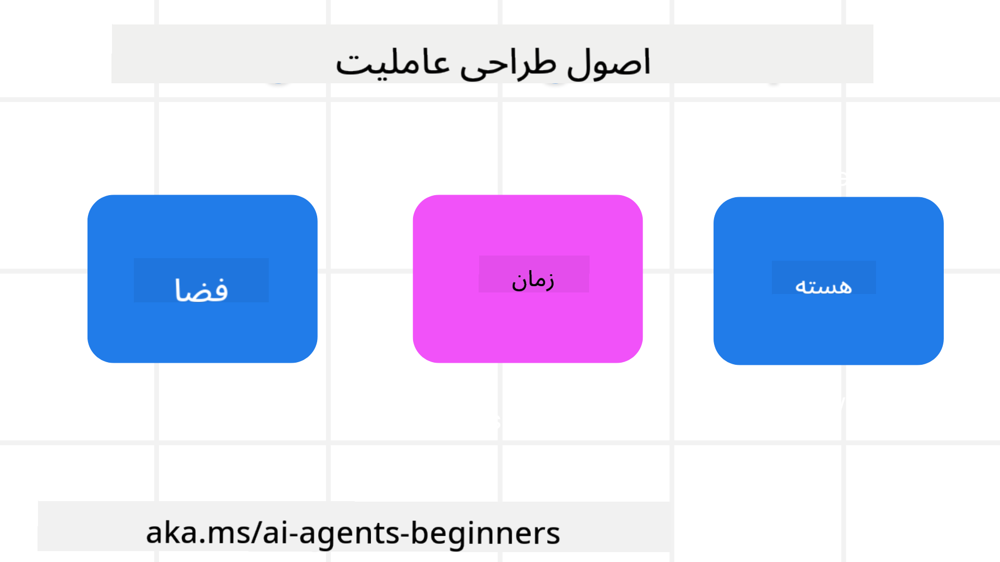

<!--
CO_OP_TRANSLATOR_METADATA:
{
  "original_hash": "4c46e4ff9e349c521e2b0b17f51afa64",
  "translation_date": "2025-08-30T07:41:16+00:00",
  "source_file": "03-agentic-design-patterns/README.md",
  "language_code": "fa"
}
-->

> _(برای مشاهده ویدئوی این درس روی تصویر بالا کلیک کنید)_
# اصول طراحی عامل‌های هوش مصنوعی

## مقدمه

راه‌های زیادی برای فکر کردن به ساخت سیستم‌های عامل هوش مصنوعی وجود دارد. با توجه به اینکه ابهام یک ویژگی است و نه یک نقص در طراحی هوش مصنوعی مولد، گاهی اوقات مهندسان در پیدا کردن نقطه شروع دچار مشکل می‌شوند. ما مجموعه‌ای از اصول طراحی تجربه کاربری انسان‌محور ایجاد کرده‌ایم تا به توسعه‌دهندگان کمک کنیم سیستم‌های عامل مشتری‌محور بسازند که نیازهای کسب‌وکارشان را حل کنند. این اصول طراحی یک معماری تجویزی نیستند، بلکه نقطه شروعی برای تیم‌هایی هستند که در حال تعریف و ساخت تجربه‌های عامل هستند.

به طور کلی، عامل‌ها باید:

- ظرفیت‌های انسانی را گسترش داده و مقیاس‌بندی کنند (مانند طوفان فکری، حل مسئله، خودکارسازی و غیره)
- شکاف‌های دانشی را پر کنند (مانند به‌روز کردن در حوزه‌های دانشی، ترجمه و غیره)
- همکاری را تسهیل کرده و از روش‌هایی که ما به عنوان افراد ترجیح می‌دهیم با دیگران کار کنیم، حمایت کنند
- ما را به نسخه‌های بهتری از خودمان تبدیل کنند (مانند مربی زندگی/مدیر وظایف، کمک به یادگیری مهارت‌های تنظیم احساسات و ذهن‌آگاهی، ایجاد تاب‌آوری و غیره)

## این درس شامل موارد زیر خواهد بود

- اصول طراحی عامل چیست
- چه دستورالعمل‌هایی باید هنگام اجرای این اصول طراحی رعایت شوند
- مثال‌هایی از استفاده از این اصول طراحی

## اهداف یادگیری

پس از تکمیل این درس، شما قادر خواهید بود:

1. توضیح دهید اصول طراحی عامل چیست
2. دستورالعمل‌های استفاده از اصول طراحی عامل را توضیح دهید
3. درک کنید چگونه یک عامل با استفاده از اصول طراحی عامل بسازید

## اصول طراحی عامل

### عامل (فضا)

این محیطی است که عامل در آن فعالیت می‌کند. این اصول نحوه طراحی عامل‌ها برای تعامل در جهان‌های فیزیکی و دیجیتال را اطلاع می‌دهند.

- **اتصال، نه فروپاشی** – کمک به اتصال افراد به دیگر افراد، رویدادها و دانش قابل اجرا برای تسهیل همکاری و ارتباط.
  - عامل‌ها به اتصال رویدادها، دانش و افراد کمک می‌کنند.
  - عامل‌ها افراد را به یکدیگر نزدیک‌تر می‌کنند. آن‌ها برای جایگزینی یا کوچک شمردن افراد طراحی نشده‌اند.
- **به راحتی قابل دسترس اما گاهی نامرئی** – عامل عمدتاً در پس‌زمینه فعالیت می‌کند و فقط زمانی که مرتبط و مناسب باشد ما را تحریک می‌کند.
  - عامل برای کاربران مجاز در هر دستگاه یا پلتفرمی به راحتی قابل کشف و دسترسی است.
  - عامل از ورودی‌ها و خروجی‌های چندوجهی (صدا، گفتار، متن و غیره) پشتیبانی می‌کند.
  - عامل می‌تواند به طور یکپارچه بین پیش‌زمینه و پس‌زمینه؛ بین فعال و واکنش‌پذیر، بسته به حس نیازهای کاربر، انتقال یابد.
  - عامل ممکن است به صورت نامرئی فعالیت کند، اما مسیر فرآیند پس‌زمینه و همکاری با سایر عامل‌ها برای کاربر شفاف و قابل کنترل است.

### عامل (زمان)

این نحوه عملکرد عامل در طول زمان است. این اصول نحوه طراحی عامل‌ها برای تعامل در گذشته، حال و آینده را اطلاع می‌دهند.

- **گذشته**: بازتاب تاریخ که شامل حالت و زمینه است.
  - عامل نتایج مرتبط‌تری بر اساس تحلیل داده‌های تاریخی غنی‌تر فراتر از فقط رویداد، افراد یا حالت‌ها ارائه می‌دهد.
  - عامل از رویدادهای گذشته ارتباط ایجاد کرده و فعالانه بر حافظه بازتاب می‌کند تا با موقعیت‌های فعلی تعامل کند.
- **اکنون**: تحریک بیشتر از اطلاع‌رسانی.
  - عامل رویکرد جامعی برای تعامل با افراد دارد. وقتی رویدادی رخ می‌دهد، عامل فراتر از اطلاع‌رسانی ایستا یا سایر رسمی‌های ایستا عمل می‌کند. عامل می‌تواند جریان‌ها را ساده کند یا نشانه‌هایی را به صورت پویا ایجاد کند تا توجه کاربر را در لحظه مناسب هدایت کند.
  - عامل اطلاعات را بر اساس محیط زمینه‌ای، تغییرات اجتماعی و فرهنگی و متناسب با قصد کاربر ارائه می‌دهد.
  - تعامل عامل می‌تواند تدریجی باشد، در طول زمان پیچیده‌تر شود تا کاربران را توانمند کند.
- **آینده**: تطبیق و تکامل.
  - عامل با دستگاه‌ها، پلتفرم‌ها و حالت‌های مختلف تطبیق می‌یابد.
  - عامل با رفتار کاربر، نیازهای دسترسی و قابلیت شخصی‌سازی آزادانه تطبیق می‌یابد.
  - عامل از طریق تعامل مداوم با کاربر شکل گرفته و تکامل می‌یابد.

### عامل (هسته)

این عناصر کلیدی در هسته طراحی یک عامل هستند.

- **پذیرش عدم قطعیت اما ایجاد اعتماد**.
  - سطحی از عدم قطعیت عامل انتظار می‌رود. عدم قطعیت یک عنصر کلیدی در طراحی عامل است.
  - اعتماد و شفافیت لایه‌های بنیادی طراحی عامل هستند.
  - انسان‌ها کنترل دارند که عامل روشن/خاموش باشد و وضعیت عامل در هر زمان به وضوح قابل مشاهده است.

## دستورالعمل‌های اجرای این اصول

هنگام استفاده از اصول طراحی قبلی، از دستورالعمل‌های زیر استفاده کنید:

1. **شفافیت**: به کاربر اطلاع دهید که هوش مصنوعی درگیر است، چگونه کار می‌کند (از جمله اقدامات گذشته) و چگونه بازخورد بدهد و سیستم را اصلاح کند.
2. **کنترل**: به کاربر امکان شخصی‌سازی، مشخص کردن ترجیحات و شخصی‌سازی، و کنترل سیستم و ویژگی‌های آن (از جمله توانایی فراموش کردن) را بدهید.
3. **ثبات**: هدف ایجاد تجربه‌های ثابت و چندوجهی در دستگاه‌ها و نقاط پایانی باشد. از عناصر آشنا UI/UX استفاده کنید (مانند آیکون میکروفون برای تعامل صوتی) و بار شناختی مشتری را تا حد ممکن کاهش دهید (مانند پاسخ‌های مختصر، کمک‌های بصری و محتوای «اطلاعات بیشتر»).

## چگونه یک عامل سفر با استفاده از این اصول و دستورالعمل‌ها طراحی کنیم

تصور کنید که در حال طراحی یک عامل سفر هستید، در اینجا نحوه استفاده از اصول طراحی و دستورالعمل‌ها آمده است:

1. **شفافیت** – به کاربر اطلاع دهید که عامل سفر یک عامل مجهز به هوش مصنوعی است. دستورالعمل‌های اولیه‌ای برای شروع ارائه دهید (مانند پیام «سلام»، نمونه درخواست‌ها). این موارد را به وضوح در صفحه محصول مستند کنید. لیست درخواست‌هایی که کاربر در گذشته پرسیده است را نشان دهید. مشخص کنید چگونه بازخورد بدهید (دکمه‌های پسندیدن و نپسندیدن، دکمه ارسال بازخورد و غیره). به وضوح بیان کنید اگر عامل محدودیت‌های استفاده یا موضوعی دارد.
2. **کنترل** – مطمئن شوید که کاربر می‌تواند عامل را پس از ایجاد با مواردی مانند درخواست سیستم اصلاح کند. به کاربر امکان انتخاب میزان تفصیل عامل، سبک نوشتاری آن و هر محدودیتی در مورد موضوعاتی که عامل نباید درباره آن‌ها صحبت کند را بدهید. به کاربر اجازه دهید فایل‌ها یا داده‌های مرتبط، درخواست‌ها و مکالمات گذشته را مشاهده و حذف کند.
3. **ثبات** – مطمئن شوید که آیکون‌های اشتراک‌گذاری درخواست، افزودن فایل یا عکس و برچسب‌گذاری کسی یا چیزی استاندارد و قابل تشخیص هستند. از آیکون گیره کاغذ برای نشان دادن بارگذاری/اشتراک‌گذاری فایل با عامل و از آیکون تصویر برای نشان دادن بارگذاری گرافیک استفاده کنید.

### سوالات بیشتری درباره الگوهای طراحی عامل هوش مصنوعی دارید؟

به [Discord Azure AI Foundry](https://aka.ms/ai-agents/discord) بپیوندید تا با دیگر یادگیرندگان ملاقات کنید، در ساعات اداری شرکت کنید و سوالات خود درباره عامل‌های هوش مصنوعی را پاسخ دهید.

## منابع اضافی

## درس قبلی

[بررسی چارچوب‌های عامل](../02-explore-agentic-frameworks/README.md)

## درس بعدی

[الگوی طراحی استفاده از ابزار](../04-tool-use/README.md)

---

**سلب مسئولیت**:  
این سند با استفاده از سرویس ترجمه هوش مصنوعی [Co-op Translator](https://github.com/Azure/co-op-translator) ترجمه شده است. در حالی که ما تلاش می‌کنیم دقت را حفظ کنیم، لطفاً توجه داشته باشید که ترجمه‌های خودکار ممکن است شامل خطاها یا نادرستی‌ها باشند. سند اصلی به زبان اصلی آن باید به عنوان منبع معتبر در نظر گرفته شود. برای اطلاعات حساس، توصیه می‌شود از ترجمه حرفه‌ای انسانی استفاده کنید. ما مسئولیتی در قبال سوءتفاهم‌ها یا تفسیرهای نادرست ناشی از استفاده از این ترجمه نداریم.