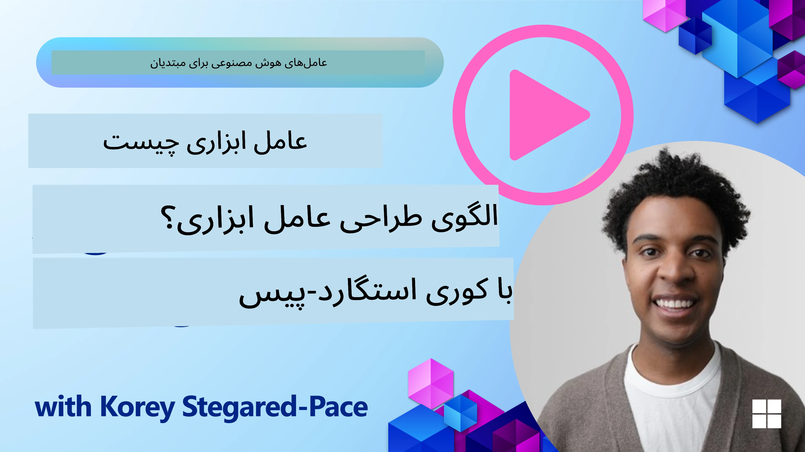
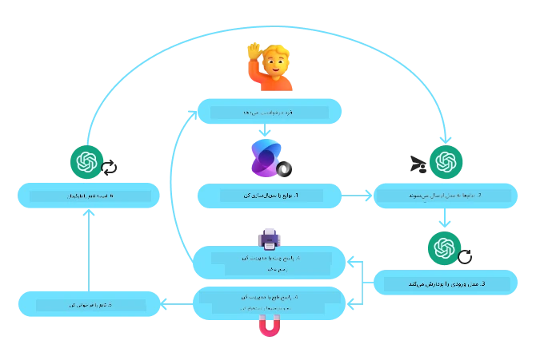
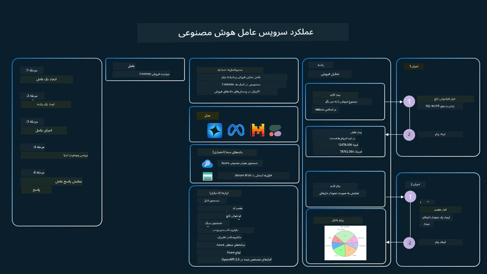

[](https://youtu.be/vieRiPRx-gI?si=cEZ8ApnT6Sus9rhn)

> _(برای مشاهده ویدئوی این درس روی تصویر بالا کلیک کنید)_

# الگوی طراحی استفاده از ابزار

ابزارها جالب هستند زیرا به عوامل هوش مصنوعی امکان می‌دهند قابلیت‌های گسترده‌تری داشته باشند. به جای اینکه عامل مجموعه محدودی از عملیات قابل انجام داشته باشد، با افزودن یک ابزار، عامل می‌تواند طیف گسترده‌ای از عملیات را انجام دهد. در این فصل، به الگوی طراحی استفاده از ابزار نگاه خواهیم کرد که توصیف می‌کند چگونه عوامل هوش مصنوعی می‌توانند از ابزارهای خاص برای دستیابی به اهداف خود استفاده کنند.

## مقدمه

در این درس، قصد داریم به سوالات زیر پاسخ دهیم:

- الگوی طراحی استفاده از ابزار چیست؟
- در چه مواردی می‌توان از آن استفاده کرد؟
- عناصر/بلوک‌های ساختمانی مورد نیاز برای پیاده‌سازی این الگو چیست؟
- ملاحظات ویژه برای استفاده از الگوی طراحی استفاده از ابزار جهت ساخت عوامل هوش مصنوعی قابل اعتماد چیست؟

## اهداف یادگیری

پس از اتمام این درس، خواهید توانست:

- تعریف الگوی طراحی استفاده از ابزار و هدف آن را بیان کنید.
- موارد کاربردی که الگوی طراحی استفاده از ابزار در آن‌ها قابل اعمال است را شناسایی کنید.
- عناصر کلیدی لازم برای پیاده‌سازی این الگو را درک کنید.
- ملاحظات مربوط به اطمینان از اعتمادپذیری عوامل هوش مصنوعی با استفاده از این الگو را تشخیص دهید.

## الگوی طراحی استفاده از ابزار چیست؟

**الگوی طراحی استفاده از ابزار** بر روی دادن توانایی تعامل با ابزارهای خارجی به مدل‌های زبان بزرگ (LLM) متمرکز است تا به اهداف خاصی دست یابند. ابزارها کدهایی هستند که توسط عامل برای انجام عملیات اجرا می‌شوند. یک ابزار می‌تواند تابع ساده‌ای مانند ماشین حساب باشد یا فراخوانی API به سرویس ثالث مانند جستجوی قیمت سهام یا پیش‌بینی هوا. در زمینه عوامل هوش مصنوعی، ابزارها به گونه‌ای طراحی شده‌اند که توسط عوامل در پاسخ به **فراخوانی‌های تابع تولیدشده توسط مدل** اجرا شوند.

## در چه مواردی می‌توان از آن استفاده کرد؟

عوامل هوش مصنوعی می‌توانند از ابزارها برای انجام کارهای پیچیده، بازیابی اطلاعات یا اتخاذ تصمیم‌ها بهره گیرند. الگوی طراحی استفاده از ابزار اغلب در سناریوهایی استفاده می‌شود که تعامل پویا با سیستم‌های خارجی مانند پایگاه داده‌ها، سرویس‌های وب یا مفسرهای کد نیاز است. این توانایی برای موارد مختلف زیر مفید است:

- **بازیابی دینامیک اطلاعات:** عوامل می‌توانند APIهای خارجی یا پایگاه داده‌ها را برای دریافت داده‌های به‌روز (مثلاً جستجوی در پایگاه داده SQLite برای تحلیل داده، دریافت قیمت سهام یا اطلاعات هواشناسی) پرس‌وجو کنند.
- **اجرای کد و تفسیر:** عوامل می‌توانند کد یا اسکریپت اجرا کنند تا مسائل ریاضی حل کنند، گزارش تولید نمایند یا شبیه‌سازی انجام دهند.
- **خودکارسازی گردش کار:** خودکارسازی گردش‌های کاری تکراری یا چند مرحله‌ای با ادغام ابزارهایی مانند برنامه‌ریزهای وظیفه، سرویس‌های ایمیل یا خط لوله داده‌ها.
- **پشتیبانی مشتری:** عوامل می‌توانند با سیستم‌های مدیریت ارتباط با مشتری (CRM)، پلتفرم‌های تیکتینگ یا پایگاه‌های دانش تعامل داشته باشند تا پرسش‌های کاربران را حل کنند.
- **تولید و ویرایش محتوا:** عوامل می‌توانند از ابزارهایی مانند بررسی گرامر، خلاصه‌ساز متن، یا ارزیاب ایمنی محتوا برای کمک به وظایف تولید محتوا استفاده کنند.

## عناصر/بلوک‌های ساختمانی لازم برای پیاده‌سازی الگوی طراحی استفاده از ابزار کدامند؟

این بلوک‌ها به عامل هوش مصنوعی اجازه می‌دهند طیف گسترده‌ای از کارها را انجام دهد. بیایید عناصر کلیدی لازم برای پیاده‌سازی الگوی طراحی استفاده از ابزار را بررسی کنیم:

- **اسکیمای توابع/ابزارها:** تعریفات دقیق ابزارهای موجود، شامل نام تابع، هدف، پارامترهای لازم و خروجی‌های مورد انتظار. این اسکیم‌ها به LLM کمک می‌کنند بفهمد چه ابزارهایی در دسترس هستند و چگونه درخواست‌های صحیح بسازد.

- **منطق اجرای تابع:** تعیین می‌کند چه زمانی و چگونه ابزارها بر اساس قصد کاربر و زمینه مکالمه فراخوانی شوند. ممکن است شامل ماژول‌های برنامه‌ریز، مکانیزم‌های مسیریابی یا جریان‌های شرطی باشد که استفاده از ابزار را به صورت دینامیک کنترل می‌کنند.

- **سیستم مدیریت پیام:** اجزایی که جریان مکالمه بین ورودی‌های کاربر، پاسخ‌های LLM، فراخوانی‌های ابزار و خروجی‌های ابزار را مدیریت می‌کنند.

- **چارچوب یکپارچه‌سازی ابزار:** زیرساختی که عامل را به ابزارهای مختلف، چه توابع ساده و چه سرویس‌های خارجی پیچیده متصل می‌کند.

- **مدیریت خطا و اعتبارسنجی:** مکانیزمی برای مدیریت خطاهای اجرای ابزار، اعتبارسنجی پارامترها و مدیریت پاسخ‌های غیرمنتظره.

- **مدیریت وضعیت:** دنبال کردن زمینه مکالمه، تعاملات قبلی با ابزار و داده‌های پایدار برای تضمین هماهنگی در تعاملات چند مرحله‌ای.

در ادامه، به جزئیات بیشتری درباره فراخوانی تابع/ابزار می‌پردازیم.

### فراخوانی تابع/ابزار

فراخوانی تابع روش اصلی است که به مدل‌های زبان بزرگ (LLM) اجازه می‌دهد با ابزارها تعامل داشته باشند. اغلب مشاهده می‌کنید که «تابع» و «ابزار» به جای هم استفاده می‌شوند چون «توابع» (بلوک‌های کد قابل استفاده مجدد) همان «ابزار»هایی هستند که عوامل برای انجام کارها به کار می‌برند. برای اینکه کد یک تابع اجرا شود، LLM باید درخواست کاربر را با توضیحات توابع مقایسه کند. برای این هدف، اسکیمایی شامل توضیحات همه توابع موجود به LLM ارسال می‌شود. سپس LLM تابع مناسب‌ترین برای کار را انتخاب کرده و نام و آرگومان‌هایش را بازمی‌گرداند. تابع انتخاب‌شده اجرا می‌شود، پاسخ آن به LLM فرستاده می‌شود که از آن برای پاسخ به درخواست کاربر استفاده می‌کند.

برای توسعه‌دهندگان جهت پیاده‌سازی فراخوانی تابع برای عوامل، نیاز دارید به:

1. مدلی از LLM که فراخوانی تابع را پشتیبانی کند
2. اسکیمایی شامل توضیحات توابع
3. کد مربوط به هر تابع توصیف‌شده

بیایید با مثال گرفتن زمان جاری در یک شهر این موضوع را توضیح دهیم:

1. **راه‌اندازی یک LLM که فراخوانی تابع را پشتیبانی کند:**

    همه مدل‌ها این قابلیت را ندارند، پس مهم است بررسی کنید LLM شما پشتیبانی می‌کند یا خیر. <a href="https://learn.microsoft.com/azure/ai-services/openai/how-to/function-calling" target="_blank">Azure OpenAI</a> این قابلیت را دارد. می‌توانیم با راه‌اندازی کلاینت Azure OpenAI شروع کنیم.

    ```python
    # مقداردهی اولیه کلاینت Azure OpenAI
    client = AzureOpenAI(
        azure_endpoint = os.getenv("AZURE_AI_PROJECT_ENDPOINT"), 
        api_key=os.getenv("AZURE_OPENAI_API_KEY"),  
        api_version="2024-05-01-preview"
    )
    ```
  
1. **ایجاد اسکیمای تابع:**

    در ادامه یک اسکیمای JSON تعریف خواهیم کرد که شامل نام تابع، توضیح عملکرد تابع و نام‌ها و توضیحات پارامترهای آن است. سپس این اسکیم را به کلاینت ساخته شده قبلی می‌دهیم همراه با درخواست کاربر برای یافتن زمان در سان‌فرانسیسکو. نکته مهم اینکه **فراخوانی یک ابزار** برگشت داده می‌شود، **نه** پاسخ نهایی سوال. همان‌طور که قبلاً گفته شد، LLM نام تابع انتخاب‌شده و آرگومان‌هایی که به آن می‌رود را بازمی‌گرداند.

    ```python
    # توضیحات تابع برای خواندن مدل
    tools = [
        {
            "type": "function",
            "function": {
                "name": "get_current_time",
                "description": "Get the current time in a given location",
                "parameters": {
                    "type": "object",
                    "properties": {
                        "location": {
                            "type": "string",
                            "description": "The city name, e.g. San Francisco",
                        },
                    },
                    "required": ["location"],
                },
            }
        }
    ]
    ```
   
    ```python
  
    # پیام اولیه کاربر
    messages = [{"role": "user", "content": "What's the current time in San Francisco"}] 
  
    # اولین فراخوانی API: درخواست از مدل برای استفاده از تابع
      response = client.chat.completions.create(
          model=deployment_name,
          messages=messages,
          tools=tools,
          tool_choice="auto",
      )
  
      # پردازش پاسخ مدل
      response_message = response.choices[0].message
      messages.append(response_message)
  
      print("Model's response:")  

      print(response_message)
  
    ```

    ```bash
    Model's response:
    ChatCompletionMessage(content=None, role='assistant', function_call=None, tool_calls=[ChatCompletionMessageToolCall(id='call_pOsKdUlqvdyttYB67MOj434b', function=Function(arguments='{"location":"San Francisco"}', name='get_current_time'), type='function')])
    ```
  
1. **کد تابع لازم برای انجام کار:**

    حال که LLM تابع اجرا شونده را انتخاب کرد، کد اجرای کار باید نوشته و اجرا شود. می‌توانیم کد گرفتن زمان فعلی را به زبان پایتون پیاده کنیم. همچنین باید کدی برای استخراج نام و آرگومان‌ها از response_message نوشته شود تا نتیجه نهایی گرفته شود.

    ```python
      def get_current_time(location):
        """Get the current time for a given location"""
        print(f"get_current_time called with location: {location}")  
        location_lower = location.lower()
        
        for key, timezone in TIMEZONE_DATA.items():
            if key in location_lower:
                print(f"Timezone found for {key}")  
                current_time = datetime.now(ZoneInfo(timezone)).strftime("%I:%M %p")
                return json.dumps({
                    "location": location,
                    "current_time": current_time
                })
      
        print(f"No timezone data found for {location_lower}")  
        return json.dumps({"location": location, "current_time": "unknown"})
    ```

     ```python
     # مدیریت فراخوانی‌های تابع
      if response_message.tool_calls:
          for tool_call in response_message.tool_calls:
              if tool_call.function.name == "get_current_time":
     
                  function_args = json.loads(tool_call.function.arguments)
     
                  time_response = get_current_time(
                      location=function_args.get("location")
                  )
     
                  messages.append({
                      "tool_call_id": tool_call.id,
                      "role": "tool",
                      "name": "get_current_time",
                      "content": time_response,
                  })
      else:
          print("No tool calls were made by the model.")  
  
      # دومین فراخوانی API: دریافت پاسخ نهایی از مدل
      final_response = client.chat.completions.create(
          model=deployment_name,
          messages=messages,
      )
  
      return final_response.choices[0].message.content
     ```

     ```bash
      get_current_time called with location: San Francisco
      Timezone found for san francisco
      The current time in San Francisco is 09:24 AM.
     ```

فراخوانی تابع در هسته بیشتر، اگر نگوییم تمام، طراحی استفاده از ابزار عامل‌ها قرار دارد، ولی پیاده‌سازی آن از صفر گاهی چالش‌برانگیز است. همان‌طور که در [درس ۲](../../../02-explore-agentic-frameworks) آموختیم، چارچوب‌های عامل‌محور بلوک‌های ساختمانی آماده‌ای برای پیاده‌سازی استفاده از ابزار فراهم می‌کنند.

## نمونه‌های استفاده از ابزار با چارچوب‌های عامل‌محور

اینجا چند مثال از پیاده‌سازی الگوی طراحی استفاده از ابزار با چارچوب‌های عامل‌محور مختلف آمده است:

### چارچوب عامل مایکروسافت

<a href="https://learn.microsoft.com/azure/ai-services/agents/overview" target="_blank">چارچوب عامل مایکروسافت</a> یک چارچوب هوش مصنوعی متن‌باز برای ساخت عوامل هوش مصنوعی است. این چارچوب فرایند استفاده از فراخوانی توابع را ساده می‌کند و به شما اجازه می‌دهد ابزارها را به شکل توابع پایتون با دکوراتور `@tool` تعریف کنید. این چارچوب ارتباط رفت و برگشتی بین مدل و کد شما را مدیریت می‌کند. همچنین دسترسی به ابزارهای آماده‌ای مانند جستجوی فایل و مفسر کد از طریق `AzureAIProjectAgentProvider` فراهم می‌کند.

نمودار زیر فرایند فراخوانی تابع با چارچوب عامل مایکروسافت را نشان می‌دهد:



در چارچوب عامل مایکروسافت، ابزارها به صورت توابع دکوراتور شده تعریف می‌شوند. می‌توانیم تابع `get_current_time` را که قبلاً دیدیم با استفاده از دکوراتور `@tool` به ابزار تبدیل کنیم. چارچوب به طور خودکار تابع و پارامترهای آن را سریال‌سازی کرده و اسکیمای ارسال به LLM را ایجاد می‌کند.

```python
from agent_framework import tool
from agent_framework.azure import AzureAIProjectAgentProvider
from azure.identity import AzureCliCredential

@tool
def get_current_time(location: str) -> str:
    """Get the current time for a given location"""
    ...

# مشتری را ایجاد کنید
provider = AzureAIProjectAgentProvider(credential=AzureCliCredential())

# یک نماینده ایجاد کنید و با ابزار اجرا کنید
agent = await provider.create_agent(name="TimeAgent", instructions="Use available tools to answer questions.", tools=get_current_time)
response = await agent.run("What time is it?")
```
  
### سرویس عامل هوش مصنوعی Azure

<a href="https://learn.microsoft.com/azure/ai-services/agents/overview" target="_blank">سرویس عامل هوش مصنوعی Azure</a> چارچوب عاملی جدیدتر است که برای توانمندسازی توسعه‌دهندگان جهت ساخت، استقرار و مقیاس‌دهی امن، با کیفیت و قابل توسعه عوامل هوش مصنوعی طراحی شده بدون نیاز به مدیریت منابع محاسباتی و ذخیره‌سازی زیرساخت. این سرویس به ویژه برای برنامه‌های سازمانی مفید است چون سرویس کاملاً مدیریت‌شده با امنیت سازمانی ارائه می‌دهد.

در مقایسه با توسعه مستقیم با API مدل زبان بزرگ، سرویس عامل هوش مصنوعی Azure مزایای زیر را فراهم می‌کند:

- فراخوانی خودکار ابزار – نیازی به تجزیه فراخوانی ابزار، اجرای آن و مدیریت پاسخ نیست؛ همه این‌ها اکنون سروری انجام می‌شود
- مدیریت امن داده‌ها – به جای مدیریت حالت مکالمه خود، می‌توانید روی ریسمان‌ها (threads) برای ذخیره همه اطلاعات مورد نیاز حساب کنید
- ابزارهای آماده استفاده – ابزارهایی برای تعامل با منابع داده، مانند Bing، جستجوی Azure AI و Azure Functions

ابزارهای موجود در سرویس عامل هوش مصنوعی Azure به دو دسته تقسیم می‌شوند:

1. ابزارهای دانش:
    - <a href="https://learn.microsoft.com/azure/ai-services/agents/how-to/tools/bing-grounding?tabs=python&pivots=overview" target="_blank">ارتباط با جستجوی Bing</a>
    - <a href="https://learn.microsoft.com/azure/ai-services/agents/how-to/tools/file-search?tabs=python&pivots=overview" target="_blank">جستجوی فایل</a>
    - <a href="https://learn.microsoft.com/azure/ai-services/agents/how-to/tools/azure-ai-search?tabs=azurecli%2Cpython&pivots=overview-azure-ai-search" target="_blank">جستجوی Azure AI</a>

2. ابزارهای عملیاتی:
    - <a href="https://learn.microsoft.com/azure/ai-services/agents/how-to/tools/function-calling?tabs=python&pivots=overview" target="_blank">فراخوانی تابع</a>
    - <a href="https://learn.microsoft.com/azure/ai-services/agents/how-to/tools/code-interpreter?tabs=python&pivots=overview" target="_blank">مفسر کد</a>
    - <a href="https://learn.microsoft.com/azure/ai-services/agents/how-to/tools/openapi-spec?tabs=python&pivots=overview" target="_blank">ابزارهای تعریف‌شده با OpenAPI</a>
    - <a href="https://learn.microsoft.com/azure/ai-services/agents/how-to/tools/azure-functions?pivots=overview" target="_blank">توابع Azure</a>

سرویس عامل به ما امکان می‌دهد این ابزارها را به صورت یک `toolset` (مجموعه ابزار) کنار هم استفاده کنیم. همچنین از `threads` استفاده می‌کند که تاریخچه پیام‌های یک مکالمه خاص را ذخیره می‌کنند.

تصور کنید شما یک نماینده فروش در شرکت Contoso هستید. می‌خواهید یک عامل گفتگویی بسازید که بتواند به سوالات درباره داده‌های فروش شما پاسخ دهد.

تصویر زیر نشان می‌دهد که چگونه می‌توانید با استفاده از سرویس عامل هوش مصنوعی Azure داده‌های فروش خود را تحلیل کنید:



برای استفاده از هر یک از این ابزارها با این سرویس، می‌توانیم یک کلاینت ایجاد کرده و یک ابزار یا مجموعه‌ای از ابزارها تعریف کنیم. برای پیاده‌سازی عملی، می‌توانیم از کد پایتون زیر استفاده کنیم. LLM قادر خواهد بود به مجموعه ابزار نگاه کرده و تصمیم بگیرد که تابع ایجاد شده توسط کاربر `fetch_sales_data_using_sqlite_query` را استفاده کند یا مفسر کد آماده، بسته به درخواست کاربر.

```python 
import os
from azure.ai.projects import AIProjectClient
from azure.identity import DefaultAzureCredential
from fetch_sales_data_functions import fetch_sales_data_using_sqlite_query # تابع fetch_sales_data_using_sqlite_query که در فایل fetch_sales_data_functions.py یافت می‌شود.
from azure.ai.projects.models import ToolSet, FunctionTool, CodeInterpreterTool

project_client = AIProjectClient.from_connection_string(
    credential=DefaultAzureCredential(),
    conn_str=os.environ["PROJECT_CONNECTION_STRING"],
)

# مقداردهی اولیه مجموعه ابزار
toolset = ToolSet()

# مقداردهی اولیه عامل فراخوانی تابع با استفاده از تابع fetch_sales_data_using_sqlite_query و افزودن آن به مجموعه ابزار
fetch_data_function = FunctionTool(fetch_sales_data_using_sqlite_query)
toolset.add(fetch_data_function)

# مقداردهی اولیه ابزار مفسر کد و افزودن آن به مجموعه ابزار.
code_interpreter = code_interpreter = CodeInterpreterTool()
toolset.add(code_interpreter)

agent = project_client.agents.create_agent(
    model="gpt-4o-mini", name="my-agent", instructions="You are helpful agent", 
    toolset=toolset
)
```

## ملاحظات ویژه برای استفاده از الگوی طراحی استفاده از ابزار در ساخت عوامل هوش مصنوعی قابل اعتماد چیست؟

یک نگرانی رایج درباره SQL تولید شده به صورت داینامیک توسط LLMها امنیت است، خصوصاً خطر حملات تزریق SQL یا اقدامات مخرب مانند حذف یا دستکاری پایگاه داده. گرچه این نگرانی‌ها معتبرند، اما می‌توان با تنظیم صحیح مجوزهای دسترسی پایگاه داده به طور مؤثری آن‌ها را کاهش داد. برای بیشتر پایگاه‌های داده این به معنی پیکربندی حالت فقط خواندنی است. برای سرویس‌های پایگاه داده مانند PostgreSQL یا Azure SQL، به اپلیکیشن باید نقش فقط خواندنی (SELECT) داده شود.

اجرای اپلیکیشن در محیطی امن حفاظت را تقویت می‌کند. در سناریوهای سازمانی معمولاً داده‌ها از سیستم‌های عملیاتی استخراج و تبدیل شده و در پایگاه داده یا انبار داده فقط خواندنی با اسکیمای کاربرپسند ذخیره می‌شوند. این رویکرد تضمین می‌کند که داده‌ها ایمن، بهینه برای عملکرد و دسترسی هستند و اپلیکیشن دسترسی محدود و فقط خواندنی دارد.

## کدهای نمونه

- پایتون: [چارچوب عامل](./code_samples/04-python-agent-framework.ipynb)
- .NET: [چارچوب عامل](./code_samples/04-dotnet-agent-framework.md)

## سوالات بیشتری دارید درباره الگوی طراحی استفاده از ابزار؟

به [Microsoft Foundry Discord](https://aka.ms/ai-agents/discord) بپیوندید تا با سایر یادگیرندگان ملاقات کنید، در ساعت‌های اداری شرکت کنید و سوالات خود درباره عوامل هوش مصنوعی را پاسخ بگیرید.

## منابع بیشتر

- <a href="https://microsoft.github.io/build-your-first-agent-with-azure-ai-agent-service-workshop/" target="_blank">کارگاه سرویس عوامل هوش مصنوعی Azure</a>
- <a href="https://github.com/Azure-Samples/contoso-creative-writer/tree/main/docs/workshop" target="_blank">کارگاه نویسنده خلاق Contoso با چند عامل</a>
- <a href="https://learn.microsoft.com/azure/ai-services/agents/overview" target="_blank">مروری بر چارچوب عامل مایکروسافت</a>

## درس قبلی

[درک الگوهای طراحی عامل‌محور](../03-agentic-design-patterns/README.md)

## درس بعدی
[رنک بازیابی عاملی](../05-agentic-rag/README.md)

---

<!-- CO-OP TRANSLATOR DISCLAIMER START -->
**توضیح مهم**:  
این سند با استفاده از سرویس ترجمه هوش مصنوعی [Co-op Translator](https://github.com/Azure/co-op-translator) ترجمه شده است. در حالی که تلاش می‌کنیم ترجمه دقیق باشد، لطفاً توجه داشته باشید که ترجمه‌های خودکار ممکن است شامل اشتباهات یا نواقصی باشند. سند اصلی به زبان بومی خود باید منبع معتبر در نظر گرفته شود. برای اطلاعات حیاتی، توصیه می‌شود از ترجمه حرفه‌ای انسانی استفاده شود. ما مسئول هیچ گونه سوء تفاهم یا تفسیر نادرست ناشی از استفاده از این ترجمه نیستیم.
<!-- CO-OP TRANSLATOR DISCLAIMER END -->