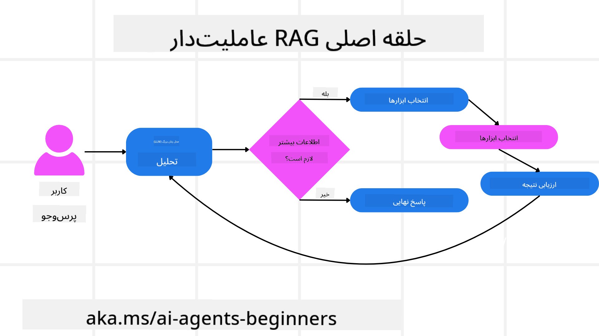
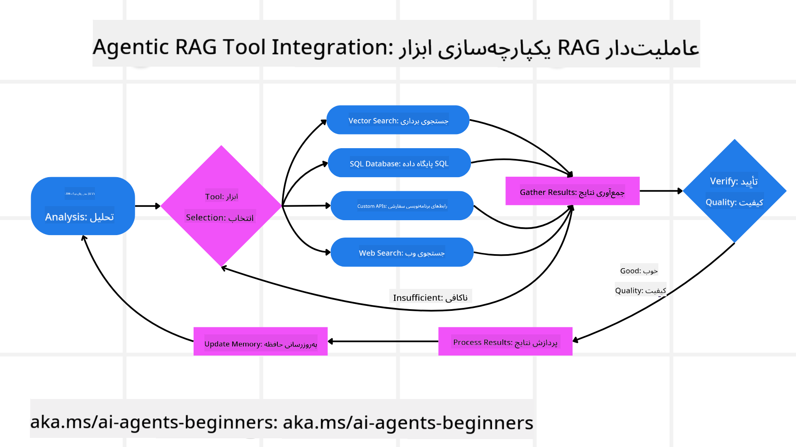
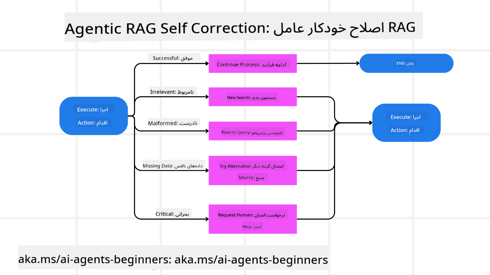
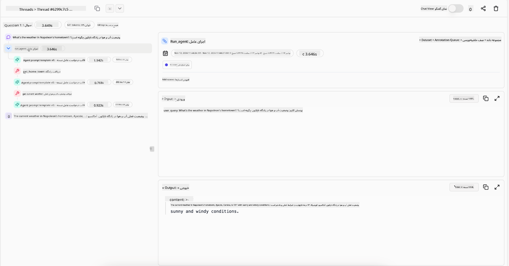

<!--
CO_OP_TRANSLATOR_METADATA:
{
  "original_hash": "d2f04b783b9e1253100329afd698f8ff",
  "translation_date": "2025-08-30T07:37:40+00:00",
  "source_file": "05-agentic-rag/README.md",
  "language_code": "fa"
}
-->

> _(برای مشاهده ویدئوی این درس، روی تصویر بالا کلیک کنید)_

# Agentic RAG

این درس یک مرور جامع از "تولید تقویت‌شده با بازیابی عامل‌محور" (Agentic RAG) ارائه می‌دهد، یک پارادایم نوظهور در هوش مصنوعی که در آن مدل‌های زبانی بزرگ (LLMs) به‌طور خودکار گام‌های بعدی خود را برنامه‌ریزی می‌کنند و اطلاعات را از منابع خارجی استخراج می‌کنند. برخلاف الگوهای ایستا که ابتدا بازیابی و سپس خواندن انجام می‌دهند، Agentic RAG شامل فراخوانی‌های تکراری به LLM است که با استفاده از ابزارها یا توابع و خروجی‌های ساختاریافته همراه می‌شود. سیستم نتایج را ارزیابی می‌کند، پرس‌وجوها را اصلاح می‌کند، در صورت نیاز ابزارهای اضافی را فراخوانی می‌کند و این چرخه را تا رسیدن به یک راه‌حل رضایت‌بخش ادامه می‌دهد.

## مقدمه

این درس شامل موارد زیر است:

- **درک Agentic RAG:** آشنایی با پارادایم نوظهور در هوش مصنوعی که در آن مدل‌های زبانی بزرگ (LLMs) به‌طور خودکار گام‌های بعدی خود را برنامه‌ریزی می‌کنند و اطلاعات را از منابع داده خارجی استخراج می‌کنند.
- **فهم سبک تکراری Maker-Checker:** درک چرخه فراخوانی‌های تکراری به LLM که با استفاده از ابزارها یا توابع و خروجی‌های ساختاریافته همراه است، با هدف بهبود صحت و مدیریت پرس‌وجوهای نادرست.
- **بررسی کاربردهای عملی:** شناسایی سناریوهایی که در آن‌ها Agentic RAG عملکرد برجسته‌ای دارد، مانند محیط‌های مبتنی بر صحت، تعاملات پیچیده با پایگاه‌های داده، و جریان‌های کاری طولانی‌مدت.

## اهداف یادگیری

پس از اتمام این درس، شما قادر خواهید بود:

- **درک Agentic RAG:** آشنایی با پارادایم نوظهور در هوش مصنوعی که در آن مدل‌های زبانی بزرگ (LLMs) به‌طور خودکار گام‌های بعدی خود را برنامه‌ریزی می‌کنند و اطلاعات را از منابع داده خارجی استخراج می‌کنند.
- **سبک تکراری Maker-Checker:** درک مفهوم چرخه فراخوانی‌های تکراری به LLM که با استفاده از ابزارها یا توابع و خروجی‌های ساختاریافته همراه است، با هدف بهبود صحت و مدیریت پرس‌وجوهای نادرست.
- **مالکیت فرآیند استدلال:** درک توانایی سیستم در مالکیت فرآیند استدلال خود، تصمیم‌گیری در مورد نحوه برخورد با مشکلات بدون تکیه بر مسیرهای از پیش تعریف‌شده.
- **جریان کاری:** درک نحوه تصمیم‌گیری مستقل مدل عامل‌محور برای بازیابی گزارش‌های روند بازار، شناسایی داده‌های رقبا، همبستگی معیارهای فروش داخلی، ترکیب یافته‌ها، و ارزیابی استراتژی.
- **حلقه‌های تکراری، یکپارچه‌سازی ابزار و حافظه:** آشنایی با وابستگی سیستم به الگوی تعامل حلقه‌ای، حفظ وضعیت و حافظه در مراحل مختلف برای جلوگیری از حلقه‌های تکراری و اتخاذ تصمیمات آگاهانه.
- **مدیریت حالت‌های شکست و خوداصلاحی:** بررسی مکانیسم‌های خوداصلاحی قوی سیستم، از جمله تکرار و پرس‌وجوی مجدد، استفاده از ابزارهای تشخیصی، و تکیه بر نظارت انسانی در صورت نیاز.
- **مرزهای عاملیت:** درک محدودیت‌های Agentic RAG، با تمرکز بر خودمختاری خاص دامنه، وابستگی به زیرساخت‌ها، و احترام به محدودیت‌ها.
- **موارد استفاده عملی و ارزش:** شناسایی سناریوهایی که در آن‌ها Agentic RAG عملکرد برجسته‌ای دارد، مانند محیط‌های مبتنی بر صحت، تعاملات پیچیده با پایگاه‌های داده، و جریان‌های کاری طولانی‌مدت.
- **حاکمیت، شفافیت و اعتماد:** آشنایی با اهمیت حاکمیت و شفافیت، از جمله استدلال قابل توضیح، کنترل تعصب، و نظارت انسانی.

## Agentic RAG چیست؟

"تولید تقویت‌شده با بازیابی عامل‌محور" (Agentic RAG) یک پارادایم نوظهور در هوش مصنوعی است که در آن مدل‌های زبانی بزرگ (LLMs) به‌طور خودکار گام‌های بعدی خود را برنامه‌ریزی می‌کنند و اطلاعات را از منابع خارجی استخراج می‌کنند. برخلاف الگوهای ایستا که ابتدا بازیابی و سپس خواندن انجام می‌دهند، Agentic RAG شامل فراخوانی‌های تکراری به LLM است که با استفاده از ابزارها یا توابع و خروجی‌های ساختاریافته همراه می‌شود. سیستم نتایج را ارزیابی می‌کند، پرس‌وجوها را اصلاح می‌کند، در صورت نیاز ابزارهای اضافی را فراخوانی می‌کند و این چرخه را تا رسیدن به یک راه‌حل رضایت‌بخش ادامه می‌دهد.

این سبک تکراری "سازنده-بازبین" برای بهبود صحت، مدیریت پرس‌وجوهای نادرست، و اطمینان از نتایج باکیفیت طراحی شده است. سیستم به‌طور فعال فرآیند استدلال خود را مدیریت می‌کند، پرس‌وجوهای ناموفق را بازنویسی می‌کند، روش‌های بازیابی مختلف را انتخاب می‌کند، و ابزارهای متعددی مانند جستجوی برداری در Azure AI Search، پایگاه‌های داده SQL، یا APIهای سفارشی را ادغام می‌کند تا پاسخ نهایی خود را ارائه دهد. کیفیت متمایز یک سیستم عامل‌محور توانایی آن در مدیریت فرآیند استدلال خود است. برخلاف پیاده‌سازی‌های سنتی RAG که به مسیرهای از پیش تعریف‌شده متکی هستند، یک سیستم عامل‌محور به‌طور مستقل توالی گام‌ها را بر اساس کیفیت اطلاعاتی که پیدا می‌کند تعیین می‌کند.

## تعریف تولید تقویت‌شده با بازیابی عامل‌محور (Agentic RAG)

"تولید تقویت‌شده با بازیابی عامل‌محور" (Agentic RAG) یک پارادایم نوظهور در توسعه هوش مصنوعی است که در آن مدل‌های زبانی بزرگ (LLMs) نه تنها اطلاعات را از منابع داده خارجی استخراج می‌کنند، بلکه به‌طور خودکار گام‌های بعدی خود را برنامه‌ریزی می‌کنند. برخلاف الگوهای ایستا که ابتدا بازیابی و سپس خواندن انجام می‌دهند یا توالی‌های دستوری از پیش تعریف‌شده، Agentic RAG شامل یک چرخه فراخوانی‌های تکراری به LLM است که با استفاده از ابزارها یا توابع و خروجی‌های ساختاریافته همراه می‌شود. در هر مرحله، سیستم نتایج به‌دست‌آمده را ارزیابی می‌کند، تصمیم می‌گیرد که آیا پرس‌وجوها را اصلاح کند، ابزارهای اضافی را فراخوانی کند، و این چرخه را ادامه می‌دهد تا به یک راه‌حل رضایت‌بخش برسد.

این سبک تکراری "سازنده-بازبین" برای بهبود صحت، مدیریت پرس‌وجوهای نادرست به پایگاه‌های داده ساختاریافته (مانند NL2SQL)، و اطمینان از نتایج متعادل و باکیفیت طراحی شده است. به‌جای تکیه صرف بر زنجیره‌های دستوری پیچیده، سیستم به‌طور فعال فرآیند استدلال خود را مدیریت می‌کند. این سیستم می‌تواند پرس‌وجوهای ناموفق را بازنویسی کند، روش‌های بازیابی مختلف را انتخاب کند، و ابزارهای متعددی مانند جستجوی برداری در Azure AI Search، پایگاه‌های داده SQL، یا APIهای سفارشی را ادغام کند تا پاسخ نهایی خود را ارائه دهد. این رویکرد نیاز به چارچوب‌های ارکستراسیون پیچیده را از بین می‌برد. در عوض، یک حلقه نسبتاً ساده از "فراخوانی LLM → استفاده از ابزار → فراخوانی LLM → ..." می‌تواند خروجی‌های پیچیده و مستدل ارائه دهد.

## مالکیت فرآیند استدلال

ویژگی متمایزی که یک سیستم را "عامل‌محور" می‌کند، توانایی آن در مدیریت فرآیند استدلال خود است. پیاده‌سازی‌های سنتی RAG اغلب به انسان‌ها متکی هستند تا مسیری از پیش تعریف‌شده برای مدل تعیین کنند: یک زنجیره فکری که مشخص می‌کند چه چیزی را بازیابی کند و چه زمانی.
اما وقتی یک سیستم واقعاً عامل‌محور باشد، به‌طور داخلی تصمیم می‌گیرد که چگونه به مسئله نزدیک شود. این سیستم فقط یک اسکریپت را اجرا نمی‌کند؛ بلکه به‌طور خودکار توالی گام‌ها را بر اساس کیفیت اطلاعاتی که پیدا می‌کند تعیین می‌کند.
برای مثال، اگر از آن خواسته شود یک استراتژی راه‌اندازی محصول ایجاد کند، به‌جای تکیه بر یک دستورالعمل که کل فرآیند تحقیق و تصمیم‌گیری را مشخص می‌کند، مدل عامل‌محور به‌طور مستقل تصمیم می‌گیرد:

1. گزارش‌های روند بازار را با استفاده از Bing Web Grounding بازیابی کند.
2. داده‌های رقبا را با استفاده از Azure AI Search شناسایی کند.
3. معیارهای فروش داخلی تاریخی را با استفاده از Azure SQL Database همبسته کند.
4. یافته‌ها را به یک استراتژی منسجم ترکیب کند که از طریق Azure OpenAI Service هماهنگ شده است.
5. استراتژی را برای شکاف‌ها یا ناسازگاری‌ها ارزیابی کند و در صورت لزوم یک دور دیگر بازیابی را آغاز کند.
تمام این مراحل—اصلاح پرس‌وجوها، انتخاب منابع، و تکرار تا زمانی که از پاسخ "راضی" باشد—توسط مدل تصمیم‌گیری می‌شود، نه اینکه از پیش توسط یک انسان اسکریپت شده باشد.

## حلقه‌های تکراری، یکپارچه‌سازی ابزار و حافظه

یک سیستم عامل‌محور به یک الگوی تعامل حلقه‌ای متکی است:

- **فراخوانی اولیه:** هدف کاربر (یعنی درخواست کاربر) به LLM ارائه می‌شود.
- **فراخوانی ابزار:** اگر مدل اطلاعات ناقص یا دستورالعمل‌های مبهمی را شناسایی کند، یک ابزار یا روش بازیابی را انتخاب می‌کند—مانند یک پرس‌وجوی پایگاه داده برداری (مانند جستجوی ترکیبی Azure AI Search بر روی داده‌های خصوصی) یا یک فراخوانی SQL ساختاریافته—تا زمینه بیشتری جمع‌آوری کند.
- **ارزیابی و اصلاح:** پس از بررسی داده‌های بازگشتی، مدل تصمیم می‌گیرد که آیا اطلاعات کافی است. اگر نه، پرس‌وجو را اصلاح می‌کند، ابزار دیگری را امتحان می‌کند، یا رویکرد خود را تنظیم می‌کند.
- **تکرار تا رضایت:** این چرخه ادامه می‌یابد تا زمانی که مدل تعیین کند که وضوح و شواهد کافی برای ارائه یک پاسخ نهایی و مستدل دارد.
- **حافظه و وضعیت:** از آنجا که سیستم وضعیت و حافظه را در مراحل مختلف حفظ می‌کند، می‌تواند تلاش‌های قبلی و نتایج آن‌ها را به خاطر بسپارد، از حلقه‌های تکراری جلوگیری کند و تصمیمات آگاهانه‌تری در ادامه بگیرد.

با گذشت زمان، این رویکرد حس درک تکاملی ایجاد می‌کند و به مدل اجازه می‌دهد تا وظایف پیچیده و چندمرحله‌ای را بدون نیاز به مداخله مداوم انسان یا بازنویسی درخواست مدیریت کند.

## مدیریت حالت‌های شکست و خوداصلاحی

خودمختاری Agentic RAG شامل مکانیسم‌های خوداصلاحی قوی نیز می‌شود. وقتی سیستم به بن‌بست می‌رسد—مانند بازیابی اسناد نامربوط یا مواجهه با پرس‌وجوهای نادرست—می‌تواند:

- **تکرار و پرس‌وجوی مجدد:** به‌جای ارائه پاسخ‌های کم‌ارزش، مدل استراتژی‌های جستجوی جدیدی را امتحان می‌کند، پرس‌وجوهای پایگاه داده را بازنویسی می‌کند، یا به مجموعه داده‌های جایگزین نگاه می‌کند.
- **استفاده از ابزارهای تشخیصی:** سیستم ممکن است توابع اضافی را فراخوانی کند که برای کمک به اشکال‌زدایی مراحل استدلال یا تأیید صحت داده‌های بازیابی‌شده طراحی شده‌اند. ابزارهایی مانند Azure AI Tracing برای امکان‌پذیر کردن مشاهده‌پذیری و نظارت قوی مهم خواهند بود.
- **تکیه بر نظارت انسانی:** برای سناریوهای حساس یا مواردی که مکرراً شکست می‌خورند، مدل ممکن است عدم اطمینان را علامت‌گذاری کند و راهنمایی انسانی درخواست کند. پس از ارائه بازخورد اصلاحی توسط انسان، مدل می‌تواند آن درس را در آینده به کار گیرد.

این رویکرد تکراری و پویا به مدل اجازه می‌دهد تا به‌طور مداوم بهبود یابد و اطمینان حاصل کند که فقط یک سیستم تک‌مرحله‌ای نیست، بلکه سیستمی است که از اشتباهات خود در طول یک جلسه خاص یاد می‌گیرد.

## مرزهای عاملیت

با وجود خودمختاری در یک وظیفه، Agentic RAG معادل هوش عمومی مصنوعی نیست. قابلیت‌های "عامل‌محور" آن محدود به ابزارها، منابع داده، و سیاست‌هایی است که توسط توسعه‌دهندگان انسانی ارائه شده‌اند. این سیستم نمی‌تواند ابزارهای خود را اختراع کند یا از مرزهای دامنه‌ای که تعیین شده‌اند فراتر رود. بلکه در هماهنگی پویا منابع موجود برتری دارد.
تفاوت‌های کلیدی با اشکال پیشرفته‌تر هوش مصنوعی شامل موارد زیر است:

1. **خودمختاری خاص دامنه:** سیستم‌های Agentic RAG بر دستیابی به اهداف تعریف‌شده توسط کاربر در یک دامنه شناخته‌شده متمرکز هستند و از استراتژی‌هایی مانند بازنویسی پرس‌وجو یا انتخاب ابزار برای بهبود نتایج استفاده می‌کنند.
2. **وابسته به زیرساخت:** قابلیت‌های سیستم به ابزارها و داده‌هایی که توسط توسعه‌دهندگان یکپارچه شده‌اند بستگی دارد. این سیستم نمی‌تواند بدون مداخله انسانی از این مرزها فراتر رود.
3. **احترام به محدودیت‌ها:** دستورالعمل‌های اخلاقی، قوانین انطباق، و سیاست‌های کسب‌وکار همچنان بسیار مهم هستند. آزادی عامل همیشه توسط اقدامات ایمنی و مکانیسم‌های نظارتی محدود می‌شود (امیدواریم؟).

## موارد استفاده عملی و ارزش

Agentic RAG در سناریوهایی که نیاز به اصلاح تکراری و دقت دارند، عملکرد برجسته‌ای دارد:

1. **محیط‌های مبتنی بر صحت:** در بررسی‌های انطباق، تحلیل‌های نظارتی، یا تحقیقات حقوقی، مدل عامل‌محور می‌تواند به‌طور مکرر حقایق را تأیید کند، منابع متعددی را مشورت کند، و پرس‌وجوها را بازنویسی کند تا پاسخی کاملاً بررسی‌شده ارائه دهد.
2. **تعاملات پیچیده با پایگاه‌های داده:** هنگام کار با داده‌های ساختاریافته که در آن پرس‌وجوها ممکن است اغلب شکست بخورند یا نیاز به تنظیم داشته باشند، سیستم می‌تواند به‌طور خودکار پرس‌وجوهای خود را با استفاده از Azure SQL یا Microsoft Fabric OneLake اصلاح کند و اطمینان حاصل کند که بازیابی نهایی با هدف کاربر همسو است.
3. **جریان‌های کاری طولانی‌مدت:** جلسات طولانی‌تر ممکن است با ظهور اطلاعات جدید تکامل یابند. Agentic RAG می‌تواند به‌طور مداوم داده‌های جدید را ادغام کند و استراتژی‌ها را با یادگیری بیشتر در مورد فضای مسئله تغییر دهد.

## حاکمیت، شفافیت و اعتماد

با افزایش خودمختاری این سیستم‌ها در استدلال، حاکمیت و شفافیت بسیار مهم هستند:

- **استدلال قابل توضیح:** مدل می‌تواند یک مسیر حسابرسی از پرس‌وجوهایی که انجام داده، منابعی که مشورت کرده، و مراحل استدلالی که برای رسیدن به نتیجه طی کرده است ارائه دهد. ابزارهایی مانند Azure AI Content Safety و Azure AI Tracing / GenAIOps می‌توانند به حفظ شفافیت و کاهش ریسک‌ها کمک کنند.
- **کنترل تعصب و بازیابی متعادل:** توسعه‌دهندگان می‌توانند استراتژی‌های بازیابی را تنظیم کنند تا اطمینان حاصل شود که منابع داده متعادل و نماینده در نظر گرفته می‌شوند و خروجی‌ها را به‌طور منظم برای شناسایی تعصب یا الگوهای منحرف بررسی کنند.
- **نظارت انسانی و انطباق:** برای وظایف حساس، بررسی انسانی همچنان ضروری است. Agentic RAG جایگزین قضاوت انسانی در تصمیمات حساس نمی‌شود—بلکه آن را با ارائه گزینه‌های کاملاً بررسی‌شده تقویت می‌کند.

داشتن ابزارهایی که یک رکورد واضح از اقدامات ارائه دهند ضروری است. بدون آن‌ها، اشکال‌زدایی یک فرآیند چندمرحله‌ای می‌تواند بسیار دشوار باشد. مثال زیر از Literal AI (شرکت پشت Chainlit) را برای اجرای یک عامل ببینید:

## نتیجه‌گیری

Agentic RAG نمایانگر یک تکامل طبیعی در نحوه مدیریت وظایف پیچیده و داده‌محور توسط سیستم‌های هوش مصنوعی است. با اتخاذ یک الگوی تعامل حلقه‌ای، انتخاب خودکار ابزارها، و اصلاح پرس‌وجوها تا رسیدن به یک نتیجه باکیفیت، سیستم از پیروی ایستا از دستورات فراتر می‌رود و به یک تصمیم‌گیرنده تطبیقی و آگاه از زمینه تبدیل می‌شود. در حالی که همچنان محدود به زیرساخت‌ها و دستورالعمل‌های اخلاقی تعریف‌شده توسط انسان است، این قابلیت‌های عامل‌محور تعاملات هوش مصنوعی غنی‌تر، پویاتر، و در نهایت مف
<a href="https://learn.microsoft.com/training/modules/use-own-data-azure-openai" target="_blank">
پیاده‌سازی تولید تقویت‌شده با بازیابی (RAG) با استفاده از سرویس Azure OpenAI: یاد بگیرید چگونه از داده‌های خود با سرویس Azure OpenAI استفاده کنید. این ماژول Microsoft Learn یک راهنمای جامع برای پیاده‌سازی RAG ارائه می‌دهد.  
- <a href="https://learn.microsoft.com/azure/ai-studio/concepts/evaluation-approach-gen-ai" target="_blank">ارزیابی برنامه‌های هوش مصنوعی مولد با Azure AI Foundry: این مقاله به ارزیابی و مقایسه مدل‌ها بر روی مجموعه داده‌های عمومی، از جمله برنامه‌های هوش مصنوعی عامل‌محور و معماری‌های RAG می‌پردازد</a>  
- <a href="https://weaviate.io/blog/what-is-agentic-rag" target="_blank">Agentic RAG چیست | Weaviate</a>  
- <a href="https://ragaboutit.com/agentic-rag-a-complete-guide-to-agent-based-retrieval-augmented-generation/" target="_blank">Agentic RAG: راهنمای کامل برای تولید تقویت‌شده با بازیابی مبتنی بر عامل – اخبار از دنیای RAG</a>  
- <a href="https://huggingface.co/learn/cookbook/agent_rag" target="_blank">Agentic RAG: با بازنویسی پرسش و خودپرسشی، RAG خود را تقویت کنید! کتابخانه هوش مصنوعی متن‌باز Hugging Face</a>  
- <a href="https://youtu.be/aQ4yQXeB1Ss?si=2HUqBzHoeB5tR04U" target="_blank">افزودن لایه‌های عامل‌محور به RAG</a>  
- <a href="https://www.youtube.com/watch?v=zeAyuLc_f3Q&t=244s" target="_blank">آینده دستیاران دانش: جری لیو</a>  
- <a href="https://www.youtube.com/watch?v=AOSjiXP1jmQ" target="_blank">چگونه سیستم‌های Agentic RAG بسازیم</a>  
- <a href="https://ignite.microsoft.com/sessions/BRK102?source=sessions" target="_blank">استفاده از سرویس عامل Azure AI Foundry برای مقیاس‌دهی به عوامل هوش مصنوعی شما</a>  

### مقالات علمی  

- <a href="https://arxiv.org/abs/2303.17651" target="_blank">2303.17651 Self-Refine: اصلاح تکراری با بازخورد خود</a>  
- <a href="https://arxiv.org/abs/2303.11366" target="_blank">2303.11366 Reflexion: عوامل زبانی با یادگیری تقویتی کلامی</a>  
- <a href="https://arxiv.org/abs/2305.11738" target="_blank">2305.11738 CRITIC: مدل‌های زبانی بزرگ می‌توانند با نقد تعاملی ابزارها خود را اصلاح کنند</a>  
- <a href="https://arxiv.org/abs/2501.09136" target="_blank">2501.09136 تولید تقویت‌شده با بازیابی عامل‌محور: یک مرور بر Agentic RAG</a>  

## درس قبلی  

[الگوی طراحی استفاده از ابزار](../04-tool-use/README.md)  

## درس بعدی  

[ساخت عوامل هوش مصنوعی قابل اعتماد](../06-building-trustworthy-agents/README.md)  

---

**سلب مسئولیت**:  
این سند با استفاده از سرویس ترجمه هوش مصنوعی [Co-op Translator](https://github.com/Azure/co-op-translator) ترجمه شده است. در حالی که ما برای دقت تلاش می‌کنیم، لطفاً توجه داشته باشید که ترجمه‌های خودکار ممکن است شامل خطاها یا نادرستی‌هایی باشند. سند اصلی به زبان اصلی آن باید به عنوان منبع معتبر در نظر گرفته شود. برای اطلاعات حساس، ترجمه حرفه‌ای انسانی توصیه می‌شود. ما هیچ مسئولیتی در قبال سوءتفاهم‌ها یا تفسیرهای نادرست ناشی از استفاده از این ترجمه نداریم.