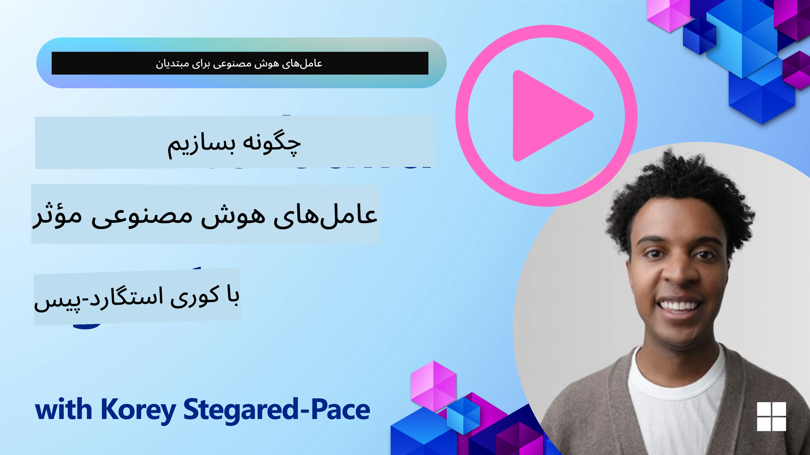
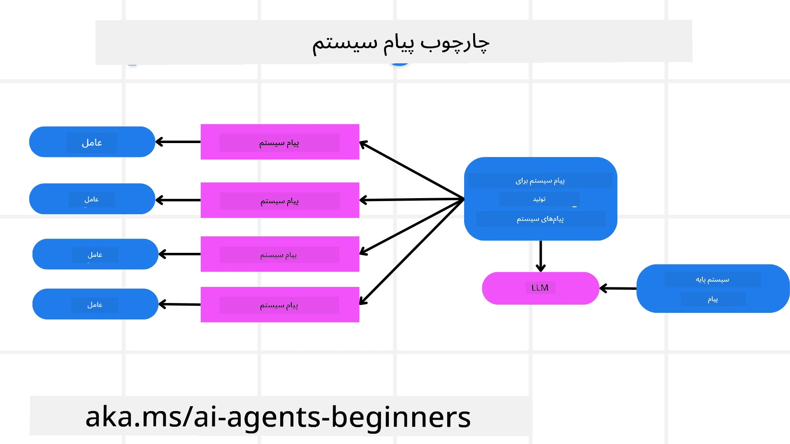
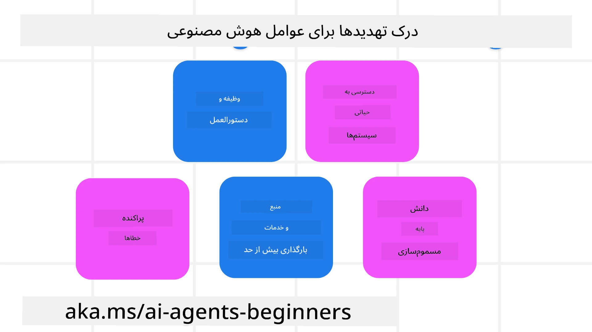
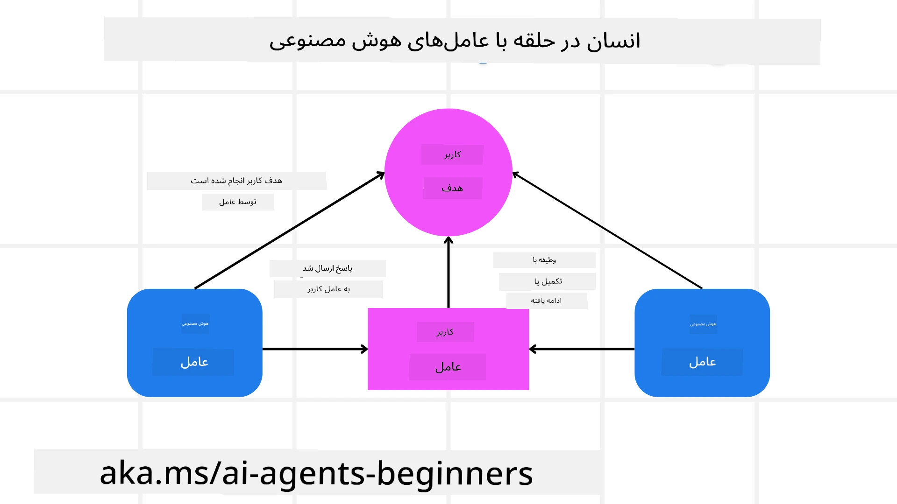

[](https://youtu.be/iZKkMEGBCUQ?si=Q-kEbcyHUMPoHp8L)

> _(برای مشاهده ویدئو این درس روی تصویر بالا کلیک کنید)_

# ساخت نماینده‌های هوش مصنوعی قابل اعتماد

## مقدمه

این درس موارد زیر را پوشش خواهد داد:

- چگونه نماینده‌های هوش مصنوعی ایمن و مؤثر بسازیم و مستقر کنیم
- ملاحظات امنیتی مهم هنگام توسعه نماینده‌های هوش مصنوعی
- چگونه حفظ حریم خصوصی داده‌ها و کاربران را هنگام توسعه نماینده‌های هوش مصنوعی حفظ کنیم

## اهداف یادگیری

پس از اتمام این درس، شما خواهید دانست چگونه:

- ریسک‌ها را هنگام ایجاد نماینده‌های هوش مصنوعی شناسایی و کاهش دهید
- تدابیر امنیتی را برای اطمینان از مدیریت صحیح داده‌ها و دسترسی‌ها اجرا کنید
- نماینده‌های هوش مصنوعی بسازید که حفظ حریم خصوصی داده‌ها را تضمین کرده و تجربه کاربری با کیفیت ارائه دهند

## ایمنی

بیایید ابتدا نگاهی به ساخت برنامه‌های عاملیکیشن ایمن بیندازیم. ایمنی به معنای عملکرد نماینده هوش مصنوعی به صورت طراحی شده است. به عنوان سازندگان برنامه‌های عاملیکیشن، ما روش‌ها و ابزارهایی برای حداکثر کردن ایمنی داریم:

### ساخت چارچوب پیام سیستم

اگر تا به حال برنامه‌ای بر اساس مدل‌های زبان بزرگ (LLM) ساخته‌اید، اهمیت طراحی پرامپت یا پیام سیستم قوی را می‌دانید. این پرامپت‌ها قوانین متا، دستورالعمل‌ها و راهنماهایی را برای نحوه تعامل LLM با کاربر و داده‌ها تعیین می‌کنند.

برای نماینده‌های هوش مصنوعی، پرامپت سیستم اهمیت بیشتری دارد زیرا نماینده‌ها نیازمند دستورالعمل‌های بسیار مشخص برای انجام وظایفی هستند که برایشان طراحی کرده‌ایم.

برای ایجاد پرامپت‌های سیستم مقیاس‌پذیر، می‌توانیم از چارچوب پیام سیستم برای ساخت یک یا چند نماینده در برنامه استفاده کنیم:



#### مرحله ۱: ایجاد پیام متا سیستم

پرومت متا توسط یک LLM برای تولید پرامپت‌های سیستم برای نماینده‌هایی که می‌سازیم استفاده خواهد شد. آن را به صورت قالب طراحی می‌کنیم تا در صورت نیاز بتوانیم به طور کارآمد چندین نماینده ایجاد کنیم.

در اینجا مثالی از پیام متا سیستم که به LLM داده می‌شود آورده شده است:

```plaintext
You are an expert at creating AI agent assistants. 
You will be provided a company name, role, responsibilities and other
information that you will use to provide a system prompt for.
To create the system prompt, be descriptive as possible and provide a structure that a system using an LLM can better understand the role and responsibilities of the AI assistant. 
```

#### مرحله ۲: ایجاد پرامپت پایه

گام بعدی ایجاد یک پرامپت پایه برای توصیف نماینده هوش مصنوعی است. باید نقش نماینده، وظایفی که قرار است انجام دهد و سایر مسئولیت‌های آن را درج کنید.

مثالی در اینجا آورده شده است:

```plaintext
You are a travel agent for Contoso Travel that is great at booking flights for customers. To help customers you can perform the following tasks: lookup available flights, book flights, ask for preferences in seating and times for flights, cancel any previously booked flights and alert customers on any delays or cancellations of flights.  
```

#### مرحله ۳: ارائه پیام پایه سیستم به LLM

اکنون می‌توانیم این پیام سیستم را با وارد کردن پیام متا سیستم به عنوان پیام سیستم و پیام پایه خود بهینه کنیم.

این کار پیام سیستمی تولید می‌کند که بهتر برای راهنمایی نماینده‌های هوش مصنوعی ما طراحی شده است:

```markdown
**Company Name:** Contoso Travel  
**Role:** Travel Agent Assistant

**Objective:**  
You are an AI-powered travel agent assistant for Contoso Travel, specializing in booking flights and providing exceptional customer service. Your main goal is to assist customers in finding, booking, and managing their flights, all while ensuring that their preferences and needs are met efficiently.

**Key Responsibilities:**

1. **Flight Lookup:**
    
    - Assist customers in searching for available flights based on their specified destination, dates, and any other relevant preferences.
    - Provide a list of options, including flight times, airlines, layovers, and pricing.
2. **Flight Booking:**
    
    - Facilitate the booking of flights for customers, ensuring that all details are correctly entered into the system.
    - Confirm bookings and provide customers with their itinerary, including confirmation numbers and any other pertinent information.
3. **Customer Preference Inquiry:**
    
    - Actively ask customers for their preferences regarding seating (e.g., aisle, window, extra legroom) and preferred times for flights (e.g., morning, afternoon, evening).
    - Record these preferences for future reference and tailor suggestions accordingly.
4. **Flight Cancellation:**
    
    - Assist customers in canceling previously booked flights if needed, following company policies and procedures.
    - Notify customers of any necessary refunds or additional steps that may be required for cancellations.
5. **Flight Monitoring:**
    
    - Monitor the status of booked flights and alert customers in real-time about any delays, cancellations, or changes to their flight schedule.
    - Provide updates through preferred communication channels (e.g., email, SMS) as needed.

**Tone and Style:**

- Maintain a friendly, professional, and approachable demeanor in all interactions with customers.
- Ensure that all communication is clear, informative, and tailored to the customer's specific needs and inquiries.

**User Interaction Instructions:**

- Respond to customer queries promptly and accurately.
- Use a conversational style while ensuring professionalism.
- Prioritize customer satisfaction by being attentive, empathetic, and proactive in all assistance provided.

**Additional Notes:**

- Stay updated on any changes to airline policies, travel restrictions, and other relevant information that could impact flight bookings and customer experience.
- Use clear and concise language to explain options and processes, avoiding jargon where possible for better customer understanding.

This AI assistant is designed to streamline the flight booking process for customers of Contoso Travel, ensuring that all their travel needs are met efficiently and effectively.

```

#### مرحله ۴: تکرار و بهبود

ارزش این چارچوب پیام سیستم در این است که بتوان ایجاد پیام‌های سیستم از چندین نماینده را آسان‌تر کرد و همچنین با گذر زمان پیام‌های سیستم خود را بهبود داد. به ندرت پیش می‌آید که پیام سیستمی برای تمام مورد استفاده شما از اولین بار به درستی کار کند. توانایی انجام تغییرات کوچک و بهبودها با تغییر پیام پایه سیستم و اجرای آن در چارچوب به شما اجازه می‌دهد نتایج را مقایسه و ارزیابی کنید.

## درک تهدیدها

برای ساخت نماینده‌های هوش مصنوعی قابل اعتماد، مهم است که خطرات و تهدیدات علیه نماینده خود را بشناسید و کاهش دهید. بیایید به برخی از تهدیدات مختلف برای نماینده‌های هوش مصنوعی و راه‌های برنامه‌ریزی و آماده‌سازی بهتر برای آنها نگاه کنیم.



### وظیفه و دستورالعمل

**شرح:** مهاجمان تلاش می‌کنند با پرامپت‌دهی یا دستکاری ورودی‌ها، دستورالعمل‌ها یا اهداف نماینده هوش مصنوعی را تغییر دهند.

**کاهش:** بررسی‌های اعتبارسنجی و فیلترهای ورودی را اجرا کنید تا پرامپت‌های بالقوه خطرناک قبل از پردازش توسط نماینده تشخیص داده شوند. از آنجا که چنین حملاتی معمولاً نیازمند تعامل مکرر با نماینده هستند، محدود کردن تعداد دورهای گفتگو راه دیگری برای جلوگیری از این نوع حملات است.

### دسترسی به سامانه‌های حیاتی

**شرح:** اگر نماینده هوش مصنوعی به سامانه‌ها و خدماتی که داده‌های حساس را ذخیره می‌کنند دسترسی داشته باشد، مهاجمان می‌توانند ارتباط بین نماینده و این خدمات را مورد حمله قرار دهند. این حملات می‌توانند مستقیم باشند یا تلاش‌های غیرمستقیم برای به دست آوردن اطلاعات درباره این سامانه‌ها از طریق نماینده.

**کاهش:** نماینده‌های هوش مصنوعی باید به سامانه‌ها فقط بر اساس نیاز دسترسی داشته باشند تا از این نوع حملات جلوگیری شود. ارتباط بین نماینده و سامانه نیز باید امن باشد. اجرای تأیید هویت و کنترل دسترسی نیز راهی برای محافظت از این اطلاعات است.

### بارگذاری بیش از حد منابع و خدمات

**شرح:** نماینده‌های هوش مصنوعی می‌توانند از ابزارها و خدمات مختلفی برای انجام وظایف استفاده کنند. مهاجمان می‌توانند با ارسال حجم زیادی از درخواست‌ها از طریق نماینده هوش مصنوعی به این خدمات حمله کنند که ممکن است باعث خرابی سامانه‌ها یا هزینه‌های زیاد شود.

**کاهش:** سیاست‌هایی برای محدود کردن تعداد درخواست‌هایی که یک نماینده هوش مصنوعی می‌تواند به یک سرویس ارسال کند اعمال کنید. محدود کردن تعداد دورهای گفتگو و درخواست‌ها به نماینده هوش مصنوعی شما راه دیگری برای جلوگیری از چنین حملاتی است.

### سم‌پاشی پایگاه دانش

**شرح:** این نوع حمله مستقیماً نماینده هوش مصنوعی را هدف قرار نمی‌دهد بلکه پایگاه دانش و خدمات دیگری که نماینده برای انجام وظایف استفاده می‌کند را هدف قرار می‌دهد. این ممکن است شامل خراب‌کاری داده‌ها یا اطلاعاتی باشد که نماینده برای تکمیل یک وظیفه استفاده خواهد کرد و به پاسخ‌های جانبدارانه یا ناخواسته به کاربر منجر شود.

**کاهش:** بازبینی منظم داده‌هایی که نماینده هوش مصنوعی در گردش کار خود استفاده می‌کند انجام دهید. اطمینان حاصل کنید که دسترسی به این داده‌ها امن است و فقط افراد مورد اعتماد می‌توانند آنها را تغییر دهند تا از این نوع حمله جلوگیری شود.

### خطاهای زنجیره‌ای

**شرح:** نماینده‌های هوش مصنوعی به ابزارها و خدمات مختلفی دسترسی دارند تا وظایف را انجام دهند. خطاهای ایجاد شده توسط مهاجمان می‌تواند به خرابی سایر سامانه‌هایی منجر شود که نماینده به آنها متصل است و همین باعث می‌شود حمله گسترده‌تر شده و عیب‌یابی آن سخت‌تر شود.

**کاهش:** یکی از روش‌ها برای جلوگیری از این موضوع این است که نماینده هوش مصنوعی در محیط محدود عمل کند، مانند اجرای وظایف در کانتینر داکر، تا از حملات مستقیم به سامانه جلوگیری شود. ایجاد مکانیزم‌های پشتیبان و منطق تکرار زمانی که برخی سیستم‌ها با خطا پاسخ می‌دهند نیز روشی دیگر برای جلوگیری از خرابی‌های بزرگ‌تر سامانه است.

## انسان در حلقه

روش مؤثر دیگر برای ساخت سامانه‌های نماینده هوش مصنوعی قابل اعتماد، استفاده از انسان در حلقه است. این روش جریانی ایجاد می‌کند که کاربران قادرند در حین اجرای فرآیند، بازخورد به نماینده‌ها ارائه دهند. کاربران عملاً به عنوان نماینده‌ها در یک سیستم چندعاملی عمل می‌کنند و با تأیید یا پایان دادن فرآیند در حال اجرا، نقش کنترل را ایفا می‌کنند.



اینجا قطعه کدی با استفاده از Microsoft Agent Framework برای نشان دادن نحوه پیاده‌سازی این مفهوم آورده شده است:

```python
import os
from agent_framework.azure import AzureAIProjectAgentProvider
from azure.identity import AzureCliCredential

# ایجاد تأمین‌کننده با تأیید انسان در حلقه
provider = AzureAIProjectAgentProvider(
    credential=AzureCliCredential(),
)

# ایجاد عامل با مرحله تأیید انسان
response = provider.create_response(
    input="Write a 4-line poem about the ocean.",
    instructions="You are a helpful assistant. Ask for user approval before finalizing.",
)

# کاربر می‌تواند پاسخ را بررسی و تأیید کند
print(response.output_text)
user_input = input("Do you approve? (APPROVE/REJECT): ")
if user_input == "APPROVE":
    print("Response approved.")
else:
    print("Response rejected. Revising...")
```

## نتیجه‌گیری

ساخت نماینده‌های هوش مصنوعی قابل اعتماد نیازمند طراحی دقیق، تدابیر امنیتی قوی و تکرار مستمر است. با اجرای سیستم‌های ساختارمند پرامپت متا، درک تهدیدات محتمل و به‌کارگیری استراتژی‌های کاهش ریسک، توسعه‌دهندگان می‌توانند نماینده‌هایی بسازند که هم ایمن و هم مؤثر باشند. افزون بر این، به‌کارگیری رویکرد انسان در حلقه تضمین می‌کند که نماینده‌های هوش مصنوعی هماهنگ با نیازهای کاربران باقی بمانند در حالی که خطرات را به حداقل می‌رساند. با ادامه پیشرفت هوش مصنوعی، حفظ موضع فعال در زمینه امنیت، حریم خصوصی و ملاحظات اخلاقی کلید ایجاد اعتماد و قابلیت اطمینان در سامانه‌های مبتنی بر هوش مصنوعی خواهد بود.

### سوالات بیشتر درباره ساخت نماینده‌های هوش مصنوعی قابل اعتماد دارید؟

به [Microsoft Foundry Discord](https://aka.ms/ai-agents/discord) بپیوندید تا با دیگر علاقه‌مندان ملاقات کنید، در ساعت‌های کاری شرکت کنید و پرسش‌های خود درباره نماینده‌های هوش مصنوعی را مطرح کنید.

## منابع اضافی

- <a href="https://learn.microsoft.com/azure/ai-studio/responsible-use-of-ai-overview" target="_blank">مروری بر هوش مصنوعی مسئولانه</a>
- <a href="https://learn.microsoft.com/azure/ai-studio/concepts/evaluation-approach-gen-ai" target="_blank">ارزیابی مدل‌های هوش مصنوعی مولد و برنامه‌های هوش مصنوعی</a>
- <a href="https://learn.microsoft.com/azure/ai-services/openai/concepts/system-message?context=%2Fazure%2Fai-studio%2Fcontext%2Fcontext&tabs=top-techniques" target="_blank">پیام‌های سیستم امنیتی</a>
- <a href="https://blogs.microsoft.com/wp-content/uploads/prod/sites/5/2022/06/Microsoft-RAI-Impact-Assessment-Template.pdf?culture=en-us&country=us" target="_blank">قالب ارزیابی ریسک</a>

## درس قبلی

[Agentic RAG](../05-agentic-rag/README.md)

## درس بعدی

[الگوی طراحی برنامه‌ریزی](../07-planning-design/README.md)

---

<!-- CO-OP TRANSLATOR DISCLAIMER START -->
**سلب مسئولیت**:  
این سند با استفاده از سرویس ترجمه هوش مصنوعی [Co-op Translator](https://github.com/Azure/co-op-translator) ترجمه شده است. در حالی که ما در تلاش برای دقت هستیم، لطفاً توجه داشته باشید که ترجمه‌های خودکار ممکن است حاوی خطاها یا نادرستی‌هایی باشند. سند اصلی به زبان بومی خود باید به‌عنوان منبع معتبر در نظر گرفته شود. برای اطلاعات حیاتی، ترجمه حرفه‌ای انسانی توصیه می‌شود. ما مسئول هیچگونه سوءتفاهم یا برداشت نادرست ناشی از استفاده از این ترجمه نیستیم.
<!-- CO-OP TRANSLATOR DISCLAIMER END -->