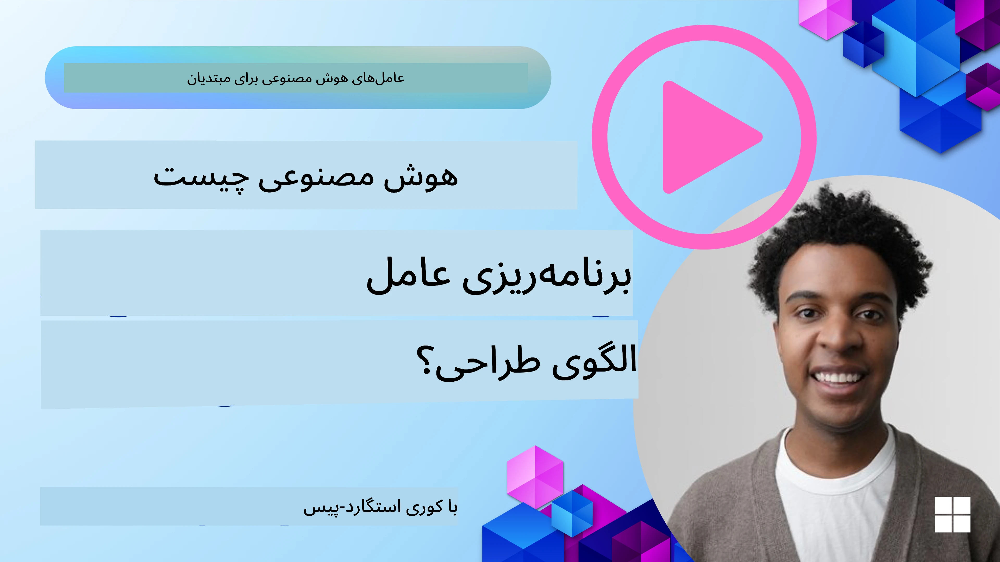
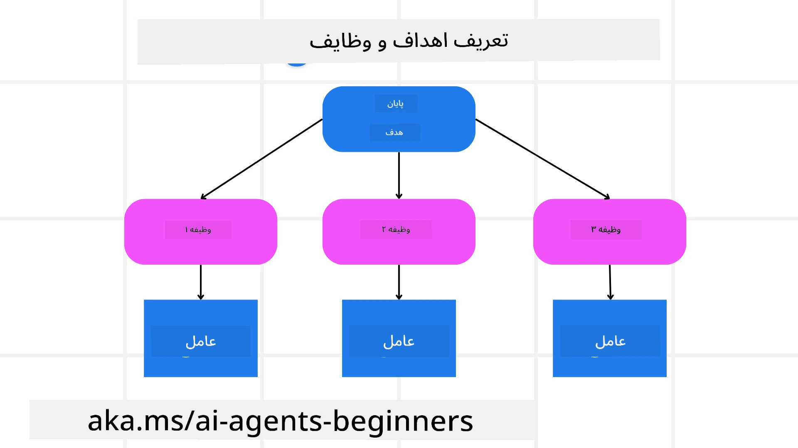

[](https://youtu.be/kPfJ2BrBCMY?si=9pYpPXp0sSbK91Dr)

> _(برای مشاهده ویدیوی این درس روی تصویر بالا کلیک کنید)_

# برنامه‌ریزی طراحی

## مقدمه

این درس شامل موارد زیر است

* تعریف یک هدف کلی واضح و شکستن یک کار پیچیده به وظایف قابل مدیریت.
* بهره‌گیری از خروجی ساختاریافته برای پاسخ‌های قابل اعتمادتر و قابل خواندن توسط ماشین.
* اعمال رویکرد مبتنی بر رویداد برای مدیریت وظایف دینامیک و ورودی‌های غیرمنتظره.

## اهداف یادگیری

پس از اتمام این درس، شما درباره موارد زیر درک خواهید داشت:

* شناسایی و تعیین یک هدف کلی برای یک عامل هوش مصنوعی، اطمینان از اینکه به روشنی می‌داند چه چیزی باید به دست آید.
* شکستن یک کار پیچیده به زیرکارهای قابل مدیریت و سازماندهی آنها در یک توالی منطقی.
* تجهیز عوامل با ابزارهای مناسب (مانند ابزارهای جستجو یا ابزارهای تحلیل داده)، تصمیم‌گیری درباره زمان و نحوه استفاده از آنها، و مدیریت موقعیت‌های غیرمنتظره‌ای که پیش می‌آید.
* ارزیابی نتایج زیرکارها، اندازه‌گیری عملکرد، و تکرار اقدامات برای بهبود خروجی نهایی.

## تعریف هدف کلی و شکستن یک کار



اکثر کارهای دنیای واقعی بسیار پیچیده هستند که نمی‌توان آنها را در یک مرحله حل کرد. یک عامل هوش مصنوعی به یک هدف کوتاه و روشن نیاز دارد تا برنامه‌ریزی و اقداماتش را هدایت کند. به عنوان مثال، هدف زیر را در نظر بگیرید:

    "تولید یک برنامه سفر ۳ روزه."

اگرچه بیان آن ساده است، اما همچنان نیاز به اصلاح دارد. هر چه هدف واضح‌تر باشد، عامل (و هر همکار انسانی) بهتر می‌توانند بر دست‌یابی به نتیجه درست تمرکز کنند، مانند ایجاد یک برنامه جامع با گزینه‌های پرواز، پیشنهادهای هتل و فعالیت‌ها.

### تجزیه کار

وظایف بزرگ یا پیچیده هنگام تقسیم به زیرکارهای کوچک‌تر و هدفمند، قابل مدیریت‌تر می‌شوند.  
برای مثال برنامه سفر، می‌توان هدف را به موارد زیر تقسیم کرد:

* رزرو پرواز  
* رزرو هتل  
* اجاره خودرو  
* شخصی‌سازی

سپس هر زیرکار می‌تواند توسط عوامل یا فرآیندهای اختصاصی مدیریت شود. یک عامل ممکن است در جستجوی بهترین پیشنهادات پرواز تخصص داشته باشد، دیگری بر رزرو هتل تمرکز دارد، و غیره. یک عامل هماهنگ‌کننده یا «پایین‌دست» پس از آن می‌تواند این نتایج را به یک برنامه کلی و منسجم برای کاربر نهایی جمع‌آوری کند.

این رویکرد مدولار همچنین امکان بهبود تدریجی را فراهم می‌کند. به عنوان مثال، می‌توان عوامل تخصصی برای پیشنهادات غذا یا فعالیت‌های محلی اضافه کرد و برنامه سفر را به مرور زمان اصلاح کرد.

### خروجی ساختاریافته

مدل‌های زبانی بزرگ (LLMها) می‌توانند خروجی ساختاریافته (مانند JSON) تولید کنند که برای عوامل یا خدمات پایین‌دستی آسان‌تر قابل تجزیه و پردازش است. این مسئله به‌ویژه در زمینه چندعاملی مفید است، جایی که می‌توان پس از دریافت خروجی برنامه‌ریزی این وظایف را انجام داد.

قطعه کد پایتون زیر، عاملی ساده برای برنامه‌ریزی را نشان می‌دهد که یک هدف را به زیرکارها تقسیم و برنامه ساختاری ارائه می‌دهد:

```python
from pydantic import BaseModel
from enum import Enum
from typing import List, Optional, Union
import json
import os
from typing import Optional
from pprint import pprint
from agent_framework.azure import AzureAIProjectAgentProvider
from azure.identity import AzureCliCredential

class AgentEnum(str, Enum):
    FlightBooking = "flight_booking"
    HotelBooking = "hotel_booking"
    CarRental = "car_rental"
    ActivitiesBooking = "activities_booking"
    DestinationInfo = "destination_info"
    DefaultAgent = "default_agent"
    GroupChatManager = "group_chat_manager"

# مدل زیرکار سفر
class TravelSubTask(BaseModel):
    task_details: str
    assigned_agent: AgentEnum  # ما می‌خواهیم کار را به مأمور اختصاص دهیم

class TravelPlan(BaseModel):
    main_task: str
    subtasks: List[TravelSubTask]
    is_greeting: bool

provider = AzureAIProjectAgentProvider(credential=AzureCliCredential())

# تعریف پیام کاربر
system_prompt = """You are a planner agent.
    Your job is to decide which agents to run based on the user's request.
    Provide your response in JSON format with the following structure:
{'main_task': 'Plan a family trip from Singapore to Melbourne.',
 'subtasks': [{'assigned_agent': 'flight_booking',
               'task_details': 'Book round-trip flights from Singapore to '
                               'Melbourne.'}
    Below are the available agents specialised in different tasks:
    - FlightBooking: For booking flights and providing flight information
    - HotelBooking: For booking hotels and providing hotel information
    - CarRental: For booking cars and providing car rental information
    - ActivitiesBooking: For booking activities and providing activity information
    - DestinationInfo: For providing information about destinations
    - DefaultAgent: For handling general requests"""

user_message = "Create a travel plan for a family of 2 kids from Singapore to Melbourne"

response = client.create_response(input=user_message, instructions=system_prompt)

response_content = response.output_text
pprint(json.loads(response_content))
```
  
### عامل برنامه‌ریز با هماهنگی چندعامله

در این مثال، یک عامل مسیریاب معنایی درخواست کاربر را دریافت می‌کند (مثلاً "من به یک برنامه هتل برای سفرتان نیاز دارم.").

سپس برنامه‌ریز:

* دریافت برنامه هتل: برنامه‌ریز پیام کاربر را گرفته و بر اساس یک پیام سیستم (که جزئیات عوامل موجود را شامل می‌شود)، یک برنامه سفر ساختاریافته تولید می‌کند.  
* فهرست عوامل و ابزارهای آنها: ثبت‌نام عامل شامل فهرستی از عوامل (مثلاً برای پرواز، هتل، اجاره خودرو و فعالیت‌ها) به همراه عملکردها یا ابزارهایی است که ارائه می‌دهند.  
* ارجاع برنامه به عوامل مربوطه: بسته به تعداد زیرکارها، برنامه‌ریز یا پیام را مستقیماً به یک عامل اختصاصی ارسال می‌کند (برای سناریوهای تک‌کار)، یا از طریق مدیر گروه چت برای همکاری چندعامله هماهنگ می‌کند.  
* خلاصه نتایج: در نهایت، برنامه‌ریز برنامه تولیدشده را برای وضوح خلاصه می‌کند.  
نمونه کد پایتون زیر این مراحل را نشان می‌دهد:

```python

from pydantic import BaseModel

from enum import Enum
from typing import List, Optional, Union

class AgentEnum(str, Enum):
    FlightBooking = "flight_booking"
    HotelBooking = "hotel_booking"
    CarRental = "car_rental"
    ActivitiesBooking = "activities_booking"
    DestinationInfo = "destination_info"
    DefaultAgent = "default_agent"
    GroupChatManager = "group_chat_manager"

# مدل زیردامنه مسافرت

class TravelSubTask(BaseModel):
    task_details: str
    assigned_agent: AgentEnum # می‌خواهیم وظیفه را به نماینده تخصیص دهیم

class TravelPlan(BaseModel):
    main_task: str
    subtasks: List[TravelSubTask]
    is_greeting: bool
import json
import os
from typing import Optional

from agent_framework.azure import AzureAIProjectAgentProvider
from azure.identity import AzureCliCredential

# ایجاد مشتری

provider = AzureAIProjectAgentProvider(credential=AzureCliCredential())

from pprint import pprint

# تعریف پیام کاربر

system_prompt = """You are a planner agent.
    Your job is to decide which agents to run based on the user's request.
    Below are the available agents specialized in different tasks:
    - FlightBooking: For booking flights and providing flight information
    - HotelBooking: For booking hotels and providing hotel information
    - CarRental: For booking cars and providing car rental information
    - ActivitiesBooking: For booking activities and providing activity information
    - DestinationInfo: For providing information about destinations
    - DefaultAgent: For handling general requests"""

user_message = "Create a travel plan for a family of 2 kids from Singapore to Melbourne"

response = client.create_response(input=user_message, instructions=system_prompt)

response_content = response.output_text

# چاپ محتوای پاسخ پس از بارگذاری آن به صورت JSON

pprint(json.loads(response_content))
```
  
آنچه که در ادامه آمده خروجی کد قبلی است و می‌توانید از این خروجی ساختاریافته برای ارجاع به `assigned_agent` و خلاصه‌سازی برنامه سفر برای کاربر نهایی استفاده کنید.

```json
{
    "is_greeting": "False",
    "main_task": "Plan a family trip from Singapore to Melbourne.",
    "subtasks": [
        {
            "assigned_agent": "flight_booking",
            "task_details": "Book round-trip flights from Singapore to Melbourne."
        },
        {
            "assigned_agent": "hotel_booking",
            "task_details": "Find family-friendly hotels in Melbourne."
        },
        {
            "assigned_agent": "car_rental",
            "task_details": "Arrange a car rental suitable for a family of four in Melbourne."
        },
        {
            "assigned_agent": "activities_booking",
            "task_details": "List family-friendly activities in Melbourne."
        },
        {
            "assigned_agent": "destination_info",
            "task_details": "Provide information about Melbourne as a travel destination."
        }
    ]
}
```
  
یک دفترچه یادداشت نمونه با همین کد قبلی [در اینجا](07-python-agent-framework.ipynb) موجود است.

### برنامه‌ریزی تکراری

برخی وظایف نیازمند رفت و برگشت یا بازبرنامه‌ریزی هستند، جایی که نتیجه یک زیرکار بر زیرکار بعدی تأثیر می‌گذارد. به طور مثال، اگر عامل هنگام رزرو پرواز با یک فرمت داده غیرمنتظره مواجه شود، ممکن است لازم باشد استراتژی خود را قبل از ادامه به رزرو هتل تغییر دهد.

علاوه بر این، بازخورد کاربر (مثلاً زمانی که یک انسان تصمیم می‌گیرد پرواز زودتری را ترجیح می‌دهد) می‌تواند موجب بازبرنامه‌ریزی جزئی شود. این رویکرد دینامیک و تکراری تضمین می‌کند که راه حل نهایی با محدودیت‌های دنیای واقعی و ترجیحات در حال تغییر کاربر هماهنگ باشد.

مثال کد

```python
from agent_framework.azure import AzureAIProjectAgentProvider
from azure.identity import AzureCliCredential
#.. همانند کد قبلی و انتقال تاریخچه کاربر، برنامه فعلی

system_prompt = """You are a planner agent to optimize the
    Your job is to decide which agents to run based on the user's request.
    Below are the available agents specialized in different tasks:
    - FlightBooking: For booking flights and providing flight information
    - HotelBooking: For booking hotels and providing hotel information
    - CarRental: For booking cars and providing car rental information
    - ActivitiesBooking: For booking activities and providing activity information
    - DestinationInfo: For providing information about destinations
    - DefaultAgent: For handling general requests"""

user_message = "Create a travel plan for a family of 2 kids from Singapore to Melbourne"

response = client.create_response(
    input=user_message,
    instructions=system_prompt,
    context=f"Previous travel plan - {TravelPlan}",
)
# .. بازبرنامه‌ریزی و ارسال وظایف به نمایندگان مربوطه
```
  
برای برنامه‌ریزی جامع‌تر، می‌توانید پست وبلاگی Magnetic One <a href="https://www.microsoft.com/research/articles/magentic-one-a-generalist-multi-agent-system-for-solving-complex-tasks" target="_blank">Blogpost</a> را مشاهده کنید که برای حل وظایف پیچیده ارائه شده است.

## خلاصه

در این مقاله نمونه‌ای از نحوه ایجاد برنامه‌ریز را بررسی کردیم که می‌تواند عوامل موجود تعریف‌شده را به‌صورت پویا انتخاب کند. خروجی برنامه‌ریز وظایف را تجزیه کرده و عوامل را جهت اجرای آنها تخصیص می‌دهد. فرض بر این است که عوامل به عملکردها/ابزارهای لازم برای انجام وظیفه دسترسی دارند. علاوه بر عوامل، می‌توانید الگوهای دیگری مانند بازتاب، خلاصه‌ساز و چت Round Robin را برای سفارشی‌سازی بیشتر اضافه کنید.

## منابع اضافی

Magentic One - یک سیستم چندعامله عمومی برای حل وظایف پیچیده است که نتایج قابل توجهی در چندین بنچمارک پیچیده عاملیک کسب کرده است. مرجع: <a href="https://www.microsoft.com/research/articles/magentic-one-a-generalist-multi-agent-system-for-solving-complex-tasks" target="_blank">Magentic One</a>. در این پیاده‌سازی هماهنگ‌کننده برنامه‌های خاص وظایف را ایجاد کرده و این وظایف را به عوامل موجود واگذار می‌کند. علاوه بر برنامه‌ریزی، هماهنگ‌کننده مکانیزم پیگیری را برای نظارت بر پیشرفت وظایف به کار می‌برد و در صورت نیاز بازبرنامه‌ریزی می‌کند.

### سوال بیشتری درباره الگوی طراحی برنامه‌ریزی دارید؟

به [سرور Discord مایکروسافت Foundry](https://aka.ms/ai-agents/discord) بپیوندید تا با دیگر یادگیرندگان ملاقات کنید، در ساعات اداری شرکت کنید و سوالات خود درباره عوامل هوش مصنوعی را مطرح کنید.

## درس قبلی

[ساخت عوامل هوش مصنوعی قابل اعتماد](../06-building-trustworthy-agents/README.md)

## درس بعدی

[الگوی طراحی چندعامله](../08-multi-agent/README.md)

---

<!-- CO-OP TRANSLATOR DISCLAIMER START -->
**سلب مسئولیت**:  
این سند با استفاده از خدمات ترجمه هوش مصنوعی [Co-op Translator](https://github.com/Azure/co-op-translator) ترجمه شده است. در حالی که ما برای دقت تلاش می‌کنیم، لطفاً آگاه باشید که ترجمه‌های خودکار ممکن است حاوی اشتباهات یا نواقصی باشند. سند اصلی به زبان بومی خود باید به عنوان منبع معتبر در نظر گرفته شود. برای اطلاعات حیاتی، ترجمه حرفه‌ای انسانی توصیه می‌شود. ما مسئولیتی در قبال سوءتفاهم‌ها یا تفسیرهای نادرست ناشی از استفاده از این ترجمه نداریم.
<!-- CO-OP TRANSLATOR DISCLAIMER END -->