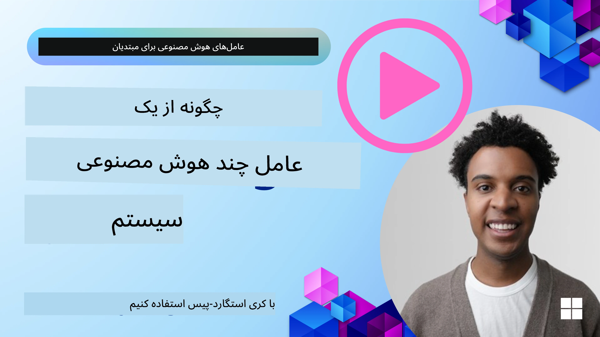
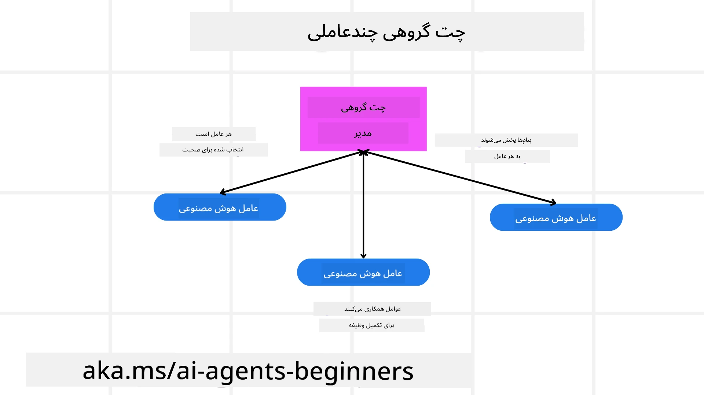
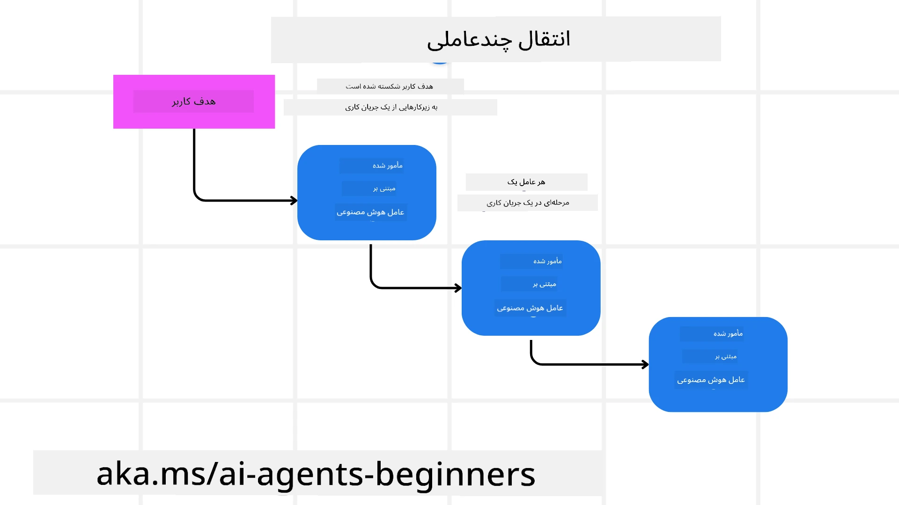
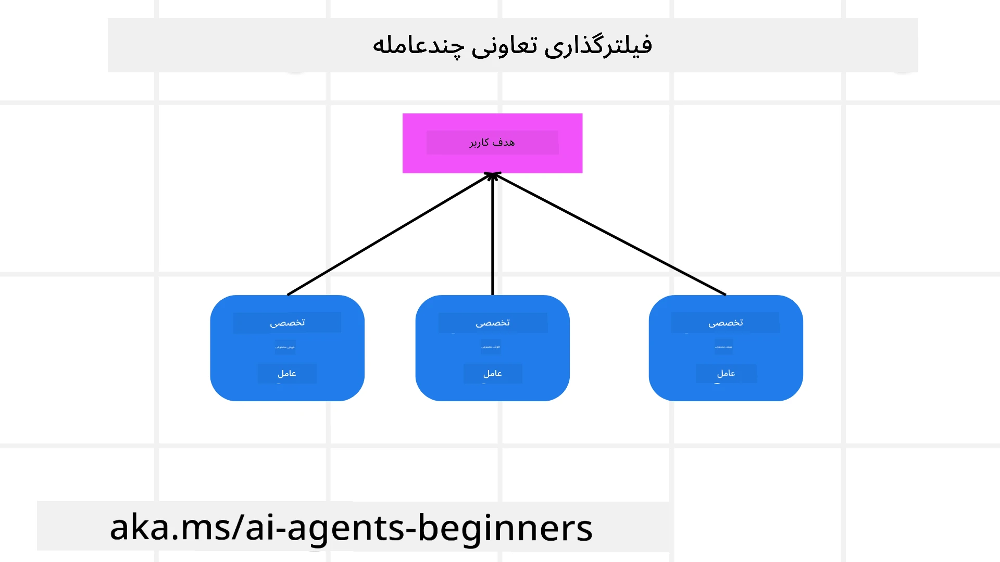

> _(برای مشاهده ویدئوی این درس روی تصویر بالا کلیک کنید)_

# الگوهای طراحی چندعامله

به محض شروع کار روی پروژه‌ای که شامل چند عامل است، باید الگوی طراحی چندعامله را در نظر بگیرید. با این حال، ممکن است بلافاصله روشن نباشد که کی باید به چندعامل سوئیچ کنید و مزایای آن چیست.

## مقدمه

در این درس، ما به دنبال پاسخ دادن به پرسش‌های زیر هستیم:

- چه سناریوهایی قابلیت استفاده از چندعامل را دارند؟
- مزایای استفاده از چندعامل نسبت به یک عامل واحد که چندین کار انجام می‌دهد چیست؟
- بلوک‌های ساختاری پیاده‌سازی الگوی طراحی چندعامله چیستند؟
- چگونه می‌توانیم ببینیم چند عامل چگونه با یکدیگر تعامل دارند؟

## اهداف یادگیری

پس از این درس، باید قادر باشید:

- سناریوهایی که چندعامل کاربرد دارد را شناسایی کنید
- مزایای استفاده از چندعامل نسبت به یک عامل واحد را تشخیص دهید
- بلوک‌های ساختاری پیاده‌سازی الگوی طراحی چندعامله را درک کنید

تصویر بزرگ‌تر چیست؟

*چندعامل‌ها الگوی طراحی‌ای هستند که اجازه می‌دهند چندین عامل با هم همکاری کنند تا به هدف مشترکی برسند*.

این الگو در حوزه‌های مختلفی از جمله رباتیک، سیستم‌های خودران و محاسبات توزیع‌شده به طور گسترده‌ای استفاده می‌شود.

## سناریوهایی که چندعامل کاربرد دارد

پس چه سناریوهایی به عنوان یک مورد خوب برای استفاده از چندعامل به حساب می‌آیند؟ پاسخ این است که سناریوهای زیادی وجود دارند که استفاده از چندعامل سودمند است، به خصوص در موارد زیر:

- **بار کاری بزرگ**: بارهای کاری بزرگ می‌توانند به کارهای کوچک‌تر تقسیم شوند و به عوامل مختلف اختصاص یابند که اجازه پردازش موازی و تکمیل سریع‌تر را می‌دهد. مثال این حالت، یک کار بزرگ پردازش داده‌ها است.
- **کارهای پیچیده**: کارهای پیچیده، مانند بارهای کاری بزرگ، می‌توانند به زیرکارهای کوچک‌تر شکسته شوند و به عوامل مختلف اختصاص یابند که هرکدام در جنبه خاصی از کار تخصص دارند. نمونه خوب این حالت در خودروهای خودران است، جایی که عوامل مختلف مدیریت مسیریابی، تشخیص موانع و ارتباط با خودروهای دیگر را بر عهده دارند.
- **تخصص‌های متنوع**: عوامل مختلف می‌توانند تخصص‌های متفاوتی داشته باشند که به آن‌ها اجازه می‌دهد جنبه‌های مختلف یک کار را مؤثرتر از یک عامل واحد مدیریت کنند. برای این مورد، نمونه خوب در حوزه مراقبت‌های بهداشتی است که عوامل مسئول تشخیص، برنامه‌های درمان و نظارت بر بیماران هستند.

## مزایای استفاده از چندعامل نسبت به یک عامل واحد

سیستم با یک عامل واحد ممکن است برای کارهای ساده خوب عمل کند، اما برای کارهای پیچیده‌تر، استفاده از چندعامل مزایای زیادی دارد:

- **تخصصی شدن**: هر عامل می‌تواند برای یک کار خاص تخصص داشته باشد. نبود تخصص در یک عامل واحد بدین معنی است که عاملی دارید که همه کارها را انجام می‌دهد ولی ممکن است در مواجهه با یک کار پیچیده دچار سردرگمی شود. مثلاً ممکن است کاری را انجام دهد که بهترین انتخاب برای آن نباشد.
- **قابلیت توسعه**: آسان‌تر است که سیستم‌ها را با اضافه کردن عوامل بیشتر گسترش داد تا اینکه یک عامل را بیش از حد بارگذاری کرد.
- **تحمل خطا**: اگر یک عامل از کار بیفتد، سایر عوامل می‌توانند به کار خود ادامه دهند که منجر به اطمینان از پایداری سیستم می‌شود.

بیایید یک مثال بزنیم، می‌خواهیم برای یک کاربر سفر رزرو کنیم. سیستم با یک عامل واحد باید تمام جنبه‌های فرآیند رزرو سفر را مدیریت کند، از پیدا کردن پروازها تا رزرو هتل‌ها و خودروهای اجاره‌ای. برای انجام این کار با یک عامل، آن عامل باید ابزارهایی برای مدیریت همه این کارها داشته باشد. این ممکن است منجر به سیستمی پیچیده و یکپارچه شود که نگهداری و گسترش آن دشوار است. از طرف دیگر، سیستم چندعامله می‌تواند عوامل مختلف تخصص‌یافته در یافتن پروازها، رزرو هتل‌ها و خودروهای اجاره‌ای داشته باشد. این باعث می‌شود سیستم مدولارتر، آسان‌تر برای نگهداری و قابل گسترش باشد.

این را با یک دفتر مسافرتی خانوادگی در مقابل یک دفتر مسافرتی فرانشیز مقایسه کنید. دفتر خانوادگی یک عامل واحد دارد که همه جنبه‌های فرآیند رزرو سفر را مدیریت می‌کند، در حالی که فرانشیز عوامل مختلفی برای جنبه‌های مختلف فرآیند رزرو دارد.

## بلوک‌های ساختاری پیاده‌سازی الگوی طراحی چندعامله

قبل از اینکه بتوانید الگوی طراحی چندعامله را پیاده‌سازی کنید، باید بلوک‌های ساختاری تشکیل‌دهنده این الگو را درک کنید.

بگذارید این موضوع را با نگاه دوباره به مثال رزرو سفر برای یک کاربر ملموس کنیم. در این حالت، بلوک‌های ساختی شامل موارد زیر خواهند بود:

- **ارتباط عوامل**: عوامل مسئول پیدا کردن پروازها، رزرو هتل‌ها و خودروها نیاز به ارتباط و اشتراک اطلاعات درباره ترجیحات و محدودیت‌های کاربر دارند. شما باید پروتکل‌ها و روش‌های این ارتباط را تعیین کنید. به طور مشخص، عامل پیدا کردن پرواز باید با عامل رزرو هتل ارتباط برقرار کند تا اطمینان حاصل شود که هتل برای همان تاریخ‌های پرواز رزرو شده است. این یعنی عوامل باید اطلاعات مربوط به تاریخ‌های سفر کاربر را به اشتراک بگذارند، بنابراین باید تصمیم بگیرید *کدام عوامل اطلاعات را به اشتراک می‌گذارند و چگونه این اشتراک انجام می‌گیرد*.
- **مکانیزم‌های هماهنگی**: عوامل باید اقدامات خود را هماهنگ کنند تا مطمئن شوند ترجیحات و محدودیت‌های کاربر رعایت می‌شود. مثلاً ترجیح کاربر ممکن است نزدیک بودن هتل به فرودگاه باشد در حالی که محدودیت می‌تواند این باشد که خودروهای اجاره‌ای فقط در فرودگاه در دسترس هستند. این یعنی عامل رزرو هتل باید با عامل رزرو خودرو هماهنگ باشد تا ترجیحات و محدودیت‌ها رعایت شود. پس باید تصمیم بگیرید *چگونه عوامل هماهنگی اقدامات خود را انجام می‌دهند*.
- **معماری عامل**: عوامل باید ساختار داخلی داشته باشند تا بتوانند تصمیم بگیرند و از تعاملات خود با کاربر بیاموزند. یعنی عامل پیدا کردن پرواز باید ساختار داخلی داشته باشد تا تصمیم بگیرد کدام پروازها را به کاربر پیشنهاد دهد. بنابراین باید تصمیم بگیرید *چگونه عوامل تصمیم می‌گیرند و از تعاملات خود با کاربر یاد می‌گیرند*. نمونه‌ای از یادگیری یک عامل این است که عامل پیدا کردن پرواز ممکن است از یک مدل یادگیری ماشین استفاده کند تا بر اساس ترجیحات گذشته کاربر پروازها را پیشنهاد دهد.
- **دید به تعاملات چندعامله**: باید دیدی داشته باشید که چند عامل چگونه با یکدیگر تعامل دارند. این یعنی نیاز به ابزارها و تکنیک‌هایی برای پیگیری فعالیت‌ها و تعاملات عوامل دارید. این می‌تواند شامل ابزارهای ثبت و پایش، ابزارهای مصورسازی و معیارهای عملکرد باشد.
- **الگوهای چند عامله**: الگوهای متفاوتی برای پیاده‌سازی سیستم‌های چندعامله وجود دارد، مانند معماری مرکزی، غیرمتمرکز و هیبریدی. شما باید الگوی مناسب برای کاربرد خود را انتخاب کنید.
- **انسان در حلقه**: در بیشتر موارد، یک انسان در فرآیند حضور دارد و باید به عوامل دستور دهید کی برای مداخله انسانی درخواست دهند. این می‌تواند به شکل درخواست کاربر برای هتل یا پرواز خاص باشد که عوامل پیشنهاد نداده‌اند یا درخواست تأیید قبل از رزرو پرواز یا هتل.

## دید به تعاملات چندعامله

مهم است که شما دید داشته باشید که چند عامل چگونه با یکدیگر تعامل دارند. این دید برای اشکال‌زدایی، بهینه‌سازی و تضمین کارایی کلی سیستم ضروری است. برای دستیابی به این هدف، باید ابزارها و روش‌هایی برای ردیابی فعالیت‌ها و تعاملات عوامل داشته باشید. این می‌تواند به صورت ابزارهای ثبت و پایش، ابزارهای مصورسازی و معیارهای عملکرد باشد.

مثلاً، در مورد رزرو سفر برای کاربر، می‌توانید داشبوردی داشته باشید که وضعیت هر عامل، ترجیحات و محدودیت‌های کاربر و تعامل بین عوامل را نشان دهد. این داشبورد می‌تواند تاریخ سفر کاربر، پروازهای پیشنهادی از طرف عامل پرواز، هتل‌های پیشنهادی از طرف عامل هتل و خودروهای اجاره‌ای پیشنهادی از طرف عامل خودرو را به شما نشان دهد. این دیدگاه شفافی ارائه می‌دهد که چگونه عوامل با یکدیگر تعامل دارند و آیا ترجیحات و محدودیت‌های کاربر رعایت می‌شود یا خیر.

بیایید هر یک از این جنبه‌ها را دقیق‌تر بررسی کنیم.

- **ابزارهای ثبت و پایش**: می‌خواهید ثبت لاگ از هر عملی که یک عامل انجام می‌دهد داشته باشید. ورودی لاگ می‌تواند اطلاعاتی از عامل انجام‌دهنده عمل، عمل انجام‌شده، زمان انجام عمل و نتیجه آن عمل ذخیره کند. این اطلاعات بعداً برای اشکال‌زدایی، بهینه‌سازی و غیره استفاده می‌شود.

- **ابزارهای مصورسازی**: ابزارهای مصورسازی کمک می‌کنند تعاملات بین عوامل را به صورت بصری و قابل درک‌تر مشاهده کنید. مثلاً می‌توانید نموداری داشته باشید که جریان اطلاعات بین عوامل را نشان می‌دهد. این می‌تواند به شناسایی گلوگاه‌ها، ناکارآمدی‌ها و سایر مشکلات سیستم کمک کند.

- **معیارهای عملکرد**: معیارهای عملکرد به شما کمک می‌کنند کارایی سیستم چندعامله را پیگیری کنید. مثلاً زمان صرف‌شده برای تکمیل یک کار، تعداد کارهای انجام شده در واحد زمان و دقت توصیه‌های ارائه‌شده توسط عوامل را می‌توانید ردیابی کنید. این اطلاعات به شناسایی نقاط قابل بهبود و بهینه‌سازی سیستم کمک می‌کند.

## الگوهای چندعامله

بیایید به چند الگوی مشخص که می‌توانیم برای ساخت برنامه‌های چندعامله استفاده کنیم بپردازیم. در اینجا چند الگوی جالب که ارزش بررسی دارند آورده شده است:

### چت گروهی

این الگو زمانی کاربرد دارد که بخواهید یک برنامه چت گروهی بسازید که در آن چند عامل بتوانند با هم ارتباط برقرار کنند. موارد معمول استفاده از این الگو شامل همکاری تیمی، پشتیبانی مشتری و شبکه‌های اجتماعی است.

در این الگو، هر عامل نماینده یک کاربر در چت گروهی است و پیام‌ها بین عوامل با استفاده از یک پروتکل پیام‌رسانی رد و بدل می‌شوند. عوامل می‌توانند پیام به چت گروهی ارسال کنند، پیام دریافت کنند و به پیام‌های دیگر عوامل پاسخ دهند.

این الگو می‌تواند با معماری مرکزی پیاده‌سازی شود که همه پیام‌ها از طریق یک سرور مرکزی عبور می‌کنند، یا با معماری غیرمتمرکز که پیام‌ها مستقیم بین عوامل رد و بدل می‌شوند.

### تحویل وظیفه

این الگو زمانی کاربردی است که بخواهید برنامه‌ای ایجاد کنید که در آن چند عامل بتوانند وظایف را به هم تحویل دهند.

موارد استفاده معمول این الگو شامل پشتیبانی مشتری، مدیریت وظایف و اتوماسیون جریان کار است.

در این الگو، هر عامل نماینده یک وظیفه یا مرحله‌ای در جریان کار است و عوامل می‌توانند بر اساس قوانین از پیش تعریف شده وظایف را به دیگر عوامل تحویل دهند.

### فیلترینگ مشارکتی

این الگو زمانی کاربرد دارد که بخواهید برنامه‌ای بسازید که در آن چند عامل همکاری کنند تا به کاربران توصیه‌هایی ارائه دهند.

چرا می‌خواهید چند عامل همکاری کنند؟ چون هر عامل می‌تواند تخصص متفاوتی داشته باشد و به شیوه‌های مختلف در فرایند توصیه نقش ایفا کند.

بیایید مثالی بزنیم که کاربر می‌خواهد توصیه‌ای در مورد بهترین سهام برای خرید در بازار سهام دریافت کند.

- **متخصص صنعتی**: یک عامل می‌تواند متخصص در یک صنعت خاص باشد.
- **تحلیل فنی**: عامل دیگری ممکن است متخصص تحلیل فنی باشد.
- **تحلیل بنیادی**: عامل دیگری می‌تواند متخصص تحلیل بنیادی باشد. با همکاری، این عوامل می‌توانند توصیه جامع‌تری به کاربر ارائه دهند.

## سناریو: فرآیند بازپرداخت

سناریویی را در نظر بگیرید که مشتری در حال تلاش برای دریافت بازپرداخت یک محصول است، عوامل زیادی می‌توانند در این فرآیند دخیل باشند اما بیایید آنها را به عوامل خاص این فرآیند و عوامل عمومی که در بخش‌های دیگر کسب‌وکار می‌توان استفاده کرد تقسیم کنیم.

**عوامل خاص فرآیند بازپرداخت**:

این‌ها برخی از عواملی هستند که ممکن است در فرآیند بازپرداخت دخیل باشند:

- **عامل مشتری**: این عامل نماینده مشتری است و مسئول آغاز فرآیند بازپرداخت است.
- **عامل فروشنده**: این عامل نماینده فروشنده است و مسئول پردازش بازپرداخت است.
- **عامل پرداخت**: این عامل نماینده فرایند پرداخت است و مسئول بازپرداخت مبلغ به مشتری است.
- **عامل حل و فصل**: این عامل نماینده فرآیند حل و فصل است و مسئول حل هر گونه مشکلی است که در طول فرآیند بازپرداخت پیش می‌آید.
- **عامل انطباق**: این عامل نماینده فرآیند انطباق است و مسئول اطمینان از این است که فرآیند بازپرداخت با قوانین و سیاست‌ها مطابقت دارد.

**عوامل عمومی**:

این عوامل می‌توانند در بخش‌های دیگر کسب‌وکارتان هم استفاده شوند.

- **عامل حمل و نقل**: این عامل نماینده فرآیند حمل و نقل است و مسئول ارسال محصول به فروشنده است. این عامل می‌تواند هم برای فرآیند بازپرداخت و هم برای حمل و نقل عمومی محصول مثلاً پس از خرید به کار رود.
- **عامل بازخورد**: این عامل نماینده فرآیند جمع‌آوری بازخورد است و مسئول جمع‌آوری بازخورد از مشتری است. بازخورد می‌تواند در هر زمان و نه فقط در طی فرآیند بازپرداخت گرفته شود.
- **عامل ارتقاء**: این عامل نماینده فرآیند ارتقاء مسائل است و مسئول ارتقاء مشکلات به سطح بالاتر پشتیبانی است. می‌توانید از این نوع عامل برای هر فرآیندی که نیاز به ارتقاء مسئله دارد استفاده کنید.
- **عامل اطلاع‌رسانی**: این عامل نماینده فرآیند اطلاع‌رسانی است و مسئول ارسال اطلاعیه‌ها به مشتری در مراحل مختلف فرآیند بازپرداخت است.
- **عامل تحلیل**: این عامل نماینده فرآیند تحلیل است و مسئول تحلیل داده‌های مربوط به فرآیند بازپرداخت است.
- **عامل بازرسی**: این عامل نماینده فرآیند بازرسی است و مسئول بررسی صحت انجام فرآیند بازپرداخت است.
- **عامل گزارش‌دهی**: این عامل نماینده فرآیند گزارش‌دهی است و مسئول تولید گزارش‌های مربوط به فرآیند بازپرداخت است.
- **عامل دانش**: این عامل نماینده فرآیند دانش است و مسئول نگهداری پایگاه دانشی مربوط به فرآیند بازپرداخت است. این عامل می‌تواند در هر دو حوزه بازپرداخت و بخش‌های دیگر کسب‌وکار شما دانش داشته باشد.
- **عامل امنیت**: این عامل نماینده فرآیند امنیت است و مسئول تضمین امنیت فرآیند بازپرداخت است.
- **عامل کیفیت**: این عامل نماینده فرآیند کیفیت است و مسئول تضمین کیفیت فرآیند بازپرداخت است.

لیست عوامل قبلی شامل تعداد قابل توجهی عامل است هم برای فرآیند خاص بازپرداخت و هم برای عوامل عمومی که در سایر بخش‌های کسب‌وکار شما قابل استفاده‌اند. امیدوارم این دیدگاهی به شما بدهد که چگونه می‌توانید درباره عوامل مورد استفاده در سیستم چندعامله خود تصمیم بگیرید.

## تمرین

یک سیستم چندعامله برای فرآیند پشتیبانی مشتری طراحی کنید. عوامل دخیل در فرآیند، نقش‌ها و مسئولیت‌های آن‌ها، و نحوه تعاملشان با یکدیگر را مشخص کنید. هم عوامل خاص فرآیند پشتیبانی مشتری و هم عوامل عمومی که می‌توان در بخش‌های دیگر کسب‌وکارتان استفاده کرد را در نظر بگیرید.
> قبل از خواندن راه‌حل زیر کمی فکر کنید، ممکن است به تعداد نمایندگان بیشتری نیاز داشته باشید تا آنچه فکر می‌کنید.

> نکته: به مراحل مختلف فرآیند پشتیبانی مشتری فکر کنید و همچنین نمایندگانی را که برای هر سیستمی لازم است در نظر بگیرید.

## راه‌حل

[راه‌حل](./solution/solution.md)

## ارزیابی دانش

سؤال: چه زمانی باید استفاده از چند نماینده را مد نظر قرار دهید؟

- [ ] A1: وقتی بار کاری کم و وظیفه ساده دارید.
- [ ] A2: وقتی بار کاری زیاد دارید.
- [ ] A3: وقتی وظیفه ساده دارید.

[آزمون راه‌حل](./solution/solution-quiz.md)

## خلاصه

در این درس، الگوی طراحی چندنماینده را بررسی کردیم، شامل سناریوهایی که استفاده از چند نماینده مناسب است، مزایای استفاده از چند نماینده نسبت به یک نماینده واحد، اجزای ساختاری پیاده‌سازی الگوی طراحی چند نماینده، و همچنین چگونگی داشتن دید نسبت به تعامل چند نماینده با یکدیگر.

### سؤال‌های بیشتری درباره الگوی طراحی چند نماینده دارید؟

به [دیسکورد Microsoft Foundry](https://aka.ms/ai-agents/discord) بپیوندید تا با سایر یادگیرندگان دیدار کنید، در ساعات اداری شرکت کنید و سؤالات خود درباره نمایندگان هوش مصنوعی را پاسخ بگیرید.

## منابع تکمیلی

- <a href="https://learn.microsoft.com/azure/ai-services/agents/overview" target="_blank">سند چارچوب نماینده مایکروسافت</a>
- <a href="https://www.analyticsvidhya.com/blog/2024/10/agentic-design-patterns/" target="_blank">الگوهای طراحی نمایندگی</a>

## درس قبلی

[طراحی برنامه‌ریزی](../07-planning-design/README.md)

## درس بعدی

[فراتر از خودآگاهی در نمایندگان هوش مصنوعی](../09-metacognition/README.md)

---

<!-- CO-OP TRANSLATOR DISCLAIMER START -->
**سلب مسئولیت**:  
این سند با استفاده از سرویس ترجمه هوش مصنوعی [Co-op Translator](https://github.com/Azure/co-op-translator) ترجمه شده است. در حالی که ما در پی دقت هستیم، لطفاً توجه داشته باشید که ترجمه‌های خودکار ممکن است حاوی خطا یا نواقص باشند. سند اصلی به زبان مبدا باید به‌عنوان منبع معتبر در نظر گرفته شود. برای اطلاعات حیاتی، توصیه می‌شود از ترجمه حرفه‌ای انسانی استفاده شود. ما مسئول هیچ‌گونه سوءتفاهم یا تفسیر نادرست ناشی از استفاده از این ترجمه نمی‌باشیم.
<!-- CO-OP TRANSLATOR DISCLAIMER END -->