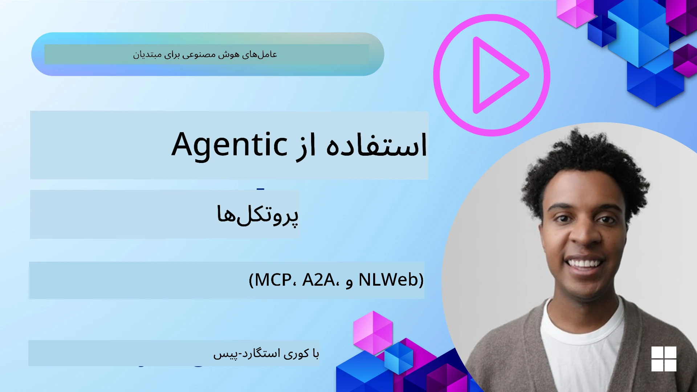
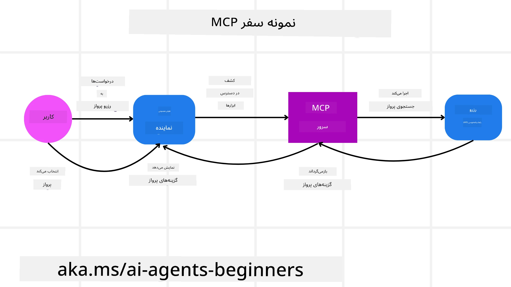
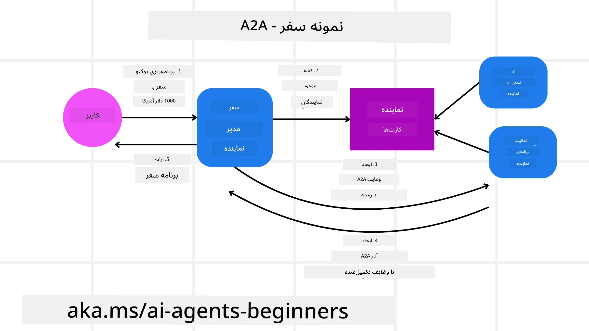
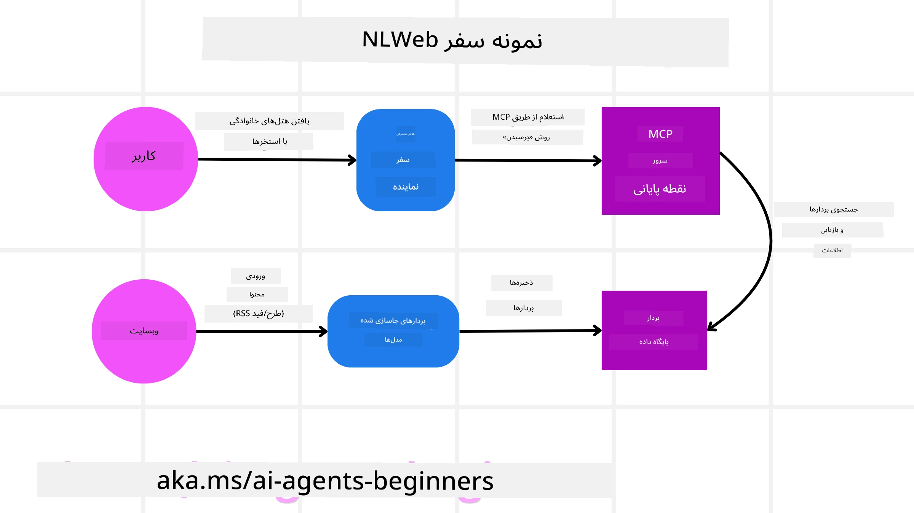

# استفاده از پروتکل‌های عامل‌محور (MCP, A2A و NLWeb)

> _(برای مشاهده ویدئوی این درس روی تصویر بالا کلیک کنید)_

با افزایش استفاده از عامل‌های هوش مصنوعی، نیاز به پروتکل‌هایی که استانداردسازی، امنیت و پشتیبانی از نوآوری باز را تضمین کنند نیز افزایش می‌یابد. در این درس، ما به بررسی ۳ پروتکل می‌پردازیم که در پی رفع این نیاز هستند - Model Context Protocol (MCP)، Agent to Agent (A2A) و Natural Language Web (NLWeb).

## مقدمه

در این درس، ما موارد زیر را پوشش خواهیم داد:

• چگونه **MCP** به عامل‌های هوش مصنوعی اجازه می‌دهد به ابزارها و داده‌های خارجی دسترسی پیدا کنند تا وظایف کاربر را کامل کنند.

• چگونه **A2A** امکان ارتباط و همکاری بین عامل‌های مختلف هوش مصنوعی را فراهم می‌کند.

• چگونه **NLWeb** رابط‌های زبان طبیعی را به هر وب‌سایتی می‌آورد و به عامل‌های هوش مصنوعی اجازه می‌دهد محتوای سایت را کشف و با آن تعامل کنند.

## اهداف یادگیری

• **شناسایی کنید** هدف اصلی و مزایای MCP، A2A و NLWeb را در زمینه عامل‌های هوش مصنوعی.

• **توضیح دهید** چگونه هر پروتکل ارتباط و تعامل بین LLMs، ابزارها و سایر عامل‌ها را تسهیل می‌کند.

• **تشخیص دهید** نقش‌های متمایزی که هر پروتکل در ساخت سیستم‌های عامل‌محور پیچیده ایفا می‌کند.

## Model Context Protocol

**Model Context Protocol (MCP)** یک استاندارد باز است که روش استانداردی برای برنامه‌ها فراهم می‌کند تا زمینه و ابزارها را در اختیار LLMs قرار دهند. این امکان را برای یک «آداپتور جهانی» به منابع داده و ابزارهای مختلف فراهم می‌کند که عامل‌های هوش مصنوعی می‌توانند به صورت سازگار به آنها متصل شوند.

بیایید به اجزای MCP، مزایا در مقایسه با استفاده مستقیم از API، و یک مثال از اینکه چگونه عامل‌های هوش مصنوعی ممکن است از یک سرور MCP استفاده کنند، نگاه کنیم.

### MCP Core Components

MCP بر پایه یک **معماری مشتری-سرور** عمل می‌کند و اجزای اصلی عبارت‌اند از:

• **میزبان‌ها** برنامه‌های LLM هستند (برای مثال یک ویرایشگر کد مانند VSCode) که ارتباط‌ها را با یک سرور MCP آغاز می‌کنند.

• **کلاینت‌ها** اجزایی درون برنامه میزبان هستند که ارتباط‌های یک‌به‌یک با سرورها را نگه می‌دارند.

• **سرورها** برنامه‌های کم‌حجمی هستند که قابلیت‌های مشخصی را در معرض قرار می‌دهند.

در پروتکل سه سازه‌ی اصلی گنجانده شده است که همان قابلیت‌های یک سرور MCP هستند:

• **ابزارها**: این‌ها عملیات یا توابع مجزایی هستند که یک عامل هوش مصنوعی می‌تواند برای انجام یک عمل فراخوانی کند. به عنوان مثال، یک سرویس هواشناسی ممکن است یک ابزار "get weather" را ارائه دهد، یا یک سرور تجارت الکترونیک ممکن است یک ابزار "purchase product" را ارائه دهد. سرورهای MCP در فهرست قابلیت‌های خود نام، توضیحات و طرح‌واره ورودی/خروجی هر ابزار را اعلام می‌کنند.

• **منابع**: این‌ها آیتم‌ها یا اسناد داده‌ای فقط‌خواندنی هستند که یک سرور MCP می‌تواند فراهم کند و کلاینت‌ها می‌توانند آنها را در صورت نیاز واکشی کنند. مثال‌ها شامل محتوای فایل‌ها، رکوردهای پایگاه داده یا فایل‌های لاگ هستند. منابع می‌توانند متنی (مانند کد یا JSON) یا باینری (مانند تصاویر یا PDFs) باشند.

• **پرومپت‌ها**: این‌ها قالب‌های از پیش تعریف‌شده‌ای هستند که پرامپت‌های پیشنهادی را ارائه می‌دهند و اجازه می‌دهند جریان‌های کاری پیچیده‌تری ساخته شوند.

### Benefits of MCP

MCP مزایای قابل‌توجهی برای عامل‌های هوش مصنوعی فراهم می‌آورد:

• **کشف پویا ابزارها**: عامل‌ها می‌توانند به‌صورت پویا فهرستی از ابزارهای در دسترس یک سرور را همراه با توضیحاتی از عملکرد هر کدام دریافت کنند. این با APIهای سنتی که اغلب نیاز به کدنویسی ایستا برای ادغام‌ها دارند در تضاد است؛ به این معنی که هر تغییر در API معمولاً نیاز به به‌روزرسانی کد دارد. MCP رویکرد «یک‌بار ادغام کن» را ارائه می‌دهد که منجر به سازگاری بیشتر می‌شود.

• **تطابق‌پذیری بین مدل‌ها**: MCP در میان مدل‌های LLM مختلف کار می‌کند و انعطاف‌پذیری برای تغییر مدل‌های پایه را جهت ارزیابی عملکرد بهتر فراهم می‌آورد.

• **امنیت استانداردشده**: MCP شامل یک روش احراز هویت استاندارد است که مقیاس‌پذیری هنگام افزودن دسترسی به سرورهای MCP اضافی را بهبود می‌بخشد. این ساده‌تر از مدیریت کلیدها و انواع مختلف احراز هویت برای APIهای سنتی است.

### MCP Example

تصور کنید کاربری می‌خواهد با استفاده از یک دستیار هوش مصنوعی مبتنی بر MCP یک پرواز رزرو کند.

1. **اتصال**: دستیار هوش مصنوعی (کلاینت MCP) به یک سرور MCP ارائه‌شده توسط یک خط هوایی متصل می‌شود.

2. **کشف ابزار**: کلاینت از سرور MCP خط هوایی می‌پرسد: «چه ابزارهایی در دسترس دارید؟» سرور با ابزارهایی مانند "search flights" و "book flights" پاسخ می‌دهد.

3. **فراکخوانی ابزار**: سپس شما از دستیار هوش مصنوعی می‌خواهید: «لطفاً برای پروازی از Portland به Honolulu جستجو کن.» دستیار هوش مصنوعی، با استفاده از LLM خود، تشخیص می‌دهد که نیاز به فراخوانی ابزار "search flights" دارد و پارامترهای مرتبط (مبدا، مقصد) را به سرور MCP ارسال می‌کند.

4. **اجرا و پاسخ**: سرور MCP، در نقش یک درپوش، تماس واقعی را با API داخلی رزرو خط هوایی برقرار می‌کند. سپس اطلاعات پروازی (مثلاً داده‌های JSON) را دریافت کرده و به دستیار هوش مصنوعی بازمی‌گرداند.

5. **تعامل بیشتر**: دستیار هوش مصنوعی گزینه‌های پروازی را به کاربر ارائه می‌دهد. پس از انتخاب یک پرواز توسط کاربر، دستیار ممکن است ابزار "book flight" را روی همان سرور MCP فراخوانی کند و رزرو را تکمیل نماید.

## Agent-to-Agent Protocol (A2A)

در حالی که MCP بر اتصال LLMها به ابزارها تمرکز دارد، **پروتکل Agent-to-Agent (A2A)** یک قدم فراتر می‌رود و امکان ارتباط و همکاری بین عامل‌های مختلف هوش مصنوعی را فراهم می‌کند. A2A عامل‌های هوش مصنوعی را در سازمان‌ها، محیط‌ها و پشته‌های فنی مختلف به هم متصل می‌کند تا یک وظیفه مشترک را کامل کنند.

ما اجزا و مزایای A2A را بررسی می‌کنیم و مثال چگونگی کاربرد آن در برنامه سفرمان را می‌آوریم.

### A2A Core Components

A2A بر فعال‌سازی ارتباط بین عامل‌ها و همکاری آنها برای تکمیل زیروظایف کاربر تمرکز دارد. هر مؤلفه از پروتکل در این فرایند نقش دارد:

#### کارت عامل

مشابه لیستی که یک سرور MCP از ابزارها به اشتراک می‌گذارد، یک کارت عامل شامل:
- نام عامل.
- **توضیحی از وظایف عمومی** که انجام می‌دهد.
- **فهرستی از مهارت‌های مشخص** با توضیحات برای کمک به سایر عامل‌ها (یا حتی کاربران انسانی) تا بفهمند چه زمانی و چرا باید آن عامل را فراخوانی کنند.
- **آدرس Endpoint فعلی** عامل
- **نسخه** و **قابلیت‌های** عامل مانند پاسخ‌های جریان‌یافته و اعلان‌های پوش.

#### مجری عامل

مجری عامل مسئول **انتقال زمینه چت کاربر به عامل راه دور** است؛ عامل راه دور برای درک وظیفه‌ای که باید انجام شود به این زمینه نیاز دارد. در یک سرور A2A، یک عامل از LLM خود برای تحلیل درخواست‌های ورودی و اجرای وظایف با استفاده از ابزارهای داخلی خود استفاده می‌کند.

#### آرتیفکت

وقتی یک عامل راه دور وظیفه‌ درخواست‌شده را تکمیل کرد، محصول کاری آن به‌صورت یک آرتیفکت ایجاد می‌شود. یک آرتیفکت **حاوی نتیجه کار عامل**، **توضیحی از آنچه تکمیل شده** و **زمینه متنی** است که از طریق پروتکل ارسال شده است. پس از ارسال آرتیفکت، ارتباط با عامل راه دور تا زمان نیاز مجدداً بسته می‌شود.

#### صف رویداد

این مؤلفه برای **پردازش به‌روزرسانی‌ها و انتقال پیام‌ها** استفاده می‌شود. این مورد به‌ویژه در محیط‌های تولیدی برای سیستم‌های عامل‌محور اهمیت دارد تا از بسته شدن ارتباط بین عامل‌ها پیش از تکمیل وظیفه جلوگیری شود، مخصوصاً وقتی زمان تکمیل وظایف ممکن است طولانی باشد.

### Benefits of A2A

• **همکاری پیشرفته**: این پروتکل به عامل‌ها از فروشندگان و پلتفرم‌های مختلف اجازه می‌دهد تعامل داشته باشند، زمینه را به اشتراک بگذارند و با هم کار کنند، که خودکارسازی یکپارچه در میان سیستم‌های سنتی منفصل را تسهیل می‌کند.

• **انعطاف‌پذیری در انتخاب مدل**: هر عامل A2A می‌تواند تصمیم بگیرد کدام LLM را برای سرویس‌دهی به درخواست‌های خود استفاده کند، که امکان بهینه‌سازی یا استفاده از مدل‌های فاین‌تیون‌شده برای هر عامل را فراهم می‌آورد، برخلاف اتصال یک‌تنه به یک LLM در برخی سناریوهای MCP.

• **احراز هویت یکپارچه**: احراز هویت مستقیماً در پروتکل A2A ادغام شده است و چارچوب امنیتی محکمی برای تعاملات عامل‌ها فراهم می‌آورد.

### A2A Example

بیایید سناریوی رزرو سفر خود را توسعه دهیم، اما این‌بار با استفاده از A2A.

1. **درخواست کاربر به چندعامل**: کاربر با یک کلاینت/عامل «نماینده سفر» A2A تعامل می‌کند، شاید بگوید: «لطفاً یک سفر کامل به هونولولو برای هفته آینده رزرو کن، شامل پروازها، یک هتل و یک خودرو اجاره‌ای».

2. **هماهنگی توسط نماینده سفر**: نماینده سفر این درخواست پیچیده را دریافت می‌کند. او از LLM خود برای استدلال درباره وظیفه استفاده می‌کند و تعیین می‌کند که نیاز به تعامل با عامل‌های تخصصی دیگر دارد.

3. **ارتباط بین عامل‌ها**: نماینده سفر سپس از پروتکل A2A برای اتصال به عامل‌های پایین‌دست مانند «عامل خطوط هوایی»، «عامل هتل» و «عامل اجاره خودرو» استفاده می‌کند که توسط شرکت‌های مختلف ایجاد شده‌اند.

4. **اجرای وظایف واگذار شده**: نماینده سفر وظایف مشخصی را به این عامل‌های تخصصی می‌فرستد (مثلاً «پروازها به هونولولو را پیدا کن»، «هتلی رزرو کن»، «خودرو اجاره کن»). هر یک از این عامل‌های تخصصی، با استفاده از LLMهای خود و ابزارهای داخلی‌شان (که می‌توانند خود سرورهای MCP باشند)، بخش خاصی از رزرو را انجام می‌دهند.

5. **پاسخ یکپارچه‌شده**: وقتی همه عامل‌های پایین‌دست وظایف خود را کامل کردند، نماینده سفر نتایج را (جزئیات پرواز، تأیید هتل، رزرو اجاره خودرو) گردآوری کرده و یک پاسخ جامع به‌صورت چت به کاربر ارسال می‌کند.

## Natural Language Web (NLWeb)

وب‌سایت‌ها مدت‌ها است که راه اصلی دسترسی کاربران به اطلاعات و داده‌ها در سراسر اینترنت بوده‌اند.

بیایید به اجزای مختلف NLWeb، مزایای NLWeb و یک مثال از نحوه کار NLWeb در برنامه سفر خود نگاهی بیندازیم.

### Components of NLWeb

- **برنامه NLWeb (کد سرویس هسته)**: سیستمی که پرسش‌های زبان طبیعی را پردازش می‌کند. این سیستم بخش‌های مختلف پلتفرم را به هم وصل می‌کند تا پاسخ‌ها ایجاد شوند. می‌توانید آن را به‌عنوان **موتوری که ویژگی‌های زبان طبیعی یک وب‌سایت را تأمین می‌کند** تصور کنید.

- **پروتکل NLWeb**: این یک **مجموعه قوانین پایه برای تعامل زبان طبیعی** با یک وب‌سایت است. این پروتکل پاسخ‌ها را به فرمت JSON بازمی‌گرداند (اغلب با استفاده از Schema.org). هدف آن ایجاد پایه‌ای ساده برای «وب هوش مصنوعی» است، همان‌طور که HTML امکان به اشتراک‌گذاری اسناد آنلاین را فراهم کرد.

- **سرور MCP (نقطه انتهایی Model Context Protocol)**: هر تنظیم NLWeb همچنین به‌عنوان یک **سرور MCP** عمل می‌کند. این به این معنی است که می‌تواند **ابزارها (مانند متد "ask") و داده‌ها** را با سایر سیستم‌های هوش مصنوعی به اشتراک بگذارد. در عمل، این موضوع محتوای وب‌سایت و توانمندی‌های آن را برای عامل‌های هوش مصنوعی قابل‌استفاده می‌کند و اجازه می‌دهد سایت بخشی از «اکوسیستم عامل‌ها» شود.

- **مدل‌های امبدینگ**: این مدل‌ها برای **تبدیل محتوای وب‌سایت به نمایش‌های عددی به نام بردار (امبدینگ)** استفاده می‌شوند. این بردارها معنا را به شکلی ثبت می‌کنند که کامپیوترها بتوانند مقایسه و جستجو انجام دهند. آنها در یک پایگاه داده خاص ذخیره می‌شوند و کاربران می‌توانند مدل امبدینگ مورد نظر خود را انتخاب کنند.

- **پایگاه داده برداری (مکانیزم بازیابی)**: این پایگاه داده **امبدینگ‌های محتوای وب‌سایت را ذخیره می‌کند**. وقتی کسی سوالی می‌پرسد، NLWeb پایگاه داده برداری را بررسی می‌کند تا سریعترین و مرتبط‌ترین اطلاعات را پیدا کند. این پایگاه یک فهرست سریع از پاسخ‌های ممکن را مطابق شباهت ارائه می‌دهد. NLWeb با سیستم‌های مختلف ذخیره‌سازی برداری مانند Qdrant، Snowflake، Milvus، Azure AI Search و Elasticsearch کار می‌کند.

### NLWeb by Example

دوباره وب‌سایت رزرو سفر خود را در نظر بگیرید، اما این‌بار توسط NLWeb قدرت‌یافته است.

1. **ورود داده**: کاتالوگ محصولات موجود در وب‌سایت سفر (مثلاً فهرست پروازها، توضیحات هتل‌ها، بسته‌های تور) با استفاده از Schema.org قالب‌بندی می‌شوند یا از طریق فیدهای RSS بارگذاری می‌شوند. ابزارهای NLWeb این داده‌های ساخت‌یافته را وارد کرده، امبدینگ‌ها را ایجاد کرده و در یک پایگاه داده برداری محلی یا راه دور ذخیره می‌کنند.

2. **پرسش زبان طبیعی (انسان)**: کاربر از وب‌سایت بازدید می‌کند و به‌جای گشتن در منوها، در یک رابط چت تایپ می‌کند: «برای هفته آینده یک هتل خانوادگی در هونولولو با استخر پیدا کن».

3. **پردازش NLWeb**: برنامه NLWeb این پرسش را دریافت می‌کند. آن را برای درک به یک LLM می‌فرستد و هم‌زمان در پایگاه داده برداری خود به دنبال فهرست‌های هتل مرتبط جستجو می‌کند.

4. **نتایج دقیق**: LLM به تفسیر نتایج جستجو از پایگاه داده کمک می‌کند، بهترین تطابق‌ها را بر اساس معیارهای «خانواده‌پسند»، «استخر» و «هونولولو» شناسایی کرده و سپس یک پاسخ به زبان طبیعی فرمت می‌دهد. نکته مهم این است که پاسخ به هتل‌های واقعی از کاتالوگ وب‌سایت اشاره می‌کند و از اطلاعات ساختگی اجتناب می‌کند.

5. **تعامل عامل هوش مصنوعی**: چون NLWeb به عنوان یک سرور MCP عمل می‌کند، یک عامل سفر خارجی می‌تواند به نمونه NLWeb وب‌سایت متصل شود. عامل هوش مصنوعی می‌تواند سپس از متد `ask("Are there any vegan-friendly restaurants in the Honolulu area recommended by the hotel?")` برای پرسش مستقیم از وب‌سایت استفاده کند. نمونه NLWeb این سوال را پردازش می‌کند، از پایگاه داده اطلاعات رستوران (در صورت بارگذاری) بهره می‌برد و یک پاسخ ساختارمند JSON بازمی‌گرداند.

### Got More Questions about MCP/A2A/NLWeb?

به [Microsoft Foundry Discord](https://aka.ms/ai-agents/discord) بپیوندید تا با دیگر یادگیرندگان ملاقات کنید، در ساعات اداری شرکت کنید و سوالات مربوط به عامل‌های هوش مصنوعی خود را پاسخ بگیرید.

## منابع

- [MCP for Beginners](https://aka.ms/mcp-for-beginners)  
- [MCP Documentation](https://learn.microsoft.com/python/api/overview/azure/ai-projects-readme)
- [NLWeb Repo](https://github.com/nlweb-ai/NLWeb)
- [Microsoft Agent Framework](https://aka.ms/ai-agents-beginners/agent-framewrok)

---

<!-- CO-OP TRANSLATOR DISCLAIMER START -->
سلب مسئولیت:
این سند با استفاده از سرویس ترجمهٔ هوش مصنوعی Co-op Translator (https://github.com/Azure/co-op-translator) ترجمه شده است. اگرچه ما در تلاش برای دقت هستیم، لطفاً توجه داشته باشید که ترجمه‌های خودکار ممکن است حاوی خطاها یا نادرستی‌هایی باشند. نسخهٔ اصلی سند به زبان مبدأ باید به عنوان منبع معتبر در نظر گرفته شود. برای اطلاعات حیاتی یا منافع حساس، ترجمهٔ حرفه‌ای توسط انسان توصیه می‌شود. ما در قبال هرگونه سوءتفاهم یا تفسیر نادرست ناشی از استفاده از این ترجمه مسئولیتی نداریم.
<!-- CO-OP TRANSLATOR DISCLAIMER END -->