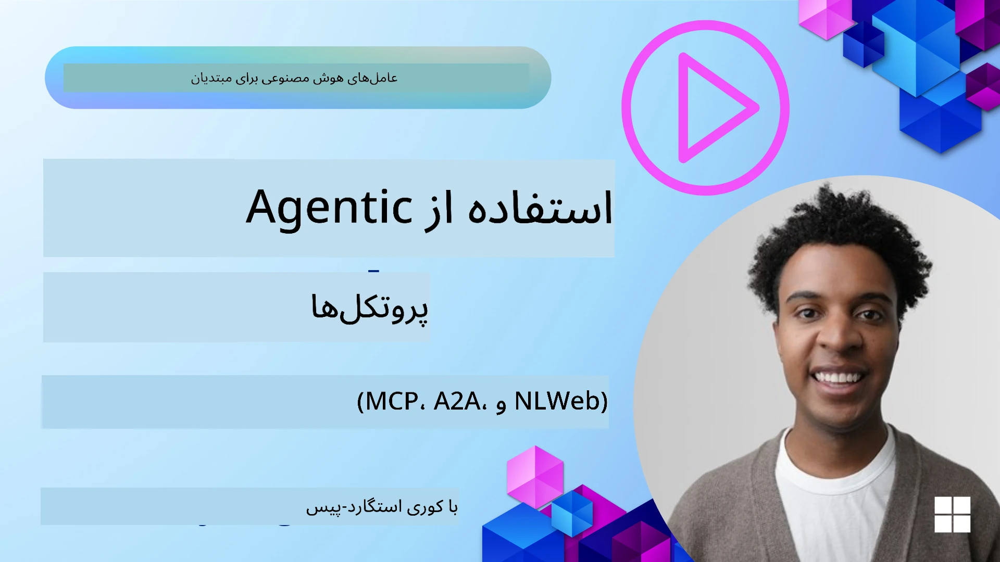
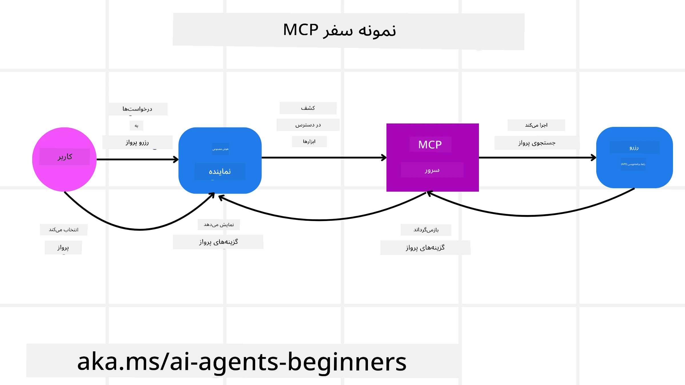
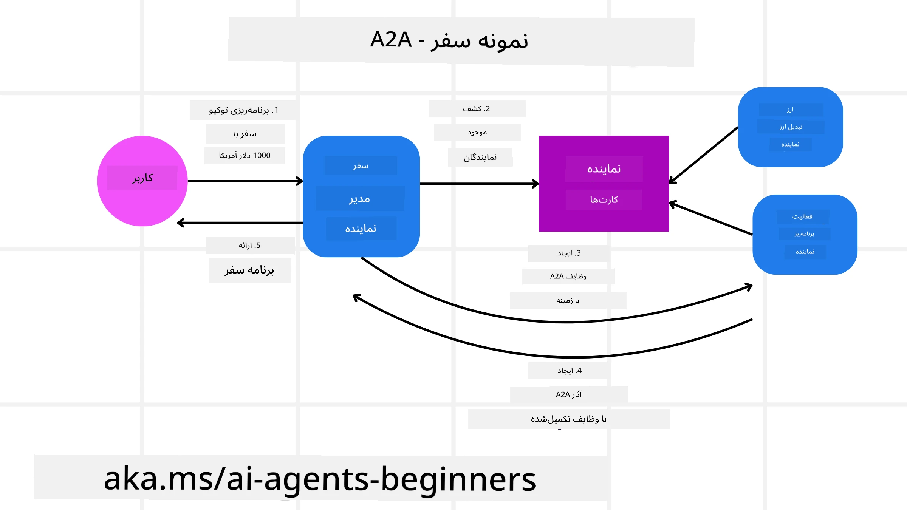
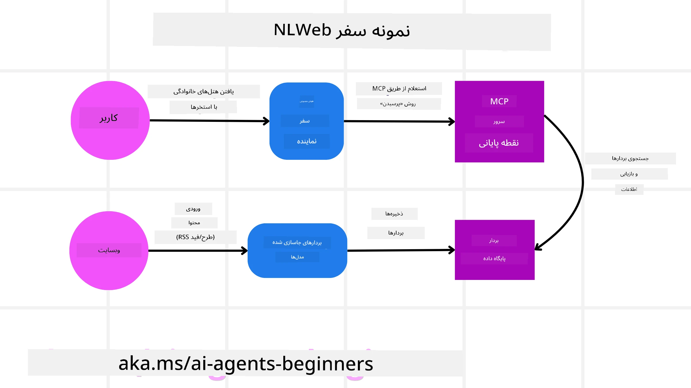

# استفاده از پروتکل‌های عامل‌محور (MCP، A2A و NLWeb)

> _(برای دیدن ویدئوی این درس روی تصویر بالا کلیک کنید)_

با رشد استفاده از عامل‌های هوش مصنوعی، نیاز به پروتکل‌هایی که استانداردسازی، امنیت و پشتیبانی از نوآوری باز را تضمین کنند نیز افزایش یافته است. در این درس، سه پروتکل را بررسی خواهیم کرد که به دنبال برآورده کردن این نیاز هستند - پروتکل زمینه مدل (MCP)، عامل به عامل (A2A) و وب زبان طبیعی (NLWeb).

## مقدمه

در این درس، به موارد زیر می‌پردازیم:

• چگونه **MCP** به عامل‌های هوش مصنوعی امکان دسترسی به ابزارها و داده‌های خارجی برای انجام وظایف کاربر را می‌دهد.

• چگونه **A2A** ارتباط و همکاری بین عامل‌های هوش مصنوعی مختلف را امکان‌پذیر می‌سازد.

• چگونه **NLWeb** رابط‌های زبانی طبیعی را به هر وب‌سایتی می‌آورد و به عامل‌های هوش مصنوعی امکان کشف و تعامل با محتوا را می‌دهد.

## اهداف یادگیری

• **شناسایی** هدف اصلی و مزایای MCP، A2A و NLWeb در زمینه عامل‌های هوش مصنوعی.

• **توضیح** اینکه هر پروتکل چگونه ارتباط و تعامل بین مدل‌های زبان بزرگ (LLM)، ابزارها و سایر عامل‌ها را تسهیل می‌کند.

• **تشخیص** نقش‌های متمایز هر پروتکل در ساخت سیستم‌های عامل‌محور پیچیده.

## پروتکل زمینه مدل

پروتکل زمینه مدل (**Model Context Protocol - MCP**) یک استاندارد باز است که راهی استانداردشده برای فراهم کردن زمینه و ابزارها به مدل‌های زبان بزرگ (LLM) توسط برنامه‌ها فراهم می‌کند. این امکان را می‌دهد که یک "تطبیق‌دهنده جهانی" به منابع داده و ابزارهای مختلف که عامل‌های هوش مصنوعی می‌توانند به صورت سازگار به آن‌ها متصل شوند، ایجاد شود.

بیایید اجزای MCP، مزایای آن نسبت به استفاده مستقیم از API و مثالی از نحوه استفاده عامل‌های هوش مصنوعی از یک سرور MCP را بررسی کنیم.

### اجزای اصلی MCP

MCP بر معماری **کلاینت-سرور** عمل می‌کند و اجزای اصلی آن عبارتند از:

• **میزبان‌ها** برنامه‌های LLM مانند ویرایشگر کد VSCode هستند که ارتباط با سرور MCP را آغاز می‌کنند.

• **کلاینت‌ها** اجزایی درون برنامه میزبان هستند که اتصال یک به یک با سرورها را حفظ می‌کنند.

• **سرورها** برنامه‌های سبک وزنی هستند که قابلیت‌های مشخصی را ارائه می‌دهند.

در این پروتکل سه پرایمیتیو اصلی شامل قابلیت‌های سرور MCP وجود دارد:

• **ابزارها**: این‌ها عملکردها یا اقدامات مجزایی هستند که یک عامل هوش مصنوعی می‌تواند برای انجام عملی فراخوانی کند. به عنوان مثال، یک سرویس هواشناسی ممکن است ابزار "دریافت وضعیت هوا" را ارائه دهد یا سرور یک فروشگاه آنلاین ممکن است ابزار "خرید محصول" را ارائه کند. سرورهای MCP نام، شرح و شمای ورودی/خروجی هر ابزار را در لیست قابلیت‌های خود تبلیغ می‌کنند.

• **منابع**: این‌ها آیتم‌های داده‌ای یا اسنادی فقط خواندنی هستند که سرور MCP می‌تواند فراهم کند و کلاینت‌ها می‌توانند به درخواست آن‌ها را بازیابی کنند. نمونه‌ها شامل محتویات فایل، رکوردهای پایگاه داده یا فایل‌های گزارش می‌شود. منابع می‌توانند متن (مانند کد یا JSON) یا باینری (مانند تصاویر یا PDF) باشند.

• **پرومپت‌ها**: قالب‌های از پیش تعریف‌شده‌ای هستند که پرومپت‌های پیشنهادی را فراهم می‌کنند و امکان گردش کارهای پیچیده‌تر را ایجاد می‌کنند.

### مزایای MCP

MCP مزایای قابل توجهی برای عامل‌های هوش مصنوعی ارائه می‌دهد:

• **کشف دینامیک ابزارها**: عامل‌ها می‌توانند به صورت دینامیک فهرستی از ابزارهای موجود از یک سرور با توضیح کارکرد هر یک دریافت کنند. این برخلاف APIهای سنتی است که معمولاً نیازمند کدنویسی ثابت برای ادغام‌ها هستند، به این معنی که هر تغییر در API نیاز به به‌روزرسانی کد دارد. MCP رویکرد "یک بار ادغام کن" را پیشنهاد می‌کند که انعطاف‌پذیری بالاتری ایجاد می‌کند.

• **تعامل‌پذیری بین LLMها**: MCP در بین مدل‌های زبان بزرگ مختلف کار می‌کند و انعطاف‌پذیری برای تغییر مدل اصلی برای ارزیابی عملکرد بهتر را فراهم می‌آورد.

• **امنیت استانداردشده**: MCP روش احراز هویت استانداردی دارد که مقیاس‌پذیری در افزودن دسترسی به سرورهای MCP اضافی را بهبود می‌بخشد. این ساده‌تر از مدیریت کلیدها و انواع احراز هویت مختلف برای APIهای سنتی مختلف است.

### مثال MCP

تصور کنید یک کاربر می‌خواهد با استفاده از یک دستیار هوش مصنوعی مبتنی بر MCP پرواز رزرو کند.

1. **اتصال**: دستیار هوش مصنوعی (کلاینت MCP) به سرور MCP ارائه‌شده توسط یک خط هواپیمایی متصل می‌شود.

2. **کشف ابزارها**: کلاینت از سرور MCP خط هواپیمایی می‌پرسد: "چه ابزارهایی در دسترس دارید؟" سرور پاسخ می‌دهد با ابزارهایی مانند "جستجوی پرواز" و "رزرو پرواز".

3. **فراخوانی ابزار**: سپس شما از دستیار هوش مصنوعی می‌خواهید: "لطفاً پروازی از پورتلند به هونولولو جستجو کن." دستیار هوش مصنوعی با استفاده از LLM خود تشخیص می‌دهد که باید ابزار "جستجوی پرواز" را فراخوانی کند و پارامترهای مربوطه (مبدا، مقصد) را به سرور MCP ارسال می‌کند.

4. **اجرای عملیات و پاسخ**: سرور MCP که نقش یک پوشش را ایفا می‌کند، تماس واقعی با API داخلی رزرو خط هواپیمایی را برقرار می‌سازد. سپس اطلاعات پرواز (مثلاً داده‌های JSON) را دریافت می‌کند و به دستیار هوش مصنوعی ارسال می‌کند.

5. **تعامل بیشتر**: دستیار هوش مصنوعی گزینه‌های پرواز را ارائه می‌دهد. پس از انتخاب یک پرواز توسط شما، ممکن است دستیار ابزار "رزرو پرواز" را در همان سرور MCP فراخوانی کند و رزرو را تکمیل کند.

## پروتکل عامل به عامل (A2A)

در حالی که MCP بر اتصال LLMها به ابزارها تمرکز دارد، پروتکل **عامل به عامل (A2A)** یک گام فراتر می‌رود و ارتباط و همکاری بین عامل‌های هوش مصنوعی مختلف را ممکن می‌سازد. A2A عامل‌های هوش مصنوعی را در سازمان‌ها، محیط‌ها و تکنولوژی‌های مختلف به هم متصل می‌کند تا یک کار مشترک را انجام دهند.

ما اجزا و مزایای A2A را بررسی خواهیم کرد و مثالی از کاربرد آن در برنامه سفرمان ارائه خواهیم داد.

### اجزای اصلی A2A

A2A بر توانمندسازی ارتباط بین عامل‌ها و همکاری آن‌ها برای انجام یک زیرکار کاربر تمرکز دارد. هر جزء پروتکل در این امر نقش دارد:

#### کارت عامل

مشابه نحوه اشتراک‌گذاری لیست ابزارها توسط سرور MCP، یک کارت عامل شامل:
- نام عامل.
- **توصیف کلی وظایفی** که انجام می‌دهد.
- **فهرستی از مهارت‌های خاص** با توضیحاتی برای کمک به سایر عامل‌ها (یا حتی کاربران انسانی) برای درک زمان و دلیل فراخوانی آن عامل.
- **آدرس فعلی Endpoint** عامل
- **نسخه** و **قابلیت‌ها**ی عامل مانند پاسخ‌های استریمینگ و اعلان‌های پوش.

#### اجراکننده عامل

اجراکننده عامل مسئول **انتقال زمینه چت کاربر به عامل از راه دور** است، زیرا عامل از راه دور برای درک کاری که باید انجام شود به این زمینه نیاز دارد. در یک سرور A2A، عامل با استفاده از مدل زبان بزرگ (LLM) خود درخواست‌های ورودی را تحلیل و وظایف را با استفاده از ابزارهای داخلی خود اجرا می‌کند.

#### ساخته (Artifact)

وقتی عامل از راه دور کار درخواستی را تکمیل می‌کند، نتیجه کار او به صورت یک ساخته ایجاد می‌شود. یک ساخته **شامل نتیجه کار عامل**، **توضیحی از کاری که انجام شده** و **متن زمینه** ارسال‌شده از طریق پروتکل است. پس از ارسال ساخته، اتصال با عامل از راه دور بسته می‌شود تا دوباره نیاز شود.

#### صف رویداد

این جزء برای **مدیریت به‌روزرسانی‌ها و انتقال پیام‌ها** استفاده می‌شود. در محیط تولید، این بخش اهمیت زیادی دارد تا اطمینان حاصل شود اتصال بین عامل‌ها پیش از تکمیل کار بسته نمی‌شود، به ویژه وقتی انجام کار ممکن است زمان‌بر باشد.

### مزایای A2A

• **همکاری بهبود یافته**: امکان تعامل، اشتراک زمینه و همکاری بین عامل‌ها از فروشندگان و پلتفرم‌های مختلف را فراهم می‌کند که باعث خودکارسازی یکپارچه در سیستم‌های معمولاً جدا افتاده می‌شود.

• **انعطاف‌پذیری انتخاب مدل**: هر عامل A2A می‌تواند تصمیم بگیرد که از کدام LLM برای پاسخ‌گویی به درخواست‌ها استفاده کند، که امکان استفاده از مدل‌های بهینه یا تنظیم‌شده خاص هر عامل را فراهم می‌کند، برخلاف اتصال تک‌مدلی در برخی سناریوهای MCP.

• **احراز هویت داخلی**: احراز هویت مستقیماً در پروتکل A2A ادغام شده است و چارچوب امنیتی قوی برای تعامل عامل‌ها فراهم می‌کند.

### مثال A2A

بیایید سناریوی رزرو سفرمان را گسترش دهیم، اما این بار با استفاده از A2A.

1. **درخواست کاربر به چند عامل**: کاربر با یک کلاینت/عامل A2A "عامل سفر" تعامل می‌کند، شاید با گفتن "لطفاً یک سفر کامل به هونولولو برای هفته آینده رزرو کن، شامل پروازها، هتل و خودرو کرایه‌ای".

2. **هماهنگی توسط عامل سفر**: عامل سفر این درخواست پیچیده را دریافت می‌کند. با استفاده از LLM خود درباره کار استدلال می‌کند و تعیین می‌کند که باید با سایر عامل‌های تخصصی تعامل کند.

3. **ارتباط بین عامل‌ها**: سپس عامل سفر با استفاده از پروتکل A2A به عامل‌های پایین‌دست، مانند "عامل هواپیمایی"، "عامل هتل" و "عامل اجاره خودرو" که توسط شرکت‌های مختلف ایجاد شده‌اند، متصل می‌شود.

4. **واگذاری اجرای وظایف**: عامل سفر وظایف مشخصی به این عامل‌های تخصصی ارسال می‌کند (مثلاً "یافتن پرواز به هونولولو"، "رزرو هتل"، "کرایه خودرو"). هر یک از این عامل‌های تخصصی با اجرای مدل‌های LLM خود و استفاده از ابزارهایشان (که می‌تواند سرورهای MCP نیز باشند) بخش خاص خود از رزرو را انجام می‌دهند.

5. **پاسخ تجمیع شده**: وقتی همه عامل‌های پایین‌دست وظایفشان را تکمیل کردند، عامل سفر نتایج (اطلاعات پرواز، تأیید هتل، رزرو خودرو) را جمع‌آوری کرده و پاسخ گفتگوئی کامل را به کاربر ارسال می‌کند.

## وب زبان طبیعی (NLWeb)

وب‌سایت‌ها مدت‌هاست راه اصلی دسترسی کاربران به اطلاعات و داده‌ها در اینترنت هستند.

بیایید اجزای مختلف NLWeb، مزایای آن و مثالی از کارکرد NLWeb را از طریق برنامه سفرمان بررسی کنیم.

### اجزای NLWeb

- **برنامه NLWeb (کد سرویس اصلی)**: سیستمی که سوالات زبان طبیعی را پردازش می‌کند. قسمت‌های مختلف پلتفرم را به هم متصل می‌کند تا پاسخ‌ها ایجاد شوند. می‌توانید آن را به عنوان **موتوری که ویژگی‌های زبان طبیعی وب‌سایت را فراهم می‌کند** تصور کنید.

- **پروتکل NLWeb**: مجموعه‌ای **قوانین پایه برای تعامل زبانی طبیعی** با یک وب‌سایت است. پاسخ‌ها را به فرمت JSON (اغلب با استفاده از Schema.org) ارسال می‌کند. هدف ایجاد پایه‌ای ساده برای "وب هوش مصنوعی" است، همان‌طور که HTML امکان اشتراک‌گذاری اسناد را به صورت آنلاین فراهم کرد.

- **سرور MCP (نقطه پایانی پروتکل زمینه مدل)**: هر تنظیم NLWeb همچنین به عنوان یک **سرور MCP** کار می‌کند. این یعنی می‌تواند **ابزارهایی مانند متد "ask" و داده‌ها** را با سیستم‌های هوش مصنوعی دیگر به اشتراک بگذارد. در عمل، این محتوا و قابلیت‌های وب‌سایت را قابل استفاده برای عامل‌های هوش مصنوعی می‌سازد و سایت را بخشی از "اکوسیستم عامل‌ها" می‌کند.

- **مدل‌های امبدینگ (Embedding Models)**: این مدل‌ها برای **تبدیل محتوای وب‌سایت به نمایش‌های عددی به نام بردارها (امبدینگ‌ها)** استفاده می‌شوند. این بردارها معنا را به گونه‌ای که کامپیوتر بتواند مقایسه و جستجو کند، ضبط می‌کنند. در یک پایگاه داده خاص ذخیره می‌شوند و کاربران می‌توانند مدل امبدینگ موردنظر خود را انتخاب کنند.

- **پایگاه داده برداری (مکانیزم بازیابی)**: این پایگاه داده **امبدینگ‌های محتوای وب‌سایت را ذخیره می‌کند**. وقتی کسی سوالی می‌پرسد، NLWeb پایگاه داده برداری را بررسی می‌کند تا سریع‌ترین و مرتبط‌ترین اطلاعات را بیابد. فهرستی سریع از پاسخ‌های ممکن بر اساس شباهت ارائه می‌دهد. NLWeb با سیستم‌های ذخیره برداری مختلف مانند Qdrant، Snowflake، Milvus، Azure AI Search و Elasticsearch کار می‌کند.

### مثال NLWeb

دوباره به وب‌سایت رزرو سفرمان توجه کنید، اما این بار با پشتیبانی NLWeb.

1. **ورودی داده‌ها**: کاتالوگ‌های محصولات موجود سایت سفر (مانند فهرست پروازها، توصیف هتل‌ها، بسته‌های تور) با استفاده از Schema.org قالب‌بندی شده یا از طریق فیدهای RSS بارگذاری می‌شوند. ابزارهای NLWeb این داده‌های ساختاریافته را جذب کرده، امبدینگ‌ها را ایجاد می‌کنند و آن‌ها را در پایگاه داده برداری محلی یا راه دور ذخیره می‌کنند.

2. **پرس‌وجوی زبان طبیعی (انسان)**: کاربر وارد وب‌سایت می‌شود و به جای حرکت در منوها، در رابط گفتگو تایپ می‌کند: "برای هفته آینده هتل خانوادگی با استخر در هونولولو پیدا کن".

3. **پردازش توسط NLWeb**: برنامه NLWeb این پرس‌وجو را دریافت می‌کند. آن را به مدل زبان بزرگ (LLM) می‌فرستد تا فهمیده شود و همزمان پایگاه داده برداری خود را برای یافتن فهرست‌های هتل مرتبط جستجو می‌کند.

4. **نتایج دقیق**: LLM به تفسیر نتایج جستجو از پایگاه داده کمک می‌کند، بهترین همخوانی‌ها را بر اساس معیارهای "خانوادگی"، "استخر" و "هونولولو" شناسایی می‌کند و پاسخ زبان طبیعی را قالب‌بندی می‌کند. نکته مهم این است که پاسخ به هتل‌های واقعی از کاتالوگ وب‌سایت اشاره دارد و از اطلاعات ساختگی اجتناب می‌کند.

5. **تعامل عامل هوش مصنوعی**: چون NLWeb به عنوان یک سرور MCP عمل می‌کند، یک عامل هوش مصنوعی خارجی سفر می‌تواند به نمونه NLWeb این وب‌سایت متصل شود. عامل هوش مصنوعی می‌تواند متد `ask` MCP را برای پرس‌وجو مستقیم از سایت استفاده کند: `ask("آیا رستوران‌های دوستدار وگان در منطقه هونولولو که توسط هتل توصیه شده باشند وجود دارد؟")`. نمونه NLWeb این را پردازش کرده و با بهره‌گیری از پایگاه داده اطلاعات رستوران‌ها (اگر بارگذاری شده باشد) پاسخ ساختاری JSON را بازمی‌گرداند.

### سوالات بیشتری درباره MCP/A2A/NLWeb دارید؟

به [سرور Discord مایکروسافت فاندری](https://discord.com/invite/ATgtXmAS5D) بپیوندید تا با سایر یادگیرندگان ملاقات کنید، در ساعت‌های اداری شرکت کنید و سوالات خود درباره عامل‌های هوش مصنوعی را پاسخ بگیرید.

## منابع

- [MCP برای مبتدیان](https://aka.ms/mcp-for-beginners)  
- [مستندات MCP](https://learn.microsoft.com/python/api/overview/azure/ai-projects-readme)
- [مخزن NLWeb](https://github.com/nlweb-ai/NLWeb)
- [چارچوب عامل مایکروسافت](https://learn.microsoft.com/en-us/agent-framework/overview/?wt.mc_id=youtube_26688_organicsocial_reactor&pivots=programming-language-python)

## درس قبلی

[عامل‌های هوش مصنوعی در تولید](../10-ai-agents-production/README.md)

## درس بعدی

[مهندسی زمینه برای عامل‌های هوش مصنوعی](../12-context-engineering/README.md)

---

<!-- CO-OP TRANSLATOR DISCLAIMER START -->
**سلب مسئولیت**:
این سند با استفاده از سرویس ترجمه هوش مصنوعی [Co-op Translator](https://github.com/Azure/co-op-translator) ترجمه شده است. در حالی که ما در تلاش برای دقت هستیم، لطفاً توجه داشته باشید که ترجمه‌های خودکار ممکن است شامل خطاها یا نادرستی‌هایی باشند. سند اصلی به زبان مادری خود باید به عنوان منبع معتبر در نظر گرفته شود. برای اطلاعات حیاتی، ترجمه حرفه‌ای انسانی توصیه می‌شود. ما در قبال هرگونه سوء تفاهم یا برداشت نادرست ناشی از استفاده از این ترجمه مسئولیتی نداریم.
<!-- CO-OP TRANSLATOR DISCLAIMER END -->