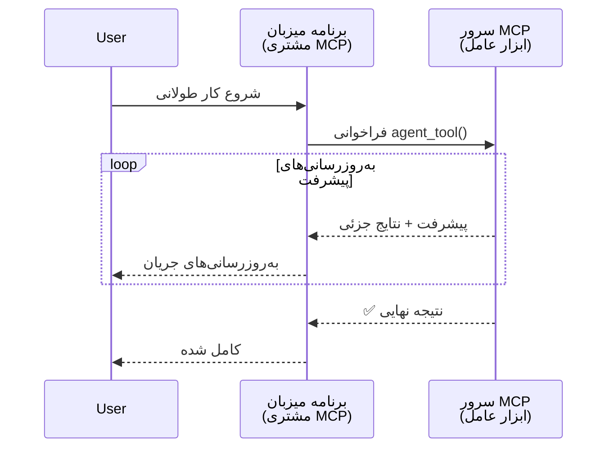
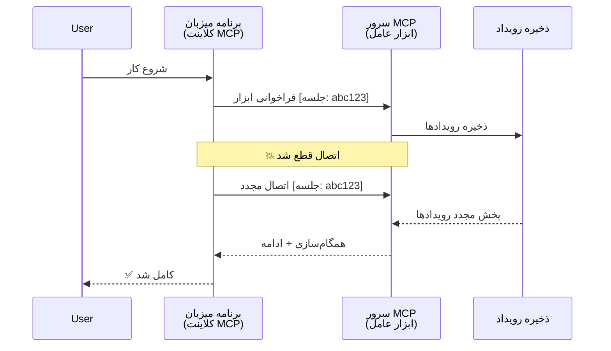
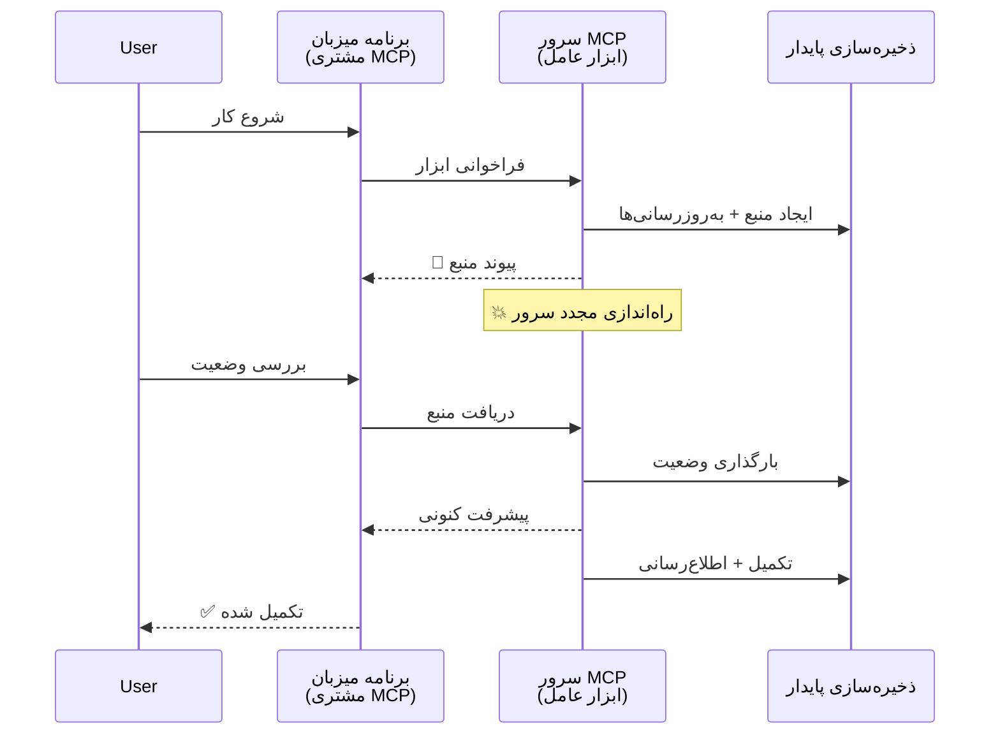
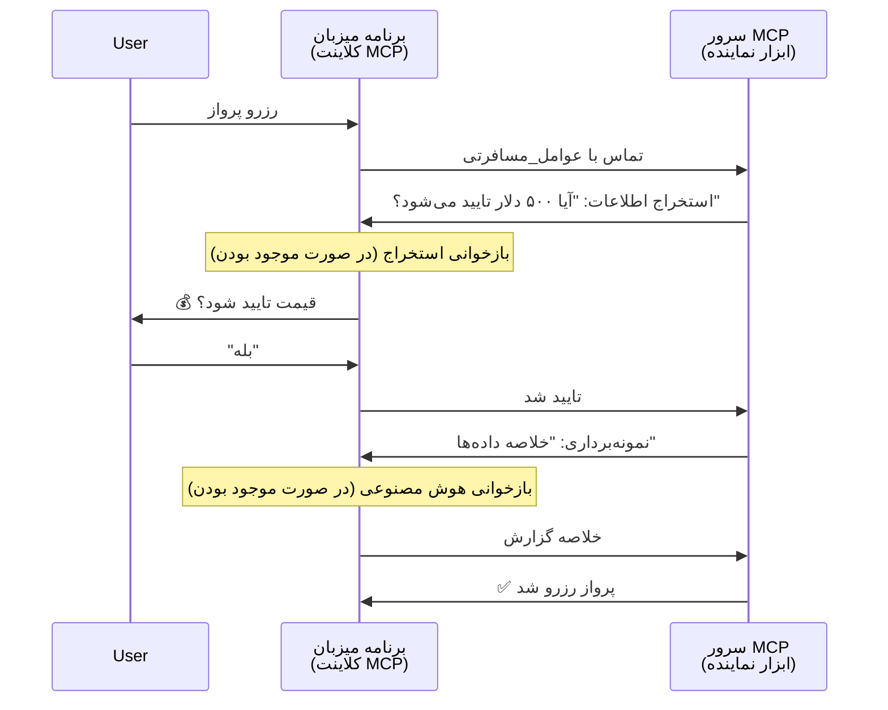

# ساخت سیستم‌های ارتباط عامل به عامل با MCP

> خلاصه - آیا می‌توانید ارتباط عامل2عامل را روی MCP بسازید؟ بله!

MCP فراتر از هدف اولیه خود «ارائه زمینه به LLMها» به طور قابل توجهی تکامل یافته است. با افزودنی‌های اخیر شامل [جریان‌های قابل ازسرگیری](https://modelcontextprotocol.io/docs/concepts/transports#resumability-and-redelivery)، [الیسیتیشن](https://modelcontextprotocol.io/specification/2025-06-18/client/elicitation)، [نمونه‌برداری](https://modelcontextprotocol.io/specification/2025-06-18/client/sampling) و اعلان‌ها ([پیشرفت](https://modelcontextprotocol.io/specification/2025-06-18/basic/utilities/progress) و [منابع](https://modelcontextprotocol.io/specification/2025-06-18/schema#resourceupdatednotification))، MCP اکنون پایه‌ای مستحکم برای ساخت سیستم‌های پیچیده ارتباط عامل به عامل فراهم می‌کند.

## برداشت نادرست در مورد عامل/ابزار

با گسترش کاوش توسعه‌دهندگان در ابزارهایی با رفتارهای عاملی (اجرای طولانی‌مدت، نیاز به ورودی اضافی در میانه اجرا و غیره)، برداشت رایجی وجود دارد که MCP نامناسب است، عمدتاً به این دلیل که نمونه‌های اولیه ابزارهای آن بر الگوهای ساده درخواست-پاسخ متمرکز بودند.

این تصور قدیمی است. مشخصات MCP در چند ماه گذشته به طور قابل توجهی بهبود یافته است با قابلیت‌هایی که فاصله برای ساخت رفتارهای عاملی طولانی‌مدت را پر می‌کند:

- **جریان‌دهی و نتایج جزئی**: به‌روزرسانی‌های پیشرفت در زمان واقعی طی اجرا
- **قابلیت ازسرگیری**: مشتریان می‌توانند پس از قطع ارتباط دوباره متصل شوند و ادامه دهند
- **پایداری**: نتایج پس از راه‌اندازی مجدد سرور حفظ می‌شوند (مثلاً از طریق لینک‌های منابع)
- **چندنوبتی**: ورودی تعاملی در میانه اجرا از طریق الیسیتیشن و نمونه‌برداری

این قابلیت‌ها را می‌توان برای فعال‌سازی برنامه‌های عاملی پیچیده و چندعاملی، همه مستقر شده روی پروتکل MCP، ترکیب کرد.

به عنوان مرجع، ما یک عامل را به عنوان "ابزاری" که روی سرور MCP موجود است، تعریف می‌کنیم. این نشان‌دهنده وجود یک برنامه میزبان است که یک کلاینت MCP را پیاده‌سازی می‌کند که جلسه‌ای با سرور MCP برقرار می‌کند و می‌تواند عامل را فراخوانی کند.

## چه چیزی یک ابزار MCP را «عاملی» می‌کند؟

پیش از ورود به پیاده‌سازی، بیایید مشخص کنیم چه قابلیت‌های زیرساختی برای پشتیبانی از عوامل بلندمدت لازم است.

> ما عامل را موجودیتی تعریف می‌کنیم که می‌تواند به طور خودمختار در مدت طولانی فعالیت کند، قادر به انجام وظایف پیچیده که ممکن است نیازمند تعاملات متعدد یا تنظیمات بر اساس بازخورد در زمان واقعی باشد.

### ۱. جریان‌دهی و نتایج جزئی

الگوهای سنتی درخواست-پاسخ برای وظایف طولانی‌مدت کار نمی‌کنند. عوامل باید ارائه دهند:

- به‌روزرسانی‌های پیشرفت در زمان واقعی
- نتایج موقت

**پشتیبانی MCP**: اعلان‌های به‌روزرسانی منابع اجازه می‌دهند نتایج جزئی به صورت جریانی ارائه شوند، اگرچه این نیازمند طراحی دقیق است تا با مدل درخواست/پاسخ ۱:۱ JSON-RPC تضاد نداشته باشد.

| ویژگی                       | مورد استفاده                                                                                                                                  | پشتیبانی MCP                                                                             |
| -------------------------- | --------------------------------------------------------------------------------------------------------------------------------------------- | ----------------------------------------------------------------------------------------- |
| به‌روزرسانی‌های پیشرفت در زمان واقعی | کاربر وظیفه مهاجرت کد را درخواست می‌دهد. عامل پیشرفت را به شکل جریان‌دهی ارائه می‌دهد: "۱۰٪ - تحلیل وابستگی‌ها... ۲۵٪ - تبدیل فایل‌های TypeScript... ۵۰٪ - به‌روزرسانی ایمپورت‌ها..." | ✅ اعلان‌های پیشرفت                                                                        |
| نتایج جزئی                 | وظیفه «تولید یک کتاب» نتایج جزئی را به صورت جریان ارائه می‌دهد، مثلاً ۱) طرح کلی داستان، ۲) فهرست فصل‌ها، ۳) هر فصل پس از تکمیل. میزبان می‌تواند در هر مرحله بازرسی، لغو یا هدایت کند. | ✅ اعلان‌ها می‌توانند «گسترش» یابند تا نتایج جزئی را شامل شوند، ببینید پیشنهادهای PR 383, 776 |

<div align="center" style="font-style: italic; font-size: 0.95em; margin-bottom: 0.5em;">
<strong>شکل ۱:</strong> این نمودار نشان می‌دهد چگونه یک عامل MCP پیشرفت و نتایج جزئی در زمان واقعی را در طی یک وظیفه بلندمدت به برنامه میزبان جریانی ارسال می‌کند و به کاربر اجازه می‌دهد اجرای کار را به زمان واقعی نظارت کند.
</div>



### ۲. قابلیت ازسرگیری

عوامل باید به آرامی قطعی‌های شبکه را مدیریت کنند:

- اتصال مجدد پس از قطع ارتباط (کلاینت)
- ادامه از جایی که متوقف شده‌اند (ارسال دوباره پیام)

**پشتیبانی MCP**: حمل و نقل StreamableHTTP در MCP امروز از ازسرگیری جلسه و ارسال مجدد پیام‌ها با شناسه‌های نشست و آخرین شناسه رویداد پشتیبانی می‌کند. نکته مهم این است که سرور باید یک EventStore پیاده‌سازی کند که امکان پخش مجدد رویدادها را هنگام اتصال مجدد کلاینت فراهم کند.
توجه کنید که یک پیشنهاد جامعه (PR #975) وجود دارد که جریان‌های قابل ازسرگیری بدون وابستگی به حمل و نقل را بررسی می‌کند.

| ویژگی          | مورد استفاده                                                                                                                                            | پشتیبانی MCP                                                        |
| -------------- | ------------------------------------------------------------------------------------------------------------------------------------------------------- | ------------------------------------------------------------------ |
| قابلیت ازسرگیری | کلاینت در حین وظیفه بلندمدت قطع می‌شود. هنگام اتصال مجدد، جلسه از جایی که قطع شده با پخش رویدادهای از دست رفته ادامه می‌یابد.                            | ✅ حمل و نقل StreamableHTTP با شناسه‌های نشست، پخش رویداد و EventStore |

<div align="center" style="font-style: italic; font-size: 0.95em; margin-bottom: 0.5em;">
<strong>شکل ۲:</strong> این نمودار نشان می‌دهد که چگونه حمل و نقل StreamableHTTP و فروشگاه رویداد MCP ازسرگیری بی‌وقفه جلسه را ممکن می‌سازند: اگر کلاینت قطع شود، می‌تواند مجدداً متصل شده و رویدادهای از دست رفته را بازپخش کند و وظیفه را بدون از دست دادن پیشرفت ادامه دهد.
</div>



### ۳. پایداری

عوامل بلندمدت نیازمند وضعیت پایدار هستند:

- نتایج پس از راه‌اندازی مجدد سرور زنده می‌مانند
- وضعیت می‌تواند به صورت غیرهمزمان بازیابی شود
- پیگیری پیشرفت بین جلسات

**پشتیبانی MCP**: MCP اکنون از نوع بازگشتی لینک منبع برای فراخوانی ابزارها پشتیبانی می‌کند. یک الگوی ممکن طراحی ابزاری است که یک منبع ایجاد کرده و بلافاصله لینک آن را برمی‌گرداند. ابزار می‌تواند در پس‌زمینه به رسیدگی به وظیفه ادامه داده و منبع را به‌روزرسانی کند. کلاینت نیز می‌تواند انتخاب کند وضعیت این منبع را به صورت دوره‌ای بررسی کند تا نتایج جزئی یا کامل دریافت کند (بسته به به‌روزرسانی‌های منبع ارائه شده) یا برای اعلان‌های به‌روزرسانی در منبع مشترک شود.

یک محدودیت این است که نظرسنجی منابع یا اشتراک برای به‌روزرسانی‌ها می‌تواند منابعی مصرف کند که در مقیاس بزرگ پیامدهایی دارد. یک پیشنهاد جامعه باز (شامل شماره ۹۹۲) امکان افزودن وب‌هوک‌ها یا تحریک‌کننده‌هایی را بررسی می‌کند که سرور می‌تواند برای اطلاع‌رسانی به کلاینت/برنامه میزبان فراخوانی کند.

| ویژگی       | مورد استفاده                                                                                                                                        | پشتیبانی MCP                                                    |
| ----------- | --------------------------------------------------------------------------------------------------------------------------------------------------- | ---------------------------------------------------------------- |
| پایداری     | سرور در حین وظیفه مهاجرت داده‌ها کرش می‌کند. نتایج و پیشرفت حفظ شده، مشتری می‌تواند وضعیت را بررسی کرده و از منبع پایدار ادامه دهد.                 | ✅ لینک‌های منابع با ذخیره‌سازی و اعلان‌های وضعیت پایدار       |

امروز، الگوی رایج این است که ابزاری طراحی شود که منبعی ایجاد کند و بلافاصله لینک منبع را برگرداند. ابزار می‌تواند در پس‌زمینه به وظیفه رسیدگی کند، اعلان‌های منبع که به عنوان به‌روزرسانی پیشرفت یا نتایج جزئی عمل می‌کنند را صادر کند و محتویات منبع را در صورت نیاز به‌روزرسانی کند.

<div align="center" style="font-style: italic; font-size: 0.95em; margin-bottom: 0.5em;">
<strong>شکل ۳:</strong> این نمودار نشان می‌دهد چگونه عوامل MCP از منابع پایدار و اعلان‌های وضعیت برای اطمینان از بقا وظایف بلندمدت پس از راه‌اندازی مجدد سرور استفاده می‌کنند، اجازه می‌دهد مشتریان پیشرفت را بررسی کرده و نتایج را حتی پس از خرابی‌ها بازیابی کنند.
</div>



### ۴. تعاملات چندنوبتی

عوامل اغلب به ورودی اضافی در میانه اجرا نیاز دارند:

- روشن‌سازی یا تأیید انسانی
- کمک هوش مصنوعی در تصمیم‌گیری‌های پیچیده
- تنظیم پویا پارامترها

**پشتیبانی MCP**: به طور کامل از طریق نمونه‌برداری (برای ورودی هوش مصنوعی) و الیسیتیشن (برای ورودی انسانی) پشتیبانی می‌شود.

| ویژگی                  | مورد استفاده                                                                                                                               | پشتیبانی MCP                                          |
| ---------------------- | ------------------------------------------------------------------------------------------------------------------------------------------ | ------------------------------------------------------ |
| تعاملات چندنوبتی       | عامل رزرو سفر تأیید قیمت را از کاربر درخواست می‌کند، سپس از هوش مصنوعی می‌خواهد داده‌های سفر را قبل از نهایی کردن رزرو خلاصه کند.           | ✅ الیسیتیشن برای ورودی انسانی، نمونه‌برداری برای ورودی AI |

<div align="center" style="font-style: italic; font-size: 0.95em; margin-bottom: 0.5em;">
<strong>شکل ۴:</strong> این نمودار نشان می‌دهد چگونه عوامل MCP می‌توانند به صورت تعاملی از ورودی انسانی الیسیت کنند یا کمک AI را در میانه اجرا درخواست دهند، پشتیبانی از جریان‌های کاری پیچیده چندنوبتی مانند تأییدها و تصمیم‌گیری‌های پویا.
</div>



## پیاده‌سازی عوامل بلندمدت روی MCP - مرور کد

در این مقاله، یک [مخزن کد](https://github.com/victordibia/ai-tutorials/tree/main/MCP%20Agents) ارائه می‌دهیم که پیاده‌سازی کامل عوامل بلندمدت را با استفاده از SDK پایتون MCP با حمل و نقل StreamableHTTP برای ازسرگیری جلسه و ارسال مجدد پیام‌ها در بر دارد. این پیاده‌سازی نشان می‌دهد چگونه قابلیت‌های MCP می‌توانند ترکیب شده تا رفتارهای عاملی پیچیده‌ای را فعال کنند.

به طور مشخص، سروری با دو ابزار عامل اصلی پیاده‌سازی می‌کنیم:

- **عامل سفر** - شبیه‌سازی سرویس رزرو سفر با تأیید قیمت از طریق الیسیتیشن
- **عامل تحقیق** - انجام وظایف تحقیقاتی با خلاصه‌های کمکی هوش مصنوعی از طریق نمونه‌برداری

هر دو عامل به‌روزرسانی پیشرفت زمان واقعی، تأییدات تعاملی و قابلیت‌های کامل ازسرگیری جلسه را نشان می‌دهند.

### مفاهیم کلیدی پیاده‌سازی

بخش‌های بعدی پیاده‌سازی عامل سروری و مدیریت میزبان کلاینت برای هر قابلیت را نشان می‌دهند:

#### جریان‌دهی و به‌روزرسانی‌های پیشرفت - وضعیت وظیفه در زمان واقعی

جریان‌دهی امکان ارائه به‌روزرسانی‌های پیشرفت در زمان واقعی در طی وظایف بلندمدت را فراهم می‌کند و کاربران را از وضعیت و نتایج میانجی مطلع نگه می‌دارد.

**پیاده‌سازی سرور (عامل اعلان‌های پیشرفت می‌فرستد):**

```python
# از server/server.py - نماینده مسافرتی که به‌روزرسانی‌های پیشرفت را ارسال می‌کند
for i, step in enumerate(steps):
    await ctx.session.send_progress_notification(
        progress_token=ctx.request_id,
        progress=i * 25,
        total=100,
        message=step,
        related_request_id=str(ctx.request_id)
    )
    await anyio.sleep(2)  # شبیه‌سازی کار

# جایگزین: ثبت پیام‌ها برای به‌روزرسانی‌های دقیق گام‌به‌گام
await ctx.session.send_log_message(
    level="info",
    data=f"Processing step {current_step}/{steps} ({progress_percent}%)",
    logger="long_running_agent",
    related_request_id=ctx.request_id,
)
```

**پیاده‌سازی مشتری (میزبان به‌روزرسانی‌های پیشرفت را دریافت می‌کند):**

```python
# از client/client.py - مدیریت اعلان‌های زمان واقعی توسط کلاینت
async def message_handler(message) -> None:
    if isinstance(message, types.ServerNotification):
        if isinstance(message.root, types.LoggingMessageNotification):
            console.print(f"📡 [dim]{message.root.params.data}[/dim]")
        elif isinstance(message.root, types.ProgressNotification):
            progress = message.root.params
            console.print(f"🔄 [yellow]{progress.message} ({progress.progress}/{progress.total})[/yellow]")

# ثبت کننده‌ پیام هنگام ایجاد جلسه
async with ClientSession(
    read_stream, write_stream,
    message_handler=message_handler
) as session:
```

#### الیسیتیشن - درخواست ورودی کاربر

الیسیتیشن امکان درخواست ورودی کاربر را در میانه اجرا فراهم می‌کند. این برای تأییدها، روشن‌سازی یا موافقت‌ها در طی وظایف بلندمدت ضروری است.

**پیاده‌سازی سرور (عامل درخواست تأیید می‌کند):**

```python
# از server/server.py - نماینده سفر درخواست تأیید قیمت
elicit_result = await ctx.session.elicit(
    message=f"Please confirm the estimated price of $1200 for your trip to {destination}",
    requestedSchema=PriceConfirmationSchema.model_json_schema(),
    related_request_id=ctx.request_id,
)

if elicit_result and elicit_result.action == "accept":
    # ادامه با رزرو
    logger.info(f"User confirmed price: {elicit_result.content}")
elif elicit_result and elicit_result.action == "decline":
    # لغو رزرو
    booking_cancelled = True
```

**پیاده‌سازی مشتری (میزبان کال‌بک الیسیتیشن را فراهم می‌کند):**

```python
# از client/client.py - مدیریت درخواست‌های استخراج از سمت کاربر
async def elicitation_callback(context, params):
    console.print(f"💬 Server is asking for confirmation:")
    console.print(f"   {params.message}")

    response = console.input("Do you accept? (y/n): ").strip().lower()

    if response in ['y', 'yes']:
        return types.ElicitResult(
            action="accept",
            content={"confirm": True, "notes": "Confirmed by user"}
        )
    else:
        return types.ElicitResult(
            action="decline",
            content={"confirm": False, "notes": "Declined by user"}
        )

# ثبت بازگشت فراخوان هنگام ایجاد جلسه
async with ClientSession(
    read_stream, write_stream,
    elicitation_callback=elicitation_callback
) as session:
```

#### نمونه‌برداری - درخواست کمک AI

نمونه‌برداری به عوامل اجازه می‌دهد برای تصمیم‌گیری‌های پیچیده یا تولید محتوا کمک LLM را درخواست کنند. این امکان جریان‌های کاری ترکیبی انسان-هوش مصنوعی را فراهم می‌آورد.

**پیاده‌سازی سرور (عامل درخواست کمک AI می‌کند):**

```python
# از server/server.py - عامل تحقیق درخواست خلاصه هوش مصنوعی
sampling_result = await ctx.session.create_message(
    messages=[
        SamplingMessage(
            role="user",
            content=TextContent(type="text", text=f"Please summarize the key findings for research on: {topic}")
        )
    ],
    max_tokens=100,
    related_request_id=ctx.request_id,
)

if sampling_result and sampling_result.content:
    if sampling_result.content.type == "text":
        sampling_summary = sampling_result.content.text
        logger.info(f"Received sampling summary: {sampling_summary}")
```

**پیاده‌سازی مشتری (میزبان کال‌بک نمونه‌برداری را فراهم می‌کند):**

```python
# از client/client.py - مدیریت درخواست‌های نمونه‌برداری از کلاینت
async def sampling_callback(context, params):
    message_text = params.messages[0].content.text if params.messages else 'No message'
    console.print(f"🧠 Server requested sampling: {message_text}")

    # در یک برنامه واقعی، این می‌تواند از API مدل زبانی بزرگ فراخوانی کند
    # برای اهداف نمایشی، ما یک پاسخ شبیه‌سازی شده ارائه می‌دهیم
    mock_response = "Based on current research, MCP has evolved significantly..."

    return types.CreateMessageResult(
        role="assistant",
        content=types.TextContent(type="text", text=mock_response),
        model="interactive-client",
        stopReason="endTurn"
    )

# هنگام ایجاد جلسه، کال‌بک را ثبت کنید
async with ClientSession(
    read_stream, write_stream,
    sampling_callback=sampling_callback,
    elicitation_callback=elicitation_callback
) as session:
```

#### قابلیت ازسرگیری - استمرار جلسه در قطع ارتباط

قابلیت ازسرگیری تضمین می‌کند که وظایف عامل بلندمدت می‌توانند قطع ارتباط کلاینت را تحمل کرده و بدون وقفه با اتصال مجدد ادامه یابند. این از طریق فروشگاه رویدادها و توکن‌های ازسرگیری پیاده‌سازی شده است.

**پیاده‌سازی فروشگاه رویداد (سرور وضعیت جلسه را نگه می‌دارد):**

```python
# از server/event_store.py - ذخیره‌ساز رویداد ساده در حافظه
class SimpleEventStore(EventStore):
    def __init__(self):
        self._events: list[tuple[StreamId, EventId, JSONRPCMessage]] = []
        self._event_id_counter = 0

    async def store_event(self, stream_id: StreamId, message: JSONRPCMessage) -> EventId:
        """Store an event and return its ID."""
        self._event_id_counter += 1
        event_id = str(self._event_id_counter)
        self._events.append((stream_id, event_id, message))
        return event_id

    async def replay_events_after(self, last_event_id: EventId, send_callback: EventCallback) -> StreamId | None:
        """Replay events after the specified ID for resumption."""
        start_index = None
        stream_id = None
        for index, (event_stream_id, event_id, _) in enumerate(self._events):
            if event_id == last_event_id:
                start_index = index + 1
                stream_id = event_stream_id
                break

        if start_index is None:
            return None

        # فقط رویدادهای بعدی از جریان اصلی جلسه را دوباره پخش کنید.
        for event_stream_id, event_id, message in self._events[start_index:]:
            if event_stream_id != stream_id:
                continue
            await send_callback(EventMessage(message, event_id))

        return stream_id

# از server/server.py - انتقال ذخیره‌ساز رویداد به مدیر جلسه
def create_server_app(event_store: Optional[EventStore] = None) -> Starlette:
    server = ResumableServer()

    # ایجاد مدیر جلسه با ذخیره‌ساز رویداد برای ادامه
    session_manager = StreamableHTTPSessionManager(
        app=server,
        event_store=event_store,  # ذخیره‌ساز رویداد امکان ادامه جلسه را فراهم می‌کند
        json_response=False,
        security_settings=security_settings,
    )

    return Starlette(routes=[Mount("/mcp", app=session_manager.handle_request)])

# کاربرد: مقداردهی اولیه با ذخیره‌ساز رویداد
event_store = SimpleEventStore()
app = create_server_app(event_store)
```

**متادیتای کلاینت با توکن ازسرگیری (کلاینت با وضعیت ذخیره‌شده مجدداً متصل می‌شود):**

```python
# ادامه جلسه کلاینت با استفاده از فراداده از client/client.py
if existing_tokens and existing_tokens.get("resumption_token"):
    # استفاده از توکن ادامه موجود برای ادامه از جایی که متوقف شدیم
    metadata = ClientMessageMetadata(
        resumption_token=existing_tokens["resumption_token"],
    )
else:
    # ایجاد کال‌بک برای ذخیره توکن ادامه هنگام دریافت
    def enhanced_callback(token: str):
        protocol_version = getattr(session, 'protocol_version', None)
        token_manager.save_tokens(session_id, token, protocol_version, command, args)

    metadata = ClientMessageMetadata(
        on_resumption_token_update=enhanced_callback,
    )

# ارسال درخواست با فراداده ادامه جلسه
result = await session.send_request(
    types.ClientRequest(
        types.CallToolRequest(
            method="tools/call",
            params=types.CallToolRequestParams(name=command, arguments=args)
        )
    ),
    types.CallToolResult,
    metadata=metadata,
)
```

برنامه میزبان شناسه‌های جلسه و توکن‌های ازسرگیری را به صورت محلی نگهداری می‌کند و این امکان را می‌دهد که بدون از دست دادن پیشرفت یا وضعیت، به جلسات موجود مجدداً متصل شود.

### سازماندهی کد

<div align="center" style="font-style: italic; font-size: 0.95em; margin-bottom: 0.5em;">
<strong>شکل ۵:</strong> معماری سیستم عامل مبتنی بر MCP
</div>

```mermaid
graph LR
    User([کاربر]) -->|"کار"| Host[میزبان<br/>(مشتری MCP)]
    Host -->|فهرست ابزارها| Server[سرور MCP]
    Server -->|به نمایش می‌گذارد| AgentsTools[عوامل به عنوان ابزارها]
    AgentsTools -->|کار| AgentA[عامل سفر]
    AgentsTools -->|کار| AgentB[عامل پژوهش]

    Host -->|نظارت می‌کند| StateUpdates[پیشرفت و به‌روزرسانی وضعیت]
    Server -->|منتشر می‌کند| StateUpdates

    class User user;
    class AgentA,AgentB agent;
    class Host,Server,StateUpdates core;
```

**فایل‌های کلیدی:**

- **`server/server.py`** - سرور MCP با قابلیت ازسرگیری که عوامل سفر و تحقیق را با الیسیتیشن، نمونه‌برداری و به‌روزرسانی پیشرفت پیاده‌سازی می‌کند
- **`client/client.py`** - برنامه میزبان تعاملی با پشتیبانی از ازسرگیری، هندلرهای کال‌بک و مدیریت توکن‌ها
- **`server/event_store.py`** - پیاده‌سازی فروشگاه رویداد که از ازسرگیری جلسه و ارسال مجدد پیام پشتیبانی می‌کند

## توسعه به ارتباط چندعاملی بر روی MCP

پیاده‌سازی بالا را می‌توان با هوشمندسازی و گستره برنامه میزبان به سیستم‌های چندعاملی گسترش داد:

- **تفکیک هوشمند وظایف**: میزبان درخواست‌های پیچیده کاربر را تحلیل کرده و به زیرکارهای اختصاصی برای عوامل متخصص مختلف تقسیم می‌کند
- **هماهنگی چندسروری**: میزبان ارتباط با چند سرور MCP را حفظ می‌کند، هر کدام قابلیت‌های عاملی متفاوتی ارائه می‌دهند
- **مدیریت وضعیت کار**: میزبان پیشرفت چندین وظیفه عاملی همزمان را پیگیری کرده و وابستگی‌ها و ترتیب اجرا را مدیریت می‌کند
- **تاب‌آوری و تلاش مجدد**: میزبان خطاها را مدیریت می‌کند، منطق تلاش مجدد را اجرا کرده و در صورت عدم دسترسی عوامل وظایف را هدایت می‌کند
- **ترکیب نتایج**: میزبان خروجی‌های چند عامل را به نتایج نهایی یکپارچه تبدیل می‌کند

میزبان از یک کلاینت ساده به یک هماهنگ‌کننده هوشمند تکامل می‌یابد که قابلیت‌های توزیع‌شده عوامل را هماهنگ می‌کند در حالی که پایه پروتکل MCP را حفظ می‌نماید.

## نتیجه‌گیری

قابلیت‌های توسعه یافته MCP - اعلان‌های منابع، الیسیتیشن/نمونه‌برداری، جریان‌های قابل ازسرگیری و منابع پایدار - تعاملات پیچیده عامل به عامل را فعال می‌کنند در حالی که سادگی پروتکل حفظ می‌شود.

## شروع به کار

آماده‌اید سیستم عامل2عامل خود را بسازید؟ گام‌های زیر را دنبال کنید:

### ۱. اجرای نسخه نمایشی

```bash
# سرور را با ذخیره رویداد برای ادامه کار راه‌اندازی کنید
python -m server.server --port 8006

# در یک ترمینال دیگر، کلاینت تعاملی را اجرا کنید
python -m client.client --url http://127.0.0.1:8006/mcp
```

**دستورات موجود در حالت تعاملی:**

- `travel_agent` - رزرو سفر با تأیید قیمت از طریق الیسیتیشن
- `research_agent` - تحقیق موضوعات با خلاصه‌های کمکی AI از طریق نمونه‌برداری
- `list` - نمایش تمام ابزارهای موجود
- `clean-tokens` - پاک کردن توکن‌های ازسرگیری
- `help` - نمایش کمک فرمان‌ها به صورت جزئی
- `quit` - خروج از کلاینت

### ۲. آزمایش قابلیت‌های ازسرگیری

- یک عامل بلندمدت را شروع کنید (مثلاً `travel_agent`)
- حین اجرا کلاینت را قطع کنید (Ctrl+C)
- کلاینت را مجدداً راه‌اندازی کنید - به طور خودکار از جایی که قطع شده ادامه می‌دهد

### ۳. کاوش و توسعه

- **نمونه‌ها را بررسی کنید**: این [mcp-agents](https://github.com/victordibia/ai-tutorials/tree/main/MCP%20Agents) را مشاهده کنید
- **به جامعه بپیوندید**: در بحث‌های MCP در GitHub شرکت کنید
- **آزمایش کنید**: با یک وظیفه ساده بلندمدت شروع کرده و به تدریج جریان‌دهی، قابلیت ازسرگیری و هماهنگی چندعاملی را اضافه کنید

این نشان می‌دهد چگونه MCP رفتارهای هوشمند عاملی را همزمان با حفظ سادگی مبتنی بر ابزار فعال می‌کند.

به طور کلی، مشخصات پروتکل MCP به سرعت در حال توسعه است؛ خواننده تشویق می‌شود که وب‌سایت مستندات رسمی را برای جدیدترین به‌روزرسانی‌ها مرور کند - https://modelcontextprotocol.io/introduction

---

<!-- CO-OP TRANSLATOR DISCLAIMER START -->
**سلب مسئولیت**:
این سند با استفاده از سرویس ترجمه هوش مصنوعی [Co-op Translator](https://github.com/Azure/co-op-translator) ترجمه شده است. در حالی که ما در تلاش برای دقت هستیم، لطفاً توجه داشته باشید که ترجمه‌های خودکار ممکن است شامل خطاها یا نادرستی‌هایی باشند. سند اصلی به زبان مادری خود باید به عنوان منبع معتبر در نظر گرفته شود. برای اطلاعات حیاتی، ترجمه حرفه‌ای انسانی توصیه می‌شود. ما در قبال هرگونه سوء تفاهم یا برداشت نادرست ناشی از استفاده از این ترجمه مسئولیتی نداریم.
<!-- CO-OP TRANSLATOR DISCLAIMER END -->