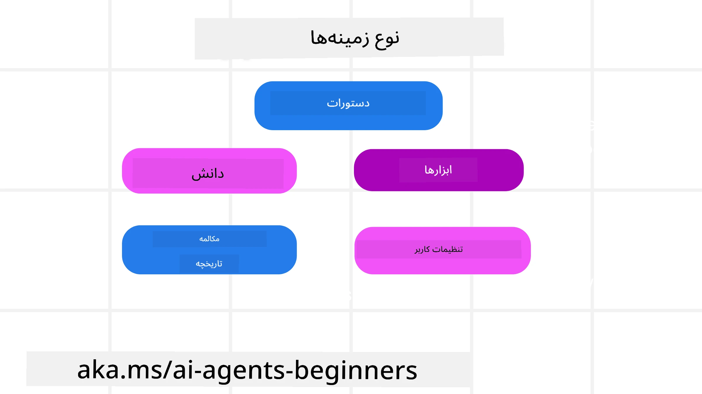
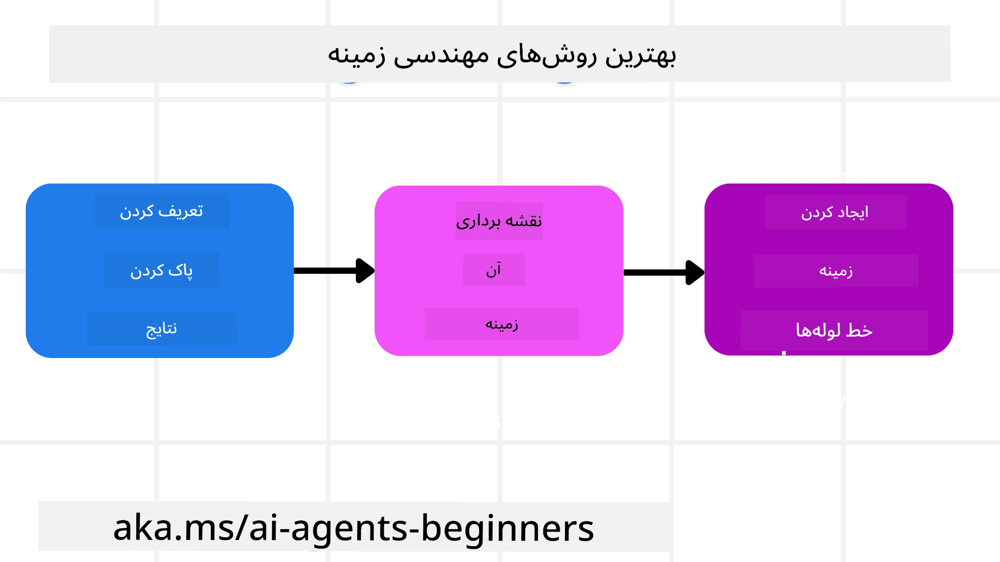

# مهندسی زمینه برای عامل‌های هوش مصنوعی

> _(برای مشاهده ویدیو این درس روی تصویر بالا کلیک کنید)_

درک پیچیدگی برنامه‌ای که برای آن عامل هوش مصنوعی می‌سازید، برای ساختن یک عامل قابل اطمینان اهمیت دارد. ما باید عامل‌های هوش مصنوعی بسازیم که به‌طور مؤثر اطلاعات را مدیریت کنند تا نیازهای پیچیده‌ای فراتر از مهندسی پرامپت را برآورده سازند.

در این درس، به بررسی مهندسی زمینه و نقش آن در ساخت عامل‌های هوش مصنوعی خواهیم پرداخت.

## مقدمه

این درس موضوعات زیر را پوشش خواهد داد:

• **مهندسی زمینه چیست** و چرا با مهندسی پرامپت متفاوت است.

• **استراتژی‌هایی برای مهندسی زمینه مؤثر**، از جمله چگونگی نوشتن، انتخاب، فشرده‌سازی و جدا کردن اطلاعات.

• **شکست‌های رایج زمینه** که می‌توانند عامل هوش مصنوعی شما را از مسیر خارج کنند و چگونگی رفع آنها.

## اهداف یادگیری

پس از اتمام این درس، شما خواهید دانست چگونه:

• **مهندسی زمینه را تعریف کنید** و آن را از مهندسی پرامپت متمایز سازید.

• **مولفه‌های کلیدی زمینه** در برنامه‌های مدل زبان بزرگ (LLM) را شناسایی کنید.

• **استراتژی‌های نوشتن، انتخاب، فشرده‌سازی، و جدا کردن زمینه** را برای بهبود عملکرد عامل به‌کار برید.

• **شکست‌های رایج زمینه** مانند مسمومیت، حواس‌پرتی، سردرگمی و تعارض را تشخیص دهید و روش‌های کاهش آن را پیاده‌سازی کنید.

## مهندسی زمینه چیست؟

برای عامل‌های هوش مصنوعی، زمینه چیزی است که برنامه‌ریزی عامل را برای انجام برخی اقدامات هدایت می‌کند. مهندسی زمینه عملی است برای اطمینان از اینکه عامل هوش مصنوعی اطلاعات درستی برای انجام گام بعدی وظیفه دارد. پنجره زمینه محدودیت اندازه دارد؛ بنابراین به عنوان سازندگان عامل باید سیستم‌ها و فرآیندهایی برای افزودن، حذف و فشرده‌سازی اطلاعات در پنجره زمینه بسازیم.

### مهندسی پرامپت در مقابل مهندسی زمینه

مهندسی پرامپت بر مجموعه‌ای ثابت و ایستا از دستورالعمل‌ها تمرکز دارد تا عامل‌های هوش مصنوعی را با مجموعه‌ای از قواعد به‌طور مؤثر هدایت کند. مهندسی زمینه نحوه مدیریت یک مجموعه پویا از اطلاعات، شامل پرامپت اولیه، است تا اطمینان حاصل شود عامل هوش مصنوعی با گذر زمان آنچه نیاز دارد در اختیار دارد. ایده اصلی مهندسی زمینه این است که این فرآیند قابل تکرار و قابل اطمینان باشد.

### انواع زمینه

مهم است به یاد داشته باشیم که زمینه فقط یک چیز نیست. اطلاعاتی که عامل هوش مصنوعی نیاز دارد می‌تواند از منابع مختلفی بیاید و وظیفه ماست که اطمینان حاصل کنیم عامل به این منابع دسترسی دارد:

انواع زمینه‌ای که ممکن است یک عامل هوش مصنوعی نیاز داشته باشد مدیریت کند شامل موارد زیر است:

• **دستورالعمل‌ها:** این‌ها مانند «قوانین» عامل هستند — پرامپت‌ها، پیام‌های سیستمی، نمونه‌های چندشاتی (نشان دادن نحوه انجام کاری به هوش مصنوعی)، و توصیف ابزارهایی که می‌تواند استفاده کند. اینجا جایی است که مهندسی پرامپت با مهندسی زمینه تلفیق می‌شود.

• **دانش:** این شامل حقایق، اطلاعات بازیابی شده از پایگاه داده‌ها یا حافظه‌های بلندمدت است که عامل جمع‌آوری کرده. این می‌تواند شامل ادغام یک سیستم بازیابی تقویت‌شده (RAG) باشد اگر عامل نیاز به دسترسی به منابع مختلف دانش و پایگاه داده‌ها داشته باشد.

• **ابزارها:** این تعاریف عملکردهای خارجی، APIها و سرورهای MCP است که عامل می‌تواند فراخوانی کند، همراه با بازخورد (نتایج) که از استفاده از آن‌ها به دست می‌آورد.

• **تاریخچه گفتگو:** گفتمان در حال انجام با کاربر. با گذشت زمان، این گفتگوها طولانی‌تر و پیچیده‌تر می‌شوند که به معنی اشغال فضای پنجره زمینه است.

• **ترجیحات کاربر:** اطلاعاتی که با گذشت زمان در مورد سلیقه‌ها یا عدم علاقه‌های کاربر یاد گرفته شده است. این‌ها می‌توانند ذخیره و هنگام اتخاذ تصمیمات کلیدی فراخوانی شوند تا به کاربر کمک کنند.

## استراتژی‌هایی برای مهندسی زمینه مؤثر

### استراتژی‌های برنامه‌ریزی

مهندسی زمینه خوب با برنامه‌ریزی خوب آغاز می‌شود. این یک رویکرد است که به شما کمک می‌کند درباره نحوه به‌کارگیری مفهوم مهندسی زمینه فکر کنید:

1. **تعریف نتایج واضح** — نتایج وظایفی که به عامل‌های هوش مصنوعی محول می‌شوند باید به وضوح تعریف شوند. به این سؤال پاسخ دهید — «وقتی عامل هوش مصنوعی کارش را تمام کرد، جهان چگونه خواهد بود؟» به عبارت دیگر، بعد از تعامل با عامل هوش مصنوعی، چه تغییر، اطلاعات یا پاسخی باید به کاربر داده شود.

2. **نقشه‌برداری زمینه** — پس از تعریف نتایج عامل، باید پاسخ دهید به سؤال «عامل هوش مصنوعی برای انجام این وظیفه به چه اطلاعاتی نیاز دارد؟». به این ترتیب می‌توانید زمینه را که آن اطلاعات در کجا قرار دارد، نقشه‌برداری کنید.

3. **ایجاد خطوط لوله زمینه** — حالا که می‌دانید اطلاعات کجاست، باید پاسخ دهید به سؤال «عامل چگونه این اطلاعات را به دست خواهد آورد؟». این می‌تواند به طرق مختلفی انجام شود از جمله RAG، استفاده از سرورهای MCP و ابزارهای دیگر.

### استراتژی‌های عملی

برنامه‌ریزی مهم است اما وقتی اطلاعات شروع به ورود به پنجره زمینه عامل می‌کند، نیاز به استراتژی‌های عملی برای مدیریت آن داریم:

#### مدیریت زمینه

در حالی که برخی اطلاعات به‌طور خودکار به پنجره زمینه اضافه می‌شوند، مهندسی زمینه درباره داشتن نقشی فعال‌تر در این اطلاعات است که می‌تواند با چند استراتژی انجام شود:

 1. **دفترچه یادداشت عامل (Agent Scratchpad)**
 این امکان را به عامل می‌دهد که در طول یک جلسه یادداشت‌های مرتبط با کارهای جاری و تعاملات کاربران را ثبت کند. این دفترچه باید خارج از پنجره زمینه در یک فایل یا شی در زمان اجرا وجود داشته باشد که عامل بتواند در طول همان جلسه در صورت نیاز آن را فراخوانی کند.

 2. **حافظه‌ها**
 دفترچه یادداشت‌ها برای مدیریت اطلاعات خارج از پنجره زمینه یک جلسه مفید است. حافظه‌ها این امکان را به عامل می‌دهند که اطلاعات مرتبط را در چندین جلسه ذخیره و بازیابی کند. این می‌تواند شامل خلاصه‌ها، ترجیحات کاربر و بازخوردها برای بهبودهای آینده باشد.

 3. **فشرده‌سازی زمینه**
  وقتی پنجره زمینه بزرگ می‌شود و به حد خود نزدیک می‌گردد، می‌توان از تکنیک‌هایی مانند خلاصه‌سازی و کوتاه‌سازی استفاده کرد. این شامل نگه داشتن فقط مهم‌ترین اطلاعات یا حذف پیام‌های قدیمی‌تر است.

 4. **سیستم‌های چندعاملی**
  توسعه سیستم چندعاملی نوعی مهندسی زمینه است چون هر عامل پنجره زمینه مخصوص به خود دارد. نحوه به اشتراک‌گذاری و انتقال آن زمینه به عوامل مختلف، چیز دیگری است که باید هنگام ساخت این سیستم‌ها برنامه‌ریزی شود.

 5. **محیط‌های ایزوله (Sandbox)**
  اگر عامل نیاز داشته باشد کدی را اجرا کند یا مقادیر زیادی از اطلاعات در یک سند پردازش کند، این می‌تواند پردازش نتایج را به تعداد زیادی توکن نیازمند کند. به جای ذخیره تمام این‌ها در پنجره زمینه، عامل می‌تواند از محیط ایزوله استفاده کند که قادر است این کد را اجرا کند و فقط نتایج و اطلاعات مرتبط را بخواند.

 6. **اشیاء وضعیت زمان اجرا**
   این کار با ایجاد ظرف اطلاعات انجام می‌شود تا موقعیت‌هایی که عامل نیاز دارد به اطلاعات خاصی دسترسی داشته باشد را مدیریت کند. برای یک وظیفه پیچیده، این امکان را می‌دهد که عامل نتایج هر زیرکار را گام‌به‌گام ذخیره کند و ارتباط زمینه را فقط محدود به همان زیرکار نگه دارد.

#### بررسی زمینه

پس از به‌کارگیری یکی از این استراتژی‌ها، ارزش دارد بررسی کنید که فراخوانی مدل بعدی دقیقاً چه چیزی دریافت کرده است. یک سؤال مفید برای اشکال‌زدایی این است:

> آیا عامل بیش از حد زمینه بارگذاری کرده، زمینه اشتباهی انتخاب کرده، یا زمینه مورد نیاز را از دست داده است؟

برای پاسخ به این سؤال نیازی به لاگ‌گیری پرامپت‌های خام، خروجی ابزارها یا محتوای حافظه نیست. در محیط تولید، ترجیحاً از رکوردهای کوچک بررسی زمینه استفاده کنید که شمارش‌ها، شناسه‌ها، هش‌ها و برچسب‌های سیاست را ثبت کنند:

- **انتخاب:** پیگیری کنید چند قطعه کاندید، ابزار یا حافظه بررسی شده‌اند، چند انتخاب شده‌اند، و کدام قاعده یا امتیاز باعث فیلتر شدن بقیه شده است.

- **فشرده‌سازی:** بازه منبع یا شناسه ردیابی، شناسه خلاصه، تخمین تعداد توکن‌ها قبل و بعد از فشرده‌سازی، و اینکه آیا محتوای خام در فراخوانی بعدی حذف شده است را ثبت کنید.

- **جدا کردن:** کدام زیرکار در عامل، جلسه یا محیط ایزوله جدا اجرا شده، چه خلاصه محدود شده‌ای بازگشته، و آیا خروجی ابزار بزرگ خارج از زمینه عامل والد مانده است را یادداشت کنید.

- **حافظه و RAG:** شناسه اسناد بازیابی‌شده، شناسه‌های حافظه، امتیازات، شناسه‌های انتخاب‌شده، و وضعیت حذف به جای متن کامل بازیابی‌شده ذخیره شود.

- **ایمنی و حفظ حریم خصوصی:** به جای متن حساس پرامپت، آرگومان‌ ابزار، نتایج ابزار، یا بدنه‌های حافظه کاربر، هش‌ها، شناسه‌ها، سطل‌های توکن و برچسب‌های سیاست ارجحیت دارد.

هدف بیشتر کردن زمینه نیست، بلکه باقی گذاشتن شواهد کافی است که توسعه‌دهنده بتواند بگوید کدام استراتژی زمینه اجرا شده و آیا فراخوانی مدل بعدی به شیوه مورد نظر تغییر کرده است یا نه.

### مثال مهندسی زمینه

فرض کنیم می‌خواهیم یک عامل هوش مصنوعی داشته باشیم که **«برای من سفری به پاریس رزرو کند.»**

• یک عامل ساده که تنها از مهندسی پرامپت استفاده می‌کند ممکن است فقط پاسخ دهد: **«باشه، کی می‌خوای بری پاریس؟»**. این فقط سؤال مستقیم شما را در همان زمان پاسخ داده است.

• عاملی که از استراتژی‌های مهندسی زمینه پوشش داده شده استفاده می‌کند، کارهای بسیار بیشتری انجام می‌دهد. حتی قبل از پاسخ دادن، سیستم می‌تواند:

  ◦ **تقویمتان را چک کند** برای تاریخ‌های آزاد (داده‌های زنده را بازیابی کند).

 ◦ **ترجیحات سفر گذشته شما را به یاد آورد** (از حافظه بلندمدت)، مانند ایرلاین مورد علاقه، بودجه یا اینکه پرواز مستقیم ترجیح می‌دهید.

 ◦ **ابزارهای موجود** برای رزرو پرواز و هتل را شناسایی کند.

- سپس، یک پاسخ نمونه می‌تواند این باشد: «سلام [نام شما]! می‌بینم هفته اول اکتبر آزادی. می‌خوای دنبال پرواز مستقیم به پاریس با [ایرلاین مورد علاقه] در محدوده بودجه معمولت بگردم؟». این پاسخ غنی و آگاه به زمینه قدرت مهندسی زمینه را نشان می‌دهد.

## شکست‌های رایج زمینه

### مسمومیت زمینه (Context Poisoning)

**چیست:** وقتی یک توهم (اطلاعات نادرست تولید شده توسط LLM) یا خطا وارد زمینه می‌شود و بارها به آن ارجاع داده می‌شود، باعث می‌شود عامل دنبال اهداف غیرممکن برود یا استراتژی‌های بی‌معنی توسعه دهد.

**چه باید کرد:** اجرا کردن **اعتبارسنجی زمینه** و **قرنطینه**. اطلاعات را قبل از اضافه شدن به حافظه بلندمدت اعتبارسنجی کنید. اگر احتمال مسمومیت دیده شد، زمینه‌های تازه‌ای بسازید تا از گسترش اطلاعات نادرست جلوگیری شود.

**مثال رزرو سفر:** عامل شما توهم می‌زند که **پرواز مستقیمی از فرودگاه کوچک محلی به شهری بین‌المللی دورافتاده** وجود دارد در حالی که واقعاً چنین پروازی ندارد. این جزئیات غلط پرواز در زمینه ذخیره می‌شود. بعداً، وقتی از عامل می‌خواهید رزرو کند، او مرتب تلاش می‌کند بلیط برای این مسیر غیرممکن پیدا کند که منجر به خطاهای مکرر می‌شود.

**راه حل:** مرحله‌ای اجرا کنید که **وجود و مسیرهای پرواز را با API زنده اعتبارسنجی کند** _قبل_ از اضافه کردن جزئیات پرواز به زمینه عامل. اگر اعتبارسنجی رد شد، اطلاعات نادرست «قرنطینه» شده و دیگر استفاده نمی‌شود.

### حواس‌پرتی زمینه (Context Distraction)

**چیست:** وقتی زمینه خیلی بزرگ می‌شود که مدل بیش از حد روی تاریخچه انباشته شده تمرکز می‌کند به جای استفاده از آنچه در آموزش یاد گرفته، که منجر به رفتارهای تکراری یا غیرمفید می‌شود. مدل‌ها ممکن است حتی قبل از پر شدن پنجره زمینه دچار خطا شوند.

**چه باید کرد:** از **خلاصه‌سازی زمینه** استفاده کنید. اطلاعات انباشته شده را به‌طور دوره‌ای به خلاصه‌های کوتاه‌تر تبدیل کنید، جزئیات مهم را نگه داشته و تاریخچه تکراری را حذف کنید. این به «بازنشانی» تمرکز کمک می‌کند.

**مثال رزرو سفر:** شما مدت‌ها در مورد مقاصد رویایی سفر صحبت کرده‌اید، از جمله روایت مفصل سفر دوچرخه‌سواری‌تان دو سال پیش. وقتی بالاخره می‌خواهید **«پرواز ارزانی برای ماه بعد پیدا کنم»**، عامل گرفتار جزئیات قدیمی و نامرتبط می‌شود و مرتب درباره تجهیزات دوچرخه یا برنامه‌های گذشته سوال می‌کند و درخواست فعلی شما را نادیده می‌گیرد.

**راه حل:** بعد از تعداد مشخصی دور یا وقتی زمینه بیش از حد بزرگ شد، عامل باید **بخش‌های اخیر و مرتبط گفتگو را خلاصه کند** — تمرکز روی تاریخ‌ها و مقصد سفر فعلی شما — و این خلاصه متراکم شده را برای فراخوانی بعدی LLM استفاده کند و گفتگوی قبلی نامرتبط را دور بیندازد.

### سردرگمی زمینه (Context Confusion)

**چیست:** وقتی زمینه اضافی، اغلب به شکل تعداد زیادی ابزار موجود، باعث می‌شود مدل پاسخ‌های بد بدهد یا ابزارهای نامربوط را فراخوانی کند. مدل‌های کوچک‌تر به این مشکل حساس‌ترند.

**چه باید کرد:** اجرای **مدیریت بار ابزار** با استفاده از تکنیک‌های RAG. توصیف ابزارها را در یک پایگاه داده برداری ذخیره کنید و فقط مرتبط‌ترین ابزارها برای هر وظیفه خاص را انتخاب کنید. تحقیقات نشان می‌دهد محدود نگه داشتن انتخاب ابزار به کمتر از ۳۰ مؤثر است.

**مثال رزرو سفر:** عامل شما به ده‌ها ابزار دسترسی دارد: `book_flight`، `book_hotel`، `rent_car`، `find_tours`، `currency_converter`، `weather_forecast`، `restaurant_reservations` و غیره. شما می‌پرسید، **«بهترین راه گردش در پاریس چیست؟»** به دلیل تعداد زیاد ابزارها، عامل سردرگم می‌شود و تلاش می‌کند `book_flight` را _در_ پاریس فراخوانی کند، یا `rent_car` حتی اگر شما حمل‌ونقل عمومی ترجیح می‌دهید، چون توصیف‌های ابزار ممکن است همپوشانی داشته باشند یا عامل نتواند بهترین را تشخیص دهد.

**راه حل:** استفاده از **RAG روی توصیف ابزار**. وقتی درباره گردش در پاریس سؤال می‌کنید، سیستم فقط مرتبط‌ترین ابزارهایی مانند `rent_car` یا `public_transport_info` را به‌صورت پویا بازیابی می‌کند و مجموعه متمرکزی از ابزارها را به LLM ارائه می‌دهد.

### تعارض زمینه (Context Clash)

**چیست:** وقتی اطلاعات متناقضی در زمینه وجود دارد که منجر به استدلال ناسازگار یا پاسخ‌های نادرست نهایی می‌شود. این معمولاً زمانی اتفاق می‌افتد که اطلاعات در چند مرحله می‌آید و فرضیات اولیه اشتباه در زمینه باقی می‌مانند.

**چه باید کرد:** استفاده از **هرس زمینه** و **بارگذاری خارج**. هرس یعنی حذف اطلاعات قدیمی یا متناقض وقتی جزئیات جدید می‌آید. بارگذاری خارج به مدل یک فضای کاری جداگانه «دفترچه یادداشت» می‌دهد تا اطلاعات را بدون شلوغ کردن زمینه اصلی پردازش کند.
**مثال رزرو سفر:** شما در ابتدا به نماینده خود می‌گویید، **«می‌خواهم کلاس اقتصادی پرواز کنم.»** بعدها در گفتگو نظر خود را عوض می‌کنید و می‌گویید، **«در واقع، برای این سفر، بیایید کلاس بیزینس را انتخاب کنیم.»** اگر هر دو دستور در متن باقی بمانند، نماینده ممکن است نتایج جستجوی متناقض دریافت کند یا در انتخاب اولویت ترجیح سردرگم شود.

**راه‌حل:** پیاده‌سازی **اصلاح متن**. وقتی یک دستور جدید با دستور قدیمی تناقض دارد، دستور قدیمی حذف می‌شود یا به صراحت در متن نادیده گرفته می‌شود. به صورت جایگزین، نماینده می‌تواند از یک **کاغذ برداری** برای رفع تضاد ترجیحات قبل از تصمیم‌گیری استفاده کند، تا فقط دستور نهایی و هماهنگ راهنمای اقداماتش باشد.

## سوالات بیشتری درباره مهندسی زمینه دارید؟

به [Microsoft Foundry Discord](https://aka.ms/ai-agents/discord) بپیوندید تا با دیگر یادگیرندگان ملاقات کنید، در ساعات اداری شرکت کنید و سوالات خود درباره نمایندگان هوش مصنوعی را مطرح نمایید.

---

<!-- CO-OP TRANSLATOR DISCLAIMER START -->
**سلب مسئولیت**:
این سند با استفاده از سرویس ترجمه هوش مصنوعی [Co-op Translator](https://github.com/Azure/co-op-translator) ترجمه شده است. در حالی که ما در تلاش برای دقت هستیم، لطفاً توجه داشته باشید که ترجمه‌های خودکار ممکن است شامل خطاها یا نادرستی‌هایی باشند. سند اصلی به زبان مادری خود باید به عنوان منبع معتبر در نظر گرفته شود. برای اطلاعات حیاتی، ترجمه حرفه‌ای انسانی توصیه می‌شود. ما در قبال هرگونه سوء تفاهم یا برداشت نادرست ناشی از استفاده از این ترجمه مسئولیتی نداریم.
<!-- CO-OP TRANSLATOR DISCLAIMER END -->