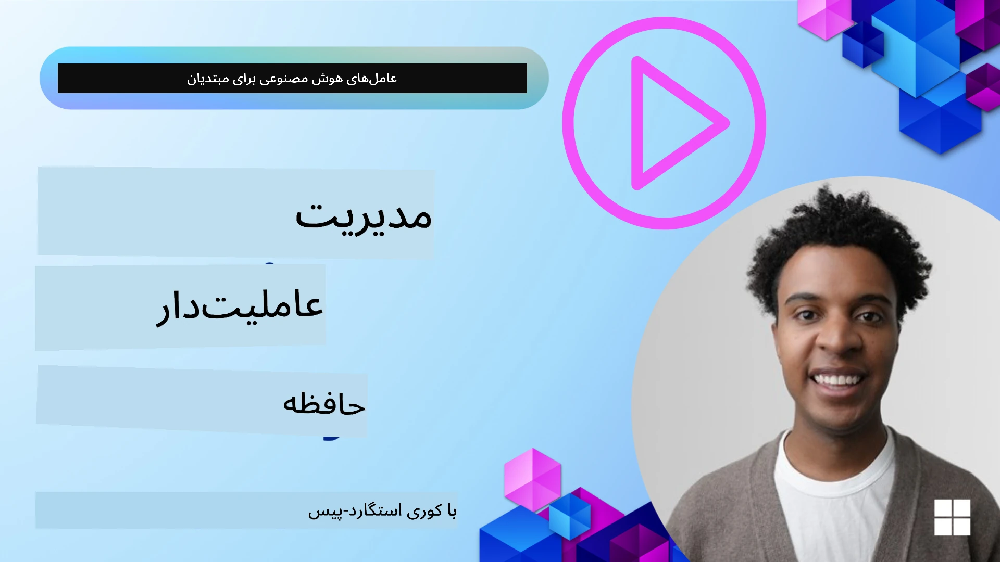

# حافظه برای عامل‌های هوش مصنوعی 

هنگام بحث در مورد مزایای منحصر به فرد ایجاد عامل‌های هوش مصنوعی، عمدتاً دو نکته مطرح می‌شود: توانایی فراخوانی ابزارها برای تکمیل وظایف و توانایی بهبود در طول زمان. حافظه پایهٔ ایجاد عاملِ خودبهبود‌یاب است که می‌تواند تجارب بهتری برای کاربران ما خلق کند.

در این درس، به این می‌پردازیم که حافظه برای عامل‌های هوش مصنوعی چیست و چگونه می‌توانیم آن را مدیریت کرده و برای منافع برنامه‌های خود از آن استفاده کنیم.

## مقدمه

این درس شامل موارد زیر خواهد بود:

• **درک حافظه عامل هوش مصنوعی**: حافظه چیست و چرا برای عامل‌ها ضروری است.

• **پیاده‌سازی و ذخیره‌سازی حافظه**: روش‌های عملی برای افزودن قابلیت‌های حافظه به عامل‌های هوش مصنوعی شما، با تمرکز بر حافظه کوتاه‌مدت و بلندمدت.

• **خودبهبود‌دهی عامل‌های هوش مصنوعی**: چگونه حافظه به عامل‌ها امکان می‌دهد از تعاملات گذشته یاد بگیرند و در طول زمان بهبود یابند.

## پیاده‌سازی‌های موجود

این درس شامل دو دفترچهٔ راهنمای جامع است:

• **[13-agent-memory.ipynb](./13-agent-memory.ipynb)**: پیاده‌سازی حافظه با استفاده از Mem0 و Azure AI Search در چارچوب Microsoft Agent

• **[13-agent-memory-cognee.ipynb](./13-agent-memory-cognee.ipynb)**: پیاده‌سازی حافظهٔ ساختاریافته با استفاده از Cognee، که به‌طور خودکار نمودار دانش مبتنی بر امبدینگ می‌سازد، نمودار را نمایش می‌دهد و بازیابی هوشمندانه را فراهم می‌کند

## اهداف یادگیری

پس از تکمیل این درس، شما خواهید دانست چگونه:

• **بین انواع مختلف حافظهٔ عامل‌های هوش مصنوعی تمایز قائل شوید**، از جمله حافظهٔ کاری، کوتاه‌مدت و بلندمدت، و همچنین اشکال خاصی مانند حافظهٔ شخصیتی و حافظهٔ اپیزودیک.

• **حافظهٔ کوتاه‌مدت و بلندمدت را برای عامل‌های هوش مصنوعی پیاده‌سازی و مدیریت کنید** با استفاده از Microsoft Agent Framework، بهره‌گیری از ابزارهایی مانند Mem0، Cognee، حافظهٔ Whiteboard، و یکپارچه‌سازی با Azure AI Search.

• **اصول پشت عامل‌های خودبهبود‌دهنده را درک کنید** و چگونه سیستم‌های مدیریت حافظهٔ قوی به یادگیری و سازگاری مداوم کمک می‌کنند.

## درک حافظه عامل‌های هوش مصنوعی

در بنیاد خود، **حافظه برای عامل‌های هوش مصنوعی به مکانیزم‌هایی اشاره دارد که به آن‌ها اجازه می‌دهد اطلاعات را نگهداری و بازیابی کنند**. این اطلاعات می‌تواند جزئیاتی مشخص دربارهٔ یک مکالمه، اولویت‌های کاربر، اقدامات گذشته یا حتی الگوهای آموخته‌شده باشد.

بدون حافظه، برنامه‌های هوش مصنوعی اغلب حالت بی‌حالت (stateless) دارند، به این معنی که هر تعامل از ابتدا شروع می‌شود. این منجر به تجربهٔ کاربری تکراری و ناامیدکننده‌ای می‌شود که در آن عامل «زمینهٔ قبلی» یا ترجیحات را فراموش می‌کند.

### چرا حافظه مهم است؟

هوش یک عامل به شدت با توانایی آن برای بازیابی و استفاده از اطلاعات گذشته مرتبط است. حافظه به عامل‌ها اجازه می‌دهد تا:

• **متفکرانه باشند**: یادگیری از اقدامات و نتایج گذشته.

• **تعامل‌محور باشند**: حفظ زمینه در یک مکالمهٔ در حال جریان.

• **پیش‌بین و واکنش‌گرا باشند**: پیش‌بینی نیازها یا پاسخ‌دهی مناسب بر اساس داده‌های تاریخی.

• **خودمختار باشند**: عملکرد مستقل‌تر با تکیه بر دانش ذخیره‌شده.

هدف از پیاده‌سازی حافظه، قابل‌اطمینان‌تر و توانمندتر کردن عامل‌ها است.

### انواع حافظه

#### حافظه کاری

این را به‌عنوان یک تکهٔ کاغذ یادداشت تصور کنید که یک عامل در طول یک وظیفه یا روند فکری واحد از آن استفاده می‌کند. حافظه کاری اطلاعات فوری لازم برای محاسبهٔ گام بعدی را در خود نگه می‌دارد.

برای عامل‌های هوش مصنوعی، حافظه کاری اغلب مرتبط‌ترین اطلاعات را از یک مکالمه ثبت می‌کند، حتی اگر کل تاریخچهٔ چت طولانی یا کوتاه‌شده باشد. تمرکز آن بر استخراج عناصر کلیدی مانند نیازها، پیشنهادات، تصمیمات و اقدامات است.

**مثال حافظه کاری**

در یک عامل رزرو سفر، حافظه کاری ممکن است درخواست فعلی کاربر را مانند «می‌خواهم سفری به پاریس رزرو کنم» ثبت کند. این نیاز مشخص در زمینهٔ فوری عامل نگهداری می‌شود تا تعامل جاری را هدایت کند.

#### حافظه کوتاه‌مدت

این نوع حافظه اطلاعات را برای مدت زمان یک مکالمه یا جلسهٔ واحد نگه می‌دارد. این زمینهٔ چت فعلی است و به عامل اجازه می‌دهد به نوبت‌های قبلی گفت‌وگو ارجاع دهد.

**مثال حافظه کوتاه‌مدت**

اگر کاربر بپرسد، «پرواز به پاریس چقدر هزینه دارد؟» و سپس دنبال کند با «در مورد اقامت آنجا چطور؟»، حافظه کوتاه‌مدت تضمین می‌کند که عامل می‌داند «آنجا» به «پاریس» در همان مکالمه اشاره دارد.

#### حافظه بلندمدت

این اطلاعاتی است که در طول چندین مکالمه یا جلسه پایدار می‌ماند. این به عامل‌ها اجازه می‌دهد تا ترجیحات کاربر، تعاملات تاریخی یا دانش عمومی را در دوره‌های طولانی‌تر به خاطر بسپارند. این برای شخصی‌سازی اهمیت دارد.

**مثال حافظه بلندمدت**

یک حافظهٔ بلندمدت ممکن است ذخیره کند که «بن از اسکی و فعالیت‌های خارج از منزل لذت می‌برد، قهوه را با منظرهٔ کوه ترجیح می‌دهد، و به‌دلیل یک آسیب گذشته می‌خواهد از مسیرهای اسکی پیشرفته اجتناب کند». این اطلاعات که از تعاملات قبلی آموخته شده‌اند، توصیه‌ها در جلسات برنامه‌ریزی سفر آینده را تحت تأثیر قرار می‌دهند و آن‌ها را بسیار شخصی‌سازی‌شده می‌سازند.

#### حافظه شخصیتی

این نوع حافظهٔ تخصصی به عامل کمک می‌کند تا یک «شخصیت» یا «پرسونا»ٔ سازگار توسعه دهد. این اجازه می‌دهد عامل جزئیاتی دربارهٔ خود یا نقش مورد نظرش را به خاطر بسپارد و تعاملات را روان‌تر و متمرکزتر کند.

**مثال حافظه شخصیتی**
اگر عامل سفر قرار باشد یک «برنامه‌ریز خبرهٔ اسکی» باشد، حافظه شخصیت ممکن است این نقش را تقویت کند و واکنش‌های آن را در راستای لحن و دانش یک خبره شکل دهد.

#### حافظه اپیزودیک (جریان کاری)

این حافظه دنبالهٔ گام‌هایی را که یک عامل در طول یک وظیفهٔ پیچیده برداشته ذخیره می‌کند، از جمله موفقیت‌ها و شکست‌ها. شبیه به به‌خاطر سپردن «اپیزودها» یا تجربیات گذشته برای یادگیری از آن‌ها است.

**مثال حافظه اپیزودیک**

اگر عامل تلاش کرده باشد یک پرواز خاص را رزرو کند اما به‌دلیل عدم دسترسی موفق نشده باشد، حافظه اپیزودیک می‌تواند این شکست را ثبت کند و به عامل اجازه دهد در تلاش بعدی پروازهای جایگزین را امتحان کند یا کاربر را با اطلاع بیشتری از مشکل آگاه سازد.

#### حافظه موجودیت

این شامل استخراج و به‌خاطر سپردن موجودیت‌های مشخص (مانند افراد، مکان‌ها یا اشیاء) و رویدادها از مکالمات است. این اجازه می‌دهد عامل یک درک ساختاریافته از عناصر کلیدی مطرح‌شده بسازد.

**مثال حافظه موجودیت**

از یک مکالمه دربارهٔ سفر گذشته، عامل ممکن است «پاریس»، «برج ایفل» و «شام در رستوران Le Chat Noir» را به‌عنوان موجودیت‌ها استخراج کند. در تعامل بعدی، عامل می‌تواند «Le Chat Noir» را به‌خاطر بیاورد و پیشنهاد رزرو دوباره آن را بدهد.

#### Structured RAG (تولید تقویت‌شده با بازیابی ساختاریافته)

در حالی که RAG یک تکنیک گسترده‌تر است، «Structured RAG» به‌عنوان یک تکنولوژی قدرتمند حافظه برجسته شده است. این روش اطلاعات متراکم و ساختاریافته را از منابع مختلف (مکالمات، ایمیل‌ها، تصاویر) استخراج می‌کند و از آن برای افزایش دقت، بازیابی و سرعت در پاسخ‌ها استفاده می‌نماید. برخلاف RAG کلاسیک که صرفاً بر تشابه معنایی متکی است، Structured RAG با ساختار ذاتی اطلاعات کار می‌کند.

**مثال Structured RAG**

به‌جای صرفاً مطابقت کلیدواژه‌ها، Structured RAG می‌تواند جزئیات پرواز (مقصد، تاریخ، زمان، خطوط هوایی) را از یک ایمیل پارس کند و آن‌ها را به‌صورت ساختاری ذخیره کند. این امکان پرسش‌های دقیقی مانند «چه پروازی روز سه‌شنبه به پاریس رزرو کردم؟» را فراهم می‌سازد.

## پیاده‌سازی و ذخیره‌سازی حافظه

پیاده‌سازی حافظه برای عامل‌های هوش مصنوعی شامل فرایندی سیستماتیک از «مدیریت حافظه» است که تولید، ذخیره، بازیابی، ادغام، به‌روزرسانی و حتی «فراموشی» (یا حذف) اطلاعات را شامل می‌شود. بازیابی به‌طور خاص یک جنبهٔ حیاتی است.

### ابزارهای حافظهٔ تخصصی

#### Mem0

یکی از راه‌ها برای ذخیره و مدیریت حافظهٔ عامل استفاده از ابزارهای تخصصی مانند Mem0 است. Mem0 به‌عنوان یک لایهٔ حافظهٔ پایدار عمل می‌کند و به عامل‌ها اجازه می‌دهد تعاملات مرتبط را به خاطر بیاورند، ترجیحات کاربر و زمینهٔ واقعی را ذخیره کنند و از موفقیت‌ها و شکست‌ها در طول زمان بیاموزند. ایده این است که عامل‌های بدون حالت به عامل‌های دارای حالت تبدیل شوند.

این سیستم از طریق یک «خط لولهٔ حافظهٔ دو مرحله‌ای: استخراج و به‌روزرسانی» کار می‌کند. ابتدا پیام‌هایی که به رشتهٔ عامل افزوده می‌شوند به سرویس Mem0 فرستاده می‌شوند، که از یک مدل زبان بزرگ (LLM) برای خلاصه‌سازی تاریخچهٔ مکالمه و استخراج حافظه‌های جدید استفاده می‌کند. پس از آن، یک مرحلهٔ به‌روزرسانی مبتنی بر LLM تعیین می‌کند که آیا باید این حافظه‌ها اضافه، تغییر یا حذف شوند و آن‌ها را در یک فروشگاه دادهٔ هیبریدی ذخیره می‌کند که می‌تواند شامل پایگاه‌های دادهٔ برداری، گراف و کلید-مقدار باشد. این سیستم از انواع مختلف حافظه پشتیبانی می‌کند و می‌تواند حافظهٔ گراف را برای مدیریت روابط بین موجودیت‌ها در بر گیرد.

#### Cognee

رویکرد قدرتمند دیگر استفاده از **Cognee** است، یک حافظهٔ معنایی متن‌باز برای عامل‌های هوش مصنوعی که داده‌های ساختاریافته و ساختارنیافته را به نمودارهای دانش قابل جستجو مبتنی بر امبدینگ تبدیل می‌کند. Cognee یک معماری «دو‌فروشگاهی» فراهم می‌آورد که جستجوی شباهت برداری را با روابط گراف ترکیب می‌کند، و به عامل‌ها امکان می‌دهد نه تنها بفهمند چه اطلاعاتی مشابه است، بلکه مفاهیم چگونه به یکدیگر مرتبط‌اند.

این سیستم در بازیابی هیبریدی که ترکیبی از شباهت برداری، ساختار گراف و استدلال LLM است برتری دارد — از جستجوی قطعات خام تا پرسش و پاسخ آگاه از گراف. سیستم یک «حافظهٔ زنده» را نگه می‌دارد که تکامل می‌یابد و رشد می‌کند در حالی که به‌عنوان یک گراف مرتبط قابل پرس‌وجو باقی می‌ماند، از هر دو زمینهٔ جلسهٔ کوتاه‌مدت و حافظهٔ پایدار بلندمدت پشتیبانی می‌کند.

دفترچهٔ راهنمای Cognee ([13-agent-memory-cognee.ipynb](./13-agent-memory-cognee.ipynb)) ساخت این لایهٔ حافظهٔ یکپارچه را نشان می‌دهد، با مثال‌های عملی از وارد کردن منابع دادهٔ متنوع، نمایش نمودار دانش، و پرس‌وجو با استراتژی‌های جستجوی مختلف متناسب با نیازهای خاص عامل.

### ذخیره‌سازی حافظه با RAG

فراتر از ابزارهای حافظهٔ تخصصی مانند Mem0، می‌توانید از سرویس‌های جستجوی قدرتمند مانند **Azure AI Search** به‌عنوان یک بک‌اند برای ذخیره و بازیابی حافظه‌ها استفاده کنید، به‌ویژه برای Structured RAG.

این به شما امکان می‌دهد پاسخ‌های عامل خود را بر اساس داده‌های خودتان نهادینه کنید و از این طریق پاسخ‌هایی مرتبط‌تر و دقیق‌تر فراهم آورید. Azure AI Search می‌تواند برای ذخیرهٔ حافظه‌های مرتبط با سفر کاربران، فهرست محصولات یا هر دانش حوزه‌ای دیگر استفاده شود.

Azure AI Search از قابلیت‌هایی مانند **Structured RAG** پشتیبانی می‌کند که در استخراج و بازیابی اطلاعات متراکم و ساختاریافته از مجموعه‌داده‌های بزرگ مانند تاریخچهٔ مکالمات، ایمیل‌ها یا حتی تصاویر برتری دارد. این در مقایسه با روش‌های سنتی تقسیم متن و امبدینگ، «دقت و بازیابی فوق‌العاده» فراهم می‌آورد.

## خودبهبوددهی عامل‌های هوش مصنوعی

یک الگوی رایج برای عامل‌های خودبهبود‌دهنده شامل معرفی یک «عامل دانش» است. این عامل جداگانه، مکالمهٔ اصلی بین کاربر و عامل اولیه را مشاهده می‌کند. نقش آن عبارت است از:

1. **شناسایی اطلاعات ارزشمند**: تعیین اینکه آیا بخشی از مکالمه ارزش ذخیره شدن به‌عنوان دانش عمومی یا ترجیح خاص کاربر را دارد یا نه.

2. **استخراج و خلاصه‌سازی**: تقطیر یادگیری یا ترجیح اساسی از مکالمه.

3. **ذخیره در پایگاه دانش**: این اطلاعات استخراج‌شده را اغلب در یک پایگاه دادهٔ برداری پایدار می‌کند تا بعداً قابل بازیابی باشد.

4. **افزایش پرس‌وجوهای آینده**: هنگامی که کاربر پرس‌وجوی جدیدی آغاز می‌کند، عامل دانش اطلاعات مرتبط ذخیره‌شده را بازیابی کرده و آن را به درخواست کاربر اضافه می‌کند، و زمینهٔ حیاتی را به عامل اولیه می‌دهد (مشابه RAG).

### بهینه‌سازی‌ها برای حافظه

• **مدیریت تأخیر**: برای جلوگیری از کند شدن تعاملات کاربر، می‌توان در ابتدا از یک مدل ارزان‌تر و سریع‌تر برای بررسی سریع اینکه آیا اطلاعات ارزش ذخیره شدن یا بازیابی را دارد استفاده کرد، و تنها در صورت لزوم فرایند استخراج/بازیابی پیچیده‌تر را فراخوانی کرد.

• **نگهداری پایگاه دانش**: برای یک پایگاه دانش رو به رشد، اطلاعات کمتر استفاده‌شده می‌توانند به «بایگانی سرد» منتقل شوند تا هزینه‌ها مدیریت شوند.

## سوالات بیشتری در مورد حافظه عامل‌ها دارید؟

به [Microsoft Foundry Discord](https://aka.ms/ai-agents/discord) بپیوندید تا با دیگر یادگیرندگان ملاقات کنید، در ساعات اداری شرکت کنید و سوالات خود دربارهٔ عامل‌های هوش مصنوعی را مطرح نمایید.

---

<!-- CO-OP TRANSLATOR DISCLAIMER START -->
سلب مسئولیت:
این سند با استفاده از سرویس ترجمهٔ هوش مصنوعی Co-op Translator (https://github.com/Azure/co-op-translator) ترجمه شده است. در حالی که ما در پی دقت هستیم، لطفاً توجه داشته باشید که ترجمه‌های خودکار ممکن است حاوی اشتباهات یا نادرستی‌هایی باشند. نسخهٔ اصلی سند به زبان اصلی باید به عنوان مرجع معتبر در نظر گرفته شود. برای اطلاعات حساس، ترجمهٔ انسانی و حرفه‌ای توصیه می‌شود. ما در قبال هرگونه سوتفاهم یا تفسیر نادرست ناشی از استفاده از این ترجمه مسئولیتی نداریم.
<!-- CO-OP TRANSLATOR DISCLAIMER END -->