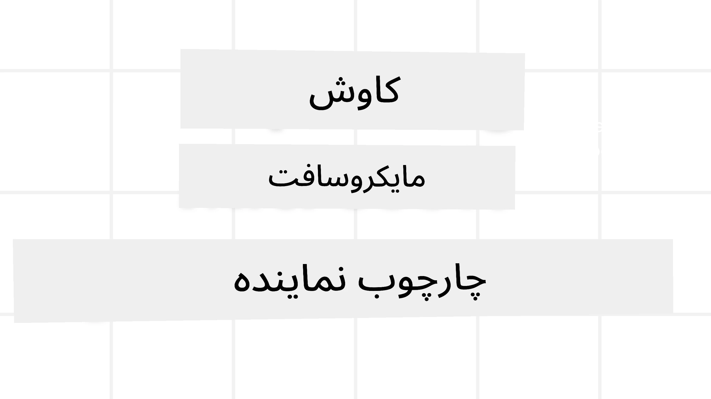
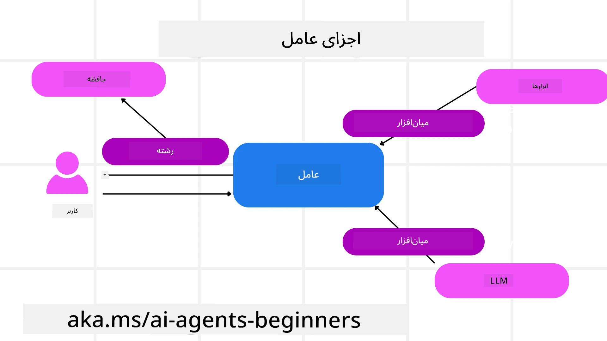

# بررسی چارچوب عامل مایکروسافت



### مقدمه

این درس پوشش خواهد داد:

- درک چارچوب عامل مایکروسافت: ویژگی‌های کلیدی و ارزش  
- بررسی مفاهیم اصلی چارچوب عامل مایکروسافت
- الگوهای پیشرفته MAF: جریان‌های کاری، میدلور و حافظه

## اهداف یادگیری

پس از تکمیل این درس، خواهید دانست چگونه:

- ساخت عامل‌های هوش مصنوعی آماده تولید با استفاده از چارچوب عامل مایکروسافت
- اعمال ویژگی‌های اصلی چارچوب عامل مایکروسافت در موارد کاربرد عامل‌محور خود
- استفاده از الگوهای پیشرفته شامل جریان‌های کاری، میدلور و مانیتورینگ

## نمونه کدها

نمونه کدهای مربوط به [چارچوب عامل مایکروسافت (MAF)](https://aka.ms/ai-agents-beginners/agent-framewrok) را می‌توانید در این مخزن در فایل‌های `xx-python-agent-framework` و `xx-dotnet-agent-framework` بیابید.

## درک چارچوب عامل مایکروسافت


[چارچوب عامل مایکروسافت (MAF)](https://aka.ms/ai-agents-beginners/agent-framewrok) چارچوب یکپارچه مایکروسافت برای ساخت عامل‌های هوش مصنوعی است. این چارچوب انعطاف‌پذیری لازم را برای رسیدگی به انواع گسترده موارد کاربرد عامل‌محور در هر دو محیط تولید و تحقیق فراهم می‌آورد، از جمله:

- **هماهنگی عامل‌های متوالی** در مواقعی که جریان‌های کاری گام به گام لازم است.
- **هماهنگی همزمان** در مواقعی که عامل‌ها باید به صورت همزمان وظایف را انجام دهند.
- **هماهنگی چت گروهی** در مواقعی که عامل‌ها می‌توانند روی یک کار با هم همکاری کنند.
- **هماهنگی انتقال کار (Handoff)** در مواقعی که عامل‌ها کار را به یکدیگر منتقل می‌کنند زمانی که زیرکارها به اتمام می‌رسند.
- **هماهنگی مغناطیسی (Magnetic Orchestration)** در مواقعی که یک عامل مدیر فهرست کارها را ایجاد و تغییر می‌دهد و هماهنگی زیرعامل‌ها برای انجام کار را به عهده دارد.

برای تحویل عامل‌های هوش مصنوعی در تولید، MAF همچنین ویژگی‌هایی برای موارد زیر دارد:

- **قابلیت مشاهده (Observability)** از طریق استفاده از OpenTelemetry که هر عملکرد عامل هوش مصنوعی شامل فراخوانی ابزار، مراحل هماهنگی، جریان‌های استدلال و نظارت عملکرد را از طریق داشبوردهای Microsoft Foundry ثبت می‌کند.
- **امنیت** با میزبانی عامل‌ها به صورت بومی در Microsoft Foundry که شامل کنترل‌های امنیتی مانند دسترسی مبتنی بر نقش، مدیریت داده‌های خصوصی و ایمنی محتوای تعبیه‌شده است.
- **پایداری** زیرا رشته‌ها و جریان‌های کاری عامل می‌توانند متوقف، از سر گرفته شده و از خطاها بازیابی شوند که اجازه پردازش‌های طولانی‌تر را می‌دهد.
- **کنترل** با پشتیبانی از جریان‌های کاری انسان در حلقه، جایی که وظایف به عنوان نیازمند تایید انسانی علامت‌گذاری می‌شوند.

چارچوب عامل مایکروسافت همچنین تمرکز دارد بر کارکرد متقابل با:

- **عدم وابستگی به ابر خاص** - عامل‌ها می‌توانند در کانتینرها، محیط‌های محلی و در چند ابر مختلف اجرا شوند.
- **عدم وابستگی به ارائه‌دهنده خاص** - عامل‌ها می‌توانند از طریق SDK دلخواه شما از جمله Azure OpenAI و OpenAI ایجاد شوند.
- **ادغام استانداردهای باز** - عامل‌ها می‌توانند از پروتکل‌هایی مانند Agent-to-Agent (A2A) و Model Context Protocol (MCP) برای کشف و استفاده از دیگر عامل‌ها و ابزارها بهره ببرند.
- **پلاگین‌ها و کانکتورها** - امکان اتصال به خدمات داده‌ای و حافظه مانند Microsoft Fabric، SharePoint، Pinecone و Qdrant فراهم است.

بیایید نگاهی بیندازیم به اینکه چگونه این ویژگی‌ها در برخی از مفاهیم اصلی چارچوب عامل مایکروسافت اعمال می‌شوند.

## مفاهیم کلیدی چارچوب عامل مایکروسافت

### عامل‌ها



**ایجاد عامل‌ها**

ایجاد عامل با تعریف سرویس استنتاج (ارائه‌دهنده LLM)، مجموعه دستورالعمل‌هایی برای پیروی عامل هوش مصنوعی، و یک `name` اختصاصی انجام می‌شود:

```python
agent = AzureOpenAIChatClient(credential=AzureCliCredential()).create_agent( instructions="You are good at recommending trips to customers based on their preferences.", name="TripRecommender" )
```

کد بالا از `Azure OpenAI` استفاده می‌کند اما عامل‌ها می‌توانند با استفاده از خدمات مختلفی از جمله `Microsoft Foundry Agent Service` ایجاد شوند:

```python
AzureAIAgentClient(async_credential=credential).create_agent( name="HelperAgent", instructions="You are a helpful assistant." ) as agent
```

API های پاسخ‌ها (`Responses`) و چت تکمیلی (`ChatCompletion`) OpenAI

```python
agent = OpenAIResponsesClient().create_agent( name="WeatherBot", instructions="You are a helpful weather assistant.", )
```

```python
agent = OpenAIChatClient().create_agent( name="HelpfulAssistant", instructions="You are a helpful assistant.", )
```

یا عامل‌های راه دور با استفاده از پروتکل A2A:

```python
agent = A2AAgent( name=agent_card.name, description=agent_card.description, agent_card=agent_card, url="https://your-a2a-agent-host" )
```

**اجرای عامل‌ها**

عامل‌ها با استفاده از متدهای `.run` یا `.run_stream` برای پاسخ‌های غیرجریان و جریانی اجرا می‌شوند.

```python
result = await agent.run("What are good places to visit in Amsterdam?")
print(result.text)
```

```python
async for update in agent.run_stream("What are the good places to visit in Amsterdam?"):
    if update.text:
        print(update.text, end="", flush=True)

```

هر اجرای عامل همچنین می‌تواند گزینه‌هایی را برای سفارشی‌سازی پارامترهایی همچون `max_tokens` که توسط عامل استفاده می‌شود، `tools` که عامل قادر به فراخوانی آن‌هاست، و حتی خود `model` استفاده شده توسط عامل، داشته باشد.

این ویژگی در مواردی مفید است که مدل‌ها یا ابزارهای خاصی برای کامل کردن وظیفه کاربر نیاز است.

**ابزارها**

ابزارها هم هنگام تعریف عامل می‌توانند مشخص شوند:

```python
def get_attractions( location: Annotated[str, Field(description="The location to get the top tourist attractions for")], ) -> str: """Get the top tourist attractions for a given location.""" return f"The top attractions for {location} are." 


# هنگام ایجاد مستقیم یک ChatAgent

agent = ChatAgent( chat_client=OpenAIChatClient(), instructions="You are a helpful assistant", tools=[get_attractions]

```

و همچنین در زمان اجرای عامل:

```python

result1 = await agent.run( "What's the best place to visit in Seattle?", tools=[get_attractions] # ابزار ارائه شده فقط برای این اجرای فعلی)
```

**رشته‌های عامل**

رشته‌های عامل برای مدیریت گفتگوهای چند دور استفاده می‌شوند. رشته‌ها می‌توانند با دو روش ایجاد شوند:

- استفاده از `get_new_thread()` که امکان ذخیره رشته در طول زمان را فراهم می‌کند
- ایجاد رشته به طور خودکار هنگام اجرای عامل که فقط در طول اجرای جاری باقی می‌ماند.

برای ایجاد یک رشته، کد به این صورت است:

```python
# ایجاد یک رشته جدید.
thread = agent.get_new_thread() # اجرای عامل با استفاده از رشته.
response = await agent.run("Hello, I am here to help you book travel. Where would you like to go?", thread=thread)

```

سپس می‌توانید رشته را سریال‌سازی کنید تا برای استفاده بعدی ذخیره شود:

```python
# یک رشته جدید ایجاد کنید.
thread = agent.get_new_thread() 

# عامل را با رشته اجرا کنید.

response = await agent.run("Hello, how are you?", thread=thread) 

# رشته را برای ذخیره‌سازی سریال‌سازی کنید.

serialized_thread = await thread.serialize() 

# وضعیت رشته را پس از بارگذاری از ذخیره‌سازی سریال‌زدایی کنید.

resumed_thread = await agent.deserialize_thread(serialized_thread)
```

**میان‌افزار عامل**

عامل‌ها برای انجام وظایف کاربر با ابزارها و LLM‌ها تعامل دارند. در برخی موقعیت‌ها، می‌خواهیم اجرا یا رهگیری بین این تعاملات انجام شود. میان‌افزار عامل این امکان را فراهم می‌کند از طریق:

*میان‌افزار عملکرد*

این میان‌افزار اجازه می‌دهد در میان عامل و تابع/ابزاری که فراخوانی خواهد شد، عملی اجرا شود. مثالی از کاربرد این میان‌افزار زمانی است که بخواهیم روی فراخوانی تابع ثبت لاگ انجام دهیم.

در کد زیر، `next` تعیین می‌کند که میان‌افزار بعدی یا خود تابع فراخوانی شود.

```python
async def logging_function_middleware(
    context: FunctionInvocationContext,
    next: Callable[[FunctionInvocationContext], Awaitable[None]],
) -> None:
    """Function middleware that logs function execution."""
    # پیش‌پردازش: ثبت گزارش قبل از اجرای تابع
    print(f"[Function] Calling {context.function.name}")

    # ادامه به میان‌افزار بعدی یا اجرای تابع
    await next(context)

    # پس‌پردازش: ثبت گزارش پس از اجرای تابع
    print(f"[Function] {context.function.name} completed")
```

*میان‌افزار گفتگو*

این میان‌افزار اجازه می‌دهد عملی به عنوان اجرا یا لاگ بین عامل و درخواست‌های بین LLM انجام شود.

این شامل اطلاعات مهمی مانند `messages` است که به سرویس هوش مصنوعی ارسال می‌شوند.

```python
async def logging_chat_middleware(
    context: ChatContext,
    next: Callable[[ChatContext], Awaitable[None]],
) -> None:
    """Chat middleware that logs AI interactions."""
    # پیش‌پردازش: ثبت لاگ قبل از فراخوانی هوش مصنوعی
    print(f"[Chat] Sending {len(context.messages)} messages to AI")

    # ادامه به میان‌افزار بعدی یا سرویس هوش مصنوعی
    await next(context)

    # پس‌پردازش: ثبت لاگ پس از پاسخ هوش مصنوعی
    print("[Chat] AI response received")

```

**حافظه عامل**

همانطور که در درس `Agentic Memory` پوشش داده شد، حافظه عنصر مهمی برای فعال کردن عامل جهت کار در زمینه‌های مختلف است. MAF انواع مختلفی از حافظه‌ها را ارائه می‌دهد:

*حافظه درون-رشته‌ای*

این حافظه در طول اجرای برنامه در رشته‌ها ذخیره می‌شود.

```python
# ایجاد یک رشته جدید.
thread = agent.get_new_thread() # اجرای عامل با رشته.
response = await agent.run("Hello, I am here to help you book travel. Where would you like to go?", thread=thread)
```

*پیام‌های پایدار*

این حافظه برای ذخیره تاریخچه گفتگو در جلسات مختلف استفاده می‌شود. این حافظه با استفاده از `chat_message_store_factory` تعریف می‌شود:

```python
from agent_framework import ChatMessageStore

# ایجاد یک فروشگاه پیام سفارشی
def create_message_store():
    return ChatMessageStore()

agent = ChatAgent(
    chat_client=OpenAIChatClient(),
    instructions="You are a Travel assistant.",
    chat_message_store_factory=create_message_store
)

```

*حافظه پویا*

این حافظه قبل از اجرای عامل‌ها به زمینه اضافه می‌شود. این حافظه‌ها می‌توانند در سرویس‌های خارجی مانند mem0 ذخیره شوند:

```python
from agent_framework.mem0 import Mem0Provider

# استفاده از Mem0 برای قابلیت‌های پیشرفته حافظه
memory_provider = Mem0Provider(
    api_key="your-mem0-api-key",
    user_id="user_123",
    application_id="my_app"
)

agent = ChatAgent(
    chat_client=OpenAIChatClient(),
    instructions="You are a helpful assistant with memory.",
    context_providers=memory_provider
)

```

**قابلیت مشاهده عامل**

قابلیت مشاهده برای ساخت سیستم‌های عامل عامل قابل اعتماد و قابل نگهداری اهمیت دارد. MAF با OpenTelemetry ادغام شده تا ردگیری و معیارهایی برای مشاهده بهتر ارائه دهد.

```python
from agent_framework.observability import get_tracer, get_meter

tracer = get_tracer()
meter = get_meter()
with tracer.start_as_current_span("my_custom_span"):
    # کاری انجام دهید
    pass
counter = meter.create_counter("my_custom_counter")
counter.add(1, {"key": "value"})
```

### جریان‌های کاری

MAF جریان‌های کاری ارائه می‌دهد که شامل مراحل از پیش تعریف شده برای تکمیل یک وظیفه هستند و عامل‌های هوش مصنوعی به عنوان اجزایی در این مراحل در نظر گرفته شده‌اند.

جریان‌های کاری از اجزای مختلفی تشکیل شده‌اند که امکان کنترل بهتر جریان را فراهم می‌کنند. جریان‌های کاری همچنین امکان **هماهنگی چند عاملی** و **ذخیره نقطه‌ی بازگشت** برای ذخیره وضعیت‌های جریان کاری را فراهم می‌کنند.

اجزای اصلی یک جریان کاری عبارتند از:

**اجراکننده‌ها**

اجراکننده‌ها پیام‌های ورودی را دریافت می‌کنند، وظایف محوله را انجام می‌دهند، و سپس یک پیام خروجی تولید می‌کنند. این کار جریان کاری را پیش می‌برد تا وظیفه بزرگ‌تر تکمیل شود. اجراکننده‌ها می‌توانند هم عامل هوش مصنوعی و هم منطق سفارشی باشند.

**لبه‌ها**

لبه‌ها برای تعریف جریان پیام‌ها در جریان کاری استفاده می‌شوند. این لبه‌ها می‌توانند شامل موارد زیر باشند:

*لبه‌های مستقیم* - اتصالات یک به یک ساده بین اجراکننده‌ها:

```python
from agent_framework import WorkflowBuilder

builder = WorkflowBuilder()
builder.add_edge(source_executor, target_executor)
builder.set_start_executor(source_executor)
workflow = builder.build()
```

*لبه‌های شرطی* - پس از برآورده شدن شرایط خاص فعال می‌شوند. برای مثال، وقتی اتاق‌های هتل در دسترس نیستند، یک اجراکننده می‌تواند گزینه‌های دیگر را پیشنهاد دهد.

*لبه‌های سوئیچ-کیس* - پیام‌ها را بر اساس شرایط تعریف شده به اجراکننده‌های مختلف هدایت می‌کنند. برای مثال، اگر مشتری سفر دسترسی اولویت‌دار دارد، وظایفش از طریق جریان کاری دیگری انجام می‌شود.

*لبه‌های انشعابی (Fan-out)* - یک پیام را به چندین مقصد ارسال می‌کند.

*لبه‌های تجمیعی (Fan-in)* - چندین پیام از اجراکننده‌های مختلف جمع‌آوری کرده و به یک مقصد ارسال می‌کند.

**رویدادها**

برای فراهم آوردن قابلیت مشاهده بهتر در جریان‌های کاری، MAF رویدادهای داخلی برای اجرای جریان کاری را ارائه می‌دهد از جمله:

- `WorkflowStartedEvent`  - اجرای جریان کاری آغاز می‌شود
- `WorkflowOutputEvent` - جریان کاری یک خروجی تولید می‌کند
- `WorkflowErrorEvent` - جریان کاری به خطا برخورد می‌کند
- `ExecutorInvokeEvent`  - اجراکننده شروع به پردازش می‌کند
- `ExecutorCompleteEvent`  -  اجراکننده پردازش را به پایان می‌رساند
- `RequestInfoEvent` - یک درخواست صادر می‌شود

## الگوهای پیشرفته MAF

بخش‌های بالا مفاهیم کلیدی چارچوب عامل مایکروسافت را پوشش می‌دهند. وقتی عامل‌های پیچیده‌تری می‌سازید، این‌ها برخی الگوهای پیشرفته برای در نظر گرفتن هستند:

- **ترکیب میان‌افزار**: زنجیره‌ای از چندین هندلر میان‌افزار (لاگ‌گیری، احراز هویت، محدودیت نرخ) با استفاده از میان‌افزار عملکرد و گفتگو برای کنترل دقیق‌تر رفتار عامل.
- **ذخیره نقاط بازگشت جریان کاری**: استفاده از رویدادهای جریان کاری و سریال‌سازی برای ذخیره و ادامه فرآیندهای طولانی عامل.
- **انتخاب پویا ابزارها**: ترکیب RAG روی توضیحات ابزارها با ثبت ابزار در MAF برای ارائه فقط ابزارهای مرتبط به ازای هر پرسش.
- **انتقال چندعاملی**: استفاده از لبه‌های جریان کاری و مسیریابی شرطی برای هماهنگی انتقالات بین عامل‌های تخصصی.

## نمونه کدها

نمونه کدهای مربوط به چارچوب عامل مایکروسافت در این مخزن در فایل‌های `xx-python-agent-framework` و `xx-dotnet-agent-framework` قابل مشاهده هستند.

## سوالات بیشتری درباره چارچوب عامل مایکروسافت دارید؟

به [دیسکورد Microsoft Foundry](https://aka.ms/ai-agents/discord) بپیوندید تا با یادگیرندگان دیگر ملاقات کنید، در ساعات اداری شرکت کنید و سوالات خود درباره عامل‌های هوش مصنوعی را مطرح نمایید.

---

<!-- CO-OP TRANSLATOR DISCLAIMER START -->
**سلب مسئولیت**:  
این سند با استفاده از سرویس ترجمه هوش مصنوعی [Co-op Translator](https://github.com/Azure/co-op-translator) ترجمه شده است. در حالی که ما برای دقت تلاش می‌کنیم، لطفاً توجه داشته باشید که ترجمه‌های خودکار ممکن است دارای خطا یا نادرستی باشند. سند اصلی به زبان مادری آن باید به عنوان منبع معتبر در نظر گرفته شود. برای اطلاعات حیاتی، استفاده از ترجمه حرفه‌ای انسانی توصیه می‌شود. ما در قبال هرگونه سوء تفاهم یا تفسیر نادرست ناشی از استفاده از این ترجمه مسئولیتی نداریم.
<!-- CO-OP TRANSLATOR DISCLAIMER END -->