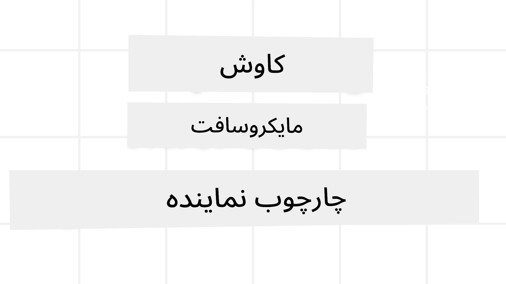
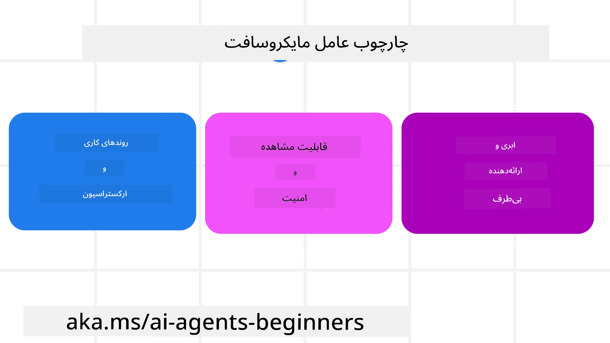
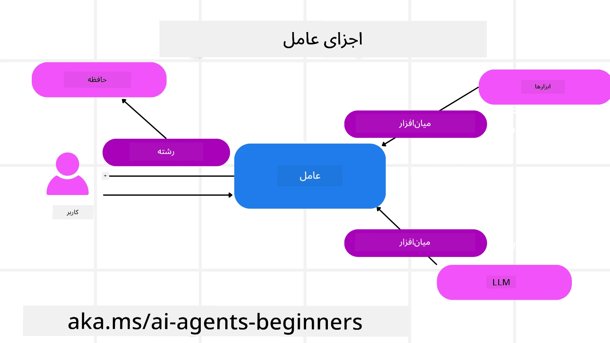

# کاوش چارچوب مایکروسافت ایجنت



### مقدمه

این درس شامل موارد زیر خواهد بود:

- درک چارچوب مایکروسافت ایجنت: ویژگی‌های کلیدی و ارزش آن  
- کاوش مفاهیم کلیدی چارچوب مایکروسافت ایجنت
- الگوهای پیشرفته MAF: گردش‌های کاری، میان‌افزار و حافظه

## اهداف یادگیری

پس از اتمام این درس، شما خواهید دانست چگونه:

- ساخت ایجنت‌های هوش مصنوعی آماده تولید با استفاده از چارچوب مایکروسافت ایجنت
- اعمال ویژگی‌های اصلی چارچوب مایکروسافت ایجنت در موارد استفاده عامل‌محور خود
- استفاده از الگوهای پیشرفته شامل گردش‌های کاری، میان‌افزار و قابلیت مشاهده

## نمونه کدها 

نمونه کدهای [چارچوب مایکروسافت ایجنت (MAF)](https://learn.microsoft.com/en-us/agent-framework/overview/?wt.mc_id=youtube_26688_organicsocial_reactor&pivots=programming-language-python) را می‌توانید در این مخزن در فایل‌های `xx-python-agent-framework` و `xx-dotnet-agent-framework` پیدا کنید.

## درک چارچوب مایکروسافت ایجنت



[چارچوب مایکروسافت ایجنت (MAF)](https://learn.microsoft.com/en-us/agent-framework/overview/?wt.mc_id=youtube_26688_organicsocial_reactor&pivots=programming-language-python) چارچوب یکپارچه مایکروسافت برای ساخت ایجنت‌های هوش مصنوعی است. این چارچوب انعطاف‌پذیری ارائه می‌دهد تا بتوان به انواع متنوع موارد استفاده عامل‌محور که در محیط‌های تولید و پژوهشی دیده می‌شوند پرداخت، از جمله:

- **هماهنگی ترتیبی ایجنت** در سناریوهایی که گردش‌های کاری قدم به قدم لازم است.
- **هماهنگی همزمان** در سناریوهایی که ایجنت‌ها باید همزمان وظایف را انجام دهند.
- **هماهنگی چت گروهی** در سناریوهایی که ایجنت‌ها می‌توانند در یک وظیفه با هم همکاری کنند.
- **هماهنگی تحویل کار** در سناریوهایی که ایجنت‌ها وظیفه را به یکدیگر واگذار می‌کنند در حالی که زیروظایف تکمیل می‌شود.
- **هماهنگی آهنربایی** در سناریوهایی که یک ایجنت مدیر یک لیست وظایف ایجاد و اصلاح می‌کند و هماهنگی زیرایجنت‌ها برای تکمیل وظیفه را مدیریت می‌کند.

برای ارائه ایجنت‌های هوش مصنوعی در تولید، MAF همچنین ویژگی‌هایی برای موارد زیر ارائه داده است:

- **قابلیت مشاهده** از طریق استفاده از OpenTelemetry که هر عمل ایجنت هوش مصنوعی از جمله فراخوانی ابزار، مراحل هماهنگی، جریان‌های استدلال و نظارت بر عملکرد از طریق داشبوردهای Microsoft Foundry را رصد می‌کند.
- **امنیت** با میزبانی بومی ایجنت‌ها در Microsoft Foundry که شامل کنترل‌های امنیتی مانند دسترسی مبتنی بر نقش، مدیریت داده‌های خصوصی و ایمنی محتوای داخلی است.
- **دوام** زیرا رشته‌ها و گردش‌های کاری ایجنت می‌توانند متوقف شده، ادامه یابند و از خطاها بازیابی شوند که فرآیندهای طولانی‌تر را امکان‌پذیر می‌کند.
- **کنترل** چون گردش‌های کاری انسانی در حلقه پشتیبانی می‌شوند که در آن وظایف به عنوان نیازمند تأیید انسانی علامت‌گذاری می‌شوند.

چارچوب مایکروسافت ایجنت همچنین بر قابلیت همکاری تمرکز دارد از طریق:

- **بی‌طرفی ابری** - ایجنت‌ها می‌توانند در کانتینرها، در محل و در چندین ابر مختلف اجرا شوند.
- **بی‌طرفی تأمین‌کننده** - ایجنت‌ها را می‌توان از طریق SDK مورد علاقه خود ایجاد کرد، از جمله Azure OpenAI و OpenAI
- **ادغام استانداردهای باز** - ایجنت‌ها می‌توانند از پروتکل‌هایی مانند Agent-to-Agent (A2A) و Model Context Protocol (MCP) برای کشف و استفاده از سایر ایجنت‌ها و ابزارها بهره‌مند شوند.
- **پلاگین‌ها و کانکتورها** - می‌توان ارتباطاتی به خدمات داده و حافظه مانند Microsoft Fabric، SharePoint، Pinecone و Qdrant برقرار کرد.

بیایید ببینیم چگونه این ویژگی‌ها در برخی از مفاهیم کلیدی چارچوب مایکروسافت ایجنت اعمال شده‌اند.

## مفاهیم کلیدی چارچوب مایکروسافت ایجنت

### ایجنت‌ها



**ایجاد ایجنت‌ها**

ایجاد ایجنت با تعریف سرویس استنتاج (ارائه‌دهنده LLM)،
مجموعه‌ای از دستورالعمل‌ها برای دنبال کردن توسط ایجنت هوش مصنوعی و یک `name` اختصاص‌یافته انجام می‌شود:

```python
agent = AzureOpenAIChatClient(credential=AzureCliCredential()).create_agent( instructions="You are good at recommending trips to customers based on their preferences.", name="TripRecommender" )
```

مورد بالا استفاده از `Azure OpenAI` است اما ایجنت‌ها می‌توانند با انواع خدمات از جمله `Microsoft Foundry Agent Service` ایجاد شوند:

```python
AzureAIAgentClient(async_credential=credential).create_agent( name="HelperAgent", instructions="You are a helpful assistant." ) as agent
```

فراخوانی‌های OpenAI `Responses`، `ChatCompletion`

```python
agent = OpenAIResponsesClient().create_agent( name="WeatherBot", instructions="You are a helpful weather assistant.", )
```

```python
agent = OpenAIChatClient().create_agent( name="HelpfulAssistant", instructions="You are a helpful assistant.", )
```

یا [MiniMax](https://platform.minimaxi.com/)، که API سازگار با OpenAI با پنجره‌های متنی بزرگ (تا 204 هزار توکن) ارائه می‌دهد:

```python
agent = OpenAIChatClient(base_url="https://api.minimax.io/v1", api_key=os.environ["MINIMAX_API_KEY"], model_id="MiniMax-M3").create_agent( name="HelpfulAssistant", instructions="You are a helpful assistant.", )
```

یا ایجنت‌های راه دور با استفاده از پروتکل A2A:

```python
agent = A2AAgent( name=agent_card.name, description=agent_card.description, agent_card=agent_card, url="https://your-a2a-agent-host" )
```

**اجرای ایجنت‌ها**

ایجنت‌ها با استفاده از متدهای `.run` یا `.run_stream` برای پاسخ‌های غیرجریان یا جریانی اجرا می‌شوند.

```python
result = await agent.run("What are good places to visit in Amsterdam?")
print(result.text)
```

```python
async for update in agent.run_stream("What are the good places to visit in Amsterdam?"):
    if update.text:
        print(update.text, end="", flush=True)

```

هر اجرای ایجنت همچنین می‌تواند گزینه‌هایی برای سفارشی‌سازی پارامترهایی مانند `max_tokens` که ایجنت استفاده می‌کند، `tools` هایی که ایجنت می‌تواند فراخوانی کند، و حتی خود `model` برای ایجنت داشته باشد.

این در مواردی مفید است که مدل‌ها یا ابزارهای خاصی برای تکمیل وظیفه کاربر لازم باشد.

**ابزارها**

ابزارها می‌توانند هم هنگام تعریف ایجنت و هم هنگام اجرای ایجنت تعریف شوند:

```python
def get_attractions( location: Annotated[str, Field(description="The location to get the top tourist attractions for")], ) -> str: """Get the top tourist attractions for a given location.""" return f"The top attractions for {location} are." 


# هنگام ایجاد مستقیم یک ChatAgent

agent = ChatAgent( chat_client=OpenAIChatClient(), instructions="You are a helpful assistant", tools=[get_attractions]

```

و همچنین هنگام اجرای ایجنت:

```python

result1 = await agent.run( "What's the best place to visit in Seattle?", tools=[get_attractions] # ابزاری که فقط برای این اجرا ارائه شده است )
```

**رشته‌های ایجنت**

رشته‌های ایجنت برای مدیریت گفتگوهای چند مرحله‌ای استفاده می‌شوند. رشته‌ها می‌توانند با یکی از روش‌های زیر ایجاد شوند:

- استفاده از `get_new_thread()` که امکان ذخیره رشته را در طول زمان فراهم می‌کند
- ایجاد خودکار یک رشته هنگام اجرای ایجنت که رشته فقط در طول اجرای فعلی باقی می‌ماند.

برای ایجاد رشته کد به این شکل است:

```python
# ایجاد یک رشته جدید.
thread = agent.get_new_thread() # اجرای عامل با رشته.
response = await agent.run("Hello, I am here to help you book travel. Where would you like to go?", thread=thread)

```

سپس می‌توانید رشته را سریال‌سازی کنید تا برای استفاده بعدی ذخیره شود:

```python
# ایجاد یک رشته جدید.
thread = agent.get_new_thread() 

# اجرای عامل با رشته.

response = await agent.run("Hello, how are you?", thread=thread) 

# سریال‌سازی رشته برای ذخیره‌سازی.

serialized_thread = await thread.serialize() 

# بازسازی حالت رشته پس از بارگذاری از ذخیره‌سازی.

resumed_thread = await agent.deserialize_thread(serialized_thread)
```

**میان‌افزار ایجنت**

ایجنت‌ها با ابزارها و LLM ها تعامل دارند تا وظایف کاربر را کامل کنند. در برخی سناریوها، می‌خواهیم بین این تعاملات عملیات یا پیگیری انجام دهیم. میان‌افزار ایجنت این امکان را فراهم می‌کند از طریق:

*میان‌افزار تابع*

این میان‌افزار اجازه می‌دهد عملی بین ایجنت و تابع/ابزاری که فراخوانی می‌کند انجام شود. مثالی از زمانی که این کاربرد دارد، وقتی است که می‌خواهید گزارش‌برداری از فراخوانی تابع داشته باشید.

در کد زیر `next` مشخص می‌کند که میان‌افزار بعدی یا خود تابع اصلی باید فراخوانی شود.

```python
async def logging_function_middleware(
    context: FunctionInvocationContext,
    next: Callable[[FunctionInvocationContext], Awaitable[None]],
) -> None:
    """Function middleware that logs function execution."""
    # پیش‌پردازش: ثبت لاگ قبل از اجرای تابع
    print(f"[Function] Calling {context.function.name}")

    # ادامه به میان‌افزار بعدی یا اجرای تابع
    await next(context)

    # پس‌پردازش: ثبت لاگ بعد از اجرای تابع
    print(f"[Function] {context.function.name} completed")
```

*میان‌افزار چت*

این میان‌افزار اجازه می‌دهد عملی بین ایجنت و درخواست‌ها بین LLM انجام یا ثبت شود.

این شامل اطلاعات مهمی مانند `messages`ی است که به سرویس هوش مصنوعی ارسال می‌شوند.

```python
async def logging_chat_middleware(
    context: ChatContext,
    next: Callable[[ChatContext], Awaitable[None]],
) -> None:
    """Chat middleware that logs AI interactions."""
    # پیش‌پردازش: ثبت لاگ قبل از فراخوانی هوش مصنوعی
    print(f"[Chat] Sending {len(context.messages)} messages to AI")

    # ادامه به میانه‌افزار بعدی یا سرویس هوش مصنوعی
    await next(context)

    # پس‌پردازش: ثبت لاگ پس از پاسخ هوش مصنوعی
    print("[Chat] AI response received")

```

**حافظه ایجنت**

همان طور که در درس `حافظه عامل‌محور` پوشش داده شد، حافظه عامل مهم است تا امکان فعالیت ایجنت در زمینه‌های مختلف فراهم شود. MAF چندین نوع حافظه ارائه می‌دهد:

*حافظه درون‌حافظه‌ای*

این حافظه در رشته‌ها در طول زمان اجرای برنامه ذخیره می‌شود.

```python
# ایجاد یک رشته جدید.
thread = agent.get_new_thread() # عامل را با رشته اجرا کنید.
response = await agent.run("Hello, I am here to help you book travel. Where would you like to go?", thread=thread)
```

*پیام‌های پایدار*

این حافظه هنگام ذخیره تاریخچه مکالمه بین جلسات مختلف استفاده می‌شود. این حافظه با استفاده از `chat_message_store_factory` تعریف می‌شود:

```python
from agent_framework import ChatMessageStore

# ایجاد یک فروشگاه پیام سفارشی
def create_message_store():
    return ChatMessageStore()

agent = ChatAgent(
    chat_client=OpenAIChatClient(),
    instructions="You are a Travel assistant.",
    chat_message_store_factory=create_message_store
)

```

*حافظه پویا*

این حافظه قبل از اجرای ایجنت‌ها به زمینه اضافه می‌شود. این حافظه‌ها می‌توانند در خدمات خارجی مانند mem0 ذخیره شوند:

```python
from agent_framework.mem0 import Mem0Provider

# استفاده از Mem0 برای قابلیت‌های پیشرفته حافظه
memory_provider = Mem0Provider(
    api_key="your-mem0-api-key",
    user_id="user_123",
    application_id="my_app"
)

agent = ChatAgent(
    chat_client=OpenAIChatClient(),
    instructions="You are a helpful assistant with memory.",
    context_providers=memory_provider
)

```

**قابلیت مشاهده ایجنت**

قابلیت مشاهده برای ساخت سیستم‌های عامل‌محور قابل اطمینان و قابل نگهداری مهم است. MAF با OpenTelemetry ادغام شده تا ردیابی و مترها را برای قابلیت مشاهده بهتر فراهم کند.

```python
from agent_framework.observability import get_tracer, get_meter

tracer = get_tracer()
meter = get_meter()
with tracer.start_as_current_span("my_custom_span"):
    # انجام کاری
    pass
counter = meter.create_counter("my_custom_counter")
counter.add(1, {"key": "value"})
```

### گردش‌های کاری

MAF گردش‌های کاری ارائه می‌دهد که گام‌های از پیش تعریف شده برای تکمیل یک کار هستند و شامل ایجنت‌های هوش مصنوعی به عنوان اجزای آن مراحل می‌شوند.

گردش‌های کاری از اجزای مختلفی تشکیل شده‌اند که کنترل جریان بهتری را فراهم می‌کنند. گردش‌های کاری همچنین امکان **هماهنگی چند ایجنت** و **ذخیره نقطه بازگشت** برای ذخیره وضعیت گردش کار را می‌دهند.

اجزای اصلی یک گردش کاری عبارتند از:

**اجراکننده‌ها**

اجراکننده‌ها پیام‌های ورودی را دریافت می‌کنند، وظایف محول شده را انجام می‌دهند و سپس پیام خروجی تولید می‌کنند. این روند گردش کار را به سمت تکمیل کار بزرگتر پیش می‌برد. اجراکننده‌ها می‌توانند ایجنت هوش مصنوعی یا منطق سفارشی باشند.

**لبه‌ها**

لبه‌ها برای تعریف جریان پیام‌ها در گردش کاری استفاده می‌شوند. این لبه‌ها می‌توانند باشند:

*لبه‌های مستقیم* - اتصالات ساده یک به یک بین اجراکنندگان:

```python
from agent_framework import WorkflowBuilder

builder = WorkflowBuilder()
builder.add_edge(source_executor, target_executor)
builder.set_start_executor(source_executor)
workflow = builder.build()
```

*لبه‌های شرطی* - زمانی فعال می‌شود که شرط خاصی برآورده شود. برای مثال، وقتی اتاق‌های هتل موجود نیست، اجراکننده می‌تواند گزینه‌های دیگری پیشنهاد دهد.

*لبه‌های سوئیچ-کیس* - پیام‌ها را بر اساس شرایط تعریف شده به اجراکنندگان مختلف مسیر می‌دهد. برای مثال، اگر مشتری سفر دسترسی اولویت داشته باشد، وظایف آنها از طریق گردش کاری دیگری انجام می‌شود.

*لبه‌های چندشاخه‌پخش* - یک پیام را به چندین مقصد ارسال می‌کند.

*لبه‌های چندشاخه‌جمع* - چندین پیام از اجراکنندگان مختلف جمع‌آوری شده و به یک مقصد ارسال می‌شود.

**رویدادها**

برای فراهم کردن قابلیت مشاهده بهتر در گردش‌های کاری، MAF رویدادهای داخلی برای اجرای کار ارائه می‌دهد شامل:

- `WorkflowStartedEvent`  - اجرای گردش کار آغاز می‌شود
- `WorkflowOutputEvent` - گردش کار خروجی تولید می‌کند
- `WorkflowErrorEvent` - گردش کار به خطا برخورد می‌کند
- `ExecutorInvokeEvent`  - اجراکننده پردازش را شروع می‌کند
- `ExecutorCompleteEvent`  - اجراکننده پردازش را تمام می‌کند
- `RequestInfoEvent` - یک درخواست صادر می‌شود

## الگوهای پیشرفته MAF

بخش‌های بالا مفاهیم کلیدی چارچوب مایکروسافت ایجنت را پوشش می‌دهند. هنگام ساخت ایجنت‌های پیچیده‌تر، الگوهای پیشرفته زیر را در نظر بگیرید:

- **ترکیب میان‌افزار**: زنجیره‌ای از چندین هندلر میان‌افزار (گزارش‌گیری، احراز هویت، محدودیت نرخ) را با میان‌افزار تابع و چت برای کنترل دقیق رفتار ایجنت ایجاد کنید.
- **ذخیره نقطه بازگشت گردش کار**: با استفاده از رویدادهای گردش کار و سریال‌سازی، فرآیندهای طولانی مدت ایجنت را ذخیره و ادامه دهید.
- **انتخاب پویا ابزارها**: ترکیب RAG روی توضیحات ابزار با ثبت ابزار در MAF برای ارائه فقط ابزارهای مرتبط با هر پرس و جو.
- **تحویل چند ایجنتی**: با استفاده از لبه‌های گردش کار و مسیریابی شرطی، تحویل بین ایجنت‌های تخصصی را هماهنگ کنید.

## میزبانی ایجنت‌های LangChain / LangGraph در Microsoft Foundry

چارچوب مایکروسافت ایجنت **قابل همکاری بین چارچوب‌ها** است — محدود به ایجنت‌های نوشته شده با MAF نیستید. اگر قبلاً ایجنتی با **LangChain** یا **LangGraph** ساخته‌اید، می‌توانید آن را به عنوان یک **ایجنت میزبانی شده Microsoft Foundry** اجرا کنید تا Foundry زمان اجرا، جلسات، مقیاس‌پذیری، هویت و نقطه‌های پایانی پروتکل را مدیریت کند، در حالی که منطق ایجنت شما در LangGraph باقی می‌ماند.

این با بسته `langchain_azure_ai.agents.hosting` انجام می‌شود که یک گراف کامپایل شده LangGraph را بر روی همان پروتکل‌هایی که ایجنت‌های میزبانی شده Foundry استفاده می‌کنند، ارائه می‌دهد.

**۱. نصب افزونه میزبانی:**

```bash
pip install -U "langchain-azure-ai[hosting]>=1.2.4" azure-identity
```

افزونه `hosting` کتابخانه‌های پروتکل Foundry را نصب می‌کند: `azure-ai-agentserver-responses` (نقطه پایانی سازگار با OpenAI `/responses`) و `azure-ai-agentserver-invocations` (نقطه پایانی عمومی `/invocations`).

**۲. انتخاب پروتکل میزبانی:**

| پروتکل | کلاسی میزبان | نقطه پایانی | استفاده در چه زمانی |
|----------|-----------|----------|----------|
| **Responses** | `ResponsesHostServer` | `/responses` | می‌خواهید چت سازگار با OpenAI، استریمینگ، تاریخچه پاسخ و رشته‌بندی مکالمه داشته باشید — توصیه شده به عنوان پیش‌فرض برای ایجنت‌های مکالمه‌ای. |
| **Invocations** | `InvocationsHostServer` | `/invocations` | نیاز به شکل JSON سفارشی، نقطه پایانی شبیه webhook یا پردازش غیر مکالمه‌ای دارید. |

چون **API Responses API، API اصلی توسعه ایجنت در Foundry است**، برای بیشتر ایجنت‌ها با `ResponsesHostServer` شروع کنید.

**۳. پیکربندی متغیرهای محیطی** (ابتدا `az login` تا `DefaultAzureCredential` بتواند احراز هویت کند):

```bash
export FOUNDRY_PROJECT_ENDPOINT="https://<resource>.services.ai.azure.com/api/projects/<project>"
export FOUNDRY_MODEL_NAME="gpt-5-mini"
```

زمانی که ایجنت بعداً به عنوان ایجنت میزبانی شده در Foundry اجرا می‌شود، پلتفرم به صورت خودکار `FOUNDRY_PROJECT_ENDPOINT` را تزریق می‌کند.

**۴. ارائه یک ایجنت LangGraph بر روی پروتکل Responses:**

```python
import os

from azure.ai.projects import AIProjectClient
from azure.identity import DefaultAzureCredential, get_bearer_token_provider
from langchain.agents import create_agent
from langchain_openai import ChatOpenAI
from langchain_azure_ai.agents.hosting import ResponsesHostServer

_AZURE_AI_SCOPE = "https://ai.azure.com/.default"


def build_chat_model() -> ChatOpenAI:
    project_endpoint = os.environ["FOUNDRY_PROJECT_ENDPOINT"].rstrip("/")
    deployment = os.environ.get("FOUNDRY_MODEL_NAME", "gpt-5-mini")
    credential = DefaultAzureCredential()
    project = AIProjectClient(endpoint=project_endpoint, credential=credential)
    openai_client = project.get_openai_client()
    token_provider = get_bearer_token_provider(credential, _AZURE_AI_SCOPE)

    # این بخش ChatOpenAI به نقطه پایانی سازگار با OpenAI پروژه Foundry (پاسخ‌ها) اشاره دارد.
    return ChatOpenAI(
        model=deployment,
        base_url=str(openai_client.base_url),
        api_key=token_provider,
    )


def main() -> None:
    graph = create_agent(build_chat_model(), tools=[])
    port = int(os.environ.get("PORT", "8088"))
    ResponsesHostServer(graph).run(port=port)


if __name__ == "__main__":
    main()
```

آن را به صورت محلی با `python main.py` اجرا کنید، سپس یک درخواست Responses به `http://localhost:8088/responses` ارسال کنید.

**رفتارهای کلیدی:**

- **مکالمات**: کلاینت‌ها مکالمه را با ارسال `previous_response_id` یا شناسه `conversation` ادامه می‌دهند. اگر گراف شما با یک LangGraph checkpointer کامپایل شده باشد، Foundry وضعیت مکالمه را به نقطه بازگشت کلید می‌کند (برای تولید از checkpointer بادوام استفاده کنید؛ `MemorySaver` برای آزمایش محلی مناسب است).
- **انسان در حلقه**: اگر گراف شما از `interrupt()` در LangGraph استفاده کند، `ResponsesHostServer` وقفه معلق را به عنوان مورد `function_call` / `mcp_approval_request` در Responses نمایش می‌دهد و کلاینت‌ها با `function_call_output` / `mcp_approval_response` مشابه ادامه می‌دهند.
- **استقرار در Foundry**: از Azure Developer CLI استفاده کنید — `azd ext install azure.ai.agents`، `azd ai agent init -m <manifest>`، `azd ai agent run` (محلی، نیاز به Docker)، سپس `azd provision` و `azd deploy`. استقرار ایجنت میزبانی شده نیاز به نقش **Foundry Project Manager** دارد.

نسخه قابل اجرا این مثال در [code-samples/14-langchain-hosted-agent.py](../../../14-microsoft-agent-framework/code-samples/14-langchain-hosted-agent.py) موجود است. برای آموزش کامل (پروتکل Invocations، طرح‌های درخواست سفارشی، و عیب‌یابی) به [میزبانی ایجنت‌های LangGraph به عنوان ایجنت‌های میزبانی شده Foundry](https://learn.microsoft.com/azure/foundry/how-to/develop/langchain-hosted-agents) مراجعه کنید.

## نمونه کدها 

نمونه کدهای چارچوب مایکروسافت ایجنت را می‌توانید در این مخزن در فایل‌های `xx-python-agent-framework` و `xx-dotnet-agent-framework` بیابید.

## سوالات بیشتری درباره چارچوب مایکروسافت ایجنت دارید؟

به [Discord مایکروسافت فوندری](https://discord.com/invite/ATgtXmAS5D) بپیوندید تا با سایر یادگیرندگان ملاقات کنید، در ساعت‌های اداری شرکت کنید و سوالات خود درباره ایجنت‌های هوش مصنوعی را مطرح کنید.
## درس قبلی

[حافظه برای ایجنت‌های هوش مصنوعی](../13-agent-memory/README.md)

## درس بعدی

[ساخت ایجنت‌های استفاده از کامپیوتر (CUA)](../15-browser-use/README.md)

---

<!-- CO-OP TRANSLATOR DISCLAIMER START -->
**سلب مسئولیت**:
این سند با استفاده از سرویس ترجمه هوش مصنوعی [Co-op Translator](https://github.com/Azure/co-op-translator) ترجمه شده است. در حالی که ما در تلاش برای دقت هستیم، لطفاً توجه داشته باشید که ترجمه‌های خودکار ممکن است شامل خطاها یا نادرستی‌هایی باشند. سند اصلی به زبان مادری خود باید به عنوان منبع معتبر در نظر گرفته شود. برای اطلاعات حیاتی، ترجمه حرفه‌ای انسانی توصیه می‌شود. ما در قبال هرگونه سوء تفاهم یا برداشت نادرست ناشی از استفاده از این ترجمه مسئولیتی نداریم.
<!-- CO-OP TRANSLATOR DISCLAIMER END -->