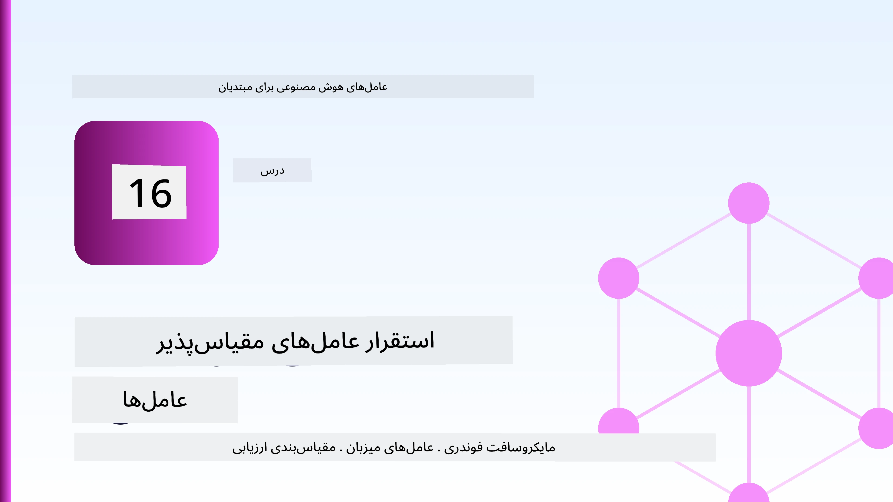
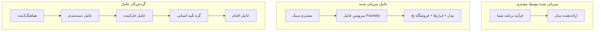
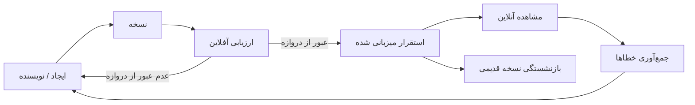
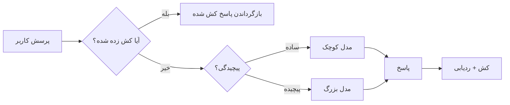
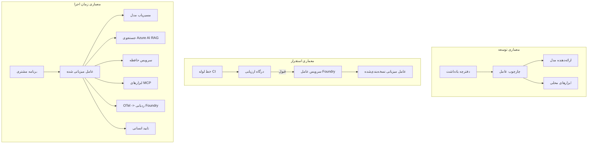

# استقرار عامل‌های مقیاس‌پذیر با Microsoft Foundry



تا این مرحله در دوره، عامل‌هایی ساختید که روی لپ‌تاپ خودتان، داخل یک نوت‌بوک اجرا می‌شوند، با استفاده از `az login` و چند متغیر محیطی. این دقیقاً روش مناسبی برای یادگیری است. این روش مناسبی برای اجرای عاملی که هزاران مشتری روی آن در ساعت 3 صبح حساب می‌کنند، نیست.

این درس درباره فاصله بین "روی دستگاه من کار می‌کند" و "به‌طور مطمئن و مقرون‌به‌صرفه در تولید کار می‌کند" است. ما این فاصله را با استفاده از **Microsoft Foundry** و **Microsoft Foundry Agent Service** پر می‌کنیم، و این کار را با ساخت یک عامل پشتیبانی مشتری واقعی انجام می‌دهیم که ابزار، بازیابی، حافظه، ارزیابی، و نظارت دارد.

## مقدمه

این درس موارد زیر را پوشش می‌دهد:

- تفاوت بین یک **عامل نمونه اولیه** و یک **عامل مستقر شده** و چرایی اینکه گذار بیشتر مربوط به همه چیز *اطراف* مدل است.
- **الگوهای استقرار** برای عامل‌ها: میزبانی روی کلاینت، میزبانی سرویسی (Hosted Agents)، و گردش کار هماهنگ‌شده.
- **چرخه عمر عامل** در Microsoft Foundry — ایجاد، نسخه‌بندی، استقرار، ارزیابی، مشاهده، بازنشستگی.
- **استراتژی‌های مقیاس‌بندی**: روتینگ مدل، ذخیره‌سازی کش، همزمانی، و طراحی بدون وضعیت.
- **قابلیت مشاهده** با OpenTelemetry و ردیابی Foundry.
- **بهینه‌سازی هزینه** از طریق انتخاب مدل، روتینگ، و دروازه‌های ارزیابی.
- **ملاحظات سازمانی**: حاکمیت، تأیید انسانی، و اجرا کردن سرورهای MCP به شکل امن در تولید.

## اهداف یادگیری

پس از اتمام این درس، خواهید دانست چگونه:

- الگوی استقرار مناسب برای بار کاری یک عامل مشخص را انتخاب کنید.
- عاملی را در Microsoft Foundry Agent Service مستقر کنید تا نسخه‌بندی شده، تحت حاکمیت و قابل مشاهده باشد.
- عاملی را برای ردیابی ابزارمند کرده و یک خط ارزیابی را که پیش از هر انتشار اجرا می‌شود، برقرار کنید.
- از روتینگ مدل و کش برای کنترل تأخیر و هزینه در مقیاس استفاده کنید.
- دروازه تأیید انسانی برای عملیات پرریسک اضافه کنید و سرور MCP را به شکل امن در تولید یکپارچه کنید.

## پیش‌نیازها

این درس فرض می‌کند شما درس‌های قبلی را به پایان رسانده‌اید و با موارد زیر آشنا هستید:

- ساخت عامل‌ها با [Microsoft Agent Framework](../14-microsoft-agent-framework/README.md) (درس ۱۴).
- [استفاده از ابزار](../04-tool-use/README.md) (درس ۴) و [Agentic RAG](../05-agentic-rag/README.md) (درس ۵).
- [حافظه عامل](../13-agent-memory/README.md) (درس ۱۳) و [پروتکل‌های عامل / MCP](../11-agentic-protocols/README.md) (درس ۱۱).
- [قابلیت مشاهده و ارزیابی](../10-ai-agents-production/README.md) (درس ۱۰) — این درس مستقیماً بر آن بنا شده است.

همچنین به موارد زیر نیاز خواهید داشت:

- یک **اشتراک Azure** و یک **پروژه Microsoft Foundry** با حداقل یک مدل چت مستقر شده.
- **Azure CLI** احراز هویت شده (`az login`).
- پایتون ۳.۱۲+ و بسته‌های موجود در مخزن [`requirements.txt`](../../../requirements.txt).

## از نمونه اولیه تا تولید: چه چیزی واقعا تغییر می‌کند

یک عامل نمونه اولیه و یک عامل تولیدی حلقه اصلی یکسانی دارند — استدلال، فراخوانی ابزارها، پاسخ. آنچه تغییر می‌کند همه چیز اطراف آن حلقه است. مدل شاید ۲۰٪ از یک عامل تولیدی باشد؛ ۸۰٪ دیگر اسکلت عملیاتی است.

| موضوع | نمونه اولیه | تولید |
| --- | --- | --- |
| **میزبانی** | در نوت‌بوک شما اجرا می‌شود | به شکل سرویس میزبانی شده، نسخه‌بندی شده و ارائه می‌شود |
| **هویت** | توکن `az login` شما | هویت مدیریت‌شده با RBAC محدود |
| **وضعیت** | در حافظه موقت، هنگام راه‌اندازی مجدد از دست می‌رود | برون‌سپاری شده (ذخیره نخ، سرویس حافظه) |
| **خطا** | شما traceback را می‌بینید | تلاش دوباره، مسیرهای جایگزین، نامه‌های خطا، هشدارها |
| **هزینه** | "چند سنت" است | به ازای هر درخواست رصد می‌شود، مسیریابی، کش و بودجه‌بندی می‌شود |
| **کیفیت** | شما خروجی را نگاه می‌کنید | پیش از هر انتشار به‌طور خودکار ارزیابی می‌شود |
| **اعتماد** | شما هر عمل را تأیید می‌کنید | سیاست + درگیر کردن انسان برای عملیات پرخطر |

این جدول را به خاطر بسپارید. هر بخش زیر به یکی از این ردیف‌ها مربوط است.

## الگوهای استقرار عامل

سه الگوی اصلی وجود دارد که اغلب با هم ترکیب می‌شوند.

### 1. عامل‌های میزبانی شده روی کلاینت

شیء عامل در فرآیند برنامه *شما* زندگی می‌کند. کد شما مستقیماً ارائه‌دهنده مدل را فراخوانی می‌کند؛ حلقه استدلال در سرویس شما اجرا می‌شود. این کاری است که همه درس‌های قبلی انجام دادند.

- **زمان استفاده:** وقتی نیاز به کنترل کامل بر حلقه، میدل‌ویر سفارشی دارید یا عامل را داخل بک‌اند موجود جاسازی می‌کنید.
- **محدودیت:** خودتان مسئول مقیاس، وضعیت و پایداری هستید.

### 2. عامل‌های میزبانی شده (Foundry Agent Service)

عامل به عنوان یک **منبع ثبت شده** در Microsoft Foundry است. Foundry حلقه استدلال را میزبانی می‌کند، نخ‌ها را ذخیره می‌کند، امنیت محتوا و RBAC را تحمیل می‌کند و عامل را در پرتال Foundry قابل مشاهده می‌سازد. اپلیکیشن شما به یک کلاینت سبک تبدیل می‌شود که نخ ایجاد می‌کند و پاسخ‌ها را می‌خواند.

- **زمان استفاده:** وقتی دوام، قابلیت مشاهده داخلی، حاکمیت و سطح عملیاتی کمتر می‌خواهید.
- **محدودیت:** کنترل سطح پایین کمتری در ازای یک محیط مدیریت شده.

### 3. گردش کار عامل‌ها

چند عامل (و ابزار) به صورت یک گراف با جریان کنترل صریح ترکیب می‌شوند — مراحل متوالی، انشعاب، گره‌های تأیید انسانی، و نقاط بازبینی پایدار که می‌توانند مکث و از سرگیری کنند. این قابلیت Microsoft Agent Framework **Workflows** است که در مقیاس استقرار به کار می‌رود.

- **زمان استفاده:** وقتی یک کار واحد شامل چند عامل تخصصی است یا به مرحله تأیید انسانی نیاز دارد.
- **محدودیت:** قطعات متحرک بیشتر؛ نیازمند قابلیت مشاهده در سطح ارکستراسیون.



## چرخه عمر عامل در Microsoft Foundry

استقرار یک عامل یک عملیات یکباره `push` نیست. این یک حلقه است، و بسیار شبیه چرخه انتشار نرم‌افزار است چون دقیقاً همان است.



ایده کلیدی، که از [درس ۱۰](../10-ai-agents-production/README.md) آمده: **ارزیابی آفلاین یک دروازه است، نه یک فکر بعدی.** یک نسخه جدید از عامل منتشر نمی‌شود مگر اینکه آستانه‌های ارزیابی شما را بگذراند. قابلیت مشاهده آنلاین سپس شکست‌های جهان واقعی را به مجموعه تست آفلاین شما بازخورد می‌دهد. این کل حلقه است.

## استراتژی‌های مقیاس‌بندی

مقیاس‌بندی عامل با مقیاس‌بندی یک API وب بدون وضعیت متفاوت است چون هر درخواست می‌تواند چندین فراخوانی مدل و ابزار پرهزینه به راه اندازد. چهار تکنیک بار عمده را تحمل می‌کنند.

**پردازش درخواست بدون حالت.** هیچ حالت کاربری در حافظه پردازش خود نگه ندارید. رشته‌های مکالمه را در فروشگاه نخ Foundry یا سرویس حافظه ذخیره کنید تا هر نمونه‌ای بتواند هر درخواست را مدیریت کند. این چیزی است که به شما امکان مقیاس افقی می‌دهد — افزودن نمونه‌ها، بدون نشست‌های چسبنده.

**روتینگ مدل.** هر درخواستی نیاز ندارد به مدل قدرتمند و پرهزینه شما برود. درخواست‌های ساده — طبقه‌بندی نیت، پاسخ‌های کوتاه و حقیقی — را به مدل کوچک و سریع هدایت کنید، و مدل بزرگ را برای استدلال واقعی نگه دارید. **Model Router** Foundry می‌تواند این را برای شما انجام دهد، یا خودتان یک طبقه‌بند سبک بسازید. نسخه خودساخت در آزمایشگاه ساخته می‌شود.

**کش پاسخ‌ها.** بسیاری از پرسش‌های پشتیبانی تقریباً تکراری‌اند ("چطور رمز عبورم را ریست کنم؟"). پاسخ‌ها به سوالات متداول را کش کنید و بدون تماس با مدل ارائه دهید. حتی نرخ برخورد کش متوسط به شکل قابل توجهی هزینه و تأخیر را کاهش می‌دهد.

**همزمانی و فشار برگشتی.** ارائه‌دهندگان مدل محدودیت نرخ دارند. همزمانی خود را محدود کنید، از تلاش مجدد با زمان‌بندی نمایی استفاده کنید، و با نرمی شکست را مدیریت کنید (پاسخ صف شده "ما رویش کار می‌کنیم" بهتر از خطای 500 است).



## قابلیت مشاهده در تولید

چیزی که نمی‌توانید ببینید، نمی‌توانید اداره کنید. همانطور که در درس ۱۰ بسط داده شد، Microsoft Agent Framework به طور بومی ردپاهای **OpenTelemetry** تولید می‌کند — هر فراخوان مدل، فراخوانی ابزار، و گام ارکستراسیون یک اسپن می‌شود. در تولید شما آن‌ها را به Microsoft Foundry (یا هر backend سازگار با OTel) صادر می‌کنید تا بتوانید:

- یک شکایت مشتری را از ابتدا تا انتها در تمام فراخوان‌های مدل و ابزار پیگیری کنید.
- تاخیر p50/p95 و هزینه به ازای هر درخواست را در طول زمان رصد کنید.
- روی افزایش نرخ خطا و ناهنجاری‌های هزینه قبل از اینکه کاربران شما (یا تیم مالی‌تان) متوجه شوند هشدار دهید.

```python
from agent_framework.observability import get_tracer

tracer = get_tracer()

with tracer.start_as_current_span("support_request") as span:
    span.set_attribute("customer.tier", "enterprise")
    span.set_attribute("routed.model", "gpt-5-nano")
    # اجرای عامل به طور خودکار در این بازه ردیابی می‌شود
```

ویژگی‌هایی مانند `customer.tier` و `routed.model` چیزی هستند که یک دیوار ردپاها را به سوالات قابل پاسخ تبدیل می‌کنند ("آیا مشتریان سازمانی بیش از حد به مدل کوچک هدایت می‌شوند؟").

## بهینه‌سازی هزینه

هزینه در عامل‌های تولیدی عمدتاً توسط توکن‌ها تعیین می‌شود. سه اهرم به ترتیب تأثیر:

1. **مدل مناسب را انتخاب کنید.** یک مدل کوچک که دروازه ارزیابی شما را می‌گذراند تقریباً همیشه از یک مدل بزرگ که آن را پشت سر می‌گذارد ارزان‌تر است. از ارزیابی برای *اثبات* کافی بودن مدل کوچک استفاده کنید به جای آنکه صرفاً از روی احتیاط بزرگ‌ترین مدل را انتخاب کنید.
2. **بر اساس پیچیدگی مسیریابی کنید.** همانطور که گفته شد — فقط برای درخواست‌هایی که نیاز به استدلال مدل بزرگ دارند هزینه مدل بزرگ را بپردازید.
3. **کش را تهاجمی انجام دهید.** ارزان‌ترین فراخوان مدل آن است که اصلاً انجام نمی‌شود.

دروازه‌های ارزیابی و کنترل هزینه دو دیدگاه یکسان‌اند: ارزیابی به شما *کف کیفیت* را می‌گوید، روتینگ و کش هزینه را تا نزدیک‌ترین حد ممکن به آن کف نگه می‌دارند.

## ملاحظات استقرار سازمانی

**حاکمیت.** عامل‌های میزبانی شده از RBAC، امنیت محتوا، و ثبت حسابرسی Foundry ارث می‌برند. به هر عامل یک هویت مدیریت شده با حداقل امتیاز لازم بدهید — دسترسی فقط خواندنی به پایگاه دانش، دسترسی محدوده‌دار به API تیکتینگ، و هیچ بیش‌تر.

**در حلقه انسانی.** برخی عملیات بیش از حد بااهمیت‌اند که فقط به صورت خودکار انجام شوند — صدور بازپرداخت، حذف حساب، ارجاع به تیم حقوقی. Microsoft Agent Framework از ابزارهای **نیازمند تأیید** پشتیبانی می‌کند: عامل عملیات را پیشنهاد می‌کند، اجرا مکث می‌کند، یک انسان تأیید یا رد می‌کند، و گردش کار ادامه می‌یابد. شما این ساختار را در [درس ۶](../06-building-trustworthy-agents/README.md) دیدید؛ اینجا آن را مستقر می‌کنید.

**MCP در تولید.** [MCP](../11-agentic-protocols/README.md) اجازه می‌دهد عامل شما ابزارهای خارجی را از طریق یک رابط استاندارد مصرف کند. در تولید، هر سرور MCP را به عنوان یک مرز غیرقابل اعتماد در نظر بگیرید: نسخه سرور را ثابت کنید، آن را با هویتی محدود اجرا کنید، خروجی‌های آن را اعتبارسنجی کنید، و هرگز اسرار را به آن نشان ندهید. یک سرور MCP یک وابستگی است، و وابستگی‌ها وصله می‌شوند، حسابرسی می‌شوند و نرخ محدود می‌گردند.



این سه نمودار — توسعه، استقرار، زمان اجرا — همان عامل در سه مرحله از زندگی آن هستند. آزمایشگاه بعدی شما را در ساخت آن هدایت خواهد کرد.

## آزمایشگاه عملی: عامل پشتیبانی مشتری آماده تولید

فایل [`code_samples/16-python-agent-framework.ipynb`](./code_samples/16-python-agent-framework.ipynb) را باز کرده و از ابتدا تا انتها کار کنید. شما یک **عامل پشتیبانی مشتری Contoso** را با هر موضوع تولیدی به هم پیوسته خواهید ساخت:

۱. **فراخوانی ابزار** — بررسی وضعیت سفارش و باز کردن تیکت‌های پشتیبانی.
۲. **RAG** — پاسخ به سوالات سیاست از پایگاه دانش (Azure AI Search، با جایگزین حافظه موقت تا نوت‌بوک بدون منبع Search اجرا شود).
۳. **حافظه** — به یاد داشتن مشتری در طول نوبت‌های گفت‌وگو.
۴. **روتینگ مدل** — طبقه‌بندی پیچیدگی هر درخواست را به مدل کوچک یا بزرگ هدایت می‌کند.
۵. **کش پاسخ‌ها** — سوالات تکراری از کش ارائه می‌شوند.
۶. **تأیید انسانی** — بازپرداخت‌های بالاتر از آستانه برای امضای انسانی مکث می‌کنند.
۷. **خط ارزیابی** — یک مجموعه تست کوچک آفلاین عامل را نمره داده و به‌عنوان دروازه انتشار عمل می‌کند.
۸. **قابلیت مشاهده** — ردیابی OpenTelemetry حول هر درخواست.

### راهنمای گام به گام

نوت‌بوک به گونه‌ای سازماندهی شده که هر نگرانی تولیدی یک بخش مستقل و قابل اجرا باشد. هسته آن کنترل‌کننده درخواست‌های روتینگ به علاوه کش است:

```python
async def handle_support_request(query: str, customer_id: str) -> str:
    # ۱. هر زمان که امکان دارد از کش سرویس دهی کنید.
    cached = response_cache.get(normalize(query))
    if cached:
        return cached

    # ۲. بر اساس پیچیدگی مسیر یابی کنید تا هزینه کنترل شود.
    model = "gpt-5-nano" if is_simple(query) else "gpt-5-mini"

    # ۳. برای قابلیت مشاهده، عامل را درون یک بازه ردگیری اجرا کنید.
    with tracer.start_as_current_span("support_request") as span:
        span.set_attribute("routed.model", model)
        span.set_attribute("customer.id", customer_id)
        response = await support_agent.run(query, model=model)

    # ۴. کش کنید و بازگردانید.
    response_cache.set(normalize(query), response.text)
    return response.text
```

دروازه ارزیابی که نگهبان نسخه است این‌گونه است:

```python
async def evaluation_gate(agent, test_cases, threshold: float = 0.8) -> bool:
    passed = 0
    for case in test_cases:
        result = await agent.run(case["input"])
        if score_response(result.text, case["expected"]) >= 0.8:
            passed += 1
    pass_rate = passed / len(test_cases)
    print(f"Evaluation pass rate: {pass_rate:.0%} (gate: {threshold:.0%})")
    return pass_rate >= threshold  # فقط در صورت گذشت گیت مستقر کن
```

هر خط را بخوانید — نوت‌بوک عمدی ساختارهای مقدماتی را کوچک نگه می‌دارد تا هیچ چیزی پشت فراخوان چارچوب مخفی نشود.

## اعتبارسنجی عامل مستقر شده با تست‌های دود

دروازه ارزیابی بالا به صورت *آفلاین* علیه شیء عامل شما اجرا می‌شود. وقتی عامل به عنوان Hosted Agent مستقر شد، شما به یک بررسی ارزان‌تر نیاز دارید: **آیا نقطه پایانی مستقر شده واقعاً پاسخ می‌دهد؟**

استقرار "موفق" فقط اثبات می‌کند که صفحه کنترل تعریف را پذیرفته — این اثبات نمی‌کند که عامل پاسخ می‌دهد. نبود یک وابستگی، روتینگ مدل بد، یا اتصال منقضی شده می‌تواند منجر به استقراری سبز شود که هیچ چیزی برنمی‌گرداند. یک **تست دود** این مشکل را در چند ثانیه، در هر استقرار، بدون هزینه یک ارزیابی کامل می‌گیرد.

این مخزن یک خط لوله تست دود آماده استفاده ارائه می‌دهد که بر اساس اکشن GitHub [AI Smoke Test](https://github.com/marketplace/actions/ai-smoke-test) ساخته شده است:

- **کاتالوگ** — [`tests/lesson-16-smoke-tests.json`](../../../tests/lesson-16-smoke-tests.json) شامل پرسش‌ها و ادعاهایی برای عامل پشتیبانی Contoso است (پاسخ‌های سیاست مبتنی بر داده، بررسی سفارش، ماندن روی موضوع، و پیوستگی چند نوبتی). کاتالوگ‌های عامل‌های درس‌های دیگر کنار آن قرار دارند — ببینید [`tests/README.md`](../tests/README.md).
- **گردش کار** — [`.github/workflows/smoke-test.yml`](../../../.github/workflows/smoke-test.yml) با Azure OIDC لاگین کرده و هر پرسش را به نقطه پاسخ‌های عامل POST می‌کند، در صورت عدم تطابق هر ادعا کار را شکست می‌دهد.

```yaml
- name: Smoke-test hosted agent
  uses: JFolberth/ai-smoketest@v1
  with:
    project_endpoint: ${{ inputs.project_endpoint }}
    agent_name: ContosoSupportAgent
    tests_file: tests/lesson-16-smoke-tests.json
```


آن را از برگه **Actions** اجرا کنید زمانی که عامل شما مستقر شده است، با ارائه نقطه پایانی پروژه Foundry و نام عامل خود. هویت فدراسیون شده نیاز به نقش **Azure AI User** در دامنه پروژه Foundry دارد. لایه‌ها را به صورت یک هرم تصور کنید: تست‌های دود (آیا قابل دسترسی و پاسخگو است؟) در هر استقرار اجرا می‌شوند، ارزیابی آفلاین (آیا به اندازه کافی خوب است برای ارسال؟) قبل از ارتقا اجرا می‌شود و ارزیابی آنلاین (در عمل چگونه عمل می‌کند؟) به طور مداوم اجرا می‌شود.

## بررسی دانش

قبل از رفتن به تمرین، درک خود را آزمایش کنید.

**1. تقریباً چه مقدار از یک عامل تولیدی «مدل» است و بقیه چیست؟**

<details>
<summary>پاسخ</summary>

مدل بخش کمی از سیستم است — اغلب حدود ۲۰٪ ذکر می‌شود. باقی‌مانده اسکلت عملیاتی است: میزبانی و نسخه‌بندی، هویت و RBAC، حالت خارجی‌شده، مدیریت خطا، ردیابی هزینه، ارزیابی، و کنترل‌های انسان‌درحلقه. حرکت به سمت تولید بیشتر درباره ساخت همه چیز *در اطراف* حلقه استدلال است.
</details>

**2. چه زمانی یک Hosted Agent را به یک عامل میزبانی شده در کلاینت ترجیح می‌دهید؟**

<details>
<summary>پاسخ</summary>

هنگامی که می‌خواهید یک زمان اجرای مدیریت شده با دوام داخلی (رشته‌هایی که پایدار هستند و می‌توانند ادامه یابند)، قابلیت مشاهده، ایمنی محتوا و RBAC داشته باشید، و مایلید برخی کنترل‌های سطح پایین حلقه استدلال را به ازای کاهش سطح عملیات فدا کنید. میزبانی شده در کلاینت زمانی ترجیح داده می‌شود که نیاز به کنترل کامل بر حلقه دارید یا عامل را در یک بک‌اند موجود جاسازی می‌کنید.
</details>

**3. چرا یک عامل قابل مقیاس باید در حافظه فرایند خود بدون حالت باشد؟**

<details>
<summary>پاسخ</summary>

تا هر نمونه‌ای بتواند هر درخواستی را مدیریت کند، که این امکان مقیاس‌پذیری افقی بدون نشست‌های چسبنده را فراهم می‌کند. حالت مکالمه هر کاربر به فروشگاه رشته یا سرویس حافظه برون‌سپاری شده است. اگر حالت در حافظه فرایند باشد، در هنگام راه‌اندازی مجدد از دست می‌رود و نمی‌توان بار را آزادانه توزیع کرد.
</details>

**4. مدل مسیریابی چه مشکلی را حل می‌کند و چگونه با ارزیابی مرتبط است؟**

<details>
<summary>پاسخ</summary>

مسیریابی درخواست‌های ساده را به یک مدل کوچک، ارزان و سریع می‌فرستد و مدل بزرگ را برای استدلال واقعی ذخیره می‌کند، که هم تأخیر و هم هزینه را کنترل می‌کند. این با ارزیابی مرتبط است زیرا ارزیابی چیزی است که *ثابت می‌کند* مدل کوچک برای یک دسته از درخواست‌ها به اندازه کافی خوب است — مسیریابی بدون ارزیابی حدس زدن است.
</details>

**5. "دروازه ارزیابی" چیست و کجا در چرخه عمر قرار دارد؟**

<details>
<summary>پاسخ</summary>

دروازه ارزیابی مجموعه‌ای از تست‌های آفلاین را روی نسخه جدید عامل اجرا می‌کند و مگر اینکه نرخ موفقیت از یک آستانه عبور کند، استقرار را مسدود می‌کند. این بین «نسخه» و «استقرار» در چرخه عمر قرار دارد و کیفیت را شرط لازم برای انتشار می‌کند تا چیزی که بعد از ارسال بررسی شود.
</details>

**6. چرا باید سرور MCP به عنوان یک مرز غیرقابل اعتماد در تولید در نظر گرفته شود؟**

<details>
<summary>پاسخ</summary>

زیرا این یک وابستگی خارجی است که عامل شما به آن فراخوانی می‌کند. باید نسخه آن را پین کنید، با هویتی محدود شده اجرا کنید، خروجی‌های آن را اعتبارسنجی کنید، محدودیت نرخ بگذارید و هرگز اسرار را به آن ندهید — همان انضباطی که به هر وابستگی سوم‌شخص اعمال می‌کنید. خروجی‌های آن وارد استدلال عامل شما می‌شود، پس اعتماد بدون اعتبارسنجی خطر امنیتی است.
</details>

**7. کدام تغییر منفرد معمولاً بیشترین تأثیر را بر هزینه عامل تولید دارد و چرا؟**

<details>
<summary>پاسخ</summary>

اندازه‌گیری دقیق مدل — استفاده از کوچک‌ترین مدلی که هنوز از دروازه ارزیابی شما عبور می‌کند. هزینه توسط توکن‌ها غالب است و مدلی کوچکتر که معیار کیفیت را برآورده کند تقریباً همیشه ارزان‌تر از مدل بزرگتر است. کشینگ و مسیریابی سپس هزینه را بیشتر کاهش می‌دهد، اما انتخاب مدل پایه مناسب بیشترین اثر درجه اول را دارد.
</details>

**8. نقش ویژگی‌های بازه (span attributes) مانند `customer.tier` و `routed.model` در مشاهده‌پذیری چیست؟**

<details>
<summary>پاسخ</summary>

آنها ردهای خام را به سوالات کسب‌وکاری پاسخ‌پذیر تبدیل می‌کنند. بدون ویژگی‌ها دیواری از اسپن‌ها دارید؛ با ویژگی‌ها می‌توانید بپرسید «آیا مشتریان سازمانی بیش از حد به مدل کوچک هدایت می‌شوند؟» یا «کدام مدل کندترین درخواست‌هایمان را مدیریت می‌کند؟» ویژگی‌ها روشی هستند برای برش تلماتری بر اساس ابعادی که برای عملیات شما مهم هستند.
</details>

## تمرین

عامل پشتیبانی مشتری از آزمایشگاه را بردارید و آن را برای یک سناریوی خاص سخت‌سازی کنید: **عامل پشتیبانی صورتحساب اشتراک برای یک شرکت SaaS.**

ارسال شما باید:

1. **ابزارها را** با ابزار مربوط به صورتحساب جایگزین کنید: `get_subscription_status`، `get_invoice`، و `issue_credit` (کریدیت‌های بالای ۵۰ دلار نیاز به تایید انسانی دارند).
2. **سه سند RAG** اضافه کنید که پوشش سیاست استرداد شرکت، چرخه صورتحساب و سیاست لغو را شامل شود.
3. **مجموعه ارزیابی را** به حداقل هشت کیس گسترش دهید، شامل حداقل دو موردی که باید مسیر تایید انسانی را فعال کنند و اطمینان حاصل کنید دروازه ارزیابی شما به درستی قبول یا رد می‌کند.
4. **یک گزارش هزینه** اضافه کنید: پس از اجرای ده پرسش ترکیبی از عامل، چاپ کنید چند تا به مدل کوچک رفت، چند تا به مدل بزرگ، و چند تا از کش سرو شده است.

یک پاراگراف کوتاه (در یک سلول markdown) بنویسید که توضیح دهد کدام قانون مسیریابی مدل را انتخاب کرده‌اید و چگونه با ترافیک واقعی آن را اعتبارسنجی می‌کنید. پاسخ درست واحدی وجود ندارد — شما براساس درستی اتصال مسائل تولیدی ارزیابی می‌شوید.

## خلاصه

در این درس شما یک عامل را از نمونه اولیه به تولید با Microsoft Foundry منتقل کردید:

- جهش به تولید عمدتاً درباره **اسکلت عملیاتی** اطراف مدل است — میزبانی، هویت، حالت، مدیریت خطا، هزینه، کیفیت و اعتماد.
- شما سه **الگوی استقرار** را آموختید — میزبانی شده در کلاینت، Hosted Agents، و Agent Workflows — و زمان مناسب هر کدام.
- چرخه عمر **عامل** را پیمودید، جایی که ارزیابی آفلاین به عنوان «دروازه انتشار» عمل می‌کند و مشاهده‌پذیری آنلاین خطاها را به مجموعه تست بازمی‌گرداند.
- استراتژی‌های **مقیاس‌گذاری** را اعمال کردید — طراحی بدون حالت، مسیریابی مدل، کشینگ و همروندی محدود — و آنها را به **بهینه‌سازی هزینه** متصل کردید.
- کنترل‌های **سازمانی** را متصل کردید: RBAC، تایید انسان‌درحلقه، و یکپارچگی ایمن MCP در تولید.
- یک عامل پشتیبانی مشتری **آماده تولید** ساختید که هر یک از این مسائل را در کدی قابل اجرا به هم پیوند می‌دهد.

درس بعدی سفر معکوس را طی می‌کند: به جای مقیاس‌دهی عوامل به ابر، آنها را به یک ماشین توسعه‌دهنده منفرد می‌آورید و کاملاً به‌صورت محلی اجرا می‌کنید.

## منابع اضافی

- <a href="https://learn.microsoft.com/azure/ai-foundry/what-is-azure-ai-foundry" target="_blank">مستندات Microsoft Foundry</a>
- <a href="https://learn.microsoft.com/azure/ai-foundry/agents/overview" target="_blank">مروری بر سرویس Agent مایکروسافت Foundry</a>
- <a href="https://learn.microsoft.com/en-us/agent-framework/overview/?wt.mc_id=youtube_26688_organicsocial_reactor&pivots=programming-language-python" target="_blank">چارچوب عامل مایکروسافت (Microsoft Agent Framework)</a>
- <a href="https://learn.microsoft.com/azure/ai-foundry/concepts/model-router" target="_blank">مسیریاب مدل در Microsoft Foundry</a>
- <a href="https://learn.microsoft.com/azure/search/search-what-is-azure-search" target="_blank">جستجوی Azure AI</a>
- <a href="https://opentelemetry.io/" target="_blank">OpenTelemetry</a>
- <a href="https://github.com/marketplace/actions/ai-smoke-test" target="_blank">عملکرد AI Smoke Test در GitHub</a>
- <a href="https://modelcontextprotocol.io/" target="_blank">پروتکل زمینه مدل (Model Context Protocol - MCP)</a>

## درس قبلی

[ساخت عوامل استفاده از کامپیوتر (CUA)](../15-browser-use/README.md)

## درس بعدی

[ایجاد عوامل هوش مصنوعی محلی](../17-creating-local-ai-agents/README.md)

---

<!-- CO-OP TRANSLATOR DISCLAIMER START -->
**سلب مسئولیت**:
این سند با استفاده از سرویس ترجمه هوش مصنوعی [Co-op Translator](https://github.com/Azure/co-op-translator) ترجمه شده است. در حالی که ما در تلاش برای دقت هستیم، لطفاً توجه داشته باشید که ترجمه‌های خودکار ممکن است شامل خطاها یا نادرستی‌هایی باشند. سند اصلی به زبان مادری خود باید به عنوان منبع معتبر در نظر گرفته شود. برای اطلاعات حیاتی، ترجمه حرفه‌ای انسانی توصیه می‌شود. ما در قبال هرگونه سوء تفاهم یا برداشت نادرست ناشی از استفاده از این ترجمه مسئولیتی نداریم.
<!-- CO-OP TRANSLATOR DISCLAIMER END -->